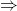
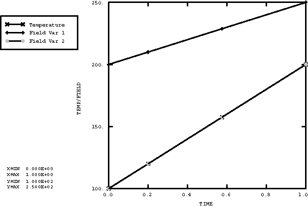
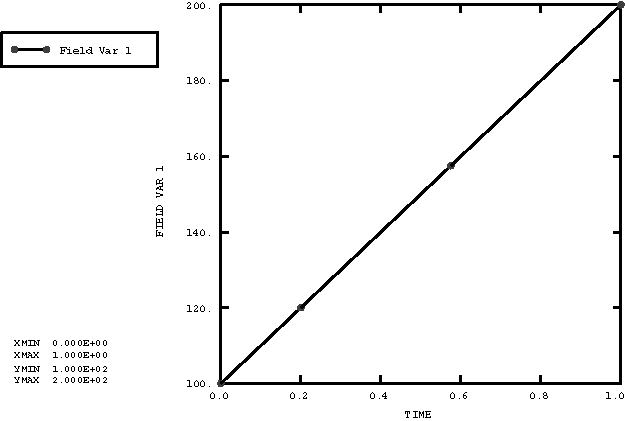
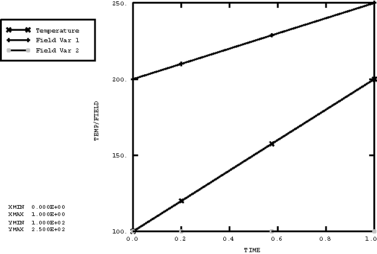
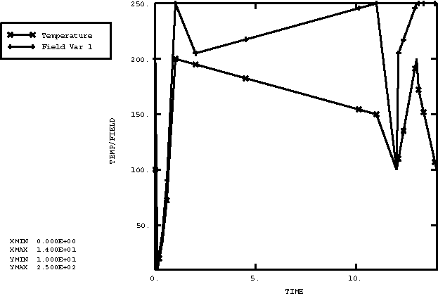
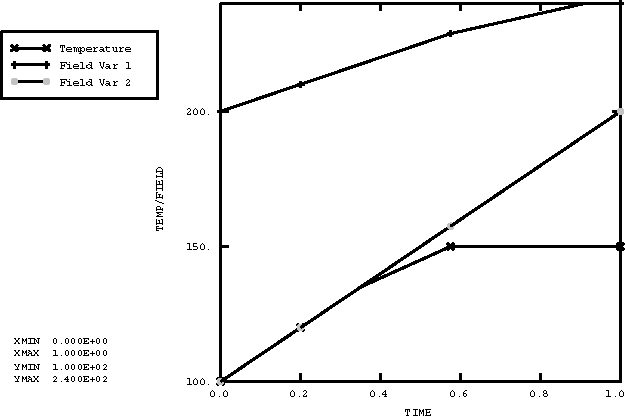
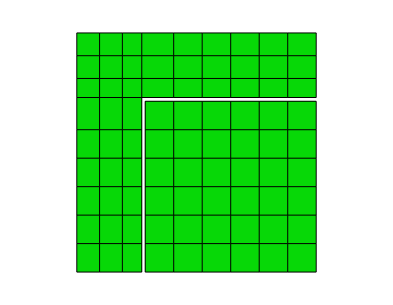
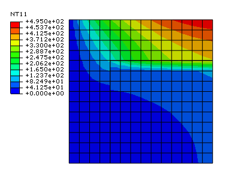
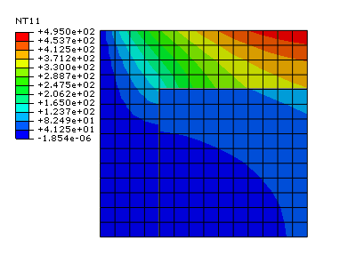
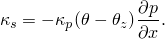

# 5.1.26 Defining temperature, field variable, and pressure stress values

**Products: **Abaqus/Standard  Abaqus/Explicit  

### Features tested

Applications of the temperature, field variable, and pressure stress procedures are tested. The first set of tests verifies that temperature and field variable data are properly transferred from a heat transfer analysis to a structural analysis. The second set of tests verifies the use of these commands in conjunction with composite structural shells. The third set of tests verifies the interpolation of temperatures to the midside nodes in a sequential thermal-stress analysis, when the heat transfer analysis is carried out using first-order elements and the stress analysis is carried out using second-order elements. The fourth set of tests verifies that temperatures are properly interpolated between dissimilar meshes. Heat transfer models and stress analysis models may have dissimilar meshes, and the nodal temperatures for the current model will be interpolated from the nodal temperatures from the heat transfer model. The fifth set of tests verifies that temperatures and pressures are properly defined using data line input for various combinations of these two commands. The fifth set of tests verifies that a solution-dependent variable from a heat transfer analysis is properly transferred as a field variable into a stress analysis. 

In several of the tests zero-increment results file output is requested. This output is used to define initial values of temperature, field variables, and pressure stress for subsequent structural analyses.

### I. Reading temperature and field variable data from results files

### Elements tested

DC1D2    T3D2    

### Problem description

These tests verify that temperature and field variable values are properly transferred to a structure. The structure being analyzed is a cantilevered truss made up of 10 T3D2 elements.

Three different transient heat transfer runs are used to generate three results files containing temperature histories. These files will be read into subsequent stress analyses as either temperature or field variable data. All of the runs begin with the entire truss at some initial temperature; the temperature throughout the truss is then ramped to some new temperature.

The three heat transfer runs are as follows:

**xtfvtrt1.inp**

Initial temperature: 100

Final temperature: 200

**xtfvtrt2.inp**

Initial temperature: 200

Final temperature: 250

**xtfvtrt3.inp**

Initial temperature: 200

Final temperature, Step 1: 180

Final temperature, Step 2: 100

The subsequent stress analysis runs are as follows:

**xtfvtrs1.inp**

This file tests the setting of temperature and more than one field variable using results files. Temperature and two field variables are set by reading the data from the results files of the heat transfer runs as follows:

xtfvtrt1.fil  Temperature

xtfvtrt2.fil  Field variable 1

xtfvtrt1.fil  Field variable 2

**xtfvtrs2.inp**

This file tests the setting of a field variable from a results file without temperature being present in the problem. This test is important because of the way that temperatures and field variables are stored internally. The field variable is set by reading the data from the results file of the first heat transfer run as follows:

xtfvtrt1.fil  Field variable

**xtfvtrs3.inp**

This file tests the presence of temperatures and field variables when initial condition specifications are present for variables that are not used in the analysis. Initial conditions are given for temperature and two field variables, and then only temperature and the first field variable are set by results files. In addition, two procedures are included for the same field variable to test that only the last command is used. Temperature and the field variable are set by reading the data from the results files of the heat transfer runs as follows:

xtfvtrt1.fil  Temperature

xtfvtrt2.fil  Field variable 1

**xtfvtrs4.inp**

This is a three-step problem involving temperature and one field variable. In the first step an amplitude curve is used to set the temperature to 200 and the field variable to 250. In the second step the temperature is ramped down to 150, and the field variable is defined by the results file from xtfvtrt2.fil. In the third step both the temperature and the field variable are reset to their initial conditions.

The following must be confirmed by this test:
- Temperatures and field variables must be set correctly using an amplitude curve.
- Initial conditions must be ignored if temperatures and field variables are set using an amplitude curve.
- Results file data must be scaled properly in time if the stress analysis time period is different from the heat analysis time period.
- If commands are given to read temperature/field variable data both from data lines and from a results file, the data line input must take precedence.
- If the OP parameter is given with a value of NEW, temperatures/field variables must be ramped back to initial conditions or set to the new values defined on the data lines.

**xtfvtrsr.inp**

This analysis restarts xtfvtrs4.inp from the third step. Two additional steps are performed. In the first step the temperature is set by reading the results file from xtfvtrt1.fil, and the field variable is set by reading the results file from xtfvtrt2.fil. In the second step the temperature is set using the data from the second step of the results file from xtfvtrt3.fil.

**xtfvtrs5.inp**

This run sets the beginning and end step and increment numbers for the history data in temperature and field values. Temperature and two field variables are set by reading the data from the results files of the heat transfer runs as follows:

xtfvtrt1.fil  Temperature, Beginning increment=1, End increment=5

xtfvtrt2.fil  Field variable 1, Beginning increment=5, End increment=8

xtfvtrt1.fil  Field variable 2, Beginning increment=6, End increment=10

All data are read from Step 1, so the beginning and end step are both 1 in all cases.

### Results and discussion

The exact solution to the heat transfer problems ([xtfvtrt1.inp](../eif/xtfvtrt1.inp), [xtfvtrt2.inp](../eif/xtfvtrt2.inp)) consists of a linear temperature history. Temperature is uniform throughout the structure at each point in time. The solution given by Abaqus matches the exact solution.

The only quantity of interest in the stress analysis runs is the temperature in the structure. Expected solutions are shown in [Figure 5.1.26--1](ch05s01abv342.md#vertempfield-run1) through [Figure 5.1.26--5](ch05s01abv342.md#vertempfield-run5).

### Input files

[xtfvtrt1.inp](../eif/xtfvtrt1.inp)

Truss, heat transfer, first run.

[xtfvtrt2.inp](../eif/xtfvtrt2.inp)

Truss, heat transfer, second run.

[xtfvtrt3.inp](../eif/xtfvtrt3.inp)

Truss, heat transfer, third run.

[xtfvtrs1.inp](../eif/xtfvtrs1.inp)

Truss, stress analysis, first run.

[xtfvtrs2.inp](../eif/xtfvtrs2.inp)

Truss, stress analysis, second run.

[xtfvtrs3.inp](../eif/xtfvtrs3.inp)

Truss, stress analysis, third run.

[xtfvtrs4.inp](../eif/xtfvtrs4.inp)

Truss, stress analysis, fourth run.

[xtfvtrsr.inp](../eif/xtfvtrsr.inp)

Truss, stress analysis, restart.

[xtfvtrs5.inp](../eif/xtfvtrs5.inp)

Truss, stress analysis, fifth run.

### Figures

**Figure 5.1.26–1** Temperature and field variables for [xtfvtrs1.inp](../eif/xtfvtrs1.inp).

**Figure 5.1.26–2** Field variable for [xtfvtrs2.inp](../eif/xtfvtrs2.inp).

**Figure 5.1.26–3** Temperature and field variable for [xtfvtrs3.inp](../eif/xtfvtrs3.inp).

**Figure 5.1.26–4** Temperature and field variable for [xtfvtrs4.inp](../eif/xtfvtrs4.inp) and [xtfvtrsr.inp](../eif/xtfvtrsr.inp).

**Figure 5.1.26–5** Temperature and field variables for [xtfvtrs5.inp](../eif/xtfvtrs5.inp).

### II. Composite shell temperature loads

### Problem description

In Abaqus/Standard these tests verify the use of predefined temperature and field variables in conjunction with composite structural shells. Both temperature and field variable results are generated from a single previously run heat transfer shell analysis. The same analysis can be used to generate field variable results since field variables are stored identically to temperatures in an Abaqus results file. 

A steady-state heat transfer analysis is performed to obtain the temperature distribution through the thickness of the composite layers. The heat transfer problem involves a three-layer composite shell that is subjected to prescribed thermal boundary conditions on its top and bottom surfaces.

In the subsequent structural shell models, five section points per layer are used. The temperatures and field variables are assigned to these five points through a linear interpolation of the three values available per layer from the preceding heat transfer analysis. The results of these analyses verify that the temperatures and field variables are assigned properly.

In Abaqus/Explicit, instead of a sequential analysis, a transient coupled dynamic temperature-displacement analysis is performed on a three-layer composite shell that is subjected to prescribed thermal boundary conditions on its top and bottom surfaces. A sufficiently large step time is prescribed such that the analysis can reach the steady-state regime. Three temperature points are used for each layer. The temperature distribution obtained is compared to the exact solution.

### Results and discussion

The heat transfer run matches the exact solution for the temperature distribution through the composite shell layers. In addition, these values are transferred properly in Abaqus/Standard to the structural composite shell as either temperature or a field variable. In Abaqus/Explicit both heat-transfer and stress analyses are solved simultaneously, and the results match the analytical solution and the Abaqus/Standard solution.
- The temperature/field variable at the bottom of layer 1 is 425.
- The temperature/field variable at the top of layer 1 and the bottom of layer 2 is 373.2.
- The temperature/field variable at the top of layer 2 and the bottom of layer 3 is 336.8.
- The temperature/field variable at the top of layer 3 is 287.5.

There is a linear variation of temperature or field variable between the top and bottom of each layer.

### Input files

[xtmpcst3.inp](../eif/xtmpcst3.inp)

Heat transfer analysis; DS3 elements.

[xtmpcss3.inp](../eif/xtmpcss3.inp)

Stress analysis; temperature results; DS3 elements.

[xfvcss3x.inp](../eif/xfvcss3x.inp)

Stress analysis; field variable results; DS3 elements.

[xtmpcst4.inp](../eif/xtmpcst4.inp)

Heat transfer analysis; DS4 elements.

[xtmpcst4.f](../eif/xtmpcst4.f)

User subroutine [`FILM`](../sub/sub-link.md#sub-xsl-film) used in xtmpcst4.inp.

[xtmpcss4.inp](../eif/xtmpcss4.inp)

Stress analysis; temperature results; DS4 elements.

[xfvcss4x.inp](../eif/xfvcss4x.inp)

Stress analysis; field variable results; DS4 elements.

[xtmpcst6.inp](../eif/xtmpcst6.inp)

Heat transfer analysis; DS6 elements.

[xtmpcss6.inp](../eif/xtmpcss6.inp)

Stress analysis; temperature results; DS6 elements.

[xfvcss6x.inp](../eif/xfvcss6x.inp)

Stress analysis; field variable results; DS6 elements.

[xtmpcst8.inp](../eif/xtmpcst8.inp)

Heat transfer analysis; DS8 elements.

[xtmpcss8.inp](../eif/xtmpcss8.inp)

Stress analysis; temperature results; DS8 elements.

[xfvcss8x.inp](../eif/xfvcss8x.inp)

Stress analysis; field variable results; DS8 elements.

[compshell_tempload_s4rt_xpl.inp](../eif/compshell_tempload_s4rt_xpl.inp)

Dynamic temperature-displacement analysis; Abaqus/Explicit; S4RT elements.

[compshell_tempload_s3rt_xpl.inp](../eif/compshell_tempload_s3rt_xpl.inp)

Dynamic temperature-displacement analysis; Abaqus/Explicit; S3RT elements.

### III. Temperature interpolation to midside nodes

### Problem description

These tests verify the interpolation of temperatures to the midside nodes of higher-order elements in a sequential thermal-stress analysis, when the heat transfer analysis is performed using first-order elements and the stress analysis is carried out using second-order elements.

The results of the heat transfer analyses are read into the stress analyses, and the initial conditions applied to the heat transfer analysis are read into the stress analyses. In both analyses the temperatures at the midside nodes are interpolated from the corner nodes of the element. Temperature interpolation is carried out on an edgewise basis for each element. Thus, the temperature at the midside node of an element is interpolated linearly from the temperatures at the corresponding corner nodes.

The midside node temperature interpolation is tested for one-dimensional, two-dimensional, and three-dimensional elements.

Only one element is used in the finite element models for both heat transfer analysis and stress analysis. Arbitrary material properties are assumed.

### Results and discussion

The results of the stress analysis with higher-order elements compare well with those obtained with linear elements.

### Input files

#### Heat transfer analyses:

[xtdc1d2h.inp](../eif/xtdc1d2h.inp)

DC1D2 elements.

[xtdc2d3h.inp](../eif/xtdc2d3h.inp)

DC2D3 elements.

[xtdc2d4h.inp](../eif/xtdc2d4h.inp)

DC2D4 elements.

[xtdc3d4h.inp](../eif/xtdc3d4h.inp)

DC3D4 elements.

[xtdc3d6h.inp](../eif/xtdc3d6h.inp)

DC3D6 elements.

[xtdc3d8h.inp](../eif/xtdc3d8h.inp)

DC3D8 elements.

#### Stress analyses using Abaqus/Standard:

[xtc3d10s.inp](../eif/xtc3d10s.inp)

C3D10 elements.

[xtc3d10ms.inp](../eif/xtc3d10ms.inp)

C3D10M elements.

[xtc3d15s.inp](../eif/xtc3d15s.inp)

C3D15 elements.

[xtc3d20s.inp](../eif/xtc3d20s.inp)

C3D20 elements.

[xtcpe6ss.inp](../eif/xtcpe6ss.inp)

CPE6 elements.

[xtcpe6ms.inp](../eif/xtcpe6ms.inp)

CPE6M elements.

[xtcpe8ss.inp](../eif/xtcpe8ss.inp)

CPE8 elements.

[xtt2d3ss.inp](../eif/xtt2d3ss.inp)

T2D3 elements.

#### Stress analyses using Abaqus/Explicit:

[xtc3d10ms_xpl.inp](../eif/xtc3d10ms_xpl.inp)

C3D10M elements.

[xtcpe6ms_xpl.inp](../eif/xtcpe6ms_xpl.inp)

CPE6M elements.

The input files for the stress analyses with linear elements can be generated by suitably replacing the element type in the above files.

### IV. Temperature interpolation between dissimilar meshes

### Problem description

These tests verify the interpolation of temperatures between dissimilar meshes. This capability is available only for use with the output database file. The temperatures must be interpolated from the nodes of the heat transfer models to the nodes of the current stress analysis models. For the cases where the only dissimilarity is an element order, the temperatures at the midside nodes should be interpolated from the corner nodes of the element. However, for the purpose of verification we reused some of the models created for the midside cases.

The results of the heat transfer (or coupled temperature-displacement) analyses are read into the stress analyses. The temperatures must be interpolated from the nodes of the element in the heat transfer models to the nodes of the current stress analysis models.

The interpolation technique is tested for two-dimensional and three-dimensional elements.

### Results and discussion

The temperature distribution in the stress analysis models compares well with that obtained in the heat transfer (coupled temperature-displacements) models.

### Input files

#### Coupled temperature-displacement and stress analyses:

[pgc38ths.inp](../eif/pgc38ths.inp)

C3D8HT elements. NT field written to the output database.

[psc38ths_inter.inp](../eif/psc38ths_inter.inp)

C3D8H elements. Static analysis with the temperature field interpolated from psc38ths_inter.inp.

#### Heat transfer analyses:

[xtdc2d3h.inp](../eif/xtdc2d3h.inp)

DC2D3 elements.

[xtdc2d4h.inp](../eif/xtdc2d4h.inp)

DC2D4 elements.

[xtdc3d4h.inp](../eif/xtdc3d4h.inp)

DC3D4 elements.

[xtdc3d6h.inp](../eif/xtdc3d6h.inp)

DC3D6 elements.

[pgce4shm_inter.inp](../eif/pgce4shm_inter.inp)

DC2D4 elements.

[SoFoTiedMixMesh.inp](../eif/SoFoTiedMixMesh.inp)

DC3D8, DC3D10 elements.

[xtcds4.inp](../eif/xtcds4.inp)

DS4 elements.

#### Stress analyses using Abaqus/Standard:

[xtc3d10s_interpolate.inp](../eif/xtc3d10s_interpolate.inp)

C3D10 elements.

[xtc3d10ms_interpolate.inp](../eif/xtc3d10ms_interpolate.inp)

C3D10M elements.

[xtc3d15s_interpolate.inp](../eif/xtc3d15s_interpolate.inp)

C3D15 elements.

[xtcpe6ms_interpolate.inp](../eif/xtcpe6ms_interpolate.inp)

CPE6M elements.

[sub_driven.inp](../eif/sub_driven.inp)

C3D8 elements.

[xtcpe8ss_interpolate.inp](../eif/xtcpe8ss_interpolate.inp)

CPE8 elements.

[psce4sh1_inter.inp](../eif/psce4sh1_inter.inp)

CPE4 elements.

[psce4sh1_inter_res.inp](../eif/psce4sh1_inter_res.inp)

CPE4 elements, multistep, static analysis.

[restart_psce4sh1_inter.inp](../eif/restart_psce4sh1_inter.inp)

CPE4 elements, restart analysis.

[xtcs4rs_interpolate.inp](../eif/xtcs4rs_interpolate.inp)

S4R elements.

#### Stress analyses using Abaqus/Explicit:

[xtc3d10ms_interpolate_xpl.inp](../eif/xtc3d10ms_interpolate_xpl.inp)

C3D10M elements.

[xtcpe6ms_interpolate_xpl.inp](../eif/xtcpe6ms_interpolate_xpl.inp)

CPE6M elements.

### V. Transferring temperatures between dissimilar meshes with user-specified regions

### Problem description

The verification problems in this section test the interpolation of temperatures between dissimilar meshes with user-specified regions. The model consists of two part instances, as shown in [Figure 5.1.26--6](ch05s01abv342.md#ver-prc-drivingelsets-model). A tiny gap exists between the two parts. A low gap heat transfer is applied along the gap so that a temperature jump results between the two adjacent surfaces. In this case temperature mapping using the general interpolation may result in erroneous temperature assignment to nodes on the adjacent surface due to the ambiguous association between target nodes near the interface surface and driving elements near this surface. The dissimilar mesh interpolation capability resolves the ambiguity by explicitly specifying the source regions in the heat transfer analysis from where the temperatures are read and the target regions in the current analysis onto which the temperatures are mapped.

**Figure 5.1.26–6** Model geometry with the gap amplified for illustration purposes.

**Boundary conditions: **

The assembly is kept at a constant temperature of zero on the left boundary, and it is subjected to a constant surface heat flux of 0.003 on the right boundary and a constant surface heat flux of 1 on the top. The gap has a low gap heat conduction with a coefficient of 0.01. 

### Results and discussion

The nodes on the top boundary of the inner part in the current analysis are shifted up slightly so that they fall inside the outer part. This shift is done intentionally to illustrate a case that would result in incorrect driving element selection during interpolation. The mapped temperature results when the dissimilar mesh interpolation capability is not specified are shown in [Figure 5.1.26--7](ch05s01abv342.md#ver-prc-no-drivingelsets). The test shows that the temperatures when regions are not specified for the interpolation of temperatures between dissimilar meshes are mapped incorrectly  for those nodes on the top surface of the inner part. The error occurs because Abaqus searches for a parent element that encloses each node in the current analysis or is closest to each node. For the nodes on the top surface of the inner part, the parent elements are found inside the outer part, resulting in erroneous temperature definitions at the nodes. The mapped temperature results with the dissimilar mesh interpolation capability are shown in [Figure 5.1.26--8](ch05s01abv342.md#ver-prc-drivingelsets). The capability fixes the error by explicitly specifying the source and the target regions of the interpolations. In this test case the driving element set from the previous heat transfer analysis is selected to cover the same instance region as that covered by the driven node set in the current analysis; therefore, instance-to-instance mapping is achieved.

**Figure 5.1.26–7** Temperature mapping without use of the dissimilar mesh interpolation capability.

**Figure 5.1.26–8** Temperature mapping with dissimilar mesh interpolation capability specified.

### Input files

[pgdc2d4.inp](../eif/pgdc2d4.inp)

Ancestor heat transfer analysis.

[psdc2d4-no-drivingelsets.inp](../eif/psdc2d4-no-drivingelsets.inp)

Descendant model with no DRIVING ELSETS (Abaqus/Standard).

[psdc2d4-drivingelsets.inp](../eif/psdc2d4-drivingelsets.inp)

Descendant model with DRIVING ELSETS (Abaqus/Standard).

[psdc2d4-no-drivingelsets-xpl.inp](../eif/psdc2d4-no-drivingelsets-xpl.inp)

Descendant model with no DRIVING ELSETS (Abaqus/Explicit).

[psdc2d4-drivingelsets-xpl.inp](../eif/psdc2d4-drivingelsets-xpl.inp)

Descendant model with DRIVING ELSETS (Abaqus/Explicit).

### VI. Reading temperature and pressure data from results files

### Elements tested

CPE4    DC2D4    

### Problem description

These tests verify that temperatures and pressures are applied properly to a structure when various combinations of temperature and pressure stress values are used in a mass diffusion analysis. Temperature and pressure stress initial conditions are read from the results file of an Abaqus/Standard analysis, and a series of pressure and temperature loadings are applied to the nodes of an element using data line input in the following sequence:
- Step 1: Concentration ramped from 0 to 100 at a corner of the element.
- Step 2: A pressure gradient is applied along one diagonal of the element.
- Step 3: All pressures are reset to initial conditions.
- Step 4: A temperature gradient is applied along the same element diagonal as the pressure gradient in Step 2.
- Step 5: All temperatures are reset to initial conditions.
- Step 6: Pressure and temperature gradients are applied simultaneously along the element diagonal.

The material properties of the problem are defined such that

When both the temperature and pressure gradients are applied to the model, the diffusion is driven by concentration gradients alone.

The following must be confirmed by this test:
- Pressures must be set correctly using an amplitude curve.
- If existing values are removed, temperatures/pressures must be ramped back to their initial conditions or set to the new values defined on the data lines.

### Results and discussion

The results match the exact analytical solutions for the applied temperature and pressure gradients.

### Input files

[xpressic.inp](../eif/xpressic.inp)

This analysis generates a results file with temperature and pressure stress data, which is used to define initial conditions in xpresspt.inp.

[xpresspt.inp](../eif/xpresspt.inp)

This file tests the setting of temperature and pressure using data line input, as outlined earlier.

[xpressre.inp](../eif/xpressre.inp)

This analysis restarts the second step of xpresspt.inp from increment 2. Results at the end of the analysis should be identical to the results at the end of the second step in xpresspt.inp.

### VII. Reading solution-dependent variables from results files

### Elements tested

DC1D2    T3D2    

### Problem description

These tests verify that the solution-dependent variables from a heat transfer analysis are properly transferred as field variables in the subsequent stress analysis. The structure being analyzed is a cantilevered truss made up of 10 one-dimensional link elements. The solution-dependent state variables written to the results file are the averages of the values extrapolated to the element nodes. A separate results file is then generated, where the solution-dependent state variables value is stored as the second attribute under record key 201.

The temperature and field variable values are set by reading the data from the results file of the heat transfer run as follows:

xsdvttrt.fil  Temperature

xsdvttrt1.fil  Field variable

### Results and discussion

The solution-dependent variable is transferred correctly into the stress analysis as a field variable.

### Input files

[xsdvttrt.inp](../eif/xsdvttrt.inp)

Heat transfer analysis.

[xsdvttrt.f](../eif/xsdvttrt.f)

User subroutine [`HETVAL`](../sub/sub-link.md#sub-xsl-hetval) used in xsdvttrt.inp.

[xsdvttrs.inp](../eif/xsdvttrs.inp)

Stress analysis.

[xsdvt.f](../eif/xsdvt.f)

Postprocessing program.

### VIII. Reading scalar nodal output from the output database into field variables

### Elements tested

CPE3    CPE4    CPE4R    CPE6    CPE6M    CPE8    CPE8R    

C3D4    C3D6    C3D8    C3D10    C3D10M    C3D15    C3D20R    

### Problem description

These tests verify that Abaqus/Standard: 
- can properly read and interpolate nodal output variables such as temperature, normalized concentrations, and electric potential fields from an output database. Further, these are initialized and defined as field variables in a subsequent analysis using the initial conditions, temperature, and field variable procedures;
- can read and interpolate results correctly from different analyses and meshes; and
- can allow a combination of volumetric expansion terms driven by temperature and/or field variables in the same material definition.

The basic test procedure is as follows: A set of initial two- and three-dimensional heat transfer, mass diffusion, and piezoelectric analyses are run. In these analyses temperatures, normalized concentrations, and electric potentials are written as nodal data to output databases. Different combinations of temperature, normalized concentrations, and electric potential fields are read from these analyses and used to initialize and define temperature and field variables in subsequent stress/displacement analyses. Using the thermal and field expansion capability in Abaqus/Standard, the temperatures and field variables are used to drive the displacement fields by imposing volumetric strains.

### Results and discussion

The tests verify that temperature, normalized temperature, and electric potential fields are properly read and interpolated from an output database to initialize and define field variables.

### Input files

[heattransfer2d.inp](../eif/heattransfer2d.inp)

Two-dimensional heat transfer analysis using different continuum heat transfer elements; temp_nnc_epot.f is used to drive the temperatures.

[heattransfer_dc2d4.inp](../eif/heattransfer_dc2d4.inp)

Two-dimensional heat transfer analysis using DC2D4 heat transfer elements; temp_nnc_epot.f is used to drive the temperatures.

[heattransfer3d.inp](../eif/heattransfer3d.inp)

Three-dimensional heat transfer analysis using different continuum heat transfer elements; temp_nnc_epot.f is used to drive the temperatures.

[heattransfer_dc3d8.inp](../eif/heattransfer_dc3d8.inp)

Three-dimensional heat transfer analysis using DC3D8 heat transfer elements; temp_nnc_epot.f is used to drive the temperatures.

[massdiffusion2d.inp](../eif/massdiffusion2d.inp)

Two-dimensional mass diffusion analysis using different continuum mass diffusion elements; temp_nnc_epot.f is used to drive the normalized concentrations.

[massdiffusion_dc2d4.inp](../eif/massdiffusion_dc2d4.inp)

Two-dimensional mass diffusion analysis using DC2D4 mass diffusion elements; temp_nnc_epot.f is used to drive the normalized concentrations.

[massdiffusion3d.inp](../eif/massdiffusion3d.inp)

Three-dimensional mass diffusion analysis using different continuum mass diffusion elements; temp_nnc_epot.f is used to drive the normalized concentrations.

[massdiffusion_dc3d8.inp](../eif/massdiffusion_dc3d8.inp)

Three-dimensional mass diffusion analysis using DC3D8 mass diffusion elements; temp_nnc_epot.f is used to drive the normalized concentrations.

[piezoelectric2d.inp](../eif/piezoelectric2d.inp)

Two-dimensional piezoelectric analysis using different continuum piezoelectric elements; temp_nnc_epot.f is used to drive the electric potentials.

[piezoelectric_cpe4e.inp](../eif/piezoelectric_cpe4e.inp)

Two-dimensional piezoelectric analysis using CPE4E piezoelectric elements; temp_nnc_epot.f is used to drive the electric potentials.

[piezoelectric3d.inp](../eif/piezoelectric3d.inp)

Three-dimensional piezoelectric analysis using different continuum piezoelectric elements; temp_nnc_epot.f is used to drive the electric potentials.

[piezoelectric_c3d8e.inp](../eif/piezoelectric_c3d8e.inp)

Three-dimensional piezoelectric analysis using C3D8E piezoelectric elements; temp_nnc_epot.f is used to drive the electric potentials.

[temp_nnc_epot.f](../eif/temp_nnc_epot.f)

User subroutine [`DISP`](../sub/sub-link.md#sub-xsl-disp) used to drive heat transfer, mass diffusion, and piezoelectric analyses.

[static_temp_2d.inp](../eif/static_temp_2d.inp)

Two-dimensional stress analysis that has volumetric expansion coming from temperatures. The temperature field is read from heattransfer_2d.inp. 

[static_nnc_2d.inp](../eif/static_nnc_2d.inp)

Two-dimensional stress analysis that has volumetric expansion coming from normalized concentrations. The normalized concentration field is read from massdiffusion_2d.inp. 

[static_epot_2d.inp](../eif/static_epot_2d.inp)

Two-dimensional stress analysis that has volumetric expansion coming from electric potentials. The electric potential field is read from piezoelectric_2d.inp. 

[static_temp_nnc_2d.inp](../eif/static_temp_nnc_2d.inp)

Two-dimensional stress analysis that has volumetric expansion coming from temperatures and normalized concentrations. The temperature field is read from heattransfer_2d.inp, and the normalized concentration field is read from massdiffusion_2d.inp. 

[static_temp_epot_2d.inp](../eif/static_temp_epot_2d.inp)

Two-dimensional stress analysis that has volumetric expansion coming from temperatures and electric potentials. The temperature field is read from heattransfer_2d.inp, and the electric potential field is read from piezoelectric_2d.inp. 

[static_nnc_epot_2d.inp](../eif/static_nnc_epot_2d.inp)

Two-dimensional stress analysis that has volumetric expansion coming from normalized concentrations and electric potentials. The normalized concentration field is read from massdiffusion_2d.inp, and the electric potential field is read from piezoelectric_2d.inp. 

[static_temp_nnc_epot_2d.inp](../eif/static_temp_nnc_epot_2d.inp)

Two-dimensional stress analysis that has volumetric expansion coming from temperatures, normalized concentrations, and electric potentials. The temperature field is read from heattransfer_2d.inp, the normalized concentration field is read from massdiffusion_2d.inp, and the electric potential field is read from piezoelectric_2d.inp. 

[static_temp_interp_2d.inp](../eif/static_temp_interp_2d.inp)

Two-dimensional stress analysis that has volumetric expansion coming from temperatures. The temperature field is read from heattransfer_dc2d4.inp. Temperatures are interpolated from two-dimensional quadrilateral meshes.

[static_nnc_interp_2d.inp](../eif/static_nnc_interp_2d.inp)

Two-dimensional stress analysis that has volumetric expansion coming from normalized concentrations. The normalized concentration field is read from massdiffusion_dc2d4.inp. Normalized concentrations are interpolated from two-dimensional quadrilateral meshes.

[static_epot_interp_2d.inp](../eif/static_epot_interp_2d.inp)

Two-dimensional stress analysis that has volumetric expansion coming from electric potentials. The electric potential field is read from piezoelectric_cpe4e.inp. Electric potentials are interpolated from two-dimensional quadrilateral meshes.

[static_temp_nnc_interp_2d.inp](../eif/static_temp_nnc_interp_2d.inp)

Two-dimensional stress analysis that has volumetric expansion coming from temperatures and normalized concentrations. The temperature field is read from heattransfer_dc2d4.inp, and the normalized concentration field is read from massdiffusion_dc2d4.inp. All fields are interpolated from two-dimensional quadrilateral meshes.

[static_temp_epot_interp_2d.inp](../eif/static_temp_epot_interp_2d.inp)

Two-dimensional stress analysis that has volumetric expansion coming from temperatures and electric potentials. The temperature field is read from heattransfer_dc2d4.inp, and the electric potential field is read from piezoelectric_cpe4e.inp. All fields are interpolated from two-dimensional quadrilateral meshes.

[static_nnc_epot_interp_2d.inp](../eif/static_nnc_epot_interp_2d.inp)

Two-dimensional stress analysis that has volumetric expansion coming from normalized concentrations and electric potentials. The normalized concentration field is read from massdiffusion_dc2d4.inp, and the electric potential field is read from piezoelectric_cpe4e.inp. All fields are interpolated from two-dimensional quadrilateral meshes.

[static_temp_nnc_epot_interp_2d.inp](../eif/static_temp_nnc_epot_interp_2d.inp)

Two-dimensional stress analysis that has volumetric expansion coming from temperatures, normalized concentrations, and electric potentials. The temperature field is read from heattransfer_dc2d4.inp, the normalized concentration field is read from massdiffusion_dc2d4.inp, and the electric potential field is read from piezoelectric_cpe4e.inp. All fields are interpolated from two-dimensional quadrilateral meshes.

[static_temp_3d.inp](../eif/static_temp_3d.inp)

Three-dimensional stress analysis that has volumetric expansion coming from temperatures. The temperature field is read from heattransfer_3d.inp. Temperatures are interpolated from three-dimensional hexahedral meshes.

[static_nnc_3d.inp](../eif/static_nnc_3d.inp)

Three-dimensional stress analysis that has volumetric expansion coming from normalized concentrations. The normalized concentration field is read from massdiffusion_3d.inp. 

[static_nnc_3d_rs.inp](../eif/static_nnc_3d_rs.inp)

Restart analysis of static_nnc_3d.inp.

[static_epot_3d.inp](../eif/static_epot_3d.inp)

Three-dimensional stress analysis that has volumetric expansion coming from electric potentials. The electric potential field is read from piezoelectric_3d.inp. 

[static_temp_nnc_3d.inp](../eif/static_temp_nnc_3d.inp)

Three-dimensional stress analysis that has volumetric expansion coming from temperatures and normalized concentrations. The temperature field is read from heattransfer_3d.inp, and the normalized concentration field is read from massdiffusion_3d.inp. 

[static_temp_epot_3d.inp](../eif/static_temp_epot_3d.inp)

Three-dimensional stress analysis that has volumetric expansion coming from temperatures and electric potentials. The temperature field is read from heattransfer_3d.inp, and the electric potential field is read from piezoelectric_3d.inp. 

[static_nnc_epot_3d.inp](../eif/static_nnc_epot_3d.inp)

Three-dimensional stress analysis that has volumetric expansion coming from normalized concentrations and electric potentials. The normalized concentration field is read from massdiffusion_3d.inp, and the electric potential field is read from piezoelectric_3d.inp.

[static_temp_nnc_epot_3d.inp](../eif/static_temp_nnc_epot_3d.inp)

Three-dimensional stress analysis that has volumetric expansion coming from temperatures, normalized concentrations, and electric potentials. The temperature field is read from heattransfer_3d.inp, the normalized concentration field is read from massdiffusion_3d.inp, and the electric potential field is read from piezoelectric_3d.inp. 

[static_temp_nnc_epot_3d_rs.inp](../eif/static_temp_nnc_epot_3d_rs.inp)

Restart analysis of static_temp_nnc_epot_3d.inp.

[static_temp_interp_3d.inp](../eif/static_temp_interp_3d.inp)

Three-dimensional stress analysis that has volumetric expansion coming from temperatures. The temperature field is read from heattransfer_dc3d8.inp. Temperatures are interpolated from three-dimensional hexahedral meshes.

[static_nnc_interp_3d.inp](../eif/static_nnc_interp_3d.inp)

Three-dimensional stress analysis that has volumetric expansion coming from normalized concentrations. The normalized concentration field is read from massdiffusion_dc3d8.inp. The normalized concentrations are interpolated from three-dimensional hexahedral meshes.

[static_epot_interp_3d.inp](../eif/static_epot_interp_3d.inp)

Three-dimensional stress analysis that has volumetric expansion coming from electric potentials. The electric potential field is read from piezoelectric_c3d8e.inp. The electric potentials are interpolated from three-dimensional hexahedral meshes.

[static_epot_interp_3d_rs.inp](../eif/static_epot_interp_3d_rs.inp)

Restart analysis of static_epot_interp_3d.inp.

[static_temp_epot_interp_3d.inp](../eif/static_temp_epot_interp_3d.inp)

Three-dimensional stress analysis that has volumetric expansion coming from temperatures and electric potentials. The temperature field is read from heattransfer_dc3d8.inp, and the electric potential field is read from piezoelectric_c3d8e.inp. All fields are interpolated from three-dimensional hexahedral meshes.

[static_nnc_epot_interp_3d.inp](../eif/static_nnc_epot_interp_3d.inp)

Three-dimensional stress analysis that has volumetric expansion coming from normalized concentrations and electric potentials. The normalized concentration field is read from massdiffusion_dc3d8.inp, and the electric potential field is read from piezoelectric_c3d8e.inp. All fields are interpolated from  three-dimensional hexahedral meshes.

[static_temp_nnc_epot_interp_3d.inp](../eif/static_temp_nnc_epot_interp_3d.inp)

Three-dimensional stress analysis that has volumetric expansion coming from temperatures, normalized concentrations, and electric potentials. The temperature field is read from heattransfer_dc3d8.inp, the normalized concentration field is read from massdiffusion_dc3d8.inp, and the electric potential field is read from piezoelectric_c3d8e.inp. All fields are interpolated from  three-dimensional hexahedral meshes.

[static_temp_nnc_epot_interp_3d_rs.inp](../eif/static_temp_nnc_epot_interp_3d_rs.inp)

Restart analysis of static_temp_nnc_epot_interp_3d.inp.

