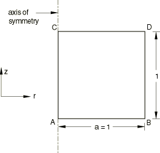
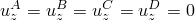
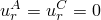
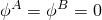
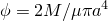
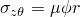

# 1.3.5 Axisymmetric solid elements with twist

**Product: **Abaqus/Standard  

### Elements tested

CGAX3    CGAX3H    CGAX3HT    CGAX3T    CGAX4    CGAX4H    CGAX4HT    CGAX4R    CGAX4RH    CGAX4RHT    CGAX4RT    CGAX4T    CGAX6    CGAX6H    CGAX6M    CGAX6MH    CGAX6MHT    CGAX6MT    CGAX8    CGAX8H    CGAX8HT    CGAX8R    CGAX8RH    CGAX8RHT    CGAX8RT    CGAX8T    

### Problem description

**Material: **

Linear elastic, Young's modulus = 106, Poisson's ratio = 0.3.

**Boundary conditions: **

; ; .

#### Step 1

A concentrated moment loading equivalent to a distributed moment loading *M* of 6402 is applied on top face CD.

**Analytical solution:**

**Twist**

 = 0.01 (on top face CD).

**Stresses**

.

### Results and discussion

All elements yield the analytical solution.

Section output requests to the results (`.fil`) file and to the data (`.dat`) file are used in some of the input files to output accumulated quantities on the face CD. The area of the face is 3.142.

### Input files

[eca3gfs3.inp](../eif/eca3gfs3.inp)

CGAX3 elements.

[eca3ghs3.inp](../eif/eca3ghs3.inp)

CGAX3H elements.

[eca3hhs3.inp](../eif/eca3hhs3.inp)

CGAX3HT elements.

[eca3hfs3.inp](../eif/eca3hfs3.inp)

CGAX3T elements.

[eca4gfs3.inp](../eif/eca4gfs3.inp)

CGAX4 elements.

[eca4ghs3.inp](../eif/eca4ghs3.inp)

CGAX4H elements.

[eca4hhs3.inp](../eif/eca4hhs3.inp)

CGAX4HT elements.

[eca4grs3.inp](../eif/eca4grs3.inp)

CGAX4R elements.

[eca4gys3.inp](../eif/eca4gys3.inp)

CGAX4RH elements.

[eca4hys3.inp](../eif/eca4hys3.inp)

CGAX4RHT elements.

[eca4hrs3.inp](../eif/eca4hrs3.inp)

CGAX4RT elements.

[eca4hfs3.inp](../eif/eca4hfs3.inp)

CGAX4T elements.

[eca6gfs3.inp](../eif/eca6gfs3.inp)

CGAX6 elements.

[eca6ghs3.inp](../eif/eca6ghs3.inp)

CGAX6H elements.

[eca6gks3.inp](../eif/eca6gks3.inp)

CGAX6M elements.

[eca6gls3.inp](../eif/eca6gls3.inp)

CGAX6MH elements.

[eca6hls3.inp](../eif/eca6hls3.inp)

CGAX6MHT elements.

[eca6hks3.inp](../eif/eca6hks3.inp)

CGAX6MT elements.

[eca8gfs3.inp](../eif/eca8gfs3.inp)

CGAX8 elements.

[eca8ghs3.inp](../eif/eca8ghs3.inp)

CGAX8H elements.

[eca8hhs3.inp](../eif/eca8hhs3.inp)

CGAX8HT elements.

[eca8grs3.inp](../eif/eca8grs3.inp)

CGAX8R elements.

[eca8gys3.inp](../eif/eca8gys3.inp)

CGAX8RH elements.

[eca8hys3.inp](../eif/eca8hys3.inp)

CGAX8RHT elements.

[eca8hrs3.inp](../eif/eca8hrs3.inp)

CGAX8RT elements.

[eca8hfs3.inp](../eif/eca8hfs3.inp)

CGAX8T elements.

