# 1.3.7 Loading of piezoelectric elements

**Product: **Abaqus/Standard  

### I. Plane stress and plane strain piezoelectric elements

### Elements tested

CPS3E    CPS4E    CPS6E    CPS8E    CPS8RE    CPE3E    CPE4E    CPE6E    CPE8E    CPE8RE    

### Problem description

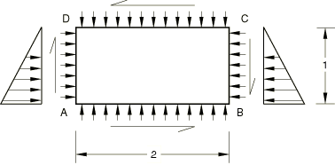

**Material: **

Linear elastic, Young's modulus = 30  106, Poisson's ratio = 0.3, no piezoelectric coupling, isotropic dielectric constant 1.0  103.

**Boundary conditions: **

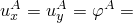 0, 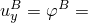 0.

**Loading: **

Distributed pressure of 1000/length on each edge.

Equivalent concentrated shear forces corresponding to distributed shear loading of 1000/length on each edge in the directions shown.

Distributed charges of 1000/length on each edge.

Concentrated charges at each node to negate the distributed charges, except for the distributed charge of 1000/length on the top surface.

### Reference solution

**Stresses**

Both plane stress and plane strain elements,

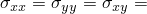 1000;

and for plane strain elements,

 600.

**Strains**

Plane strain elements,

 1.7333  105, 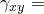 8.6667  105.

Plane stress elements,

 2.3333  105,  8.6667  105.

**Electrical fluxes**

Both plane stress and plane strain elements, 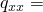 0, 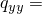 1000.

**Electrical potential gradients**

Both plane stress and plane strain elements, 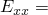 0, 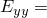 1.0  106.

**Displacements**

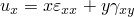, 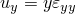.

**Potentials**

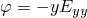.

### Results and discussion

Elements using reduced integration may have additional boundary conditions to those specified above. All elements yield exact solutions.

Section output requests to the results (`.fil`) file and to the data (`.dat`) file are used in some of the input files to output accumulated quantities on the face in the *x*–*y* plane.

### Input files

[ecs3efs1.inp](../eif/ecs3efs1.inp)

CPS3E elements.

[ecs4efs1.inp](../eif/ecs4efs1.inp)

CPS4E elements.

[ecs6efs1.inp](../eif/ecs6efs1.inp)

CPS6E elements.

[ecs8efs1.inp](../eif/ecs8efs1.inp)

CPS8E elements.

[ecs8ers1.inp](../eif/ecs8ers1.inp)

CPS8RE elements.

[ece3efs1.inp](../eif/ece3efs1.inp)

CPE3E elements.

[ece4efs1.inp](../eif/ece4efs1.inp)

CPE4E elements.

[ece6efs1.inp](../eif/ece6efs1.inp)

CPE6E elements.

[ece8efs1.inp](../eif/ece8efs1.inp)

CPE8E elements.

[ece8ers1.inp](../eif/ece8ers1.inp)

CPE8RE elements.

### II. Three-dimensional piezoelectric elements

### Elements tested

C3D4E    C3D6E    C3D8E    C3D10E    C3D15E    C3D20E    C3D20RE    

### Problem description

**Material: **

Linear elastic, Young's modulus 30  106, Poisson's ratio 0.3, no piezoelectric coupling, isotropic dielectric constant 1.0  103.

**Boundary conditions: **

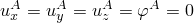, 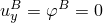, 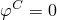, 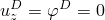, 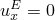.

**Loading: **

Distributed pressure of 1000/area on each face, and equivalent concentrated forces for shear loading, defined such that all three shear stresses are of magnitude 1000.

Distributed charges of 1000/area on each face.

Concentrated charges at each node to negate the distributed charges, except for the distributed charge of 1000/area on the top surface.

### Reference solution

**Stresses**

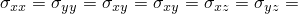 1000.

**Strains**

 1.3333  105,  8.6667  105.

**Electrical fluxes**

 0,  0, 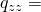 1000.

**Electrical potential gradients**

 0, 0, 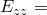 1.0  106.

**Displacements**

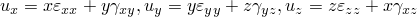.

**Potentials**

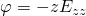.

### Results and discussion

Elements using reduced integration may have additional boundary conditions to those specified above. All elements yield exact solutions.

Section output requests to the results (`.fil`) file and to the data (`.dat`) file are used in some of the input files to output accumulated quantities on the face in the *x*–*y* plane.

### Input files

[ec34efs2.inp](../eif/ec34efs2.inp)

C3D4E elements.

[ec36efs2.inp](../eif/ec36efs2.inp)

C3D6E elements.

[ec38efs2.inp](../eif/ec38efs2.inp)

C3D8E elements.

[ec3aefs2.inp](../eif/ec3aefs2.inp)

C3D10E elements.

[ec3fefs2.inp](../eif/ec3fefs2.inp)

C3D15E elements.

[ec3kefs2.inp](../eif/ec3kefs2.inp)

C3D20E elements.

[ec3kers2.inp](../eif/ec3kers2.inp)

C3D20RE elements.

### III. Axisymmetric piezoelectric elements

### Elements tested

CAX3E    CAX4E    CAX6E    CAX8E    CAX8RE    

### Problem description

**Material: **

Linear elastic, Young's modulus 30  106, Poisson's ratio 0.3, no piezoelectric coupling, isotropic dielectric constant 1.0  103.

**Boundary conditions: **

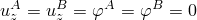.

**Loading: **

Distributed pressure of 1000/area on each face.

Distributed charges of 1000/area on each face.

Concentrated charges at each node to negate the distributed charges, except for the distributed charge of 1000/area on the top surface.

### Reference solution

**Stresses**

 1000,  0.

**Strains**

 1.3333  105,  0.

**Electrical fluxes**

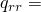 0,  1000.

**Electrical potential gradients**

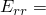 0,  1.0  106.

**Displacements**

 = 1.33  102 along  1000,  1.33  105*z*.

**Potentials**

.

### Results and discussion

Elements using reduced integration may have additional boundary conditions to those specified above. All elements yield exact solutions.

Section output requests to the results (`.fil`) file and to the data (`.dat`) file are used in some of the input files to output accumulated quantities on the face in the *x*–*y* plane.

### Input files

[eca3efs3.inp](../eif/eca3efs3.inp)

CAX3E elements.

[eca4efs3.inp](../eif/eca4efs3.inp)

CAX4E elements.

[eca6efs3.inp](../eif/eca6efs3.inp)

CAX6E elements.

[eca8efs3.inp](../eif/eca8efs3.inp)

CAX8E elements.

[eca8ers3.inp](../eif/eca8ers3.inp)

CAX8RE elements.

