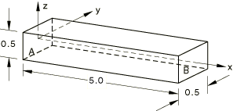

# 1.3.8 Love-Kirchhoff beams and shells

**Product: **Abaqus/Standard  

### Elements tested

B23    B23H    B33    B33H    STRI3    STRI65    

### Problem description

A three-dimensional problem is shown here. It may be particularized for two-dimensional beam elements.

**Material: **

Linear elastic, Young's modulus = 30  106, Poisson's ratio = 0.3.

**Boundary conditions: **

 at end *A*,  at end *B*.

**Loading: **

 25.0 at end *A*,  100.0 at end *B*. Only , , and  are applied for shell models.

Gauss integration is used for the shell cross-section for element STRI3.

### Reference solution

**Displacements in beam elements**

 = 1.667  105,  = 1.333  103,  = 0.01467 at node *A*,

 = 4.92  103,  = 5.2  103,  = 1.2  103 at node.

**Stress resultants in beam elements**

 25.0,  25(1  *x*),  100 + 25(5  ),  100.0.

**Displacements in shell elements**

 1.667  105,  0.01467 at node *A*,  5.2  103 at node *B*.

### Results and discussion

Beam elements yield exact solutions. 3-node shell elements yield exact solutions for  and  but yield a value of 0.01412 for . 6-node shell elements yield exact solutions for  and  but yield a value of 0.01464 for .

### Input files

[eb2arxs4.inp](../eif/eb2arxs4.inp)

B23 elements.

[eb2jrxs4.inp](../eif/eb2jrxs4.inp)

B23H elements.

[eb3arxs4.inp](../eif/eb3arxs4.inp)

B33 elements.

[eb3jrxs4.inp](../eif/eb3jrxs4.inp)

B33H elements.

[es63sxs4.inp](../eif/es63sxs4.inp)

STRI3 elements.

[es56sxs4.inp](../eif/es56sxs4.inp)

STRI65 elements.

