# 1.3.9 Shear flexible beams and shells: I

**Products: **Abaqus/Standard  Abaqus/Explicit  

### Elements tested

B21    B21H    B22    B22H    B31    B31H    B31OS    B31OSH    B32    B32H    B32OS    B32OSH    

PIPE21    PIPE21H    PIPE22    PIPE22H    PIPE31    PIPE31H    PIPE32    PIPE32H    

S4    S4R    S4R5    S8R    S8R5    S9R5    

### Problem description

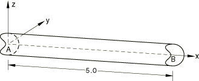

A three-dimensional problem is shown here, which can be particularized for two-dimensional beam elements.

**Material: **

Linear elastic, Young's modulus = 30  106, Poisson's ratio = 0.3.

**Boundary conditions: **

 at end *A*, 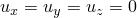 at end *B*.

**Loading: **

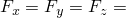 25.0 at end *A*. Only  and  are applied for shell models.

**Section properties: **

 0.25,  1  106,  0.0104167. The bending inertias have intentionally been chosen as very large values in order to test the shear-only modes.

For pipe elements a circular cross-section of outer radius 0.5 and wall thickness 0.05 is used. For this case a different analytical solution based upon Timoshenko theory is used for comparison.

Analogous problems are modeled in Abaqus/Explicit using linear beam and pipe elements. Unit density is prescribed for the material, and the solution is computed for unit time. Loads are applied smoothly for a quasi-static solution, similar to that from static analysis. The results using pipe elements are consistent to that using beam elements, both of which match the static analysis. 

### Reference solution

**Displacements in beam elements**

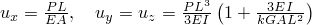 at node *A*.

**Regular and open section elements**

 1.667  105, 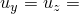 4.333  105.

**Pipe elements**

 2.792  105,  2.194  103.

**Stress resultants in beam and pipe elements**

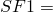 25.0, 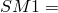 25(5  *x*), 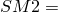 25(5  *x*),

Transverse shear: 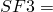 25.0, 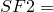 25.0.

**Displacements in shell elements**

 1.667  105,  4.333  105 at node *A*.

### Results and discussion

All beam and shell elements yield exact solutions. Pipe element solutions are given in [Table 1.3.9--1](ch01s03abv12.md#table-pipeelem).

**Table 1.3.9–1** Pipe element solutions.
|  |  | 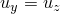 |
| --- | --- | --- |
| Analytical solution | 2.792 105 | 2.194 103 |
| Linear pipe elements | 2.792 105 | 2.093 103 |
| Quadratic pipe elements | 2.792 105 | 2.106 103 |

### Input files

[eb22gxs5.inp](../eif/eb22gxs5.inp)

B21 elements.

[eb2hgxs5.inp](../eif/eb2hgxs5.inp)

B21H elements.

[eb23gxs5.inp](../eif/eb23gxs5.inp)

B22 elements.

[eb2igxs5.inp](../eif/eb2igxs5.inp)

B22H elements.

[eb32gxs5.inp](../eif/eb32gxs5.inp)

B31 elements.

[eb3hgxs5.inp](../eif/eb3hgxs5.inp)

B31H elements.

[ebo2gxs5.inp](../eif/ebo2gxs5.inp)

B31OS elements.

[ebohgxs5.inp](../eif/ebohgxs5.inp)

B31OSH elements.

[eb33gxs5.inp](../eif/eb33gxs5.inp)

B32 elements.

[eb3igxs5.inp](../eif/eb3igxs5.inp)

B32H elements.

[ebo3gxs5.inp](../eif/ebo3gxs5.inp)

B32OS elements.

[eboigxs5.inp](../eif/eboigxs5.inp)

B32OSH elements.

[ep22pxs5.inp](../eif/ep22pxs5.inp)

PIPE21 elements.

[ep2hpxs5.inp](../eif/ep2hpxs5.inp)

PIPE21H elements.

[ep23pxs5.inp](../eif/ep23pxs5.inp)

PIPE22 elements.

[ep2ipxs5.inp](../eif/ep2ipxs5.inp)

PIPE22H elements.

[ep32pxs5.inp](../eif/ep32pxs5.inp)

PIPE31 elements.

[ep3hpxs5.inp](../eif/ep3hpxs5.inp)

PIPE31H elements.

[ep33pxs5.inp](../eif/ep33pxs5.inp)

PIPE32 elements.

[ep3ipxs5.inp](../eif/ep3ipxs5.inp)

PIPE32H elements.

[ese4sgs5.inp](../eif/ese4sgs5.inp)

S4 elements.

[esf4sgs5.inp](../eif/esf4sgs5.inp)

S4R elements.

[es54sgs5.inp](../eif/es54sgs5.inp)

S4R5 elements.

[es68sgs5.inp](../eif/es68sgs5.inp)

S8R elements.

[es58sgs5.inp](../eif/es58sgs5.inp)

S8R5 elements.

[es59sgs5.inp](../eif/es59sgs5.inp)

S9R5 elements.

[es56sgs5.inp](../eif/es56sgs5.inp)

STRI65 elements.

[force_shearflex_beam2d_xpl.inp](../eif/force_shearflex_beam2d_xpl.inp)

B21 elements in Abaqus/Explicit.

[force_shearflex_beam3d_xpl.inp](../eif/force_shearflex_beam3d_xpl.inp)

B31 elements in Abaqus/Explicit.

[force_shearflex_pipe2d_xpl.inp](../eif/force_shearflex_pipe2d_xpl.inp)

PIPE21 elements in Abaqus/Explicit.

[force_shearflex_pipe3d_xpl.inp](../eif/force_shearflex_pipe3d_xpl.inp)

PIPE31 elements in Abaqus/Explicit.

