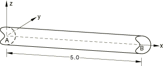
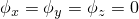
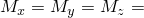
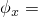
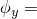
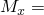
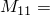
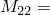

# 1.3.10 Shear flexible beams and shells: II

**Products: **Abaqus/Standard  Abaqus/Explicit  

### Elements tested

B21    B21H    B22    B22H    B31    B31H    B31OS    B31OSH    B32    B32H    B32OS    B32OSH    

PIPE21    PIPE21H    PIPE22    PIPE22H    PIPE31    PIPE31H    PIPE32    PIPE32H    

S4    S4R    S4R5    S8R    S8R5    S9R5    STRI65    

### Problem description

A three-dimensional problem is shown here, which can be particularized for two-dimensional beam elements.

**Material: **

Linear elastic, Young's modulus = 30  106, Poisson's ratio = 0.3.

**Boundary conditions: **

 at end *A*,  at end *B*.

**Loading: **

 100.0 at end *B*. Only  is applied for shell models.

Analogous problems are modeled in Abaqus/Explicit using linear beam and pipe elements. Unit density is prescribed for the material, and the solution is computed for unit time. Loads are applied smoothly for a quasi-static solution, similar to that from static analysis. The results using pipe elements are consistent to that using beam elements, both of which match the static analysis. 

### Reference solution

**Displacements in regular beam elements**

 8  103,  8  103 at end ,

 4.92  103,  3.2  103,  3.2  103 at end *B*.

**Displacements in open section beam elements**

 6.02  102,  .2 at end *A*,

 8.0  102,  2.41  102 at end .

**Displacements in pipe elements**

 2.47  103,  2.47  103 at end *A*,

 1.28  103,  9.87  104,  9.87  104 at end *B*.

**Stress resultants in beam and pipe elements**

 0.0,  100,  100,  100.

Transverse shear = 0.0.

**Displacements in shell elements**

 8  103 at node *A*,  3.2  103 at node *B*.

### Results and discussion

All beam and shell elements yield exact solutions. Pipe elements yield the following solutions:

 2.475  103,  2.475  103 at end ,

 1.287  103,  9.90  104,  9.90  104 at end *B*.

### Input files

[eb22rxs6.inp](../eif/eb22rxs6.inp)

B21 elements.

[eb2hrxs6.inp](../eif/eb2hrxs6.inp)

B21H elements.

[eb23rxs6.inp](../eif/eb23rxs6.inp)

B22 elements.

[eb2irxs6.inp](../eif/eb2irxs6.inp)

B22H elements.

[eb32rxs6.inp](../eif/eb32rxs6.inp)

B31 elements.

[eb32rxs7.inp](../eif/eb32rxs7.inp)

B31 elements with a nondefault value of slenderness compensation factor.

[eb32rxs8.inp](../eif/eb32rxs8.inp)

B31 elements with an internally calculated slenderness compensation factor.

[eb3hrxs6.inp](../eif/eb3hrxs6.inp)

B31H elements.

[ebo2ixs6.inp](../eif/ebo2ixs6.inp)

B31OS elements.

[ebohixs6.inp](../eif/ebohixs6.inp)

B31OSH elements.

[eb33rxs6.inp](../eif/eb33rxs6.inp)

B32 elements.

[eb3irxs6.inp](../eif/eb3irxs6.inp)

B32H elements.

[ebo3ixs6.inp](../eif/ebo3ixs6.inp)

B32OS elements.

[eboiixs6.inp](../eif/eboiixs6.inp)

B32OSH elements.

[ep22pxs6.inp](../eif/ep22pxs6.inp)

PIPE21 elements.

[ep2hpxs6.inp](../eif/ep2hpxs6.inp)

PIPE21H elements.

[ep23pxs6.inp](../eif/ep23pxs6.inp)

PIPE22 elements.

[ep2ipxs6.inp](../eif/ep2ipxs6.inp)

PIPE22H elements.

[ep32pxs6.inp](../eif/ep32pxs6.inp)

PIPE31 elements.

[ep3hpxs6.inp](../eif/ep3hpxs6.inp)

PIPE31H elements.

[ep33pxs6.inp](../eif/ep33pxs6.inp)

PIPE32 elements.

[ep3ipxs6.inp](../eif/ep3ipxs6.inp)

PIPE32H elements.

[ese4sxs6.inp](../eif/ese4sxs6.inp)

S4 elements.

[esf4sxs6.inp](../eif/esf4sxs6.inp)

S4R elements.

[es54sxs6.inp](../eif/es54sxs6.inp)

S4R5 elements.

[es68sxs6.inp](../eif/es68sxs6.inp)

S8R elements.

[es58sxs6.inp](../eif/es58sxs6.inp)

S8R5 elements.

[es59sxs6.inp](../eif/es59sxs6.inp)

S9R5 elements.

[es56sxs6.inp](../eif/es56sxs6.inp)

STRI65 elements.

[moment_shearflex_beam2d_xpl.inp](../eif/moment_shearflex_beam2d_xpl.inp)

B21 elements in Abaqus/Explicit.

[moment_shearflex_beam3d_xpl.inp](../eif/moment_shearflex_beam3d_xpl.inp)

B31 elements in Abaqus/Explicit.

[moment_shearflex_pipe2d_xpl.inp](../eif/moment_shearflex_pipe2d_xpl.inp)

PIPE21 elements in Abaqus/Explicit.

[moment_shearflex_pipe3d_xpl.inp](../eif/moment_shearflex_pipe3d_xpl.inp)

PIPE31 elements in Abaqus/Explicit.

