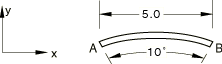
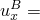
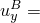
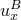
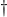

# 1.3.11 Initial curvature of beams and shells

**Products: **Abaqus/Standard  Abaqus/Explicit  

### Elements tested

B21    B21H    B22    B22H    B23    B23H    B31    B31H    B31OS    B31OSH    B32    B32H    B32OS    B32OSH    B33    B33H    

PIPE21    PIPE21H    PIPE22    PIPE22H    PIPE31    PIPE31H    PIPE32    PIPE32H    

S4    S4R    S4R5    S8R    S8R5    S9R5    STRI3    STRI65    SC6R    SC8R    

### Problem description

**Material: **

Linear elastic, Young's modulus = 30  106, Poisson's ratio = 0.3.

**Boundary conditions: **

End *A* is clamped.

**Loading: **

 25.0 at end *B*.

Initial curvature is defined by specifying the direction cosines of the normals at the two ends.

Gauss integration is used for the shell cross-section for the S4R elements.

### Reference solution

Reference results are generated from models consisting of 20 B33 cubic beam elements. (Since only one element is used for modeling, if the direction cosines of the normals are not used, the solution will correspond to straight beam theory.) The reference tests use SECTION=RECT, SECTION=I, or SECTION=PIPE. These sections correspond to regular beams and shells, open section beams, and pipes, respectively. Only pipe elements are verified in Abaqus/Explicit.

**Regular beams and shells (see [erefrrs7.inp](../eif/erefrrs7.inp)):**

**Displacements, curved beam solution**

 2.1735  105,  1.4570  104.

**Displacements, straight beam solution**

 1.6667  105,  0.0.

**Open section beam elements (see [erefois7.inp](../eif/erefois7.inp)):**

**Displacements, curved beam solution**

 3.1946  104,  1.0962  103.

**Displacements, straight beam solution**

 2.8153  104,  0.0.

**Pipe elements (see [erefpps7.inp](../eif/erefpps7.inp)):**

**Displacements, curved beam solution**

 2.9461  105,  4.5078  105.

**Displacements, straight beam solution**

 2.7922  105,  0.0.

### Results and discussion

**Table 1.3.11–1** Regular beams and shells.
| Element Type |  |  | Remarks |
| --- | --- | --- | --- |
| B21 (1-element mesh) | 1.6667 105 | 0.0 | Straight* |
| B21 (Refined mesh) | 2.1715 105 | 1.4343 104 | Curved |
| B21H (1-element mesh) | 1.6667 105 | 0.0 | Straight* |
| B21H (Refined mesh) | 2.1665 105 | 1.4343 104 | Curved |
| B22 | 2.1085 105 | 1.4686 104 | Curved |
| B22H | 2.1085 105 | 1.4686 104 | Curved |
| B23 | 2.0873 105 | 1.4549 104 | Curved |
| B23H | 2.0873 105 | 1.4549 104 | Curved |
| B31 (1-element mesh) | 1.6667 105 | 0.0 | Straight* |
| B31 (Refined mesh) | 2.1715 105 | 1.4343 104 | Curved |
| B31H (1-element mesh) | 1.6667 105 | 0.0 | Straight |
| B31H (Refined mesh) | 2.1715 105 | 1.4343 104 | Curved |
| B32 | 2.1084 105 | 1.4686 104 | Curved |
| B32H | 2.1084 105 | 1.4686 104 | Curved |
| B33 | 2.0873 105 | 1.4548 104 | Curved |
| B33H | 2.0873 105 | 1.4548 104 | Curved |
| S4 (1-element mesh) | 1.6292 105 | 0.0 | Straight* |
| S4 (Refined mesh) | 2.1607 105 | 1.4314 104 | Curved |
| S4R (1-element mesh) | 1.6666 105 | 0.0 | Straight* |
| S4R (Refined mesh) | 2.1661 105 | 1.4340 104 | Curved |
| S4R5 (1-element mesh) | 1.6666 105 | 0.0 | Straight* |
| S4R5 (Refined mesh) | 2.1667 105 | 1.4344 104 | Curved |
| S8R | 2.1036 105 | 1.4508 104 | Curved |
| S8R5 | 2.1001 105 | 1.4638 104 | Curved |
| S9R5 | 2.1001 105 | 1.4638 104 | Curved |
| STRI3 | 1.6667 105 | 0.0 | Straight |
| STRI65  | 2.0750 105 | 1.4331 104 | Curved |
| SC6R | 2.1673 105 | 1.425 104 | Curved |
| SC8R | 2.156 105 | 1.2402 104 | Curved |
| SC8R | 1.6608 105 | 2.5028 104 | Straight |
| SC8R** | 2.1491 105 | 1.4175 104 | Curved |
| SC8R** | 1.6276 105 | 2.4271 104 | Straight |

**Table 1.3.11–2** Open section beam elements.
| Element Type |  |  | Remarks |
| --- | --- | --- | --- |
| B31OS (1-element mesh) | 2.8153 104 | 0.0 | Straight* |
| B31OS (Refined mesh) | 3.2287 104 | 1.0790 103 | Curved |
| B31OSH (1-element mesh) | 2.8153 104 | 0.0 | Straight* |
| B31OSH (Refined mesh) | 3.2287 104 | 1.0790 103 | Curved |
| B32OS (1-element mesh) | 3.1787 104 | 1.1048 103 | Curved |
| B32OSH (Refined mesh) | 3.1787 104 | 1.1048 103 | Curved |

**Table 1.3.11–3** Pipe elements.
| Element Type |  |  | Remarks |
| --- | --- | --- | --- |
| PIPE21 (1-element mesh) | 2.7922 105 | 0.0 | Straight* |
| PIPE21 (Refined mesh) | 2.9768 105 | 4.4373 105 | Curved |
| PIPE21H (1-element mesh) | 2.7922 105 | 0.0 | Straight* |
| PIPE21H (Refined mesh) | 2.9768 105 | 4.4373 105 | Curved |
| PIPE22 (1-element mesh) | 2.9572 105 | 4.5435 105 | Curved |
| PIPE22H (1-element mesh) | 2.9572 105 | 4.5435 105 | Curved |
| PIPE31 (1-element mesh) | 2.7922 105 | 0.0 | Straight* |
| PIPE31 (Refined mesh) | 2.9768 105 | 4.4373 105 | Curved |
| PIPE31H (1-element mesh) | 2.7922 105 | 0.0 | Straight* |
| PIPE31H (Refined mesh) | 2.9768 105 | 4.4373 105 | Curved |
| PIPE32 (1-element mesh) | 2.9572 105 | 4.5435 105 | Curved |
| PIPE32H (1-element mesh) | 2.9572 105 | 4.5435 105 | Curved |

* These are first-order elements and are unable to capture initial curvature with a one-element mesh. However, a refined mesh for these elements yields very good results. Due to the lack of symmetry for triangular meshes, the displacements at the nodes that are at point *B* may differ slightly. The maximum values are documented here.** These results are obtained using enhanced hourglass control.

### Input files

#### Coarse mesh tests:

[eb22rms7.inp](../eif/eb22rms7.inp)

B21 elements.

[eb2hrms7.inp](../eif/eb2hrms7.inp)

B21H elements.

[eb23rms7.inp](../eif/eb23rms7.inp)

B22 elements.

[eb2irms7.inp](../eif/eb2irms7.inp)

B22H elements.

[eb2arms7.inp](../eif/eb2arms7.inp)

B23 elements.

[eb2jrms7.inp](../eif/eb2jrms7.inp)

B23H elements.

[eb32rms7.inp](../eif/eb32rms7.inp)

B31 elements.

[eb3hrms7.inp](../eif/eb3hrms7.inp)

B31H elements.

[ebo2ims7.inp](../eif/ebo2ims7.inp)

B31OS elements.

[ebohims7.inp](../eif/ebohims7.inp)

B31OSH elements.

[eb33rms7.inp](../eif/eb33rms7.inp)

B32 elements.

[eb3irms7.inp](../eif/eb3irms7.inp)

B32H elements.

[ebo3ims7.inp](../eif/ebo3ims7.inp)

B32OS elements.

[eboiims7.inp](../eif/eboiims7.inp)

B32OSH elements.

[eb3arms7.inp](../eif/eb3arms7.inp)

B33 elements.

[eb3jrms7.inp](../eif/eb3jrms7.inp)

B33H elements.

[ep22pms7.inp](../eif/ep22pms7.inp)

PIPE21 elements.

[inicurv_pipe2d_xpl.inp](../eif/inicurv_pipe2d_xpl.inp)

PIPE21 elements in Abaqus/Explicit.

[ep2hpms7.inp](../eif/ep2hpms7.inp)

PIPE21H elements.

[ep23pms7.inp](../eif/ep23pms7.inp)

PIPE22 elements.

[ep2ipms7.inp](../eif/ep2ipms7.inp)

PIPE22H elements.

[ep32pms7.inp](../eif/ep32pms7.inp)

PIPE31 elements.

[inicurv_pipe3d_xpl.inp](../eif/inicurv_pipe3d_xpl.inp)

PIPE31 elements in Abaqus/Explicit.

[ep3hpms7.inp](../eif/ep3hpms7.inp)

PIPE31H elements.

[ep33pms7.inp](../eif/ep33pms7.inp)

PIPE32 elements.

[ep3ipms7.inp](../eif/ep3ipms7.inp)

PIPE32H elements.

[ese4sms7.inp](../eif/ese4sms7.inp)

S4 elements.

[esf4sms7.inp](../eif/esf4sms7.inp)

S4R elements.

[es54sms7.inp](../eif/es54sms7.inp)

S4R5 elements.

[es68sms7.inp](../eif/es68sms7.inp)

S8R elements.

[es58sms7.inp](../eif/es58sms7.inp)

S8R5 elements.

[es59sms7.inp](../eif/es59sms7.inp)

S9R5 elements.

[es63sms7.inp](../eif/es63sms7.inp)

STRI3 elements.

[es56sms7.inp](../eif/es56sms7.inp)

STRI65 elements.

[esc8sms7.inp](../eif/esc8sms7.inp)

SC8R elements.

[esc8sms7_eh.inp](../eif/esc8sms7_eh.inp)

SC8R elements with enhanced hourglass control.

#### Fine mesh tests:

[eb22rfs7.inp](../eif/eb22rfs7.inp)

B21 elements.

[eb2hrfs7.inp](../eif/eb2hrfs7.inp)

B21H elements.

[eb32rfs7.inp](../eif/eb32rfs7.inp)

B31 elements.

[eb3hrfs7.inp](../eif/eb3hrfs7.inp)

B31H elements.

[ebo2ifs7.inp](../eif/ebo2ifs7.inp)

B31OS elements.

[ebohifs7.inp](../eif/ebohifs7.inp)

B31OSH elements.

[ep22pfs7.inp](../eif/ep22pfs7.inp)

PIPE21 elements.

[ep2hpfs7.inp](../eif/ep2hpfs7.inp)

PIPE21H elements.

[ep32pfs7.inp](../eif/ep32pfs7.inp)

PIPE31 elements.

[ep3hpfs7.inp](../eif/ep3hpfs7.inp)

PIPE31H elements.

[ese4sfs7.inp](../eif/ese4sfs7.inp)

S4 elements.

[esf4sfs7.inp](../eif/esf4sfs7.inp)

S4R elements.

[es54sfs7.inp](../eif/es54sfs7.inp)

S4R5 elements.

[esc6sfs7.inp](../eif/esc6sfs7.inp)

SC6R elements.

[esc8sfs7.inp](../eif/esc8sfs7.inp)

SC8R elements.

[esc8sfs7_eh.inp](../eif/esc8sfs7_eh.inp)

SC8R elements with enhanced hourglass control.

