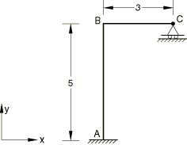
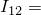
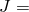
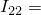
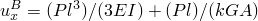

# 1.3.12 Normal definitions of beams and shells

**Products: **Abaqus/Standard  Abaqus/Explicit  

### Elements tested

B21    B21H    B22    B22H    B23    B23H    B31    B31H    B31OS    B31OSH    B32    B32H    B32OS    B32OSH    B33    B33H    

PIPE21    PIPE21H    PIPE22    PIPE22H    PIPE31    PIPE31H    PIPE32    PIPE32H    

S4    S4R    S4R5    S8R    S8R5    S9R5    STRI3    STRI65    

### Problem description

**Material: **

Linear elastic, Young's modulus = 30  106.

**Boundary conditions: **

End *A* is clamped,  at end *C*.

**Loading: **

 25.0 at end *C*.

**Section properties: **

 0.25,  0,  1.0  106,  0.01041667.

For B23, B23H, B33, B33H, and STRI3 elements, different values of  are used: vertical members,  5.208  103, horizontal members,  1.0  106.

For pipe elements a circular cross-section of outer radius 0.5 and wall thickness 0.05 is used. Five pipe elements are used along segment AB. A single linear beam element is used along BC with section properties as defined above. In Abaqus/Explicit the loading is applied using a smooth step amplitude to achieve a nearly static response at steady state, similar to that in Abaqus/Standard.

### Remarks

Normal definitions written to the output file by the analysis input file processor are all correct.

### Reference solution

Displacements: .

For shear flexible elements properties have been defined such that the first term is negligible.

For Love-Kirchhoff (cubic) elements the second term does not apply.

### Results and discussion

| Element Type |  (Abaqus) |  (Analytical) |
| --- | --- | --- |
| B21(H) | 5.098 105 | 5.098 105 |
| B22(H) | 5.098 105 | 5.098 105 |
| B23(H) | 6.662 103 | 6.667 103 |
| B31(H) | 5.098 105 | 5.098 105 |
| B31OS(H) | 5.098 105 | 5.098 105 |
| B32(H) | 5.098 105 | 5.098 105 |
| B32OS(H) | 5.098 105 | 5.098 105 |
| B33(H) | 6.662 103 | 6.667 103 |
| PIPE21(H) | 2.166 103 | 2.199 103 |
| PIPE22(H) | 2.167 103 | 2.199 103 |
| PIPE31(H) | 2.166 103 | 2.199 103 |
| PIPE32(H) | 2.167 103 | 2.199 103 |
| S4 | 5.098 105 | 5.098 105 |
| S4R | 5.098 105 | 5.098 105 |
| S4R5 | 5.098 105 | 5.098 105 |
| S8R | 5.098 105 | 5.098 105 |
| S8R5 | 5.098 105 | 5.098 105 |
| S9R5 | 5.098 105 | 5.098 105 |
| STRI3  | 6.341 103 | 6.667 103 |
| STRI65  | 3.991 105 | 5.098 105 |

 Due to the lack of symmetry for triangular meshes, the displacements at the nodes that are at point *B* differ slightly. The maximum values are documented here. For pipe elements in Abaqus/Explicit the results are very close to those obtained with Abaqus/Standard; the small differences can be attributed to steady-state oscillations. 

### Input files

[eb22gxs8.inp](../eif/eb22gxs8.inp)

B21 elements.

[eb2hgxs8.inp](../eif/eb2hgxs8.inp)

B21H elements.

[eb23gxs8.inp](../eif/eb23gxs8.inp)

B22 elements.

[eb2igxs8.inp](../eif/eb2igxs8.inp)

B22H elements.

[eb2agxs8.inp](../eif/eb2agxs8.inp)

B23 elements.

[eb2jgxs8.inp](../eif/eb2jgxs8.inp)

B23H elements.

[eb32gxs8.inp](../eif/eb32gxs8.inp)

B31 elements.

[eb3hgxs8.inp](../eif/eb3hgxs8.inp)

B31H elements.

[ebo2gxs8.inp](../eif/ebo2gxs8.inp)

B31OS elements.

[ebohgxs8.inp](../eif/ebohgxs8.inp)

B31OSH elements.

[eb33gxs8.inp](../eif/eb33gxs8.inp)

B32 elements.

[eb3igxs8.inp](../eif/eb3igxs8.inp)

B32H elements.

[ebo3gxs8.inp](../eif/ebo3gxs8.inp)

B32OS elements.

[eboigxs8.inp](../eif/eboigxs8.inp)

B32OSH elements.

[eb3agxs8.inp](../eif/eb3agxs8.inp)

B33 elements.

[eb3jgxs8.inp](../eif/eb3jgxs8.inp)

B33H elements.

[ep22pxs8.inp](../eif/ep22pxs8.inp)

PIPE21 elements.

[ep2hpxs8.inp](../eif/ep2hpxs8.inp)

PIPE21H elements.

[ep23pxs8.inp](../eif/ep23pxs8.inp)

PIPE22 elements.

[ep2ipxs8.inp](../eif/ep2ipxs8.inp)

PIPE22H elements.

[ep32pxs8.inp](../eif/ep32pxs8.inp)

PIPE31 elements.

[ep3hpxs8.inp](../eif/ep3hpxs8.inp)

PIPE31H elements.

[ep33pxs8.inp](../eif/ep33pxs8.inp)

PIPE32 elements.

[ep3ipxs8.inp](../eif/ep3ipxs8.inp)

PIPE32H elements.

[ese4sgs8.inp](../eif/ese4sgs8.inp)

S4 elements.

[esf4sgs8.inp](../eif/esf4sgs8.inp)

S4R elements.

[es54sgs8.inp](../eif/es54sgs8.inp)

S4R5 elements.

[es68sgs8.inp](../eif/es68sgs8.inp)

S8R elements.

[es58sgs8.inp](../eif/es58sgs8.inp)

S8R5 elements.

[es59sgs8.inp](../eif/es59sgs8.inp)

S9R5 elements.

[es63sgs8.inp](../eif/es63sgs8.inp)

STRI3 elements.

[es56sgs8.inp](../eif/es56sgs8.inp)

STRI65 elements.

[normdef_pipe2d_xpl.inp](../eif/normdef_pipe2d_xpl.inp)

PIPE21 elements in Abaqus/Explicit.

[normdef_pipe3d_xpl.inp](../eif/normdef_pipe3d_xpl.inp)

PIPE31 elements in Abaqus/Explicit.

