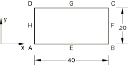
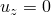
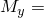
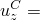
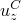

# 1.3.13 Constant curvature test for shells

**Product: **Abaqus/Standard  

### Elements tested

S3    S3R    S4    S4R    S4R5    S8R    S8R5    S9R5    STRI3    STRI65    

### Problem description

**Material: **

Linear elastic, Young's modulus = 1  103, Poisson's ratio = 0.3.

**Boundary conditions: **

 at nodes *A*, *B*, and *D*,  at all nodes along the perimeter.

**Loading: **

 2.0 at node *C*,  20.0 at nodes *A* and *B*,  20.0 at nodes *C* and *D*,  10.0 at nodes *B* and *C*,  10.0 at nodes *A* and *D*.

### Reference solution

Displacements:  12.48.

### Results and discussion

| Element type |  |
| --- | --- |
| S3/S3R | 12.51 |
| S4R | 12.54 |
| S4 | 12.54 |
| S4R5 | 12.496 |
| S8R* | 12.555 |
| S8R5 | 12.527 |
| S9R5 | 12.527 |
| STRI3 | 12.480 |
| STRI65 | 12.545 |

*A refined mesh consisting of two elements is used for the S8R model since hourglassing occurs in a one-element mesh.

### Input files

[esf3sxs9.inp](../eif/esf3sxs9.inp)

S3/S3R elements.

[ese4sxs9.inp](../eif/ese4sxs9.inp)

S4 elements.

[esf4sxs9.inp](../eif/esf4sxs9.inp)

S4R elements.

[es54sxs9.inp](../eif/es54sxs9.inp)

S4R5 elements.

[es68sxs9.inp](../eif/es68sxs9.inp)

S8R elements.

[es58sxs9.inp](../eif/es58sxs9.inp)

S8R5 elements.

[es59sxs9.inp](../eif/es59sxs9.inp)

S9R5 elements.

[es63sxs9.inp](../eif/es63sxs9.inp)

STRI3 elements.

[es56sxs9.inp](../eif/es56sxs9.inp)

STRI65 elements.

