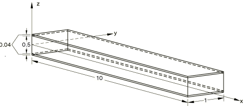
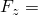

# 1.3.16 Cantilever sandwich beam: shear flexible shells

**Product: **Abaqus/Standard  

### Elements tested

S4    S4R    S8R    S4T    S4RT    S8RT    

### Problem description

**Material: **

For the face a linear elastic material with Young's modulus = 1.0  107 and Poisson's ratio = 0 is modeled. For the core the transverse shear moduli are given as 1.0  104 and all other properties in the plane are set to negligible values, using the LAMINA definition.

**Boundary conditions: **

All nodes are clamped at one end.

**Loading: **

 750.0 distributed consistently to the nodes at the free end.

Gauss integration is used for the shell cross-section for the S4, S4R, and S8R elements.

Simpson integration is used for the shell cross-section for the S4T, S4T, S4RT, and S8RT elements.

### Reference solution

Displacement at the free end (Plantema, *Sandwich Construction*, John Wiley and Sons, Inc., 1966): = 5.5684.

Maximum bending stress at the top of the clamped end, for the case of warping prevention as enforced here:  = 3.7275  105.

### Results and discussion

| Element Type |  |  |
| --- | --- | --- |
| S4 | 5.55 | 3.5136 105 |
| S4R | 5.55 | 3.5136 105 |
| S8R | 5.56 | 3.6439 105 |
| S4T | 5.55 | 3.537 105 |
| S4RT | 5.55 | 3.537 105 |
| S8RT | 5.56 | 3.6439 105 |

### Input files

[ese4scsi.inp](../eif/ese4scsi.inp)

S4 elements.

[esf4scsi.inp](../eif/esf4scsi.inp)

S4R elements.

[es68scsi.inp](../eif/es68scsi.inp)

S8R elements.

[es34tcsi.inp](../eif/es34tcsi.inp)

S4T elements.

[es4rtcsi.inp](../eif/es4rtcsi.inp)

S4RT elements.

[es38tcsi.inp](../eif/es38tcsi.inp)

S8RT elements.

