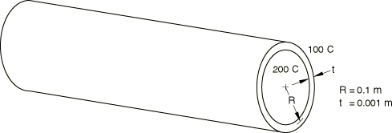
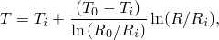
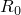
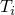
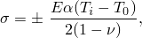
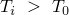

# 1.3.17 Thermal stress in a cylindrical shell

**Products: **Abaqus/Standard  Abaqus/Explicit  

### Elements tested

DSAX1    DSAX2    DS3    DS4    DS6    DS8    DCAX8    DC3D20    

SAX1    SAX2    SAX2T    STRI65    S4R5    S8R5    

S4RT    S8RT    

CAX3T    CAX4RT    CAX4RHT    CAX8R    CAX8RT    

CGAX4RT    CGAX8RT    CGAX4RHT    

C3D4T    C3D6T    C3D8T    C3D8RT    C3D20R    C3D20RT    

### Problem description

The cylindrical shell is shown above. A single element is used in the Abaqus/Standard analyses and in the Abaqus/Explicit analysis using the coupled thermal shell element. In the Abaqus/Explicit analyses that use solid elements, two elements are used in the radial direction. For the nonaxisymmetric elements the element subtends an angle of 11.25 at the center, which is equivalent to 32 elements around the circumference.

Steady-state conditions are assumed in the Abaqus/Standard simulation. A transient simulation is performed in Abaqus/Explicit. The total simulation time is 0.4 seconds for the analyses using solid elements, and 0.06 seconds for the analysis using a shell element. This provides enough time for the transient solution to reach steady-state conditions in this problem. Mass scaling is used for the solid element analyses to reduce the computational cost of the Abaqus/Explicit analyses.

**Material: **

| Density | 7800 kg/m3 |
| --- | --- |
| Conductivity | 52 J/ms C |
| Specific heat | 586 J/kg C |
| Thermal expansion coefficient | 1.2 105 |
| Young's modulus | 200 103 MPa |
| Poisson's ratio | 0.3 |

**Boundary conditions: **

For the thermal analyses the temperatures of the inside and outside surfaces are prescribed to be 200C and 100C, respectively. For the stress analyses the rotation vector in the circumferential direction is constrained, but the cylinder is free to expand axially. For the continuum element meshes equations are used to provide the rotational constraints. For the nonaxisymmetric cases symmetrical constraints are applied in the circumferential direction to model the complete cylinder.

In the Abaqus/Explicit simulations the temperatures are applied gradually to ensure a quasi-static response.

For all of the analyses except those using the coupled temperature-displacement elements (SAX2T, S8RT, CAX4RT, CAX4RHT, CGAX4RT, CGAX4RHT, CAX8RT, CGAX8RT, and C3D20RT in Abaqus/Standard and S4RT, CAX3T, CAX4RT, C3D4T, C3D6T, C3D8RT, and C3D8T in Abaqus/Explicit), the analyses are run in pairs: a thermal analysis followed by its corresponding stress analysis.

Gauss integration is used for the shell cross-section for input file [es54sxsj.inp](../eif/es54sxsj.inp).

### Reference solution

The temperature distribution through the thickness of the cylinder is given by 

where  is the outer radius,  is the inner radius,  is the outside temperature, and  is the inside temperature.

The analytical solution for the stresses is given in Chapter 15 of “Theory of Plates and Shells,” second edition, by Timoshenko and Woinowsky-Krieger. The stresses at the outer and inner surfaces are given by 

where *E* is Young's modulus,  is the coefficient of thermal expansion, and  is Poisson's ratio. The upper sign refers to the outer surface, indicating that a tensile stress will act on this surface if .

This gives a theoretical stress of 171.43 MPa.

### Results and discussion

The axisymmetric and second-order shell elements agree exactly with the theory. The first-order three-dimensional shells (S4R5) show an error of 5.1%. The continuum elements show small discrepancies (< 1%) from the reference solution.

The results obtained with Abaqus/Explicit are in close agreement with the analytical solution and with those obtained with Abaqus/Standard.

### Input files

##### **Abaqus/Standard input files**

[esa2dxsj.inp](../eif/esa2dxsj.inp)

DSAX1 elements.

[esa3dxsj.inp](../eif/esa3dxsj.inp)

DSAX2 elements.

[es33dxsj.inp](../eif/es33dxsj.inp)

DS3 elements.

[es34dxsj.inp](../eif/es34dxsj.inp)

DS4 elements.

[es36dxsj.inp](../eif/es36dxsj.inp)

DS6 elements.

[es38dxsj.inp](../eif/es38dxsj.inp)

DS8 elements.

[eca8dfsj.inp](../eif/eca8dfsj.inp)

DCAX8 elements.

[ec3kdfsj.inp](../eif/ec3kdfsj.inp)

DC3D20 elements.

[esa2sxsj.inp](../eif/esa2sxsj.inp)

SAX1 elements.

[esa3sxsj.inp](../eif/esa3sxsj.inp)

SAX2 elements.

[es56sxsj.inp](../eif/es56sxsj.inp)

STRI65 elements.

[es54sxsj.inp](../eif/es54sxsj.inp)

S4R5 elements.

[es58sxsj.inp](../eif/es58sxsj.inp)

S8R5 elements.

[eca8srsj.inp](../eif/eca8srsj.inp)

CAX8R elements.

[ec3ksrsj.inp](../eif/ec3ksrsj.inp)

C3D20R elements.

[esa3txsj.inp](../eif/esa3txsj.inp)

SAX2T elements.

[es34txsj.inp](../eif/es34txsj.inp)

S4T elements.

[es4rtxsj.inp](../eif/es4rtxsj.inp)

S4RT elements.

[es38txsj.inp](../eif/es38txsj.inp)

S8RT elements.

[ecax3tsj.inp](../eif/ecax3tsj.inp)

CAX3T elements.

[eca4trsj.inp](../eif/eca4trsj.inp)

CAX4RT elements.

[eca4tysj.inp](../eif/eca4tysj.inp)

CAX4RHT elements.

[eca4hrsj.inp](../eif/eca4hrsj.inp)

CGAX4RT elements.

[eca4hysj.inp](../eif/eca4hysj.inp)

CGAX4RHT elements.

[eca8trsj.inp](../eif/eca8trsj.inp)

CAX8RT elements.

[eca8hrsj.inp](../eif/eca8hrsj.inp)

CGAX8RT elements.

[ec3ktrsj.inp](../eif/ec3ktrsj.inp)

C3D20RT elements.

[thermstresscyl_std_c3d4t.inp](../eif/thermstresscyl_std_c3d4t.inp)

C3D4T elements.

[thermstresscyl_std_c3d6t.inp](../eif/thermstresscyl_std_c3d6t.inp)

C3D6T elements.

##### **Abaqus/Explicit input files**

[thermstresscyl_xpl_cax3t.inp](../eif/thermstresscyl_xpl_cax3t.inp)

CAX3T elements.

[thermstresscyl_xpl_cax4rt.inp](../eif/thermstresscyl_xpl_cax4rt.inp)

CAX4RT elements.

[thermstresscyl_xpl_c3d4t.inp](../eif/thermstresscyl_xpl_c3d4t.inp)

C3D4T elements.

[thermstresscyl_xpl_c3d6t.inp](../eif/thermstresscyl_xpl_c3d6t.inp)

C3D6T elements.

[thermstresscyl_xpl_c3d8rt.inp](../eif/thermstresscyl_xpl_c3d8rt.inp)

C3D8RT elements.

[thermstresscyl_xpl_c3d8t.inp](../eif/thermstresscyl_xpl_c3d8t.inp)

C3D8T elements.

[thermstresscyl_xpl_s4rt.inp](../eif/thermstresscyl_xpl_s4rt.inp)

S4RT elements.

