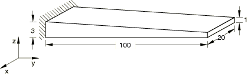
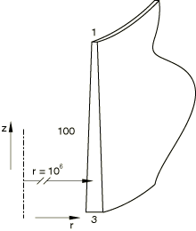
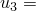

# 1.3.18 Variable thickness shells and membranes

**Product: **Abaqus/Standard  

### Elements tested

S4    S4R    S4R5    S8R    S8R5    S9R5    STRI3    STRI65    

SAX1    SAX2    SAXA1*n*    SAXA2*n*    

S4T    S4RT    S8RT    SAX2T    

DS3    DS4    DS6    DS8    DSAX1    DSAX2    

M3D3    M3D4    M3D4R    M3D6    M3D8    M3D8R    M3D9    M3D9R    

MAX1    MAX2    MGAX1    MGAX2    MCL6    MCL9    

### Problem description

For the three-dimensional shell and membrane elements (except the cylindrical membrane elements), the model consists of a tapered plate of length 100 and width 20. The plate is clamped at one end, and the thickness varies linearly across the plate from 3 at the clamped end to 1 at the free end. The first-order models consist of 10 elements along the length and two across the width; the second-order models consist of five elements along the length and one across the width.

For the axisymmetric elements and the cylindrical membrane elements, the model consists of a tapered cylinder with a radius of 1  106 and a length of 100. The cylinder is clamped at one end, and the thickness varies linearly along the length of the cylinder from 3 at the clamped end to 1 at the free end. The radius is chosen to be very large to ensure that the effects of circumferential stresses are negligible. The cylinder is meshed with ten first-order elements or five second-order elements.

**Material: **

For stress analysis: linear elastic, Young's modulus = 1000, Poisson's ratio = 0; for heat transfer: conductivity = 1.

**Boundary conditions: **

Clamped at the end with thickness 3.

**Loading: **

**Shell bending model**

Bending moment of 3 per unit length at the thin end of the shell.

**Membrane tension model**

In-plane force of 50 per unit length at the thin end of the membrane.

**Axisymmetric membrane tension model**

In-plane force of 50 per unit length at the thin end of the membrane.

**Cylindrical membrane tension model**

In-plane force of 50 per unit length at the thin end of the membrane. A beam type multi-point constraint is used to tie all nodes at the thin end of the membrane to a master node. The load is then applied to the master node. This problem is set up using the symmetric model generation capability, with the corresponding axisymmetric problem as the base model.

**Heat transfer shell model**

Prescribed temperature = 0 at the thick end, prescribed temperature = 100 at the thin end.

### Reference solution

**Shell bending model**

Tip displacement  20.0, tip rotation  0.8.

**Membrane tension model**

Tip displacement  2.7465.

**Axisymmetric membrane tension model**

Tip displacement  2.7465.

**Cylindrical membrane tension model**

Tip displacement  2.7465.

**Heat transfer shell model**

Temperatures (20) = 13.03, (40) = 28.23, (60) = 46.50, (80) = 69.37.

### Results and discussion

All numerical solutions agree closely with the analytical solutions. The maximum error is about 1%. Local coordinate directions are used in input files [es34dnsq.inp](../eif/es34dnsq.inp) and [em34sfsq.inp](../eif/em34sfsq.inp).

### Input files

[esf3snsq.inp](../eif/esf3snsq.inp)

S3R elements.

[ese4snsq.inp](../eif/ese4snsq.inp)

S4 elements.

[esf4snsq.inp](../eif/esf4snsq.inp)

S4R elements.

[es54snsq.inp](../eif/es54snsq.inp)

S4R5 elements.

[es68snsq.inp](../eif/es68snsq.inp)

S8R elements.

[es58snsq.inp](../eif/es58snsq.inp)

S8R5 elements.

[es59snsq.inp](../eif/es59snsq.inp)

S9R5 elements.

[es63snsq.inp](../eif/es63snsq.inp)

STRI3 elements.

[es56snsq.inp](../eif/es56snsq.inp)

STRI65 elements.

[esa2snsq.inp](../eif/esa2snsq.inp)

SAX1 elements.

[esa3snsq.inp](../eif/esa3snsq.inp)

SAX2 elements.

[esnssnsq.inp](../eif/esnssnsq.inp)

SAXA11 elements.

[esntsnsq.inp](../eif/esntsnsq.inp)

SAXA12 elements.

[esnusnsq.inp](../eif/esnusnsq.inp)

SAXA13 elements.

[esnvsnsq.inp](../eif/esnvsnsq.inp)

SAXA14 elements.

[esnwsnsq.inp](../eif/esnwsnsq.inp)

SAXA21 elements.

[esnxsnsq.inp](../eif/esnxsnsq.inp)

SAXA22 elements.

[esnysnsq.inp](../eif/esnysnsq.inp)

SAXA23 elements.

[esnzsnsq.inp](../eif/esnzsnsq.inp)

SAXA24 elements.

[es34tnsq.inp](../eif/es34tnsq.inp)

S4T elements.

[es4rtnsq.inp](../eif/es4rtnsq.inp)

S4RT elements.

[es68tnsq.inp](../eif/es68tnsq.inp)

S8RT elements.

[esa3tnsq.inp](../eif/esa3tnsq.inp)

SAX2T elements.

[es33dnsq.inp](../eif/es33dnsq.inp)

DS3 elements.

[es34dnsq.inp](../eif/es34dnsq.inp)

DS4 elements.

[es36dnsq.inp](../eif/es36dnsq.inp)

DS6 elements.

[es38dnsq.inp](../eif/es38dnsq.inp)

DS8 elements.

[esa2dnsq.inp](../eif/esa2dnsq.inp)

DSAX1 elements.

[esa3dnsq.inp](../eif/esa3dnsq.inp)

DSAX2 elements.

[em33sfsq.inp](../eif/em33sfsq.inp)

M3D3 elements.

[em34sfsq.inp](../eif/em34sfsq.inp)

M3D4 elements.

[em34srsq.inp](../eif/em34srsq.inp)

M3D4R elements.

[em36sfsq.inp](../eif/em36sfsq.inp)

M3D6 elements.

[em38sfsq.inp](../eif/em38sfsq.inp)

M3D8 elements.

[em38srsq.inp](../eif/em38srsq.inp)

M3D8R elements.

[em39sfsq.inp](../eif/em39sfsq.inp)

M3D9 elements.

[em39srsq.inp](../eif/em39srsq.inp)

M3D9R elements.

[ema2srsq.inp](../eif/ema2srsq.inp)

MAX1 elements.

[ema3srsq.inp](../eif/ema3srsq.inp)

MAX2 elements.

[emg2srsq.inp](../eif/emg2srsq.inp)

MGAX1 elements.

[emg3srsq.inp](../eif/emg3srsq.inp)

MGAX2 elements.

[emc6srsq.inp](../eif/emc6srsq.inp)

MCL6 elements.

[emc9srsq.inp](../eif/emc9srsq.inp)

MCL9 elements.

