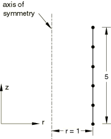

# 1.3.20 Axisymmetric membrane elements

**Product: **Abaqus/Standard  

### Elements tested

MAX1    MAX2    MGAX1    MGAX2    

### Problem description

**Model: **

Thickness of membrane is 0.05.

**Material: **

For tests without orientation: linear elastic, Young's modulus = 105, Poisson's ratio = 0.3, thermal expansion coefficient = 107.

For tests using orientation: linear elastic, engineering constants with  102,  108,  102,  0, and  102.

**Boundary conditions: **

Degree of freedom 2 is fixed for the bottom node. In addition, degree of freedom 5 is fixed for the bottom node for elements supporting twist.

**Initial conditions: **

For tests without orientation an initial stress field of  0.001 and  0.001 is applied to all elements. The temperature of all nodes is set to 0 initially.

### History definition I (for all element types)

**Step 1 (geometrically nonlinear):**

Loading: All degrees of freedom at all nodes are constrained. This step is recommended to apply the initial stresses. In subsequent steps all the necessary boundary conditions are applied.

**Step 2 (perturbation):**

Loading: A concentrated force (in direction 2) of magnitude 314 is applied to the top node.

Analytical solution:  at top node = 0.04998.

**Step 3 (perturbation):**

Loading: Internal pressure of magnitude 500.

Analytical solution: Hoop stress = 10000.

**Step 4 (perturbation):**

Loading: The temperature at all nodes is increased to 5000.

Analytical solution:  0.0005.

### History definition II (for element types MGAX1 and MGAX2)

**Step 1 (geometrically nonlinear):**

Loading: All degrees of freedom at all nodes are constrained. This step is recommended to apply the initial stresses. In subsequent steps all the necessary boundary conditions are applied.

**Step 2 (perturbation):**

Loading: A concentrated moment (in degree of freedom 5) of magnitude 200 is applied to the top node.

Analytical solution: Shear stress = 636.22.

### History definition III (for element types MGAX1 and MGAX2 using a local coordinate system)

**Step 1 (geometrically nonlinear):**

Loading: A concentrated load of magnitude 2 is applied to the top node.

**Step 2 (geometrically nonlinear):**

Loading: A concentrated moment of magnitude 2 is applied to the top node.

### Results and discussion

**History definition I:**

 All elements yield exact solutions.

**History definition II:**

The deviation from the analytical solution is approximately 0.06%.

**History definition III:**

The results are compared with those from a similar well-refined model using CGAX4R (axisymmetric continuum elements that support twist) elements. Since the strain in the thickness direction is very small in the continuum model, the section Poisson's ratio is set to 0 for the membrane model. The results match very well.

### Input files

[ema2srs3.inp](../eif/ema2srs3.inp)

MAX1 elements.

[ema3srs3.inp](../eif/ema3srs3.inp)

MAX2 elements.

[emg2srs3.inp](../eif/emg2srs3.inp)

MGAX1 elements without twist.

[emg3srs3.inp](../eif/emg3srs3.inp)

MGAX2 elements without twist.

[emg2srt3.inp](../eif/emg2srt3.inp)

MGAX1 elements with twist.

[emg3srt3.inp](../eif/emg3srt3.inp)

MGAX2 elements with twist.

[emg2sro3.inp](../eif/emg2sro3.inp)

MGAX1 elements with [*ORIENTATION](../key/key-link.md#usb-kws-morientation).

[emg3sro3.inp](../eif/emg3sro3.inp)

MGAX2 elements with [*ORIENTATION](../key/key-link.md#usb-kws-morientation).

