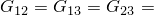
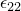
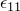

# 1.3.21 Cylindrical membrane elements

**Product: **Abaqus/Standard  

### Elements tested

MCL6    MCL9    

### Problem description

**Model: **

The model consists of a cylinder with initial radius and height both equal to 1. The initial thickness is 0.05. The cylinder is modeled using four cylindrical membrane elements, with each element spanning a 90 segment. Cylindrical transformation is used at all the nodes such that the boundary conditions and loads can be conveniently defined in the local radial, circumferential, and axial directions.

**Material: **

For tests without orientation: linear elastic, Young's modulus = 105, Poisson's ratio = 0.3, thermal expansion coefficient = 107.

For tests using orientation: linear elastic, engineering constraints with  102,  108,  102,  0, and  102. The orientation is defined such that the fibers line up at an angle of 4 relative to the axial direction. With this setup, an axial force results in twist and, hence, development of shear strains.

**Boundary conditions: **

The boundary conditions are different in the different steps and are described in the history definition subsection.

**Initial conditions: **

For all the tests an initial stress field of  0.001 and  0.001 is applied to all elements. For tests that include thermal expansion the temperature of all nodes is set to 0 initially.

### History definition 1 (for all element types)

**Step 1 (geometrically nonlinear):**

Loading: All degrees of freedom at all nodes are constrained. This step is recommended to apply the initial stresses. In subsequent steps all the necessary boundary conditions are applied.

**Step 2 (geometrically nonlinear):**

Boundary conditions: All nodes are fixed in the radial and circumferential directions. The top nodes are moved axially by 0.2.

Analytical solution:  = 0.1823. The current membrane thickness is 0.04167.

**Step 3 (geometrically nonlinear):**

Boundary conditions: Same as in Step 2 except that the radial motion of all nodes is unconstrained.

Analytical solution: The axial strain remains unchanged. The radius and the thickness of the cylinder change in a manner such that the total volume is preserved.

### History definition 2 (for all element types)

**Step 1 (geometrically nonlinear):**

Loading: All degrees of freedom at all nodes are constrained. This step is recommended to apply the initial stresses. In subsequent steps all the necessary boundary conditions are applied.

**Step 2 (geometrically nonlinear):**

Loading and boundary conditions: All nodes are fixed in the circumferential direction. In addition, all nodes at the bottom of the cylinder are fixed in the axial direction. The radial motion of all nodes are left unconstrained. Concentrated loads, which were obtained as reaction forces (at the bottom nodes of the cylinder) for the deformation state in history definition 1, are applied on the nodes on top of the cylinder.

Analytical solution: The deformation should be consistent with that at the end of Step 3 in history definition 1.

### History definition 3 (for all element types)

**Step 1 (geometrically nonlinear)**

Loading: All degrees of freedom at all nodes are constrained. This step is recommended to apply the initial stresses. In subsequent steps all the necessary boundary conditions are applied.

**Step 2 (perturbation):**

Loading and boundary conditions: All nodes are fixed in the circumferential direction. In addition, all nodes at the bottom of the cylinder are fixed in the axial direction. The radial motion of all nodes is left unconstrained. An axial displacement of magnitude 0.2 is applied to all the nodes on the top of the cylinder.

Analytical solution:  = 0.2.

**Step 3 (perturbation):**

Loading and boundary conditions: All nodes are fixed in the circumferential direction. In addition, all nodes at the bottom of the cylinder are fixed in the axial direction. The radial motion of all nodes is left unconstrained. Concentrated loads, which were obtained as reaction forces (at the bottom nodes of the cylinder) for the deformation state in Step 1, are applied on the nodes on top of the cylinder.

Analytical solution: The deformation state should be identical to that obtained in Step 1.

**Step 4 (perturbation):**

Loading and boundary conditions: All nodes are fixed in the circumferential direction. In addition, all nodes at the bottom of the cylinder are fixed in the axial direction. The radial motion of all nodes is left unconstrained. A distributed pressure load of magnitude 500 is applied to the inner surface, thereby expanding the cylinder uniformly.

Analytical solution: The hoop stress is 10000.

**Step 5 (perturbation):**

Loading and boundary conditions: All nodes are fixed in the circumferential direction. In addition, all nodes at the bottom of the cylinder are fixed in the axial direction. The radial motion of all nodes is left unconstrained. The temperature of all nodes is prescribed to be 5000, leading to thermal strains.

Analytical solution:  =  = 0.0005.

### History definition 4 (for all element types; uses a local coordinate system)

**Step 1 (geometrically nonlinear):**

Loading: All degrees of freedom at all nodes are constrained. This step is recommended to apply the initial stresses. In subsequent steps all the necessary boundary conditions are applied.

**Step 2 (geometrically nonlinear):**

Loading: A concentrated load of magnitude 2 is applied to the top of the cylinder. To facilitate the application of the load, a beam-type multi-point constraint is used to connect the nodes on top of the cylinder to a master node.

### Results and discussion

**History definition 1:**

 All elements yield solutions that are very close to the analytical solutions.

**History definition 2:**

The solutions are very close to the state obtained at the end of Step 3 in history definition 1.

**History definition 3:**

All elements yield solutions that are very close to the analytical solutions.

**History definition 4:**

The results are compared with those from a similar model using an MGAX1 (axisymmetric membrane elements that support twist) element. The results match very well.

### Input files

[emc6srs3.inp](../eif/emc6srs3.inp)

MCL6 elements using history definition 1.

[emc9srs3.inp](../eif/emc9srs3.inp)

MCL9 elements using history definition 1.

[emc6srs4.inp](../eif/emc6srs4.inp)

MCL6 elements using history definition 2.

[emc9srs4.inp](../eif/emc9srs4.inp)

MCL9 elements using history definition 2.

[emc6srp3.inp](../eif/emc6srp3.inp)

MCL6 elements using history definition 3.

[emc9srp3.inp](../eif/emc9srp3.inp)

MCL9 elements using history definition 3.

[emc6sro3.inp](../eif/emc6sro3.inp)

MCL6 elements with [*ORIENTATION](../key/key-link.md#usb-kws-morientation) using history definition 4.

[emc9sro3.inp](../eif/emc9sro3.inp)

MCL9 elements with [*ORIENTATION](../key/key-link.md#usb-kws-morientation) using history definition 4.

