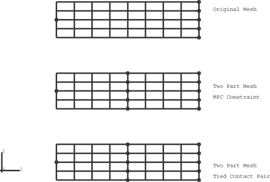
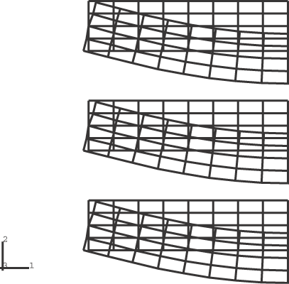
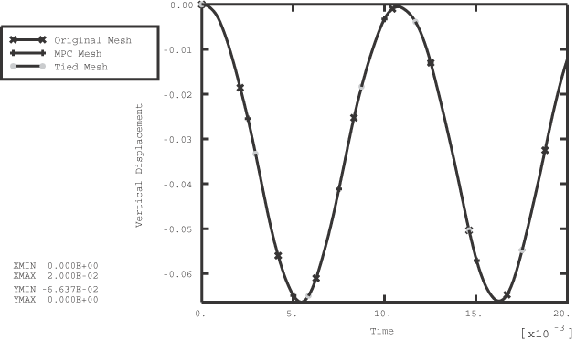
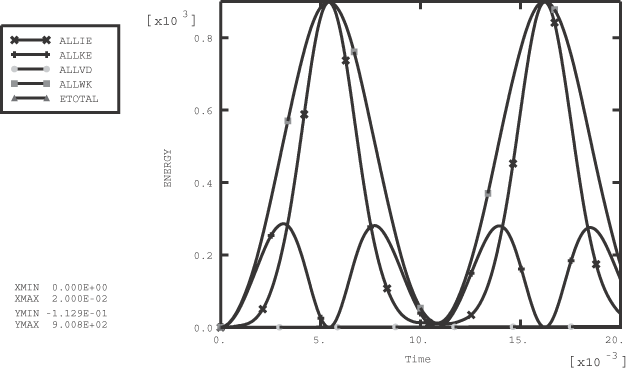
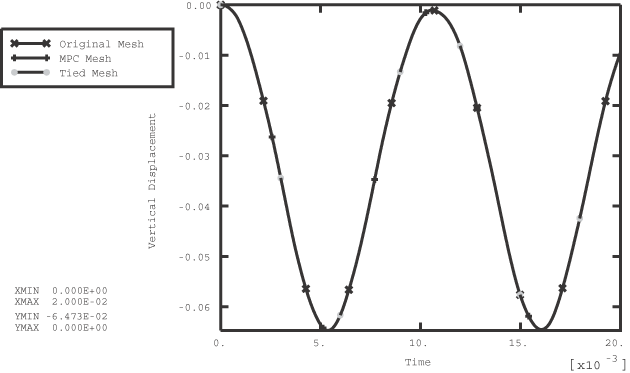
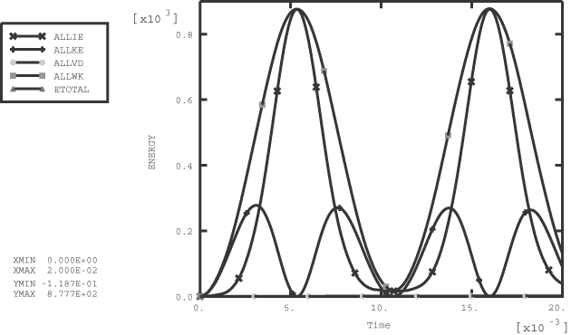
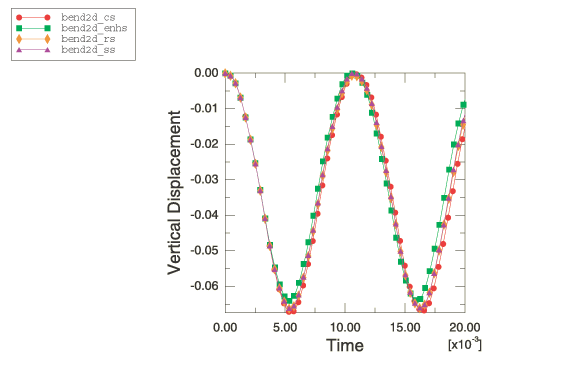
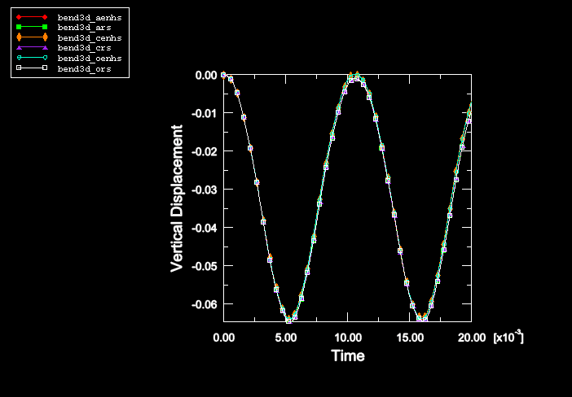
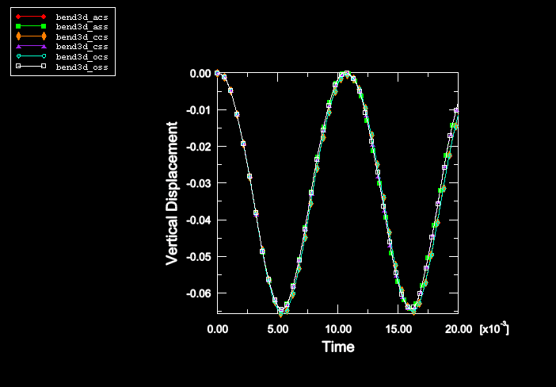
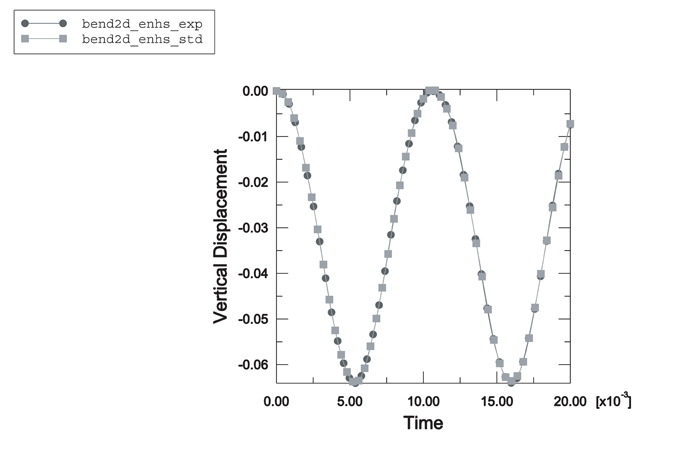

# 1.3.26 Flexure of a deep beam

**Products: **Abaqus/Standard  Abaqus/Explicit  

### Elements tested

CPE4R    C3D8R    

### Features tested

Hourglass control, kinematic formulation, tied contact surfaces, multi-point constraints.

### Problem description

In this example the flexural response of a simply supported beam is modeled using continuum elements. The problem was originally used by [Flanagan and Belystchko (1982)](ch01s03abv29.md#ver-ref-flana-belyst) to test the hourglass control algorithms found in lower-order elements.

The half-symmetry model of the beam has a half-span of 0.4 and a depth of 0.1. The mesh consists of 32 elements (8  4). The material is linear elastic with Young's modulus = 1  106, Poisson's ratio = 0.0, and density = 1000.

A pinned boundary condition (directions 1 and 2) is specified for the center node on the left boundary of the mesh. A symmetry condition (direction 1) is specified for all the nodes on the right boundary of the mesh. A constant pressure load of magnitude 720000 is applied instantaneously to the top surface of the beam at the beginning of the step.

This problem is modeled with both two-dimensional and three-dimensional elements. In the two-dimensional case all the elements are 4-node plane strain continuum elements (CPE4R). [Figure 1.3.26--1](ch01s03abv29.md#exxbend-origmesh) shows three meshes for the problem. The upper mesh is the standard case with 45 nodes. The center and lower mesh in the figure have been generated as two distinct parts each containing 16 elements (4  4) and 25 nodes. The two parts intersect along a vertical line of nodes where there are two nodes at each point with identical coordinates (coincident nodes). The mesh shown in the center is constrained to behave as the continuous mesh by using multi-point constraints to pin the coincident nodes along the interface between the two parts. In the lower mesh a surface-based tie constraint is used to constrain the nodes along the interface to have the same response as the original mesh. The three meshes should give identical results with these constraints. All the nodes that have boundary conditions or constraints are indicated in [Figure 1.3.26--1](ch01s03abv29.md#exxbend-origmesh) by circles.

The three-dimensional case is identical to the two-dimensional case except that 8-node continuum elements (C3D8R) are used to model the beam. In this case the out-of-plane displacements are constrained to be zero (plane strain). Three meshes are also used in the three-dimensional case with the same constraints (in three dimensions) as described for the two-dimensional case.

The above problems are solved with different section control options. For two-dimensional and three-dimensional solid elements the section control options in Abaqus/Explicit allow the user to choose between five different hourglass control options. In addition, three different kinematic assumptions can be chosen for the three-dimensional solid elements. A discussion of the accuracy and performance that can be obtained with the various section control options can be found in ["Section controls," Section 27.1.4 of the Abaqus Analysis User's Guide](../usb/usb-link.md#usb-elm-esectioncontrol). Viscous hourglass control should not be used in quasi-static or low-mode dynamics problems, and analyses with this option are not included here. The section controls option in Abaqus/Standard allows the user to pick between two different hourglass control options. The reduced-integration elements in Abaqus/Standard allow only average strain kinematic formulation with second-order accuracy. [Table 1.3.26--1](ch01s03abv29.md#table-bend-peakresp) lists the various options and their plot legend and file descriptors.

### Results and discussion

[Figure 1.3.26--2](ch01s03abv29.md#exxbend-deform-mesh) through [Figure 1.3.26--4](ch01s03abv29.md#exxbend-energies-2d) show results for the two-dimensional analysis run with default section control options (relaxed stiffness hourglass control is used) with Abaqus/Explicit. [Figure 1.3.26--2](ch01s03abv29.md#exxbend-deform-mesh) shows the deformed shape for the two-dimensional case at the maximum deflection (time=.016). The three-dimensional deformed shapes are indistinguishable from those for the two-dimensional case. [Figure 1.3.26--3](ch01s03abv29.md#exxbend-vertdisp-2d) shows the time history of vertical deflection for the midpoint on the symmetry plane for the two-dimensional case. There are three values plotted in the figure (one for each mesh), and they are identical. [Figure 1.3.26--4](ch01s03abv29.md#exxbend-energies-2d) shows the time history of the energies in the two-dimensional case. [Figure 1.3.26--5](ch01s03abv29.md#exxbend-vertdisp-3d) and [Figure 1.3.26--6](ch01s03abv29.md#exxbend-energies-3d) show results for the three-dimensional analysis run with default section control options (average strain kinematic and relaxed stiffness hourglass control are used) with Abaqus/Explicit. [Figure 1.3.26--5](ch01s03abv29.md#exxbend-vertdisp-3d) shows the time history of vertical deflection for the midpoint on the symmetry plane for the three-dimensional case. [Figure 1.3.26--6](ch01s03abv29.md#exxbend-energies-3d) shows the time history of the energies in the three-dimensional case. All three values (one for each mesh) are plotted. The results correspond exactly with the results reported in [Flanagan and Belystchko (1982)](ch01s03abv29.md#ver-ref-flana-belyst).

For this problem only slight differences are observed among the default and nondefault kinematic and hourglass options in Abaqus/Explicit. With enhanced hourglass control, the solution for the two-dimensional case essentially matches the three-dimensional case with average strain kinematics. [Figure 1.3.26--7](ch01s03abv29.md#exxbend-tipdisp-2d) through [Figure 1.3.26--9](ch01s03abv29.md#exxbend-tipdisp-3d-2) show the history of the tip displacement for selected nondefault section control cases. [Table 1.3.26--1](ch01s03abv29.md#table-bend-peakresp) lists the peak response of the vertical displacements for all of the cases.

The two-dimensional and three-dimensional analyses were also run in Abaqus/Standard with enhanced and stiffness hourglass control. [Figure 1.3.26--10](ch01s03abv29.md#exxbend-tipdisp-2d-stdexp) compares the time history of the tip displacement for enhanced hourglass control for the two-dimensional case between Abaqus/Standard and Abaqus/Explicit. The Abaqus/Explicit analysis was run with the average strain kinematic formulation and second-order accuracy, which are the only options available in Abaqus/Standard. The results show a close match. The results obtained using stiffness hourglass control and nondefault hourglass stiffness with Abaqus/Standard also agree with the results obtained with enhanced hourglass control for both the two-dimensional and three-dimensional analyses.

### Input files

[bend2d_cs.inp](../eif/bend2d_cs.inp)

Two-dimensional case with the COMBINED hourglass control.

[bend2d_enhs.inp](../eif/bend2d_enhs.inp)

Two-dimensional case with the ENHANCED hourglass control.

[bend2d_rs.inp](../eif/bend2d_rs.inp)

Two-dimensional case with the default section control options (RELAX STIFFNESS hourglass control).

[bend2d_ss.inp](../eif/bend2d_ss.inp)

Two-dimensional case with the STIFFNESS hourglass control.

[bend2d_enhs_std.inp](../eif/bend2d_enhs_std.inp)

Two-dimensional case with ENHANCED hourglass control in Abaqus/Standard.

[bend2d_ss_std.inp](../eif/bend2d_ss_std.inp)

Two-dimensional case with STIFFNESS hourglass control in Abaqus/Standard.

[bend3d_acs.inp](../eif/bend3d_acs.inp)

Three-dimensional case with the AVERAGE STRAIN kinematic and COMBINED hourglass control options.

[bend3d_aenhs.inp](../eif/bend3d_aenhs.inp)

Three-dimensional case with the AVERAGE STRAIN kinematic and ENHANCED hourglass control options.

[bend3d_ars.inp](../eif/bend3d_ars.inp)

Three-dimensional case with the default section control options (AVERAGE STRAIN kinematic and RELAX STIFFNESS hourglass control).

[bend3d_ass.inp](../eif/bend3d_ass.inp)

Three-dimensional case with the AVERAGE STRAIN kinematic and STIFFNESS hourglass control options.

[bend3d_ccs.inp](../eif/bend3d_ccs.inp)

Three-dimensional case with the CENTROID kinematic and COMBINED hourglass control options.

[bend3d_cenhs.inp](../eif/bend3d_cenhs.inp)

Three-dimensional case with the CENTROID kinematic and ENHANCED hourglass control options.

[bend3d_crs.inp](../eif/bend3d_crs.inp)

Three-dimensional case with the CENTROID kinematic and RELAX STIFFNESS hourglass control options.

[bend3d_css.inp](../eif/bend3d_css.inp)

Three-dimensional case with the CENTROID kinematic and STIFFNESS hourglass control options.

[bend3d_ocs.inp](../eif/bend3d_ocs.inp)

Three-dimensional case with the ORTHOGONAL kinematic and COMBINED hourglass control options.

[bend3d_oenhs.inp](../eif/bend3d_oenhs.inp)

Three-dimensional case with the ORTHOGONAL kinematic and ENHANCED hourglass control options.

[bend3d_ors.inp](../eif/bend3d_ors.inp)

Three-dimensional case with the ORTHOGONAL kinematic and RELAX STIFFNESS hourglass control options.

[bend3d_oss.inp](../eif/bend3d_oss.inp)

Three-dimensional case with the ORTHOGONAL kinematic and STIFFNESS hourglass control options.

[bend3d_aenhs_std.inp](../eif/bend3d_aenhs_std.inp)

Three-dimensional case with ENHANCED hourglass control in Abaqus/Standard.

[bend3d_ass_std.inp](../eif/bend3d_ass_std.inp)

Three-dimensional case with STIFFNESS hourglass control in Abaqus/Standard.

### Reference

Flanagan, D. P., and T. Belystchko, “A Uniform Strain Hexahedron and Quadrilateral with Orthogonal Hourglass Control,” J. Comp. Meth. Appl. Mech. Eng., vol. 17, pp. 679–706, 1982.

### Table

**Table 1.3.26–1** Peak response of the vertical displacement of the centerline of the beam for different section control options.
| Analysis File | Peak Response ( 102) | Section Controls |
| --- | --- | --- |
| Kinematic | Hourglass |
| bend2d_rs | 6.638 | n/a | relax |
| bend2d_ss | 6.630 | n/a | stiffness |
| bend2d_cs | 6.743 | n/a | combined |
| bend2d_enhs | 6.409 | n/a | enhanced |
| bend2d_enhs_std | --6.394 | n/a | enhanced |
| bend2d_ss_std | --6.423 | n/a | stiffness |
| bend3d_ars | 6.466 | average | relax |
| bend3d_ass | 6.451 | average | stiffness |
| bend3d_acs | 6.566 | average | combined |
| bend3d_aenhs | 6.401 | average | enhanced |
| bend3d_ors | 6.466 | orthogonal | relax |
| bend3d_oss | 6.451 | orthogonal | stiffness |
| bend3d_ocs | 6.566 | orthogonal | combined |
| bend3d_oenhs | 6.401 | orthogonal | enhanced |
| bend3d_crs | 6.464 | centroid | relax |
| bend3d_css | 6.449 | centroid | stiffness |
| bend3d_ccs | 6.565 | centroid | combined |
| bend3d_cenhs | 6.392 | centroid | enhanced |
| bend3d_aenhs_std | --6.394 | n/a | enhanced |
| bend3d_ass_std | --6.286 | n/a | stiffness |

### Figures

**Figure 1.3.26–1** Original mesh for flexure.

**Figure 1.3.26–2** Deformed mesh at *T*=0.016 sec (2D case with default section controls).

**Figure 1.3.26–3** History of the vertical displacement of the centerline (2D case with default section controls).

**Figure 1.3.26–4** Time history of the energies (2D case with default section controls).

**Figure 1.3.26–5** History of the vertical displacement of the centerline (3D case with default section controls).

**Figure 1.3.26–6** Time history of the energies (3D case with default section controls).

**Figure 1.3.26–7** Comparison of the tip displacement history for the 2D case with different section control options (original mesh).

**Figure 1.3.26–8** Comparison of the tip displacement history for the 3D case with different section control options (original mesh).

**Figure 1.3.26–9** Comparison of the tip displacement history for the 3D case with different section control options (original mesh).

**Figure 1.3.26–10** Comparison of the tip displacement history for the 2D case with enhanced hourglass control (original mesh).

