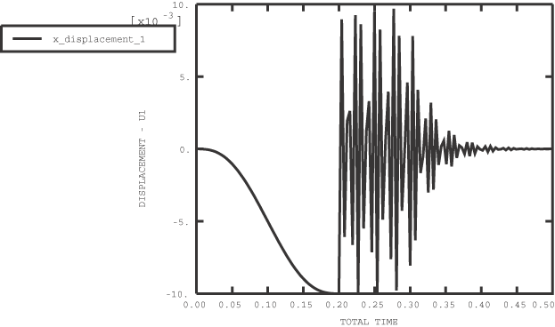
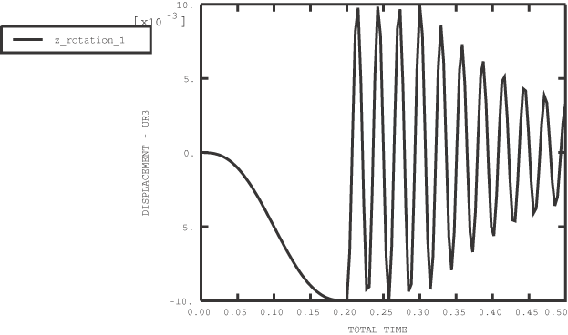
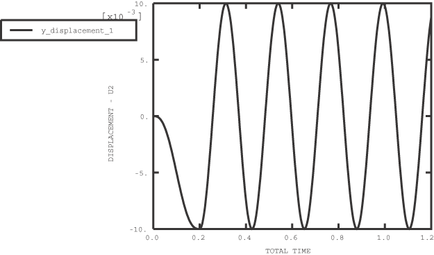
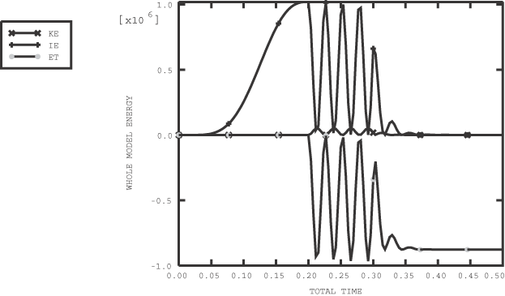
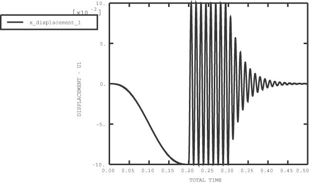
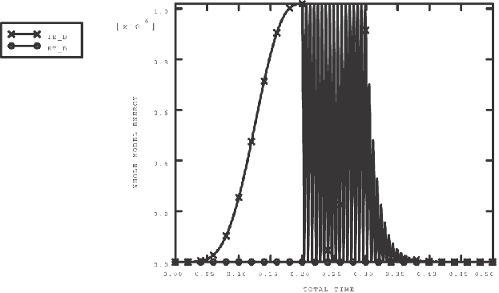
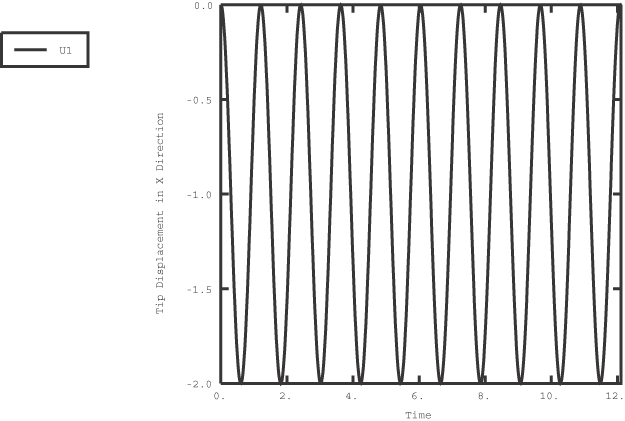
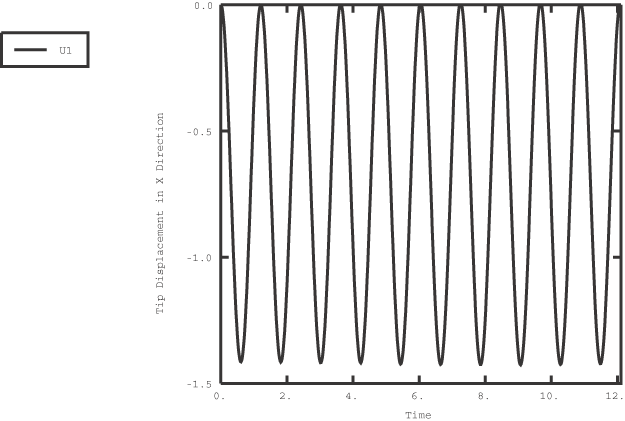

# 1.3.27 Simple tests of beam kinematics

**Product: **Abaqus/Explicit  

### Elements tested

B21    B22    B31    B32    PIPE21    PIPE31    

### Features tested

Stability of beams in deformation and in rigid body rotation.

### Problem description

This problem is used to verify that individual beam elements demonstrate stable behavior for both small-displacement response and large-rotation response. In the first case the beam is loaded in the axial, bending, shear, and twisting (three-dimensional beams only) deformation modes and allowed to vibrate freely. The second case tests rigid body rotation of a beam about one of its endpoints. In both cases two-dimensional and three-dimensional beams are tested with and without bulk viscosity. Two-dimensional and three-dimensional pipe elements are also tested for deformations, similar to beam elements with pipe cross-sections.

### Deformation tests

These tests consist of three steps. In the first step the bulk viscosity of the beam is set to zero, and a displacement or rotation is applied to the ends of the beam using a smooth step amplitude. In the second step the displacement constraints are removed, and the beam is allowed to oscillate freely. Finally, in the third step the bulk viscosity is set to a value of 0.06 and the beam is allowed to oscillate with damping. Fixed time incrementation is used in all of the steps. This time incrementation strategy uses a time increment that is based on the critical element-by-element stable time increment estimates at the beginning of a step. It is used to avoid the propagation of noise in the solution that may occur when the default time incrementation strategy is used without bulk viscosity. Normally, the default bulk viscosity will damp out and prevent the propagation of this high-frequency noise.

### Rigid body rotation tests

These tests consist of two steps. Initial velocities are applied to the beam to induce rotation, and initial axial stresses are applied to simulate the centrifugal stress generated in a rotating body. In the first step the bulk viscosity is set to zero and the beam is allowed to rotate 5 complete revolutions about its endpoint. In the second step the bulk viscosity is set to 0.06 and the beam is allowed to rotate another 5 revolutions. In the two-dimensional case the axis of rotation is the *z*-axis. In the three-dimensional case the axis of rotation is in the *X–Y* plane aligned at 45 to the original *y*-axis.

### Results and discussion

The results for each test are described in the following sections.

#### Deformation test results

This problem demonstrates that the beam elements used in Abaqus/Explicit provide stable behavior for free and damped vibration. [Figure 1.3.27--1](ch01s03abv30.md#exxbeams-xsect-axial), [Figure 1.3.27--2](ch01s03abv30.md#exxbeams-xsect-bend), and [Figure 1.3.27--3](ch01s03abv30.md#exxbeams-xsect-shear), respectively, show typical displacement and rotation results for the axial, bending, and shear loading of a two-dimensional beam with a box cross-section. All displacements and rotations exhibit magnitudes equal to or less than those applied in Step 1.

The energy balance for the axially loaded beam is poor, as shown in [Figure 1.3.27--4](ch01s03abv30.md#exxbeams-energies-fixed). This inaccuracy occurs because too few increments are used to predict each cycle of the beam's axial response. The inaccuracy occurs only in the axially loaded case because the period of the vibration in the other modes is significantly higher, so more time increments are included in each vibration cycle. The displacement response and energy balance can be obtained more accurately by using direct time integration. The results obtained for the axial response of the two-dimensional box-section beam using direct time integration with a time increment of 1  104 are shown in [Figure 1.3.27--5](ch01s03abv30.md#exxbeams-xsect-axial-direct) (displacement) and [Figure 1.3.27--6](ch01s03abv30.md#exxbeams-energies-direct) (energy balance).

#### Rotation test results

All axial strains are zero for both the two-dimensional and the three-dimensional cases. The displacement in the *x*-direction varies sinusoidally with a constant amplitude over the entire range of rotation. Plots of the displacement in the *x*-direction versus time are shown in [Figure 1.3.27--7](ch01s03abv30.md#exxbeams-b21disp-v-time) for the two-dimensional case and [Figure 1.3.27--8](ch01s03abv30.md#exxbeams-b31disp-v-time) for the three-dimensional case.

### Input files

##### **Two-dimensional beam element tests**

#### Box cross-section:

[b2d_box_axial.inp](../eif/b2d_box_axial.inp)

Axial loading.

[b2d_box_axial_p.inp](../eif/b2d_box_axial_p.inp)

Axial loading and an effective Poisson's ratio defined for the section.

[b2d_box_bend.inp](../eif/b2d_box_bend.inp)

Bending.

[b2d_box_bend_p.inp](../eif/b2d_box_bend_p.inp)

Bending and an effective Poisson's ratio defined for the section.

[b2d_box_shear.inp](../eif/b2d_box_shear.inp)

Shear loading.

[b2d_box_shear_p.inp](../eif/b2d_box_shear_p.inp)

Shear loading and an effective Poisson's ratio defined for the section.

The following input files are also included with the Abaqus release: [b2d_box_axial_de.inp](../eif/b2d_box_axial_de.inp), [b2d_box_axial_df.inp](../eif/b2d_box_axial_df.inp), [b2d_box_axial_dfs.inp](../eif/b2d_box_axial_dfs.inp), [b2d_box_axial_dg.inp](../eif/b2d_box_axial_dg.inp), [b2d_box_axial_direct.inp](../eif/b2d_box_axial_direct.inp), [b2d_box_axial_ed.inp](../eif/b2d_box_axial_ed.inp), [b2d_box_axial_ef.inp](../eif/b2d_box_axial_ef.inp), [b2d_box_axial_fd.inp](../eif/b2d_box_axial_fd.inp), and [b2d_box_axial_fe.inp](../eif/b2d_box_axial_fe.inp).

#### Circular cross-section:

[b2d_circ_axial.inp](../eif/b2d_circ_axial.inp)

Axial loading.

[b2d_circ_axial_p.inp](../eif/b2d_circ_axial_p.inp)

Axial loading and an effective Poisson's ratio defined for the section.

[b2d_circ_bend.inp](../eif/b2d_circ_bend.inp)

Bending.

[b2d_circ_bend_p.inp](../eif/b2d_circ_bend_p.inp)

Bending and an effective Poisson's ratio defined for the section.

[b2d_circ_rot_p.inp](../eif/b2d_circ_rot_p.inp)

Rigid body rotation and an effective Poisson's ratio defined for the section.

[b2d_circ_shear.inp](../eif/b2d_circ_shear.inp)

Shear loading.

[b2d_circ_shear_p.inp](../eif/b2d_circ_shear_p.inp)

Shear loading and an effective Poisson's ratio defined for the section.

#### Hexagonal cross-section:

[b2d_hex_axial.inp](../eif/b2d_hex_axial.inp)

Axial loading.

[b2d_hex_bend.inp](../eif/b2d_hex_bend.inp)

Bending.

[b2d_hex_shear.inp](../eif/b2d_hex_shear.inp)

Shear loading.

#### I cross-section:

[b2d_i_axial.inp](../eif/b2d_i_axial.inp)

Axial loading.

[b2d_i_bend.inp](../eif/b2d_i_bend.inp)

Bending.

[b2d_i_shear.inp](../eif/b2d_i_shear.inp)

Shear loading.

#### L cross-section:

[b2d_l_axial.inp](../eif/b2d_l_axial.inp)

Axial loading.

[b2d_l_axial_p.inp](../eif/b2d_l_axial_p.inp)

Axial loading and an effective Poisson's ratio defined for the section.

[b2d_l_bend.inp](../eif/b2d_l_bend.inp)

Bending.

[b2d_l_bend_p.inp](../eif/b2d_l_bend_p.inp)

Bending and an effective Poisson's ratio defined for the section.

[b2d_l_shear.inp](../eif/b2d_l_shear.inp)

Shear loading.

[b2d_l_shear_p.inp](../eif/b2d_l_shear_p.inp)

Shear loading and an effective Poisson's ratio defined for the section.

#### Pipe cross-section:

[b2d_pipe_axial.inp](../eif/b2d_pipe_axial.inp)

Axial loading.

[p2d_axial.inp](../eif/p2d_axial.inp)

Axial loading on pipe elements.

[b2d_pipe_bend.inp](../eif/b2d_pipe_bend.inp)

Bending.

[p2d_bend.inp](../eif/p2d_bend.inp)

Bending of pipe elements.

[b2d_pipe_shear.inp](../eif/b2d_pipe_shear.inp)

Shear loading.

[p2d_shear.inp](../eif/p2d_shear.inp)

Shear loading on pipe elements.

#### Rectangular cross-section:

[b2d_rect_axial.inp](../eif/b2d_rect_axial.inp)

Axial loading.

[b2d_rect_axial_p.inp](../eif/b2d_rect_axial_p.inp)

Axial loading and an effective Poisson's ratio defined for the section.

[b2d_rect_bend.inp](../eif/b2d_rect_bend.inp)

Bending.

[b2d_rect_bend_p.inp](../eif/b2d_rect_bend_p.inp)

Bending and an effective Poisson's ratio defined for the section.

[b2d_rect_shear.inp](../eif/b2d_rect_shear.inp)

Shear loading.

[b2d_rect_shear_p.inp](../eif/b2d_rect_shear_p.inp)

Shear loading and an effective Poisson's ratio defined for the section.

#### Trapezoidal cross-section:

[b2d_trap_axial.inp](../eif/b2d_trap_axial.inp)

Axial loading.

[b2d_trap_bend.inp](../eif/b2d_trap_bend.inp)

Bending.

[b2d_trap_shear.inp](../eif/b2d_trap_shear.inp)

Shear loading.

#### Beam general cross-section:

[b2d_gsp_axial.inp](../eif/b2d_gsp_axial.inp)

Axial loading with elastic-plastic response.

[b2d_gsp_bend.inp](../eif/b2d_gsp_bend.inp)

Bending with elastic-plastic response.

[b2d_gsp_shear.inp](../eif/b2d_gsp_shear.inp)

Shear loading with elastic-plastic response.

[b2d_gs_axial.inp](../eif/b2d_gs_axial.inp)

Axial loading with linear elastic response.

[b2d_gsl_bend.inp](../eif/b2d_gsl_bend.inp)

Bending with linear elastic response.

[b2d_gsl_shear.inp](../eif/b2d_gsl_shear.inp)

Shear loading with linear elastic response.

[b2d_gsnl_axial.inp](../eif/b2d_gsnl_axial.inp)

Axial loading with nonlinear elastic response.

[b2d_gsnl_bend.inp](../eif/b2d_gsnl_bend.inp)

Bending with nonlinear elastic response.

[b2d_gsnl_shear.inp](../eif/b2d_gsnl_shear.inp)

Shear loading with nonlinear elastic response.

[b2d_gsbox_axial.inp](../eif/b2d_gsbox_axial.inp)

Axial loading with box cross-section.

[b2d_gsbox_bend.inp](../eif/b2d_gsbox_bend.inp)

Bending with with box cross-section.

[b2d_gsbox_shear.inp](../eif/b2d_gsbox_shear.inp)

Shear loading with box cross-section.

##### **Three-dimensional beam element tests**

#### Arbitrary closed cross-section:

[b3d_arb_c_axial.inp](../eif/b3d_arb_c_axial.inp)

Axial loading.

[b3d_arb_c_bend.inp](../eif/b3d_arb_c_bend.inp)

Bending.

[b3d_arb_c_shear.inp](../eif/b3d_arb_c_shear.inp)

Shear loading.

[b3d_arb_c_twist.inp](../eif/b3d_arb_c_twist.inp)

Twist.

#### Arbitrary open cross-section:

[b3d_arb_o_axial.inp](../eif/b3d_arb_o_axial.inp)

Axial loading.

[b3d_arb_o_bend.inp](../eif/b3d_arb_o_bend.inp)

Bending.

[b3d_arb_o_shear.inp](../eif/b3d_arb_o_shear.inp)

Shear loading.

[b3d_arb_o_twist.inp](../eif/b3d_arb_o_twist.inp)

Twist.

#### Box cross-section:

[b3d_box_axial.inp](../eif/b3d_box_axial.inp)

Axial loading.

[b3d_box_axial_p.inp](../eif/b3d_box_axial_p.inp)

Axial loading and an effective Poisson's ratio defined for the section.

[b3d_box_bend.inp](../eif/b3d_box_bend.inp)

Bending.

[b3d_box_bend_p.inp](../eif/b3d_box_bend_p.inp)

Bending and an effective Poisson's ratio defined for the section.

[b3d_box_shear.inp](../eif/b3d_box_shear.inp)

Shear loading.

[b3d_box_shear_p.inp](../eif/b3d_box_shear_p.inp)

Shear loading and an effective Poisson's ratio defined for the section.

[b3d_box_twist.inp](../eif/b3d_box_twist.inp)

Twist.

[b3d_box_twist_p.inp](../eif/b3d_box_twist_p.inp)

Twist and an effective Poisson's ratio defined for the section.

#### Circular cross-section:

[b3d_circ_axial.inp](../eif/b3d_circ_axial.inp)

Axial loading.

[b3d_circ_axial_p.inp](../eif/b3d_circ_axial_p.inp)

Axial loading and an effective Poisson's ratio defined for the section.

[b3d_circ_bend.inp](../eif/b3d_circ_bend.inp)

Bending.

[b3d_circ_bend_p.inp](../eif/b3d_circ_bend_p.inp)

Bending and an effective Poisson's ratio defined for the section.

[b3d_circ_rot_p.inp](../eif/b3d_circ_rot_p.inp)

Rigid body rotation and an effective Poisson's ratio defined for the section.

[b3d_circ_shear.inp](../eif/b3d_circ_shear.inp)

Shear loading.

[b3d_circ_shear_p.inp](../eif/b3d_circ_shear_p.inp)

Shear loading and an effective Poisson's ratio defined for the section.

[b3d_circ_twist.inp](../eif/b3d_circ_twist.inp)

Twist.

[b3d_circ_twist_p.inp](../eif/b3d_circ_twist_p.inp)

Twist and an effective Poisson's ratio defined for the section.

#### Hexagonal cross-section:

[b3d_hex_axial.inp](../eif/b3d_hex_axial.inp)

Axial loading.

[b3d_hex_bend.inp](../eif/b3d_hex_bend.inp)

Bending.

[b3d_hex_shear.inp](../eif/b3d_hex_shear.inp)

Shear loading.

[b3d_hex_twist.inp](../eif/b3d_hex_twist.inp)

Twist.

#### I cross-section:

[b3d_i_axial.inp](../eif/b3d_i_axial.inp)

Axial loading.

[b3d_i_bend.inp](../eif/b3d_i_bend.inp)

Bending.

[b3d_i_shear.inp](../eif/b3d_i_shear.inp)

Shear loading.

[b3d_i_twist.inp](../eif/b3d_i_twist.inp)

Twist.

#### L cross-section:

[b3d_l_axial.inp](../eif/b3d_l_axial.inp)

Axial loading.

[b3d_l_axial_p.inp](../eif/b3d_l_axial_p.inp)

Axial loading and an effective Poisson's ratio defined for the section.

[b3d_l_bend.inp](../eif/b3d_l_bend.inp)

Bending.

[b3d_l_bend_p.inp](../eif/b3d_l_bend_p.inp)

Bending and an effective Poisson's ratio defined for the section.

[b3d_l_shear.inp](../eif/b3d_l_shear.inp)

Shear loading.

[b3d_l_shear_p.inp](../eif/b3d_l_shear_p.inp)

Shear loading and an effective Poisson's ratio defined for the section.

[b3d_l_twist.inp](../eif/b3d_l_twist.inp)

Twist.

[b3d_l_twist_p.inp](../eif/b3d_l_twist_p.inp)

Twist and an effective Poisson's ratio defined for the section.

#### Pipe cross-section:

[b3d_pipe_axial.inp](../eif/b3d_pipe_axial.inp)

Axial loading.

[p3d_axial.inp](../eif/p3d_axial.inp)

Axial loading on pipe elements.

[b3d_pipe_bend.inp](../eif/b3d_pipe_bend.inp)

Bending.

[p3d_bend.inp](../eif/p3d_bend.inp)

Bending of pipe elements.

[b3d_pipe_shear.inp](../eif/b3d_pipe_shear.inp)

Shear loading.

[p3d_shear.inp](../eif/p3d_shear.inp)

Shear loading on pipe elements.

[b3d_pipe_twist.inp](../eif/b3d_pipe_twist.inp)

Twist.

[p3d_twist.inp](../eif/p3d_twist.inp)

Twisting of pipe elements.

#### Rectangular cross-section:

[b3d_rect_axial.inp](../eif/b3d_rect_axial.inp)

Axial loading.

[b3d_rect_axial_p.inp](../eif/b3d_rect_axial_p.inp)

Axial loading and an effective Poisson's ratio defined for the section.

[b3d_rect_bend.inp](../eif/b3d_rect_bend.inp)

Bending.

[b3d_rect_bend_p.inp](../eif/b3d_rect_bend_p.inp)

Bending and an effective Poisson's ratio defined for the section.

[b3d_rect_shear.inp](../eif/b3d_rect_shear.inp)

Shear loading.

[b3d_rect_shear_p.inp](../eif/b3d_rect_shear_p.inp)

Shear loading and an effective Poisson's ratio defined for the section.

[b3d_rect_twist.inp](../eif/b3d_rect_twist.inp)

Twist.

[b3d_rect_twist_p.inp](../eif/b3d_rect_twist_p.inp)

Twist.

#### Trapezoidal cross-section:

[b3d_trap_axial.inp](../eif/b3d_trap_axial.inp)

Axial loading.

[b3d_trap_bend.inp](../eif/b3d_trap_bend.inp)

Bending.

[b3d_trap_shear.inp](../eif/b3d_trap_shear.inp)

Shear loading.

[b3d_trap_twist.inp](../eif/b3d_trap_twist.inp)

Twist.

#### Beam general cross-section:

[b3d_gsp_axial.inp](../eif/b3d_gsp_axial.inp)

Axial loading with elastic-plastic response.

[b3d_gsp_bend.inp](../eif/b3d_gsp_bend.inp)

Bending with elastic-plastic response.

[b3d_gsp_shear.inp](../eif/b3d_gsp_shear.inp)

Shear loading with elastic-plastic response.

[b3d_gsp_twist.inp](../eif/b3d_gsp_twist.inp)

Twist with elastic-plastic response.

[b3d_gs_axial.inp](../eif/b3d_gs_axial.inp)

Axial loading with linear elastic response.

[b3d_gsl_bend.inp](../eif/b3d_gsl_bend.inp)

Bending with linear elastic response.

[b3d_gsl_shear.inp](../eif/b3d_gsl_shear.inp)

Shear loading with linear elastic response.

[b3d_gsl_twist.inp](../eif/b3d_gsl_twist.inp)

Twist with linear elastic response.

[b3d_gsnl_axial.inp](../eif/b3d_gsnl_axial.inp)

Axial loading with nonlinear elastic response.

[b3d_gsnl_bend.inp](../eif/b3d_gsnl_bend.inp)

Bending with nonlinear elastic response.

[b3d_gsnl_shear.inp](../eif/b3d_gsnl_shear.inp)

Shear loading with nonlinear elastic response.

[b3d_gsnl_twist.inp](../eif/b3d_gsnl_twist.inp)

Twist with nonlinear elastic response.

[b3d_gsbox_axial.inp](../eif/b3d_gsbox_axial.inp)

Axial loading with box cross-section.

[b3d_gsbox_bend.inp](../eif/b3d_gsbox_bend.inp)

Bending with with box cross-section.

[b3d_gsbox_shear.inp](../eif/b3d_gsbox_shear.inp)

Shear loading with box cross-section.

[b3d_gsbox_twist.inp](../eif/b3d_gsbox_twist.inp)

Twist with box cross-section.

### Figures

**Figure 1.3.27–1** B21 box cross-section with axial displacements.

**Figure 1.3.27–2** B21 box cross-section with bending.

**Figure 1.3.27–3** B21 box cross-section with shearing displacements.

**Figure 1.3.27–4** Energies for axial displacements (FIXED time increment control).

**Figure 1.3.27–5** B21 box-section with axial displacements (direct-solution time increment control).

**Figure 1.3.27–6** Energies for axial displacements (direct-solution time increment control).

**Figure 1.3.27–7** B21 displacement in *x*-direction versus time.

**Figure 1.3.27–8** B31 displacement in *x*-direction versus time.

