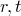
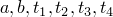
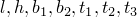

# 1.3.31 Verification of the plastic behavior of frame elements

**Product: **Abaqus/Standard  

### Elements tested

FRAME2D    FRAME3D    

### Features tested

The plastic behavior of frame elements with hollow circular, rectangular hollow box, and I-beam sections is tested under concentrated distributed loads. The yield surface is represented by an interaction of plastic axial forces with plastic moments including plastic torque. User-defined as well as default generalized plastic forces are used. Different geometries in two- and three-dimensional problems are considered.

### Problem description

The first problem ([frame2d_pps_cload.inp](../eif/frame2d_pps_cload.inp)) consists of three plane frame elements with PIPE cross-sections forming a statically determinate system. In three load steps concentrated forces are applied at the nodes. The values for plastic axial force and plastic bending moment are user-defined.

In the second statically determinate system ([frame2d_pbs_cload.inp](../eif/frame2d_pbs_cload.inp)), two frame elements are simply supported at both sides with concentrated forces applied at the middle node in the first load step. In the second load step an additional constant bending moment is applied to the system. The values for plastic axial force and plastic bending moment are user-defined.

The third example ([frame3d_pis_cload.inp](../eif/frame3d_pis_cload.inp)) is a one-element test in which an axial force, a bending load, and a torque are applied in three subsequent load steps. The plastic behavior is defined by default values from a given yield stress.

The fourth problem ([frame3d_pps_dload.inp](../eif/frame3d_pps_dload.inp)) is a statically determinate frame consisting of three elements that is loaded with various distributed loads, causing axial force, bending, and torque. The values for plastic axial force, plastic bending moment, and plastic torque are user-defined.

**Model: **

Cross-sectional dimensions are given in the order required by the beam cross-sectional library.

| Hollow circular cross-section:  | 1., .174355 |
| --- | --- |
| Rectangular hollow box cross-section:  | 1., 1., 0.2, 0.2, 0.2, 0.2 |
| I-beam cross-section:  | .2, .4, .1, .1, .015, .015, .01 |

**Material: **

| Young's modulus: | 3.0 106 |
| --- | --- |
| Poisson's ratio: | 0.3 |
| Yield stress: | 50. 103 |

### Results and discussion

In all problems the plastic hinges were created at predicted locations indicated by the active yield flag. The value of the plastic displacement is given by requesting output variable SEP.

### Input files

[frame2d_pps_cload.inp](../eif/frame2d_pps_cload.inp)

Plastic pipe section with concentrated loads.

[frame2d_pbs_cload.inp](../eif/frame2d_pbs_cload.inp)

Plastic box section with concentrated loads, perturbation step with [*LOAD CASE](../key/key-link.md#usb-kws-hloadcase).

[frame3d_pis_cload.inp](../eif/frame3d_pis_cload.inp)

Plastic I-section with concentrated load.

[frame3d_pps_dload.inp](../eif/frame3d_pps_dload.inp)

Plastic pipe section with distributed loads.

