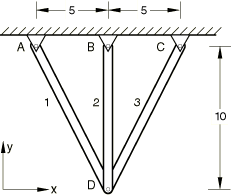
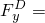
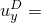

# 1.3.32 Three-bar truss

**Product: **Abaqus/Standard  

### Elements tested

T2D2    T2D2H    T2D3    T2D3H    T3D2    T3D2H    T3D3    T3D3H    

FRAME2D    FRAME3D    

### Problem description

**Material: **

Linear elastic, Young's modulus = 30.0  106.

**Boundary conditions: **

Nodes *A*, , and *C* are pinned.

**Loading: **

 10000.0.

### Reference solution

 1.3711  102,  32907 in elements 1 and 3,  41134 in element 2.

### Results and discussion

All elements yield exact solutions. Multi-point constraints are required to eliminate singularities in the three-node element tests using truss elements; e.g., T3D3.

The frame elements tested have rectangular cross-sections with the same cross-sectional area as the truss elements tested. In the cross-section for frame elements, pinned connections are specified for the ends of the frame elements by declaring the relevant parameter for the frame section. The joints are thus characterized by pinned connections. Since the frame elements are formulated in terms of section properties, stress output is not available; instead, the section forces are available. Stresses calculated from the axial force and the cross-sectional area match the stresses obtained from the truss element tests.

### Input files

[et22sfse.inp](../eif/et22sfse.inp)

T2D2 elements.

[et22shse.inp](../eif/et22shse.inp)

T2D2H elements.

[et23sfse.inp](../eif/et23sfse.inp)

T2D3 elements.

[et23shse.inp](../eif/et23shse.inp)

T2D3H elements.

[et32sfse.inp](../eif/et32sfse.inp)

T3D2 elements.

[et32shse.inp](../eif/et32shse.inp)

T3D2H elements.

[et33sfse.inp](../eif/et33sfse.inp)

T3D3 elements.

[et33shse.inp](../eif/et33shse.inp)

T3D3H elements.

[frame2d_3bar_pinned.inp](../eif/frame2d_3bar_pinned.inp)

FRAME2D elements.

[frame3d_3bar_pinned.inp](../eif/frame3d_3bar_pinned.inp)

FRAME3D elements.

