# 1.3.33 Pure bending of a cylinder: CAXA elements

**Product: **Abaqus/Standard  

### Elements tested

CAXA4*n*    CAXA4R*n*    CAXA8*n*    CAXA8R*n*    

(*n*=1, 2, 3, 4)

### Problem description

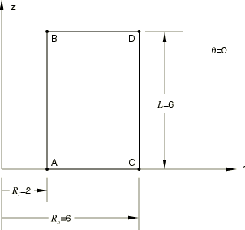

A hollow cylinder of circular cross-section, inner radius , outer radius 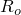, and length 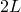 is subjected to a bending moment, *M*, applied to its end planes. For a linear elastic material with Young's modulus *E* and Poisson's ratio , the solutions for stress and displacement are as follows:

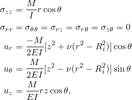

where 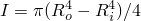 is the moment of inertia of the cylinder and *r*, , and *z* are the cylindrical coordinates.

Only one-half of the structure is considered, with a symmetry plane at  0. The form of the displacement solution, which is a quadratic function in both *r* and *z*, suggests that a single second-order element should model the structure accurately. The full- and reduced-integration second-order elements do use a single element mesh, but an 8  12 mesh is used for the fully integrated first-order elements and a 16  24 mesh is used for the reduced-integration first-order elements.

**Material: **

Linear elastic, Young's modulus = 30  106, Poisson's ratio = 0.33.

**Boundary conditions: **

 0 on the  0 plane; at 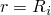 on the  0 plane,  at  0 is set equal to  at  180 with an equation constraint to remove the rigid body motion in the global *x*-direction.

**Loading: **

The bending load is simulated by applying a surface traction of the form 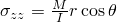 on the 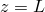 plane of the cylinder. This is done by applying the appropriate nonuniform pressure load with a distributed load and defining the variation of the pressure in both the *r*- and -directions with user subroutine [`DLOAD`](../sub/sub-link.md#sub-xsl-dload). In the user subroutine the  value at each integration point, which is stored in `COORDS(3)`, is expressed in degrees.

### Results and discussion

The analytical solution and the Abaqus results for the CAXA8*n*, CAXA8R*n*, CAXA4*n*, and CAXA4R*n* (*n*=1, 2, 3, or 4) elements are tabulated below for a structure with 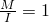 and dimensions 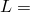 6, 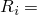 2, and 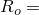 6. The output locations are at points 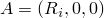, 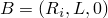, 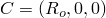, and  on the  0 plane, as shown in the figure on the previous page, and at points 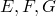, and *H*, which are at the corresponding locations on the  180 plane. The CAXA8*n* elements match the exact solution precisely.

| Variable | Exact | CAXA8*n* | CAXA8R*n* | CAXA4*n* | CAXA4R*n* |
| --- | --- | --- | --- | --- | --- |
| 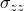 at A | 2 | 2 | 2.040 | 2.102 | 2.124 |
|  at A | 0 | 0 | 0 | 0 | 0 |
|  at A | 0 | 0 | 0 | 0 | 0 |
|  at B | 2 | 2 | 2 | 2.098 | 2.091 |
|  at B | 6 107 | 6 107 | 5.927 107 | 6.000 107 | 6.015 107 |
|  at B | 4 107 | 4 107 | 4.164 107 | 3.996 107 | 3.984 107 |
|  at C | 6 | 6 | 5.979 | 5.895 | 5.877 |
|  at C | 1.76 107 | 1.76 107 | 1.881 107 | 1.757 107 | 1.762 107 |
|  at C | 0 | 0 | 0 | 0 | 0 |
|  at D | 6 | 6 | 6 | 5.898 | 5.908 |
|  at D | 7.76 107 | 7.76 107 | 7.954 107 | 7.757 107 | 7.779 107 |
|  at D | 1.2 106 | 1.2 106 | 1.211 106 | 1.200 106 | 1.203 106 |
|  at E | 2 | 2 | 2.040 | 2.102 | 2.124 |
|  at E | 0 | 0 | 0 | 0 | 0 |
|  at E | 0 | 0 | 0 | 0 | 0 |
|  at F | 2 | 2 | 2 | 2.098 | 2.091 |
|  at F | 6 107 | 6 107 | 5.927 107 | 6.000 107 | 6.015 107 |
|  at F | 4 107 | 4 107 | 4.164 107 | 3.996 107 | 3.984 107 |
|  at G | 6 | 6 | 5.979 | 5.895 | 5.877 |
|  at G | 1.76 107 | 1.76 107 | 1.881 107 | 1.757 107 | 1.762 107 |
|  at G | 0 | 0 | 0 | 0 | 0 |
|  at H | 6 | 6 | 6 | 5.898 | 5.908 |
|  at H | 7.76 107 | 7.76 107 | 7.954 107 | 7.757 107 | 7.779 107 |
|  at H | 1.2 106 | 1.2 106 | 1.211 106 | 1.200 106 | 1.203 106 |

**Note:**The results are independent of *n*, the number of Fourier modes.

[Figure 1.3.33--1](ch01s03abv36.md#verpurecaxa-undefmesh) through [Figure 1.3.33--4](ch01s03abv36.md#verpurecaxa-contour-z) show plots of the undeformed mesh, the deformed mesh, the contours of , and the contours of , respectively, for the CAXA4R4 model.

### Input files

[ecnssfsk.inp](../eif/ecnssfsk.inp)

CAXA41 elements.

[ecnssfsk.f](../eif/ecnssfsk.f)

User subroutine [`DLOAD`](../sub/sub-link.md#sub-xsl-dload) used in ecnssfsk.inp.

[ecntsfsk.inp](../eif/ecntsfsk.inp)

CAXA42 elements.

[ecntsfsk.f](../eif/ecntsfsk.f)

User subroutine [`DLOAD`](../sub/sub-link.md#sub-xsl-dload) used in ecntsfsk.inp.

[ecnusfsk.inp](../eif/ecnusfsk.inp)

CAXA43 elements.

[ecnusfsk.f](../eif/ecnusfsk.f)

User subroutine [`DLOAD`](../sub/sub-link.md#sub-xsl-dload) used in ecnusfsk.inp.

[ecnvsfsk.inp](../eif/ecnvsfsk.inp)

CAXA44 elements.

[ecnvsfsk.f](../eif/ecnvsfsk.f)

User subroutine [`DLOAD`](../sub/sub-link.md#sub-xsl-dload) used in ecnvsfsk.inp.

[ecnssrsk.inp](../eif/ecnssrsk.inp)

CAXA4R1 elements.

[ecnssrsk.f](../eif/ecnssrsk.f)

User subroutine [`DLOAD`](../sub/sub-link.md#sub-xsl-dload) used in ecnssrsk.inp.

[ecntsrsk.inp](../eif/ecntsrsk.inp)

CAXA4R2 elements.

[ecntsrsk.f](../eif/ecntsrsk.f)

User subroutine [`DLOAD`](../sub/sub-link.md#sub-xsl-dload) used in ecntsrsk.inp.

[ecnusrsk.inp](../eif/ecnusrsk.inp)

CAXA4R3 elements.

[ecnusrsk.f](../eif/ecnusrsk.f)

User subroutine [`DLOAD`](../sub/sub-link.md#sub-xsl-dload) used in ecnusrsk.inp.

[ecnvsrsk.inp](../eif/ecnvsrsk.inp)

CAXA4R4 elements.

[ecnvsrsk.f](../eif/ecnvsrsk.f)

User subroutine [`DLOAD`](../sub/sub-link.md#sub-xsl-dload) used in ecnvsrsk.inp.

[ecnwsfsk.inp](../eif/ecnwsfsk.inp)

CAXA81 elements.

[ecnwsfsk.f](../eif/ecnwsfsk.f)

User subroutine [`DLOAD`](../sub/sub-link.md#sub-xsl-dload) used in ecnwsfsk.inp.

[ecnxsfsk.inp](../eif/ecnxsfsk.inp)

CAXA82 elements.

[ecnxsfsk.f](../eif/ecnxsfsk.f)

User subroutine [`DLOAD`](../sub/sub-link.md#sub-xsl-dload) used in ecnxsfsk.inp.

[ecnysfsk.inp](../eif/ecnysfsk.inp)

CAXA83 elements.

[ecnysfsk.f](../eif/ecnysfsk.f)

User subroutine [`DLOAD`](../sub/sub-link.md#sub-xsl-dload) used in ecnysfsk.inp.

[ecnzsfsk.inp](../eif/ecnzsfsk.inp)

CAXA84 elements.

[ecnzsfsk.f](../eif/ecnzsfsk.f)

User subroutine [`DLOAD`](../sub/sub-link.md#sub-xsl-dload) used in ecnzsfsk.inp.

[ecnwsrsk.inp](../eif/ecnwsrsk.inp)

CAXA8R1 elements.

[ecnwsrsk.f](../eif/ecnwsrsk.f)

User subroutine [`DLOAD`](../sub/sub-link.md#sub-xsl-dload) used in ecnwsrsk.inp.

[ecnxsrsk.inp](../eif/ecnxsrsk.inp)

CAXA8R2 elements.

[ecnxsrsk.f](../eif/ecnxsrsk.f)

User subroutine [`DLOAD`](../sub/sub-link.md#sub-xsl-dload) used in ecnxsrsk.inp.

[ecnysrsk.inp](../eif/ecnysrsk.inp)

CAXA8R3 elements.

[ecnysrsk.f](../eif/ecnysrsk.f)

User subroutine [`DLOAD`](../sub/sub-link.md#sub-xsl-dload) used in ecnysrsk.inp.

[ecnzsrsk.inp](../eif/ecnzsrsk.inp)

CAXA8R4 elements.

[ecnzsrsk.f](../eif/ecnzsrsk.f)

User subroutine [`DLOAD`](../sub/sub-link.md#sub-xsl-dload) used in ecnzsrsk.inp.

### Figures

**Figure 1.3.33–1** Undeformed mesh.

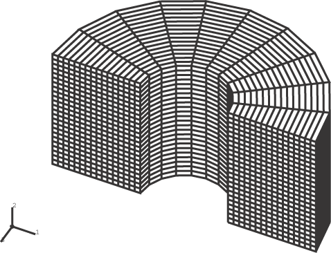

**Figure 1.3.33–2** Deformed mesh.

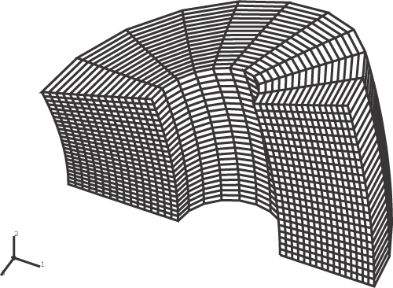

**Figure 1.3.33–3** Contours of *r*-displacement.

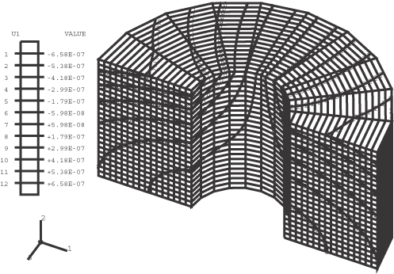

**Figure 1.3.33–4** Contours of *z*-displacement.

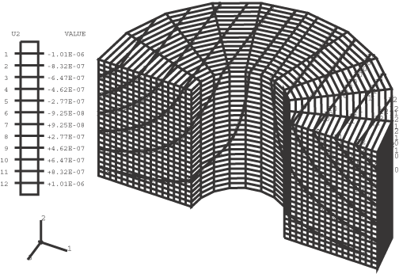

