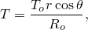
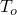
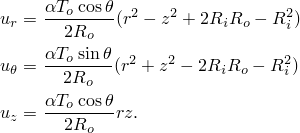
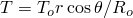
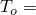
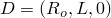
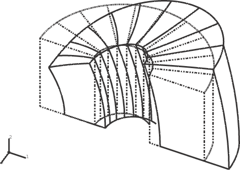
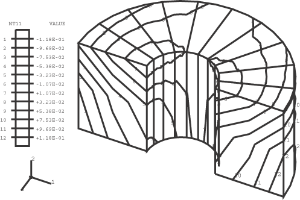
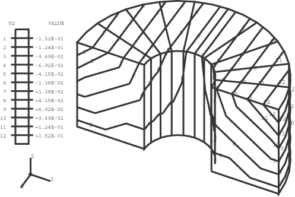

# 1.3.34 Cylinder subjected to an asymmetric temperature field: CAXA elements

**Product: **Abaqus/Standard  

### Elements tested

CAXA4*n*    CAXA4R*n*    CAXA8*n*    CAXA8R*n*    

(*n* = 1, 2, 3, 4)

### Problem description

A hollow cylinder of circular cross-section, inner radius , outer radius , and length , is subjected to an asymmetric temperature distribution that is a linear function of the spatial coordinates: 

where  is the constant temperature at the outside surface of the cylinder at  0 and *r*, , and *z* (see displacement solution, below) are the cylindrical coordinates. For a linear elastic material of Young's modulus *E*, Poisson's ratio , and thermal expansion coefficient , the solution for a structure subjected to such a temperature distribution is stress-free, with displacements as follows: 

Only one-half of the structure is considered, with a symmetry plane at  0. The form of the displacement solution, which is a quadratic function in both *r* and *z*, indicates that a single second-order element can model the structure adequately and yield accurate results. This problem is also solved with an 8  12 mesh of fully integrated first-order elements and a 16  24 mesh of reduced integration first-order elements.

**Material: **

Linear elastic, Young's modulus = 30  106, Poisson's ratio = 0.33, coefficient of thermal expansion = 1  104.

**Boundary conditions: **

 0 on the  0 plane;  0.06 is applied at  and  0 to eliminate the rigid body motion in the global *x*-direction. This value of  is obtained from the equation for  above.

**Loading: **

A temperature field of the form  is applied by calculating the temperature at each node and defining the temperature value.

### Results and discussion

The analytical solution and the Abaqus results for the CAXA8*n*, CAXA8R*n*, CAXA4*n*, and CAXA4R*n* (*n* = 1, 2, 3 or 4) elements are tabulated below for a structure with these parameters:  6,  2,  6, and  300. The output locations are at points , , , and  on the  0 plane, as shown in the figure on the previous page, and at points , and *H*, which are at the corresponding locations on the  180 plane. While both the CAXA8*n* and CAXA8R*n* elements match the exact solution precisely with a zero state of stress, the models using the CAXA4*n* and CAXA4R*n* elements fail to predict a stress-free state, even though the displacement solutions predicted are quite reasonable. However, the CAXA4R*n* models give much more accurate results than the CAXA4*n* models. This example demonstrates that the fully integrated first-order elements do not handle bending problems very well.

| Variable | Exact | CAXA8*n* | CAXA8R*n* | CAXA4*n* | CAXA4R*n* |
| --- | --- | --- | --- | --- | --- |
|  at A | 0 | 0 | 0 | 14071 | 0.0168 |
|  at A | 6 102 | 6 102 | 6 102 | 6 102 | 6 102 |
|  at A | 0 | 0 | 0 | 0 | 0 |
|  at B | 0 | 0 | 0 | 11664 | 3.2186 |
|  at B | 3 102 | 3 102 | 3 102 | 2.9644 102 | 2.9999 102 |
|  at B | 6 102 | 6 102 | 6 102 | 6.0312 102 | 6.0001 102 |
|  at C | 0 | 0 | 0 | 14076 | 0.0162 |
|  at C | 1.4 102 | 1.4 102 | 1.4 102 | 1.3993 102 | 1.4 102 |
|  at C | 0 | 0 | 0 | 0 | 0 |
|  at D | 0 | 0 | 0 | 11108 | 3.5190 |
|  at D | 5 102 | 5 102 | 5 102 | 5.0306 102 | 5.0001 102 |
|  at D | 18 102 | 18 102 | 18 102 | 17.95 102 | 18 102 |
|  at E | 0 | 0 | 0 | 14071 | 0.0168 |
|  at E | 6 102 | 6 102 | 6 102 | 6 102 | 6 102 |
|  at E | 0 | 0 | 0 | 0 | 0 |
|  at F | 0 | 0 | 0 | 11664 | 3.2186 |
|  at F | 3 102 | 3 102 | 3 102 | 2.9644 102 | 2.9999 102 |
|  at F | 6 102 | 6 102 | 6 102 | 6.0312 102 | 6.0001 102 |
|  at G | 0 | 0 | 0 | 14076 | 3.5100 |
|  at G | 1.4 102 | 1.4 102 | 1.4 102 | 1.3993 102 | 1.4 102 |
|  at G | 0 | 0 | 0 | 0 | 0 |
|  at H | 0 | 0 | 0 | 11108 | 3.5100 |
|  at H | 5 102 | 5 102 | 5 102 | 5.0306 102 | 5.0001 102 |
|  at H | 18 102 | 18 102 | 18 102 | 17.95 102 | 18 102 |

**Note:**The results are independent of *n*, the number of Fourier modes.

[Figure 1.3.34--1](ch01s03abv37.md#vertempcaxa-defmesh) through [Figure 1.3.34--4](ch01s03abv37.md#vertempcaxa-contour-z) show plots of the undeformed and deformed meshes, the applied asymmetric temperature field, the contours of , and the contours of , respectively, for the CAXA84 model.

### Input files

[ecnssfsl.inp](../eif/ecnssfsl.inp)

CAXA41 elements.

[ecntsfsl.inp](../eif/ecntsfsl.inp)

CAXA42 elements.

[ecnusfsl.inp](../eif/ecnusfsl.inp)

CAXA43 elements.

[ecnvsfsl.inp](../eif/ecnvsfsl.inp)

CAXA44 elements.

[ecnssrsl.inp](../eif/ecnssrsl.inp)

CAXA4R1 elements.

[ecntsrsl.inp](../eif/ecntsrsl.inp)

CAXA4R2 elements.

[ecnusrsl.inp](../eif/ecnusrsl.inp)

CAXA4R3 elements.

[ecnvsrsl.inp](../eif/ecnvsrsl.inp)

CAXA4R4 elements.

[ecnwsfsl.inp](../eif/ecnwsfsl.inp)

CAXA81 elements.

[ecnxsfsl.inp](../eif/ecnxsfsl.inp)

CAXA82 elements.

[ecnysfsl.inp](../eif/ecnysfsl.inp)

CAXA83 elements.

[ecnzsfsl.inp](../eif/ecnzsfsl.inp)

CAXA84 elements.

[ecnwsrsl.inp](../eif/ecnwsrsl.inp)

CAXA8R1 elements.

[ecnxsrsl.inp](../eif/ecnxsrsl.inp)

CAXA8R2 elements.

[ecnysrsl.inp](../eif/ecnysrsl.inp)

CAXA8R3 elements.

[ecnzsrsl.inp](../eif/ecnzsrsl.inp)

CAXA8R4 elements.

### Figures

**Figure 1.3.34–1** Deformed mesh.

**Figure 1.3.34–2** Applied temperature field.

**Figure 1.3.34–3** Contours of *r*-displacement.

**Figure 1.3.34–4** Contours of *z*-displacement.

