# 1.3.35 Cylinder subjected to asymmetric pressure loads: CAXA elements

**Product: **Abaqus/Standard  

### Elements tested

CAXA4*n*    CAXA4R*n*    CAXA8*n*    CAXA8R*n*    

(*n* = 1, 2, 3, 4)

### Problem description

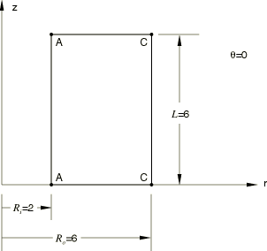

A hollow cylinder of circular cross-section, inner radius , outer radius , and length  is subjected to both internal and external pressure loads that are asymmetric. The pressure stresses take the following forms: 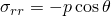 at 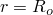 and 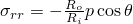 at , where *p* is a pressure value and *r* and  are the cylindrical coordinates. Assuming plane strain conditions and a linear elastic material with Young's modulus *E* and Poisson's ratio , the small-displacement solutions for stress and displacement are as follows: 

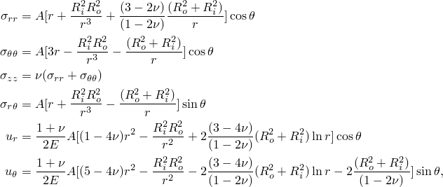

where 

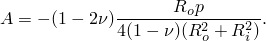

Only a slice of the cylinder is considered. Plane strain conditions are applied by setting  0 everywhere. In the *r*-direction 10 elements are used in the second-order element models. In models using the first-order elements, 20 and 40 elements are used in the full- and reduced-integration models, respectively.

**Material: **

Linear elastic, Young's modulus = 30  106, Poisson's ratio = 0.3.

**Boundary conditions: **

 0 everywhere; 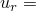 9.9854  104 at  and  0, as obtained from the equation for  above. These constraints eliminate the rigid body motions in the global *z*- and *x*-directions, respectively.

**Loading: **

The asymmetric pressure loads are prescribed by applying the appropriate nonuniform distributed load types on the inside and outside surfaces of the cylinder and defining the pressure stress equations for  in user subroutine [`DLOAD`](../sub/sub-link.md#sub-xsl-dload). In the user subroutine, the  value at each integration point, which is stored in `COORDS(3)`, is expressed in degrees.

### Results and discussion

The analytical solution and the Abaqus results for the CAXA8*n*, CAXA8R*n*, CAXA4*n*, and CAXA4R*n* (*n* = 1, 2, 3 or 4) elements are tabulated below for a cylinder with these parameters:  6,  2,  6, and  10  103. The output locations are at points 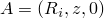 and 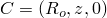 on the  0 plane, where *z* can be any value along lines  and  in the figure shown on the previous page since the solution is independent of *z*, and at points *E* and *G*, which are at the corresponding locations on the  180 plane. The solutions predicted by Abaqus agree well with the exact solution. Closer agreement is anticipated if a denser mesh is used. 

| Variable | Exact | CAXA8*n* | CAXA8R*n* | CAXA4*n* | CAXA4R*n* |
| --- | --- | --- | --- | --- | --- |
|  at A | 30000.0 | 29610.0 | 29760.0 | 28617.0 | 29132.0 |
|  at A | 7890.4 | 7702.7 | 7849.6 | 7885.1 | 7722.9 |
|  at A | 6089.6 | 6268.2 | 5973.4 | 6034.6 | 5729.2 |
| 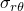 at A | 0.0 | 0.0 | 0.0 | 0.0 | 0.0 |
|  at A | 9.9854 104 | 9.9854 104 | 9.9854 104 | 9.9854 104 | 9.9854 104 |
|  at C | 10000.0 | 9988.9 | 9992.4 | 10101.0 | 10205.0 |
|  at C | 3969.9 | 3964.4 | 3967.9 | 3952.2 | 3978.2 |
|  at C | 2029.9 | 2024.3 | 2031.5 | 2013.4 | 1902.1 |
|  at C | 0.0 | 0.0 | 0.0 | 0.0 | 0.0 |
|  at C | 2.9222 103 | 2.9222 103 | 2.9222 103 | 2.9207 103 | 2.9221 103 |
|  at E | 30000.0 | 29610.0 | 29760.0 | 28617.0 | 29132.0 |
|  at E | 7890.4 | 7702.7 | 7849.6 | 7885.1 | 7722.9 |
|  at E | 6089.6 | 6268.2 | 5973.4 | 6034.6 | 5729.2 |
|  at E | 0.0 | 0.0 | 0.0 | 0.0 | 0.0 |
|  at E | 9.9854 104 | 9.9854 104 | 9.9854 104 | 9.9854 104 | 9.9854 104 |
|  at G | 10000.0 | 9988.9 | 9992.4 | 10101.0 | 10067.0 |
|  at G | 3969.9 | 3964.4 | 3967.9 | 3952.2 | 3978.2 |
|  at G | 2029.9 | 2024.3 | 2031.5 | 2013.4 | 1987.9 |
|  at G | 0.0 | 0.0 | 0.0 | 0.0 | 0.0 |
|  at G | 2.9222 103 | 2.9222 103 | 2.9222 103 | 2.9207 103 | 2.9221 103 |

**Note:**The results are independent of *n*, the number of Fourier modes. The 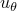 variable is not compared, since  is treated as an internal variable in these elements and is not available for output. The accuracy of  may be assumed to be comparable to the accuracy of .

[Figure 1.3.35--1](ch01s03abv38.md#verpresscaxa-undefmesh) through [Figure 1.3.35--4](ch01s03abv38.md#verpresscaxa-contour-r) show plots of the undeformed mesh, the deformed mesh, the contours of , and the contours of , respectively, for the CAXA8R3 model.

### Input files

[ecnssfsm.inp](../eif/ecnssfsm.inp)

CAXA41 elements.

[ecnssfsm.f](../eif/ecnssfsm.f)

User subroutine [`DLOAD`](../sub/sub-link.md#sub-xsl-dload) used in ecnssfsm.inp.

[ecntsfsm.inp](../eif/ecntsfsm.inp)

CAXA42 elements.

[ecntsfsm.f](../eif/ecntsfsm.f)

User subroutine [`DLOAD`](../sub/sub-link.md#sub-xsl-dload) used in ecntsfsm.inp.

[ecnusfsm.inp](../eif/ecnusfsm.inp)

CAXA43 elements.

[ecnusfsm.f](../eif/ecnusfsm.f)

User subroutine [`DLOAD`](../sub/sub-link.md#sub-xsl-dload) used in ecnusfsm.inp.

[ecnvsfsm.inp](../eif/ecnvsfsm.inp)

CAXA44 elements.

[ecnvsfsm.f](../eif/ecnvsfsm.f)

User subroutine [`DLOAD`](../sub/sub-link.md#sub-xsl-dload) used in ecnvsfsm.inp.

[ecnssrsm.inp](../eif/ecnssrsm.inp)

CAXA4R1 elements.

[ecnssrsm.f](../eif/ecnssrsm.f)

User subroutine [`DLOAD`](../sub/sub-link.md#sub-xsl-dload) used in ecnssrsm.inp.

[ecntsrsm.inp](../eif/ecntsrsm.inp)

CAXA4R2 elements.

[ecntsrsm.f](../eif/ecntsrsm.f)

User subroutine [`DLOAD`](../sub/sub-link.md#sub-xsl-dload) used in ecntsrsm.inp.

[ecnusrsm.inp](../eif/ecnusrsm.inp)

CAXA4R3 elements.

[ecnusrsm.f](../eif/ecnusrsm.f)

User subroutine [`DLOAD`](../sub/sub-link.md#sub-xsl-dload) used in ecnusrsm.inp.

[ecnvsrsm.inp](../eif/ecnvsrsm.inp)

CAXA4R4 elements.

[ecnvsrsm.f](../eif/ecnvsrsm.f)

User subroutine [`DLOAD`](../sub/sub-link.md#sub-xsl-dload) used in ecnvsrsm.inp.

[ecnwsfsm.inp](../eif/ecnwsfsm.inp)

CAXA81 elements.

[ecnwsfsm.f](../eif/ecnwsfsm.f)

User subroutine [`DLOAD`](../sub/sub-link.md#sub-xsl-dload) used in ecnwsfsm.inp.

[ecnxsfsm.inp](../eif/ecnxsfsm.inp)

CAXA82 elements.

[ecnxsfsm.f](../eif/ecnxsfsm.f)

User subroutine [`DLOAD`](../sub/sub-link.md#sub-xsl-dload) used in ecnxsfsm.inp.

[ecnysfsm.inp](../eif/ecnysfsm.inp)

CAXA83 elements.

[ecnysfsm.f](../eif/ecnysfsm.f)

User subroutine [`DLOAD`](../sub/sub-link.md#sub-xsl-dload) used in ecnysfsm.inp.

[ecnzsfsm.inp](../eif/ecnzsfsm.inp)

CAXA84 elements.

[ecnzsfsm.f](../eif/ecnzsfsm.f)

User subroutine [`DLOAD`](../sub/sub-link.md#sub-xsl-dload) used in ecnzsfsm.inp.

[ecnwsrsm.inp](../eif/ecnwsrsm.inp)

CAXA8R1 elements.

[ecnwsrsm.f](../eif/ecnwsrsm.f)

User subroutine [`DLOAD`](../sub/sub-link.md#sub-xsl-dload) used in ecnwsrsm.inp.

[ecnxsrsm.inp](../eif/ecnxsrsm.inp)

CAXA8R2 elements.

[ecnxsrsm.f](../eif/ecnxsrsm.f)

User subroutine [`DLOAD`](../sub/sub-link.md#sub-xsl-dload) used in ecnxsrsm.inp.

[ecnysrsm.inp](../eif/ecnysrsm.inp)

CAXA8R3 elements.

[ecnysrsm.f](../eif/ecnysrsm.f)

User subroutine [`DLOAD`](../sub/sub-link.md#sub-xsl-dload) used in ecnysrsm.inp.

[ecnzsrsm.inp](../eif/ecnzsrsm.inp)

CAXA8R4 elements.

[ecnzsrsm.f](../eif/ecnzsrsm.f)

User subroutine [`DLOAD`](../sub/sub-link.md#sub-xsl-dload) used in ecnzsrsm.inp.

### Figures

**Figure 1.3.35–1** Undeformed mesh.

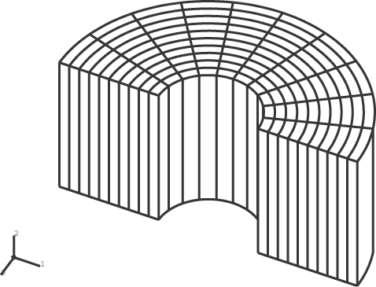

**Figure 1.3.35–2** Deformed mesh.

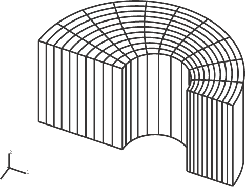

**Figure 1.3.35–3** Contours of radial stress.

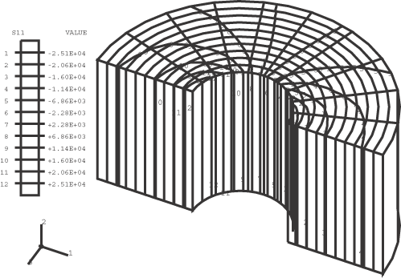

**Figure 1.3.35–4** Contours of *r*-displacement.

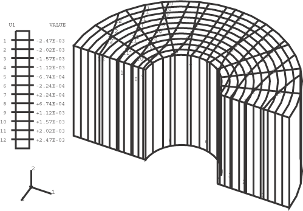

