# 1.3.36 Cylinder subjected to an asymmetric pore pressure field: CAXA elements

**Product: **Abaqus/Standard  

### Elements tested

CAXA8P*n*    CAXA8RP*n*    

(*n* = 1, 2, 3, 4)

### Problem description

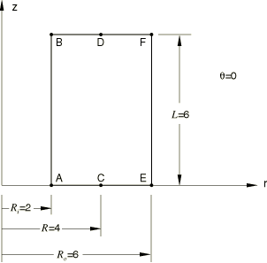

 A hollow cylindrical soil column of circular cross-section, inner radius , outer radius , and length  is subjected to an asymmetric pore pressure distribution of the form

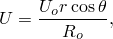

where 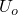 is the constant pore pressure at the outside surface of the cylinder at  0 and *r* and  are the cylindrical coordinates. The presence of pore pressure gradients in the radial and circumferential directions causes the pore fluid in the soil to flow in these directions, and bending of the cylinder results. This is a coupled problem in which the stress equilibrium and fluid continuity equations must be solved simultaneously with the pore pressure CAXA elements. For illustration purposes we consider only the steady-state coupled problem, and we assume that the material is linear with constant permeability and is made up of incompressible grains and fluid. The results predicted by the pore pressure CAXA models will be compared with those predicted by the corresponding three-dimensional model.

Only one-half of the structure is considered, with a symmetry plane at  0. A mesh convergence study indicates that a single second-order CAXA element can model the structure adequately and yield accurate results. However, two elements are used in the radial direction so that direct comparison of results obtained with the three-dimensional model can be made. In the three-dimensional model the C3D20P element is used in a finite element mesh with 2 elements in the radial direction, 1 in the axial direction, and 12 in the circumferential direction. To facilitate comparison of results with the CAXA models, all nodes in the three-dimensional model are transformed to a local cylindrical system, and a cylindrical orientation is applied to the material so that displacement, stress, and strain components are output in the same cylindrical system.

**Material: **

Linear elastic, Young's modulus = 1  108, Poisson's ratio = 0.3, permeability = 1  105, initial void ratio = 1.0 everywhere.

**Boundary conditions: **

 0 on the  0 plane;  0 is applied at  and  0 to eliminate the rigid body motion in the global *x*-direction.

**Loading: **

A pore pressure field of the form 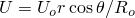 is applied. The pore pressure at each corner node on the inside and outside walls of the cylinder is calculated, and the pore pressure values are prescribed as boundary conditions via degree of freedom 8.

### Results and discussion

The results obtained with the CAXA8P*n* and CAXA8RP*n* (*n* = 1, 2, 3 or 4) elements and those obtained with the C3D20P elements are tabulated below for a structure with these parameters:  6,  2,  6, and 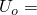 3  106. The output locations are at points , , 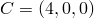, 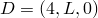, 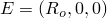, and 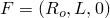 on the  0 plane, as shown in the figure on the previous page. Results that are exactly equal and opposite to those shown below are obtained at the same locations on the  180 plane. It is apparent that the results of the CAXA models match closely with the results of the three-dimensional model. The stress solution, which is shown in the table below, reveals that the effective stress components are identical to the pore pressure everywhere so that the total stress is zero everywhere in the cylinder. The results obtained from the CAXA models are independent of *n*, the number of Fourier modes, and appear to be more accurate than the three-dimensional model because the applied asymmetric pore pressure field can be prescribed precisely in the CAXA models. In the three-dimensional model more elements are needed in the -direction to get results with higher accuracy. Note the similarity between the solution to this problem and the asymmetric temperature analysis described in ["Cylinder subjected to an asymmetric temperature field: CAXA elements," Section 1.3.34](ch01s03abv37.md).

| Variable | C3D20P | CAXA8P*n* | CAXA8RP*n* |
| --- | --- | --- | --- |
|  at A | 0 | 0 | 0 |
|  at A | 0 | 0 | 0 |
| *U* at A | 1 106 | 1 106 | 1 106 |
|  at A | 9.9066 105 | 1 106 | 1 106 |
|  at A | 9.9397 105 | 1 106 | 1 106 |
|  at A | 9.9751 105 | 1 106 | 1 106 |
|  at B | 3.5791 102 | 3.6 102 | 3.6 102 |
|  at B | 2.3853 102 | 2.4 102 | 2.4 102 |
| *U* at B | 1 106 | 1 106 | 1 106 |
|  at B | 9.9066 105 | 1 106 | 1 106 |
|  at B | 9.9397 105 | 1 106 | 1 106 |
|  at B | 9.9751 105 | 1 106 | 1 106 |
|  at C | 1.1926 102 | 1.2 102 | 1.2 102 |
|  at C | 0 | 0 | 0 |
| *U* at C | 1.9987 106 | 2 106 | 2 106 |
|  at C | 1.9944 106 | 2 106 | 2 106 |
|  at C | 1.9947 106 | 2 106 | 2 106 |
|  at C | 2.0038 106 | 2 106 | 2 106 |
|  at D | 2.3864 102 | 2.4 102 | 2.4 102 |
|  at D | 4.7711 102 | 4.8 102 | 4.8 102 |
| *U* at D | 1.9987 106 | 2 106 | 2 106 |
|  at D | 1.9943 106 | 2 106 | 2 106 |
|  at D | 1.9945 106 | 2 106 | 2 106 |
|  at D | 2.0036 106 | 2 106 | 2 106 |
|  at E | 3.1819 102 | 3.2 102 | 3.2 102 |
|  at E | 0 | 0 | 0 |
| *U* at E | 3 106 | 3 106 | 3 106 |
|  at E | 3.004 106 | 3 106 | 3 106 |
|  at E | 2.9961 106 | 3 106 | 3 106 |
|  at E | 3.0105 106 | 3 106 | 3 106 |
|  at F | 3.9718 102 | 0.4 102 | 0.4 102 |
|  at F | 7.1581 102 | 7.2 102 | 7.2 102 |
| *U* at F | 3 106 | 3 106 | 3 106 |
|  at F | 3.004 106 | 3 106 | 3 106 |
|  at F | 2.9965 106 | 3 106 | 3 106 |
|  at F | 3.0105 106 | 3 106 | 3 106 |

[Figure 1.3.36--1](ch01s03abv39.md#verporecaxa-defmesh) through [Figure 1.3.36--4](ch01s03abv39.md#verporecaxa-contour-z) show plots of the undeformed and deformed meshes, the applied asymmetric pore pressure field, the contours of , and the contours of , respectively, in the CAXA8P4 model.

### Input files

[ecnwpfsn.inp](../eif/ecnwpfsn.inp)

CAXA8P1 elements.

[ecnxpfsn.inp](../eif/ecnxpfsn.inp)

CAXA8P2 elements.

[ecnypfsn.inp](../eif/ecnypfsn.inp)

CAXA8P3 elements.

[ecnzpfsn.inp](../eif/ecnzpfsn.inp)

CAXA8P4 elements.

[ecnwprsn.inp](../eif/ecnwprsn.inp)

CAXA8RP1 elements.

[ecnxprsn.inp](../eif/ecnxprsn.inp)

CAXA8RP2 elements.

[ecnyprsn.inp](../eif/ecnyprsn.inp)

CAXA8RP3 elements.

[ecnzprsn.inp](../eif/ecnzprsn.inp)

CAXA8RP4 elements.

[eref3ksn.inp](../eif/eref3ksn.inp)

C3D20P elements (reference solution).

### Figures

**Figure 1.3.36–1** Deformed mesh.

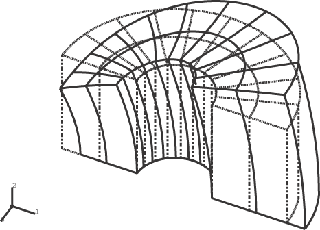

**Figure 1.3.36–2** Contours of pore pressure.

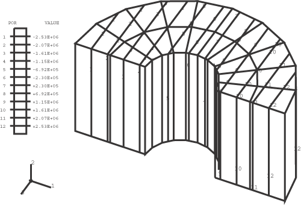

**Figure 1.3.36–3** Contours of *r*-displacement.

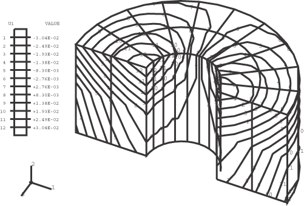

**Figure 1.3.36–4** Contours of *z*-displacement.

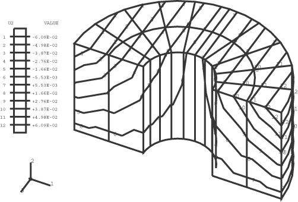

