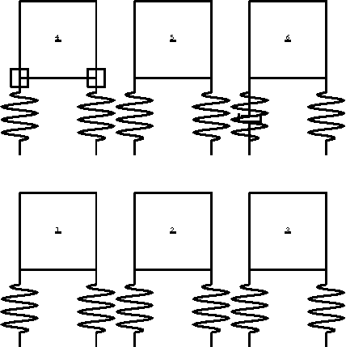
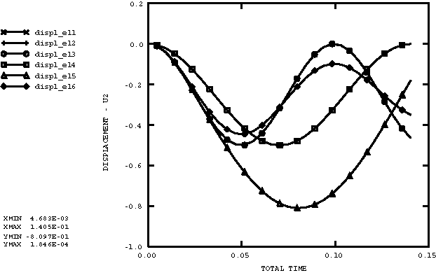

# 3.2.5 Single degree of freedom spring-mass systems

**Product: **Abaqus/Explicit  

### Elements tested

CPE4R    SPRINGA    MASS    DASHPOTA    

### Features tested

Time integration procedure, nonlinear springs and dashpot, distributed loads, point loads, gravity loading.

### Problem description

There are six individual single degree of freedom spring-mass systems defined in this problem. In each case two springs are attached to a single CPE4R element that is constrained to have only vertical motion. The meshes are shown in [Figure 3.2.5--1](ch03s02abv177.md#exxsprings-sdofsystems). The following cases are considered:

1. This single degree of freedom oscillator is loaded with a distributed load of 106 on the top of the element. The springs are linear, each with a stiffness of 2.0 106. The static displacement under this load is 0.25. The mass of the element is 1000. The analytical solution gives a period of 0.0993.
2. This single degree of freedom oscillator should be identical to Case 1. The springs are defined as nonlinear springs, but the tabular definition gives the same linear stiffness as the springs in Case 1. In this case the element is loaded with concentrated loads equal to the distributed load of Case 1.
3. The solution to this problem should be identical to that defined for Case 1. In this case the load is applied as a gravity load instead of as a distributed load. The springs are linear.
4. The definition of this problem is the same as that for Case 1 except that two point masses (mass of 500 each) are added to the problem. The addition of the point masses increases the period of this case to 0.1405.
5. In this single degree of freedom system the springs are nonlinear. Each spring has the same stiffness as the linear springs in Case 1 up to the static deflection of 0.5. Above a deflection of 0.5 the stiffness is 20 percent of the linear stiffness. The solution should be identical to Case 1 up to a displacement of 0.25. Because the nonlinear spring is not as stiff as the linear springs above a displacement of 0.25, the period of the oscillation in this case is greater than that of Case 1.
6. This single degree of freedom oscillator should be identical to Case 1 except for the added dashpot. The springs are defined as nonlinear springs, but the tabular definition gives the same linear stiffness as the springs in Case 1. In this case the element is loaded with concentrated loads equal to the distributed load of Case 1. A linear dashpot is attached parallel to the left spring.

### Results and discussion

[Figure 3.2.5--2](ch03s02abv177.md#exxsprings-displacements) shows the displacement of each single degree of freedom system as a function of time. Cases 1, 2, and 3 have identical solutions and match the analytical solution for the single degree of freedom system. Case 6 shows smaller amplitudes of oscillation due to the damping effect of the dashpot. Case 4 matches the analytical solution for the added mass. Case 5 has no analytical solution; however, the results are qualitatively correct.

### Input files

[springs.inp](../eif/springs.inp)

Input data used in this analysis.

[springstfv.inp](../eif/springstfv.inp)

A slightly modified version of input file springs.inp; this file includes temperature- and field-variable-dependent behavior for spring constants and dashpot coefficients.

Both input files are designed to provide identical results.

### Figures

**Figure 3.2.5–1** Single degree of freedom systems.

**Figure 3.2.5–2** Displacements of single degree of freedom systems.

