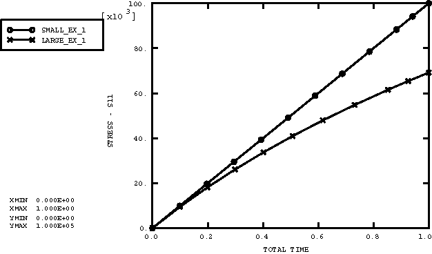
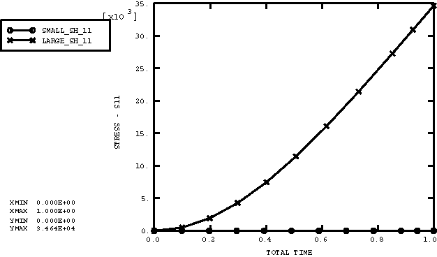

# 3.2.6 Linear kinematics element tests

**Product: **Abaqus/Explicit  

### Elements tested

B21    B22    B31    B32    C3D8    C3D8I    C3D8R    CPE4R    CPS4R    CAX4R    M3D4R    PIPE21    PIPE31    S4    S4R    S4RS    S4RSW    SAX1    T2D2    T3D2    

### Feature tested

The small-displacement deformation theory.

### Problem description

This verification test consists of a set of single-element models for each element type in analyses that use the small-displacement theory. All degrees of freedom are prescribed so that the results do not include any dynamic effects. Each element is subjected to all applicable fundamental modes of deformation. The total strains are large to show that the results are linear and remain unaffected by changes to the element's current configuration.

The material is linear elastic with a Young's modulus of 1.0  105, Poisson's ratio of .33, and density of 1000.

### Results and discussion

All element types tested yield the appropriate results for their applicable fundamental modes of deformation. Results for the two-dimensional truss element are illustrated here.

There are two global modes of deformation for a two-dimensional truss: longitudinal and lateral. The longitudinal mode is driven by fixing one end of the truss and prescribing a longitudinal displacement at the other. The axial stresses in the truss element as a result of longitudinal deformation for both small-displacement theory (geometric nonlinearities are neglected) and large-displacement theory (geometric nonlinearities are considered in the step) are shown in [Figure 3.2.6--1](ch03s02abv178.md#exxlineark-extension). As the strains become large, the results diverge because the large-displacement theory accounts for the thinning of the truss as it stretches. The global lateral mode is invoked by prescribing a lateral displacement at one end of the truss element while holding all other degrees of freedom fixed. Results for the lateral case are shown in [Figure 3.2.6--2](ch03s02abv178.md#exxlineark-shear). The nonlinear geometric effect is accounted for only in the large-displacement analysis. The small-displacement analysis ignores the extension of the truss due to its rotation and, therefore, sees no extensional strain due to the prescribed lateral displacements.

### Input files

[lk_b21.inp](../eif/lk_b21.inp)

B21 elements.

[lk_b22.inp](../eif/lk_b22.inp)

B22 elements.

[lk_b31.inp](../eif/lk_b31.inp)

B31 elements.

[lk_b32.inp](../eif/lk_b32.inp)

B32 elements.

[lk_p21.inp](../eif/lk_p21.inp)

PIPE21 elements.

[lk_p31.inp](../eif/lk_p31.inp)

PIPE31 elements.

[lk_c3d8.inp](../eif/lk_c3d8.inp)

C3D8 elements.

[lk_c3d8i.inp](../eif/lk_c3d8i.inp)

C3D8I elements.

[lk_c3d8_orient.inp](../eif/lk_c3d8_orient.inp)

C3D8 elements with [*ORIENTATION](../key/key-link.md#usb-kws-morientation).

[lk_c3d8i_orient.inp](../eif/lk_c3d8i_orient.inp)

C3D8I elements with [*ORIENTATION](../key/key-link.md#usb-kws-morientation).

[lk_c3d8r.inp](../eif/lk_c3d8r.inp)

C3D8R elements.

[lk_c3d8r_orient.inp](../eif/lk_c3d8r_orient.inp)

C3D8R elements with [*ORIENTATION](../key/key-link.md#usb-kws-morientation).

[lk_cax4r.inp](../eif/lk_cax4r.inp)

CAX4R elements.

[lk_cax4r_orient.inp](../eif/lk_cax4r_orient.inp)

CAX4R elements with [*ORIENTATION](../key/key-link.md#usb-kws-morientation).

[lk_cpe4r.inp](../eif/lk_cpe4r.inp)

CPE4R elements.

[lk_cpe4r_orient.inp](../eif/lk_cpe4r_orient.inp)

CPE4R elements with [*ORIENTATION](../key/key-link.md#usb-kws-morientation).

[lk_cps4r.inp](../eif/lk_cps4r.inp)

CPS4R elements.

[lk_cps4r_orient.inp](../eif/lk_cps4r_orient.inp)

CPS4R elements with [*ORIENTATION](../key/key-link.md#usb-kws-morientation).

[lk_dashpota.inp](../eif/lk_dashpota.inp)

Dashpot elements.

[lk_m3d4r.inp](../eif/lk_m3d4r.inp)

M3D4R elements.

[lk_m3d4r_orient.inp](../eif/lk_m3d4r_orient.inp)

M3D4R elements with [*ORIENTATION](../key/key-link.md#usb-kws-morientation).

[lk_s4.inp](../eif/lk_s4.inp)

S4 elements.

[lk_s4_orient.inp](../eif/lk_s4_orient.inp)

S4 elements with [*ORIENTATION](../key/key-link.md#usb-kws-morientation).

[lk_s4r.inp](../eif/lk_s4r.inp)

S4R elements.

[lk_s4r_orient.inp](../eif/lk_s4r_orient.inp)

S4R elements with [*ORIENTATION](../key/key-link.md#usb-kws-morientation).

[lk_s4r_gs.inp](../eif/lk_s4r_gs.inp)

S4R elements with [*SHELL GENERAL SECTION](../key/key-link.md#usb-kws-mshellgensect).

[lk_s4r_gs_orient.inp](../eif/lk_s4r_gs_orient.inp)

S4R elements with [*SHELL GENERAL SECTION](../key/key-link.md#usb-kws-mshellgensect) and [*ORIENTATION](../key/key-link.md#usb-kws-morientation).

[lk_s4rs.inp](../eif/lk_s4rs.inp)

S4RS elements.

[lk_s4rs_orient.inp](../eif/lk_s4rs_orient.inp)

S4RS elements with [*ORIENTATION](../key/key-link.md#usb-kws-morientation).

[lk_s4rs_gs.inp](../eif/lk_s4rs_gs.inp)

S4RS elements with [*SHELL GENERAL SECTION](../key/key-link.md#usb-kws-mshellgensect).

[lk_s4rs_gs_orient.inp](../eif/lk_s4rs_gs_orient.inp)

S4RS elements with [*SHELL GENERAL SECTION](../key/key-link.md#usb-kws-mshellgensect) and [*ORIENTATION](../key/key-link.md#usb-kws-morientation).

[lk_s4rsw.inp](../eif/lk_s4rsw.inp)

S4RSW elements.

[lk_s4rsw_orient.inp](../eif/lk_s4rsw_orient.inp)

S4RSW elements with [*ORIENTATION](../key/key-link.md#usb-kws-morientation).

[lk_s4rsw_gs.inp](../eif/lk_s4rsw_gs.inp)

S4RSW elements with [*SHELL GENERAL SECTION](../key/key-link.md#usb-kws-mshellgensect).

[lk_s4rsw_gs_orient.inp](../eif/lk_s4rsw_gs_orient.inp)

S4RSW elements with [*SHELL GENERAL SECTION](../key/key-link.md#usb-kws-mshellgensect) and [*ORIENTATION](../key/key-link.md#usb-kws-morientation).

[lk_sax1.inp](../eif/lk_sax1.inp)

SAX1 elements.

[lk_sax1_gs.inp](../eif/lk_sax1_gs.inp)

SAX1 elements with [*SHELL GENERAL SECTION](../key/key-link.md#usb-kws-mshellgensect).

[lk_springa.inp](../eif/lk_springa.inp)

Spring elements.

[lk_t2d2.inp](../eif/lk_t2d2.inp)

Two-dimensional truss elements.

[lk_t3d2.inp](../eif/lk_t3d2.inp)

Three-dimensional truss elements.

### Figures

**Figure 3.2.6–1** Axial stress comparison for the extensional mode.

**Figure 3.2.6–2** Axial stress comparison for the shear mode.

