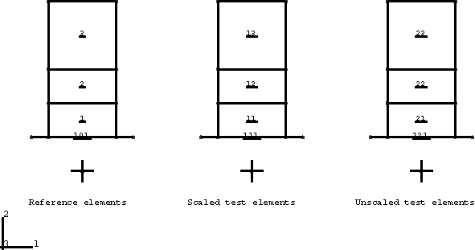
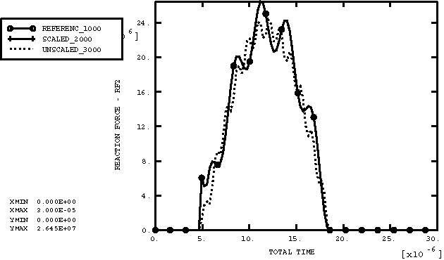

# 3.2.7 Mass scaling

**Product: **Abaqus/Explicit  

Various features of the fixed and variable mass scaling capabilities are tested. Most of the analyses consist of a set of reference elements that are unscaled and another set of test elements whose masses are scaled to equal those of the reference elements. The response of the test elements should be identical to that of the reference elements.

### I. Verification of scaled mass matrices

### Elements tested

B21    B22    B31    B32    

C3D4    C3D6    C3D8R    

CAX3    CAX4R    

CPE3    CPE4R    CPS3    CPS4R    

M3D3    M3D4R    MASS    

R2D2    R3D3    R3D4    RAX2    ROTARYI    

S3R    S4R    SAX1    

T2D2    T3D2    

### Problem description

These problems verify that the element mass matrices are generated properly for every element type that can be scaled. Several element types are tested in each input file. For each element type an element pair consisting of a reference element and test element with identical geometries is defined. The material properties of each element pair are identical with the exception of the densities. The densities of the test elements are scaled with the FACTOR parameter so that in the analysis their element mass matrices are identical to those of the reference elements. Each element pair is subject to equivalent displacements (and rotations in the case of beams and shells) such that their response is dynamic. Rebars are included for every element type that permits the inclusion of rebar. Tests of membranes and shells are performed with and without nodal values specified with nodal thickness. Reaction forces for constrained nodes of each pair of elements are output for comparison purposes.

### Results and discussion

Reaction force histories for nodes on each pair of test and reference elements are nearly identical. Slight differences exist because the bulk viscosity is based on the unscaled mass during the first increment. Every increment thereafter, the bulk viscosity is based on the scaled mass.

### Input files

[mscale_continuum.inp](../eif/mscale_continuum.inp)

Two-dimensional and three-dimensional continuum elements.

[mscale_beamshell.inp](../eif/mscale_beamshell.inp)

Two-dimensional and three-dimensional beams and shells.

[mscale_special.inp](../eif/mscale_special.inp)

Elements with mass but no stable time increment.

### II. Verification of mass scaling methods

### Elements tested

C3D4    CAX4R    CPE3    CPE4R    CPS3    CPS4R    

M3D3    M3D4R    S3R    S4R    SC6R    SC8R    SAX1    

### Problem description

The various techniques are tested for fixed and variable mass scaling. In addition, the use of multiple mass scaling definitions is also tested. These problems consist of a set of reference elements and a set of test elements with identical geometries. The material properties of each set of reference and test elements are identical with the exception of the densities. The densities of the reference elements are scalar multiples of those of the test elements. The element stable time increment is assigned a value so that the masses of the test elements are scaled to exactly equal those of the reference elements. Displacement boundary conditions are used to deform each pair of elements; however, the deformation is minimal, so the element stable time increments are not affected significantly.

### Results and discussion

Reaction force histories for nodes of each pair of the reference and test elements are nearly identical. Slight differences exist because the bulk viscosity is based on the unscaled mass during the first increment. Every increment thereafter, the bulk viscosity is based on the scaled mass. Furthermore, in cases in which variable mass scaling is specified, additional differences arise because of the continual scaling of the elements' masses throughout the step.

### Input files

[mscale_belowmin_fms.inp](../eif/mscale_belowmin_fms.inp)

[*FIXED MASS SCALING](../key/key-link.md#usb-kws-hfixedmassscaling), TYPE=BELOW MIN.

[mscale_belowmin_vms.inp](../eif/mscale_belowmin_vms.inp)

[*VARIABLE MASS SCALING](../key/key-link.md#usb-kws-hvariablemassscaling), TYPE=BELOW MIN.

[mscale_belowminfac.inp](../eif/mscale_belowminfac.inp)

[*FIXED MASS SCALING](../key/key-link.md#usb-kws-hfixedmassscaling), TYPE=BELOW MIN with a mass scaling factor.

[mscale_uniform_fms.inp](../eif/mscale_uniform_fms.inp)

[*FIXED MASS SCALING](../key/key-link.md#usb-kws-hfixedmassscaling), TYPE=UNIFORM.

[mscale_uniform_vms.inp](../eif/mscale_uniform_vms.inp)

[*VARIABLE MASS SCALING](../key/key-link.md#usb-kws-hvariablemassscaling), TYPE=UNIFORM.

[mscale_uniformfac.inp](../eif/mscale_uniformfac.inp)

[*FIXED MASS SCALING](../key/key-link.md#usb-kws-hfixedmassscaling), TYPE=UNIFORM with a mass scaling factor.

[mscale_setequaldt_fms.inp](../eif/mscale_setequaldt_fms.inp)

[*FIXED MASS SCALING](../key/key-link.md#usb-kws-hfixedmassscaling), TYPE=SET EQUAL DT.

[mscale_setequaldt_vms.inp](../eif/mscale_setequaldt_vms.inp)

[*VARIABLE MASS SCALING](../key/key-link.md#usb-kws-hvariablemassscaling), TYPE=SET EQUAL DT.

[mscale_setequaldtfac.inp](../eif/mscale_setequaldtfac.inp)

[*FIXED MASS SCALING](../key/key-link.md#usb-kws-hfixedmassscaling), TYPE=SET EQUAL DT with a mass scaling factor.

[mscale_multiuniform_fms.inp](../eif/mscale_multiuniform_fms.inp)

Multiple uniform mass scaling definitions with [*FIXED MASS SCALING](../key/key-link.md#usb-kws-hfixedmassscaling).

[mscale_multiuniform_vms.inp](../eif/mscale_multiuniform_vms.inp)

Multiple uniform mass scaling definitions with [*VARIABLE MASS SCALING](../key/key-link.md#usb-kws-hvariablemassscaling).

### III. Verification of FREQUENCY and NUMBER INTERVAL parameters

### Element tested

CPE4R

### Problem description

The variable mass scaling is used throughout a step. In this problem a group of elements is stretched such that they experience severe distortions. The variable mass scaling is used to prevent the stable time increment from decreasing below a specified value. Two tests are performed in which the mass scaling is performed at specified increments and at specified time intervals during the step. The stable time increment and percent change in total mass are output to monitor the mass scaling of the model.

### Results and discussion

Stable time increment histories show that they do not fall below the specified minimum. Time histories of the percent change in total mass show a continual increase, thereby verifying that mass is being scaled throughout the step.

### Input files

[mscale_frequency.inp](../eif/mscale_frequency.inp)

Scaling is performed at specified increments.

[mscale_interval.inp](../eif/mscale_interval.inp)

Scaling is performed at specified time intervals.

### IV. Mass scaling in a multiple step analysis

### Element tested

M3D4R

### Problem description

Mass scaling definitions can be removed or propagated from step to step. Furthermore, the mass matrix of an element that has been scaled in a previous step can be propagated to a subsequent step or reinitialized to its original state. In this problem a combination of fixed and variable mass scaling definitions are defined over several steps to verify these mass scaling features for a multistep analysis. Reaction forces and the percent change in total mass of the model are output.

### Results and discussion

Reaction force histories for nodes of the test and reference elements are identical. Examination of the reaction forces and the percent change in total mass of the model verifies that mass scaling definitions are propagated and removed correctly across steps. Mass matrices are also propagated and reinitialized correctly.

### Input file

[mscale_multistep.inp](../eif/mscale_multistep.inp)

Input data for this analysis.

### V. Global and local mass scaling

### Element tested

CPE4R

### Problem description

Mass scaling can be defined globally or locally on an element set basis. A local mass scaling definition will override a global mass scaling definition for an element, as verified in this problem.

### Results and discussion

Mass scaling factor and element stable time increment histories verify that global mass scaling definitions are overwritten by local definitions for specified elements.

### Input files

[mscale_locglobal_fms.inp](../eif/mscale_locglobal_fms.inp)

Local and global [*FIXED MASS SCALING](../key/key-link.md#usb-kws-hfixedmassscaling) definitions.

[mscale_locglobal_vms.inp](../eif/mscale_locglobal_vms.inp)

Local and global [*VARIABLE MASS SCALING](../key/key-link.md#usb-kws-hvariablemassscaling) definitions.

### VI. Mass scaling of rigid bodies

### Elements tested

CPE4R    C3D8R    R2D2    R3D4    ROTARYI    S4R    

### Problem description

Mass scaling of rigid elements or deformable elements defined as a rigid body can be performed. Techniques for scaling rigid bodies are limited because these elements do not have an associated stable time increment (["Mass scaling," Section 11.6.1 of the Abaqus Analysis User's Guide](../usb/usb-link.md#usb-anl-amassscaling)).

The following tests verify the use of the fixed and variable mass scaling with rigid bodies. These problems consist of a set of reference elements and two sets of test elements with identical geometries, as shown in [Figure 3.2.7--1](ch03s02abv179.md#exxmscale-rbodmodel). Each element set consists of two independent bodies that come into contact: a fixed rigid surface and a body consisting of a combination of rigid and deformable elements. The material properties of the reference and test elements are identical with the exception of the densities. The densities of both sets of test elements are identical, but they are scaled for one set to equal those of the reference elements.

Initial velocities are applied in the vertical direction so that impact with the fixed rigid surfaces (elements 101, 111, and 121) occurs. Reaction forces at the reference nodes of the fixed rigid surfaces are output for comparison purposes.

### Results and discussion

Vertical reaction force histories for the fixed rigid surfaces are nearly identical for the reference and scaled element sets, as shown in [Figure 3.2.7--2](ch03s02abv179.md#exxmscale-rbodforces). Very slight differences exist because the bulk viscosity is based on the unscaled mass during the first increment. Every increment thereafter, the bulk viscosity is based on the scaled mass.

### Input files

[mscale_rbod2d_fms1.inp](../eif/mscale_rbod2d_fms1.inp)

Two-dimensional continuum elements defined as a rigid body and attached to two-dimensional continuum elements with the [*FIXED MASS SCALING](../key/key-link.md#usb-kws-hfixedmassscaling) option applied only to the deformable elements.

[mscale_rbod2d_fms2.inp](../eif/mscale_rbod2d_fms2.inp)

Two-dimensional continuum elements defined as a rigid body and attached to two-dimensional continuum elements with the [*FIXED MASS SCALING](../key/key-link.md#usb-kws-hfixedmassscaling) option applied to both deformable and rigid portions of the mesh.

[mscale_rbod2d_fms3.inp](../eif/mscale_rbod2d_fms3.inp)

Two-dimensional continuum elements defined as a rigid body and attached to two-dimensional continuum elements with the [*FIXED MASS SCALING](../key/key-link.md#usb-kws-hfixedmassscaling), TYPE=UNIFORM option applied to both the deformable and rigid portions of the mesh.

[mscale_relem2d_fms1.inp](../eif/mscale_relem2d_fms1.inp)

Rgid elements attached to two-dimensional continuum elements with the [*FIXED MASS SCALING](../key/key-link.md#usb-kws-hfixedmassscaling) option applied only to the deformable elements.

[mscale_relem2d_fms2.inp](../eif/mscale_relem2d_fms2.inp)

Rigid elements attached to two-dimensional continuum elements with the [*FIXED MASS SCALING](../key/key-link.md#usb-kws-hfixedmassscaling) option applied to both the deformable and rigid portions of the mesh.

[mscale_relem2d_fms3.inp](../eif/mscale_relem2d_fms3.inp)

Rigid elements attached to two-dimensional continuum elements with the [*FIXED MASS SCALING](../key/key-link.md#usb-kws-hfixedmassscaling), TYPE=UNIFORM option applied to both the deformable and rigid portions of the mesh.

[mscale_rbod2d_vms3.inp](../eif/mscale_rbod2d_vms3.inp)

Two-dimensional continuum elements defined as a rigid body and attached to two-dimensional continuum elements with the [*VARIABLE MASS SCALING](../key/key-link.md#usb-kws-hvariablemassscaling), TYPE=UNIFORM option applied to both the deformable and rigid portions of the mesh.

[mscale_relem2d_vms3.inp](../eif/mscale_relem2d_vms3.inp)

Rigid elements attached to two-dimensional continuum elements with the [*VARIABLE MASS SCALING](../key/key-link.md#usb-kws-hvariablemassscaling), TYPE=UNIFORM option applied to both the deformable and rigid portions of the mesh.

[mscale_rbod3d_fms3.inp](../eif/mscale_rbod3d_fms3.inp)

[*FIXED MASS SCALING](../key/key-link.md#usb-kws-hfixedmassscaling), TYPE=UNIFORM option applied to both the deformable and rigid portions of the mesh.

[mscale_rbod3d_fms3_gcont.inp](../eif/mscale_rbod3d_fms3_gcont.inp)

[*FIXED MASS SCALING](../key/key-link.md#usb-kws-hfixedmassscaling), TYPE=UNIFORM option applied to both the deformable and rigid portions of the mesh. Analysis using the general contact capability.

[mscale_rbod3d_vms3.inp](../eif/mscale_rbod3d_vms3.inp)

[*VARIABLE MASS SCALING](../key/key-link.md#usb-kws-hvariablemassscaling), TYPE=UNIFORM option applied to both the deformable and rigid portions of the mesh.

[mscale_rbod3d_vms3_gcont.inp](../eif/mscale_rbod3d_vms3_gcont.inp)

[*VARIABLE MASS SCALING](../key/key-link.md#usb-kws-hvariablemassscaling), TYPE=UNIFORM option applied to both the deformable and rigid portions of the mesh. Analysis using the general contact capability.

[mscale_rbod3d_rotate.inp](../eif/mscale_rbod3d_rotate.inp)

Rotary inertia elements attached to a rigid surface.

### Figures

**Figure 3.2.7–1** Mass scaling with rigid bodies.

**Figure 3.2.7–2** Comparison of vertical reaction forces on rigid surfaces.

### VII. Verification of mass scaling with kinematic contact

### Elements tested

CPE4R    C3D8R    

### Problem description

The contact forces resulting between two deformable bodies with kinematically enforced contact are functions of the masses at the nodes in contact, the magnitude of the time increment, and the penetration in the predicted configuration. These problems verify that the kinematic contact forces are calculated correctly when the densities for the contacting elements are scaled. Each problem consists of a set of reference elements and a set of test elements with identical geometries. Each set in turn consists of two independent bodies that come into contact. The material properties of the reference and test elements are identical with the exception of the densities. The densities of the test elements are scaled to equal those of the reference elements. Reaction force histories for nodes on the contacting bodies that are constrained are output for comparison purposes.

### Results and discussion

Reaction force histories for nodes on each pair of test and reference elements are nearly identical. Slight differences exist because the bulk viscosity is based on the unscaled mass during the first increment. Every increment thereafter, the bulk viscosity is based on the scaled mass.

### Input files

[mscale_contact2d_fms.inp](../eif/mscale_contact2d_fms.inp)

CPE4R elements and [*FIXED MASS SCALING](../key/key-link.md#usb-kws-hfixedmassscaling).

[mscale_contact2d_vms.inp](../eif/mscale_contact2d_vms.inp)

CPE4R elements and [*VARIABLE MASS SCALING](../key/key-link.md#usb-kws-hvariablemassscaling).

[mscale_contact3d_fms.inp](../eif/mscale_contact3d_fms.inp)

C3D8R elements and [*FIXED MASS SCALING](../key/key-link.md#usb-kws-hfixedmassscaling).

[mscale_contact3d_vms.inp](../eif/mscale_contact3d_vms.inp)

C3D8R elements and [*VARIABLE MASS SCALING](../key/key-link.md#usb-kws-hvariablemassscaling).

### VIII. Verification of mass scaling with penalty contact

### Elements tested

CPE4R    C3D8R    

### Problem description

Nodal masses affect the penalty contact algorithm less directly than they affect the kinematic contact algorithm. Penalty contact forces depend on the penalty stiffness and the penetration in the current configuration. The penalty stiffnesses for contact between deformable surfaces are assigned automatically to a fraction of the elastic stiffness of the most compliant parent elements of the surfaces. Therefore, mass scaling does not influence the penalty contact forces between deformable surfaces for a given amount of penetration. However, nodal masses are factored into the effect of the penalty stiffness on the stable time increment. The problems from the previous subsection are repeated here with penalty enforcement of the contact constraints to verify that mass scaling is accounted for properly in the effect of the penalty stiffness on the stable time increment.

### Results and discussion

The time increment decreases by about 4% during increments in which penalty contact forces are being transmitted. Some contact penetration can be observed in these tests, which is characteristic of the penalty contact method.

### Input files

[mscale_contactpnlty2d_fms.inp](../eif/mscale_contactpnlty2d_fms.inp)

CPE4R elements and [*FIXED MASS SCALING](../key/key-link.md#usb-kws-hfixedmassscaling).

[mscale_contactpnlty2d_vms.inp](../eif/mscale_contactpnlty2d_vms.inp)

CPE4R elements and [*VARIABLE MASS SCALING](../key/key-link.md#usb-kws-hvariablemassscaling).

[mscale_contactpnlty3d_fms.inp](../eif/mscale_contactpnlty3d_fms.inp)

C3D8R elements and [*FIXED MASS SCALING](../key/key-link.md#usb-kws-hfixedmassscaling).

[mscale_contact3d_fms_gcont.inp](../eif/mscale_contact3d_fms_gcont.inp)

C3D8R elements and [*FIXED MASS SCALING](../key/key-link.md#usb-kws-hfixedmassscaling) using the general contact capability.

[mscale_contactpnlty3d_vms.inp](../eif/mscale_contactpnlty3d_vms.inp)

C3D8R elements and [*VARIABLE MASS SCALING](../key/key-link.md#usb-kws-hvariablemassscaling).

[mscale_contact3d_vms_gcont.inp](../eif/mscale_contact3d_vms_gcont.inp)

C3D8R elements and [*VARIABLE MASS SCALING](../key/key-link.md#usb-kws-hvariablemassscaling) using the general contact capability.

