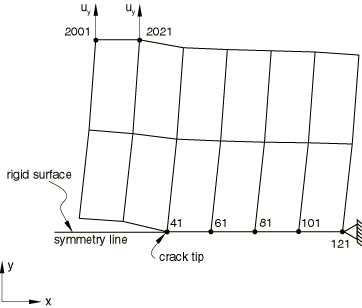
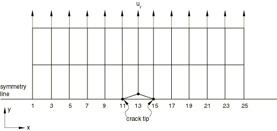
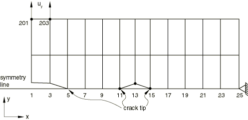
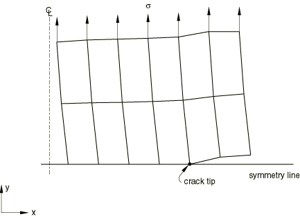

# 3.4.1 Crack propagation analysis

**Product: **Abaqus/Standard  

The tests in this section verify crack propagation between two surfaces that are initially partially bonded. They test the crack propagation capability from a single crack tip as well as multiple crack tips. All three fracture criteria (the critical stress criterion, the crack length versus time criterion, and the COD criterion) are verified.

### I. Crack propagation from a single crack tip -- edge notch plate

### Elements tested

CPE4    CPE8    

### Problem description

In the symmetry model the top half of a single-edge notch plate is modeled with a mesh of 2  6 CPE4 elements. The lower surface of the bottom row of elements defines the slave surface of the partially bonded contact pair, and the master surface is defined by an analytical rigid surface. The master surface also lies along the symmetry plane. Nonzero displacement boundary conditions are applied at two nodes remote from the symmetry plane. The time for bond failure and the position of the node at which the bond failure occurs (obtained from [pdebnods.inp](../eif/pdebnods.inp)) are used to give the crack length versus time data in [pdebcrgr.inp](../eif/pdebcrgr.inp). The crack opening displacement at a distance behind the crack tip (obtained from [pdebnods.inp](../eif/pdebnods.inp)) is used to specify the data for the COD criterion in [pdebcods.inp](../eif/pdebcods.inp). The stresses at a distance ahead of the crack tip (obtained from [pdebnods.inp](../eif/pdebnods.inp)) are used to specify the data in [pdebnodsd.inp](../eif/pdebnodsd.inp). The time from [pdebnods.inp](../eif/pdebnods.inp) is also used to set the time period for each step in [pdebchck.inp](../eif/pdebchck.inp).

The complete mesh is analyzed in [pdebnods2.inp](../eif/pdebnods2.inp), [pdebcrgr2.inp](../eif/pdebcrgr2.inp), and [pdebcods2.inp](../eif/pdebcods2.inp).

Input files [pdebnodnlg.inp](../eif/pdebnodnlg.inp), [pdebcrgnlg.inp](../eif/pdebcrgnlg.inp), and [pdebcodnlg.inp](../eif/pdebcodnlg.inp) consider finite deformation and finite sliding. The crack length versus time data for [pdebcrgnlg.inp](../eif/pdebcrgnlg.inp) and the COD data for [pdebcodnlg.inp](../eif/pdebcodnlg.inp) are obtained from [pdebnodnlg.inp](../eif/pdebnodnlg.inp).

### Results and discussion

The time at bond failure, the remaining fraction of the stress at debonding, the remaining debond stress, and all element stresses and strains must be the same for corresponding increments of tests [pdebnods.inp](../eif/pdebnods.inp), [pdebcrgr.inp](../eif/pdebcrgr.inp), and [pdebcods.inp](../eif/pdebcods.inp). At the total time corresponding to the end of each step in [pdebchck.inp](../eif/pdebchck.inp), the stresses and strains in the continuum elements are the same for all three tests. The same results are obtained for the models analyzed in [pdebnods2.inp](../eif/pdebnods2.inp), [pdebcrgr2.inp](../eif/pdebcrgr2.inp), and [pdebcods2.inp](../eif/pdebcods2.inp).

The results obtained from [pdebnodnlg.inp](../eif/pdebnodnlg.inp) are compared with that of [pdebcodnlg.inp](../eif/pdebcodnlg.inp) and [pdebcrgnlg.inp](../eif/pdebcrgnlg.inp). The time at bond failure, the debond stress at failure, and the element stresses and strains are the same at the corresponding times.

### Input files

The following problems test the crack propagation capability for an edge crack notch plate with symmetry conditions taken into account:

[pdebnods.inp](../eif/pdebnods.inp)

Tests crack propagation using a critical stress criterion. The distance ahead of the crack tip at which the critical stress is evaluated is set to zero.

[pdebcrgr.inp](../eif/pdebcrgr.inp)

Tests crack propagation capability by using the crack length versus time criterion.

[pdebcods.inp](../eif/pdebcods.inp)

Tests crack propagation capability by using the COD criterion.

[pdebchck.inp](../eif/pdebchck.inp)

Checks this procedure without using any contact surface definitions by simulating the debonding by [*BOUNDARY](../key/key-link.md#usb-kws-hboundary), OP=NEW with multiple steps.

[pdebnodsd.inp](../eif/pdebnodsd.inp)

Tests crack propagation capability by considering the critical stress at a distance ahead of the crack tip. The distance ahead of the crack tip at which the critical stress is evaluated is varied from step to step.

The following problems simulate the complete model:

[pdebnods2.inp](../eif/pdebnods2.inp)

Tests crack propagation capability by using a critical stress criterion. The distance ahead of the crack tip at which the critical stress is evaluated is set to zero.

[pdebcrgr2.inp](../eif/pdebcrgr2.inp)

Tests crack propagation capability by using the crack length versus time criterion.

[pdebcods2.inp](../eif/pdebcods2.inp)

Tests crack propagation capability by using the COD criterion.

The following verification tests involve finite deformation and finite sliding:

[pdebnodnlg.inp](../eif/pdebnodnlg.inp)

Tests crack propagation capability by using a critical stress criterion. The distance ahead of the crack tip at which the critical stress is evaluated is set to zero.

[pdebcrgnlg.inp](../eif/pdebcrgnlg.inp)

Tests crack propagation capability by using the crack length versus time criterion.

[pdebcodnlg.inp](../eif/pdebcodnlg.inp)

Tests crack propagation capability by using the COD criterion.

The following files simulate crack propagation in the symmetry model using 8-node elements:

[pdebnods8.inp](../eif/pdebnods8.inp)

Tests crack propagation capability by using a critical stress criterion. The distance ahead of the crack tip at which the critical stress is evaluated is set to zero.

[pdebcrgr8.inp](../eif/pdebcrgr8.inp)

Tests crack propagation capability by using the crack length versus time criterion.

[pdebcods8.inp](../eif/pdebcods8.inp)

Tests crack propagation capability by using the COD criterion.

### II. Crack propagation from multiple crack tips -- center crack plate

### Element tested

CPE4

### Problem description

The top half of a center cracked plate is modeled with a mesh of 2  12 CPE4 elements. The lower surface of the bottom row of elements is used to define the slave surface of the partially bonded contact pair, and the master surface is defined by an analytical rigid surface. The master surface also lies on the symmetry plane. Nonzero displacement boundary conditions are applied on the top row of nodes.

The time for bond failure and the position of the node at which the bond failure occurs (obtained from [pdebnodcc1.inp](../eif/pdebnodcc1.inp)) are used to give the crack length versus time data in [pdebcrgcc1.inp](../eif/pdebcrgcc1.inp). The reference point for the crack length versus time criterion is defined such that the crack propagation occurs simultaneously from both the crack tips.

The crack opening displacement at a distance behind the crack tip (obtained from [pdebcodcc1.inp](../eif/pdebcodcc1.inp)) is used to specify the data for the COD criterion in [pdebcodcc1.inp](../eif/pdebcodcc1.inp).

The complete mesh is analyzed in [pdebnodcc2.inp](../eif/pdebnodcc2.inp), [pdebcodcc2.inp](../eif/pdebcodcc2.inp), and [pdebcrgcc2.inp](../eif/pdebcrgcc2.inp).

### Results and discussion

The time to bond failure and the debond stress at the time of bond failure are the same in all the tests. The stresses and strains in the elements are the same at a given time in all the tests.

### Input files

[pdebnodcc1.inp](../eif/pdebnodcc1.inp)

Tests crack propagation using a critical stress criterion. The distance ahead of the crack tip at which the critical stress is evaluated is set to zero.

[pdebcrgcc1.inp](../eif/pdebcrgcc1.inp)

Tests crack propagation capability by using the crack length versus time criterion.

[pdebcodcc1.inp](../eif/pdebcodcc1.inp)

Tests crack propagation capability by using the COD criterion.

The following input files simulate the complete model:

[pdebnodcc2.inp](../eif/pdebnodcc2.inp)

Tests crack propagation using a critical stress criterion. The distance ahead of the crack tip at which the critical stress is evaluated is set to zero.

[pdebcrgcc2.inp](../eif/pdebcrgcc2.inp)

Tests crack propagation capability by using the crack length versus time criterion. 

[pdebcodcc2.inp](../eif/pdebcodcc2.inp)

Tests crack propagation capability by using the COD criterion.

### III. Crack coalescence

### Element tested

CPE4

### Problem description

The top half of a plate that consists of an edge crack and a center crack is modeled with a mesh consisting of 2  12 CPE4 elements. The bottom surface of the lower row of elements is used to define the slave surface of the initially partially bonded contact pair. The master surface of the contact pair is defined by an analytical rigid surface and also lies along the symmetry plane. Nonzero displacement boundary conditions are applied at two nodes remote from the bonded plane, as shown in the figure.

The complete mesh is analyzed in [pdebcrgco2.inp](../eif/pdebcrgco2.inp) and [pdebcodco2.inp](../eif/pdebcodco2.inp).

### Results and discussion

The time to bond failure and the debond stress at the time of bond failure are the same in all the tests. The stresses and strains in the elements are the same at a given time in all the tests.

### Input files

The following series of tests is used to demonstrate crack propagation and coalescence of two cracks:

[pdebcrgco1.inp](../eif/pdebcrgco1.inp)

Tests crack coalescence by using the crack length versus time criterion.

[pdebcodco1.inp](../eif/pdebcodco1.inp)

Tests crack coalescence by using the COD criterion.

The following input files simulate the complete model:

[pdebcrgco2.inp](../eif/pdebcrgco2.inp)

Tests crack coalescence by using the crack length versus time criterion.

[pdebcodco2.inp](../eif/pdebcodco2.inp)

Tests crack coalescence by using the COD criterion. 

### IV. Crack propagation analysis with axisymmetric elements

### Element tested

CAX4

### Problem description

The problem of a round bar with an external notch (crack) subjected to tensile loading is analyzed as an axisymmetric case. Only the top half is modeled in [pdebnodax1.inp](../eif/pdebnodax1.inp), [pdebcrgax1.inp](../eif/pdebcrgax1.inp), and [pdebcodax1.inp](../eif/pdebcodax1.inp). The mesh consists of 2  6 CAX4 elements. The lower surface of the bottom row of elements is used to define the slave surface, while the master surface is defined by an analytical rigid surface. A far-field load  is applied.

Input file [pdebnodax1.inp](../eif/pdebnodax1.inp) uses the critical stress criterion for crack propagation analysis. The crack length versus time data for [pdebcrgax1.inp](../eif/pdebcrgax1.inp) and the crack opening displacement versus cumulative incremental crack length for [pdebcodax1.inp](../eif/pdebcodax1.inp) are obtained from [pdebnodax1.inp](../eif/pdebnodax1.inp).

The complete mesh is analyzed in [pdebnodax2.inp](../eif/pdebnodax2.inp), [pdebcrgax2.inp](../eif/pdebcrgax2.inp), and [pdebcodax2.inp](../eif/pdebcodax2.inp).

### Results and discussion

The time to bond failure and the debond stress at the time of bond failure are the same in all the tests. The stresses and strains in the elements are the same at a given time in all the tests.

### Input files

The following tests are used to verify the crack propagation capability for axisymmetric elements:

[pdebnodax1.inp](../eif/pdebnodax1.inp)

Tests crack propagation using a critical stress criterion. The distance ahead of the crack tip at which the critical stress is evaluated is set to zero.

[pdebcrgax1.inp](../eif/pdebcrgax1.inp)

Tests crack propagation by using the crack length versus time criterion.

[pdebcodax1.inp](../eif/pdebcodax1.inp)

Tests crack propagation by using the COD criterion.

The following input files simulate the complete model:

[pdebnodax2.inp](../eif/pdebnodax2.inp)

Tests crack propagation using a critical stress criterion. The distance ahead of the crack tip at which the critical stress is evaluated is set to zero.

[pdebcrgax2.inp](../eif/pdebcrgax2.inp)

Tests crack propagation by using the crack length versus time criterion.

[pdebcodax2.inp](../eif/pdebcodax2.inp)

Tests crack propagation by using the COD criterion.

### V. Miscellaneous test

### Element tested

CPE4

### Problem description

This input file tests for the output of the debond variables.

### Results and discussion

The debond variables are identical to those obtained in the original analysis.

### Input file

[pdebnodsps.inp](../eif/pdebnodsps.inp)

Tests the [*POST OUTPUT](../key/key-link.md#usb-kws-hpostoutput) option. The restart file from pdebnods.inp is needed to run this input file.

