# 4.1.1 DFLUX

### 4.1.1 [`DFLUX`](../sub/sub-link.md#sub-xsl-dflux)

**Product: **Abaqus/Standard  

### Feature tested

User subroutine to define nonuniform distributed flux in heat transfer and mass diffusion analyses.

### I. Heat transfer analysis

### Element tested

DC2D8

### Problem description

A steady-state heat transfer analysis of a unit block is performed. The block is composed of six DC2D8 elements. Side *A* of the block (nodes 1–7) has its temperature, , ramped up linearly over the course of a step. The opposite side of the block, side *B* (nodes 201–207), has a nonuniform distributed flux, 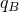, applied to it via user subroutine [`DFLUX`](../sub/sub-link.md#sub-xsl-dflux). The value of the distributed flux varies as a function of the current temperature of this side, . This variation of applied flux is chosen to be 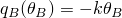, where *k* is the conductivity of the block material. A thermal energy balance,

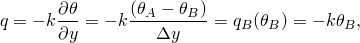

gives us a solution for  such that 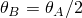.

The inclusion of 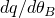 in user subroutine [`DFLUX`](../sub/sub-link.md#sub-xsl-dflux) is essential for good convergence of the solution.

### Results and discussion

The results match the exact solution.

### Input files

[udfluxxx.inp](../eif/udfluxxx.inp)

Test of [`DFLUX`](../sub/sub-link.md#sub-xsl-dflux) in a heat transfer analysis.

[udfluxxx.f](../eif/udfluxxx.f)

User subroutine [`DFLUX`](../sub/sub-link.md#sub-xsl-dflux) used in udfluxxx.inp.

### II. Mass diffusion analysis

### Element tested

DC2D8

### Problem description

A steady-state mass diffusion analysis of a unit block is performed. The block is composed of six DC2D8 elements. Side *A* of the block (nodes 1–7) has its normalized concentration, 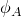, ramped up linearly over the course of a step. The opposite side of the block, side *B* (nodes 201–207), has a nonuniform distributed flux, , applied to it via user subroutine [`DFLUX`](../sub/sub-link.md#sub-xsl-dflux). The value of the distributed flux varies as a function of the current normalized concentration, 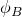; temperature, ; and equivalent pressure stress, 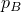, of this side. This variation of applied flux is chosen to be 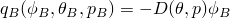, where 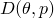 is the diffusivity of the block material. The diffusivity is defined as

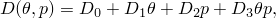

and diffusion is otherwise considered to be independent of temperature and equivalent pressure stress (i.e., 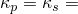 0). The temperature and pressure stress fields are specified at all nodes and are ramped up linearly over the course of the step. The mass balance,

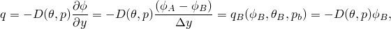

gives a solution for  such that 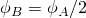.

The inclusion of 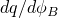 in user subroutine [`DFLUX`](../sub/sub-link.md#sub-xsl-dflux) is essential for good convergence of the solution.

### Results and discussion

The results match the exact solution.

### Input files

[udfluxmd.inp](../eif/udfluxmd.inp)

Test of [`DFLUX`](../sub/sub-link.md#sub-xsl-dflux) in a mass diffusion analysis.

[udfluxmd.f](../eif/udfluxmd.f)

User subroutine [`DFLUX`](../sub/sub-link.md#sub-xsl-dflux) used in udfluxmd.inp.

