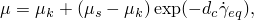
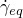
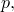
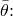
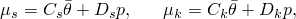
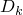

# 4.1.5 FRIC_COEF

### 4.1.5 [`FRIC_COEF`](../sub/sub-link.md#sub-xsl-fric_coef)

**Product: **Abaqus/Standard  

### I. User subroutine tested in a stress/displacement analysis

### Element tested

B21

### Feature tested

User subroutine to define the friction coefficient between contact surfaces in a stress/displacement analysis.

### Problem description

Abaqus provides user subroutine [`FRIC_COEF`](../sub/sub-link.md#sub-xsl-fric_coef), in which complex dependencies of a friction coefficient can be defined on slip rate, pressure, temperature, and field variables. This example verifies the capability by considering the contact response for a Coulomb friction law in which the friction coefficient is of the form

where  is the slip rate,  is the decay coefficient, and  and  are the static and dynamic coefficients of friction, respectively. Both the static and dynamic coefficients are functions of contact pressure,  and the average temperature between the two contacting surfaces,  

 where , , , and  are constants.

The verification test consists of a rod perpendicular to a fixed rigid surface forced into contact with the rigid surface by a concentrated load applied in the axial direction at the top of the rod. Subsequently, prescribed temperatures and displacements are applied to the rod, forcing the rod to slide along the surface. The contact between the bottom end of the rod and the rigid surface is modeled by specifying a master-slave contact pair. A node-based slave surface is defined on the bottom end of the rod. This slave surface has a contact area of unity; hence, the normal force applied on the rod is equal to the contact pressure. 

A second identical rod, subjected to the same loading sequence, serves as the reference solution. The friction behavior for this reference model is entered as tabulated data.

### Results and discussion

The user subroutine results closely match the reference solution. The small differences between the solutions are the result of the user subroutine describing the friction coefficient as a continuous exponential function of the slip rate, while the reference solution uses discrete data points with linear interpolation between points.

### Input files

[ufriccoefd.inp](../eif/ufriccoefd.inp)

 Analysis with default parameters on the [*FRICTION](../key/key-link.md#usb-kws-hfriction) option.

[ufriccoefl.inp](../eif/ufriccoefl.inp)

 Analysis with the LAGRANGE parameter defined on the [*FRICTION](../key/key-link.md#usb-kws-hfriction) option.

[ufriccoefs.inp](../eif/ufriccoefs.inp)

Analysis with the SLIP TOLERANCE parameter defined on the [*FRICTION](../key/key-link.md#usb-kws-hfriction) option.

[ufriccoefe.inp](../eif/ufriccoefe.inp)

Analysis with the ELASTIC SLIP parameter defined on the [*FRICTION](../key/key-link.md#usb-kws-hfriction) option.

[ufriccoef.f](../eif/ufriccoef.f)

User subroutine [`FRIC_COEF`](../sub/sub-link.md#sub-xsl-fric_coef).

