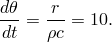

# 4.1.9 HETVAL

### 4.1.9 [`HETVAL`](../sub/sub-link.md#sub-xsl-hetval)

**Product: **Abaqus/Standard  

### Element tested

DC2D4

### Feature tested

User subroutine to provide internal heat generation in heat transfer analyses.

### Problem description

A two-dimensional rectangular block of material, 10  2, has heat generated within its volume by user subroutine [`HETVAL`](../sub/sub-link.md#sub-xsl-hetval). The value of the generated heat flux is *r* = 0.40483. The material has specific heat, *c* = 0.1431, and density,  = 0.2829. A transient thermal analysis with all edges of the volume insulated should give a temperature rate of 

### Results and discussion

Time is incremented by 5 units in each increment of the analysis. From the equation above, therefore, nodal temperatures should increment by 50 units during each increment. 

| Increment | Time | Temperature |
| --- | --- | --- |
| 1 | 5 | 50 |
| 2 | 10 | 100 |
| 3 | 15 | 150 |
| 4 | 20 | 200 |
| 5 | 25 | 250 |
| 6 | 30 | 300 |
| 7 | 35 | 350 |
| 8 | 40 | 400 |
| 9 | 45 | 450 |
| 10 | 50 | 500 |

### Input files

[uhetvalx.inp](../eif/uhetvalx.inp)

Input file for this analysis.

[uhetvalx.f](../eif/uhetvalx.f)

User subroutine [`HETVAL`](../sub/sub-link.md#sub-xsl-hetval) used in uhetvalx.inp.

