# 4.1.13 UANISOHYPER_INV and VUANISOHYPER_INV

### 4.1.13 [`UANISOHYPER_INV`](../sub/sub-link.md#sub-xsl-uanisohyper_inv) and [`VUANISOHYPER_INV`](../sub/sub-link.md#sub-xsl-vuanisohyper_inv)

**Products: **Abaqus/Standard  Abaqus/Explicit  

### Features tested

Family of user subroutines to define anisotropic hyperelastic material behavior.

### Elements tested

C3D8    C3D8H    C3D8R    CPEG4    CPE4H    CPE4R    CPE8R    

### Problem description

This set of verification problems is primarily intended to test the variables that are passed into [`UANISOHYPER_INV`](../sub/sub-link.md#sub-xsl-uanisohyper_inv) in Abaqus/Standard or [`VUANISOHYPER_INV`](../sub/sub-link.md#sub-xsl-vuanisohyper_inv) in Abaqus/Explicit.  These tests also verify that the derivatives of the strain energy function defined by the user are transferred properly to the solution process. In each test the material properties are specified using the user strain energy potential for the testing elements, for which the strain energy function and the associated derivatives are defined in user subroutines [`UANISOHYPER_INV`](../sub/sub-link.md#sub-xsl-uanisohyper_inv) and [`VUANISOHYPER_INV`](../sub/sub-link.md#sub-xsl-vuanisohyper_inv). Each test contains one reference element with material properties specified with anisotropic hyperelasticity, which provides the reference solution. Three different sets of material data are used, as described below.

**Material 1: **

Holzapfel-Gasser-Ogden material with two families of fibers:

| Holzapfel-Gasser-Ogden coefficients: |
| --- |
|  = 7.64.,  = 996.6,  = 524.6,  = 0.226. |
| Fiber directions (N=2): |
|  |  |
|  |  |
| with 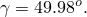 |
| Compressible case: 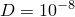 |

**Material 2: **

Polynomial (N=2) isotropic hyperelastic behavior

| Polynomial coefficients (N=2): |
| --- |
|  |  = 100.0 |
|  |  = 50.0 |
|  | 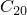 = 10.0 |
|  |  = 20.0 |
|  | 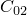 = 30.0 |
| Compressible case:  = 0.01, =0.0 |

**Material 3: **

Generalized Fung energy function implemented in terms of pseudo invariants. Two implementations are considered: one with the components of the modified Green strain expressed in terms of 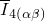 type invariants, and the other in terms of  and 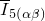 type invariants.

| Fung coefficients: |
| --- |
|  | 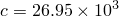 |
|  | 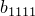 = 0.9925 |
|  | 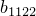 = 0.0749 |
|  | 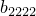 = 0.4180 |
|  |  = 0.0295 |
|  | 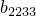 = 0.0193 |
|  | 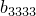 = 0.0089 |
|  |  = 5.0 |
|  | 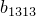 = 5.0 |
|  | 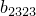 = 5.0 |
| Compressible case:  = 0.1 |

### Results and discussion

The tests in this section are set up as cases of homogeneous deformation of a single element of unit dimensions. Consequently, the results are identical for all integration points within the element. In each case the results in the testing elements match the solution in the reference element.

### Input files

##### **Abaqus/Standard input files**

[uaniso_inv_hgople.inp](../eif/uaniso_inv_hgople.inp)

Holzapfel-Gasser-Ogden anisotropic hyperelasticity, compressible, uniaxial plane strain tension.

[uaniso_inv_isople.inp](../eif/uaniso_inv_isople.inp)

Polynomial hyperelasticity, incompressible, uniaxial plane strain tension, hybrid elements.

[uaniso_inv_fung.inp](../eif/uaniso_inv_fung.inp)

Fung anisotropic hyperelasticity, compressible, uniaxial plane strain tension.

[uanisohyper_inv.f](../eif/uanisohyper_inv.f)

User subroutine [`UANISOHYPER_INV`](../sub/sub-link.md#sub-xsl-uanisohyper_inv) used in the above tests.

##### **Abaqus/Explicit input files**

[vuaniso_inv_hgople.inp](../eif/vuaniso_inv_hgople.inp)

Holzapfel-Gasser-Ogden anisotropic hyperelasticity, compressible, uniaxial plane strain tension.

[vuaniso_inv_isople.inp](../eif/vuaniso_inv_isople.inp)

Polynomial hyperelasticity, compressible, uniaxial plane strain tension, hybrid elements.

[vuaniso_inv_fung.inp](../eif/vuaniso_inv_fung.inp)

Fung anisotropic hyperelasticity, compressible, uniaxial plane strain tension.

[vuanisohyper_inv.f](../eif/vuanisohyper_inv.f)

User subroutine [`VUANISOHYPER_INV`](../sub/sub-link.md#sub-xsl-vuanisohyper_inv) used in the above tests.

