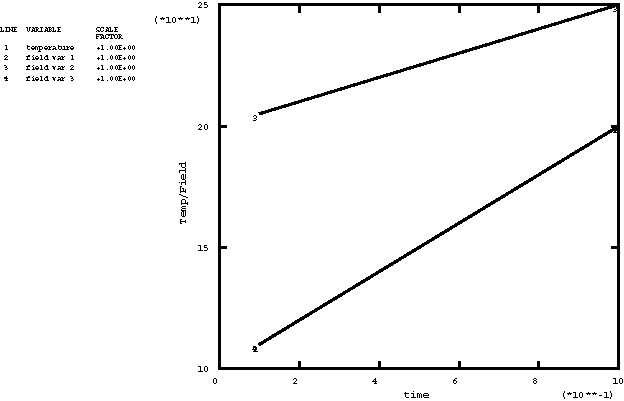
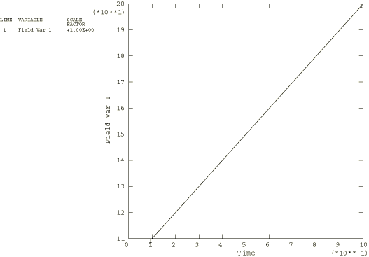
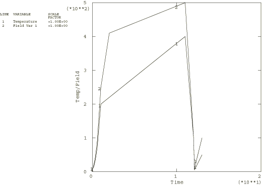

# 4.1.25 UTEMP, UFIELD, UMASFL, and UPRESS

### 4.1.25 [`UTEMP`](../sub/sub-link.md#sub-xsl-utemp), [`UFIELD`](../sub/sub-link.md#sub-xsl-ufield), [`UMASFL`](../sub/sub-link.md#sub-xsl-umasfl), and [`UPRESS`](../sub/sub-link.md#sub-xsl-upress)

**Product: **Abaqus/Standard  

### Features tested

User subroutines to define temperatures, field variables, mass flow rates, and equivalent pressure stresses.

### I. Setting temperature and field data using user subroutines

### Element tested

T3D2

### Problem description

This set of tests verifies that temperature and field variable values are properly transferred to a structure when the values are set using user subroutines. These tests are modifications of the tests described in ["Defining temperature, field variable, and pressure stress values," Section 5.1.26](ch05s01abv342.md). For the most part, wherever results files were used in those tests, they have been replaced here with user subroutines. The structure being analyzed is a cantilevered truss made up of 10 T3D2 elements.

The tests are as follows:

**utmpfvs1.inp**

This file tests setting temperature and more than one field variable using user subroutines. The variation of temperature and all three field variables are linear with time as follows:

|  | Initial value | Final value |
| --- | --- | --- |
| Temperature | 100 | 200 |
| Field variable 1 | 100 | 200 |
| Field variable 2 | 200 | 250 |
| Field variable 3 | 100 | 200 |

**utmpfvs2.inp**

This file tests setting a field variable from a user subroutine without temperature being present in the problem. This is an important test because of the way that temperatures and field variables are stored internally. The field variable varies linearly with time, as follows:

|  | Initial value | Final value |
| --- | --- | --- |
| Field variable | 100 | 200 |

(The problem that is analogous to test [xtfvtrs3.inp](../eif/xtfvtrs3.inp) in ["Defining temperature, field variable, and pressure stress values," Section 5.1.26](ch05s01abv342.md), is omitted, since this analysis would not test any features that were not already covered by the other tests in this section.)

**utmpfvs4.inp**

This is a three-step problem involving temperature and one field variable. In the first step an amplitude curve is used to set temperature to 200 and the field variable to 250. In the second step temperature and the field variable are set twice: first, values are read from results files, and then the user subroutines multiply all values by two. This results in ramping the temperature to 400 and the field variable to 500 over the step. The results files used are as follows:

xtfvtrt1.fil  Temperature

xtfvtrt2.fil  Field variable 1

(These two heat transfer problems are described further in ["Defining temperature, field variable, and pressure stress values," Section 5.1.26](ch05s01abv342.md).) In the third step both the temperature and the field variable are reset to their initial conditions.

The following must be confirmed by this test:
- The user subroutine must mesh smoothly with other methods of setting temperature and field variables used in other steps.
- The user subroutine must have access to values set from a results file and must be able to modify those values.
- If temperature or a field variable is set by data line input and then modified by a user subroutine within the same step, the values given on the data lines must be ignored.
- The variable `KSTEP` must be available for use in both user subroutines.

**utmpfvsr.inp**

This analysis restarts [utmpfvs4.inp](../eif/utmpfvs4.inp) from the third step. Temperature and the field variable are both set using user subroutines as follows:

|  | Initial value | Final value |
| --- | --- | --- |
| Temperature | 0 | 100 |
| Field variable | 0 | 50 |

**utmpfvsn.inp**

This file tests setting all of the field variables simultaneously in user subroutine [`UFIELD`](../sub/sub-link.md#sub-xsl-ufield). The final results are the same as those obtained in [utmpfvs1.inp](../eif/utmpfvs1.inp).

### Results and discussion

The only quantities of interest are the temperatures and field variables in the structure. Expected solutions are shown in [Figure 4.1.25--1](ch04s01abv300.md#verutemp-fvs1) through [Figure 4.1.25--3](ch04s01abv300.md#verutemp-fvs4sr).

### Input files

[utmpfvs1.inp](../eif/utmpfvs1.inp)

Stress analysis, first run.

[utmpfvs1.f](../eif/utmpfvs1.f)

User subroutines [`UTEMP`](../sub/sub-link.md#sub-xsl-utemp) and [`UFIELD`](../sub/sub-link.md#sub-xsl-ufield) used in utmpfvs1.inp.

[utmpfvs2.inp](../eif/utmpfvs2.inp)

Stress analysis, second run.

[utmpfvs2.f](../eif/utmpfvs2.f)

User subroutine [`UFIELD`](../sub/sub-link.md#sub-xsl-ufield) used in utmpfvs2.inp.

[utmpfvs4.inp](../eif/utmpfvs4.inp)

Stress analysis, analogous to xtfvtrs4.inp.

[utmpfvs4.f](../eif/utmpfvs4.f)

User subroutines [`UTEMP`](../sub/sub-link.md#sub-xsl-utemp) and [`UFIELD`](../sub/sub-link.md#sub-xsl-ufield) used in utmpfvs4.inp.

[utmpfvsr.inp](../eif/utmpfvsr.inp)

Stress analysis, restart of utmpfvs4.inp.

[utmpfvsr.f](../eif/utmpfvsr.f)

User subroutines [`UTEMP`](../sub/sub-link.md#sub-xsl-utemp) and [`UFIELD`](../sub/sub-link.md#sub-xsl-ufield) used in utmpfvsr.inp.

[utmpfvsn.inp](../eif/utmpfvsn.inp)

Stress analysis, NUMBER.

[utmpfvsn.f](../eif/utmpfvsn.f)

User subroutines [`UTEMP`](../sub/sub-link.md#sub-xsl-utemp) and [`UFIELD`](../sub/sub-link.md#sub-xsl-ufield) used in utmpfvsn.inp.

### Figures

**Figure 4.1.25–1** Temperature and field variables for [utmpfvs1.inp](../eif/utmpfvs1.inp).

**Figure 4.1.25–2** Field variable for [utmpfvs2.inp](../eif/utmpfvs2.inp).

**Figure 4.1.25–3** Temperatures and field variable for [utmpfvs4.inp](../eif/utmpfvs4.inp) and [utmpfvsr.inp](../eif/utmpfvsr.inp).

### II. Composite shell temperature loads from user subroutines

### Elements tested

S4R5    S8R5    

### Problem description

This set of tests verifies the use of user subroutines [`UTEMP`](../sub/sub-link.md#sub-xsl-utemp) and [`UFIELD`](../sub/sub-link.md#sub-xsl-ufield) in conjunction with composite structural shells. These tests are modifications of the tests described in ["Defining temperature, field variable, and pressure stress values," Section 5.1.26](ch05s01abv342.md). Values that were obtained from results files in those problems are set here with user subroutines. A three-layered composite shell with a prescribed temperature or field variable profile through the cross-section is analyzed. Three temperature points and five section integration points are used for each layer. The temperature and field variables are assigned to these five points through a linear interpolation of the three values available per layer from the user subroutine. The results of these analyses verify that this interpolation is correct.

The user subroutines are tested for 4-node shells and 8-node shells.

### Results and discussion

The temperature and field variable profiles were chosen to be identical to those obtained in heat transfer problems [xtmpcst4.inp](../eif/xtmpcst4.inp) and [xtmpcst8.inp](../eif/xtmpcst8.inp), so that the results of the stress analyses could be directly compared with results from [xtmpcss4.inp](../eif/xtmpcss4.inp), [xtmpcss8.inp](../eif/xtmpcss8.inp), [xfvcss4x.inp](../eif/xfvcss4x.inp), and [xfvcss8x.inp](../eif/xfvcss8x.inp). (For a description of the heat transfer problem, see ["Defining temperature, field variable, and pressure stress values," Section 5.1.26](ch05s01abv342.md).) The temperature/field variable profile is as follows:
- The temperature/field variable at the bottom of layer 1 is 425.0.
- The temperature/field variable at the top of layer 1 and the bottom of layer 2 is 373.2.
- The temperature/field variable at the top of layer 2 and the bottom of layer 3 is 336.8.
- The temperature/field variable at the top of layer 3 is 287.5.

There is a linear variation between the top and bottom of each layer.

It can be seen that the temperature and field variable values are properly transferred to the structural composite shell.

### Input files

[utempc4x.inp](../eif/utempc4x.inp)

[`UTEMP`](../sub/sub-link.md#sub-xsl-utemp), S4R5 elements.

[utempc4x.f](../eif/utempc4x.f)

User subroutine [`UTEMP`](../sub/sub-link.md#sub-xsl-utemp) used in utempc4x.inp.

[ufieldc4.inp](../eif/ufieldc4.inp)

[`UFIELD`](../sub/sub-link.md#sub-xsl-ufield), S4R5 elements.

[ufieldc4.f](../eif/ufieldc4.f)

User subroutine [`UFIELD`](../sub/sub-link.md#sub-xsl-ufield) used in ufieldc4.inp.

[utempc8x.inp](../eif/utempc8x.inp)

[`UTEMP`](../sub/sub-link.md#sub-xsl-utemp), S8R5 elements.

[utempc8x.inp](../eif/utempc8x.inp)

User subroutine [`UTEMP`](../sub/sub-link.md#sub-xsl-utemp) used in utempc8x.inp.

[ufieldc8.inp](../eif/ufieldc8.inp)

[`UFIELD`](../sub/sub-link.md#sub-xsl-ufield), S8R5 elements.

[ufieldc8.f](../eif/ufieldc8.f)

User subroutine [`UFIELD`](../sub/sub-link.md#sub-xsl-ufield) used in ufieldc8.inp.

### III. Gap conductance problems with field variables and mass flow rates set using user subroutines [`UFIELD`](../sub/sub-link.md#sub-xsl-ufield) and [`UMASFL`](../sub/sub-link.md#sub-xsl-umasfl)

### Elements tested

C3D8T    DC3D8    DCC3D8    DINTER4    INTER4T    

### Problem description

These tests verify that field variables and mass flow rates are properly transferred to a structure during heat transfer and coupled temperature-displacement analyses. These tests are modifications of the tests described in ["Thermal properties," Section 2.3.1](ch02s03abv172.md), and ["`GAPCON`," Section 4.1.6](ch04s01abv281.md). The tests are cases of uniform one-dimensional heat flux using three-dimensional elements. Consequently, the temperature results are identical for all nodes located at a particular plane along the direction of heat flow. In all cases a steady-state heat transfer analysis is performed in several increments. Values of predefined field variables or mass flow rates vary during the solution, which in turn influences the conductivity across the interface and, thus, the solution.

### Results and discussion

The results match the exact solutions.

### Input files

[ufieldghs.inp](../eif/ufieldghs.inp)

Field-variable-dependent gap conductivity, heat transfer analysis, DC3D8 and DINTER4 elements.

[ufieldghs.f](../eif/ufieldghs.f)

User subroutine [`UFIELD`](../sub/sub-link.md#sub-xsl-ufield) used in ufieldghs.inp.

[umasflghs.inp](../eif/umasflghs.inp)

Mass-flow-rate-dependent gap conductivity, heat transfer analysis, DCC3D8 and DINTER4 elements.

[umasflghs.f](../eif/umasflghs.f)

User subroutine [`UMASFL`](../sub/sub-link.md#sub-xsl-umasfl) used in umasflghs.inp.

[ufieldgcs.inp](../eif/ufieldgcs.inp)

Field-variable-dependent gap conductivity, coupled temperature-displacement analysis, C3D8T and INTER4T elements.

[ufieldgcs.f](../eif/ufieldgcs.f)

User subroutine [`UFIELD`](../sub/sub-link.md#sub-xsl-ufield) used in ufieldgcs.inp.

### IV. Mass diffusion problems with pressure stresses set using user subroutine [`UPRESS`](../sub/sub-link.md#sub-xsl-upress)

### Elements tested

DC3D8    DC3D20    

### Problem description

These tests verify that equivalent pressure stresses are transferred properly to a structure during a mass diffusion analysis. The tests are cases of uniform one-dimensional mass diffusion using three-dimensional elements. Consequently, the concentration results are identical for all nodes located at a particular plane along the diffusion direction.

### Results and discussion

The results match the exact solutions.

### Input files

[upress38.inp](../eif/upress38.inp)

DC3D8 elements.

[upress38.f](../eif/upress38.f)

User subroutine [`UPRESS`](../sub/sub-link.md#sub-xsl-upress) used in upress38.inp.

[upress20.inp](../eif/upress20.inp)

DC3D20 elements.

[upress20.f](../eif/upress20.f)

User subroutine [`UPRESS`](../sub/sub-link.md#sub-xsl-upress) used in upress20.inp.

