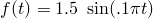
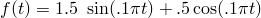

# 4.1.28 VDISP

### 4.1.28 [`VDISP`](../sub/sub-link.md#sub-xsl-vdisp)

**Product: **Abaqus/Explicit  

### Element tested

T3D2

### Feature tested

User subroutine to provide prescribed nodal behavior (displacements, velocities, and accelerations).

### Problem description

A straight section built with one-dimensional truss elements is used in a dynamic analysis. The model has a displacement boundary condition prescribed at node 2, a velocity boundary condition prescribed at node 3, and an acceleration boundary condition prescribed at node 4 using user subroutine [`VDISP`](../sub/sub-link.md#sub-xsl-vdisp). For comparison purposes a displacement variation is specified at node 5, a velocity variation is specified at node 6, and an acceleration variation is specified at node 7 using amplitude functions. The variation prescribed is 

 for displacement and 

 for velocity and acceleration. The cosine contribution is excluded in selecting the displacement amplitude function to avoid an initial jump in the displacement. For the variations specified using [`VDISP`](../sub/sub-link.md#sub-xsl-vdisp), the appropriate functions have to be incorporated into the subroutine. Identical variations are specified in both methods such that the results should be identical.

### Results and discussion

The responses of the nodal degrees of freedom can be plotted to show that user subroutine [`VDISP`](../sub/sub-link.md#sub-xsl-vdisp) is providing the same history as the amplitude function.

### Input files

[vdisp_uva.inp](../eif/vdisp_uva.inp)

Input file for this analysis.

[vdisp_uva.f](../eif/vdisp_uva.f)

User subroutine [`VDISP`](../sub/sub-link.md#sub-xsl-vdisp) used in vdisp_uva.inp.

