# 5.1.7 Coupling constraints

**Products: **Abaqus/Standard  Abaqus/Explicit  

### Features tested

This section provides basic verification tests for coupling, kinematic, and distributing constraints.

### I. Kinematic coupling constraints

### Features tested

Various types of kinematic coupling connections are tested.

### Problem description

Problems [xcouplingk_std_beam.inp](../eif/xcouplingk_std_beam.inp), [xcouplingk_xpl_beam2d.inp](../eif/xcouplingk_xpl_beam2d.inp), [xcouplingk_std_bem3.inp](../eif/xcouplingk_std_bem3.inp), and [xcouplingk_xpl_beam3d.inp](../eif/xcouplingk_xpl_beam3d.inp) impose rigid beam constraints using coupling constraints. 

Problems [xcouplingk_std_revolute.inp](../eif/xcouplingk_std_revolute.inp) and [xcouplingk_xpl_revolute.inp](../eif/xcouplingk_xpl_revolute.inp) test the finite rotation revolute behavior of the kinematic coupling constraint when only two rotational degrees of freedom are constrained. 

Problems [xcouplingk_std_universal.inp](../eif/xcouplingk_std_universal.inp) and [xcouplingk_xpl_universal.inp](../eif/xcouplingk_xpl_universal.inp) test the finite rotation universal behavior of the kinematic coupling constraint when only one rotational degree of freedom is constrained.

### Results and discussion

Comparisons with equivalent beam MPC and equivalent revolute and universal MPC problems show that using coupling constraints yields identical behavior.

### Input files

##### **Abaqus/Standard input files**

[xcouplingk_std_beam.inp](../eif/xcouplingk_std_beam.inp)

Equivalent to MPC type beam in a plane. 

[xcouplingk_std_bem3.inp](../eif/xcouplingk_std_bem3.inp)

Equivalent to MPC type beam in space. 

[xcouplingk_std_revolute.inp](../eif/xcouplingk_std_revolute.inp)

Test of the revolute rotational behavior of the kinematic coupling constraint.

[xcouplingk_std_universal.inp](../eif/xcouplingk_std_universal.inp)

Test of the universal rotational behavior of the kinematic coupling constraint.

##### **Abaqus/Explicit input files**

[xcouplingk_xpl_beam2d.inp](../eif/xcouplingk_xpl_beam2d.inp)

Equivalent to MPC type beam in a plane. 

[xcouplingk_xpl_beam3d.inp](../eif/xcouplingk_xpl_beam3d.inp)

Equivalent to MPC type beam in space. 

[xcouplingk_xpl_revolute.inp](../eif/xcouplingk_xpl_revolute.inp)

Test of the revolute rotational behavior of the kinematic coupling constraint.

[xcouplingk_xpl_universal.inp](../eif/xcouplingk_xpl_universal.inp)

Test of the universal rotational behavior of the kinematic coupling constraint.

### II. Kinematic coupling constraints with local coordinate systems

### Feature tested

The kinematic coupling constraint with a local coordinate system applied at the coupling nodes is verified.

### Problem description

[Figure 5.1.7--1](ch05s01abv323.md#verkcouple-schematic-1) shows the geometry for these problems . 

**Figure 5.1.7–1** Geometry to test local orientation definitions.

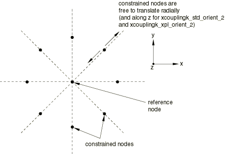

In these tests the center node is the reference node, and the perimeter nodes are the coupling nodes. Four separate coupling definitions that share the same reference node are defined. Each coupling definition defines the local coordinate system using a different orientation system: cylindrical, rectangular, spherical, and, for the Abaqus/Standard analyses, a system defined by user subroutine [`ORIENT`](../sub/sub-link.md#sub-xsl-orient). In all cases the resulting local constraint basis directions coincide with the local directions of a cylindrical coordinate system whose axis is normal to the plane containing the nodes and passes through the reference node. 

In problems [xcouplingk_std_orient_1.inp](../eif/xcouplingk_std_orient_1.inp) and  [xcouplingk_xpl_orient_1.inp](../eif/xcouplingk_xpl_orient_1.inp)the kinematic coupling constrains all but the radial degree of freedom at the coupling nodes. Linear springs to ground (SPRING1) for the Abaqus/Standard analyses and connector elements to ground (CONN3D2) with linear elastic connector behavior for the Abaqus/Explicit analyses are attached to all coupling nodes and act in the *x*- and *y*-directions. The reference node is then rotated  radians about the *z*-axis. 

In problems [xcouplingk_std_orient_2.inp](../eif/xcouplingk_std_orient_2.inp)  and [xcouplingk_xpl_orient_2.inp](../eif/xcouplingk_xpl_orient_2.inp)the kinematic coupling constrains the circumferential degree of freedom only. Linear springs to ground (SPRING1) for the Abaqus/Standard analyses and connector elements to ground (CONN3D2) with linear elastic connector behavior for the Abaqus/Explicit analyses are attached to all coupling nodes and act in the *x*-, *y*-, and *z*-directions. The reference node is then rotated  about *x*-axis.

### Results and discussion

These tests result in motion of the constrained nodes, under action of the linear springs, as the reference node rotates. For tests [xcouplingk_std_orient_1.inp](../eif/xcouplingk_std_orient_1.inp)  and [xcouplingk_xpl_orient_1.inp](../eif/xcouplingk_xpl_orient_1.inp)this motion remains on the local radius passing through the node at all increments. For tests [xcouplingk_std_orient_2.inp](../eif/xcouplingk_std_orient_2.inp)  and [xcouplingk_xpl_orient_2.inp](../eif/xcouplingk_xpl_orient_2.inp) this motion remains in the plane defined by the original configuration local radius and the global *z*-direction as this plane rotates according to the motion prescribed at the reference node.

### Input files

##### **Abaqus/Standard input files**

[xcouplingk_std_orient_1.inp](../eif/xcouplingk_std_orient_1.inp)

Test of local orientation and the release of a single translational degree of freedom.

[xcouplingk_std_orient_1.f](../eif/xcouplingk_std_orient_1.f)

User subroutine [`ORIENT`](../sub/sub-link.md#sub-xsl-orient) for xcouplingk_std_orient_1.inp.

[xcouplingk_std_orient_2.inp](../eif/xcouplingk_std_orient_2.inp)

Test of local orientation and the release of a two translational degrees of freedom.

[xcouplingk_std_orient_2.f](../eif/xcouplingk_std_orient_2.f)

User subroutine [`ORIENT`](../sub/sub-link.md#sub-xsl-orient) for xcouplingk_std_orient_2.inp.

##### **Abaqus/Explicit input files**

[xcouplingk_xpl_orient_1.inp](../eif/xcouplingk_xpl_orient_1.inp)

Test of local orientation and the release of a single translational degree of freedom.

[xcouplingk_xpl_orient_2.inp](../eif/xcouplingk_xpl_orient_2.inp)

Test of local orientation and the release of two translational degrees of freedom.

### III. Internal sorting of kinematic coupling constraints

### Features tested

The internal sorting of kinematic coupling constraints when used in conjunction with MPC definitions is verified.

### Problem description

The model consists of an axial arrangement of 20 shell elements. These elements are tied together using a combination of kinematic coupling constraints as well as MPCs. The constraints are defined such that the kinematic coupling reference node appears after the constraint definitions that are eliminated degrees of freedom on that node; thus, constraint sorting is required. The structure is clamped on one end, and a concentrated axial load is applied on the other end.

### Results and discussion

The test results in an internal sorting of kinematic coupling definitions and MPCs so that the proper elimination order is achieved.

### Input files

##### **Abaqus/Standard input file**

[xcouplingk_std_sort.inp](../eif/xcouplingk_std_sort.inp)

Test internal sorting of kinematic coupling constraints.

##### **Abaqus/Explicit input file**

[xcouplingk_xpl_sort.inp](../eif/xcouplingk_xpl_sort.inp)

Test internal sorting of kinematic coupling constraints.

### IV. Distributing coupling constraints with user-specified weights

### Features tested

The distributing coupling constraint is tested by using coupling and distributing constraints with user-specified distributing weight factors. Geometric linear and nonlinear tests are performed.

### Problem description

**Model: **

The initial starting geometry for each test is shown in [Figure 5.1.7--2](ch05s01abv323.md#verdcoup-model). For the geometric linear test, for Abaqus/Standard, each coupling node is connected by a spring to ground (SPRING1) in each direction. In the geometrically nonlinear test in Abaqus/Standard, each coupling node is connected by a dashpot to ground (DASHPOT1) in each direction, and an axial spring element (SPRINGA) connects each pair of coupling nodes. In the geometrically nonlinear test in Abaqus/Explicit, each coupling node is connected by a connector to ground (CONN3D2) with damping behavior specified in each direction, and a connector element with specified elastic behavior connects each pair of coupling nodes. The reference node for the coupling constraint is node 10.

**Figure 5.1.7–2** Initial starting geometry.

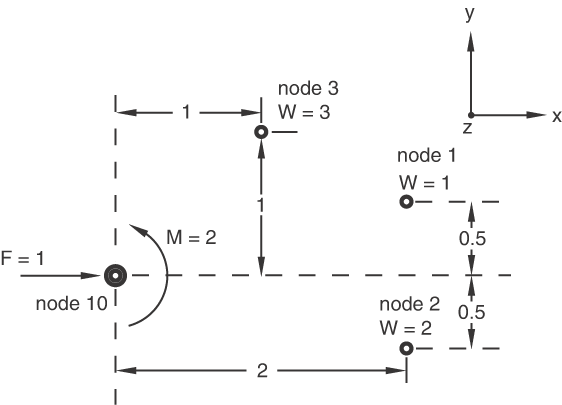

#### Linear behavior

**Properties:**

The spring stiffnesses are 100, 200, and 300 for degrees of freedom 1, 2, and 3, respectively, for the springs connected to all coupling nodes. The distributing weight factors are 1, 2, and 3 for nodes 1, 2, and 3, respectively. 

**Loading:**

| Step 1 | The force at the reference node is 1.0 in the *x*-direction. The moment at the reference node is 2.0 about the *z*-axis. |
| --- | --- |
| Step 2 | The force at the reference node is 1.0 in the *y*-direction. The moment at the reference node is 2.0 about the *x*-axis. |
| Step 3 | The force at the reference node is 1.0 in the *z*-direction. The moment at the reference node is 2.0 about the *y*-axis. |
| Step 4 | Frequency extraction. |
| Step 5 | Transient modal dynamic step with a load, 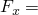 1.0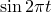, applied to the reference node. |
| Step 6 | Mode-based steady-state dynamic step with a load,  1.0, applied to the reference node. |

#### Nonlinear behavior

**Properties:**

The dashpot damping coefficients are 100, 200, and 300 for degrees of freedom 1, 2, and 3, respectively, for the dashpots connected to all coupling nodes. The axial springs connecting the coupling nodes each have a spring constant of 1.0  108. The distributing weight factors are 1, 2, and 3 for nodes 1, 2, and 3, respectively.

**Prescribed reference node motion for Abaqus/Standard:**

| Step 1 | Total rotation of  about the *z*-axis. Translation 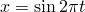. |
| --- | --- |
| Step 2 | Total rotation of  about the *y*-axis. Translation 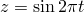. |
| Step 3 | Total rotation of  about the *x*-axis. Translation 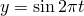. |
| Step 4 | Direct-integration dynamic step with a total rotation of  about the *z*-axis. Translation . |

**Prescribed reference node motion for Abaqus/Explicit:**

| Step 1 | Total rotation of  about the *z*-axis. Translation . |
| --- | --- |
| Step 2 | Total rotation of  about the *y*-axis. Translation . |
| Step 3 | Total rotation of  about the *x*-axis. Translation . |
| Step 4 | Total rotation of  about the *z*-axis. Translation . |

### Results and discussion

In all tests the load distribution among coupling nodes adheres to the relation 

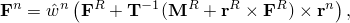

where  is the force distribution at the coupling nodes, 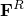 and  are the force and moment at the reference node, 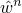 are the normalized distributing weight factors,  is the coupling node arrangement inertia tensor, and 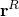 and 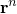 are the positions of the reference and coupling nodes relative to the coupling node arrangement centroid, respectively. See ["Distributing coupling elements," Section 3.9.8 of the Abaqus Theory Guide](../stm/stm-link.md#stm-elm-distcouplingelem), for a more detailed description of this load distribution.

### Input files

##### **Abaqus/Standard input files**

[xcouplingd_std_geomlinear.inp](../eif/xcouplingd_std_geomlinear.inp)

Distributing coupling for geometric linear case.

[xcouplingd_std_geomnonlinear.inp](../eif/xcouplingd_std_geomnonlinear.inp)

Distributing coupling for geometric nonlinear case.

##### **Abaqus/Explicit input file**

[xcouplingd_xpl_geomnonlinear.inp](../eif/xcouplingd_xpl_geomnonlinear.inp)

Distributing coupling for geometric nonlinear case.

### V. Default distributing weight factors

### Elements tested

B21    B22    

C3D8    C3D8R    C3D10M    C3D20    C3D27    

CAX4    CAX4R    CAX8    

CPE4    CPE4R    CPE8    

S3R    S4    S8R    S9R5    

### Features tested

The default distributing weight factors for a distributing coupling constraint are verified. The weight factors are based on the nodal tributary surface area at each coupling node.

### Problem description

Various models consisting of either continuum, beam, or shell elements are used in this test. In all models a uniform surface load is applied via a reference node and a distributing coupling constraint. A nonuniform mesh density is used to verify that the proper tributary area is calculated. The reference node is located at the center of the loaded surface, offset in the normal direction.

### Results and discussion

The displacements are equal to the displacements obtained if the model were loaded with a uniform pressure load, hence verifying that the proper distributing weights are calculated at the coupling nodes.

### Input files

##### **Abaqus/Standard input files**

[xcouplingd_std_tarea_b21.inp](../eif/xcouplingd_std_tarea_b21.inp)

Surface with underlying B21 elements.

[xcouplingd_std_tarea_b22.inp](../eif/xcouplingd_std_tarea_b22.inp)

Surface with underlying B22 elements.

[xcouplingd_std_tarea_c3d10m.inp](../eif/xcouplingd_std_tarea_c3d10m.inp)

Surface with underlying C3D10M elements.

[xcouplingd_std_tarea_c3d20.inp](../eif/xcouplingd_std_tarea_c3d20.inp)

Surface with underlying C3D20 elements.

[xcouplingd_std_tarea_c3d27.inp](../eif/xcouplingd_std_tarea_c3d27.inp)

Surface with underlying C3D27 elements.

[xcouplingd_std_tarea_c3d8.inp](../eif/xcouplingd_std_tarea_c3d8.inp)

Surface with underlying C3D8 elements.

[xcouplingd_std_tarea_cax4.inp](../eif/xcouplingd_std_tarea_cax4.inp)

Surface with underlying CAX4 elements.

[xcouplingd_std_tarea_cax8.inp](../eif/xcouplingd_std_tarea_cax8.inp)

Surface with underlying CAX8 elements.

[xcouplingd_std_tarea_cpe4.inp](../eif/xcouplingd_std_tarea_cpe4.inp)

Surface with underlying CPE4 elements.

[xcouplingd_std_tarea_cpe8.inp](../eif/xcouplingd_std_tarea_cpe8.inp)

Surface with underlying CPE8 elements.

[xcouplingd_std_tarea_s3r.inp](../eif/xcouplingd_std_tarea_s3r.inp)

Surface with underlying S3R elements.

[xcouplingd_std_tarea_s4.inp](../eif/xcouplingd_std_tarea_s4.inp)

Surface with underlying S4 elements.

[xcouplingd_std_tarea_s8r.inp](../eif/xcouplingd_std_tarea_s8r.inp)

Surface with underlying S8R elements.

[xcouplingd_std_tarea_s9r5.inp](../eif/xcouplingd_std_tarea_s9r5.inp)

Surface with underlying S9R5 elements.

##### **Abaqus/Explicit input files**

[xcouplingd_xpl_tarea_b21.inp](../eif/xcouplingd_xpl_tarea_b21.inp)

Surface with underlying B21 elements.

[xcouplingd_xpl_tarea_c3d10m.inp](../eif/xcouplingd_xpl_tarea_c3d10m.inp)

Surface with underlying C3D10M elements.

[xcouplingd_xpl_tarea_c3d8r.inp](../eif/xcouplingd_xpl_tarea_c3d8r.inp)

Surface with underlying C3D8R elements.

[xcouplingd_xpl_tarea_cax4r.inp](../eif/xcouplingd_xpl_tarea_cax4r.inp)

Surface with underlying CAX4R elements.

[xcouplingd_xpl_tarea_cpe4r.inp](../eif/xcouplingd_xpl_tarea_cpe4r.inp)

Surface with underlying CPE4R elements.

[xcouplingd_xpl_tarea_s4r.inp](../eif/xcouplingd_xpl_tarea_s4r.inp)

Surface with underlying S4R elements.

### VI. Weighting method and influence region

### Features tested

The calculation of distributing weights as outlined in ["Coupling constraints," Section 35.3.2 of the Abaqus Analysis User's Guide](../usb/usb-link.md#usb-cni-pcoupling), when the optional weighting method and influence region are specified is verified. The use of coupling constraints at the part-instance level is also illustrated.

### Problem description

A part is defined consisting of two rows of 20 CPE4R elements. Each element is a unit square. The coupling nodes are defined along the top surface. A reference node is created at the center of the top surface. The part is then instanced three times in the assembly definition. For each part instance a coupling constraint with a different influence region is defined. The first part instance has an infinite influence radius; i.e., all nodes defined on the surface will be included in the coupling definition. The second part instance uses an influence radius of 5.5, and the third part instance uses an influence radius of 0.5. A concentrated load is applied to each reference node. Input files are provided for each weighting scheme: uniform, linear, quadratic, and cubic.

### Results and discussion

The distributing weight factor calculations are verified to be according to the description provided in ["Coupling constraints," Section 35.3.2 of the Abaqus Analysis User's Guide](../usb/usb-link.md#usb-cni-pcoupling). For the first instance all nodes belonging to the facets are included in the coupling definition. For the second instance the nodes of six facets adjacent to the reference node are included in the coupling definition. In this case the facet farthest away from the reference node (on either side) uses a facet participation factor of 0.5, since only part of element surface facet is included in the influence region. For the third case the nodes of the adjacent facets to the reference node are included in the coupling definition. In this case each facet has a participation factor of 0.5, since only part of the element surface facet is included in the influence region.

### Input files

##### **Abaqus/Standard input files**

[xcouplingd_std_wgt_uniform.inp](../eif/xcouplingd_std_wgt_uniform.inp)

Distributing coupling with a uniform weighting method.

[xcouplingd_std_wgt_linear.inp](../eif/xcouplingd_std_wgt_linear.inp)

Distributing coupling with a linear weighting method.

[xcouplingd_std_wgt_quadratic.inp](../eif/xcouplingd_std_wgt_quadratic.inp)

Distributing coupling with a quadratic weighting method.

[xcouplingd_std_wgt_cubic.inp](../eif/xcouplingd_std_wgt_cubic.inp)

Distributing coupling with a cubic weighting method.

##### **Abaqus/Explicit input files**

[xcouplingd_xpl_wgt_uniform.inp](../eif/xcouplingd_xpl_wgt_uniform.inp)

Distributing coupling with a uniform weighting method.

[xcouplingd_xpl_wgt_linear.inp](../eif/xcouplingd_xpl_wgt_linear.inp)

Distributing coupling with a linear weighting method.

[xcouplingd_xpl_wgt_quadratic.inp](../eif/xcouplingd_xpl_wgt_quadratic.inp)

Distributing coupling with a quadratic weighting method.

[xcouplingd_xpl_wgt_cubic.inp](../eif/xcouplingd_xpl_wgt_cubic.inp)

Distributing coupling with a cubic weighting method.

### VII. Colinear coupling node arrangement

### Features tested

A pathological situation in which all coupling nodes are colinear for a distributing coupling constraint and the moment applied at the reference node is not transmitted by the constraint is tested.

### Problem description

The geometry is shown in [Figure 5.1.7--3](ch05s01abv323.md#verdcoup-colinear).

**Figure 5.1.7–3** Colinear coupling node arrangement.

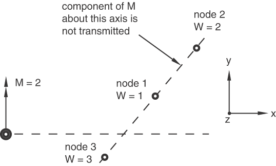

### Results and discussion

The distributing coupling constraint connects a single reference node that has translational and rotational degrees of freedom to a collection of coupling nodes that have only translational degrees of freedom. Thus, when the coupling nodes are colinear in a three-dimensional analysis, a situation can arise where the moments applied to the reference node are not transmitted. In such a case Abaqus will print a warning message specifying the axis about which the moments are not transmitted.

### Input files

##### **Abaqus/Standard input file**

[xcouplingd_std_colinear_nodes.inp](../eif/xcouplingd_std_colinear_nodes.inp)

Distributing coupling with colinear coupling nodes.

##### **Abaqus/Explicit input file**

[xcouplingd_xpl_colinear_nodes.inp](../eif/xcouplingd_xpl_colinear_nodes.inp)

Distributing coupling with colinear coupling nodes.

### VIII. Moment release for distributing coupling

### Features tested

A series of linear and nonlinear analyses are performed demonstrating the ability of the distributing coupling constraints to release the rotation constraints between the reference node and the coupling nodes about user-specified axes.

### Problem description

This example consists of both a two-dimensional and three-dimensional test.

 In the two-dimensional test, two separate models are defined. Each model consists of a single CPE4 element with one face coupled to a reference node with a distributing constraint. The opposite face of the CPE4 element is fixed. Beam elements are attached to the reference nodes for visualization purposes only. The first model uses the default coupling in which the rotation degree of freedom of the reference node is coupled to the solid surface (the displacement degrees of freedom of the reference are always coupled to the surface with distributing constraints). The second model releases the rotation constraint. A series of boundary conditions are applied to the reference nodes simulating shear, tension, and bending (in various linear and nonlinear steps). 

In the three-dimensional test, eight separate models are defined. Each model consists of a single C3D8 element with one face coupled to a reference node with a distributing constraint. The opposite faces of the C3D8 elements are fixed. Beam elements are attached to the reference nodes for visualization purposes only. The first model uses the default coupling in which all three rotation degrees of freedom of the reference node are coupled to the solid surface. The next three models respectively release the rotation constraint in the 1, 2, and 3 directions. The final four models are identical to the first four, except that the rotation constraint directions are specified. A series of boundary conditions are applied to the reference nodes simulating shear, tension, and bending (in linear and nonlinear steps). 

### Results and discussion

The results clearly show that both coupling definitions in both two and three dimensions are being applied properly. 

### Input files

##### **Abaqus/Standard input files**

[xcouplingd_std_release_2d.inp](../eif/xcouplingd_std_release_2d.inp)

Two-dimensional examples of distributing coupling with the moment constraints released.

[xcouplingd_std_release_3d.inp](../eif/xcouplingd_std_release_3d.inp)

Three-dimensional examples of distributing coupling with the moment constraints released.

### IX. Dimensional coupling

### Features tested

A series of linear analyses are performed demonstrating the ability of the distributing coupling constraints to provide accurate dimensional coupling of beam elements to shell and solid elements.

### Problem description

This example consists of two sets of tests in which a pipe is modeled with beam and shell elements and with beam and continuum elements.

 The pipe analyzed with beam and shell elements has a length of 0.8 m, an outside radius of 0.1 m, and a thickness of 0.01 m. The material has a Young's modulus of 200 GPa and a Poisson's ratio of 0.3. Half of the pipe is modeled with beam elements and the other half is modeled with shell elements (see [Figure 5.1.7--4](ch05s01abv323.md#verdcouple-beam)(a)). The beam node closest to the shell model is defined as the reference node for the distributing coupling constraint. An element-based edge surface is defined on the shell model, which is coupled to the reference node. The coupled model is subjected to four linear loading conditions simulating: (1) twist about the pipe axis, (2) axial stretch along the pipe axis, (3) pure bending about the *x*-axis, and (4) shear loading. The four load conditions are applied in a single linear step as four load cases. Two models are analyzed: one with linear beam and shell elements and one with quadratic beam and shell elements.

**Figure 5.1.7–4** Dimensional coupling examples: (a) beam-to-shell coupling model; (b) beam-to-solid coupling model.

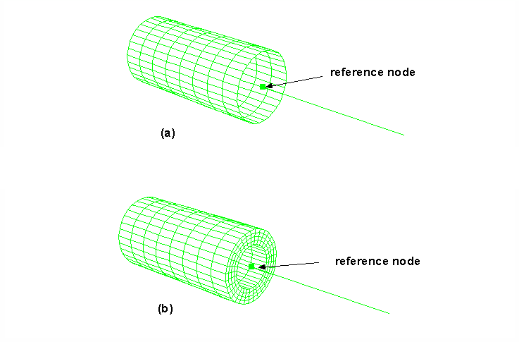

 The pipe analyzed with beam and continuum elements has a length of 0.8 m, an outside radius of 0.1 m, and a thickness of 0.04 m. The material has a Young's modulus of 200 GPa and a Poisson's ratio of 0.3. Half of the pipe is modeled with beam elements and the other half is modeled with continuum elements (see [Figure 5.1.7--4](ch05s01abv323.md#verdcouple-beam)(b)). The beam node closest to the continuum model is defined as the reference node for the distributing coupling constraint. An element-based surface is defined on the continuum model, which is coupled to the reference node. The coupled model is subjected to four linear loading conditions simulating: (1) twist about the pipe axis, (2) axial stretch along the pipe axis, (3) pure bending about the *x*-axis, and (4) shear loading. The four load conditions are applied in a single linear step. Two models are analyzed: one with linear beam and continuum elements and one with quadratic beam and continuum elements.

### Results and discussion

The resulting stress fields in the shell and solid models show minimal distortion at the coupling interface, indication that the dimensional coupling is modeled accurately. 

### Input files

##### **Abaqus/Standard input files**

[xcoupling_beamtoshell_lin.inp](../eif/xcoupling_beamtoshell_lin.inp)

Coupling a beam model to a shell model using linear beam and shell elements.

[xcoupling_beamtoshell_quad.inp](../eif/xcoupling_beamtoshell_quad.inp)

Coupling a beam model to a shell model using quadratic beam and shell elements.

[xcoupling_beamtosolid_lin.inp](../eif/xcoupling_beamtosolid_lin.inp)

Coupling a beam model to a continuum model using linear beam and continuum elements.

[xcoupling_beamtosolid_quad.inp](../eif/xcoupling_beamtosolid_quad.inp)

Coupling a beam model to a continuum model using quadratic beam and continuum elements.

### X. Structural coupling

### Feature tested

A series of analyses are performed demonstrating the structural coupling capability of small distributing coupling constraints.

### Problem description

Four different models, each with two small distributing couplings, are analyzed. In the first model two small square plates are coupled together with a BEAM connector. The connector nodes are coupled to the two small surfaces using structural distributing couplings. One plate is kept fixed, while the other is pulled upward (pried open) on one side. In the second model the same plates are pulled upward from all sides. In the third model two circular plates are fastened together by placing a BEAM MPC between the reference nodes of two structural distributing couplings spanning two small patches on the two plates. The plates are then subjected to relative shear motion. In the fourth model two U-shaped shell specimens are connected in a fashion similar to that in the second model. The lower specimen is fixed, while the upper specimen is lifted and pried open simultaneously.

For comparison in Abaqus/Explicit, similar models are created to use continuum distributing coupling and fasteners. 

### Results and discussion

The resulting deformed shapes match the expectations. More important, if structural coupling is used, contact between the plates does not occur in the area close to the fastener, as expected. By contrast, contact does occur if continuum distributing couplings are used.

### Input files

##### **Abaqus/Explicit input files**

[couplingstruct_pry_dist_xpl.inp](../eif/couplingstruct_pry_dist_xpl.inp)

First model described above with structural coupling. 

[couplingcont_pry_dist_xpl.inp](../eif/couplingcont_pry_dist_xpl.inp)

First model described above with continuum coupling. 

[couplingstruct_pry_fast_xpl.inp](../eif/couplingstruct_pry_fast_xpl.inp)

First model described above with structural coupling via fasteners. 

[couplingstruct_pull_dist_xpl.inp](../eif/couplingstruct_pull_dist_xpl.inp)

Second model described above with structural coupling. 

[couplingcont_pull_dist_xpl.inp](../eif/couplingcont_pull_dist_xpl.inp)

Second model described above with continuum coupling. 

[couplingstruct_pull_fast_xpl.inp](../eif/couplingstruct_pull_fast_xpl.inp)

Second model described above with structural coupling via fasteners. 

[couplingstruct_circle_dist_xpl.inp](../eif/couplingstruct_circle_dist_xpl.inp)

Third model described above with structural coupling. 

[couplingcont_circle_dist_xpl.inp](../eif/couplingcont_circle_dist_xpl.inp)

Third model described above with continuum coupling. 

[couplingstruct_circle_fast_xpl.inp](../eif/couplingstruct_circle_fast_xpl.inp)

Third model described above with structural coupling via fasteners. 

[couplingstruct_utestrig_dist_xpl.inp](../eif/couplingstruct_utestrig_dist_xpl.inp)

Fourth model described above with structural coupling. 

[couplingcont_utestrig_dist_xpl.inp](../eif/couplingcont_utestrig_dist_xpl.inp)

Fourth model described above with continuum coupling. 

[couplingstruct_utestrig_fast_xpl.inp](../eif/couplingstruct_utestrig_fast_xpl.inp)

Fourth model described above with structural coupling via fasteners. 

##### **Abaqus/Standard input files**

[couplingstruct_pry_dist_std.inp](../eif/couplingstruct_pry_dist_std.inp)

First model described above with structural coupling. 

[couplingstruct_pry_fast_std.inp](../eif/couplingstruct_pry_fast_std.inp)

First model described above with structural coupling via fasteners. 

[couplingstruct_pull_dist_std.inp](../eif/couplingstruct_pull_dist_std.inp)

Second model described above with structural coupling. 

[couplingstruct_pull_fast_std.inp](../eif/couplingstruct_pull_fast_std.inp)

Second model described above with structural coupling via fasteners. 

[couplingstruct_circle_dist_std.inp](../eif/couplingstruct_circle_dist_std.inp)

Third model described above with structural coupling. 

[couplingstruct_circle_fast_std.inp](../eif/couplingstruct_circle_fast_std.inp)

Third model described above with structural coupling via fasteners. 

[couplingstruct_utestrig_dist_std.inp](../eif/couplingstruct_utestrig_dist_std.inp)

Fourth model described above with structural coupling. 

[couplingstruct_utestrig_fast_std.inp](../eif/couplingstruct_utestrig_fast_std.inp)

Fourth model described above with structural coupling via fasteners. 

