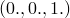

# 5.1.16 Mesh-independent spot welds

**Products: **Abaqus/Standard  Abaqus/Explicit  

### Features tested

This section provides basic verification tests for the mesh-independent spot weld and mesh-independent spot-weld properties procedures.

### I. Spot-welded plates subject to pressure and shear loading

### Elements tested

S4    S4R    

### Problem description

Rigid spot welds are defined between combinations of two or more plates comprised of three-dimensional shell elements. The spot weld options are used to test the various ways in which the user can define mesh-independent spot welds. The three ways in which the user can define the spot-welded surfaces are verified: the user does not specify any surface, the user specifies a single surface, or the user specifically lists the surfaces to be spot welded. Limiting the surface facets considered for spot welding is verified, along with controlling the distributing coupling definitions generated by the spot welds. In addition, user-specified projection directions are tested. Structural coupling is also tested for many of the test combinations above. 

Each combination is subjected to the same loading conditions. In the Abaqus/Standard analyses the top plate is loaded with a uniform pressure. In the Abaqus/Explicit analyses the top and bottom plates in each combination are subjected to displacements of =.1 and =.1, respectively, along the plate edges parallel to the *y*-axis. 

### Results and discussion

The results for each combination indicate that the surfaces are spot welded appropriately.

### Input files

##### **Abaqus/Standard input files**

[fastener_projdir_s4.inp](../eif/fastener_projdir_s4.inp)

Tests user-specified projection directions for spot welds with a single user-specified surface.

[fastener_search_s4.inp](../eif/fastener_search_s4.inp)

Tests the RADIUS OF INFLUENCE, SEARCH RADIUS, and NUMBER OF LAYERS parameters for spot welds with no user-specified surface.

[fastener_unsort_weight_s4.inp](../eif/fastener_unsort_weight_s4.inp)

Tests the UNSORTED and WEIGHTING METHOD parameters with multiple user-specified surfaces.

##### **Abaqus/Explicit input files**

[xfastener_xpl_beammpcs.inp](../eif/xfastener_xpl_beammpcs.inp)

Tests the various methods for defining mesh-independent spot welds using BEAM-type MPCs.

[xfastener_xpl_beammpcs_struct.inp](../eif/xfastener_xpl_beammpcs_struct.inp)

Same as above only using structural coupling.

[xfastener_xpl_connectors.inp](../eif/xfastener_xpl_connectors.inp)

Tests the various methods for defining mesh-independent spot welds using both user-defined and internally generated connector elements.

[xfastener_xpl_connectors_struct.inp](../eif/xfastener_xpl_connectors_struct.inp)

Same as above only using structural coupling.

[xfastener_xpl_beammpcs_s4.inp](../eif/xfastener_xpl_beammpcs_s4.inp)

Tests the various methods for defining mesh-independent spot welds using BEAM-type MPCs with S4 elements.

[xfastener_xpl_beammpcs_struct_s4.inp](../eif/xfastener_xpl_beammpcs_struct_s4.inp)

Same as above only using structural coupling.

[xfastener_xpl_connectors_s4.inp](../eif/xfastener_xpl_connectors_s4.inp)

Tests the various methods for defining mesh-independent spot welds using both user-defined and internally generated connector elements.

### II. Multi-layer spot welds between surfaces defined on various element types

### Elements tested

S3    S4    S8R    STRI65    

### Problem description

Various combinations of plates are spot welded to the faces of a bi-unit cube. These tests verify the ability of Abaqus to accurately spot weld meshes of different element types. These tests also verify several features of the mesh-independent fastener and mesh-independent fastener properties procedures including user-specified and free surface options, default and user-specified orientations and projection directions, multiple interactions, fastener property and reference node options, and fully constrained and released rotation constraints. 

### Results and discussion

The results indicate that the fastener options tested are modeled correctly.

### Input files

[fastener_multilay_lin_std.inp](../eif/fastener_multilay_lin_std.inp)

Plates spot welded to a cube with user-specified surfaces and orientations; static linear perturbation tests including multiple load cases.

[fastener_multilay_lin_conn_std.inp](../eif/fastener_multilay_lin_conn_std.inp)

Plates spot welded to a cube with user-specified surfaces and orientations; static linear perturbation tests including multiple load cases. BEAM connector elements are used instead of BEAM-type MPCs.

[fastener_multilay_lin_r1_std.inp](../eif/fastener_multilay_lin_r1_std.inp)

Plates spot welded to a cube with user-specified surfaces and orientations; rotation constraint in spot welds released in the local 3-direction; static linear perturbation tests including multiple load cases.

[fastener_multilay_lin_r3_std.inp](../eif/fastener_multilay_lin_r3_std.inp)

Plates spot welded to a cube with user-specified surfaces and orientations; all rotation constraints in spot welds released; static linear perturbation tests including multiple load cases.

[fastener_multilay_free_lin_std.inp](../eif/fastener_multilay_free_lin_std.inp)

Plates spot welded to a cube with free and user-specified surfaces and orientations and user-specified projection directions; static linear perturbation tests including multiple load cases.

[fastener_s4_multilay_std.inp](../eif/fastener_s4_multilay_std.inp)

Plates spot welded to a cube with user-specified surfaces and orientations; static linear perturbation and geometrically nonlinear tests; S4 elements.

### III. Single-layer spot welds between surfaces defined on various element types with varying mesh densities

### Elements tested

S3    S4    S4R    S8R    

C3D4    C3D8R    C3D10M    C3D20R    

R3D3    R3D4    

### Problem description

Individual plates are spot welded to the faces of a cube. These tests verify the mesh-independent fastener procedure in both perturbation and geometrically nonlinear analyses, including restart. These tests also verify fasteners on meshes of varying density. In addition, structural coupling is also tested.

### Results and discussion

The results indicate that the fastener options tested are modeled correctly.

### Input files

##### **Abaqus/Standard input files**

[fastener_s4_std.inp](../eif/fastener_s4_std.inp)

Plates spot welded to a cube with user-specified surfaces and orientations; static linear perturbation, frequency extraction, direct and mode-based steady-state dynamic, and geometrically nonlinear tests; S4 elements.

[fastener_s4_struct_std.inp](../eif/fastener_s4_struct_std.inp)

Plates spot welded to a cube using structural coupling with user-specified surfaces and orientations; static linear perturbation, frequency extraction, direct and mode-based steady-state dynamic, and geometrically nonlinear tests; S4 elements.

[fastener_s4_std_res.inp](../eif/fastener_s4_std_res.inp)

Restart analysis of fastener_s4_std.inp; S4 elements.

[fastener_s8r_std.inp](../eif/fastener_s8r_std.inp)

Plates spot welded to a cube with user-specified surfaces and orientations; static linear perturbation, frequency extraction, direct and mode-based steady-state dynamic, and geometrically nonlinear tests; S4 elements.

[fastener_s3_c3d4_std.inp](../eif/fastener_s3_c3d4_std.inp)

Plate spot welded to a cube with user-specified surfaces; single static step; S3 and C3D4 elements with varying mesh density.

[fastener_s3_c3d8r_std.inp](../eif/fastener_s3_c3d8r_std.inp)

Plate spot welded to a cube with user-specified surfaces; single static step; S3 and C3D8R elements with varying mesh density.

[fastener_s3_c3d10m_std.inp](../eif/fastener_s3_c3d10m_std.inp)

Plate spot welded to a cube with user-specified surfaces; single static step; S3 and C3D10M elements with varying mesh density.

[fastener_s3_c3d20r_std.inp](../eif/fastener_s3_c3d20r_std.inp)

Plate spot welded to a cube with user-specified surfaces; single static step; S3 and C3D20R elements with varying mesh density.

[fastener_s4r_c3d4_std.inp](../eif/fastener_s4r_c3d4_std.inp)

Plate spot welded to a cube with user-specified surfaces; single static step; S4R and C3D4 elements with varying mesh density.

[fastener_s4r_c3d8r_std.inp](../eif/fastener_s4r_c3d8r_std.inp)

Plate spot welded to a cube with user-specified surfaces; single static step; S4R and C3D8R elements with varying mesh density.

[fastener_s4r_c3d10m_std.inp](../eif/fastener_s4r_c3d10m_std.inp)

Plate spot welded to a cube with user-specified surfaces; single static step; S4R and C3D10M elements with varying mesh density.

[fastener_s4r_c3d20r_std.inp](../eif/fastener_s4r_c3d20r_std.inp)

Plate spot welded to a cube with user-specified surfaces; single static step; S4R and C3D20R elements with varying mesh density.

[fastener_s8r_c3d4_std.inp](../eif/fastener_s8r_c3d4_std.inp)

Plate spot welded to a cube with user-specified surfaces; single static step; S8R and C3D4 elements with varying mesh density.

[fastener_s8r_c3d8r_std.inp](../eif/fastener_s8r_c3d8r_std.inp)

Plate spot welded to a cube with user-specified surfaces; single static step; S8R and C3D8R elements with varying mesh density.

[fastener_s8r_c3d8r_struct_std.inp](../eif/fastener_s8r_c3d8r_struct_std.inp)

Plate spot welded to a cube using structural coupling with user-specified surfaces; single static step; S8R and C3D8R elements with varying mesh density.

[fastener_s8r_c3d10m_std.inp](../eif/fastener_s8r_c3d10m_std.inp)

Plate spot welded to a cube with user-specified surfaces; single static step; S8R and C3D10M elements with varying mesh density.

[fastener_s8r_c3d20r_std.inp](../eif/fastener_s8r_c3d20r_std.inp)

Plate spot welded to a cube with user-specified surfaces; single static step; S8R and C3D20R elements with varying mesh density.

[fastener_r3d3_c3d4_std.inp](../eif/fastener_r3d3_c3d4_std.inp)

Plate spot welded to a cube with user-specified surfaces; single static step; R3D3 and C3D4 elements with varying mesh density.

[fastener_r3d4_c3d10m_std.inp](../eif/fastener_r3d4_c3d10m_std.inp)

Plate spot welded to a cube with user-specified surfaces; single static step; R3D4 and C3D10M elements with varying mesh density.

##### **Abaqus/Explicit input files**

[xfastener_xpl_c3d10m_m3d4r.inp](../eif/xfastener_xpl_c3d10m_m3d4r.inp)

Surface comprised of M3D4R membrane elements spot welded to surface comprised of C3D10M continuum elements.

[xfastener_xpl_c3d10m_s4r_struct.inp](../eif/xfastener_xpl_c3d10m_s4r_struct.inp)

Surface comprised of S4R membrane elements spot welded to surface comprised of C3D10M continuum elements using structural coupling.

[xfastener_xpl_c3d4_r3d4.inp](../eif/xfastener_xpl_c3d4_r3d4.inp)

Surface comprised of R3D4 rigid elements spot welded to surface comprised of C3D4 continuum elements.

[xfastener_xpl_c3d8r_s3r.inp](../eif/xfastener_xpl_c3d8r_s3r.inp)

Surface comprised of S3R shell elements spot welded to surface comprised of C3D8R continuum elements.

[xfastener_xpl_c3d8r_s3r_struct.inp](../eif/xfastener_xpl_c3d8r_s3r_struct.inp)

Same as above only using structural coupling.

### IV. Large deformation of a spot-welded beam

### Element tested

S4    

### Problem description

Two beams are spot welded together and subjected to various geometrically nonlinear deformations. 

### Results and discussion

The results indicate that the spot welds are modeled correctly.

### Input files

[fastenedbeam_s4_s4.inp](../eif/fastenedbeam_s4_s4.inp)

Spot-welded beams, S4 elements.

[fastenedbeam_s4_s4_struct.inp](../eif/fastenedbeam_s4_s4_struct.inp)

Spot-welded beams using structural coupling, S4 elements.

[fastenedbeam_s4_s4_po.inp](../eif/fastenedbeam_s4_s4_po.inp)

Post output analysis of fastenedbeam_s4_s4.inp.

[fastenedbeam_s4_s4_struct_lin.inp](../eif/fastenedbeam_s4_s4_struct_lin.inp)

Spot-welded beams using structural coupling, S4 elements. Geometrically linear analysis.

[fastenedbeam_s4_s4_struct_pert.inp](../eif/fastenedbeam_s4_s4_struct_pert.inp)

Spot-welded beams using structural coupling, S4 elements. Perturbation analysis.

### V. Spot welds used in various analysis techniques

### Elements tested

C3D20R    S4R    

### Problem description

The following examples verify that spot welds work with the following analysis techniques: mesh removal and activation, submodeling, and substructures.

### Results and discussion

The results of these tests indicate that spot welds are modeled correctly for these analysis techniques.

### Input files

[fastener_mdlc_s4r_c3d20r.inp](../eif/fastener_mdlc_s4r_c3d20r.inp)

Geometrically nonlinear static and dynamic analyses (including element removal) of a spot-welded model consisting of S4 and C3D20R elements. 

[fastener_struct_mdlc_s4r_c3d20r.inp](../eif/fastener_struct_mdlc_s4r_c3d20r.inp)

Geometrically nonlinear static and dynamic analyses (including element removal) of a spot-welded model consisting of S4 and C3D20R elements. 

[fastener_s4r_global.inp](../eif/fastener_s4r_global.inp)

Static analysis of a global model with spot welds, S4R elements.

[fastener_s4r_submodel.inp](../eif/fastener_s4r_submodel.inp)

Static submodel analysis of fastener_s4r_global.inp with spot welds, S4R elements.

[fastener_substr_gen.inp](../eif/fastener_substr_gen.inp)

Substructure generation file of a spot-welded model using S4R and C3D20R elements.

[fastener_substr.inp](../eif/fastener_substr.inp)

Substructure analysis of a spot-welded model using S4R and C3D8R elements; uses fastener_substr_gen.inp for substructure generation.

### VI. Spot weld surfaces forming T-intersections

### Element tested

S4R    

### Problem description

The following example verifies the ability of Abaqus to accurately create fasteners between plates that are oriented perpendicular to each other; i.e., forming a T-intersection. Various combinations of plates that are perpendicular  to each other, as well as plates that butt against each other, are used to verify that fasteners are formed correctly for all these cases.

### Results and discussion

The results of these tests indicate that Abaqus correctly fastens plates forming T-intersections.

### Input file

[fastener_facetoedge_xpl.inp](../eif/fastener_facetoedge_xpl.inp)

Fasten surfaces forming T-intersection. 

### VII. Linear dynamics

### Elements tested

C3D8    S4    

### Problem description

A single shell element is spot welded to a single brick element. This model is analyzed using various linear dynamic procedures: steady-state dynamics (mode-based, direct, subspace), modal dynamics, random response, and spectrum response. The results of the spot-welded model are compared to similar models using connectors, beams, and distributing coupling elements. Specification of the additional mass that will be distributed to the fastener nodes is also tested.

### Results and discussion

Comparison of the spot weld model results to the results from a beam model indicates that the spot welds are modeled correctly.

### Input files

[fastener_lindyn.inp](../eif/fastener_lindyn.inp)

Spot-welded model using S4 and C3D8 elements.

[fastener_lindyn_connect.inp](../eif/fastener_lindyn_connect.inp)

Spot-welded model using S4 and C3D8 elements. BEAM connector elements are used instead of BEAM type MPCs.

[fastener_lindyn_beam.inp](../eif/fastener_lindyn_beam.inp)

Spot-welded model using B31 and C3D8 elements.

[fastener_lindyn_mass.inp](../eif/fastener_lindyn_mass.inp)

Spot-welded model using S4 and C3D8 elements and the MASS parameter.

### VIII. Compounded local coordinate systems

### Elements tested

C3D8    S4    

### Problem description

If a connector element is used to model a fastener, the local coordinate system defined on the connector section () operates on the local coordinate system for the fastener () to determine the final local coordinate system of the connector element (). In other words, 

In the above equations  and  are assumed to be orthogonal rotation matrices with the local 1-, 2-, and 3-directions being the first, second and, third rows, respectively. The local coordinate system for a connector element modeling a fastener should be specified with respect to the local coordinate system of the fastener. 

In the first example six flat shell structures are fastened independently to the six sides of a single brick element. HINGE connectors have been used with their local 1-directions set to be ; i.e., the local 3-direction of the fasteners. When compounded with the local coordinate system for the fasteners, the local 1-direction for the connector is normal to the surface. Thus, the shell structures are free to rotate about the surface normals.

In the second example six flat shell structures are again fastened independently to the six sides of a single brick element. TRANSLATOR connectors have been used. The local 1-directions (which are the slide direction for this type of connector: see ["Connector element library," Section 31.1.4 of the Abaqus Analysis User's Guide](../usb/usb-link.md#usb-elm-econnectorlibrary)) for the connectors have been set to the local 1-directions of the fasteners. For the four fasteners on the side, the local 1-directions coincide with the global 2-directions. For the two fasteners on the top and the bottom, the local 1-directions coincide with the global 3-directions. Thus, the fastened shell structures on the sides are free to translate in the global 2-directions, while the fastened shell structures on the top and bottom are free to translate in the global 3-direction.

### Results and discussion

The results indicate that the local coordinate systems of the HINGE and TRANSLATOR connectors are modeled correctly.

### Input files

[fastener_connect_hinge.inp](../eif/fastener_connect_hinge.inp)

Six flat shell structures fastened to a cube with user-specified surfaces; single static step; S4 and C3D8 elements.  HINGE connector elements are used.

[fastener_connect_translator.inp](../eif/fastener_connect_translator.inp)

Six flat shell structures fastened to a cube with user-specified surfaces; single static step; S4 and C3D8 elements.  TRANSLATOR connector elements are used.

