# 5.1.17 Multi-point constraints

**Products: **Abaqus/Standard  Abaqus/Explicit  

### Features tested

Various types of multi-point constraints are tested. Simple geometries are given displacements or loads that result in easily checked responses. These responses confirm the proper functioning of the MPCs being tested. Unless noted otherwise, the static procedure is tested. All explicit dynamic tests have been performed so that a quasi-static solution is obtained.

### I. LINEAR MPC

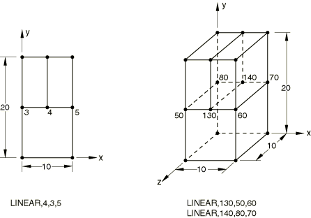

 The LINEAR MPC is tested in Abaqus/Standard and Abaqus/Explicit. A cantilevered bar is subjected to a uniform tensile loading on the free end.

### Abaqus/Standard analysis

### Elements tested

C3D8    CPS4    

### Problem description

**Model: **

Two models (one consisting of CPS4 elements and the other consisting of C3D8 elements) were created within one input file.

**Material: **

Linear elastic, Young's modulus = 3.0  106, Poisson's ratio = 0.3.

**Boundary conditions: **

=0 at *x*=0, =0 at *y*=0, and =0 at *z*=0 for three-dimensional models.

**Loading: **

- Step 1: A uniform pressure of 10000 in the *y*-direction is applied to the top surface.
- Step 2: The load that was applied in the first step is applied again, this time using NLGEOM for large-displacement analysis.

### Results and discussion

The results obtained agree with the analytical solution.

### Input files

[xmpcline.inp](../eif/xmpcline.inp)

LINEAR MPC.

[xmpclinet.inp](../eif/xmpclinet.inp)

LINEAR MPC with transforms.

### Abaqus/Explicit analysis

### Elements tested

C3D8R    CPS4R    

### Problem description

**Model: **

Two models (one consisting of CPS4R elements and the other consisting of C3D8R elements) were created within one input file.

**Material: **

Linear elastic, Young's modulus = 3.0  106, Poisson's ratio = 0.3, density = 0.03.

**Boundary conditions: **

 0 at  0,  0 at  0, and  0 at  0 for three-dimensional models.

**Loading: **

A uniform pressure of 10000 in the *y*-direction is applied to the top surface.

### Results and discussion

The expected solution variables are obtained, and compatibility in the displacement solutions is observed.

### Input file

[mpc_linear.inp](../eif/mpc_linear.inp)

Input data for this MPC test.

### II. QUADRATIC, BILINEAR, and C BIQUAD MPCs

### Elements tested

C3D8    C3D20    CPS8    

### Problem description

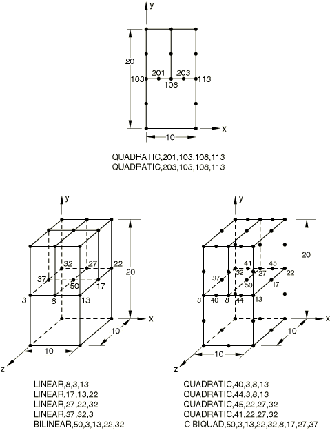

 The QUADRATIC, BILINEAR, and C BIQUAD MPCs are tested in Abaqus/Standard. A cantilevered bar is subjected to a uniform tensile loading on the free end.

The following model data apply to all three tests:

**Material: **

Linear elastic, Young's modulus = 3.0  106, Poisson's ratio = 0.3.

**Boundary conditions: **

=0 at *x*=0, =0 at *y*=0, and =0 at *z*=0 for three-dimensional models.

**Loading: **

- Step 1: A uniform pressure of 10000 in the *y*-direction is applied to the top surface.
- Step 2: The load that was applied in the first step is applied again, this time using NLGEOM for large-displacement analysis.

### Results and discussion

The results obtained agree with the analytical solution.

### Input files

[xmpcquad.inp](../eif/xmpcquad.inp)

QUADRATIC MPC.

[xmpcquadt.inp](../eif/xmpcquadt.inp)

QUADRATIC MPC with transforms.

[xmpcbili.inp](../eif/xmpcbili.inp)

BILINEAR and LINEAR MPCs; MPC data read from input file xmpcinfo.inp.

[xmpcbilit.inp](../eif/xmpcbilit.inp)

BILINEAR and LINEAR MPCs with transforms; MPC data read from input file xmpcinfo.inp.

[xmpccbiq.inp](../eif/xmpccbiq.inp)

C BIQUAD and QUADRATIC MPCs.

[xmpccbiqt.inp](../eif/xmpccbiqt.inp)

C BIQUAD and QUADRATIC MPCs with transforms.

### III. P LINEAR MPC

### Element tested

CPE8P

### Problem description

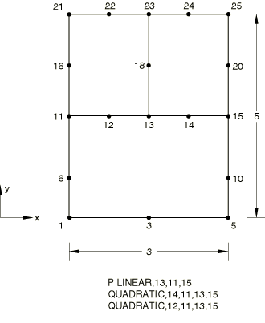

 The P LINEAR MPC is tested in Abaqus/Standard.

**Boundary conditions: **

All displacement degrees of freedom are restrained throughout the analysis. In Step 1 the pore pressure is set to zero at nodes 1 and 5. In Step 2 the pore pressure is set to zero at nodes 5, 15, and 25.

**Loading: **

- Step 1: A pore fluid velocity is specified along the top of the model.
- Step 2: A pore fluid velocity is specified along the left edge of the model.

### Results and discussion

The results obtained agree with the analytical solution.

### Input file

[xmpcplin.inp](../eif/xmpcplin.inp)

P LINEAR and QUADRATIC MPCs.

### IV. T LINEAR MPC

### Elements tested

CPE8T    CPEG8T    

### Problem description

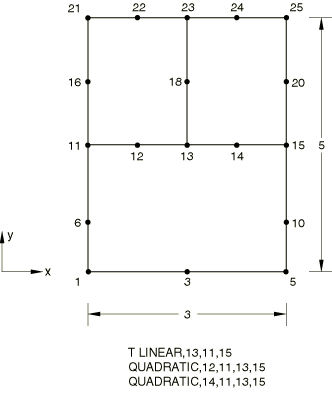

 The T LINEAR MPC is tested in Abaqus/Standard.

**Boundary conditions: **

All displacement degrees of freedom are restrained throughout the analysis. In Step 1 the temperature is set to zero at nodes 5, 15, and 25. In Step 2 the temperature is set to zero at nodes 1 and 5.

**Loading: **

- Step 1: A film coefficient and sink temperature are specified along the left edge of the model.
- Step 2: An emissivity and sink temperature are specified along the top edge of the model.

### Results and discussion

The results obtained agree with the analytical solution.

### Input files

[xmpctlin.inp](../eif/xmpctlin.inp)

T LINEAR and QUADRATIC MPCs.

[xmpctlin_cpeg8t.inp](../eif/xmpctlin_cpeg8t.inp)

T LINEAR and QUADRATIC MPCs.

### V. P BILINEAR MPC

### Element tested

C3D20P

### Problem description

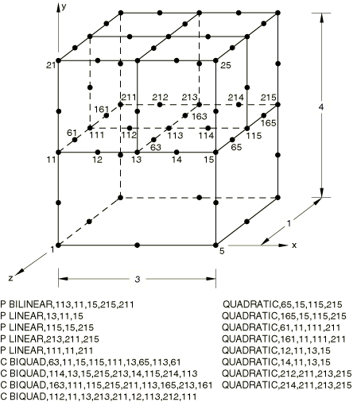

 The P BILINEAR MPC is tested in Abaqus/Standard.

**Boundary conditions: **

All displacement degrees of freedom are restrained throughout the analysis. In Step 1 the pore pressure is set to zero on the front face of the model. In Step 2 the pore pressure is set to zero on the right face of the model.

**Loading: **

- Step 1: A pore fluid velocity is specified out of the back face of the model.
- Step 2: A pore fluid velocity is specified out of the left face of the model.

### Results and discussion

The results obtained agree with the analytical solution.

### Input file

[xmpcpbil.inp](../eif/xmpcpbil.inp)

P BILINEAR, P LINEAR, C BIQUAD and QUADRATIC MPCs.

### VI. T BILINEAR MPC

### Element tested

C3D20T

### Problem description

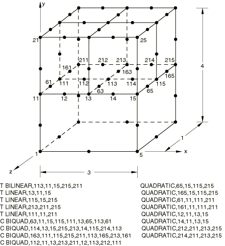

 The T LINEAR MPC is tested in Abaqus/Standard.

**Boundary conditions: **

All displacement degrees of freedom are restrained throughout the analysis. In Step 1 the temperature is set to zero on the left face of the model. In Step 2 the temperature is set to zero on the front face of the model.

**Loading: **

- Step 1: An emissivity and sink temperature are given on the left face of the model.
- Step 2: A surface flux is specified on the back face of the model.

### Results and discussion

The results obtained agree with the analytical solution.

### Input file

[xmpctbil.inp](../eif/xmpctbil.inp)

T BILINEAR, T LINEAR, C BIQUAD and QUADRATIC MPCs.

### VII. BEAM MPC

The BEAM MPC is tested in Abaqus/Standard and Abaqus/Explicit. A cantilevered beam is subjected to a transverse tip load.

### Abaqus/Standard analysis

### Elements tested

B22    B32    

### Problem description

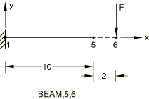

Two-dimensional and three-dimensional beams are considered, with and without the RIKS procedure (introduces a slight imperfection corresponding to the first buckling mode).

**Material: **

Linear elastic, Young's modulus = 3.0  106, Poisson's ratio = 0, density = 1700.

**Boundary conditions: **

Node 1 is clamped.

**Loading 1: **

- Step 1: 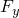=1000 at node 3.
- Step 2: The first four buckling modes are extracted for a live load of =1000.
- Step 3: The load that was applied in the first step is applied again, this time using NLGEOM for large-displacement analysis.

**Loading 2: **

- Step 1: The first four buckling modes are extracted for a live load of =1.
- Step 2: A RIKS procedure is adopted until a maximum load of =300 at node 6.

### Results and discussion

The results agree with the theoretically expected results. The results of the buckling analyses and the geometrically nonlinear analyses show that the initial stress terms are accounted for correctly.

### Input files

[xmpcbeam.inp](../eif/xmpcbeam.inp)

Two-dimensional beam.

[xmpcbeamt.inp](../eif/xmpcbeamt.inp)

Two-dimensional beam with transforms.

[xmpcbem3.inp](../eif/xmpcbem3.inp)

Three-dimensional beam.

[xmpcbem3t.inp](../eif/xmpcbem3t.inp)

Three-dimensional beam with transforms.

[xmpcbemr.inp](../eif/xmpcbemr.inp)

Two-dimensional beam with RIKS.

[xmpcbemrt.inp](../eif/xmpcbemrt.inp)

Two-dimensional beam with RIKS and transforms.

[xmpcbm3r.inp](../eif/xmpcbm3r.inp)

Three-dimensional beam with RIKS.

[xmpcbm3rt.inp](../eif/xmpcbm3rt.inp)

Three-dimensional beam with RIKS and transforms.

### Abaqus/Explicit analysis

### Elements tested

B31    MASS    PIPE31    

### Problem description

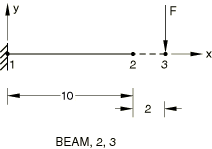

The following equivalent cases are considered: 

1. A BEAM-type MPC is defined between nodes 2 and 3.
2. Nodes 2 and 3 are included in a rigid body tie-type node set.
3. Nodes 2 and 3 are connected by a beam element of type B31. This element is then included in a rigid body.

**Material: **

Linear elastic, Young's modulus = 3.0  106, Poisson's ratio = 0, density = 0.03.

**Boundary conditions: **

Node 1 is clamped.

**Loading: **

=1000 at node 3.

**Beam section data: **

B31, 1  1 rectangle. PIPE31, pipe of radius 1 and thickness 0.1.

### Results and discussion

To verify that the MPC is working correctly, the rotation at node 3 should be the same as the rotation at node 2; the vertical displacement at node 3 should be given by 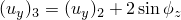. This solution is obtained. The results for Cases 2 and 3 match the results for Case 1.

### Input files

[mpc_beam.inp](../eif/mpc_beam.inp)

Input data for Case 1 for beam elements.

[mpc_beamrig1.inp](../eif/mpc_beamrig1.inp)

Input data for Case 2 for beam elements.

[mpc_beamrig2.inp](../eif/mpc_beamrig2.inp)

Input data for Case 3 for beam elements.

[mpc_beam_pipe.inp](../eif/mpc_beam_pipe.inp)

Input data for Case 1 for pipe elements.

[mpc_beamrig1_pipe.inp](../eif/mpc_beamrig1_pipe.inp)

Input data for Case 2 for pipe elements.

[mpc_beamrig2_pipe.inp](../eif/mpc_beamrig2_pipe.inp)

Input data for Case 3 for pipe elements.

### VIII. ELBOW MPC

### Elements tested

ELBOW31    ELBOW32    

### Problem description

The ELBOW MPC is tested in both static and dynamic analyses in Abaqus/Standard.

Four cases are tested with each element type in the static analyses (see [Figure 5.1.17--1](ch05s01abv333.md#vermpc-elbow)). 

**Figure 5.1.17–1** ELBOW MPC geometry.

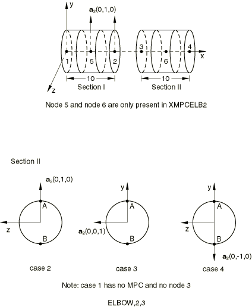

In addition to the differences shown in the figure, there are the following differences:- Case 1: Control model. No ELBOW MPC. Otherwise the same as Case 4.
- Case 2: 16 integration points around the pipe; 3 section points through the thickness; 5 Fourier ovalization modes.
- Case 3: 12 integration points around the pipe; 5 section points through the thickness; 4 Fourier ovalization modes.
- Case 4: 20 integration points around the pipe; 5 section points through the thickness; 6 Fourier ovalization modes.

The following data apply to the four cases in each file:

**Boundary conditions: **

Node 1 has degrees of freedom 1–6 fixed. All nodes have NODEFORM condition.

**Loading: **

- Step 1: =1 106 at node 4.
- Step 2: =2 106 at node 4.
- Step 3: The load that was applied in the first step is applied again, this time using NLGEOM for large-displacement analysis.
- Step 4: The load that was applied in the second step is applied again, this time using NLGEOM for large-displacement analysis.

Two straight pipes, each discretized with two elements, are considered in the dynamic analysis. In the first case the second cross-sectional directions of both elements are identical and the ELBOW MPC is not used. In the second case the second cross-sectional directions are different and the ELBOW MPC is used to ensure continuity of displacements. The analysis consists of two steps. In the static step the pipes are subjected to bending by applying a concentrated force. In the direct-integration implicit dynamic step the force is removed and the pipes vibrate freely.

### Results and discussion

For the static analyses Cases 2–4 give the same answer as Case 1;  at points A and B match. In the dynamic case the results for both pipes (with and without the ELBOW MPC) are identical.

### Input files

[xmpcelb1.inp](../eif/xmpcelb1.inp)

ELBOW31 elements; static analysis.

[xmpcelb1t.inp](../eif/xmpcelb1t.inp)

ELBOW31 elements; static analysis with transforms.

[xmpcelb2.inp](../eif/xmpcelb2.inp)

ELBOW32 elements; static analysis.

[xmpcelb2t.inp](../eif/xmpcelb2t.inp)

ELBOW32 elements; static analysis with transforms.

[xmpcelb3.inp](../eif/xmpcelb3.inp)

ELBOW31 elements; dynamic analysis.

### IX. LINK MPC

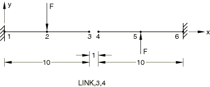

 The LINK MPC is tested in Abaqus/Standard and Abaqus/Explicit. Two cantilevered beams are subjected to transverse loading.

### Abaqus/Standard analyses

### Elements tested

B23    B33    

### Problem description

**Material: **

Linear elastic, Young's modulus = 3.0  106, Poisson's ratio = 0, density = 7800.0.

**Boundary conditions: **

Nodes 1 and 6 are clamped.

**Loading: **

- Step 1: The first four natural frequencies are extracted.
- Step 2: =250 at node 2, =250 at node 5.
- Step 3: The loads that were applied in the previous step are applied again, this time using NLGEOM for large-displacement analysis.

### Results and discussion

The LINK MPC provides a pinned, rigid link between two nodes. For this example this means that the translational degrees of freedom should have equal magnitudes but opposite sense and the rotational degree of freedom should be the same for the nodes that are joined by the MPC. This solution is obtained.

### Input files

[xmpclink.inp](../eif/xmpclink.inp)

Two-dimensional beam.

[xmpclinkt.inp](../eif/xmpclinkt.inp)

Two-dimensional beam with transforms.

[xmpclnk3.inp](../eif/xmpclnk3.inp)

Three-dimensional beam.

[xmpclnk3t.inp](../eif/xmpclnk3t.inp)

Three-dimensional beam with transforms.

### Abaqus/Explicit analyses

### Elements tested

B31    PIPE31    ROTARYI    T3D2    

### Problem description

The following equivalent cases are considered: 

1. A LINK-type MPC is defined between nodes 3 and 4.
2. Nodes 3 and 4 are included in a rigid body pin-type node set.
3. Nodes 3 and 4 are connected by a truss element of type T3D2. This element is then included in a rigid body.

**Material: **

Linear elastic, Young's modulus = 3.0  106, Poisson's ratio = 0, density = 0.03.

**Boundary conditions: **

Nodes 1 and 6 are clamped.

**Loading: **

=250 at node 2, =250 at node 5.

**Beam section data: **

B31, 1  1 rectangle. PIPE31, pipe of radius 1 and thickness 0.1.

### Results and discussion

The LINK MPC provides a pinned, rigid link between two nodes. For this example this means that the translational degrees of freedom should have equal magnitudes but opposite sense and the rotational degree of freedom should be the same for the nodes that are joined by the MPC. This solution is obtained. The results for Cases 2 and 3 match the results for Case 1.

### Input files

[mpc_link.inp](../eif/mpc_link.inp)

Input data for Case 1 for beam elements.

[mpc_linkrig1.inp](../eif/mpc_linkrig1.inp)

Input data for Case 2 for beam elements.

[mpc_linkrig2.inp](../eif/mpc_linkrig2.inp)

Input data for Case 3 for beam elements.

[mpc_link_pipe.inp](../eif/mpc_link_pipe.inp)

Input data for Case 1 for pipe elements.

[mpc_linkrig1_pipe.inp](../eif/mpc_linkrig1_pipe.inp)

Input data for Case 2 for pipe elements.

[mpc_linkrig2_pipe.inp](../eif/mpc_linkrig2_pipe.inp)

Input data for Case 3 for pipe elements.

### X. PIN MPC

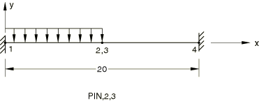

 The PIN MPC is tested in Abaqus/Standard and Abaqus/Explicit. A beam structure that is cantilevered at both ends has a pressure loading applied to one-half of the model.

### Abaqus/Standard analysis

### Element tested

B23

### Problem description

**Material: **

Linear elastic, Young's modulus = 3.0  106, Poisson's ratio = 0.

**Boundary conditions: **

Nodes 1 and 4 are clamped.

**Loading: **

- Step 1: The left half of the beam is loaded by a force per unit length, PY=1000.
- Step 2: The load that was applied in the first step is applied again, this time using NLGEOM for large-displacement analysis.

**Beam section data: **

B23, 1  1 rectangle.

### Results and discussion

The PIN MPC provides a pinned joint between two nodes by making the translational degrees of freedom equal. The displacements of nodes 2 and 3 are identical.

### Input files

[xmpcpinx.inp](../eif/xmpcpinx.inp)

PIN MPC.

[xmpcpinxt.inp](../eif/xmpcpinxt.inp)

PIN MPC with transforms.

### Abaqus/Explicit analyses

### Elements tested

B21    PIPE21    ROTARYI    

### Problem description

The following equivalent cases are considered: 

1. A PIN-type MPC is used to connect nodes 2 and 3.
2. Nodes 2 and 3 are included in a rigid body pin-type node set.

**Material: **

Linear elastic, Young's modulus = 3.0  106, Poisson's ratio = 0, density = 0.03.

**Boundary conditions: **

Nodes 1 and 4 are clamped.

**Loading: **

The left half of the beam is loaded by a force per unit length, PY=1000.

**Beam section data: **

B21, 1  1 rectangle.

 PIPE21, pipe of radius 1 and thickness 0.1.

### Results and discussion

The PIN MPC provides a pinned joint between two nodes by making the translational degrees of freedom equal. The displacements of nodes 2 and 3 are identical. The results for Case 2 match the results for Case 1.

### Input files

[mpc_pin.inp](../eif/mpc_pin.inp)

Input data for Case 1 for beam elements.

[mpc_pinrig.inp](../eif/mpc_pinrig.inp)

Input data for Case 2 for beam elements.

[mpc_pin_pipe.inp](../eif/mpc_pin_pipe.inp)

Input data for Case 1 for pipe elements.

[mpc_pinrig_pipe.inp](../eif/mpc_pinrig_pipe.inp)

Input data for Case 2 for pipe elements.

### XI. REVOLUTE MPC

### Element tested

B33H

### Problem description

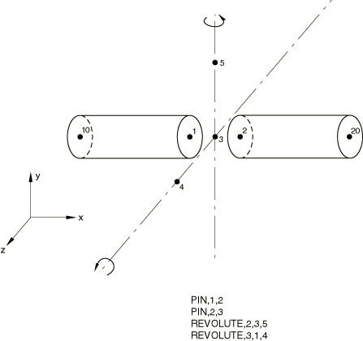

 The REVOLUTE MPC is tested in Abaqus/Standard.

**Boundary conditions: **

All degrees of freedom are restrained at node 10 throughout the analysis. Nodes 5 and 6 are initially constrained in degree of freedom 6.

**Loading: **

- Step 1: A concentrated follower force is applied at node 20 to pull the joint.
- Step 2: The joint is rotated by 45 about the 3--4 joint axis by prescribing degree of freedom 6 at node 4.
- Step 3: The joint is rotated by 45 about the current 3--5 axis by prescribing degree of freedom 6 at node 5.

### Results and discussion

The axial follower force of Step 1 couples with the rotations in subsequent steps to cause a lateral deflection of node 1 in spite of a very high material modulus.

### Input files

[xmpcrevo.inp](../eif/xmpcrevo.inp)

REVOLUTE and PIN MPCs.

[xmpcrevot.inp](../eif/xmpcrevot.inp)

REVOLUTE and PIN MPCs with transforms.

### XII. SLIDER MPC

The SLIDER MPC is tested in Abaqus/Standard for a truss and a beam structure and in Abaqus/Explicit for a truss structure.

### Abaqus/Standard truss analyses

### Element tested

T2D2

### Problem description

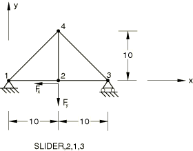

 A truss structure has a SLIDER MPC connecting node 2 to nodes 1 and 3.

**Material: **

Linear elastic, Young's modulus = 3.0  106, Poisson's ratio = 0.

**Boundary conditions: **

==0 at node 1, =0 at node 3.

**Load case 1: **

- Step 1: =500 at node 2, =1000 at node 2.
- Step 2: The loads that were applied in the first step are applied again, this time using NLGEOM for large-displacement analysis.

**Load case 2: **

=500 at node 2, =1000 at node 2. A static Riks step is adopted.

**Truss section data: **

T2D2, cross-sectional area = 1.

### Results and discussion

The SLIDER MPC keeps a node on a straight line between two nodes but allows it to slide along the line and the line to change length. This solution is obtained. The geometrically nonlinear analyses show that the initial stress terms are accounted for correctly.

### Input files

[xmpcslid.inp](../eif/xmpcslid.inp)

SLIDER MPC.

[xmpcslidt.inp](../eif/xmpcslidt.inp)

SLIDER MPC with transforms.

[xmpcsldr.inp](../eif/xmpcsldr.inp)

SLIDER MPC with RIKS.

[xmpcsldrt.inp](../eif/xmpcsldrt.inp)

SLIDER MPC with RIKS and transforms.

### Abaqus/Standard beam analysis

### Element tested

B31

### Problem description

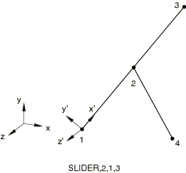

**Material: **

Linear elastic, Young's modulus = 3.0  106, Poisson's ratio = 0.

**Boundary conditions: **

====0 at node 4. All displacements and rotations are fixed at node 1. A transformation at node 1 places the local *x*-axis along the direction from node 1 to node 3.

**Loading: **

- Step 1: =10 at node 3. Node 1 is rotated about the transformed *z*-axis. (=0.3.)
- Step 2: The load and displacement that were applied in the first step are applied again, this time using NLGEOM for large-displacement analysis.

**Beam section data: **

B31, cross-sectional area = 1.

### Results and discussion

The SLIDER MPC keeps a node on a straight line between two nodes but allows it to slide along the line and the line to change length. This solution is obtained. The geometrically nonlinear analyses show that the initial stress terms are accounted for correctly.

### Input files

[xmpcsld3.inp](../eif/xmpcsld3.inp)

SLIDER MPC.

[xmpcsld3t.inp](../eif/xmpcsld3t.inp)

SLIDER MPC with transforms.

### Abaqus/Explicit analysis

### Element tested

T2D2

### Problem description

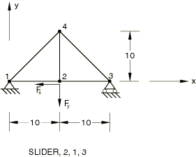

 A truss structure has a SLIDER MPC connecting node 2 to nodes 1 and 3.

**Material: **

Linear elastic, Young's modulus = 3.0  106, Poisson's ratio = 0, density = 0.03.

**Boundary conditions: **

==0 at node 1, =0 at node 3.

**Loading: **

=500 at node 2, =1000 at node 2.

**Truss section data: **

T2D2, cross-sectional area = 1.

### Results and discussion

The SLIDER MPC keeps a node on a straight line between two nodes but allows it to slide along the line and the line to change length. This solution is obtained.

### Input file

[mpc_slider.inp](../eif/mpc_slider.inp)

SLIDER MPC.

### XIII. UNIVERSAL MPC

### Element tested

B33H

### Problem description

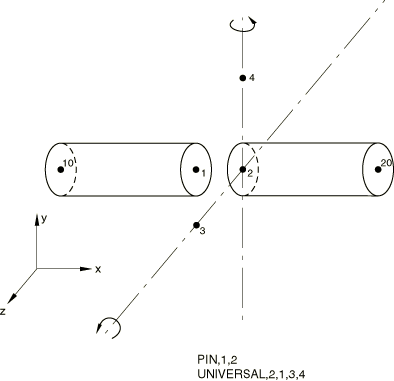

 The UNIVERSAL MPC is tested in Abaqus/Standard.

**Boundary conditions: **

All degrees of freedom are restrained at node 10 throughout the analysis. Nodes 3 and 4 are initially constrained in degree of freedom 6.

**Loading: **

- Step 1: A concentrated follower force is applied at node 20 to pull the joint.
- Step 2: The joint is rotated by 45 about the 1--3 joint axis by prescribing degree of freedom 6 at node 3.
- Step 3: The joint is rotated by 45 about the current 1--4 axis by prescribing degree of freedom 6 at node 4.

### Results and discussion

The axial follower force of Step 1 couples with the rotations in subsequent steps to cause lateral deflection of node 1 in spite of a very high material modulus.

### Input files

[xmpcuniv.inp](../eif/xmpcuniv.inp)

UNIVERSAL and PIN MPCs.

[xmpcunivt.inp](../eif/xmpcunivt.inp)

UNIVERSAL and PIN MPCs with transforms.

### XIV. V LOCAL MPC

### Element tested

B31H

### Problem description

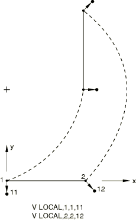

 The V LOCAL MPC is tested in Abaqus/Standard.

**Boundary conditions: **

==0 at node 1, ===0 at node 11, and ==0 at node 12 in Steps 1 and 2.

**Loading: **

- Step 1: Uniform load *P*=1.0 along the element.
- Step 2: The loads that were applied in the first step are applied again, this time using NLGEOM for large-displacement analysis.
- Step 3: Set =15.708 at node 11 to push the beam.

### Results and discussion

The constrained nodes move as predicted by the velocity constraint.

### Input files

[xmpcvloc.inp](../eif/xmpcvloc.inp)

V LOCAL MPC.

[xmpcvloct.inp](../eif/xmpcvloct.inp)

V LOCAL MPC with transforms.

### XV. SS LINEAR and SLIDER MPCs

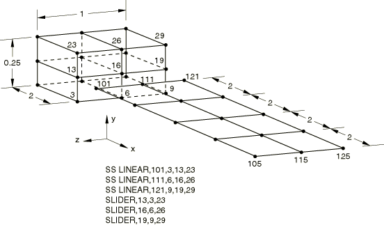

 The SS LINEAR and SLIDER MPCs are tested in Abaqus/Standard and Abaqus/Explicit. A cantilever beam consisting of solid and shell elements connected by SS LINEAR and SLIDER MPCs is subjected to a transverse tip loading.

### Initial Abaqus/Standard analysis

### Elements tested

C3D8    S4R    

### Problem description

**Loading: **

- Step 1: =15 at nodes 105 and 125, =30 at node 115.
- Step 2: The loads that were applied in the first step are applied again, this time using NLGEOM for large-displacement analysis.
- Step 3: The loads that were applied in the second step are removed.
- Step 4: The boundary conditions are changed, and a rotation of  around the *z*-axis is prescribed at *x*=0.

**Initial boundary conditions: **

===0 at *x*=0, ===0 at *z*=0 (except at nodes 19 and 121).

**Boundary conditions in Step 4: **

===0 and  prescribed at *x*=10.

### Results and discussion

The SLIDER MPC is used to keep a node on a straight line between two nodes, but it allows the node to slide along the line and the line to change length. This enforces the assumption that plane sections remain plane. The SS LINEAR MPC constrains a shell node to a line of solid element nodes. This ties the translation and rotation of the shell node to the displacement and rotation of the solid nodes. Continuity of displacements and rotations is achieved at the shell-solid boundary.

**Note:**The poor performance of the first-order brick element, C3D8, in bending is demonstrated by an excessively stiff response in Step 1 and Step 2.

### Input files

[xmpcssli.inp](../eif/xmpcssli.inp)

SS LINEAR and SLIDER MPCs.

[xmpcsslit.inp](../eif/xmpcsslit.inp)

SS LINEAR and SLIDER MPCs with transforms.

### Abaqus/Standard RIKS analysis

### Elements tested

C3D8    S4R    

### Problem description

**Boundary conditions: **

===0 at *x*=0, ===0 at *z*=0 (except at nodes 19 and 121).

**Loading: **

=15 at nodes 105 and 125, =30 at node 115. A static Riks step is adopted.

### Results and discussion

The SLIDER MPC is used to keep a node on a straight line between two nodes, but it allows the node to slide along the line and the line to change length. This enforces the assumption that plane sections remain plane. The SS LINEAR MPC constrains a shell node to a line of solid element nodes. This ties the translation and rotation of the shell node to the displacement and rotation of the solid nodes. Continuity of displacements and rotations is achieved at the shell-solid boundary.

### Input files

[xmpcsslr.inp](../eif/xmpcsslr.inp)

SS LINEAR and SLIDER MPCs with RIKS.

[xmpcsslrt.inp](../eif/xmpcsslrt.inp)

SS LINEAR and SLIDER MPCs with RIKS and transforms.

### Dynamic Abaqus/Standard analysis

### Elements tested

C3D8    S4R    

### Problem description

**Boundary conditions: **

The edge at *x*=10 is fixed.

**Loading: **

- Step 1: The first four natural frequencies are extracted.
- Step 2: =30 at all nodes along *x*=0. A large-displacement analysis is performed.
- Step 3: The load applied in Step 2 is removed. A dynamic analysis is performed.

### Results and discussion

The SLIDER MPC is used to keep a node on a straight line between two nodes, but it allows the node to slide along the line and the line to change length. This enforces the assumption that plane sections remain plane. The SS LINEAR MPC constrains a shell node to a line of solid element nodes. This ties the translation and rotation of the shell node to the displacement and rotation of the solid nodes. Continuity of displacements and rotations is achieved at the shell-solid boundary.

### Input files

[xmpcssld.inp](../eif/xmpcssld.inp)

SS LINEAR and SLIDER MPCs with [*DYNAMIC](../key/key-link.md#usb-kws-hdynamic).

[xmpcssldt.inp](../eif/xmpcssldt.inp)

SS LINEAR and SLIDER MPCs with [*DYNAMIC](../key/key-link.md#usb-kws-hdynamic) and transforms.

### Abaqus/Explicit analysis

### Elements tested

C3D8R    S4R    

### Problem description

**Material: **

Linear elastic, Young's modulus = 30.0  106, Poisson's ratio = 0.3, density = 0.3.

**Boundary conditions: **

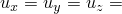 0 at  0, 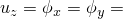 0 at  0.

**Loading: **

 15 at nodes 105 and 125, 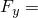 30 at node 115.

### Results and discussion

The SLIDER MPC is used to keep a node on a straight line between two nodes, but it allows the node to slide along the line and the line to change length. This enforces the assumption that plane sections remain plane. The SS LINEAR MPC constrains a shell node to a line of solid element nodes. This ties the translation and rotation of the shell node to the displacement and rotation of the solid nodes. Continuity of displacements and rotations is achieved at the shell-solid boundary.

### Input file

[mpc_sslinear.inp](../eif/mpc_sslinear.inp)

SS LINEAR and SLIDER MPCs.

### XVI. SS BILINEAR, SSF BILINEAR, and SLIDER MPCs

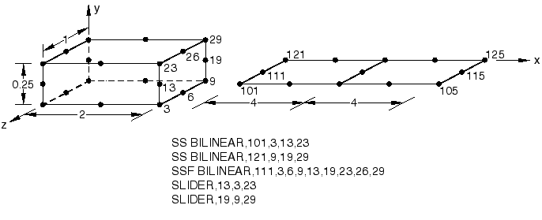

 The SS BILINEAR, SSF BILINEAR, and SLIDER MPCs are tested in Abaqus/Standard.

### Initial analysis

### Elements tested

C3D20    S8R    

### Problem description

**Loading: **

- Step 1: =15 at nodes 105 and 125, =30 at node 115.
- Step 2: The loads that were applied in the first step are applied again, this time using NLGEOM for large-displacement analysis.
- Step 3: The loads that were applied in the second step are removed.
- Step 4: The boundary conditions are changed, and a rotation of  around the *z*-axis is prescribed at *x*=0.

**Initial boundary conditions: **

===0 at *x*=0, ===0 at *z*=0 (except at nodes 19 and 121).

**Boundary conditions in Step 4: **

===0 and  prescribed at *x*=10.

### Results and discussion

Continuity of displacements and rotations is achieved at the shell-solid boundary.

### Input files

[xmpcssbi.inp](../eif/xmpcssbi.inp)

SS BILINEAR, SSF BILINEAR, and SLIDER MPCs.

[xmpcssbit.inp](../eif/xmpcssbit.inp)

SS BILINEAR, SSF BILINEAR, and SLIDER MPCs with transforms.

### RIKS analysis

### Elements tested

C3D20    S8R    

### Problem description

**Boundary conditions: **

===0 at *x*=0, ===0 at *z*=0 (except at nodes 19 and 121).

**Loading: **

=15 at nodes 105 and 125, =30 at node 115. A static Riks step is adopted.

### Results and discussion

Continuity of displacements and rotations is achieved at the shell-solid boundary.

### Input files

[xmpcssbr.inp](../eif/xmpcssbr.inp)

SS LINEAR, SSF BILINEAR, and SLIDER MPCs with RIKS.

[xmpcssbrt.inp](../eif/xmpcssbrt.inp)

SS LINEAR, SSF BILINEAR, and SLIDER MPCs with RIKS and transforms.

### Dynamic analysis

### Elements tested

C3D20    S8R    

### Problem description

**Boundary conditions: **

The edge at *x*=10 is fixed.

**Loading: **

- Step 1: The first four natural frequencies are extracted.
- Step 2: =30 at all nodes along *x*=0. A large-displacement analysis is performed.
- Step 3: The load applied in Step 2 is removed. A dynamic analysis is performed.

### Results and discussion

Continuity of displacements and rotations is achieved at the shell-solid boundary.

### Input file

[xmpcssbd.inp](../eif/xmpcssbd.inp)

SS LINEAR, SSF BILINEAR, and SLIDER MPCs with [*DYNAMIC](../key/key-link.md#usb-kws-hdynamic).

### XVII. TIE MPC

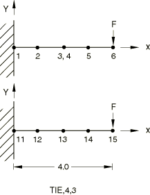

 The TIE MPC is tested in Abaqus/Standard and Abaqus/Explicit. A cantilevered beam is subjected to a transverse tip load.

### Initial Abaqus/Standard analysis

### Element tested

B22

### Problem description

**Material: **

Linear elastic, Young's modulus = 28.1  106, Poisson's ratio = 0.3, density = 1700.

**Boundary conditions: **

Nodes 1 and 11 are clamped.

**Loading: **

- Step 1: =300 at nodes 6 and 15. A linear perturbation analysis is performed.
- Step 2: The natural frequencies and mode shapes for the continuous cantilever beam are extracted.
- Step 3: The natural frequencies and modes shapes are extracted for the cantilever beam that uses MPC TIE.
- Step 4: The loads that were applied in the first step are applied again, this time using NLGEOM for large-displacement analysis.

### Results and discussion

MPC TIE makes all active degrees of freedom equal between two nodes (both translational and rotational degrees of freedom). The results of a cantilever beam that uses MPC TIE are the same as those of a continuous cantilever beam under the same loading.

### Input files

[xmpctiex.inp](../eif/xmpctiex.inp)

TIE MPC.

[xmpctiext.inp](../eif/xmpctiext.inp)

TIE MPC with transforms.

### Abaqus/Standard RIKS analysis

### Element tested

B22

### Problem description

A cantilever beam with MPC type TIE, subject to a slight imperfection corresponding to the first buckling mode.

**Material: **

Linear elastic, Young's modulus = 28.1  106, Poisson's ratio = 0.3, density = 1700.

**Boundary conditions: **

Node 1 is clamped.

**Loading: **

- Step 1: The first four buckling modes are extracted for a perturbation load =300 at node 6.
- Step 2: A RIKS analysis (with NLGEOM) is conducted until a maximum load of =600 at node 6.

### Results and discussion

MPC TIE makes all active degrees of freedom equal between two nodes (both translational and rotational degrees of freedom). The results of a cantilever beam that uses MPC TIE are the same as those of a continuous cantilever beam under the same loading.

### Input files

[xmpctier.inp](../eif/xmpctier.inp)

TIE MPC with RIKS.

[xmpctiert.inp](../eif/xmpctiert.inp)

TIE MPC with RIKS and transforms.

### Abaqus/Explicit analysis

### Elements tested

B21    PIPE21    

### Problem description

The following equivalent cases are considered: 

1. A TIE-type MPC is defined between nodes 3 and 4.
2. Nodes 3 and 4 are included in a rigid body tie-type node set.

The results from the above two cases are compared to the solution of a continuous cantilever beam under the same transverse tip loading.

**Material: **

Linear elastic, Young's modulus = 28.1  106, Poisson's ratio = 0.3, density = 0.3.

**Boundary conditions: **

Nodes 1 and 11 are clamped.

**Loading: **

 300 at nodes 6 and 15.

**Beam section data: **

B21, 0.5  0.5 rectangle.

PIPE21, pipe with radius 0.5 and thickness 0.05.

### Results and discussion

MPC TIE makes all active degrees of freedom equal between two nodes (both translational and rotational degrees of freedom). The results of a cantilever beam that uses MPC TIE are the same as those of a continuous cantilever beam under the same loading. The results from Case 2 match the results from Case 1.

### Input files

[mpc_tie.inp](../eif/mpc_tie.inp)

Input data for Case 1 for beam elements.

[mpc_tierig.inp](../eif/mpc_tierig.inp)

Input data for Case 2 for beam elements.

[mpc_tie_pipe.inp](../eif/mpc_tie_pipe.inp)

Input data for Case 1 for pipe elements.

[mpc_tierig_pipe.inp](../eif/mpc_tierig_pipe.inp)

Input data for Case 2 for pipe elements.

### XVIII. CYCLSYM MPC

### Elements tested

CPE4    CPE4T    CPEG4T    

### Problem description

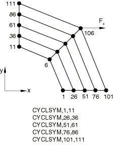

 The CYCLSYM MPC is tested in Abaqus/Standard. A disk is subjected to cyclic symmetric force loading in the first analysis; in the second analysis the disk is subjected to both cyclic symmetric force loading and cyclic temperature boundary conditions. The problem is modeled using a quarter of the disk with the appropriate CYCLSYM MPC.

**Boundary conditions: **

Nodes 6 and 11 are clamped. The reference node for the CPEG4T model is also clamped. Node 1 also has all displacement and rotation degrees of freedom restrained because of the CYCLSYM MPC. Nodes 6, 11, and 1 have their temperatures set to zero for the second analysis.

**Loading: **

=100 at node 106. For the second analysis the temperature of nodes 101 and 111 is set to 100, and the temperature of node 106 is set to 200.

The first analysis uses the direct-integration implicit dynamic procedure; the second analysis uses the fully coupled thermal-stress steady-state procedure.

### Results and discussion

The results obtained from the quarter disk model that uses MPC type CYCLSYM are the same as the results obtained from an analysis of a complete disk under cyclic symmetric loading and subjected to cyclic temperature boundary conditions.

### Input files

[xmpccycd.inp](../eif/xmpccycd.inp)

CYCLSYM MPC with [*DYNAMIC](../key/key-link.md#usb-kws-hdynamic).

[xmpccyct.inp](../eif/xmpccyct.inp)

CYCLSYM MPC with [*COUPLED TEMPERATURE-DISPLACEMENT](../key/key-link.md#usb-kws-hcouptempdisp).

[xmpccyct_cpeg4t.inp](../eif/xmpccyct_cpeg4t.inp)

CYCLSYM MPC with [*COUPLED TEMPERATURE-DISPLACEMENT](../key/key-link.md#usb-kws-hcouptempdisp).

### XIX. Internal MPC types BEAMRIGID and BEAMTIE with transforms

These files test the use of the internally generated MPCs (MPC types BEAMRIGID and BEAMTIE) with transforms in Abaqus/Standard. Transformations are applied to the reference node as well as to the nodes of the rigid element (or rigid beam). The boundary conditions and loadings, mentioned below, are given in the local transformed system.

### Rigid elements

### Elements tested

R2D2    R3D4    

### Problem description

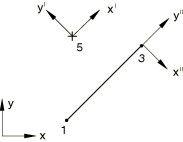

**Boundary conditions: **

=0 and =1.5 at node 5.

**Loading: **

- Step 1: =10.0 at node 3.
- Step 2: Same as above, but a large-displacement analysis is performed.

### Results and discussion

The results agree with the theoretically expected results. The results of the geometrically nonlinear analyses show that the initial stress terms are accounted for correctly.

### Input files

[xmpcrgd2.inp](../eif/xmpcrgd2.inp)

R2D2 elements.

[xmpcrgd3.inp](../eif/xmpcrgd3.inp)

R3D4 elements.

### Rigid beams

### Elements tested

RB2D2    RB3D2    

### Problem description

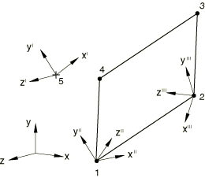

**Boundary conditions: **

=1.5 at node 5. All other displacements are fixed.

**Loading: **

- Step 1: 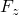=10.0 at node 1.
- Step 2: Same as above, but a large-displacement analysis is performed.

### Results and discussion

The results agree with the theoretically expected results. The results of the geometrically nonlinear analyses show that the initial stress terms are accounted for correctly.

### Input files

[xmpcrgb2.inp](../eif/xmpcrgb2.inp)

RB2D2 elements.

[xmpcrgb3.inp](../eif/xmpcrgb3.inp)

RB3D2 elements.

### XX. MPC sorting

### Element tested

S4R

### Problem description

MPC sorting is tested in Abaqus/Standard.The model is a cantilever structure composed of 20 shell elements tied together using MPC type TIE.

**Boundary conditions: **

One end of the structure is clamped.

**Loading: **

A concentrated load of =1.0 is applied at the other end of the structure.

### Results and discussion

Abaqus successfully sorts the MPC definitions such that no input errors occur.

### Input file

[xmpcsort.inp](../eif/xmpcsort.inp)

Test of internal sorting of MPC type TIE.

