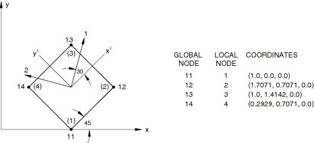
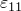
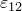
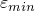

# 5.1.18 User-defined coordinate system


**Product: **Abaqus/Standard  

### Element tested

S4R

### Feature tested

The definition of local material axes by a user-defined coordinate system.

### Problem description

In each of the tests a user-defined coordinate system is used to define the material point orientation as shown in [Figure 5.1.18--1](ch05s01abv334.md#verorient-model).

**Figure 5.1.18–1** Material point orientation.



**Material: **

Linear elastic, Young's modulus = 3.0  106, Poisson's ratio = 0.3.

**Boundary conditions: **

 =  =  = 0 at nodes 11 and 14,  = 0 for all the nodes.

**Loading: **

Concentrated forces of 1000 are applied to nodes 12 and 13 at an angle of 45 to the *x*-axis.

### Remarks

Local coordinate directions are used in the input file [xorisrdc.inp](../eif/xorisrdc.inp).

### Results and discussion

All tests should yield the following results:

| Stress Components | Strain Components |
| --- | --- |
|  = 1499.9 |  = 4.4997E5 |
|  = 499.97 |  = 1.6665E6 |
|  = 865.97 |  = 7.5050E5 |

| Principal Stresses | Principal Strains |
| --- | --- |
|  = 2000.0 |  = 6.6662E5 |
|  = 0.0 |  = 1.9998E5 |

### Input files

[xorisrdc.inp](../eif/xorisrdc.inp)

```
[*ORIENTATION](../key/key-link.md#usb-kws-morientation), NAME=LOCAL,
SYSTEM=RECTANGULAR,
DEFINITION=COORDINATES
2., 1.7071, 0., 1.,
1.4142, 0., 1., 0.7071, 0.
3, 30.
```

[xoriscdc.inp](../eif/xoriscdc.inp)

```
[*ORIENTATION](../key/key-link.md#usb-kws-morientation), NAME=LOCAL,
SYSTEM=CYLINDRICAL,
DEFINITION=COORDINATES
3.0, 0., 0., 3.0, 1.0, 0.0
2, -15.
```

[xorissdc.inp](../eif/xorissdc.inp)

```
[*ORIENTATION](../key/key-link.md#usb-kws-morientation), NAME=LOCAL,
SYSTEM=SPHERICAL,
DEFINITION=COORDINATES
3., .7071068, 0., 3., 1., 0.
2, -15.
```

[xoriszdc.inp](../eif/xoriszdc.inp)

```
[*ORIENTATION](../key/key-link.md#usb-kws-morientation), NAME=LOCAL,
SYSTEM=ZRECTANGULAR,
DEFINITION=COORDINATES
0., 0., 1., 1., 1., 0.
3, 30.
```

[xorisrdn.inp](../eif/xorisrdn.inp)

```
[*ORIENTATION](../key/key-link.md#usb-kws-morientation), NAME=LOCAL,
SYSTEM=RECTANGULAR,
DEFINITION=NODES
12, 13, 11
3, 30.
```

[xoriscdn.inp](../eif/xoriscdn.inp)

```
[*ORIENTATION](../key/key-link.md#usb-kws-morientation), NAME=LOCAL,
SYSTEM=CYLINDRICAL,
DEFINITION=NODES
11, 12
2, 30.
```

[xorissdn.inp](../eif/xorissdn.inp)

```
[*ORIENTATION](../key/key-link.md#usb-kws-morientation), NAME=LOCAL,
SYSTEM=SPHERICAL,
DEFINITION=NODES
12, 13
2, -15.
```

[xoriszdn.inp](../eif/xoriszdn.inp)

```
[*ORIENTATION](../key/key-link.md#usb-kws-morientation), NAME=LOCAL,
SYSTEM=ZRECTANGULAR,
DEFINITION=NODES
11, 12
2, 75.
```

[xorisrdo.inp](../eif/xorisrdo.inp)

```
[*ORIENTATION](../key/key-link.md#usb-kws-morientation), NAME=LOCAL,
SYSTEM=RECTANGULAR,
DEFINITION=OFFSET
2, 3
3, 30.
```

[xoriscdo.inp](../eif/xoriscdo.inp)

```
[*ORIENTATION](../key/key-link.md#usb-kws-morientation), NAME=LOCAL,
SYSTEM=CYLINDRICAL,
DEFINITION=OFFSET
1, 2
2, 30.
```

[xorissdo.inp](../eif/xorissdo.inp)

```
[*ORIENTATION](../key/key-link.md#usb-kws-morientation), NAME=LOCAL,
SYSTEM=SPHERICAL,
DEFINITION=OFFSET
1, 2
3, 75.
```

[xoriszdo.inp](../eif/xoriszdo.inp)

```
[*ORIENTATION](../key/key-link.md#usb-kws-morientation), NAME=LOCAL,
SYSTEM=ZRECTANGULAR,
DEFINITION=OFFSET
2, 3
3, 30.
```


