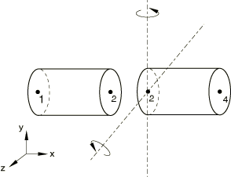

# 5.1.21 Release rotational degrees of freedom

**Product: **Abaqus/Standard  

### Elements tested

B21    B22    B23    B31    B32    B33    

### Features tested

Various types of hinged connections are tested by releasing one or more rotational degrees of freedom. Equivalent models using multi-point constraints are included for comparison.

### Problem description

Two beam elements are aligned with the *x*-axis, joined at the center, and clamped at nodes 1 and 4. Rotational degrees of freedom are released at the center, node 2. Equivalent MPC definitions are used to connect two separate nodes at the center, nodes 2 and 3.

**Loading: **

Step 1: The left half of the model is loaded by forces per unit length, PY = 1000 and PZ = 1000.

The right half of the model is loaded by forces per unit length, PY = 1000 and PZ = 1000.

Step 2: The loads that were applied in the first step are applied again, this time using NLGEOM for large-displacement analysis.

### Results and discussion

The results are the same for the equivalent multi-point constraint models.

### Input files

[xreleasepinx2.inp](../eif/xreleasepinx2.inp)

Static steps, release all the rotational degrees of freedom for a beam in a plane.

[xmpcpinx2.inp](../eif/xmpcpinx2.inp)

Static steps, equivalent MPC type PIN for a beam in a plane.

[xreleasepinx3.inp](../eif/xreleasepinx3.inp)

Static steps, release all the rotational degrees of freedom for a beam in space.

[xmpcpinx3.inp](../eif/xmpcpinx3.inp)

Static steps, equivalent MPC type PIN for a beam in space.

[xreleaserevo2.inp](../eif/xreleaserevo2.inp)

Static steps, release one rotational degree of freedom for a beam in space.

[xmpcrevo2.inp](../eif/xmpcrevo2.inp)

Static steps, equivalent MPC type REVOLUTE plus MPC type PIN for a beam in space.

[xreleaseuniv2.inp](../eif/xreleaseuniv2.inp)

Static steps, release two rotational degrees of freedom for a beam in space. 

[xmpcuniv2.inp](../eif/xmpcuniv2.inp)

Static steps, equivalent MPC type UNIVERSAL plus MPC type PIN for a beam in space.

[xreleaseuniv3.inp](../eif/xreleaseuniv3.inp)

Frequency, steady-state dynamics, modal dynamic, and response spectrum steps; release two rotational degrees of freedom for a beam in space.

[xmpcuniv3.inp](../eif/xmpcuniv3.inp)

Frequency, steady-state dynamics, modal dynamic, and response spectrum steps; equivalent MPC type UNIVERSAL plus MPC type PIN for a beam in space.

