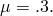

# 5.1.22 Shell-to-solid coupling constraints

**Products: **Abaqus/Standard  Abaqus/Explicit  

### Features tested

This section provides basic verification tests for shell-to-solid coupling constraints.

### I. Static tests with shell-to-solid coupling constraints

### Elements tested

S3R    S4R    S8R    S9R5    STRI3    STRI65    

SC8R    

C3D4    C3D8    C3D8R    C3D10    C3D10I    C3D10M    

C3D20R    C3D27R    

### Problem description

A cantilevered beam consisting of shell and continuum elements connected by shell-to-solid coupling constraints is subjected to various load conditions at the tip. The problem is analyzed with various combinations of shell and solid elements.

In addition, two input files are provided to illustrate how the shell-to-solid coupling constraints can be used to connect shell elements to continuum shell elements. In this case the continuum shell represents the solid interface.

**Loading: **

- Step 1: A load of =60 is applied at the tip of the beam in a linear perturbation analysis.
- Step 2: A load of =60 is applied at the tip of the beam in a linear perturbation analysis.
- Step 3: A load of =--60 is applied at the tip of the beam in a large-displacement analysis.
- Step 4: A load of =60 is applied at the tip of the beam in a large-displacement analysis.
- Step 5: The loads that were applied in the fourth step are removed.
- Step 6: The boundary conditions are changed, and a rotation of  around the *z*-axis is prescribed at tip of the beam.

For Abaqus/Explicit tests, the linear perturbation steps are omitted and the loading is as follows:
- Step 1: A load of =--60 is applied at the tip of the beam in a large-displacement analysis.
- Step 2: A load of =60 is applied at the tip of the beam in a large-displacement analysis.
- Step 3: The loads that were applied in the first two steps are removed.
- Step 4: The boundary conditions are changed, and a rotation of  around the *z*-axis is prescribed at the tip of the beam.

### Results and discussion

The results for the general cases indicate that the shell edges and solid elements are coupled appropriately.

### Input files

##### **Abaqus/Standard input files**

[xshell2solid_s3r_c3d4_std.inp](../eif/xshell2solid_s3r_c3d4_std.inp)

Shell-to-solid coupling tested between S3R shell elements and C3D4 continuum elements in a static analysis.

[xshell2solid_s3r_c3d8_std.inp](../eif/xshell2solid_s3r_c3d8_std.inp)

Shell-to-solid coupling tested between S3R shell elements and C3D8 continuum elements in a static analysis.

[xshell2solid_s3r_c3d10_std.inp](../eif/xshell2solid_s3r_c3d10_std.inp)

Shell-to-solid coupling tested between S3R shell elements and C3D10 continuum elements in a static analysis.

[xshell2solid_s3r_c3d10i_std.inp](../eif/xshell2solid_s3r_c3d10i_std.inp)

Shell-to-solid coupling tested between S3R shell elements and C3D10I continuum elements in a static analysis.

[xshell2solid_s3r_c3d10m_std.inp](../eif/xshell2solid_s3r_c3d10m_std.inp)

Shell-to-solid coupling tested between S3R shell elements and C3D10M continuum elements in a static analysis.

[xshell2solid_s3r_c3d20r_std.inp](../eif/xshell2solid_s3r_c3d20r_std.inp)

Shell-to-solid coupling tested between S3R shell elements and C3D20R continuum elements in a static analysis.

[xshell2solid_s3r_c3d27r_std.inp](../eif/xshell2solid_s3r_c3d27r_std.inp)

Shell-to-solid coupling tested between S3R shell elements and C3D27R continuum elements in a static analysis.

[xshell2solid_s4r_c3d4_std.inp](../eif/xshell2solid_s4r_c3d4_std.inp)

Shell-to-solid coupling tested between S4R shell elements and C3D4 continuum elements in a static analysis.

[xshell2solid_s4r_c3d8_std.inp](../eif/xshell2solid_s4r_c3d8_std.inp)

Shell-to-solid coupling tested between S4R shell elements and C3D8 continuum elements in a static analysis.

[xshell2solid_s4r_c3d8_nb_std.inp](../eif/xshell2solid_s4r_c3d8_nb_std.inp)

Shell-to-solid coupling tested between S4R shell elements and C3D8 continuum elements in a static analysis with a node-based surface defined on the continuum elements.

[xshell2solid_s4r_c3d10_std.inp](../eif/xshell2solid_s4r_c3d10_std.inp)

Shell-to-solid coupling tested between S4R shell elements and C3D10 continuum elements in a static analysis.

[xshell2solid_s4r_c3d10i_std.inp](../eif/xshell2solid_s4r_c3d10i_std.inp)

Shell-to-solid coupling tested between S4R shell elements and C3D10I continuum elements in a static analysis.

[xshell2solid_s4r_c3d10m_std.inp](../eif/xshell2solid_s4r_c3d10m_std.inp)

Shell-to-solid coupling tested between S4R shell elements and C3D10M continuum elements in a static analysis.

[xshell2solid_s4r_c3d20r_std.inp](../eif/xshell2solid_s4r_c3d20r_std.inp)

Shell-to-solid coupling tested between S4R shell elements and C3D20R continuum elements in a static analysis.

[xshell2solid_s4r_c3d20r_nb_std.inp](../eif/xshell2solid_s4r_c3d20r_nb_std.inp)

Shell-to-solid coupling tested between S4R shell elements and C3D20R continuum elements in a static analysis with a node-based surface defined on the continuum elements.

[xshell2solid_s4r_c3d27r_std.inp](../eif/xshell2solid_s4r_c3d27r_std.inp)

Shell-to-solid coupling tested between S4R shell elements and C3D27R continuum elements in a static analysis.

[xshell2solid_s4r_sc8r_std.inp](../eif/xshell2solid_s4r_sc8r_std.inp)

Shell-to-solid coupling tested between S4R shell elements and SC8R continuum shell elements in a static analysis.

[xshell2solid_s8r_c3d4_std.inp](../eif/xshell2solid_s8r_c3d4_std.inp)

Shell-to-solid coupling tested between S8R shell elements and C3D4 continuum elements in a static analysis.

[xshell2solid_s8r_c3d8_std.inp](../eif/xshell2solid_s8r_c3d8_std.inp)

Shell-to-solid coupling tested between S8R shell elements and C3D8 continuum elements in a static analysis.

[xshell2solid_s8r_c3d8_nb_std.inp](../eif/xshell2solid_s8r_c3d8_nb_std.inp)

Shell-to-solid coupling tested between S8R shell elements and C3D8 continuum elements in a static analysis with a node-based surface defined on the continuum elements.

[xshell2solid_s8r_c3d8_off_std.inp](../eif/xshell2solid_s8r_c3d8_off_std.inp)

Shell-to-solid coupling tested between S8R shell elements and C3D8 continuum elements in a static analysis with the OFFSET parameter used on the [*SHELL SECTION](../key/key-link.md#usb-kws-mshellsection) option.

[xshell2solid_s8r_c3d10_std.inp](../eif/xshell2solid_s8r_c3d10_std.inp)

Shell-to-solid coupling tested between S8R shell elements and C3D10 continuum elements in a static analysis.

[xshell2solid_s8r_c3d10i_std.inp](../eif/xshell2solid_s8r_c3d10i_std.inp)

Shell-to-solid coupling tested between S8R shell elements and C3D10I continuum elements in a static analysis.

[xshell2solid_s8r_c3d10m_std.inp](../eif/xshell2solid_s8r_c3d10m_std.inp)

Shell-to-solid coupling tested between S8R shell elements and C3D10M continuum elements in a static analysis.

[xshell2solid_s8r_c3d20r_std.inp](../eif/xshell2solid_s8r_c3d20r_std.inp)

Shell-to-solid coupling tested between S8R shell elements and C3D20R continuum elements in a static analysis.

[xshell2solid_s8r_c3d20r_nb_std.inp](../eif/xshell2solid_s8r_c3d20r_nb_std.inp)

Shell-to-solid coupling tested between S8R shell elements and C3D20R continuum elements in a static analysis with a node-based surface defined on the continuum elements.

[xshell2solid_s8r_c3d27r_std.inp](../eif/xshell2solid_s8r_c3d27r_std.inp)

Shell-to-solid coupling tested between S8R shell elements and C3D27R continuum elements in a static analysis.

[xshell2solid_s9r5_c3d8_std.inp](../eif/xshell2solid_s9r5_c3d8_std.inp)

Shell-to-solid coupling tested between S9R5 shell elements and C3D8 continuum elements in a static analysis.

[xshell2solid_stri3_c3d8_std.inp](../eif/xshell2solid_stri3_c3d8_std.inp)

Shell-to-solid coupling tested between STRI3 shell elements and C3D8 continuum elements in a static analysis.

[xshell2solid_stri65_c3d20r_std.inp](../eif/xshell2solid_stri65_c3d20r_std.inp)

Shell-to-solid coupling tested between STRI65 shell elements and C3D20R continuum elements in a static analysis.

##### **Abaqus/Explicit input files**

[xshell2solid_s3r_c3d4_xpl.inp](../eif/xshell2solid_s3r_c3d4_xpl.inp)

Shell-to-solid coupling tested between S3R shell elements and C3D4 continuum elements in a static analysis.

[xshell2solid_s3r_c3d8r_xpl.inp](../eif/xshell2solid_s3r_c3d8r_xpl.inp)

Shell-to-solid coupling tested between S3R shell elements and C3D8R continuum elements in a static analysis.

[xshell2solid_s3r_c3d10m_xpl.inp](../eif/xshell2solid_s3r_c3d10m_xpl.inp)

Shell-to-solid coupling tested between S3R shell elements and C3D10M continuum elements in a static analysis.

[xshell2solid_s4r_c3d4_xpl.inp](../eif/xshell2solid_s4r_c3d4_xpl.inp)

Shell-to-solid coupling tested between S4R shell elements and C3D4 continuum elements in a static analysis.

[xshell2solid_s4r_c3d8r_xpl.inp](../eif/xshell2solid_s4r_c3d8r_xpl.inp)

Shell-to-solid coupling tested between S4R shell elements and C3D8R continuum elements in a static analysis.

[xshell2solid_s4r_c3d10m_xpl.inp](../eif/xshell2solid_s4r_c3d10m_xpl.inp)

Shell-to-solid coupling tested between S4R shell elements and C3D10M continuum elements in a static analysis.

[xshell2solid_s4r_sc8r_xpl.inp](../eif/xshell2solid_s4r_sc8r_xpl.inp)

Shell-to-solid coupling tested between S4R shell elements and SC8R continuum shell elements in a static analysis.

### II. Dynamic tests with shell-to-solid coupling constraints

### Elements tested

S4R    S8R    

C3D4    C3D8    C3D8R    C3D10    C3D10I    C3D10M    

C3D20R    C3D27R    

### Problem description

A cantilevered beam consisting of shell and continuum elements connected by shell-to-solid coupling constraints is subjected to various load conditions at the tip. The problem is analyzed with various combinations of shell and solid elements.

**Loading: **

- Step 1: A frequency analysis is performed on the beam.
- Step 2: The beam is bent in a large-displacement analysis.
- Step 3: The beam is released, and a nonlinear dynamic springback analysis is performed.

For Abaqus/Explicit tests, the frequency analysis is omitted and the loading is as follows:
- Step 1: The beam is bent in a large-displacement analysis.
- Step 2: The beam is released, and a nonlinear dynamic springback analysis is performed.

### Results and discussion

The results for the general cases indicate that the shell edges and solid elements are coupled appropriately.

### Input files

##### **Abaqus/Standard input files**

[xshell2solid_dyn_s4r_c3d4_std.inp](../eif/xshell2solid_dyn_s4r_c3d4_std.inp)

Shell-to-solid coupling tested between S4R shell elements and C3D4 continuum elements in a dynamic analysis.

[xshell2solid_dyn_s4r_c3d8_std.inp](../eif/xshell2solid_dyn_s4r_c3d8_std.inp)

Shell-to-solid coupling tested between S4R shell elements and C3D8 continuum elements in a dynamic analysis.

[xshell2solid_dyn_s4r_c3d10_std.inp](../eif/xshell2solid_dyn_s4r_c3d10_std.inp)

Shell-to-solid coupling tested between S4R shell elements and C3D10 continuum elements in a dynamic analysis.

[xshell2solid_dyn_s4r_c3d10i_std.inp](../eif/xshell2solid_dyn_s4r_c3d10i_std.inp)

Shell-to-solid coupling tested between S4R shell elements and C3D10I continuum elements in a dynamic analysis.

[xshell2solid_dyn_s4r_c3d10m_std.inp](../eif/xshell2solid_dyn_s4r_c3d10m_std.inp)

Shell-to-solid coupling tested between S4R shell elements and C3D10M continuum elements in a dynamic analysis.

[xshell2solid_dyn_s4r_c3d20_std.inp](../eif/xshell2solid_dyn_s4r_c3d20_std.inp)

Shell-to-solid coupling tested between S4R shell elements and C3D20 continuum elements in a dynamic analysis.

[xshell2solid_dyn_s4r_c3d27_std.inp](../eif/xshell2solid_dyn_s4r_c3d27_std.inp)

Shell-to-solid coupling tested between S4R shell elements and C3D27 continuum elements in a dynamic analysis.

[xshell2solid_dyn_s8r_c3d4_std.inp](../eif/xshell2solid_dyn_s8r_c3d4_std.inp)

Shell-to-solid coupling tested between S8R shell elements and C3D4 continuum elements in a dynamic analysis.

[xshell2solid_dyn_s8r_c3d8_std.inp](../eif/xshell2solid_dyn_s8r_c3d8_std.inp)

Shell-to-solid coupling tested between S8R shell elements and C3D8 continuum elements in a dynamic analysis.

[xshell2solid_dyn_s8r_c3d10_std.inp](../eif/xshell2solid_dyn_s8r_c3d10_std.inp)

Shell-to-solid coupling tested between S8R shell elements and C3D10 continuum elements in a dynamic analysis.

[xshell2solid_dyn_s8r_c3d10i_std.inp](../eif/xshell2solid_dyn_s8r_c3d10i_std.inp)

Shell-to-solid coupling tested between S8R shell elements and C3D10I continuum elements in a dynamic analysis.

[xshell2solid_dyn_s8r_c3d10m_std.inp](../eif/xshell2solid_dyn_s8r_c3d10m_std.inp)

Shell-to-solid coupling tested between s8r shell elements and C3D10M continuum elements in a dynamic analysis.

[xshell2solid_dyn_s8r_c3d20_std.inp](../eif/xshell2solid_dyn_s8r_c3d20_std.inp)

Shell-to-solid coupling tested between S8R shell elements and C3D20 continuum elements in a dynamic static analysis.

[xshell2solid_dyn_s8r_c3d27_std.inp](../eif/xshell2solid_dyn_s8r_c3d27_std.inp)

Shell-to-solid coupling tested between S8R shell elements and C3D27 continuum elements in a dynamic analysis.

##### **Abaqus/Explicit input files**

[xshell2solid_dyn_s4r_c3d4_xpl.inp](../eif/xshell2solid_dyn_s4r_c3d4_xpl.inp)

Shell-to-solid coupling tested between S4R shell elements and C3D4 continuum elements in a dynamic analysis.

[xshell2solid_dyn_s4r_c3d8r_xpl.inp](../eif/xshell2solid_dyn_s4r_c3d8r_xpl.inp)

Shell-to-solid coupling tested between S3R shell elements and C3D8R continuum elements in a dynamic analysis.

[xshell2solid_dyn_s4r_c3d10m_xpl.inp](../eif/xshell2solid_dyn_s4r_c3d10m_xpl.inp)

Shell-to-solid coupling tested between S4R shell elements and C3D10M continuum elements in a dynamic analysis.

### III. Free vibration of a cantilevered thin square with shell-to-solid coupling constraints

### Elements tested

S8R    STRI65    

C3D10    C3D10I    C3D20R    

### Problem description

A free vibration analysis is carried out for a cantilevered thin square plate (see [Figure 5.1.22--1](ch05s01abv338.md#vershell2solid-plate)). The outside section of the plate is modeled with shell elements, and the middle section of the plate is modeled with continuum elements coupled to the shell elements using shell-to-solid coupling constraints. The first six modes are extracted. The problem is analyzed with various combinations of shell and solid elements. These tests verify the ability of coupling constraints to model the shell-to-solid coupling accurately with an interface that includes corners. The free surface generation capability for both the shell and solid elements is also tested. 

**Figure 5.1.22–1** Cantilevered thin square plate.

### Results and discussion

The natural frequencies and mode shapes compare well to the reference NAFEMS solution. The NAFEMS solution is taken from the National Agency for Finite Element Methods and Standards (U.K.): Test FV16 from NAFEMS publication TNSB, Rev. 3, “The Standard NAFEMS Benchmarks,” October 1990.

1. Test1 --- S8R shell elements and C3D10 continuum elements (with and without free surface generation).
2. Test2 --- S8R shell elements and C3D10I continuum elements (with and without free surface generation).
3. Test3 --- S8R shell elements and C3D20 continuum elements (with and without free surface generation).
4. Test4 --- STRI65 shell elements and C3D10 continuum elements.
5. Test5 --- STRI65 shell elements and C3D10I continuum elements.
6. Test6 --- STRI65 shell elements and C3D20 continuum elements.

|  | Mode |
| --- | --- |
| 1 | 2 | 3 | 4 | 5 | 6 |
| NAFEMS | 0.421 | 1.029 | 2.582 | 3.306 | 3.753 | 6.555 |
| Test 1 | 0.434 | 1.024 | 2.861 | 3.642 | 3.873 | 6.745 |
| Test 2 | 0.434 | 1.024 | 2.861 | 3.642 | 3.873 | 6.745 |
| Test 3 | 0.429 | 1.023 | 2.750 | 3.484 | 3.809 | 6.641 |
| Test 4 | 0.434 | 1.024 | 2.875 | 3.628 | 3.866 | 6.727 |
| Test 5 | 0.434 | 1.024 | 2.875 | 3.628 | 3.866 | 6.727 |
| Test 6 | 0.430 | 1.024 | 2.782 | 3.496 | 3.811 | 6.648 |

### Input files

##### **Abaqus/Standard input files**

[xshell2solidvib_c3d10_s8r.inp](../eif/xshell2solidvib_c3d10_s8r.inp)

Free vibration analysis of a cantilevered thin square plate with S8R shell elements and C3D10 continuum elements coupled together using shell-to-solid coupling constraints.

[xshell2solidvib_c3d10_s8r_free.inp](../eif/xshell2solidvib_c3d10_s8r_free.inp)

Free vibration analysis of a cantilevered thin square plate with S8R shell elements and C3D10 continuum elements coupled together using shell-to-solid coupling constraints. Free surface generation is used for both solid and shell surfaces.

[xshell2solidvib_c3d10_stri65.inp](../eif/xshell2solidvib_c3d10_stri65.inp)

Free vibration analysis of a cantilevered thin square plate with STRI65 shell elements and C3D10 continuum elements coupled together using shell-to-solid coupling constraints.

[xshell2solidvib_c3d10i_s8r.inp](../eif/xshell2solidvib_c3d10i_s8r.inp)

Free vibration analysis of a cantilevered thin square plate with S8R shell elements and C3D10I continuum elements coupled together using shell-to-solid coupling constraints.

[xshell2solidvib_c3d10i_s8r_free.inp](../eif/xshell2solidvib_c3d10i_s8r_free.inp)

Free vibration analysis of a cantilevered thin square plate with S8R shell elements and C3D10I continuum elements coupled together using shell-to-solid coupling constraints. Free surface generation is used for both solid and shell surfaces.

[xshell2solidvib_c3d10i_stri65.inp](../eif/xshell2solidvib_c3d10i_stri65.inp)

Free vibration analysis of a cantilevered thin square plate with STRI65 shell elements and C3D10I continuum elements coupled together using shell-to-solid coupling constraints.

[xshell2solidvib_c3d20_s8r.inp](../eif/xshell2solidvib_c3d20_s8r.inp)

Free vibration analysis of a cantilevered thin square plate with S8R shell elements and C3D20 continuum elements coupled together using shell-to-solid coupling constraints.

[xshell2solidvib_c3d20_s8r_free.inp](../eif/xshell2solidvib_c3d20_s8r_free.inp)

Free vibration analysis of a cantilevered thin square plate with S8R shell elements and C3D20 continuum elements coupled together using shell-to-solid coupling constraints. Free surface generation is used for both solid and shell surfaces.

[xshell2solidvib_c3d20_stri65.inp](../eif/xshell2solidvib_c3d20_stri65.inp)

Free vibration analysis of a cantilevered thin square plate with STRI65 shell elements and C3D20 continuum elements coupled together using shell-to-solid coupling constraints.

### IV. Static test of a built-up beam with shell-to-solid coupling constraints

### Elements tested

S4R    S8R    

C3D8R    C3D10    C3D10M    

C3D20R    

### Problem description

The pure bending of a cantilevered beam is modeled with an alternating mesh of shell and continuum elements. Ten separate shell-to-solid interfaces are modeled in this example. The beam is 22 in long, 1 in wide, and 0.25 in thick. The material is linear elastic with a Young's modulus of 30  106 psi and Poisson's ratio of 0.3. The reference tip displacement solution from classical linear elasticity for a moment of 400 lb-in is 2.4 in.

**Loading: **

- Step 1: A moment of  = 400 lb-in is applied at the tip of the beam in a linear perturbation analysis.
- Step 2: A moment of  = 400 lb-in is applied at the tip of the beam using NLGEOM for large-displacement analysis.

### Results and discussion

The results for the general cases indicate that the shell edges and solid elements are coupled appropriately. The computed tip displacements for the linear perturbation and nonlinear analyses are 2.49 in and 2.48 in, respectively.

### Input file

[xshell2solid_builtupbeam.inp](../eif/xshell2solid_builtupbeam.inp)

Shell-to-solid coupling tested for built-up beam in a static analysis.

### V. Explicit dynamic test of a built-up beam with shell-to-solid coupling constraints

### Elements tested

S4R    

C3D8R    C3D4    C3D10M    

### Problem description

The bending of a cantilevered beam is modeled with an alternating mesh of shell and continuum elements. Ten separate shell-to-solid interfaces are modeled in this example. The beam is 22 in long, 1 in wide, and 0.25 in thick. The material is linear elastic with a Young's modulus of 30  106 psi and  The beam is subjected to a tip displacement of 2.4 in.

**Loading: **

- Step 1: A displacement of = 2.4 in is applied at the tip of the beam.

### Results and discussion

The results for the general cases indicate that the shell edges and solid elements are coupled appropriately.

### Input file

[xshell2solid_builtupbeam_xpl.inp](../eif/xshell2solid_builtupbeam_xpl.inp)

Shell-to-solid coupling tested for built-up beam in a explicit dynamic analysis.

