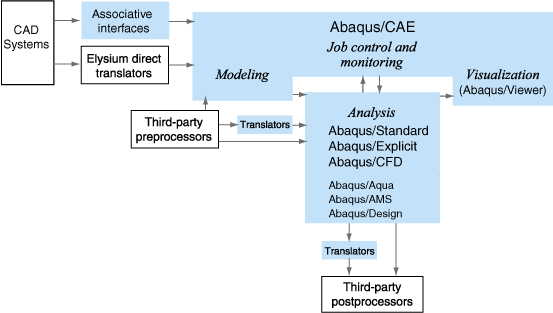
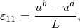

# 第一章 引言

## 目录

- [1.1 Abaqus产品概述](#11-abaqus产品概述)
- [1.2 Abaqus入门](#12-abaqus入门)
- [1.3 Abaqus文档](#13-abaqus文档)
- [1.4 获取帮助](#14-获取帮助)
- [1.5 技术支持](#15-技术支持)
- [1.6 有限元方法快速回顾](#16-有限元方法快速回顾)

---

## 1.1 Abaqus产品概述

Abaqus由三个主要分析产品组成——**Abaqus/Standard**、**Abaqus/Explicit**和**Abaqus/CFD**。多个附加分析选项可进一步扩展Abaqus/Standard和Abaqus/Explicit的功能。Abaqus/Aqua选项可与Abaqus/Standard和Abaqus/Explicit配合使用。Abaqus/Design和Abaqus/AMS选项可与Abaqus/Standard配合使用。Abaqus/Foundation是Abaqus/Standard的可选子集。Abaqus/CAE是完整的Abaqus环境，包括创建Abaqus模型、交互式提交和监控Abaqus作业以及评估结果的功能。Abaqus/Viewer是Abaqus/CAE的子集，仅包含后处理功能。Abaqus还提供翻译器，用于将几何从第三方CAD系统转换为Abaqus/CAE模型，将实体从第三方预处理程序转换为Abaqus分析输入，以及将Abaqus分析输出转换为第三方后处理程序的实体。这些产品之间的关系如图1-1所示。

**图1-1** Abaqus产品

### Abaqus/Standard

Abaqus/Standard是一个通用分析产品，可以解决涉及构件静态、动态、热、电和电磁响应的大量线性和非线性问题。本指南详细讨论了此产品。Abaqus/Standard在每个求解"增量"隐式求解方程组。相比之下，Abaqus/Explicit以小时间增量向前推进解，而无需在每个增量处求解耦合方程组（甚至不形成全局刚度矩阵）。

### Abaqus/Explicit

Abaqus/Explicit是一个专用分析产品，使用显式动态有限元公式。它适用于模拟短暂的瞬态动态事件，如冲击和爆炸问题，对于涉及不断变化的接触条件的高度非线性问题（如成型模拟）也非常高效。本指南详细讨论了Abaqus/Explicit。

### Abaqus/CFD

Abaqus/CFD是一个计算流体动力学分析产品。它可以解决一大类不可压缩流动问题，包括层流和湍流、热对流流动和变形网格问题。本指南讨论了Abaqus/CFD。

### Abaqus/CAE

Abaqus/CAE（完整Abaqus环境）是Abaqus的交互式图形环境。它允许通过生成或导入要分析的结构几何并将其分解为可网格化的区域来快速轻松地创建模型。可以为几何分配物理和材料特性，以及载荷和边界条件。Abaqus/CAE包含非常强大的网格化选项来网格化几何并验证生成的分析模型。模型完成后，Abaqus/CAE可以提交、监控和控制分析作业。然后可以使用可视化模块来解释结果。本指南讨论了Abaqus/CAE。

### Abaqus/Viewer

Abaqus/Viewer是Abaqus/CAE的子集，仅包含可视化模块的后处理功能。本指南中对可视化模块的讨论同样适用于Abaqus/Viewer。

### Abaqus/Aqua

Abaqus/Aqua是一组可添加到Abaqus/Standard和Abaqus/Explicit的可选功能。它用于模拟海洋结构（如石油平台）的浮式结构。一些可选功能包括波浪和风载荷效应以及浮力。本指南不讨论Abaqus/Aqua。

### Abaqus/Design

Abaqus/Design是一组可添加到Abaqus/Standard以执行设计灵敏度计算的可选功能。本指南不讨论Abaqus/Design。

### Abaqus/AMS

Abaqus/AMS是一个可添加到Abaqus/Standard的可选功能。它在自然频率提取期间使用自动多级子结构（AMS）特征求解器。本指南不讨论Abaqus/AMS。

### Abaqus/Foundation

Abaqus/Foundation提供更高效地访问Abaqus/Standard中的线性静态和动态分析功能。本指南不讨论Abaqus/Foundation。

### 几何翻译器

Abaqus提供以下翻译器，用于将几何从第三方CAD系统转换为Abaqus/CAE的零件和装配体：

- SIMULIA Associative Interface for Abaqus/CAE在CATIA V6和Abaqus/CAE之间创建链接。
- CATIA V5 Associative Interface在CATIA V5和Abaqus/CAE之间创建链接。
- SolidWorks Associative Interface在SolidWorks和Abaqus/CAE之间创建链接。
- Pro/ENGINEER Associative Interface在Pro/ENGINEER和Abaqus/CAE之间创建链接。
- Geometry Translator for CATIA V4允许您将CATIA V4格式零件和装配体的几何直接导入Abaqus/CAE。
- Geometry Translator for Parasolid允许您将Parasolid格式零件和装配体的几何直接导入Abaqus/CAE。

此外，Abaqus/CAE Associative Interface for NX在NX和Abaqus/CAE之间创建链接，可以从Elysium Inc.（www.elysiuminc.com）购买和下载。本指南不讨论几何翻译器。

### 翻译器实用程序

Abaqus提供以下翻译器：

- `abaqus fromansys`：将ANSYS输入文件翻译为Abaqus输入文件。
- `abaqus fromdyna`：将LS-DYNA关键字文件翻译为Abaqus输入文件。
- `abaqus fromnastran`：将Nastran bulk数据文件翻译为Abaqus输入文件。
- `abaqus frompamcrash`：将PAM-CRASH输入文件翻译为Abaqus输入文件。
- `abaqus fromradioss`：将RADIOSS输入文件翻译为Abaqus输入文件。
- `abaqus adams`：将Abaqus SIM数据库文件翻译为MSC.ADAMS格式。
- `abaqus moldflow`：将Moldflow分析信息翻译为Abaqus输入文件。
- `abaqus tonastran`：将Abaqus输入文件翻译为Nastran格式。
- `abaqus toOutput2`：将输出数据库翻译为Nastran Output2格式。
- `abaqus tozaero`：支持Abaqus和ZAERO之间的数据交换。

---

## 1.2 Abaqus入门

本指南是一本入门文本，旨在为新用户提供指导，帮助他们使用Abaqus/CAE创建实体、壳、梁和桁架模型，使用Abaqus/Standard和Abaqus/Explicit分析这些模型，并在可视化模块中查看结果。附录中包含了使用Abaqus/CFD的简要介绍。您不需要任何Abaqus的先前知识即可从本指南中受益，尽管建议您对有限元方法有一些初步了解。

### 1.2.1 如何使用本指南

本指南的不同部分针对不同类型的用户。

#### 新Abaqus用户的教程

如果您完全是Abaqus的新手，我们建议您按照本指南中的每个自定进度教程进行学习。本指南的每一章和附录都介绍了一个或多个与使用Abaqus/Standard、Abaqus/Explicit或Abaqus/CFD相关的主题。在整个指南中，术语"Abaqus"统指所有三个分析产品。

大多数章节包含对所考虑主题的简要讨论以及一个或两个教程示例。您应该仔细研究这些示例，因为它们包含大量使用Abaqus的实用建议。

本指南章节顺序：
- 第1章：对Abaqus和本指南的简要介绍
- 第2章"Abaqus基础"：以简单示例为中心，涵盖使用Abaqus的基础知识
- 第3章"有限元和刚体"：介绍Abaqus中可用的主要单元族
- 第4-6章：分别讨论连续体、壳和梁单元的使用
- 第7章"线性动力学"：讨论线性动态分析
- 第8章"非线性"：介绍非线性概念
- 第9章"非线性显式动力学"：讨论非线性动态分析
- 第10章"材料"：介绍材料非线性
- 第11章"多步分析"：介绍多步模拟的概念
- 第12章"接触"：讨论接触分析中的问题
- 第13章"准静态分析"：介绍使用Abaqus/Explicit进行准静态分析

#### 有经验的Abaqus用户的Abaqus/CAE教程

提供了四个附录来向熟悉Abaqus分析产品的用户介绍Abaqus/CAE界面。

### 1.2.2 本指南中使用的约定

#### 排版约定

- **等宽字体**：应按原样输入到Abaqus/CAE或计算机中。例如，`abaqus cae`
- **菜单选择**：以粗体表示，如**视图** → **图形选项**

#### 鼠标操作

| 操作 | 描述 |
|------|------|
| 点击 | 按下并快速释放鼠标按钮 |
| 拖动 | 按下并按住鼠标按钮1的同时移动鼠标 |
| 指向 | 将鼠标移动到所需项目上方 |
| 选择 | 指向一个项目，然后单击鼠标按钮1 |
| [Shift]+点击 | 按住Shift键并单击 |
| [Ctrl]+点击 | 按住Ctrl键并单击 |

---

## 1.3 Abaqus文档

Abaqus的文档非常广泛和完整。以下文档和出版物可通过SIMULIA获得。

#### Abaqus分析用户指南

本指南包含对元素、材料模型、过程、输入规范等的完整描述。这是Abaqus/Standard、Abaqus/Explicit和Abaqus/CFD的基本指南。

#### Abaqus/CAE用户指南

本指南包括如何使用Abaqus/CAE进行模型生成、分析和结果评估及可视化。

#### 使用Abaqus在线文档

本指南包含导航、查看和搜索Abaqus HTML和PDF文档的说明。

**其他文档包括：**

- Abaqus示例问题指南
- Abaqus基准测试指南
- Abaqus验证指南
- Abaqus理论指南
- Abaqus关键词参考指南
- Abaqus用户子程序参考指南
- Abaqus词汇表
- Abaqus发行说明
- Abaqus安装和许可指南

---

## 1.4 获取帮助

上下文相关帮助系统允许您快速轻松地找到相关信息。上下文相关帮助可用于主窗口中的每个项目和所有对话框。

**获取上下文相关帮助：**

1. 从主菜单栏中，选择**帮助** → **上下文帮助**。
2. 点击主窗口中除其框架之外的任何部分。
3. 滚动到帮助窗口底部，点击其中的链接。
4. 使用目录或搜索功能导航文档。

---

## 1.5 技术支持

SIMULIA通过支持网络提供技术支持和系统支持。区域联系信息可从www.3ds.com/simulia获得。

### 1.5.1 技术支持

SIMULIA技术支持工程师可以协助澄清Abaqus功能并帮助解决分析问题。

在联系技术支持时，请提供：
- 您正在使用的Abaqus版本
- 您运行Abaqus的计算机类型
- 任何问题的症状，包括确切的错误消息
- 已尝试的变通方法或测试

### 1.5.2 系统支持

系统支持工程师可以帮助解决与Abaqus安装和运行相关的问题，包括许可困难。

### 1.5.3 学术机构支持

根据学术许可协议的条款，我们不为学术机构的用户提供支持，除非该机构也购买了技术支持。

---

## 1.6 有限元方法快速回顾

本节回顾了有限元方法的基础知识。任何有限元模拟的第一步都是使用一组**有限元**对结构的实际几何进行**离散化**。每个有限元代表物理结构的一个离散部分。有限元通过共享的**节点**连接。节点和有限元的集合称为**网格**。网格中每单位长度、面积或体积的元素数量称为**网格密度**。在应力分析中，节点的位移是Abaqus计算的基本变量。

### 1.6.1 使用隐式方法获取节点位移

图1-4所示的简单桁架示例用于介绍本文档中使用的一些术语和约定。

**图1-4** 桁架问题

分析的目的是找到桁架自由端的位移、桁架中的应力以及约束端处的反作用力。

模型中每个节点的自由体图如图1-6所示。对于要处于静态平衡的模型，作用于每个节点上的净力必须为零。

**图1-6** 每个节点的自由体图

假设杆的长度变化很小，则单元1中的应变由下式给出：

其中，ua和ub分别是节点a和b的位移，L是单元的原始长度。

假设材料是弹性的，则杆中的应力由应变乘以杨氏模量E给出：

在隐式方法（如Abaqus/Standard中使用的方法）中，可以求解平衡方程组以获得节点位移。

相比之下，显式方法（如Abaqus/Explicit中使用的方法）不需要求解联立方程组或计算全局刚度矩阵。

### 1.6.2 应力波传播说明

本节说明在使用显式动力学方法时力如何通过模型传播。

**图1-7** 在自由端施加集中载荷P的杆的初始配置

在第一个时间增量中，节点1由于施加在其上的集中力而具有加速度。这种加速度导致应力波通过单元传播。此过程继续进行，直到分析达到所需的总时间。

**图1-8** 在自由端施加集中载荷P的杆在增量1结束时的配置

---

*上一页：[目录](./ch01.html) | 下一页：[第2章 Abaqus基础](./ch02.html)*
