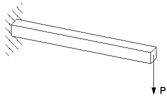
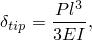
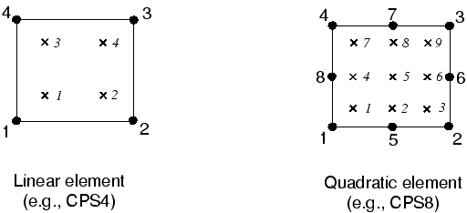
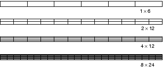
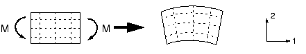
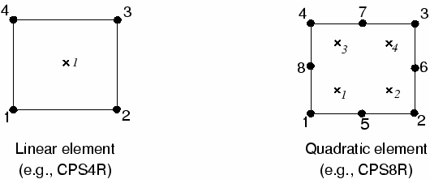
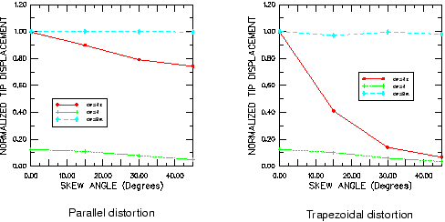
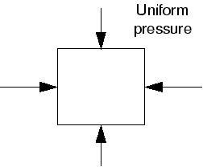
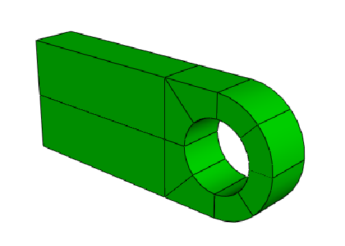
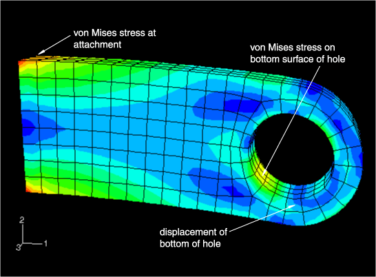

# 第4章 使用连续体单元

## 目录

- [4.1 单元公式与积分](#41-单元公式与积分)
- [4.2 选择连续体单元](#42-选择连续体单元)
- [4.3 示例：连接吊环](#43-示例连接吊环)
- [4.4 网格收敛性](#44-网格收敛性)
- [4.5 相关Abaqus示例](#45-相关abaqus示例)
- [4.6 推荐阅读](#46-推荐阅读)
- [4.7 小结](#47-小结)

---

## 4.1 单元公式与积分

通过考虑悬臂梁的静力分析（如图4-1所示），来演示单元阶次（线性或二次）、单元公式和积分阶次对结构仿真精度的影响。

**图4-1　承受自由端集中载荷P的悬臂梁**

这是一个用于评估给定有限元性能的经典测试。由于梁相对细长，我们通常使用梁单元对其进行建模。然而，此处使用它来帮助评估各种实体单元的有效性。

梁长150 mm，宽2.5 mm，深5 mm；一端固定，另一端承受5 N的端部载荷。材料的弹性模量E为70 GPa，泊松比为0.0。根据梁理论，载荷P作用下梁端的静挠度为：

其中，，l为长度，b为宽度，d为梁的深度。

当P = 5 N时，端部挠度为3.09 mm。

### 4.1.1 完全积分

"完全积分"是指在单元形状规则时精确积分单元刚度矩阵中多项式项所需的高斯点数量。对于六面体和四边形单元，"规则形状"意味着边是直的且成直角相交，任何边缘节点位于边的中点。完全积分的线性单元在每个方向使用两个积分点。因此，三维单元C3D8在单元内使用2×2×2阵列的积分点。完全积分的二次单元（仅在Abaqus/Standard中可用）在每个方向使用三个积分点。二维四边形完全积分单元中积分点的位置如图4-2所示。

**图4-2　二维四边形完全积分单元中的积分点**

在Abaqus/Standard对悬臂梁问题进行的模拟中，使用了多种不同的有限元网格（如图4-3所示）。模拟使用线性或二次完全积分单元，并说明单元阶次（一阶与二阶)和网格密度对结果精度的影响。

**图4-3　悬臂梁模拟使用的网格**

各种模拟的端部位移与梁理论值3.09 mm的比值如表4-1所示。

**表4-1　完全积分单元的归一化端部位移**

| 单元 | 网格尺寸（深度×长度） |
|------|----------------------|
|      | 1×6 | 2×12 | 4×12 | 8×24 |
| CPS4 | 0.074 | 0.242 | 0.242 | 0.561 |
| CPS8 | 0.994 | 1.000 | 1.000 | 1.000 |
| C3D8 | 0.077 | 0.248 | 0.243 | 0.563 |
| C3D20 | 0.994 | 1.000 | 1.000 | 1.000 |

线性单元CPS4和C3D8严重低估了挠度，结果无法使用。结果在粗网格下最不准确，但即使使用细网格（8×24），预测的端部挠度仅为理论值的56%。请注意，对于线性完全积分单元，无论梁厚度方向有多少个单元都没有区别。端部挠度的低估是由**剪切锁定**引起的，这是所有完全积分一阶实体单元的问题。

正如我们所看到的，剪切锁定导致单元在弯曲时过于刚硬。其解释如下。考虑结构中承受纯弯曲的一小块材料。该材料将发生如图4-4所示的扭曲。

**图4-4　承受弯矩M的材料变形**

最初平行于水平轴的线变成常曲率，通过厚度的线保持直线。水平和垂直线之间的角度保持为90°。

线性单元的边缘无法弯曲；因此，如果使用单个单元对这块材料建模，其变形形状如图4-5所示。

**图4-5　承受弯矩M的完全积分线性单元的变形**

为便于可视化，绘制了穿过积分点的虚线。可以看出，上部虚线长度增加了，表明1方向的正应力σ11是拉应力。类似地，下部虚线长度减小了，表明σ11是压应力。垂直虚线的长度没有变化（假设位移很小）；因此，所有积分点处的σ22为零。所有这些与承受纯弯曲的小块材料的预期应力状态一致。然而，在每个积分点处，最初为90°的垂直和水平线之间的角度发生了变化。这表明这些点处的剪应力γ12不为零。这是不正确的：承受纯弯曲的材料中的剪应力为零。

这种伪剪应力的产生是因为单元边缘无法弯曲。它的存在意味着应变能正在产生剪切变形而不是预期的弯曲变形，因此整体挠度较小：单元过于刚硬。

剪切锁定仅影响承受弯曲载荷的完全积分线性单元的性能。这些单元在直接载荷或剪切载荷下完全正常。二次单元不会出现剪切锁定问题，因为它们的边缘可以弯曲（见图4-6）。表4-1中二次单元预测的端部位移接近理论值。但是，如果二次单元变形或弯曲应力有梯度（两者都可能在实际问题中发生），它们也会表现出一定程度的锁定。

**图4-6　承受弯矩M的完全积分二次单元的变形**

完全积分线性单元仅在您相当确定载荷将在模型中产生最小弯曲时使用。如果您对载荷将产生的变形类型有疑问，请使用其他单元类型。完全积分二次单元在复杂应力状态下也可能锁定；因此，如果它们在模型中单独使用，您应该仔细检查结果。但是，它们对于建模局部应力集中区域非常有用。

**体积锁定**是另一种过度约束形式，发生在材料行为（几乎）不可压缩时的完全积分单元中。它导致应产生体积变化的变形表现得过于刚硬。这在第10章"材料"中进一步讨论。

### 4.1.2 减缩积分

只有四边形和六面体单元可以使用减缩积分格式；所有楔形、四面体和三角形实体单元使用完全积分，尽管它们可以与减缩积分六面体或四边形单元在同一网格中使用。

减缩积分单元在每个方向上比完全积分单元少一个积分点。减缩积分线性单元仅在单元重心处有一个积分点。（实际上，Abaqus中的一阶单元使用更精确的"均匀应变"公式，其中计算单元应变分量的平均值。这个区别对本次讨论不重要。）减缩积分四边形单元的积分点位置如图4-7所示。

**图4-7　减缩积分二维单元中的积分点**

使用之前使用的相同四个单元的减缩积分版本以及图4-3所示的四个有限元网格，对悬臂梁问题进行了Abaqus模拟。这些模拟的结果如表4-2所示。

**表4-2　减缩积分单元的归一化端部位移**

| 单元 | 网格尺寸（深度×长度） |
|------|----------------------|
|      | 1×6 | 2×12 | 4×12 | 8×24 |
| CPS4R | 20.3* | 1.308 | 1.051 | 1.012 |
| CPS8R | 1.000 | 1.000 | 1.000 | 1.000 |
| C3D8R | 70.1* | 1.323 | 1.063 | 1.015 |
| C3D20R | 0.999** | 1.000 | 1.000 | 1.000 |

* 对施加的载荷没有刚度抵抗；** 宽度方向使用两个单元

线性减缩积分单元由于其自身的数值问题——**沙漏模式**——而倾向于过于柔软。同样，考虑一个承受纯弯曲的单个减缩积分单元（见图4-8）。

**图4-8　承受弯矩M的减缩积分线性单元的变形**

两条虚线都没有改变长度，它们之间的角度也没有改变，这意味着单元单个积分点处的所有应力分量都为零。因此，这种弯曲变形模式是一种零能模式，因为没有应变能由这种单元扭曲产生。单元无法抵抗这种类型的变形，因为它在这种模式下没有刚度。在粗网格中，这种零能模式可以传播通过网格，产生无意义的结果。

在Abaqus中，在一阶减缩积分单元中引入少量人工"沙漏刚度"以限制沙漏模式的传播。当模型中使用更多单元时，这种刚度在限制沙漏模式方面更有效，这意味着线性减缩积分单元只要使用相当细的网格就可以给出可接受的结果。更细网格的线性减缩积分单元看到的误差（见表4-2）在许多应用中在可接受范围内。结果表明，在使用此类单元建模任何承受弯曲载荷的结构时，至少应在厚度方向使用四个单元。当在梁厚度方向使用单个线性减缩积分单元时，所有积分点都位于中性轴上，模型无法抵抗弯曲载荷。（这些情况在表4-2中用*标记。）

线性减缩积分单元对变形有很好的容忍度；因此，在任何变形水平可能非常高的模拟中使用这些单元的细网格。

Abaqus/Standard中可用的二次减缩积分单元也有沙漏模式。但是，在正常网格中这些模式几乎不可能传播，如果网格足够细，通常不是问题。除非在宽度方向使用两个单元，否则1×6网格的C3D20R单元由于沙漏而无法收敛，但更细的网格即使在宽度方向仅使用一个单元也不会失败。二次减缩积分单元即使在复杂应力状态下也不会锁定。因此，这些单元通常是大多数一般应力/位移模拟的最佳选择，但在涉及非常大应变的大型位移模拟和某些类型的接触分析中除外。

### 4.1.3 不兼容模式单元

不兼容模式单元（主要在Abaqus/Standard中可用）是为了克服完全积分一阶单元剪切锁定问题而开发的。由于剪切锁定是由单元位移场无法模拟与弯曲相关的运动学引起的，因此将增强单元变形梯度的附加自由度引入一阶单元。这些变形梯度增强使一阶单元能够在线性单元域上具有变形的线性变化（见图4-9(a)）。标准单元公式在单元域上产生恒定的变形梯度（见图4-9(b)），导致与剪切锁定相关的非零剪应力。

**图4-9　(a) 不兼容模式（增强变形梯度）单元和 (b) 使用标准公式的一阶单元中变形梯度的变化**

这些变形梯度增强完全在单元内部，与沿单元边缘定位的节点无关。与直接增强位移场的不兼容模式公式不同，Abaqus中使用的公式不会在两个单元之间的边界上导致材料重叠或孔洞（见图4-10）。

**图4-10　使用增强位移场而非增强变形梯度的不兼容模式单元之间潜在的运动学不相容性。Abaqus对其不兼容模式单元使用后者公式。**

此外，Abaqus中使用的公式很容易扩展到非线性有限应变模拟，而这对于增强位移场单元来说不那么容易。

不兼容模式单元可以以显著较低的计算成本提供与二次单元相当的结果。但是，它们对单元变形敏感。图4-11显示了使用故意变形的不兼容模式单元建模的悬臂梁：一种情况是"平行"变形，另一种是"梯形"变形。

**图4-11　不兼容模式单元的变形网格**

图4-12显示了悬臂梁模型的端部位移。端部位移相对于解析解进行归一化，并针对单元变形水平绘制。

**图4-12　不兼容模式单元的平行和梯形变形的影响**

比较了Abaqus/Standard中的三种平面应力单元：完全积分线性单元、减缩积分二次单元和线性不兼容模式单元。完全积分线性单元在所有情况下都产生较差的结果，如预期的那样。另一方面，减缩积分二次单元给出非常好的结果，直到单元严重变形才会恶化。

当不兼容模式单元为矩形时，即使厚度方向仅使用一个单元的网格也能给出非常接近理论值的结果。然而，即使很小的梯形变形也会使单元过于刚硬。平行变形也降低单元精度，但程度较小。

不兼容模式单元是有用的，因为如果使用得当，它们可以以低成本提供高准确性。但是，必须注意确保单元变形很小，这在网格划分复杂几何形状时可能很困难；因此，在具有这种几何形状的模型中，您应该再次考虑使用减缩积分二次单元，因为它们对网格变形表现出更低的敏感性。然而，在严重变形的网格中，仅仅更改单元类型通常不会产生准确的结果。应该尽可能最小化网格变形以提高结果的准确性。

### 4.1.4 混合单元

混合单元公式可用于Abaqus/Standard中的几乎每种连续体单元类型，包括所有减缩积分和不兼容模式单元。混合单元在Abaqus/Explicit中不可用。使用此公式的单元名称中包含字母"H"。

混合单元用于材料行为不可压缩（泊松比 = 0.5）或接近不可压缩（泊松比 > 0.475）的情况。橡胶是不可压缩材料行为的例子。不可压缩材料响应无法用常规单元建模（平面应力情况除外），因为单元中的压力应力是不确定的。考虑均匀静水压力下的单元（见图4-13）。

**图4-13　承受静水压力的单元**

如果材料不可压缩，其体积在这种载荷下无法改变。因此，压力应力无法从节点位移计算；因此，纯位移公式对于任何具有不可压缩材料行为的单元都是不充分的。

混合单元包含一个额外的自由度，直接确定单元中的压力应力。节点位移仅用于计算偏斜（剪切）应变和应力。

第10章"材料"中给出了橡胶材料分析的更详细描述。

---

## 4.2 选择连续体单元

如果要从合理的成本获得准确结果，则为特定仿真正确选择单元至关重要。随着您在使用Abaqus方面变得更加经验丰富，您无疑会开发出自己的选择特定应用单元的指南。但是，当您开始使用Abaqus时，此处的指南可能会有所帮助。

以下建议适用于Abaqus/Standard和Abaqus/Explicit：

- 尽可能减少网格变形。变形严重的粗网格线性单元可能给出非常差的结果。
- 在涉及非常大网格变形（大应变分析）的模拟中，使用线性减缩积分单元（CAX4R、CPE4R、CPS4R、C3D8R等）的细网格。
- 在三维中尽可能使用六面体（砖形）单元。它们以最低成本给出最佳结果。复杂几何形状可能难以完全用六面体进行网格划分；因此，可能需要楔形和四面体单元。这些单元的线性版本C3D4和C3D6是较差的单元（需要细网格才能获得准确结果）；因此，这些单元通常应该仅在完成网格划分必要时使用，即使如此，它们也应该远离任何需要准确结果的区域。
- 一些前处理器包含用四面体单元对任意几何形状进行网格划分的自由网格划分算法。Abaqus/Standard中的二次四面体单元（C3D10或C3D10I）适用于一般使用；但当与接触一起使用时，应该仅使用"表面到表面"接触离散化。这些单元的替代方案是两个分析产品中都有的改进的二次四面体单元（C3D10M）。该单元对于大变形问题和接触问题是稳健的，可使用传统的"节点到表面"或"表面到表面"接触离散化，并且表现出最小的剪切和体积锁定。但是，对于任何类型的单元，分析运行时间都比等效的六面体单元网格长。您不应该使用仅包含线性四面体单元（C3D4）的网格：除非使用大量单元，否则结果将不准确。

Abaqus/Standard用户还应考虑以下建议：

- 对于一般分析工作，使用二次减缩积分单元（CAX8R、CPE8R、CPS8R、C3D20R等），除非您需要建模非常大的应变或具有复杂、变化的接触条件。
- 在可能存在应力集中的局部区域使用二次完全积分单元（CAX8、CPE8、CPS8、C3D20等）。它们以最低成本提供应力梯度的最佳分辨率。
- 对于接触问题，使用线性减缩积分单元或不兼容模式单元（CAX4I、CPE4I、CPS4I、C3D8I等）的细网格。参见第12章"接触"。

---

## 4.3 示例：连接吊环

在本示例中，您将使用三维连续体单元对如图4-14所示的连接吊环进行建模。

**图4-14　连接吊环示意图**

吊环一端牢固焊接在大型结构上。另一端有一个孔。在使用时，螺栓将穿过吊环的孔。您需要确定当30 kN载荷施加在螺栓上（沿负2方向）时吊环的静挠度。因为此分析的目的是检查吊环的静力响应，您应该使用Abaqus/Standard作为您的分析产品。您决定做出以下假设来简化此问题：

- 由于在模型中包含复杂的螺栓-吊环相互作用很困难，您将使用分布在孔底部的压力来加载连接吊环（见图4-14）。
- 您将忽略孔周围压力大小的变化，并使用均匀压力。
- 施加的均匀压力大小将为50 MPa：30 kN /（2 × 0.015 m × 0.02 m）。

检查完吊环的静力响应后，您将修改模型并使用Abaqus/Explicit来研究由于吊环突然加载而产生的瞬态动力学效应。

### 4.3.1 预处理——使用Abaqus/CAE创建模型

本节讨论如何使用Abaqus/CAE创建此模拟的完整模型。Abaqus提供了复制此问题完整分析模型的脚本。如果您按照以下说明遇到困难或希望检查工作，可以运行这些脚本。脚本位于以下位置：

- 本示例的Python脚本在"连接吊环"第A.2节中提供。有关如何在Abaqus/CAE中获取脚本并运行的说明在附录A"示例文件"中给出。
- 本示例的插件脚本可在Abaqus/CAE插件工具集中找到。要从Abaqus/CAE运行脚本，请选择**插件→Abaqus→入门**；高亮**连接吊环**；然后点击**运行**。有关入门插件的更多信息，请参见Abaqus/CAE用户指南第82.1节"运行Abaqus入门示例"。

如果您无法访问Abaqus/CAE或其他预处理器，可以使用输入文件手动创建此问题所需的输入文件，如"Abaqus关键字入门"第4.3节"示例：连接吊环"中所讨论。

**启动Abaqus/CAE**

通过在操作系统提示符下键入`abaqus cae`来启动Abaqus/CAE。出现的"启动会话"对话框中的"创建模型数据库"选项中，选择**带Standard/Explicit模型的模型**。

**定义模型几何**

一如既往，创建模型的第一步是定义其几何。在本例中，您将创建一个具有实体拉伸基特征的三维可变形体。您将首先绘制吊环的二维轮廓，然后将其拉伸。

您需要决定在模型中使用的单位制。推荐使用米、秒和千克的SI制；但如果您愿意，也可以使用其他单位制。

**创建部件：**

1. 在"创建部件"对话框中，将部件命名为Lug，并接受三维可变形体和实体拉伸基特征的默认设置。在"近似尺寸"文本框中输入0.250。此值是部件最大尺寸的两倍。点击**继续**退出"创建部件"对话框。
2. 使用图4-14中给出的尺寸绘制吊环的轮廓。可以使用以下可能的方法：
   - 使用"创建线条：矩形"工具创建一个任意矩形。
   - 删除右侧垂直边缘，并使用约束工具对顶部和底部边缘赋予"相等长度"约束。
   - 使用尺寸工具调整轮廓，使其为0.100 m长×0.050 m宽（如图4-15所示）。

**图4-15　开放矩形（网格间距加倍）**

3. 使用"创建圆弧：过3点"工具添加一个半圆形圆弧来封闭轮廓（如图4-16所示）。

**图4-16　圆角端（网格间距加倍）**

4. 绘制一个半径为0.015 m的圆（如图4-17所示），使用"创建圆：圆心和周长"工具。

**图4-17　吊环孔（网格间距加倍）**

5. 点击**完成**完成轮廓绘制。"编辑基础拉伸"对话框出现。在对话框中输入拉伸距离0.020 m并点击**确定**。

**定义材料和截面属性**

下一步是创建和分配材料的截面属性到部件。在本模型中，您将创建一个具有弹性模量E = 200 GPa和泊松比ν = 0.3的单一线性弹性材料。

**定义材料属性：**

1. 在模型树中双击**材料**容器以创建新材料定义。
2. 在材料编辑器中，将材料命名为Steel，选择**机械→弹性→弹性**。输入200.0E9作为弹性模量，输入0.3作为泊松比。点击**确定**。

**定义截面属性：**

1. 在模型树中双击**截面**容器以创建新截面定义。接受默认的实体、均匀截面类型；并将截面命名为LugSection。点击**继续**。
2. 在出现的"编辑截面"对话框中，接受Steel作为材料，点击**确定**。

**分配截面属性：**

1. 在模型树中，展开**部件**容器下的Lug项，双击出现的部件属性列表中的**截面分配**。
2. 选择整个部件作为将分配截面的区域。点击**完成**。
3. 在出现的"编辑截面分配"对话框中，接受LugSection作为截面定义，点击**确定**。

**创建装配件**

装配件包含有限元模型中包含的所有几何。Abaqus/CAE模型包含一个装配件。装配件最初为空，即使您已经创建了部件。您将在装配模块中创建部件实例以将其包含在模型中。

**实例化部件：**

1. 在模型树中，展开**装配件**容器，双击出现的列表中的**实例**以创建部件实例。
2. 在"创建实例"对话框中，从**部件**列表中选择Lug，点击**确定**。

模型默认方向使得全局1轴沿吊环长度方向，全局2轴垂直，全局3轴沿厚度方向。

**定义步骤和指定输出请求**

您现在将定义分析步骤。由于相互作用、载荷和边界条件可能依赖于步骤，因此在指定这些之前必须定义分析步骤。对于此模拟，您将定义一个静态、一般步骤。此外，您将为分析指定输出请求。

**定义步骤：**

1. 在模型树中双击**步骤**容器以创建分析步骤。在出现的"创建步骤"对话框中，将步骤命名为LugLoad，接受**通用**过程类型。从可用过程选项列表中，接受**静态，一般**。点击**继续**。
2. 在出现的"编辑步骤"对话框中，输入以下步骤描述： Apply uniform pressure to the hole。接受默认设置，点击**确定**。

**指定输出请求：**

1. 在模型树中，点击鼠标按钮3在**场输出请求**容器上，选择**管理器**。
2. 在出现的**场输出请求管理器**中，选择**创建**列中标记为LugLoad的单元格（如果尚未选择）。点击右侧的**编辑**。
3. 在"编辑场输出请求"对话框中：点击**应力**旁边的箭头，接受应力分量和不变量的默认选择。在**力/反作用**下：关闭集中力和力矩输出（CF）；打开由于单元应力的节点力（NFORC）；关闭应变和接触。接受默认的位移/速度/加速度输出。点击**确定**，点击**关闭**。
4. 删除所有历史输出请求。

**施加边界条件和载荷**

在本模型中，连接吊环的左端需要在所有三个方向上受到约束。该区域是吊环连接到其母结构的地方（见图4-18）。

**图4-18　连接吊环的固定端**

**施加边界条件：**

1. 在模型树中双击**边界条件**容器。在"创建边界条件"对话框中，将边界条件命名为Fix left end，选择LugLoad作为应用步骤。接受**机械**类别和**对称/反对称/固定**类型。点击**继续**。
2. 选择吊环的左端（如图4-18所示）。点击**完成**，在"编辑边界条件"对话框中切换**ENCASTRE**。点击**确定**应用边界条件。

吊环在孔的底部承受50 MPa的压力，分布在孔的底部半圆上。要正确施加载荷，必须首先对部件进行分区（即分开），以便孔由两个区域组成：顶部和底部。

**对部件进行分区：**

1. 在模型树中，双击**部件**容器中的Lug使其成为当前部件。
2. 使用**分区单元：定义切割平面**工具，使用**3点**方法定义切割平面来分割部件。
3. 创建第二个垂直分区，使用**点和法向**方法定义切割平面。

**施加压力载荷：**

1. 在模型树中双击**载荷**容器。将载荷命名为Pressure load，选择LugLoad作为应用步骤。选择**机械**类别和**压力**类型。点击**继续**。
2. 选择与孔底部相关的表面。在"编辑载荷"对话框中，指定均匀压力5.0E7，点击**确定**。

**设计网格：分区和创建网格**

在开始为特定问题构建网格之前，您需要考虑将使用的单元类型。对于本例，使用20节点六面体单元与减缩积分（C3D20R）。图4-19显示了一种可能的连接吊环网格。

**图4-19　连接吊环模型的建议C3D20R单元网格**

在设计网格时要考虑的另一件事是您希望从模拟中获取的结果类型。图4-19中的网格相当粗，因此不太可能产生准确的应力。对于此类问题，每个90°四个二次单元是最少应该考虑的数量；建议使用两倍的数量以获得相当准确的应力结果。然而，此网格应该足以预测吊环在施加载荷下的整体变形水平。

**分配全局部件种子并创建网格：**

1. 从主菜单栏中选择**种子→部件**，并指定目标全局单元尺寸为0.007。
2. 从主菜单栏中选择**网格→单元类型**。选择**标准**单元库，**3D应力**族，**二次**几何阶次，以及**六面体，减缩积分**单元。
3. 从主菜单栏中选择**网格→部件**。点击**是**对部件实例进行网格划分。

**创建、运行和监控作业：**

1. 在模型树中双击**作业**容器。将作业命名为Lug，点击**继续**。
2. 在"编辑作业"对话框中，输入以下描述： Linear Elastic Steel Connecting Lug。接受默认作业设置，点击**确定**。
3. 将模型保存在名为Lug.cae的模型数据库文件中。
4. 在模型树中，点击鼠标按钮3在名为Lug的作业上，选择**提交**以提交作业进行分析。
5. 点击鼠标按钮3在名为Lug的作业上，选择**监控器**以打开作业监控器。

### 4.3.2 后处理——可视化结果

在模型树中，点击鼠标按钮3在名为Lug的作业上，选择**结果**进入可视化模块并自动打开此作业创建的输出数据库（.odb）文件。

**绘制变形形状**

从主菜单栏中选择**绘制→变形形状**。图4-20显示了分析结束时变形的模型形状。

**图4-20　连接吊环的变形模型形状（着色）**

**更改视图**

默认视图是等轴测的。您可以使用"视图"菜单中的选项或"视图操作"工具栏中的视图工具更改视图。您也可以通过输入旋转角度、视点、缩放因子或视口平移分数的值来指定视图。

**从指定视点绘制：**

1. 从主菜单栏中选择**视图→指定**（或双击3D罗盘）。
2. 从可用方法列表中，选择**视点**。
3. 将视点向量的X、Y、Z坐标输入为1、1、3，将向上向量的坐标输入为0、1、0。点击**确定**。

**等高线图**

等高线图显示模型表面上变量的变化。

**生成Mises应力的等高线图：**

1. 从主菜单栏中选择**绘制→等高线→变形形状上**。出现如图4-21所示的填充等高线图。

**图4-21　Mises应力的填充等高线图**

**在内部表面上显示等高线结果**

您可以切割模型使内部表面可见。例如，您可能希望检查部件内部应力的分布。

**创建视图切割：**

1. 从主菜单栏中选择**工具→视图切割→创建**。
2. 在出现的对话框中，接受默认名称和形状。输入平面的原点为0,0,0，法轴为1,0,1，平面轴2为0,1,0。点击**确定**。

**生成表格数据报告**

表格输出数据可以使用Abaqus/CAE非常容易地为模型的选择区域生成。我们将生成以下表格数据报告：

- 吊环固定端的单元应力（以确定吊环中的最大应力）
- 吊环固定端的反作用力（以检查约束处的反作用力是否平衡施加的载荷）
- 孔底部的垂直位移（以确定加载时吊环的挠度）

### 4.3.3 使用Abaqus/Explicit重新运行分析

您现在将评估当相同载荷突然施加时吊环的动力响应。在继续之前，将现有模型复制到名为Explicit的新模型。在修改模型之前，您需要添加密度定义到材料模型，更改步骤类型，以及更改单元类型。

**修改模型：**

1. 编辑Steel的材料定义以包括7800的质量密度。
2. 将名为LugLoad的静态步骤替换为动态、显式步骤。输入Dynamic lug loading作为步骤描述，输入0.005 s作为步骤的时间周期。
3. 编辑名为F-Output-1的场输出请求。在"编辑场输出请求"对话框中，输入125作为保存输出的等间隔数。
4. 更改用于网格划分吊环的单元类型。在"单元类型"对话框中，选择**显式**单元库，**3D应力**族，和**线性**几何阶次。此外，为**六面体**形状选择增强沙漏控制。选择的单元类型是C3D8R。
5. 使用名为Explicit的模型创建并提交名为expLug的作业。

### 4.3.4 动态分析结果的后处理

**绘制变形形状**

从主菜单栏中选择**绘制→变形形状**。图4-22显示了分析结束时变形的模型形状。

**图4-22　显式分析的变形模型形状（着色）**

**X-Y绘图**

X-Y图可以显示变量随时间的变化。

**创建内能和动能随时间变化的X-Y图：**

1. 在结果树中，展开名为expLug.odb的输出数据库下的**历史输出**容器。
2. 从可用输出变量列表中，双击ALLIE以绘制整个模型的内能。
3. 重复此过程以绘制ALLKE（整个模型的动能）。

内能和动能都显示振荡，反映了吊环的振动。整个模拟过程中，动能转化为内（应变）能，反之亦然。由于材料是线弹性的，总能量守恒。

### 4.3.5 结果讨论

- **最大Mises应力**：固定端的最大Mises应力约为330 MPa。
- **反作用力**：约束节点处2方向的总反作用力等于并相反于在该方向施加的±30 kN载荷。
- **孔底部位移**：吊环孔底部发生了约0.3 mm的位移。
- **动态响应**：突然施加的载荷在吊环中引起振动。峰值Mises应力约为550 MPa，大于典型钢材的屈服强度。因此，材料在经历如此大的应力状态之前就已经屈服了。

---

## 4.4 网格收敛性

重要的是使用足够精细的网格以确保Abaqus模拟的结果足够。粗网格在使用隐式或显式方法的分析中可能产生不准确的结果。随着网格密度的增加，模型提供的数值解将趋于唯一值。运行模拟所需的计算机资源也随着网格的细化而增加。当进一步细化网格对解的影响可以忽略时，就说网格已经收敛。

随着经验的积累，您将学会判断什么水平的细化可以产生适合大多数模拟的可接受结果的网格。但是，执行网格收敛性研究始终是良好的做法，其中您使用更细的网格模拟相同问题并比较结果。如果两个网格给出基本相同的结果，您可以确信模型正在产生数学上准确的解。

网格收敛性在Abaqus/Standard和Abaqus/Explicit中都是重要的考虑因素。连接吊环将用作网格细化研究的示例，通过使用四种不同的网格密度进一步分析Abaqus/Standard中的连接吊环（图4-23）。每个网格中使用的单元数量在图中标明。

**图4-23　连接吊环问题的不同网格**

> **注意：**
> 图4-23中的网格可以通过适当的网格种子进行进一步分区获得（图4-24）。

**图4-24　连接吊环的附加分区**

我们考虑网格密度对模型三个特定结果的影响：

- 孔底部的位移。
- 孔底部表面应力集中处的峰值Mises应力。
- 吊环连接到母结构处的峰值Mises应力。

比较结果的位置如图4-25所示。

**图4-25　网格细化研究中比较结果的位置**

表4-3比较了四种网格密度的结果以及运行每个模拟所需的CPU时间。

**表4-3　网格细化研究的结果**

| 网格 | 孔底部位移 | 孔底部应力 | 连接处应力 | 相对CPU时间 |
|------|-----------|-----------|-----------|------------|
| 粗   | 3.07E-4   | 256.E6    | 312.E6    | 0.83       |
| 正常 | 3.13E-4   | 311.E6    | 365.E6    | 1.0        |
| 细   | 3.14E-4   | 332.E6    | 426.E6    | 3.2        |
| 非常细 | 3.15E-4  | 345.E6    | 496.E6    | 13.3       |

粗网格预测孔底部的位移不太准确，但正常、细和非常细的网格都预测了相似的结果。因此，就位移而言，正常网格已经收敛。结果的收敛性如图4-26所示。

**图4-26　网格细化研究中结果的收敛性**

所有结果都相对于粗网格预测的值进行归一化。孔底部的峰值应力比位移收敛慢得多，因为应力和应变是从位移梯度计算的；因此，需要比计算准确位移更细的网格来预测准确的位移梯度。

网格细化显著改变了连接吊环连接处计算的应力；它随着网格的持续细化而继续增加。在吊环连接到母结构的角落存在应力奇点。理论上该位置的应力是无限的；因此，增加网格密度不会在该位置产生收敛的应力值。这个奇点是由有限元模型中使用的理想化引起的。吊环和母结构之间的连接被建模为尖角，而母结构被建模为刚体。这些理想化导致应力奇点。实际上，吊环和母结构之间可能有一个小的圆角，而母结构是可变形的，不是刚性的。如果需要此位置的确切应力，必须准确地对组件之间的圆角进行建模（见图4-27），还必须考虑母结构的刚度。

**图4-27　将圆角理想化为尖角**

通常会从有限元模型中省略像圆角半径这样的小细节以简化分析并保持模型大小合理。但是，在模型中引入任何尖角都会在该位置导致应力奇点。这通常对模型的总体响应影响可以忽略，但接近奇点的预测应力将不准确。

对于复杂的三维模拟，可用计算机资源通常决定了您可以使用的网格密度的实际限制。在这种情况下，您必须谨慎使用分析结果。粗网格通常足以预测趋势并比较不同概念之间的相对行为。但是，您应该谨慎使用粗网格计算的位移和应力的实际大小。

在整个被分析的结构中几乎不需要使用均匀细网格。您应该主要在高应力梯度的区域使用细网格，在低应力梯度或应力大小不重要的区域使用粗网格。例如，图4-28显示了一种旨在准确预测孔底部应力集中的网格。

**图4-28　孔周围细化的网格**

仅在高应力梯度区域使用细网格，其他地方使用粗网格。使用此局部细化网格的Abaqus/Standard模拟结果如表4-4所示。该表显示结果与非常细的网格相当，但局部细化网格的模拟比使用非常细网格的分析需要少得多的CPU时间。

**表4-4　非常细网格和局部细化网格的比较**

| 网格 | 孔底部位移 | 孔底部应力 | 相对CPU时间 |
|------|-----------|-----------|------------|
| 非常细 | 3.15E-4   | 345.E6    | 22.5       |
| 局部细化 | 3.14E-4  | 346.E6    | 3.44       |

您通常可以预测模型高应力区域的位置——因此也是需要细网格的区域——使用相似组件的知识或手工计算。也可以首先使用粗网格来识别高应力区域，然后在这些区域细化网格来获得此信息。后一种程序很容易使用Abaqus/CAE等预处理器完成。

Abaqus提供了一种称为子模型的高级功能，允许您在结构中感兴趣的区域获得更详细（和准确）的结果。来自整个结构粗网格的解用于"驱动"在该感兴趣区域使用细网格的详细局部分析。（此主题超出本指南的范围。有关详细信息，请参阅Abaqus分析用户指南第10.2.1节"子模型：概述"。）

---

## 4.5 相关Abaqus示例

如果您有兴趣了解更多关于在Abaqus中使用连续体单元的信息，应该检查以下问题：

- "悬臂梁的几何非线性分析"，Abaqus基准指南第2.1.2节
- "无限介质中的球形空腔"，Abaqus基准指南第2.2.4节
- "弯曲问题线性分析的连续体和壳单元性能"，Abaqus基准指南第2.3.5节

---

## 4.6 推荐阅读

关于有限元方法及其应用的文献量非常庞大。在本指南的其余章节中，提供了一些建议的书籍和文章列表，以便您可以更深入地探索这些主题。

**有限元方法通用文本**

- NAFEMS Ltd., *A Finite Element Primer*, 1986.
- Becker, E. B., G. F. Carey, and J. T. Oden, *Finite Elements: An Introduction*, Prentice-Hall, 1981.
- Carey, G. F., and J. T. Oden, *Finite Elements: A Second Course*, Prentice-Hall, 1983.
- Cook, R. D., D. S. Malkus, and M. E. Plesha, *Concepts and Applications of Finite Element Analysis*, John Wiley & Sons, 1989.
- Hughes, T. J. R., *The Finite Element Method*, Prentice-Hall, Inc., 1987.
- Zienkiewicz, O. C., and R. L. Taylor, *The Finite Element Method: Volumes I, II, and III*, Butterworth-Heinemann, 2000.

**线性实体单元性能**

- Prathap, G., "The Poor Bending Response of the Four-Node Plane Stress Quadrilaterals," *International Journal for Numerical Methods in Engineering*, vol. 21, 825–835, 1985.

**实体单元中的沙漏控制**

- Belytschko, T., W. K. Liu, and J. M. Kennedy, "Hourglass Control in Linear and Nonlinear Problems," *Computer Methods in Applied Mechanics and Engineering*, vol. 43, 251–276, 1984.
- Flanagan, D. P., and T. Belytschko, "A Uniform Strain Hexahedron and Quadrilateral with Hourglass Control," *International Journal for Numerical Methods in Engineering*, vol. 17, 679–706, 1981.
- Puso, M. A., "A Highly Efficient Enhanced Assumed Strain Physically Stabilized Hexahedral Element," *International Journal for Numerical Methods in Engineering*, vol. 49, 1029–1064, 2000.

**不兼容模式单元**

- Simo, J. C. and M. S. Rifai, "A Class of Assumed Strain Methods and the Method of Incompatible Modes," *International Journal for Numerical Methods in Engineering*, vol. 29, 1595–1638, 1990.

---

## 4.7 小结

- 连续体单元中使用的公式和积分阶次会对分析的准确性和成本产生重大影响。
- 使用完全积分的一阶（线性）单元容易出现剪切锁定，通常不应使用。
- 一阶减缩积分单元容易出现沙漏；足够的网格细化可以最小化此问题。
- 在使用一阶减缩积分单元进行将发生弯曲变形的模拟时，至少在厚度方向使用四个单元。
- 在Abaqus/Standard的二次减缩积分单元中，沙漏很少是问题。当没有接触时，应该考虑将这些单元用于大多数一般应用。
- Abaqus/Standard中可用的不兼容模式单元的数值准确性受单元变形量的强烈影响。
- 结果的数值准确性取决于所使用的网格。理想情况下，应该进行网格细化研究以确保网格为问题提供唯一解。但是，请记住，使用收敛网格并不能确保有限元模拟的结果将与物理问题的实际行为相匹配：这还取决于模型中的其他近似和理想化。
- 一般来说，主要在您想要准确结果的区域细化网格；预测准确应力需要比计算准确位移更细的网格。
- Abaqus提供子模型等高级功能来帮助您获得复杂模拟的有用结果。
