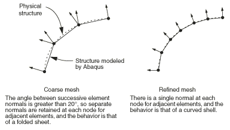
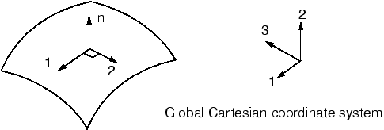
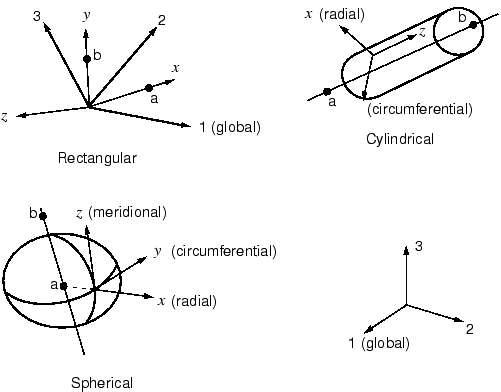
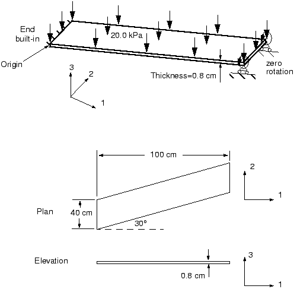

# 第5章 使用壳单元

## 目录

- [5.1 单元几何](#51-单元几何)
- [5.2 壳公式——厚或薄](#52-壳公式厚或薄)
- [5.3 壳材料方向](#53-壳材料方向)
- [5.4 选择壳单元](#54-选择壳单元)
- [5.5 示例：斜板](#55-示例斜板)
- [5.6 相关Abaqus示例](#56-相关abaqus示例)
- [5.7 推荐阅读](#57-推荐阅读)
- [5.8 小结](#58-小结)

---

## 5.1 单元几何

Abaqus中有两种壳单元可用：常规壳单元和连续体壳单元。常规壳单元通过定义单元的平面尺寸及其表面法线和初始曲率来离散化参考表面。然而，常规壳单元的节点不定义壳厚度；厚度通过截面属性定义。另一方面，连续体壳单元类似于三维实体单元，因为它们离散化整个三维体，但其运动学和本构行为与常规壳单元相似。连续体壳单元在接触建模中更准确，因为它们使用考虑厚度变化的双侧接触。然而，对于薄壳应用，常规壳单元提供更优越的性能。

在本指南中仅讨论常规壳单元。因此，我们简单地称它们为"壳单元"。有关连续体壳单元的更多信息，请参阅Abaqus分析用户指南第29.6.1节"壳单元：概述"。

### 5.1.1 壳厚度和截面点

壳厚度是描述壳横截面所必需的，必须指定。除了指定壳厚度外，您还可以选择在分析期间计算截面刚度或在分析开始时计算一次。

如果选择在分析期间计算刚度，Abaqus使用数值积分独立计算壳厚度上每个截面点（积分点）的应力和应变，从而允许非线性材料行为。例如，弹塑性壳可能在外部截面点屈服而在内部截面点保持弹性。在S4R（4节点，减缩积分）单元中单个积分点的位置以及穿过壳厚度的截面点配置如图5-1所示。

**图5-1　数值积分壳中截面点的配置**

当在分析期间计算属性时，您可以指定穿过壳厚度的任意奇数个截面点。默认情况下，Abaqus在均匀壳的厚度方向使用五个截面点，这对于大多数非线性设计问题是足够的。但是，在某些复杂模拟中应使用更多截面点，特别是在预期发生反向塑性弯曲的情况下（九个通常就足够了）。对于线性问题，三个截面点提供穿过厚度的精确积分。但是，当在模拟开始时仅计算一次材料刚度时，材料行为必须是线弹性的。在这种情况下，所有计算都以整个截面上的合成力和力矩的形式进行。如果您请求应力或应变输出，Abaqus提供底表面、中面和顶表面的默认输出。

### 5.1.2 壳法线和壳表面

壳单元的连通性定义正法线方向（如图5-2所示）。

**图5-2　壳的正法线**

对于轴对称壳单元，正法线方向由从节点1到节点2的方向逆时针旋转90°定义。对于三维壳单元，正法线由沿单元定义中出现的节点顺序的右手定则给出。

壳的"顶"表面是正法线方向的表面，用于接触定义称为SPOS面。"底"表面是沿法线负方向的表面，用于接触定义称为SNEG面。法线在相邻壳单元之间应一致。

正法线方向定义壳厚度上变化的元素输出的约定。正压力载荷施加到壳单元上产生沿正法线方向作用的载荷。（壳单元的基于单元的压力载荷约定与连续体单元相反；壳和连续体单元的基于表面的分布载荷约定相同。）

### 5.1.3 初始壳曲率

Abaqus中的壳（元素类型S3/S3R、S3RS、S4R、S4RS、S4RSW和STRI3除外）被公式化为真正的曲壳单元；真正的曲壳单元需要在准确计算初始表面曲率方面特别注意。Abaqus自动计算每个壳单元节点处的表面法线以估计壳的初始曲率。每个节点处的表面法线使用相当复杂的算法确定，这将在Abaqus分析用户指南第29.6.3节"定义常规壳单元的初始几何"中详细讨论。

使用如图5-3所示的粗网格时，Abaqus可能会为同一节点上的相邻单元确定多个独立的表面法线。物理上，单个节点处的多个法线意味着共享该节点的单元之间存在折叠线。虽然您可能打算对这样的结构进行建模，但更可能您打算对平滑曲壳进行建模；Abaqus将尝试通过在节点处创建平均法线来平滑壳。

**图5-3　网格细化对节点表面法线的影响**

使用的基本平滑算法如下：如果每个壳单元在节点处的法线彼此在20°以内，则法线将被平均。该平均法线将用于该节点上 attached to the node的所有单元。如果Abaqus无法平滑壳，则会在数据(.dat)文件中发出警告消息。

有两种方法可用于覆盖默认算法。要在曲壳中引入折叠线或使用粗网格建模曲壳，可以将n1、n2和n3作为坐标后第4、第5和第6个数据值给出（此方法需要手动在文本编辑器中编辑Abaxis/CAE创建的输入文件）；或者直接使用*NORMAL选项指定法线方向（此选项可以使用Abaqus/CAE的关键词编辑器添加）。如果两种方法都使用，后者优先。

### 5.1.4 参考表面偏移

壳的参考表面由壳单元的节点和法线定义。在使用壳单元建模时，参考表面通常与壳的中面重合。但是，在许多情况下，将参考表面定义为与壳的中面偏移更为方便。例如，在CAD包中创建的表面通常代表壳体的顶部或底部表面。在这种情况下，将参考表面定义为与CAD表面重合因此与壳的中面偏移可能更容易。

壳偏移也可用于为接触问题定义更精确的表面几何，其中壳厚度很重要。另一个偏移可能很重要的情形是当建模厚度连续变化的壳时。在这种情况下，在壳中面上定义节点可能很困难。如果一个表面光滑而另一个粗糙（如某些飞机结构中），使用壳偏移在光滑表面上定义节点最容易。

偏移可以通过指定偏移值来引入，偏移值定义为从壳的中面到包含单元节点的参考表面的距离（以壳厚度的分数表示）。偏移的正值沿正法线方向。当偏移设置为0.5或SPOS时，壳的顶表面是参考表面。当偏移设置为-0.5或SNEG时，底表面是参考表面。默认偏移为0，表示壳的中面是参考表面。图5-4显示了这些三种参考表面偏移设置，针对网格进行调整以保持中面位置恒定。

**图5-4　偏移值为0、-0.5和+0.5时壳偏移的示意图**

壳的自由度与参考表面相关。单元的面积和所有运动学量都在那里计算。弯曲壳的大偏移值可能导致表面积分误差，影响壳截面的刚度、质量和转动惯量。出于稳定性目的，Abaqus/Explicit还会自动增加用于壳单元的转动惯量，增幅在偏移量的平方量级，这可能导致大偏移的动力学误差。当需要从壳中面大偏移时，请改用多点约束或刚体约束。

---

## 5.2 壳公式——厚或薄

壳问题通常属于两类之一：薄壳问题和厚壳问题。厚壳问题假定横向剪切变形对解很重要。另一方面，薄壳问题假定横向剪切变形小到可以忽略。薄壳中横向剪切行为的说明如图5-5(a)所示：最初垂直于壳表面的材料线在变形过程中保持直线和垂直。因此，假定横向剪应变为零（γ13=γ23=0）。厚壳的横向剪切行为如图5-5(b)所示：最初垂直于壳表面的材料线在变形过程中不一定保持垂直于表面，从而增加横向剪切柔性（γ13≠0，γ23≠0）。

**图5-5　(a) 薄壳和 (b) 厚壳中横向壳截面的行为**

Abaqus提供了多种类型的壳单元，区分在于单元对薄壳和厚壳问题的适用性。通用壳单元对厚壳和薄壳问题都有效。在某些情况下，对于特定应用，可以获得比Abaqus/Standard中可用的专用壳单元更好的性能。

专用壳单元分为两类：仅薄壳单元和仅厚壳单元。所有专用壳单元提供任意大的旋转但仅限小应变。仅薄壳单元强制执行Kirchhoff约束；即，垂直于壳中面的平面截面保持垂直于中面。Kirchhoff约束通过解析方式（STRI3）或通过惩罚约束在单元公式中数值强制。仅厚壳单元是二次四边形，在小应变应用中当载荷使得解在壳跨度上平滑变化时，可能比通用壳单元产生更准确的结果。

要判断给定应用是薄壳还是厚壳问题，我们可以提供一些指导原则。对于厚壳，横向剪切柔性很重要，而对于薄壳它可以忽略。壳中横向剪切的重要性可以通过其厚度与跨度的比值来估计。具有大于1/15的比率的单一各向同性材料制成的壳被认为是"厚"的；如果比率小于1/15，则认为壳是"薄"的。这些估计是近似的；您应该始终检查模型中的横向剪切效应以验证假定的壳行为。由于层压复合壳结构中横向剪切柔性可能很显著，"薄"壳理论适用的比率应该小得多。具有非常柔软内层（所谓的" sandwich"复合材料）的复合壳具有非常低的横向剪切刚度，几乎始终应该用"厚"壳建模；如果平面截面保持平面的假设被违反，则应使用连续体单元。

横向剪切力和应变可用于通用壳单元和仅厚壳单元。对于三维单元，提供横向剪切应力的估计。这些应力的计算忽略弯曲和扭转变形之间的耦合，并假定材料属性和弯矩的空间梯度较小。

---

## 5.3 壳材料方向

壳单元，不像连续体单元，使用每个单元局部的材料方向。各向异性材料数据（如纤维增强复合材料）和单元输出变量（如应力和应变）基于这些局部材料方向定义。在大位移分析中，壳表面上局部材料轴随着每个积分点处材料的平均运动而旋转。

### 5.3.1 默认局部材料方向

局部材料1和2方向位于壳平面中。默认局部1方向是全局1轴到壳表面的投影。如果全局1轴垂直于壳表面，则局部1方向是全局3轴到壳表面的投影。局部2方向垂直于壳平面中的局部1方向，因此局部1方向、局部2方向和表面正法线形成右手系（如图5-6所示）。

**图5-6　默认局部壳材料方向**

默认局部材料方向集有时可能会导致问题；一个例子是如图5-7所示的圆柱体。对于图中的大多数单元，局部1方向是周向的。然而，有一行单元垂直于全局1轴。对于这些单元，局部1方向是全局3轴到壳的投影，使局部1方向成为轴向而不是周向。局部1方向直接应力σ11的等高线图看起来非常奇怪，因为对于大多数单元σ11是周向应力，而对于某些单元它是轴向应力。在这种情况下，有必要为模型定义更合适的局部方向。

**图5-7　圆柱体中默认局部材料1方向**

### 5.3.2 创建替代材料方向

您可以用局部矩形、圆柱或球面坐标系替换全局笛卡尔坐标系（如图5-8所示）。

**图5-8　局部坐标系的定义**

您定义局部(ξ1, ξ2, ξ3)坐标系的方位，以及哪个局部轴对应哪个材料方向。因此，您必须指定最接近垂直于壳表面的局部轴（1、2或3）。Abaqus遵循轴的循环排列（1、2、3）并将您选择后的轴投影到壳区域以形成材料1方向。例如，如果您选择ξ1轴，Abaqus将ξ2轴投影到壳上以形成材料1方向。材料2方向由壳法线和材料1方向的叉积定义。通常，最终材料2方向和其他局部轴的投影（在本例中为ξ3轴）对于弯曲壳不会重合。

如果这些局部轴没有创建所需的材料方向，您可以指定围绕所选轴的旋转。在投影到壳表面以给出最终材料方向之前，其他两个局部轴按此量旋转。为了便于解释投影，所选轴应尽可能接近壳法线。

例如，如果如图5-7所示的圆柱体的中心线与全局3轴重合，则可以定义局部材料方向，使得局部材料1方向始终为周向，相应的局部材料2方向始终为轴向。

**定义局部材料方向：**

1. 从属性模块的主菜单栏中，选择**工具→基准**并定义一个圆柱基准坐标系。
2. 选择**分配→材料方向**为部件分配局部材料方向。当提示选择坐标系时，选择上一步定义的基准坐标系。近似壳法线方向为**轴1**；不需要额外的旋转。

---

## 5.4 选择壳单元

- 当需要更高的解准确性、对于容易出现膜或弯曲模式沙漏的问题，或对于预期面内弯曲的问题，可以使用线性、有限膜应变、完全积分四边形壳单元（S4）。
- 线性、有限膜应变、减缩积分四边形壳单元（S4R）稳健，适用于广泛的应用。
- 线性、有限膜应变、三角形壳单元（S3/S3R）可用作通用单元。由于单元中的常应变近似，可能需要细化网格以捕捉弯曲变形或高应变梯度。
- 要考虑层压复合壳模型中剪切柔性的影响，请使用适合建模厚壳的壳单元（S4、S4R、S3/S3R、S8R）；检查平面截面保持平面的假设是否满足。
- 二次壳单元（四边形或三角形）对于一般、小应变、薄壳应用非常有效。这些单元不易受剪切或膜锁定影响。
- 如果必须在接触模拟中使用二阶单元，不要使用二次三角形壳单元（STRI65）。而是使用9节点四边形壳单元（S9R5）。
- 对于仅经历几何线性行为的非常大的模型，线性薄壳单元（S4R5）通常比通用壳单元更具成本效益。
- 小膜应变单元适用于涉及小膜应变和任意大旋转的显式动力学问题。

---

## 5.5 示例：斜板

您需要建模如图5-9所示的板。

**图5-9　斜板示意图**

它相对于全局1轴倾斜30°，一端固定，另一端约束在与板轴平行的导轨上移动。您需要确定板承受均匀压力时的跨中挠度。您还需要评估线性分析对于此问题是否有效。您将使用Abaqus/Standard进行分析。

### 5.5.1 预处理——使用Abaqus/CAE创建模型

使用Abaqus/CAE创建此模拟的完整模型。Abaqus提供了复制此问题完整分析模型的脚本。

在开始构建模型之前，决定单位制。尺寸以cm给出，但载荷和材料属性以MPa和GPa给出。由于这些不是一致的单位，您必须选择要在模型中使用的一致单位制并转换必要的输入数据。在下面的讨论中，使用牛顿、米、千克和秒。

**定义模型几何**

启动Abaqus/CAE，创建一个具有平面壳基特征的三维可变形体。将部件命名为`Plate`，指定近似部件尺寸为`4.0`。

**绘制板几何：**

1. 在草图中，使用"创建线条：矩形（4条线）"工具创建一个任意矩形。
2. 删除草图器自动施加的所有约束（四个垂直约束和一个水平约束）。
3. 约束左右边缘保持垂直，底边和顶边保持平行。
4. 选择线条并为其赋值`0.4` m来标注左边。
5. 选择线条的顶点而不是线条本身来定义水平维度。将顶点之间的距离设置为`1.0` m。
6. 选择左边和底边来标注角度。将角度值设置为`60`°。

**定义材料和截面属性以及局部材料方向**

板由各向同性、线性弹性材料制成，弹性模量E = 30 × 109 Pa，泊松比ν = 0.3。创建材料定义，命名材料为`Metal`。

全局笛卡尔坐标系中结构的方向如图5-9所示。全局笛卡尔坐标系定义默认材料方向，但板相对于该系统倾斜。如果使用默认材料方向，模拟结果的解释将不容易，因为材料1方向直接应力σ11将包含来自板的弯曲产生的轴向应力和垂直于板轴的应力的贡献。如果材料方向与板的轴和横向方向对齐，结果的解释将更容易。因此，需要一个局部坐标系，其中局部ξ1方向沿板的轴线（即与全局1轴成30°），局部ξ2方向也在板平面中。

**定义壳截面属性和局部材料方向：**

1. 定义一个名为`PlateSection`的均匀壳截面。指定在分析前执行截面积分，因为材料是线弹性，并接受"无理想化"的默认理想化选项。为截面分配壳厚度`0.8E-2`和`Metal`材料定义。
2. 使用"创建基准CSYS：2线"工具定义一个矩形基准坐标系。
3. 从属性模块的主菜单栏中，选择**分配→材料方向**，并选择将应用局部材料方向的整个部件。在视口中，选择之前创建的基准坐标系。选择**轴3**作为近似壳法线方向。不需要围绕此轴的额外旋转。

**创建装配件、定义分析步骤和指定输出请求**

创建板的依赖实例。

您将对板进行半分区；这允许您在那里定义一个集。您还将定义额外的装配件级集以便于其他输出请求和边界条件定义。

**对板进行分区并定义几何集：**

1. 在模型树中，双击**部件**容器下的**Plate**项使其成为当前部件。
2. 使用"分区面：使用2点之间的最短路径"工具对板进行半分区。使用板的倾斜边缘的中点创建分区。
3. 在模型树中，展开**装配件**容器并双击**集**项，为板的跨中创建一个名为`MidSpan`的几何集。类似地，为板的左右边缘创建集，分别命名为`EndA`和`EndB`。

接下来，创建一个静态、一般步骤。将步骤命名为`Apply Pressure`，指定步骤描述：`Uniform pressure (20 kPa) load`。

**更改默认输出请求：**

1. 编辑场输出请求，仅将节点位移、反作用力和整个模型的单元应力和应变作为场数据写入.odb文件。
2. 编辑历史输出请求，仅将名为`MidSpan`的集的垂直节点位移U3作为历史数据写入.odb文件。

**施加边界条件和载荷**

如图5-9所示，板的左端完全固定；右端约束在与板轴平行的导轨上移动。由于后者边界条件方向与全局轴不一致，您必须定义一个轴与板对齐的局部坐标系。

**在局部坐标系中分配边界条件：**

1. 在模型树中，双击**边界条件**容器，定义一个名为`Rail boundary condition`的位移/旋转机械边界条件。
2. 选择集`EndB`。点击**编辑边界条件**对话框中的图标以指定将应用边界条件的局部坐标系。选择之前创建的基准坐标系。局部1方向与板轴对齐。
3. 在"编辑边界条件"对话框中，固定除U1之外的所有自由度。
4. 完成边界条件定义，固定板左边缘（集`EndA`）所有自由度。命名此边界条件为`Fix left end`。
5. 最后，定义一个名为`Pressure`的均匀压力载荷。指定载荷大小为`2.E4` Pa。

**创建网格并定义作业**

图5-13显示了此模拟的建议网格。

板相当薄，厚度与最小跨度之比为0.02。（厚度为0.8 cm，最小跨度为40 cm。）基于这些信息，选择二次壳单元（S8R5），因为它们对于薄壳小应变模拟给出准确结果。

在模型树中，展开**部件**容器下的**Plate**项，双击**网格**。使用全局单元尺寸`0.1`对部件进行网格划分。使用具有每节点五个自由度的二次减缩积分壳单元（S8R5）创建四边形网格。

在继续之前，将模型重命名为`Linear`。此模型稍后将形成第8章"非线性"中讨论的斜板示例的基础。

定义名为`SkewPlate`的作业，描述为：`Linear Elastic Skew Plate. 20 kPa Load.`。将模型保存在名为`SkewPlate.cae`的模型数据库文件中。

提交作业进行分析。

### 5.5.2 后处理

**单元法线**

使用未变形形状图检查模型定义。检查斜板模型的单元法线是否正确定义并指向正3方向。

**符号图**

符号图将指定变量显示为从节点或单元积分点发出的向量。符号图可用于大多数张量和向量值变量。

**生成位移符号图：**

1. 从**场输出**工具栏左侧的变量类型列表中，选择**符号**。
2. 从输出变量列表中，选择**U**。
3. 从向量量和所选分量列表中，选择**U3**。

**材料方向**

Abaqus/CAE还允许您可视化单元材料方向。此功能在您希望验证材料方向在模拟中是否正确分配时特别有用。

**绘制材料方向：**

1. 从主菜单栏中，选择**绘制→材料方向→未变形形状**。
2. 使用材料方向选项显示带箭头头的 triad。

**基于表格数据评估结果**

通过检查打印数据执行额外后处理。创建整个模型单元应力（S11、S22和S12）、约束节点处的反作用力和力矩（集`EndA`和`EndB`）以及跨中节点位移（集`MidSpan`）的表格数据报告。

检查小应变假设对于此模拟是否有效。对应于峰值应力的轴向应变为ε ≈ 0.008。因为应变通常在小于4或5%时被认为很小，0.8%的应变完全在适合使用S8R5单元建模的范围内。

反作用力以全局坐标系写出。检查反作用力和反作用力矩与相应施加载荷的总和为零。3方向的非零反作用力平衡垂直力的压力载荷（20 kPa × 1.0 m × 0.4 m）。

此示例作为线性分析运行，其中假定节点位移相对于特征结构尺寸较小。板跨中的挠度约为5.4 cm，或约为板长度的5%。然而，位移对于线性分析是否足够小以提供准确结果是可疑的。结构中的非线性效应可能很重要，因此我们需要运行非线性分析来进一步研究此示例。几何非线性分析在第8章"非线性"中讨论。

---

## 5.6 相关Abaqus示例

如果您有兴趣了解更多关于在Abaqus中使用壳单元的信息，应该检查以下问题：

- "可变壳厚度的加压燃料箱"，Abaqus示例问题指南第2.1.6节
- "各向异性层合板分析"，Abaqus基准指南第1.1.2节
- "简支方板的屈曲"，Abaqus基准指南第1.2.4节
- "筒拱屋顶问题"，Abaqus基准指南第2.3.1节

---

## 5.7 推荐阅读

以下参考资料提供了壳理论理论和计算方面更深入的处理。

**基础壳理论**

- Timoshenko, S., *Strength of Materials: Part II*, Krieger Publishing Co., 1958.
- Timoshenko, S. and S. W. Krieger, *Theory of Plates and Shells*, McGraw-Hill, Inc., 1959.
- Ugural, A. C., *Stresses in Plates and Shells*, McGraw-Hill, Inc., 1981.

**基础计算壳理论**

- Cook, R. D., D. S. Malkus, and M. E. Plesha, *Concepts and Applications of Finite Element Analysis*, John Wiley & Sons, 1989.
- Hughes, T. J. R., *The Finite Element Method*, Prentice-Hall, Inc., 1987.

**高级壳理论**

- Budiansky, B., and J. L. Sanders, "On the 'Best' First-Order Linear Shell Theory," *Progress in Applied Mechanics*, The Prager Anniversary Volume, 129–140, 1963.

**高级计算壳理论**

- Ashwell, D. G., and R. H. Gallagher, *Finite Elements for Thin Shells and Curved Members*, John Wiley & Sons, 1976.
- Hughes, T. J. R., T. E. Tezduyar, "Finite Elements Based upon Mindlin Plate Theory with Particular Reference to the Four-Node Bilinear Isoparametric Element," *Journal of Applied Mechanics*, 587–596, 1981.
- Simo, J. C., D. D. Fox, and M. S. Rifai, "On a Stress Resultant Geometrically Exact Shell Model. Part III: Computational Aspects of the Nonlinear Theory," *Computer Methods in Applied Mechanics and Engineering*, vol. 79, 21–70, 1990.

---

## 5.8 小结

- 壳单元的横截面行为可以通过数值积分穿过壳厚度确定，也可以在分析开始时使用计算的截面刚度。
- 在分析开始时计算截面刚度是有效的，但这样做时只能考虑线性材料；在分析期间使用数值积分计算截面刚度允许使用线性和非线性材料。
- 数值积分在穿过壳厚度的多个截面点执行。这些截面点是可以在其中输出单元变量的位置。默认最外层截面点位于壳的表面上。
- 壳单元法线的方向确定单元的正负表面。要正确定义接触和解释单元输出，您必须知道哪个是哪个。壳法线可以在Abaqus/CAE的可视化模块中绘制。
- 壳单元使用每个单元局部的材料方向。在大位移分析中，局部材料轴随单元旋转。可以定义非默认局部坐标系。单元变量（如应力和应变）以局部方向输出。
- 还可以为节点定义局部坐标系。集中载荷和边界条件在局部坐标系中施加。所有打印的节点输出（如位移）也默认引用局部系统。
- 符号图可以帮助您可视化模拟的结果。它们对于可视化结构的运动和载荷路径特别有用。
