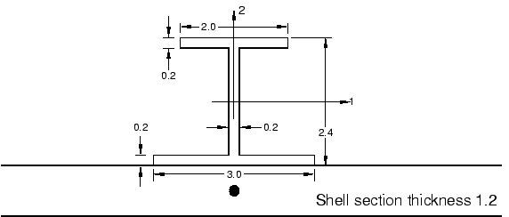
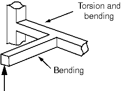
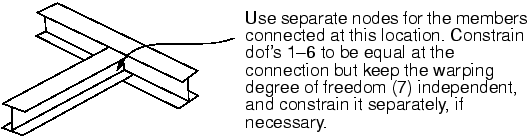

# 第6章 使用梁单元

## 目录

- [6.1 梁横截面几何](#61-梁横截面几何)
- [6.2 公式和积分](#62-公式和积分)
- [6.3 选择梁单元](#63-选择梁单元)
- [6.4 示例： cargo crane](#64-示例cargo-crane)
- [6.5 相关Abaqus示例](#65-相关abaqus示例)
- [6.6 推荐阅读](#66-推荐阅读)
- [6.7 小结](#67-小结)

---

## 6.1 梁横截面几何

您可以通过三种方式之一定义梁截面：通过从Abaqus截面库中选择并指定梁截面形状和尺寸；通过使用截面工程量（如面积和惯性矩）定义广义梁截面；或使用特殊二维单元网格定义几何量数值计算的网格梁截面（称为网格梁截面）。

Abaqus提供了多种常见截面形状（如图6-1所示），如果您决定几何定义梁截面。您也可以使用任意截面定义定义几乎任何薄壁截面。


**图6-1　梁截面**

如果您使用Abaqus库中的内置截面之一定义梁截面，Abaqus/CAE会提示您输入所需的截面尺寸（每种截面类型不同）。当梁截面与梁截面属性关联时，您可以指定是在分析期间计算截面工程量还是让Abaqus预计算它们（在分析开始时）。前者选项可用于材料行为是线性或非线性（例如，如果截面刚度由于非弹性屈服而变化）的情况；后者对于线弹性材料行为更有效。

或者，您可以提供截面工程量（面积、惯性矩和扭转常数）而不是截面尺寸。材料行为可以是线性或非线性。因此，您可以将梁的几何和材料行为组合以定义其对载荷的响应（可以是线性或非线性）。

在Abaqus/Standard中，您还可以定义具有线性锥形截面的梁。支持具有线性响应和标准库截面的广义梁截面。

网格梁截面允许描述包括多种材料和复杂几何的梁截面描述。此类梁截面在Abaqus分析用户指南第10.6.1节"网格梁截面"中进一步讨论。

### 6.1.1 截面点

当使用Abaqus截面库中的内置截面定义梁截面并请求在分析期间计算截面工程量时，Abaqus在梁截面上的截面点阵列计算梁单元的响应。截面点数量以及截面点位置在Abaqus分析用户指南第29.3.9节"梁截面库"中给出。元素输出变量（如应力和应变）在任何截面点都可用；但是，默认仅在选定的截面点提供输出。矩形截面的所有截面点如图6-2所示。


**图6-2　B32矩形梁单元中的积分和默认截面点**

对于此截面，默认在点1、5、21和25提供输出。所示梁单元使用50个截面点（每个积分点25个）来计算其刚度。

当您请求预计算梁截面属性时，Abaqus不在截面点计算梁的响应。而是使用截面工程量确定截面响应。因此，Abaqus仅将截面点用作输出位置，您需要指定您希望输出的截面点。

### 6.1.2 横截面方向

您必须在全局笛卡尔空间中定义梁截面的方向。沿梁单元的局部切线t是沿单元轴从第一节点指向下一节点的向量。梁截面垂直于此局部切线。局部(1-2)梁截面轴由向量n1和n2表示。三个向量t、n1和n2形成一个局部的右手坐标系（如图6-3所示）。


**图6-3　梁单元切线t和梁截面轴n1和n2的方位**

对于二维梁单元，n1方向始终为(0.0, 0.0, ±1.0)。

对于三维梁单元，有几种方法定义局部梁截面轴的方向。第一种是在定义单元的数据行上指定一个额外的节点（此方法需要手动编辑Abaqus/CAE创建的输入文件）。从梁单元第一节点到此附加节点（见图6-3）的向量用于初始作为近似n1方向。然后Abaqus定义梁的n2方向为t × n1。在确定n2之后，Abaqus定义实际n1方向为n2 × t。此过程确保局部切线和局部梁截面轴形成正交系统。

或者，您可以在定义梁截面属性时在Abaqus/CAE中给出近似的n1方向。然后Abaqus使用上述过程计算实际梁截面轴。如果您同时指定了额外节点和近似的n1方向，则额外节点方法优先。如果未提供近似的n1方向，Abaqus使用从原点到点(0.0, 0.0, ±1.0)的向量作为默认n1方向。

有两种方法可以覆盖Abaqus定义的n2方向；两者都需要手动编辑输入文件。一种是在节点坐标后的第4、第5和第6个数据值中给出n2分量。另一种是直接使用*NORMAL选项指定法线方向（此选项可以使用Abaqus/CAE的关键词编辑器添加）。如果两者都使用，后者优先。Abaqus再次定义n1方向为n2 × t。

您提供的n2方向不需要与梁单元切线t正交。当您提供n2方向时，局部梁单元切线被重新定义为cross product (n2 × t)的值。在这种情况下，重新定义的局部梁切线t可能与从第一节点到第二节点的向量定义的梁轴不一致。如果n2方向与垂直于单元轴的平面所夹的角度大于20°，Abaqus会在数据文件中发出警告消息。

第6.4节"示例：cargo crane"中介绍了如何使用Abaqus/CAE分配梁截面方向。

### 6.1.3 梁单元曲率

梁单元的曲率基于梁的n2方向相对于梁轴的方位。如果n2方向与梁轴不正交（即梁轴和切线t不一致），则梁单元最初被认为是弯曲的。由于弯曲梁的行为与直梁不同，您应始终检查模型以确保使用了正确的法线，从而使用了正确的曲率。对于梁和壳，Abaqus使用相同的算法确定在共享节点的法线。在Abaqus分析用户指南第29.3.4节"梁单元横截面方向"中给出了描述。

如果您打算建模弯曲梁结构，您应该使用之前描述的两种方法之一直接定义n2方向，从而允许您在建模曲率方面有很大控制。即使您打算建模由直梁组成的结构，法线也可能在共享节点处被平均，从而引入曲率。您可以通过如前所述直接定义梁法线来纠正此问题。

### 6.1.4 梁截面中的节点偏移

当梁单元用作壳模型的加筋件时，使梁和壳单元共享相同的节点是很方便的。默认情况下，壳单元节点位于壳的中面，梁单元节点位于梁截面的某个位置。因此，如果壳和梁单元共享相同的节点，则壳和梁加筋件将重叠，除非梁截面从节点位置偏移（如图6-4所示）。


**图6-4　使用梁作为壳模型的加筋件：(a) 无梁截面偏移；(b) 有梁截面偏移**

对于I、梯形和任意截面类型的梁截面，可以指定截面几何位于与元素节点处截面局部坐标系的原点一定距离的位置。由于这种截面的梁容易从其节点偏移，它们可以容易地用作如图6-4(b)所示的加筋件。（如果加筋件的翼缘或腹板屈曲很重要，应使用壳建模加筋件。）

如图6-5所示的I梁连接到1.2单位厚的壳。通过定义梁节点从I截面底部偏移的距离，可以将梁截面定向为图中所示。偏移在这种情况下为±0.6；即壳厚度的一半。



**图6-5　用作壳单元加筋件的I梁**

您还可以指定质心和剪切中心的位置；这些位置可以从梁节点偏移，从而使您可以容易地建模加筋件。

也可以分别定义梁节点和壳节点，并使用刚性梁约束连接两个节点。

---

## 6.2 公式和积分

Abaqus中的所有梁单元都是"梁-柱"单元——这意味着它们允许轴向、弯曲和扭转变形。Timoshenko梁单元还考虑横向剪切变形的影响。

### 6.2.1 剪切变形

线性单元（B21和B31)和二次单元（B22和B32)是剪切变形的Timoshenko梁；因此，它们适用于建模粗短构件（其中剪切变形重要）和细长梁（其中剪切变形不重要）。这些单元的截面行为与厚壳单元的截面行为相同。这些梁单元的横向剪切刚度假定为线性弹性和恒定。此外，这些梁被公式化，使得它们的截面积可以随轴向变形而变化，此效果仅在几何非线性模拟中考虑（参见第8章"非线性"），其中截面泊松比具有非零值。只要截面尺寸小于结构典型轴向尺寸的1/10，这些单元就可以提供有用的结果，这通常被认为是梁理论适用性的极限；如果梁截面在弯曲变形下不保持平面，则梁理论不足以建模变形。

Abaqus/Standard中可用的三次单元——所谓的Euler-Bernoulli梁单元（B23和B33)——不建模剪切柔性。这些单元的截面保持垂直于梁轴。因此，三次梁单元最有效地用于建模具有相对细长构件的结构。由于三次单元对其长度方向建模位移的立方变化，静态分析通常可以用单个三次单元建模，动态分析用少量单元建模。这些单元假定剪切变形可以忽略。一般来说，如果截面尺寸小于结构典型轴向尺寸的1/15，此假定有效。

### 6.2.2 扭转响应——翘曲

结构构件经常承受扭矩，这在几乎任何三维框架结构中都会发生。导致一个构件弯曲的载荷可能导致另一个构件扭转（如图6-7所示）。



**图6-7　框架结构中引起的扭转**

梁对扭转的响应取决于其截面形状。一般来说，梁中的扭转在截面中产生翘曲或非均匀的面外位移。Abaqus仅在三维单元中考虑扭转和翘曲的影响。翘曲计算假定翘曲位移很小。以下截面在扭转下行为不同：实心截面；闭合薄壁截面；和开口薄壁截面。

**实心截面**

非圆形实心截面在扭转下不平截面；而是截面翘曲。Abaqus使用St. Venant翘曲理论计算截面每个截面点处由翘曲引起的单个剪应变分量。这种实心截面中的翘曲被认为是无约束的，产生可忽略的轴向应力。（翘曲约束仅在约束端附近立即影响解。）具有实心截面的梁的扭转刚度取决于材料的剪切模量G和梁截面的扭转常数J。扭转常数取决于梁截面的形状和翘曲特性。产生截面中大量非弹性变形的扭转载荷无法用此方法准确建模。

**闭合薄壁截面**

具有闭合薄壁非圆形截面（BOX或HEX）的梁具有显著的扭转刚度，因此行为类似于实心截面。Abaqus假定这些截面中的翘曲也是无约束的。截面的薄壁特性允许Abaqus认为剪应变在壁厚方向是恒定的。薄壁假定通常在壁厚为典型梁截面尺寸的1/10时有效。

**开口薄壁截面**

当翘曲无约束时，开口薄壁截面在扭转中非常柔顺，主要扭转刚度来源是轴向翘曲应变的约束。约束开口薄壁梁的翘曲会引入可能影响梁对其他载荷类型响应的轴向应力。Abaqus/Standard具有剪切变形梁单元B31OS和B32OS，它们包括开口薄壁截面中的翘曲效应。这些单元必须在建模承受显著扭转载荷的开口薄壁截面结构时使用。

翘曲引起的轴向变形在梁截面上的变化由截面的翘曲函数定义。此函数的量值在开口截面梁单元中被视为额外自由度7。约束此自由度可防止应用约束的节点处发生翘曲。

开口截面梁在框架结构中的连接处，每个分支的翘曲幅度可能不同，因此通常应为每个分支使用单独的节点（如图6-8所示）。



**图6-8　连接开口截面梁**

但是，如果连接设计为防止翘曲，所有分支应共享一个公共节点，并且应约束翘曲自由度。

不通过梁剪切中心作用的剪切力产生扭转。扭转力矩等于剪切力乘以其相对于剪切中心的偏心距。通常，质心和开口薄壁梁截面的剪切中心不一致（如图6-9所示）。如果节点不位于截面的剪切中心，截面可能在载荷下扭转。


**图6-9　一些梁截面的剪切中心s和质心c的近似位置**

---

## 6.3 选择梁单元

- 在任何包括接触的模拟中，应使用一阶剪切变形梁单元（B21、B31)。
- 如果横向剪切变形重要，使用Timoshenko（二次）梁单元（B22、B32)。
- 如果结构要么非常刚硬要么非常柔顺，应在几何非线性模拟中使用Abaqus/Standard中可用的混合梁单元（B21H、B32H等）。
- Abaqus/Standard中可用的Euler-Bernoulli（三次）梁单元（B23、B33)对于包括分布载荷（如动态振动分析）的模拟非常准确。
- 具有开口薄壁截面的结构应使用开口截面翘曲理论（B31OS、B32OS）的单元建模，这些单元在Abaqus/Standard中可用。

---

## 6.4 示例：cargo crane

轻型cargo crane如图6-10所示。您需要确定其承受10 kN载荷时的静挠度。您还应识别结构和关节中的关键构件：即应力和载荷最高的构件。因为这是静态分析，您将使用Abaqus/Standard分析cargo crane。


**图6-10　轻型cargo crane示意图**

 crane由两个桁架结构组成，通过交叉支撑连接。两个主构件在每个桁架结构中是钢箱梁（箱形截面）。每个桁架结构通过内部支撑加强，焊接在主构件上。连接两个桁架结构的交叉支撑用螺栓固定在桁架结构上。这些连接可以传递很少的弯矩，因此被视为铰接接头。内部支撑和交叉支撑都使用比桁架结构主构件截面更小的钢箱梁。两个桁架结构在其端部（在E点）以允许在3方向独立移动和所有旋转的方式连接，而约束1和2方向的位移相同。 crane牢固焊接在A、B、C和D点的massive结构上。 crane的尺寸如图6-11所示。在以下图中，桁架A是包括构件AE、BE及其内部支撑的结构；桁架B包括构件CE、DE及其内部支撑。


**图6-11　cargo crane的尺寸（单位：m)**

 crane主构件的典型截面尺寸与全局轴向长度之比远小于1/15。内部支撑最短构件中的比率约为1/15。因此，使用梁单元对cargo crane建模是有效的。

### 6.4.1 预处理——使用Abaqus/CAE创建模型

内部支撑和cargo crane中主构件之间的焊接接头提供从模型一个区域到下一个区域的平移和旋转的完全连续性。因此，您只需要在模型中每个焊接接头处使用单个几何实体（即顶点）。单个部件用于表示内部支撑和主构件。为方便起见，两个桁架结构将被视为单个部件。

连接交叉支撑到桁架结构的螺栓接头以及桁架结构尖端处的连接与焊接接头连接不同。由于这些接头不提供所有自由度的完全连续性，需要单独的顶点进行连接。因此，交叉支撑必须被视为单独的部件，因为需要不同的几何实体来建模螺栓接头。必须在单独的顶点之间指定适当的约束。

我们首先讨论定义桁架几何的技术。由于两个桁架结构相同，因此仅使用单个桁架结构的几何来定义部件的基础特征就足够了。可以保存桁架几何的草图，然后用于将第二个桁架结构添加到部件定义中。

**创建部件**

焊接接头在内部支撑和主构件之间提供从模型一个区域到下一个区域的平移和旋转的完全连续性。因此，您只需要在模型中每个焊接接头处使用单个几何实体（即顶点）。单个部件用于表示内部支撑和主构件。为方便起见，两个桁架结构将被视为单个部件。

**创建零件：**

1. 创建一个由单个参考点组成的三维可变形部件。将部件命名为`Truss`。将点放在原点。此点代表图6-10中的D点。
2. 使用"从点创建基准点：偏移"工具，从参考点创建两个基准点，距离分别为`(0, 1, 0)`和`(8, 1.5, 0.9)`。这些点分别代表图6-10中的C和E点。
3. 使用"创建基准平面：3点"工具创建一个基准平面作为草图平面。选择参考点，然后以逆时针方式选择其他两个基准点。
4. 使用"创建基准轴：主轴"工具，创建平行于Y轴的基准轴。
5. 使用"创建线：平面"工具进入草图。选择基准平面作为绘制线几何的平面；选择基准轴作为将出现在草图左侧和下方的轴。
6. 在草图中，使用"创建线：连接"工具绘制主桁架的线条。使用尺寸工具标注垂直和水平距离。
7. 创建一系列连接的线条来近似桁架的内部支撑。对顶部和底部边缘的线段施加平行约束和相等长度约束。

**定义梁截面属性**

由于此模拟中的材料行为假定为线弹性，从计算角度来说，在分析前预计算梁截面属性更有效。假设桁架和支撑由软钢制成，弹性模量E = 200.0 × 10<sup>9</sup> Pa，泊松比ν = 0.25，剪切模量G = 80.0 × 10<sup>9</sup> Pa。所有梁都具有箱形截面。

**定义梁截面属性：**

1. 在模型树中，双击**配置文件**容器为主构件的桁架结构创建箱形配置文件；然后，为内部和交叉支撑创建第二个配置文件。将配置文件命名为`MainBoxProfile`和`BraceBoxProfile`。
2. 创建一个**梁**截面用于桁架结构的主构件，一个用于内部和交叉支撑。分别命名截面为`MainMemberSection`和`BracingSection`。
3. 对于两个截面定义，指定在分析前执行截面积分。选择`MainBoxProfile`用于主构件的截面定义，`BraceBoxProfile`用于支撑截面定义。
4. 输入之前记下的弹性模量和剪切模量。在相应的文本字段中输入截面泊松比。
5. 将`MainMemberSection`分配给表示桁架结构主构件的几何区域，将`BracingSection`分配给表示内部和交叉支撑构件的区域。

**定义梁截面方向**

主构件的梁截面轴应定向为梁1轴垂直于桁架结构平面（俯视图），梁2轴垂直于该平面中的单元。内部桁架支撑的近似n1向量与相应桁架结构主构件相同。

在其局部坐标系中，`Truss`部件的定向如图6-21所示。从属性模块的主菜单栏中，选择**分配→梁截面方向**为每个桁架结构指定近似的n1向量。

**梁法线**

在此模型中，如果您仅提供定义近似n1向量方向的数据，将会有建模误差。除非覆盖，否则梁法线的平均（Abaqus）在cargo crane模型中使用不正确的几何。要查看此问题，您可以使用可视化模块显示梁截面轴和梁切线向量。

由于相邻区域之间的法线所夹角度小于20°的区域会平均法线，因此必须显式指定法线方向。在此问题中，您必须为两侧对应的区域指定法线位置。

**创建装配件级集**

此时，定义将在后面使用的装配件级几何集很方便。在模型树中，展开**装配件**容器并双击**集**。定义包含对应于A到D点的顶点的几何集，命名集为`Attach`。

此外，在桁架结构尖端（E点）的顶点处创建集。分别命名集为`Tip-a`和`Tip-b`，其中`Tip-a`是与桁架A关联的几何集（见图6-17）。最后，为每个将指定梁法线的区域创建一个集。

**创建步骤定义和指定输出**

创建一个静态，一般步骤。命名步骤为`Tip load`，输入步骤描述：`Static tip load on crane`。

将位移（U）和反作用力和力矩（RF）以及截面力和力矩（SF）写入输出数据库作为场输出。

**定义约束方程**

在cargo crane模型中，两个桁架的尖端连接在一起，使得每个尖端节点的1和2方向（1和2方向的平移）的自由度相等，而其他自由度（3-6）独立。我们需要两个线性约束，一个使2个顶点处的自由度1相等，另一个使自由度2相等。

**创建线性方程：**

1. 在模型树中，双击**约束**容器。命名约束为`TipConstraint-1`，并指定方程约束。
2. 在第一行中，输入系数`1.0`、集名称`Tip-a`和自由度`1`。在第二行中，输入系数`-1.0`、集名称`Tip-b`和自由度`1`。
3. 点击鼠标按钮3在`TipConstraint-1`上，选择**复制**。将`TipConstraint-1`复制到`TipConstraint-2`。双击`TipConstraint-2`并更改两行的自由度为`2`。

**对交叉支撑和桁架之间的铰接接头建模**

连接器允许您对装配件中任意两点之间的连接进行建模。JOIN连接器将用于建模螺栓连接。

**定义连接器：**

1. 从交互模块的主菜单栏中，选择**连接器→重合构建器**。
2. 使用选择工具将您的选择限制为**顶点**。
3. 在视口中，拖动光标围绕整个模型，然后点击**完成**。
4. 在"重合点构建器"对话框中，点击创建截面属性。
5. 在"创建连接器截面"对话框中，选择**基本**作为连接类别。从可用平移类型列表中，选择**Join**。接受所有其他默认值，点击**继续**。
6. 在连接器截面编辑器中，点击**确定**。
7. 点击**确定**创建连接。

**定义载荷和边界条件**

总载荷10 kN沿负y方向施加到桁架的末端。将大小为`-10000`的集中力施加到集`Tip-b`。命名载荷为`Tip load`。

创建名为`Fixed end`的encastre边界条件，并将其应用到集`Attach`。

**创建网格**

cargo crane将使用三维细长三次梁单元（B33)建模。这些单元中的三次插值允许我们为每个构件使用单个单元并在施加弯曲载荷下获得准确结果。

在模型树中，展开**部件**容器下的**Truss**项，然后双击**网格**。为所有区域指定全局部件种子`2.0`。对名为**Cross brace**的部件重复此操作。使用空间中的线性三次梁单元（B33元素）对两个部件实例进行网格划分。

**使用关键词编辑器并定义作业**

您现在将添加关键词选项以完成模型定义（即定义梁法线方向的选项）。在模型树中，点击鼠标按钮3在**Model-1**上，选择**编辑关键词**。

在关键词编辑器中，在*END ASSEMBLY选项之前添加以下内容：

```
*NORMAL, TYPE=ELEMENT
Inner-a, Inner-a, -0.3962, 0.9171, 0.0446
Inner-b, Inner-b, 0.3962, -0.9171, 0.0446
Leg-a, Leg-a, -0.1820, 0.9829, 0.0205
Leg-b, Leg-b, 0.1820, -0.9829, 0.0205
```

在继续之前，将模型重命名为`Static`。此模型稍后将形成第7章"线性动力学"中讨论的crane示例的基础。

将模型保存在名为`Crane.cae`的模型数据库文件中，并创建名为`Crane`的作业。提交作业进行分析。

### 6.4.2 后处理

切换到可视化模块，打开文件`Crane.odb`。Abaqus显示crane模型的未变形形状图。

**绘制变形模型形状**

首先，绘制变形模型形状与未变形模型形状叠加。指定非默认视图，使用(0, 0, 1)作为视点向量的X-、Y-和Z坐标，(0, 1, 0)作为向上向量的X-、Y-和Z坐标。

crane的叠加在变形形状上的未变形形状如图6-25所示。

**使用显示组绘制单元和节点集**

显示组允许您仅绘制与主构件在桁架结构A中关联的单元。

**创建和绘制显示组：**

1. 在结果树中，展开输出数据库文件名为`Crane.odb`下的**截面**容器。
2. 在容器中点击项目直到与桁架A中主构件关联的单元在视口中高亮显示。点击鼠标按钮3并选择**替换**。
3. 双击**显示组**并保存显示组为`MainA`。

**梁横截面方向**

您现在将绘制截面轴和梁切线。

从主菜单栏中，选择**选项→通用**；然后点击出现的对话框中的**法线**标签。打开**显示法线**，并接受**在单元上**的默认设置。在**样式**区域，指定长度为**长**。

**渲染梁轮廓**

您现在将显示梁轮廓的理想化表示并对应力结果进行等高线。

从主菜单栏中，选择**视图→ODB显示选项**。在**常规**标签页面中，打开**渲染梁轮廓**并接受默认比例因子1。

点击完成。Abaqus/CAE以适当尺寸和正确方向显示梁轮廓。

**创建硬拷贝**

您可以将当前图像保存到文件以进行硬拷贝输出。从主菜单栏中，选择**文件→打印**。选择**PS**作为格式，并输入`beam.ps`作为文件名。

**位移摘要**

将所有节点在显示组`MainA`中的位移摘要写入名为`crane.rpt`的文件。桁架尖端在2方向的最大位移为0.0188 m。

**截面力和力矩**

Abaqus可以为结构单元提供以作用在截面上给定点的力和力矩形式的表现。这些截面力和力矩在局部梁坐标系中定义。关闭梁轮廓的渲染，然后对显示组`MainA`中单元的关于梁1轴的截面力矩进行等高线。

---

## 6.5 相关Abaqus示例

如果您有兴趣了解更多关于在Abaqus中使用梁单元的信息，应该检查以下问题：

- "Detroit Edison管道甩击实验"，Abaqus示例问题指南第2.1.2节
- "梁的屈曲分析"，Abaqus基准指南第1.2.1节
- "汽车碰撞模拟"，Abaqus基准指南第1.3.14节
- "悬臂梁的几何非线性分析"，Abaqus基准指南第2.1.2节

---

## 6.6 推荐阅读

**基础梁理论**

- Timoshenko, S., *Strength of Materials: Part II*, Krieger Publishing Co., 1958.
- Oden, J. T. and E. A. Ripperger, *Mechanics of Elastic Structures*, McGraw-Hill, 1981.

**基础计算梁理论**

- Cook, R. D., D. S. Malkus, and M. E. Plesha, *Concepts and Applications of Finite Element Analysis*, John Wiley & Sons, 1989.
- Hughes, T. J. R., *The Finite Element Method*, Prentice-Hall Inc., 1987.

---

## 6.7 小结

- 梁单元的行为可以通过截面的数值积分确定，也可以直接以面积、惯性矩和扭转常数的形式给出。
- 当数值定义梁截面属性时，您可以让截面属性在分析开始时计算一次（假定线性弹性材料行为）或在整个分析过程中计算（允许线性和非线性材料行为）。
- Abaqus包括许多标准截面形状。其他形状，如果是"薄壁"，可以使用任意截面建模。
- 必须通过指定第三个节点或作为单元属性定义的一部分定义法线向量来定义截面的方向。可以在Abaqus/CAE的可视化模块中绘制法线。
- 梁截面可以从定义梁的节点偏移。此过程在建模壳上的加筋件时有用。
- 线和二次梁包括剪切变形的影响。Abaqus/Standard中的三次梁不考虑剪切柔性。Abaqus/Standard中的开口截面梁单元正确建模薄壁开口截面中的扭转和翘曲（包括翘曲约束）的影响。
- 可以使用多点约束、约束方程和连接器来连接节点处的自由度，以建模铰接连接、刚性链接等。
- "弯矩"型等高线图允许轻松可视化一维单元（如梁）的结果。
- 显示选项允许您渲染梁轮廓以增强模型的图形表示。
- 可以以PostScript (PS)、封装的PostScript (EPS)、标签图像文件格式(TIFF)、便携式网络图形(PNG)和可缩放矢量图形(SVG)格式获取Abaqus/CAE图的硬拷贝。
