# 第7章 线性动力学

## 目录

- [7.1 引言](#71-引言)
  - [7.1.1 固有频率和振型](#711-固有频率和振型)
  - [7.1.2 模态叠加](#712-模态叠加)
- [7.2 阻尼](#72-阻尼)
  - [7.2.1 在Abaqus/Standard中定义阻尼](#721-在abaqusstandard中定义阻尼)
  - [7.2.2 选择阻尼值](#722-选择阻尼值)
- [7.3 单元选择](#73-单元选择)
- [7.4 动力学网格设计](#74-动力学网格设计)
- [7.5 示例：动态载荷作用下的货运吊车](#75-示例动态载荷作用下的货运吊车)
  - [7.5.1 模型修改](#751-模型修改)
  - [7.5.2 结果](#752-结果)
  - [7.5.3 后处理](#753-后处理)
- [7.6 模态数量的影响](#76-模态数量的影响)
- [7.7 阻尼的影响](#77-阻尼的影响)
- [7.8 与直接时间积分的比较](#78-与直接时间积分的比较)
- [7.9 其他动力学过程](#79-其他动力学过程)
  - [7.9.1 线性模态动力学](#791-线性模态动力学)
  - [7.9.2 非线性动力学](#792-非线性动力学)
- [7.10 相关Abaqus示例](#710-相关abaqus示例)
- [7.11 推荐阅读](#711-推荐阅读)
- [7.12 小结](#712-小结)

---

## 7.1 引言

动态模拟是在动态平衡方程中包含惯性力的模拟：


其中：

- *M* 是结构的质量，
- 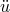 是结构的加速度，
- *I* 是结构内部的力，
- *P* 是施加的外力。

上述方程中的表达式不过是牛顿第二运动定律（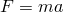）。

在平衡方程中包含惯性力（）是静力分析和动力分析之间的主要区别。两种模拟之间的另一个区别在于内力的定义，*I*。在静力分析中，内力仅来自结构的变形；而在动力分析中，内力包含由运动（即阻尼）和结构变形共同产生的贡献。

### 7.1.1 固有频率和振型

最简单的动力学问题是质量-弹簧系统上的质量振荡，如图7-1所示。

**图7-1** 质量-弹簧系统。

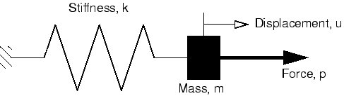

弹簧的内力为 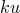，其运动动态方程为：


该质量-弹簧系统的（弧度/时间）**固有频率**为：


如果移动质量然后释放，它将以该频率振荡。如果以该频率施加力，位移的振幅将急剧增加——这种现象称为**共振**。

实际结构具有大量固有频率。重要的是设计结构时，使其可能被加载的频率不要接近固有频率。固有频率可以通过考虑未加载结构的动态响应（动态平衡方程中的 ）来确定。运动方程为：


对于无阻尼系统 ，所以：


该方程的解具有以下形式：

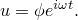

将其代入运动方程，得到**特征值**问题：

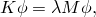

其中 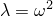。

该系统有 *n* 个特征值，其中 *n* 是有限元模型中自由度数量。设 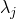 为第 *j* 个特征值。其平方根，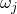，是结构第 *j* 阶模态的**固有频率**，而  是对应的第 *j* 个**特征向量**。特征向量也称为**振型**，因为它是结构在第 *j* 阶模态振动时的变形形状。

Abaqus/Standard中的频率提取过程用于确定结构的模态和频率。该过程易于使用，只需指定所需的模态数量或感兴趣的最大频率。

### 7.1.2 模态叠加

结构的固有频率和振型可用于表征线性范围内结构对载荷的动态响应。结构的变形可以使用**模态叠加**技术通过结构振型的组合来计算。每个振型乘以一个比例因子。模型中的位移向量 *u* 定义为：

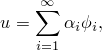

其中  是模态位移， 是第 *i* 阶模态的广义坐标。该技术仅对小位移、线性弹性材料和无接触条件有效——换句话说，仅适用于线性问题。

在结构动力学问题中，结构的响应通常由相对较少的模态主导，这使得模态叠加成为一种特别有效的计算此类系统响应的方法。考虑一个包含10,000个自由度的模型。运动方程的直接积分需要在每个时间点求解10,000个联立方程。如果结构响应由100阶模态表征，则每个时间增量只需解100个方程。此外，模态方程是解耦的，而原始运动方程是耦合的。计算模态和频率有初始成本，但响应计算所节省的成本远远超过该成本。

如果模拟中存在非线性，固有频率可能在分析过程中发生显著变化，此时不能使用模态叠加。在这种情况下，需要直接积分动态平衡方程，这比模态分析要昂贵得多。

一个问题应具有以下特征才适合线性瞬态动力分析：

- 系统应是线性的：线性材料行为、无接触条件、无非线性几何效应。
- 响应应由相对较少的频率主导。随着响应频率内容的增加（如冲击和碰撞问题的情况），模态叠加技术的效果会降低。
- 主导加载频率应在提取频率的范围内，以确保能够准确描述载荷。
- 由任何突然施加的载荷产生的初始加速度应能被特征模态准确描述。
- 系统不应被重度阻尼。

---

## 7.2 阻尼

如果允许无阻尼结构自由振动，振荡幅度是恒定的。然而，在现实中，结构运动时会消耗能量，振荡幅度会减小直到停止。这种能量耗散称为**阻尼**。阻尼通常被认为是粘性的或与速度成正比的。动态平衡方程可以改写为包含阻尼的形式：


其中：

- *C* 是结构的阻尼矩阵，
- 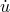 是结构的速度。

能量的耗散是由多种效应引起的，包括结构关节处的摩擦和局部材料滞后。阻尼是包含重要能量吸收的一种便捷方式，而无需详细建模这些效应。

在Abaqus/Standard中，特征模态是针对无阻尼系统计算的，但大多数工程问题都涉及某种阻尼，无论多小。每个模态的有阻尼固有频率与无阻尼固有频率之间的关系为：

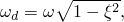

其中：

-  是阻尼特征值，
- 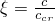 是阻尼比，即临界阻尼的分数，
- *c* 是该振型的阻尼，
-  是临界阻尼。

对于小值的  < 0.1），阻尼系统的特征频率非常接近无阻尼系统的相应值。随着  的增加，无阻尼特征频率变得不那么准确；当  接近1时，使用无阻尼特征频率变得无效。

如果结构处于临界阻尼状态（），则在任何扰动后，它将尽可能快地返回初始静态配置而不会超调（图7-2）。

**图7-2** 不同  值下的阻尼运动模式。


### 7.2.1 在Abaqus/Standard中定义阻尼

在Abaqus/Standard中，可以为瞬态模态分析定义多种不同类型的阻尼：直接模态阻尼、Rayleigh阻尼和复合模态阻尼。

阻尼是为模态动力学过程定义的。阻尼是步骤定义的一部分，可以为每个模态定义不同的阻尼量。

**直接模态阻尼**

可以使用直接模态阻尼定义与每个模态相关的临界阻尼分数，。通常使用1%到10%临界阻尼范围内的值。直接模态阻尼允许您精确地定义系统每个模态的阻尼。

**Rayleigh阻尼**

在Rayleigh阻尼中，假设阻尼矩阵是质量矩阵和刚度矩阵的线性组合：

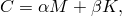

其中  和  是用户定义的常数。虽然阻尼与质量和刚度矩阵成正比的假设没有严格的物理基础，但实际上阻尼分布很少被充分了解以支持任何其他更复杂的模型。通常，该模型在重度阻尼系统（即高于约10%临界阻尼）以上变得不可靠。与其他形式的阻尼一样，您可以精确地定义系统每个模态的Rayleigh阻尼。

对于给定的模态 *i*，阻尼比  与Rayleigh阻尼值  和  通过以下公式关联：

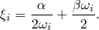

**复合阻尼**

在复合阻尼中，为每种材料定义临界阻尼的分数，然后为整个结构找到复合阻尼值。当结构中存在许多不同材料时，此选项很有用。本指南不再进一步讨论复合阻尼。

### 7.2.2 选择阻尼值

在大多数线性动力学问题中，阻尼的适当指定对于获得准确结果很重要。然而，阻尼在某种意义上是近似的，因为它模拟结构的能量吸收特性，而不尝试建模导致这些特性的物理机制。因此，很难确定模拟所需的阻尼数据。有时您可能有动态测试数据可用，但通常您只能使用从参考资料或经验中获得的数据。在这种情况下，您应非常谨慎地解释结果，并应使用参数研究来评估模拟对阻尼值的敏感性。

---

## 7.3 单元选择

Abaqus中几乎所有单元都可用于动态分析。通常，选择单元的规则与静力模拟相同。但是，对于冲击和爆炸载荷的模拟，应使用一阶单元。它们具有集中质量公式，比二阶单元使用的一致质量公式更能模拟应力波效应。

---

## 7.4 动力学网格设计

在设计动态模拟的网格时，需要考虑响应中被激发的振型，并使用能够充分表示这些振型的网格。这意味着对于静力模拟足够的网格可能不适合用于计算激发高频模态的载荷的动态响应。

例如，考虑图7-3所示的板。一阶壳单元的网格对于板在均匀载荷下的静力分析是足够的，也可用于预测第一振型。但是，该网格明显太粗糙，无法准确模拟第六振型。

**图7-3** 基于粗网格的板振动频率和相应振型。

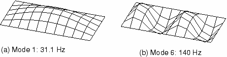

图7-4显示了使用细化一阶单元网格的相同板。第六振型的变形形状现在看起来好得多，该模态的预测频率也更准确。如果板上动态载荷导致该模态被显著激发，则必须使用细化网格；粗网格的结果将不准确。

**图7-4** 基于细网格的板振动频率和相应振型。


---

## 7.5 示例：动态载荷作用下的货运吊车

本示例使用您在"示例：货运吊车"（第6.4节）中分析的相同货运吊车，但现在您被要求研究当10 kN的载荷在0.2秒内落到吊钩上时会发生什么。点 *A*、*B*、*C* 和 *D* 处的连接（见图7-5）只能承受最大100 kN的拉出力。您必须判断这些连接是否会断裂。

**图7-5** 货运吊车。


载荷的短持续时间意味着惯性效应可能很重要，因此动态分析是必不可少的。您没有获得有关结构阻尼的任何信息。由于桁架和交叉支撑之间存在螺栓连接，摩擦效应引起的能量吸收可能很大。因此，基于经验，您为每个模态选择5%的临界阻尼。

施加载荷的大小与时间的关系如图7-6所示。

**图7-6** 载荷-时间特性。


Abaqus提供了复制此问题完整分析模型的脚本。如果您遇到困难或希望检查工作，可以运行这些脚本。脚本位于以下位置：

- 本示例的Python脚本在"货运吊车——动态载荷"（第A.5节）中提供。有关如何获取脚本并在Abaqus/CAE中运行的说明在附录A"示例文件"中给出。
- 本示例的插件脚本可在Abaqus/CAE插件工具集中找到。要从Abaqus/CAE运行脚本，请选择 **Plug-ins → Abaqus → Getting Started**；高亮显示 **Cargo crane dynamic loading**；然后点击 **Run**。有关Getting Started插件的更多信息，请参阅Abaqus/CAE用户指南第82.1节"运行Abaqus入门示例"。

如果您无法访问Abaqus/CAE或其他预处理器，可以手动创建此问题所需的输入文件，如"Abaqus入门：关键词版"第7.5节"示例：动态载荷作用下的货运吊车"中所讨论。

### 7.5.1 模型修改

打开模型数据库文件 `Crane.cae`，并将 `Static` 模型复制到名为 `Dynamic` 的模型。动态分析模型与静力分析模型基本相同，只是进行了以下修改。

**材料**

在动态模拟中，必须指定每种材料的密度以便形成质量矩阵。吊车中钢的密度为7800 kg/m³。

在此模型中，材料属性作为截面定义的一部分指定。因此，您需要编辑 `BracingSection` 和 `MainMemberSection` 截面定义以指定密度。在 **Edit Beam Section** 对话框的 **Specify section material density** 字段中，为每个截面定义输入值 `7800`。

**步骤**

用于动态分析的步骤定义与静力分析中使用的步骤定义完全不同。因此，之前创建的静力步骤将被两个新步骤替换。

动态分析的第一步计算结构的固有频率和振型。然后，第二步使用这些数据计算货运吊车的瞬态模态动态响应。在此分析中，我们假设一切都是线性的。如果要在模拟中建模任何非线性，必须使用隐式动态过程进行运动方程的直接积分。请参阅"非线性动力学"（第7.9.2节）了解更多详情。

Abaqus/Standard提供Lanczos和子空间迭代特征值提取方法。当需要大量特征模态且系统具有许多自由度时，Lanczos方法通常更快。当只需要少量（少于20个）特征模态时，子空间迭代方法可能更快。

我们在此分析中使用Lanczos特征求解器并请求30个特征值。除了指定所需的模态数量外，还可以指定感兴趣的最大和最小频率，以便步骤在Abaqus/Standard找到指定范围内的所有特征值后完成。也可以指定移位点，以便提取最接近移位点的特征值。默认情况下，不使用最小或最大频率或移位。如果结构没有约束以抵抗刚体模态，应将移位值设置为一个小的负值，以消除与刚体运动相关的数值问题。

**创建频率提取步骤：**

1. 在模型树中，展开 **Steps** 容器。然后，在名为 **Tip Load** 的步骤上点击鼠标按钮3，并从出现的菜单中选择 **Replace**。在 **Replace Step** 对话框中，从可用的 **Linear perturbation** 过程中选择 **Frequency**。
2. 在 **Edit Step** 对话框的 **Basic** 选项卡页面中，输入步骤描述 `First 30 modes`；接受Lanczos特征求解器选项；并请求30个特征值。
3. 通过在名称 `Tip Load` 上点击鼠标按钮3并从出现的菜单中选择 **Rename**，将步骤重命名为 `Extract Frequencies`。

在结构动态分析中，响应通常与低阶模态相关。但是，应提取足够的模态以提供结构动态响应的良好表示。检查已提取的特征值数量是否足够的一种方法是查看每个自由度中的总有效质量，这表示每个方向上提取模态中有多少质量是活跃的。有效质量在数据文件中的特征值输出下列表格。理想情况下，每个方向中每个模态的模态有效质量之和应至少为总质量的90%。有关更多信息，请参阅"模态数量的影响"（第7.6节）。

模态动力学过程将用于执行瞬态动态分析。瞬态响应将基于第一步中提取的所有模态；应在所有30个模态中使用5%的临界阻尼。

**创建瞬态模态动力学步骤：**

1. 在模型树中，双击 **Steps** 容器以创建新步骤。从可用的 **Linear perturbation** 过程中选择 **Modal dynamics**，并将步骤命名为 `Transient modal dynamics`。在上述频率提取步骤之后插入步骤。
2. 在 **Edit Step** 对话框的 **Basic** 选项卡页面中，输入描述 `Crane Response to Dropped Load` 并指定时间周期为 `0.5`，时间增量为 `0.005`。在动态分析中，时间是一个真实的物理量。
3. 在 **Edit Step** 对话框的 **Damping** 选项卡页面中，指定直接模态阻尼，并为模态 `1` 到 `30` 输入临界阻尼分数 `0.05`。

**输出**

使用 **Field Output Requests Manager**，修改 `Extract Frequencies` 步骤的场输出请求，选择 **Preselected defaults**。默认情况下，Abaqus/Standard将振型写入输出数据库（.odb）文件，以便可以使用 **Visualization** 模块绘制它们。每个振型的节点位移被归一化，使得最大位移为单位1。因此，这些结果以及相应的应力和应变没有物理意义：它们应仅用于相对比较。

动态分析通常需要比静力分析多得多的增量来完成。因此，动态分析的输出量可能非常大，您应控制输出请求以将输出文件保持在合理的大小。在此示例中，您将请求每五个增量结束时将变形形状输出到输出数据库文件。步骤中将有100个增量（0.5/0.005）；因此，将有20帧场输出。

此外，您将把载荷端（集合 `Tip-a`）的位移和固定端（集合 `Attach`）的反作用力作为历史数据每增量写入输出数据库文件，以便获得更高分辨率的数据。在此分析中，您将把能量输出限制在动能、内能和粘性耗散能。

**请求瞬态模态动力学分析步骤的输出：**

1. 打开 **Field Output Requests Manager**。选择出现在标记为 **Transient modal dynamics** 的列中的 **Created** 单元格。
2. 编辑场输出请求，以便仅每 `5` 个增量将节点位移写入 `.odb` 文件。
3. 打开 **History Output Requests Manager**。编辑默认输出请求，以便仅在每个增量后写入ALLIE、ALLKE和ALLVD。此外，在标记为 `Transient modal dynamics` 的步骤中创建两个新的输出请求。在第一个中，每增量写入集合 `Tip-a` 的位移（仅平移）；在第二个中，每增量写入集合 `Attach` 的反作用力（不是力矩）。

**载荷和边界条件**

边界条件与静力分析相同。由于这些在步骤替换操作期间被保留，因此不需要定义新的边界条件。

将集中力施加到吊车尖端。载荷的大小随时间变化，如图7-6所示。载荷的时间依赖性可以使用振幅曲线定义。在任何时间点施加的实际载荷大小通过将载荷大小（-10,000 N）乘以该时刻振幅曲线的值获得。

**指定随时间变化的载荷：**

1. 首先定义振幅曲线。在模型树中，双击 **Amplitudes** 容器。将振幅命名为 `Bounce`，并选择类型 **Tabular**。在 **Edit Amplitude** 对话框中输入表7-1中所示的数据。接受 **Step time** 作为时间跨度，并将平滑参数值指定为 `0.25`。

**表7-1** 振幅曲线数据。

| 时间（秒） | 振幅 |
|-----------|------|
| 0.0 | 0.0 |
| 0.01 | 1.0 |
| 0.2 | 1.0 |
| 0.21 | 0.0 |

2. 现在定义载荷。在模型树中，双击 **Loads** 容器。在 `Transient modal dynamics` 步骤中施加载荷，将载荷命名为 `Dyn load`，并选择 **Concentrated force** 作为载荷类型。将载荷应用到集合 `Tip-b`。之前定义的集合 `Tip-a` 和 `Tip-b` 之间的方程约束意味着载荷将由吊车的两半均摊。
3. 在 **Edit Load** 对话框中，为 **CF2** 输入值 `-1.E4`，并为振幅选择 `Bounce`。

**运行分析**

创建名为 `DynCrane` 的作业，描述为：`3-D model of light-service cargo crane dynamic analysis`。

将模型保存在模型数据库文件中，并提交作业进行分析。监控解决方案进度；纠正检测到的任何建模错误并调查任何警告消息的原因，必要时采取纠正措施。

### 7.5.2 结果

**作业监视器**

**Job Monitor** 给出了分析中每个增量使用的自动时间增量的简要摘要。信息在增量完成后立即写入，以便您可以在运行时监控分析。这对于大型复杂问题很有用。**Job Monitor** 中的信息与状态文件（DynCrane.sta）中给出的信息相同。

检查 **Job Monitor** 和打印输出数据文件（DynCrane.dat）以评估分析结果。

**作业监视器**

在 **Job Monitor** 中，第一列显示步骤号，第二列给出增量号。第六列显示Abaqus/Standard在每个增量中获得收敛解所需的迭代次数。查看 **Job Monitor** 的内容，我们可以看到与第1步中单个增量相关的时间增量非常小。此步骤不使用时间，因为时间在频率提取过程中不相关。

第2步的输出显示时间增量大小在整个步骤中是恒定的，并且每个增量只需要一次迭代。**Job Monitor** 的底部如图7-7所示。

**图7-7** **Job Monitor** 的底部：货运吊车动态分析。

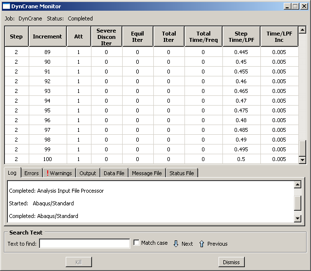

**数据文件**

点击 **Job Monitor** 中的 **Data File** 选项卡以在对话框底部显示数据文件选项卡中的数据文件。第1步的主要结果是提取的特征值、参与因子和有效质量，如下所示。

```
                              E I G E N V A L U E    O U T P U T     

 MODE NO    EIGENVALUE       FREQUENCY           GENERALIZED MASS  COMPOSITE MODAL DAMPING            
                        (RAD/TIME) (CYCLES/TIME)


       1       1773.4     42.112     6.7023       151.92           0.0000    
       2       7016.8     83.766     13.332       30.206           0.0000    
       3       7644.1     87.431     13.915       90.400           0.0000    
       ...
      30       3.64774E+05 603.97     96.124       64.971           0.0000    
```

提取的最高频率为96 Hz。与该频率相关的周期为0.0104秒，与固定时间增量0.005秒相当。提取周期远小于所用时间增量的模态是没有意义的。相反，时间增量必须能够解析感兴趣的最高频率。

广义质量列列出与该模态相关的单自由度系统的质量。

参与因子表指示模态主要作用的主导自由度。结果表明，例如，第1模态主要在3方向作用。

有效质量表指示每个模态在每个自由度中活跃的质量量。结果表明，在2方向具有显著质量的第一个模态是第3模态。2方向的总模态有效质量为378.26 kg。

模型的总质量在数据文件的前面给出，为414.34 kg。

为确保使用了足够数量的模态，每个方向的总有效质量应是模型质量的大部分（比如说90%）。但是，模型的一些质量与被约束的节点相关联。此约束质量约为附着到约束节点的所有元素质量的三分之一，在本例中约为28 kg。因此，模型可以移动的质量为385 kg。2和3方向的有效质量分别为可移动质量的6%、98%和97%。2和3方向的总有效质量远高于之前推荐的90%；1方向的总有效质量低得多。但是，由于载荷施加在2方向，1方向的响应不显著。

### 7.5.3 后处理

进入 **Visualization** 模块，打开输出数据库文件 `DynCrane.odb`。

**绘制振型**

您可以通过绘制与给定固有频率相关联的变形模式来可视化给定自然频率的变形模式。

**选择模态并绘制相应振型：**

1. 在上下文栏中，点击帧选择器工具。
   出现 **Frame Selector** 对话框。拖动对话框的底部角落将其放大，以便两个步骤名称都清晰可见。
2. 拖动帧滑块以在 **Extract Frequencies** 步骤中选择帧 `1`。这是第一个特征模态。
3. 从主菜单栏选择 **Plot → Deformed Shape**；或使用工具箱中的绘图工具。
   Abaqus/CAE显示与第一个振动模式相关联的变形模型形状，如图7-8所示。

**图7-8** 第1模态。

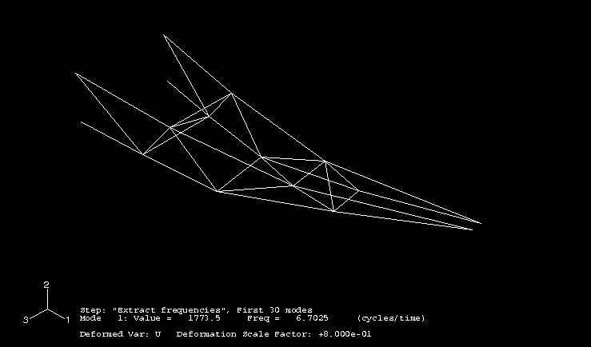

4. 从 **Frame Selector** 对话框中选择第三模态（**Extract Frequencies** 步骤中的帧 `3`）。然后关闭对话框。
   Abaqus/CAE显示如图7-9所示的第三振型。

**图7-9** 第3模态。

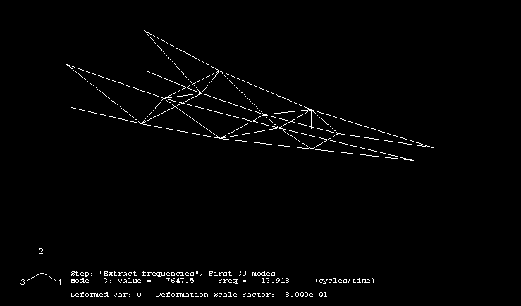

**结果动画**

您将为分析结果创建动画。首先创建第三特征模态的比例因子动画。然后创建瞬态结果的时间历史动画。

**创建特征模态的比例因子动画：**

1. 从主菜单栏选择 **Animate → Scale Factor**；或使用工具箱中的工具。
   Abaqus/CAE显示第三振型，并逐步显示从0到1的不同变形比例因子。
2. 在上下文栏中点击暂停图标以暂停动画。

**创建瞬态结果的时间历史动画：**

1. 从主菜单栏选择 **Result → Active Steps/Frames** 以选择将在历史动画中活动的帧。
2. 切换步骤名称，以便仅选择第二个步骤（**Transient modal dynamics**）。
3. 点击 **OK** 接受选择并关闭对话框。
4. 从主菜单栏选择 **Animate → Time History**；或使用工具箱中的工具。
5. 您可以在动画运行时自定义变形形状图。

**确定峰值拉出力**

要找到连接点处的峰值拉出力，创建附着节点处1方向（变量 `RF1`）反作用力的 *X–Y* 绘图。这涉及同时绘制多条曲线。

**绘制多条曲线：**

1. 在结果树中，在名为 `DynCrane.odb` 的输出数据库的 **History Output** 上点击鼠标按钮3。从出现的菜单中选择 **Filter**。
2. 在过滤器字段中，输入 `*RF1*` 以将历史输出限制为仅1方向的反作用力分量。
3. 从可用的历史输出列表中，选择具有以下形式的四条曲线（使用 **Ctrl+Click**）：
   `Reaction Force: RF1 PI: TRUSS-1 Node xxx in NSET ATTACH`
4. 点击鼠标按钮3，并从出现的菜单中选择 **Plot**。

生成的绘图（已自定义）如图7-10所示。对于每个桁架顶部的两个节点（点B和C）的曲线与每个桁架底部节点（点A和D）的曲线几乎是镜像的。

**图7-10** 附着节点处反作用力的历史记录。


在每个桁架结构顶部的附着点处，峰值拉力约为80 kN，低于连接件100 kN的承载能力。请记住，1方向的负反作用力意味着构件正在被拉离墙壁。较低的连接在施加载荷时处于压力状态（正反作用力），但在载荷移除后会在拉力和压力之间振荡。峰值拉力约为40 kN，远低于允许值。

---

## 7.6 模态数量的影响

对于此模拟，使用了30个模态来表示结构的动态行为。所有这些模态的总模态有效质量远超过可以在 *y* 和 *z* 方向上移动的结构质量的90%，表明动态表示是足够的。

图7-11显示了自由度方向2中 `Tip-a` 集合节点位移随时间的变化，并说明了使用较少模态对结果质量的影响。如果您查看有效质量表，您会看到2方向中第一个重要模态是第3模态，这解释了为什么仅使用两个模态时没有响应。对于使用五个模态和30个模态的分析，在0.2秒后该节点的位移方向2相似；然而，早期响应不同，表明在5-30范围内有显著模态与早期响应相关。当使用五个模态时，2方向的总模态有效质量仅为可移动质量的57%。

**图7-11** 不同模态数量对结果的影响。


---

## 7.7 阻尼的影响

在此模拟中，我们在所有模态中使用了5%的临界阻尼。该值基于以下经验选择：桁架和交叉支撑之间的螺栓连接可能由于局部摩擦效应吸收大量能量。在没有准确数据的情况下，重要的是调查您所做的选择的影响。

图7-12比较了使用1%、5%和10%临界阻尼时其中一个顶部连接（点C）处反作用力的历史记录。正如所料，较低阻尼水平的振荡比较低阻尼水平衰减得更快，较低阻尼模型的峰值力更高。即使阻尼比低至1%，峰值拉出力也为85 kN，仍小于连接的强度（100 kN）。因此，货运吊车在这种落载荷下应保持其完整性。

**图7-12** 阻尼比对拉出力的影响。

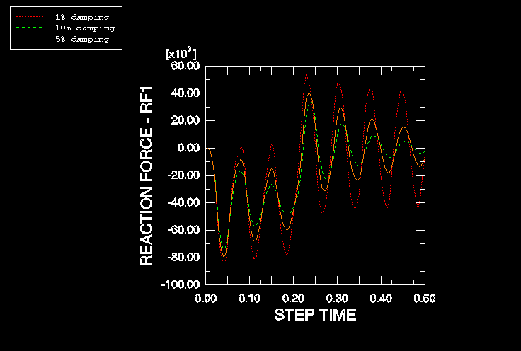

---

## 7.8 与直接时间积分的比较

由于这是瞬态动态分析，自然要考虑结果与使用运动方程直接积分获得的结果的比较。直接积分可以使用隐式（Abaqus/Standard）或显式（Abaqus/Explicit）方法执行。在这里，我们将分析扩展为使用显式动力学过程。

由于B33单元类型和直接模态阻尼在Abaqus/Explicit中不可用，因此无法与之前呈现的结果进行直接比较。因此，在Abaqus/Explicit分析中，单元类型更改为B31，并用Rayleigh阻尼代替直接模态阻尼。

将 `Dynamic` 模型复制到名为 `explicit` 的模型。所有后续更改应应用于 `explicit` 模型。

**修改模型：**

1. 删除模态动力学步骤。当Abaqus/CAE警告您删除步骤也会删除步骤相关对象时，点击 **Yes**。
2. 将剩余的频率提取步骤替换为显式动力学步骤，并指定时间周期为 `0.5` s。此外，编辑步骤以使用线性几何（关闭 **Nlgeom**）。
3. 将步骤重命名为 `Transient dynamics`。
4. 创建两个额外的历史输出请求。在第一个中，请求集合 `Tip-a` 的位移历史；在第二个中，请求集合 `Attach` 的反作用力历史。
5. 向支撑截面属性添加质量比例阻尼。为此，双击模型树中 **Sections** 容器下的 **BracingSection**；在出现的截面编辑器中，点击 **Damping** 选项卡。
   在 **Stiffness Proportional Material Damping** 区域中，为 **Alpha** 输入值 `15`，其余阻尼量为 `0`。
6. 对主成员截面属性重复上述步骤。
7. 重新定义集合 `Tip-b` 处的尖端载荷。指定 **CF2** = `-10000`，并使用振幅定义 `Bounce`。
8. 将单元库更改为 **Explicit**，并为模型的所有区域分配单元类型B31。
9. 创建名为 `expDynCrane` 的新作业，并提交进行分析。

当作业完成时，进入 **Visualization** 模块检查结果。特别，比较从Abaqus/Standard获得的尖端位移历史与从Abaqus/Explicit获得的尖端位移历史。如图7-14所示，响应存在微小差异。这些差异是由于为模态动态分析使用了不同的单元和阻尼类型。事实上，如果修改Abaqus/Standard分析以使用B31单元和质量比例阻尼，两种分析产品产生的结果几乎无法区分（见图7-14），这证实了模态动力学过程的准确性。

**图7-13** 阻尼比随频率的变化，对应于指定的Rayleigh因子（ = 15， = 0）。


**图7-14** 从Abaqus/Standard和Abaqus/Explicit获得的尖端位移的比较。


---

## 7.9 其他动力学过程

现在我们简要回顾Abaqus中可用的其他动态过程——即线性模态动力学和非线性动力学。

### 7.9.1 线性模态动力学

Abaqus/Standard中还有几种采用模态叠加技术的线性动态过程。与在时域中计算响应的模态动力学过程不同，这些过程在频域中提供结果，可以对结构行为提供额外的洞察。

**稳态动力学**

此过程计算由谐波激励在用户指定的频率范围内引起的结构响应幅值和相位。典型示例包括：

- 汽车发动机支架在一系列发动机运行速度下的响应。
- 建筑物中的旋转机械。
- 飞机发动机上的组件。

**响应谱**

此过程在结构承受其固定点动态运动时提供峰值响应（位移、应力等）的估计。固定点的运动称为"基础运动"；一个例子是引起地面运动的地震事件。通常，当需要峰值响应的估计用于设计目的时使用该方法。

**随机响应**

此过程预测系统对随机连续激励的响应。激励使用功率谱密度函数以统计方式表达。随机响应分析的示例包括：

- 飞机对湍流的响应。
- 结构对噪音的响应，例如喷气发动机发出的噪音。

### 7.9.2 非线性动力学

如前所述，模态动力学过程仅适用于线性问题。当需要非线性动态响应时，必须直接积分运动方程。Abaqus/Standard中使用隐式动力学过程执行运动方程的直接积分。当使用此过程时，质量、阻尼和刚度矩阵被组装，并且在每个时间点求解动态平衡方程。由于这些操作计算密集，直接积分动力学比模态方法更昂贵。

由于Abaqus/Standard中的非线性动力学过程使用隐式时间积分，因此适用于非线性结构动力学问题，例如，突然事件引发动态响应（如碰撞）的情况，或者结构响应涉及大量能量通过塑性或粘性阻尼耗散的情况。在此类研究中，高频响应在开始时很重要，但很快被模型中的耗散机制阻尼掉。

非线性动态分析的另一种选择是Abaqus/Explicit中可用的显式动力学过程。如第2章"Abaqus基础"中所讨论，显式算法通过模型逐个元素传播解决方案作为应力波。因此，它最适用于应力波效应重要且模拟的事件时间很短（通常小于一秒）的应用。

与Abaqus/Standard相比，显式算法与不连续非线性（如接触和失效）的建模更容易，这是与之相关的另一个优势。大型高度不连续的问题通常更容易用Abaqus/Explicit建模，即使响应是准静态的。显式动态分析在第9章"非线性显式动力学"中有进一步讨论。

---

## 7.10 相关Abaqus示例

- "Indian Point反应堆给水管线的线性分析"，Abaqus示例问题指南第2.2.2节
- "爆炸载荷的圆柱形面板"，Abaqus基准指南第1.3.3节
- "悬臂板的特征值分析"，Abaqus基准指南第1.4.6节

---

## 7.11 推荐阅读

- Clough, R. W. and J. Penzien, *Dynamics of Structures*, McGraw-Hill, 1975.
- NAFEMS Ltd., *A Finite Element Dynamics Primer*, 1993.
- Spence, P. W. and C. J. Kenchington, *The Role of Damping in Finite Element Analysis*, Report R0021, NAFEMS Ltd., 1993.

---

## 7.12 小结

- 动态分析包括结构惯性效应的作用。
- Abaqus/Standard中的频率提取过程提取结构的固有频率和振型。
- 然后可以使用振型通过模态叠加确定线性系统的动态响应。该技术高效，但不能用于非线性问题。
- Abaqus/Standard中提供了线性动态过程来计算瞬态载荷对瞬态响应的计算、谐波载荷对稳态响应的计算、基础运动对峰值响应的计算以及对随机载荷的响应。
- 您应提取足够数量的模态以获得结构动态行为的准确表示。每个可能运动方向上总模态有效质量应至少为可移动质量的90%，以产生准确结果。
- 您可以在Abaqus/Standard中定义直接模态阻尼、Rayleigh阻尼和复合模态阻尼。然而，由于固有频率和振型基于无阻尼结构，被分析的结构应仅为轻阻尼。
- 模态技术不适用于非线性动态模拟。在这些情况下必须使用直接时间积分方法或显式分析。
- 载荷或规定边界条件的时间变化可以使用振幅曲线定义。
- 振型和瞬态结果可以在Abaqus/CAE的 **Visualization** 模块中动画显示。这提供了一种理解动态和非线性静力分析响应的有用方法。
