# 第8章 非线性

## 目录

- [8.1 非线性的来源](#81-非线性的来源)
  - [8.1.1 材料非线性](#811-材料非线性)
  - [8.1.2 边界非线性](#812-边界非线性)
  - [8.1.3 几何非线性](#813-几何非线性)
- [8.2 非线性问题的求解](#82-非线性问题的求解)
  - [8.2.1 步骤、增量和迭代](#821-步骤增量和迭代)
  - [8.2.2 在Abaqus/Standard中的平衡迭代和收敛](#822-在abaqusstandard中的平衡迭代和收敛)
  - [8.2.3 Abaqus/Standard中的自动增量控制](#823-abaqusstandard中的自动增量控制)
- [8.3 在Abaqus分析中包含非线性](#83-在abaqus分析中包含非线性)
  - [8.3.1 几何非线性](#831-几何非线性)
  - [8.3.2 材料非线性](#832-材料非线性)
  - [8.3.3 边界非线性](#833-边界非线性)
- [8.4 示例：非线性斜板](#84-示例非线性斜板)
  - [8.4.1 模型修改](#841-模型修改)
  - [8.4.2 作业诊断](#842-作业诊断)
  - [8.4.3 后处理](#843-后处理)
  - [8.4.4 在Abaqus/Explicit中运行分析](#844-在abaqusexplicit中运行分析)
- [8.5 相关Abaqus示例](#85-相关abaqus示例)
- [8.6 推荐阅读](#86-推荐阅读)
- [8.7 小结](#87-小结)

---

## 8.1 非线性的来源

结构力学模拟中存在三类非线性来源：

- 材料非线性。
- 边界非线性。
- 几何非线性。

### 8.1.1 材料非线性

这种非线性可能是您最熟悉的，在第10章"材料"中有更深入的讨论。大多数金属在低应变值下具有相当线性的应力/应变关系；但在较高应变下，材料发生屈服，此时响应变为非线性和不可逆的（见图8-2）。

**图8-2** 单向拉伸弹塑性材料的应力-应变曲线。

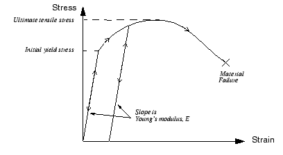

橡胶材料可以用非线性、可逆（弹性）响应来近似（见图8-3）。

**图8-3** 橡胶类材料的应力-应变曲线。

材料非线性可能与应变以外的因子相关。应变率相关材料数据和材料失效都是材料非线性的形式。材料特性也可以是温度和其他预定义场的函数。

### 8.1.2 边界非线性

如果边界条件在分析过程中发生变化，则发生边界非线性。考虑图8-4所示的悬臂梁，其在施加载荷下偏转直到碰到"挡块"。

**图8-4** 碰到挡块的悬臂梁。

如果偏转很小，尖端的垂直偏转与载荷呈线性关系，直到与挡块接触。然后，在梁的尖端处边界条件突然发生变化，阻止任何进一步的垂直偏转，因此梁的响应不再是线性的。边界非线性是极度不连续的：当模拟中发生接触时，结构响应会发生巨大且瞬时的变化。

边界非线性的另一个例子是将材料片吹入模具中。片材在施加压力下相对容易地膨胀，直到开始与模具接触。从那时起，需要增加压力以继续形成片材，因为边界条件发生了变化。

边界非线性在第12章"接触"中讨论。

### 8.1.3 几何非线性

第三个非线性来源与分析过程中结构几何的变化有关。每当位移的大小影响结构的响应时，就会发生几何非线性。这可能是由以下原因引起的：

- 大偏转或旋转。
- " snap through"（突跳）。
- 初始应力或载荷刚化。

例如，考虑在尖端垂直加载的悬臂梁（见图8-5）。

**图8-5** 悬臂梁的大偏转。

如果尖端偏转很小，分析可以认为是近似线性的。然而，如果尖端偏转很大，结构的形状及其刚度会发生变化。此外，如果载荷不保持垂直于梁，载荷对结构的作用会显著变化。随着悬臂梁偏转，载荷可以分解为垂直于梁的分量和沿梁长度方向的分量。这两个效应都有助于悬臂梁的非线性响应（即梁承载的载荷增加时其刚度的变化）。

人们期望大偏转和旋转对结构承载载荷的方式有显著影响。然而，位移不一定必须相对于结构尺寸较大，几何非线性才重要。考虑在施加压力下浅曲大面板的"突跳"，如图8-6所示。

**图8-6** 大浅面板的突跳。

在此示例中，面板变形时其刚度发生显著变化。当面板"突跳"时，刚度变为负的。因此，虽然相对于面板尺寸的位移量很小，但模拟中存在显著的几何非线性，必须加以考虑。

在此应注意分析产品之间的一个重要区别：默认情况下，Abaqus/Standard假设小变形，而Abaqus/Explicit假设大变形。

---

## 8.2 非线性问题的求解

结构的非线性载荷-位移曲线如图8-7所示。

**图8-7** 非线性载荷-位移曲线。

分析的目标是确定此响应。考虑作用在物体上的外力 *P* 和内力（节点力）*I*（分别见图8-8(a)和(b)）。

**图8-8** 作用在物体上的内力和外力。

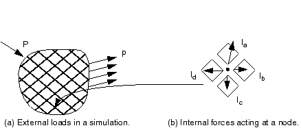

作用在节点上的内力是由包含该节点的单元中的应力引起的。

为了使物体处于静力平衡，每个节点上作用的净力必须为零。因此，静力平衡的基本表述是内力 *I* 和外力 *P* 必须相互平衡：

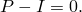

Abaqus/Standard使用Newton-Raphson方法获得非线性问题的解。在非线性分析中，通常无法通过求解单个方程组（如线性问题那样）来计算解。相反，解是通过逐步施加指定载荷并向最终解增量推进来找到的。因此，Abaqus/Standard将模拟分解为若干**载荷增量**，并在每个载荷增量结束时找到近似的平衡构型。Abaqus/Standard通常需要多次迭代才能确定给定载荷增量的可接受解。所有增量响应的总和是非线性分析的近似解。因此，Abaqus/Standard结合了增量法和迭代法来求解非线性问题。

Abaqus/Explicit通过显式地从先前增量的结尾推进运动状态来求解动态平衡方程 ，而无需迭代。显式求解不需要形成切线刚度矩阵。显式中心差分算子在增量开始时（时间 *t*）满足动态平衡方程，在时间 *t* 计算的加速度用于将速度解推进到时间  并将位移解推进到时间 。对于线性和非线性问题，显式方法都需要很小的时间增量大小，仅取决于模型的最高固有频率，与载荷的类型和持续时间无关。模拟通常需要大量增量；然而，由于在每个增量中不求解全局方程组，显式方法的每增量成本比隐式方法小得多。显式动态方法的小增量特征使Abaqus/Explicit非常适合非线性分析。

### 8.2.1 步骤、增量和迭代

本节介绍描述分析各个部分的一些新术语。重要的是您清楚地理解分析**步骤**、载荷**增量**和**迭代**之间的区别。

- 模拟的载荷历史包含一个或多个步骤。您定义步骤，每个步骤通常包括分析过程选项、载荷选项和输出请求选项。不同的载荷、边界条件、分析过程选项和输出请求可用于每个步骤。例如：
  - 步骤1：将板夹在刚性夹爪之间。
  - 步骤2：添加载荷使板变形。
  - 步骤3：找到变形板的固有频率。

- 增量是步骤的一部分。在非线性分析中，步骤中施加的总载荷被分解成较小的增量，以便可以跟随非线性解路径。
  在Abaqus/Standard中，您建议第一个增量的大小，Abaqus/Standard自动选择后续增量的大小。在Abaqus/Explicit中，默认时间增量是完全自动的，不需要用户干预。由于显式方法是有条件稳定的，时间增量存在稳定性限制。稳定时间增量在第9章"非线性显式动力学"中讨论。
  在每个增量结束时，结构处于（近似）平衡，可以请求将结果写入输出数据库、重启、数据或结果文件。您选择写入输出数据库文件的增量称为**帧**。
  Abaqus/Standard和Abaqus/Explicit分析中时间增量的问题差异很大，因为Abaqus/Explicit中的时间增量通常要小得多。

- 迭代是使用隐式方法在增量中获得平衡解的尝试。如果模型在迭代结束时不在平衡状态，Abaqus/Standard会尝试另一次迭代。每次迭代，Abaqus/Standard获得的解应更接近平衡；有时Abaqus/Standard可能需要多次迭代才能获得平衡解。当获得平衡解时，增量完成。只能在一个增量结束时请求结果。
  Abaqus/Explicit不需要迭代来获得增量中的解。

### 8.2.2 在Abaqus/Standard中的平衡迭代和收敛

结构对一个小载荷增量  的非线性响应如图8-9所示。Abaqus/Standard使用结构在  处构型基础上初始刚度 ，以及  来计算结构的**位移修正** 。使用 ，将结构的构型更新为 。

**图8-9** 增量中的第一次迭代。

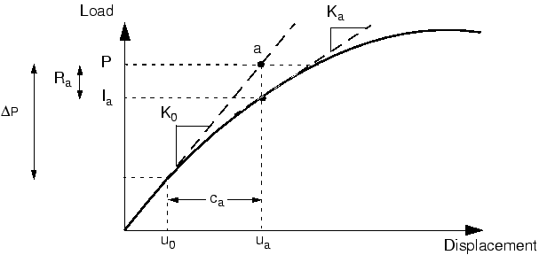

**收敛**

Abaqus/Standard基于更新的构型  为结构形成新的刚度 。Abaqus/Standard还在此更新构型中计算 。总施加载荷 *P* 与  之间的差异现在可以计算为：

其中  是迭代的**力残差**。

如果模型每个自由度处的  为零，图8-9中的点 *a* 将位于载荷-挠度曲线上，结构将处于平衡状态。在非线性问题中， 几乎不可能为零，因此Abaqus/Standard将其与容差值进行比较。如果  小于此力残差容差，Abaqus/Standard接受结构的更新构型作为平衡解。默认情况下，此容差值设置为在整个模拟过程中空间和时间平均的结构平均力的0.5%。Abaqus/Standard自动计算此空间和时间平均力。

如果  小于当前容差值，*P* 和  处于平衡状态， 是结构在施加载荷下的有效平衡构型。然而，在Abaqus/Standard接受解之前，它还检查位移修正  是否相对于总增量位移 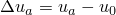 很小。如果  大于增量位移的1%，Abaqus/Standard执行另一次迭代。在该载荷增量解被判定为**收敛**之前，两个收敛检查都必须满足。此规则的一个例外是**线性**增量的情况，定义为最大力残差小于时间平均力 10⁻⁸ 倍的任何增量。任何通过最大力残差与时间平均力如此严格比较的情况被认为是线性的，不需要进一步迭代。解被接受而不检查位移修正的大小。

如果迭代的解未收敛，Abaqus/Standard执行另一次迭代以尝试将内外力平衡。第二次迭代使用在前一次迭代结束时计算的刚度  以及  来确定另一次位移修正 ，使系统更接近平衡（图8-10中的点 *b*）。

**图8-10** 第二次迭代。

Abaqus/Standard使用结构新构型中的内力 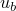 计算新的力残差 。同样，最大力残差（在任何自由度处） 与力残差容差进行比较，第二次迭代的位移修正  与位移增量 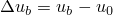 进行比较。如果需要，Abaqus/Standard执行进一步迭代。

对于非线性分析中的每次迭代，Abaqus/Standard形成模型刚度矩阵并求解方程组。这意味着每次迭代在计算成本上等同于进行完整线性分析。现在应该清楚，Abaqus/Standard中非线性分析的计算费用可能是线性分析的多倍。

使用Abaqus/Standard可以保存每个收敛增量的结果。因此，非线性模拟可用的输出数据量是相同几何线性分析可用数据量的多倍。在规划计算机资源时，应同时考虑这两个因素以及您想要执行的非线性模拟类型。

### 8.2.3 在Abaqus/Standard中的自动增量控制

Abaqus/Standard自动调整载荷增量大小，以便轻松高效地求解非线性问题。您只需要在模拟的每个步骤中建议第一个增量的大小。此后，Abaqus/Standard自动调整增量大小。如果不提供建议的初始增量大小，Abaqus/Standard将在第一个增量中尝试施加步骤中定义的所有载荷。在高度非线性问题中，Abaqus/Standard将不得不反复减小增量大小，从而浪费CPU时间。通常，为您提供合理的初始增量大小是有利的（第8.4.1节"模型修改"中有一个示例）；只有在非常轻微非线性的问题中，才能在单个增量中施加步骤中的所有载荷。

获得载荷增量收敛解所需的迭代次数将根据系统的非线性程度而变化。默认情况下，如果解似乎发散，Abaqus/Standard放弃该增量并将增量大小重置为其先前值的25%。然后尝试使用这个较小的载荷增量获得收敛解。如果增量仍然无法收敛，Abaqus/Standard再次减小增量大小。默认情况下，Abaqus/Standard在增量停止分析之前允许最多五次增量大小削减。

在Abaqus/Standard中，您还可以指定步骤期间允许的最大增量数。如果需要超过此限制的增量来完成步骤，Abaqus/Standard将终止分析并显示错误消息。步骤的默认增量数为100；如果模拟中存在显著非线性，分析可能需要更多增量。您指定Abaqus/Standard可以使用的增量数上限，而不是它必须使用的增量数。

在非线性分析中，步骤在有限的"时间"内进行，尽管这个"时间"在没有惯性效应或率相关行为的情况下没有物理意义。在Abaqus/Standard中，您可以指定初始时间增量  和总步骤时间 。初始时间增量与步骤时间的比率指定了第一个增量中施加载荷的比例。初始载荷增量由下式给出：

初始时间增量的选择在某些非线性模拟中可能是关键的，但对于大多数分析，初始增量大小为总步骤时间的5%到10%通常是足够的。在静态模拟中，总步骤时间通常为方便起见设置为1.0，除非例如模型中包含率相关材料效应或阻尼器。总步骤时间为1.0时，施加的载荷比例始终等于当前步骤时间；即当步骤时间为0.5时，施加了总载荷的50%。

虽然您必须在Abaqus/Standard中指定初始增量大小，但Abaqus/Standard自动控制后续增量的大小。这种自动增量控制适用于使用Abaqus/Standard执行的大多数非线性模拟，尽管增量大小有进一步的控制。如果收敛问题导致的过度削减将增量大小降低到最小值以下，Abaqus/Standard将终止分析。默认的最小允许时间增量 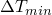 是总步骤时间的10⁻⁵倍。默认情况下，Abaqus/Standard对增量大小 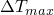 没有上限，除了总步骤时间。根据您的Abaqus/Standard模拟，您可能需要指定不同的最小和/或最大允许增量大小。例如，如果您知道如果施加太大的载荷增量，模拟可能会有困难（可能是因为模型可能发生塑性变形），您可能希望减小 。

如果增量在少于五次迭代中收敛，这表明解相对容易找到。因此，如果连续两个增量需要少于五次迭代才能获得收敛解，Abaqus/Standard自动将增量大小增加50%。

自动载荷增量控制方案的详细信息在 **Job Diagnostics** 对话框中给出，在第8.4.2节"作业诊断"中有更详细的展示。

---

## 8.3 在Abaqus分析中包含非线性

我们现在讨论如何在Abaqus分析中考虑非线性。主要关注点是几何非线性。

### 8.3.1 几何非线性

在分析中包含几何非线性效应只需要对Abaqus/Standard模型进行很小的更改。您需要确保步骤定义考虑几何非线性效应。这在Abaqus/Explicit中是默认设置。您还需要设置时间增量参数，如第8.2.3节"Abaqus/Standard中的自动增量控制"中所讨论。

**局部方向**

在几何非线性分析中，局部材料方向可能随每个单元中的变形而旋转。对于壳、梁和桁架单元，局部材料方向始终随变形而旋转。对于实体单元，局部材料方向仅在单元引用非默认局部材料方向时才随变形而旋转；否则，默认局部材料方向在整个分析中保持不变。

在节点处定义的方向在整个分析中保持固定；它们不随变形而旋转。

**对后续步骤的影响**

一旦您在步骤中包含几何非线性，它将在所有后续步骤中被考虑。如果在后续步骤中未请求非线性几何效应，Abaqus将发出警告，指出它们无论如何都会被包含在该步骤中。

**其他几何非线性效应**

当激活几何非线性时，模型中的大变形并不是唯一要考虑的重要效应。Abaqus/Standard还在单元刚度计算中包含由施加载荷引起的项，即所谓的载荷刚度。这些项改善收敛行为。此外，壳中的膜载荷以及缆索和梁中的轴向载荷对横向载荷响应的刚度有很大贡献。通过包含几何非线性，横向载荷响应的膜刚度也被考虑。

### 8.3.2 材料非线性

向Abaqus模型添加材料非线性在第10章"材料"中讨论。

### 8.3.3 边界非线性

边界非线性的介绍在第12章"接触"中讨论。

---

## 8.4 示例：非线性斜板

本示例是第5章"使用壳单元"中描述的线性斜板模拟的延续（如图8-11所示）。您现在将在Abaqus/Standard中重新分析板以包含几何非线性的影响。此分析的结果将使您能够确定几何非线性效应的的重要性，从而确定线性分析的有效性。

**图8-11** 斜板。

Abaqus提供了复制此问题完整分析模型的脚本。如果您遇到困难或希望检查工作，可以运行这些脚本。脚本位于以下位置：

- 本示例的Python脚本在"非线性斜板"（第A.6节）中提供。
- 本示例的插件脚本可在Abaqus/CAE插件工具集中找到。

### 8.4.1 模型修改

打开模型数据库文件 `SkewPlate.cae`。将名为 `Linear` 的模型复制到名为 `Nonlinear` 的模型。

对于 `Nonlinear` 斜板模型，您将包含非线性几何效应以及更改输出请求。

**定义步骤**

在模型树中，双击 **Steps** 容器下的 **Apply Pressure** 步骤以编辑步骤定义。在 **Edit Step** 对话框的 **Basic** 选项卡页面中，打开 **Nlgeom** 以包含几何非线性效应，并确保步骤的时间周期设置为 `1.0`。在 **Incrementation** 选项卡页面中，设置初始增量大小为 `0.1`。默认最大增量数为 `100`；Abaqus可能使用的增量数少于这个上限，但如果需要更多增量，它将停止分析。

**输出控制**

在线性分析中，Abaqus求解一次平衡方程并计算此解的结果。非线性分析可以产生更多输出，因为可以在每个收敛增量结束时请求结果。如果您不正确选择输出请求，输出文件会变得非常大，可能占满您计算机上的磁盘空间。

输出有四种不同文件：

- 输出数据库（.odb）文件，包含以中立二进制格式表示的数据，用于使用Abaqus/CAE后处理结果；
- 数据（.dat）文件，包含所选结果的打印表格（仅在Abaqus/Standard中可用）；
- 重启（.res）文件，用于继续分析；
- 结果（.fil）文件，用于与第三方后处理器配合使用。

打开 **Field Output Requests Manager**。在对话框右侧，点击 **Edit** 打开场输出编辑器。删除为线性分析模型定义的场输出请求，并通过在 **Output Variables** 下选择 **Preselected defaults** 来指定默认场输出请求。

为减少输出数据库文件的大小，每隔一个增量写入场输出。如果您只对最终结果感兴趣，可以选择 **Last increment** 或将保存输出的频率设置为一个很大的数字。结果总是在每个步骤结束时保存，无论指定的值如何；因此，使用较大的值只会保存最终结果。

**运行和监控作业**

为名为 `Nonlinear` 的模型创建名为 `NlSkewPlate` 的作业，并给出描述 `Nonlinear Elastic Skew Plate`。记得将模型保存在新的模型数据库文件中。

提交作业进行分析，并监控解决方案进度。如果遇到错误，请纠正；如果发出任何警告消息，调查其来源并在必要时采取纠正措施。

图8-12显示了这个非线性斜板模拟的 **Job Monitor** 内容。

**图8-12** **Job Monitor**：非线性斜板分析。

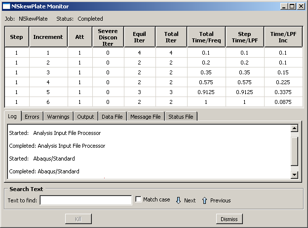

此示例显示Abaqus/Standard如何自动控制增量大小，从而控制每个增量中施加的载荷比例。在此分析中，Abaqus/Standard在第一个增量中施加了总载荷的10%：您指定  为0.1，步骤时间为1.0。Abaqus/Standard在第一个增量中需要四次迭代才能收敛到解。Abaqus/Standard在第二个增量中只需要两次迭代，因此自动将下一个增量大小增加50%至  = 0.15。Abaqus/Standard还在第四和第五增量中增加了 。它调整最终增量大小以刚好完成分析；在本例中最终增量大小为0.0875。

### 8.4.2 作业诊断

除了允许您监控分析作业进度外，Abaqus/CAE还提供了视觉诊断工具来帮助您理解作业的收敛行为并在必要时调试模型。Abaqus/Standard在输出数据库中存储每个步骤、增量、尝试和迭代的分析诊断信息。

进入 **Visualization** 模块，打开输出数据库文件 `NlSkewPlate.odb` 以检查收敛历史。从主菜单栏选择 **Tools → Job Diagnostics** 打开 **Job Diagnostics** 对话框。点击 **Job History** 列表中的"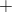"符号以展开列表以包括分析作业中的步骤、增量、尝试和迭代。例如，在 **Increment 1** 下选择 **Attempt 1**，如图8-13所示。

**图8-13** 第一个增量第一次尝试的摘要信息。

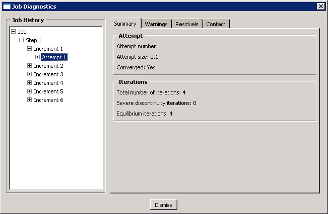

**Attempt** 信息包含基本信息，如增量大小；**Iterations** 信息包含尝试的迭代次数。选择此尝试的 **Iteration 1** 以查看第一次迭代的详细信息。**Summary** 选项卡页面上的信息告诉您该迭代中未达到收敛，因此点击 **Residuals** 选项卡以了解原因。

如图8-14所示，**Residuals** 选项卡页面显示模型中平均力  和时间平均力  的值。它还显示最大残差力 、最大位移增量  和最大位移修正 ，以及发生这些值的节点和自由度（DOF）。可以通过切换 **Highlight selection in viewport** 来在视口中高亮显示模型中发生任何这些值的位置。

**图8-14** 第一次迭代的力残差信息。

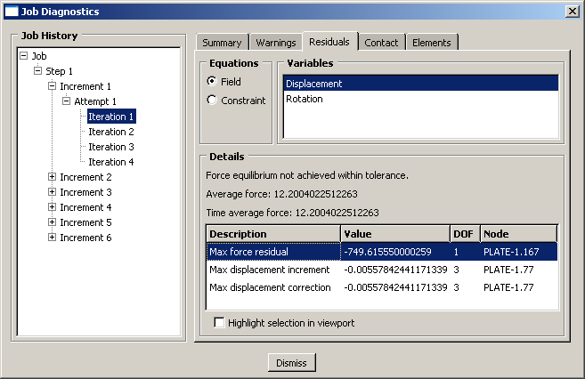

在第一次迭代中，初始时间增量为0.1，如步骤定义中所指定。增量的平均力为12.2 N；时间平均力  具有相同的值，因为这是第一个增量。模型中最大的残差力  为-749.6 N，显然大于0.005 × 。 发生在自由度1的节点167处。Abaqus/Standard还必须检查模型中力矩的平衡，因为此模型包括壳单元。

第二次迭代的残差信息如图8-15所示。

**图8-15** 第二次迭代的力残差信息。

在第二次迭代中， 下降到自由度1的节点167处的-0.173 N。然而，由于0.005 × （其中  = 1.00 N）仍小于 ，因此该迭代中未达到平衡。位移修正准则也再次失败。

在第二次迭代中，力矩残差检查和最大旋转修正检查都满足了；但是，由于解未通过力残差检查（或最大位移修正准则），Abaqus/Standard必须再执行两次迭代以获得第一个增量中的解。第一次增量所需迭代的额外残差信息如图8-16和图8-17所示。

**图8-16** 第三次迭代的力残差信息。

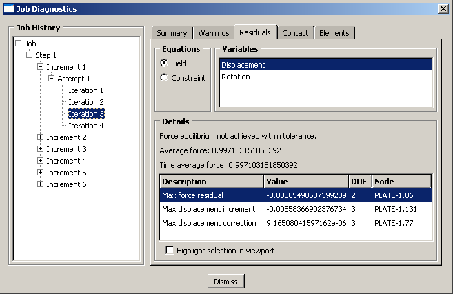

**图8-17** 第四次迭代的力残差信息。

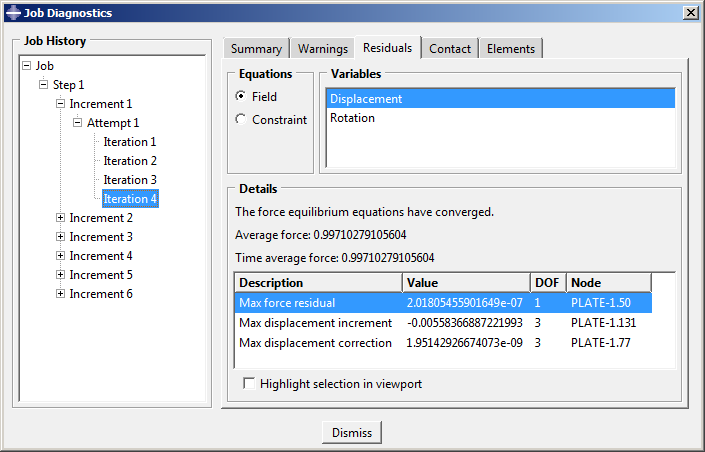

第四次迭代后， = 0.997 N，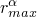 = 1.794 × 10⁻⁷ N（在自由度1的节点76处）。这些值满足  < 0.005 × ，因此力残差检查满足。将  与最大位移增量进行比较，表明位移修正低于所需容差。因此，力和位移的解已收敛。力矩残差和旋转修正的检查继续满足，如同自第二次迭代以来的情况。由于所有变量（在本例中为位移和旋转）的平衡都已满足，第一个载荷增量完成。

Abaqus/Standard继续此过程，即施加载荷增量然后迭代找到解，直到完成整个分析（或达到您指定的最大增量）。在此分析中，它需要五个增量。步骤摘要如图8-18所示。

**图8-18** 分析步骤摘要。

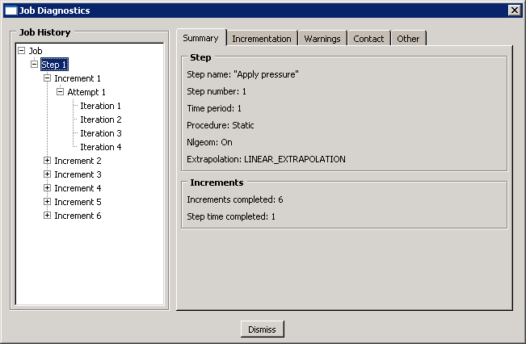

### 8.4.3 后处理

**显示可用帧**

确定可用输出帧（结果写入输出数据库的增量间隔）。

**显示变形和未变形模型形状**

使用 **Allow Multiple Plot States** 工具显示与未变形模型形状叠加的变形模型形状。获得与图8-20相似的图。

**图8-20** 斜板的变形和未变形模型形状。

**X–Y 绘图**

您将中跨节点（节点集合 `Midspan`）的位移保存为模拟每个增量的历史输出。您可以使用这些结果创建 *X–Y* 绘图。特别是，您将绘制位于板中跨边缘的节点垂直位移历史。

**图8-21** 斜板中跨边缘处的位移历史。

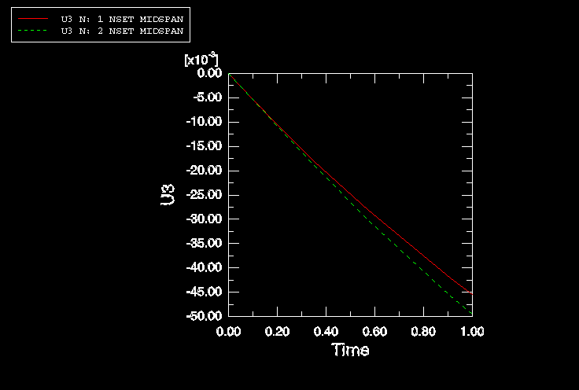

从这些曲线可以清楚地看到此模拟的非线性特性：随着分析的进行，板变得刚硬。在此模拟中，板刚度随变形的增加是由于膜效应。因此，峰值位移小于线性分析的预测值，后者未包含此效应。

**表格数据**

创建中跨位移的表格数据报告。将这些与第5章"使用壳单元"中线性分析的位移进行比较。在此模拟中，中跨处的最大位移比从线性分析预测的值小约9%。在模拟中包含非线性几何效应可减少板中跨的垂直挠度（U3）。

### 8.4.4 在Abaqus/Explicit中运行分析

作为可选练习，您可以修改模型并在Abaqus/Explicit中运行斜板的动态分析。为此，您必须在材料定义中添加7800 kg/m³的密度，将现有步骤替换为显式动态步骤，并将单元库更改为 **Explicit**。

---

## 8.5 相关Abaqus示例

- "在平面内弯曲和内压下薄壁弯头的弹塑性崩溃"，Abaqus示例问题指南第1.1.2节
- "层合复合壳：带圆孔圆柱面板的屈曲"，Abaqus示例问题指南第1.2.2节
- "不稳定静态问题：压缩载荷下的加强板"，Abaqus示例问题指南第1.2.5节
- "单自由度系统的大旋转"，Abaqus基准指南第1.3.5节
- "张力下缆索的振动"，Abaqus基准指南第1.4.3节

---

## 8.6 推荐阅读

以下参考资料提供了非线性有限元方法的更多信息：

**非线性有限元分析的一般文本**

- Belytschko, T., W. K. Liu, and B. Moran, *Nonlinear Finite Elements for Continua and Structures*, Wiley & Sons, 2000.
- Bonet, J., and R. D. Wood, *Nonlinear Continuum Mechanics for Finite Element Analysis*, Cambridge, 1997.
- Cook, R. D., D. S. Malkus, and M. E. Plesha, *Concepts and Applications of Finite Element Analysis*, Wiley & Sons, 1989.
- Crisfield, M. A., *Non-linear Finite Element Analysis of Solids and Structures, Volume I: Essentials*, Wiley & Sons, 1991.
- Crisfield, M. A., *Non-linear Finite Element Analysis of Solids and Structures, Volume II: Advanced Topics*, Wiley & Sons, 1997.
- E. Hinton (editor), *NAFEMS Introduction to Nonlinear Finite Element Analysis*, NAFEMS Ltd., 1992.
- Oden, J. T., *Finite Elements of Nonlinear Continua*, McGraw-Hill, 1972.

---

## 8.7 小结

- 结构问题中存在三类非线性：材料、几何和边界（接触）。Abaqus分析中可能存在这些的任何组合。
- 每当位移的大小影响结构的响应时，就会发生几何非线性。它包括大位移和旋转、突跳和载荷刚化效应。
- 在Abaqus/Standard中，非线性问题是使用Newton-Raphson方法迭代求解的。非线性问题将需要比线性问题多很多的计算机资源。
- Abaqus/Explicit不需要迭代来获得解；但是，由于几何大变化导致的稳定时间增量减少可能会影响计算成本。
- 非线性分析步骤被分成若干增量。
  - Abaqus/Standard迭代以找到每个新载荷增量结束时获得的近似静力平衡。Abaqus/Standard通过在整个模拟中使用收敛控制来控制载荷增量。
  - Abaqus/Explicit通过使用比隐式分析中更小的时间增量将运动状态从一个增量推进到下一个来确定解。增量大小受稳定时间增量的限制。默认情况下，Abaqus/Explicit中时间增量完全是自动的。
- **Job Monitor** 对话框允许在分析运行时监控其进度。**Job Diagnostics** 对话框包含载荷增量和迭代的详细信息。
- 可以在每个收敛增量结束时保存结果，以便在 **Visualization** 模块中查看结构响应的演变。还可以将结果绘制为 *X–Y* 图形。
