# 第9章 非线性显式动力学

## 目录

- [9.1 适合Abaqus/Explicit的问题类型](#91-适合abaqusexplicit的问题类型)
- [9.2 显式动态有限元方法](#92-显式动态有限元方法)
  - [9.2.1 显式时间积分](#921-显式时间积分)
  - [9.2.2 隐式和显式时间积分过程的比较](#922-隐式和显式时间积分过程的比较)
  - [9.2.3 显式时间积分方法的优点](#923-显式时间积分方法的优点)
- [9.3 自动时间增量和稳定性](#93-自动时间增量和稳定性)
  - [9.3.1 显式方法的条件稳定性](#931-显式方法的条件稳定性)
  - [9.3.2 稳定性限制的定义](#932-稳定性限制的定义)
  - [9.3.3 Abaqus/Explicit中完全自动时间增量与固定时间增量的比较](#933-abaqusexplicit中完全自动时间增量与固定时间增量的比较)
  - [9.3.4 质量缩放以控制时间增量](#934-质量缩放以控制时间增量)
  - [9.3.5 材料对稳定性限制的影响](#935-材料对稳定性限制的影响)
  - [9.3.6 网格对稳定性限制的影响](#936-网格对稳定性限制的影响)
  - [9.3.7 数值不稳定](#937-数值不稳定)
- [9.4 示例：杆中的应力波传播](#94-示例杆中的应力波传播)
  - [9.4.1 预处理——使用Abaqus/CAE创建模型](#941-预处理使用abaquscae创建模型)
  - [9.4.2 后处理](#942-后处理)
  - [9.4.3 网格如何影响稳定时间增量和CPU时间](#943-网格如何影响稳定时间增量和cpu时间)
  - [9.4.4 材料如何影响稳定时间增量和CPU时间](#944-材料如何影响稳定时间增量和cpu时间)
- [9.5 动态振荡的阻尼](#95-动态振荡的阻尼)
  - [9.5.1 体积粘性](#951-体积粘性)
  - [9.5.2 粘性压力](#952-粘性压力)
  - [9.5.3 材料阻尼](#953-材料阻尼)
  - [9.5.4 离散阻尼器](#954-离散阻尼器)
- [9.6 能量平衡](#96-能量平衡)
  - [9.6.1 能量平衡声明](#961-能量平衡声明)
  - [9.6.2 能量平衡的输出](#962-能量平衡的输出)
- [9.7 小结](#97-小结)

---

## 9.1 适合Abaqus/Explicit的问题类型

在讨论显式动力学过程如何工作之前，了解哪些类型的问题非常适合Abaqus/Explicit是有帮助的。在本指南中，我们纳入了以下常用类型的Abaqus/Explicit分析的适当示例：

**高速动态事件**

显式动力学方法最初是为分析可能使用隐式程序（如Abaqus/Standard）极其昂贵的高速动态事件而开发的。例如此类模拟的一个例子是分析短期爆炸载荷对钢板的影响。由于载荷施加快速且非常剧烈，结构响应变化迅速。准确追踪通过板的应力波对于捕捉动态响应很重要。由于应力波与系统的最高频率相关，获得准确解决方案需要许多小时间增量。

**复杂接触问题**

使用显式动力学方法比使用隐式方法更容易公式化接触条件。结果是Abaqus/Explicit可以容易地分析涉及许多独立体之间复杂接触相互作用的问题。Abaqus/Explicit特别适合分析承受碰撞载荷并随后在结构内发生复杂接触相互作用的结构的瞬态动态响应。此类问题的一个例子是电路板跌落测试，在第12章"接触"中给出。在此示例中，放在泡沫包装中的电路板从1米高度跌落到地面。该问题涉及包装与地面之间的碰撞，以及电路板与包装之间快速变化的接触条件。

**复杂后屈曲问题**

不稳定的后屈曲问题在Abaqus/Explicit中很容易求解。在此类问题中，随着载荷的施加，结构刚度发生剧烈变化。后屈曲响应通常包括接触相互作用效应。

**高度非线性准静态问题**

由于各种原因，Abaqus/Explicit在求解某些本质上属于静态的问题时通常非常高效。涉及复杂接触的准静态过程模拟问题（如锻造、轧制和板材成型）通常属于这些类别。板材成型问题通常包括非常大的膜变形、起皱和复杂摩擦接触条件。体积成型问题的特征是大变形、飞边形成以及与模具的接触相互作用。准静态成型模拟的示例在第13章"使用Abaqus/Explicit进行准静态分析"中给出。

**材料的退化和失效**

材料的退化和失效通常会在隐式分析程序中导致严重的收敛困难，但Abaqus/Explicit很好地模拟此类材料。材料退化的一个例子是混凝土开裂模型，其中拉伸开裂导致材料刚度变为负。材料失效的一个例子是金属的延性失效模型，其中材料刚度可以退化直到降低到零。在那时，失效的单元从模型中完全移除。

每种这些类型的分析都可以包括温度和热传递效应。

---

## 9.2 显式动态有限元方法

本节包含Abaqus/Explicit求解器的算法描述，以及隐式和显式时间积分之间的比较，以及显式动力学方法优点的讨论。

### 9.2.1 显式时间积分

Abaqus/Explicit使用中心差分规则通过时间显式地积分运动方程，使用一个增量的运动条件计算下一增量的运动条件。在增量开始时，程序求解动态平衡，其表明节点质量矩阵  乘以节点加速度  等于净节点力（外施力  与内部单元力  之间的差）：


在当前增量开始时（时间 ）计算加速度：


由于显式过程始终使用对角的或集中的质量矩阵，求解加速度是简单的；没有联立方程要解。任何节点的加速度完全由其质量和作用在其上的净力决定，使节点计算非常便宜。

使用中心差分规则通过时间积分加速度，该规则假设加速度是恒定的来计算速度变化。将此速度变化加到前一增量中间的速度以确定当前增量中间的速度：


通过时间积分速度，并将其加到增量开始时的位移以确定增量结束时的位移：


因此，在增量开始时满足动态平衡提供了加速度。知道加速度，速度和位移被显式地通过时间推进。术语"显式"指的是增量结束时的状态完全基于增量开始时的位移、速度和加速度。该方法精确地积分恒定加速度。为了产生准确结果，时间增量必须相当小，以便加速度在增量期间几乎恒定。由于时间增量必须很小，分析通常需要数千个增量。幸运的是，每个增量都是便宜的，因为没有联立方程要解。大部分计算费用在于单元计算，以确定作用在节点上的单元内力。单元计算包括确定单元应变和应用材料本构关系（单元刚度）以确定单元应力，从而确定内力。

以下是显式动力学算法的总结：

1. **节点计算**
   - (a) 动态平衡：
   - (b) 通过时间显式积分：
       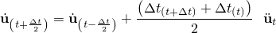
       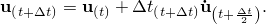

2. **单元计算**
   - (a) 从应变率  计算单元应变增量 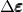。
   - (b) 从本构方程计算应力 ：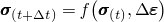
   - (c) 组装节点内力 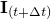。

3. 设置  为  并返回步骤1。

### 9.2.2 隐式和显式时间积分过程的比较

对于隐式和显式时间积分过程，平衡都用外施力 、内部单元力  和节点加速度来定义：

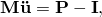

其中  是质量矩阵。两种过程都求解节点加速度，并使用相同的单元计算来确定内部单元力。两种过程之间的最大区别在于节点加速度的计算方式。在隐式过程中，通过直接解法求解一组线性方程组。当与显式方法的相对便宜的节点计算成本相比时，求解这组方程的高成本是显著的。

Abaqus/Standard使用基于完整Newton迭代解方法的自动增量。Newton方法寻求在增量结束时（时间 ）满足动态平衡，并在同一时间计算位移。时间增量  与显式方法使用的相比相对较大，因为隐式方案是无条件稳定的。对于非线性问题，每个增量通常需要多次迭代才能在规定的容差内获得解。每次Newton迭代求解增量位移 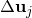 的修正 。每次迭代都需要求解一组联立方程：

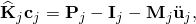

对于大型模型，这些方程求解器要求是dominant over the requirements of the element and material calculations，这是显式分析中所需的。对于平滑的非线性响应，Newton方法具有二次收敛率。然而，如果模型包含高度不连续的过程（如接触和摩擦滑动），可能会失去二次收敛，并且可能需要大量迭代。可能需要削减时间增量大小以满足平衡。在极端情况下，隐式分析中的时间增量大小可能与显式分析的典型稳定时间增量相同，同时仍携带隐式迭代的高求解成本。在某些情况下，使用隐式方法可能无法收敛。

隐式分析中的每次迭代都需要求解大型线性方程组，这需要大量计算、磁盘空间和内存。随着问题规模增加，方程求解器要求增长非常快，以至于实际上，在给定机器上可以求解的隐式分析的最大规模往往由机器上可用的磁盘空间和内存量决定，而不是所需的计算时间。

### 9.2.3 显式时间积分方法的优点

显式方法特别适合求解需要许多小增量以获得高分辨率解的高速动态事件。如果事件持续时间短，可以有效地获得解决方案。

接触条件和其他极度不连续的事件很容易在显式方法中公式化，可以逐节点强制执行而无需迭代。节点加速度可以调整以在接触期间平衡外部和内部力。

显式方法最显著的特点是不需要全局切线刚度矩阵，这是隐式方法所必需的。由于模型状态是显式推进的，因此不需要迭代和容差。

---

## 9.3 自动时间增量和稳定性

稳定性限制决定了Abaqus/Explicit求解器使用的最大时间增量。这是Abaqus/Explicit性能的关键因素。以下部分描述了稳定性限制并讨论了Abaqus/Explicit如何确定此值。还讨论了影响稳定性限制的模型设计参数。这些模型参数包括模型质量、材料和网格。

### 9.3.1 显式方法的条件稳定性

使用显式方法，模型的状态通过时间增量  推进，基于增量开始时时间  处的模型状态。可以推进状态的时间量并保持作为问题的准确表示的量通常相当短。如果时间增量大于此最大时间量，增量被称为已超过**稳定性限制**。超过稳定性限制的可能影响是数值不稳定，可能导致无界解。通常不可能精确确定稳定性限制，因此使用保守估计。稳定性限制对可靠性和准确性有很大影响，因此必须一致且保守地确定。为了计算效率，Abaqus/Explicit选择时间增量以尽可能接近稳定性限制而不超过它。

### 9.3.2 稳定性限制的定义

稳定性限制用系统中的最高频率（）来定义。无阻尼时，稳定性限制由下式定义：

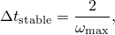

有阻尼时，由下式定义：


其中 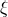 是具有最高频率的模态中临界阻尼的分数。（回想一下，临界阻尼定义了自由阻尼振动中振荡和非振荡运动之间的极限。Abaqus/Explicit始终以体积粘性的形式引入少量阻尼来控制高频振荡。）与工程直觉相反，阻尼总是降低稳定性限制。

系统中实际的最高频率基于一组复杂的相互作用因子，计算其精确值在计算上是不可行的。作为替代，我们使用一个简单、高效且保守的估计。不是看整体模型，而是估计模型中每个单独单元的最高频率，这始终与膨胀模态相关。可以证明，基于逐单元确定的最高单元频率始终高于组装有限元模型中的最高频率。

基于逐单元估计，稳定性限制可以使用单元长度  和材料中的波速  重新定义：

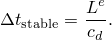

对于大多数单元类型——例如扭曲的四边形单元——上述方程只是实际逐单元稳定性限制的估计，因为不清楚如何确定单元长度。作为近似，可以使用最短单元距离，但结果并不总是保守的。单元长度越短，稳定性限制越小。波速是材料的属性。对于泊松比为零的线性弹性材料：


其中  是杨氏模量， 是质量密度。材料越硬，波速越高，导致稳定性限制越小。密度越高，波速越低，导致稳定性限制越大。

简化的稳定性限制定义提供了一些直观理解。稳定性限制是膨胀波穿过由特征单元长度定义的距离的传播时间。如果我们知道最小单元尺寸和材料的波速，我们可以估计稳定性限制。例如，如果最小单元尺寸为5 mm，膨胀波速为5000 m/s，稳定时间增量约为1 × 10⁻⁶ s。

### 9.3.3 Abaqus/Explicit中完全自动时间增量与固定时间增量的比较

Abaqus/Explicit使用前面讨论的方程来调整整个分析中的时间增量大小，以便基于模型的当前状态永远不超过稳定性限制。时间增量是自动的，不需要用户干预，甚至不需要建议初始时间增量。稳定性限制是一个数学概念，源于数值模型。由于有限元程序具有所有相关细节，它可以获得有效且保守的稳定性限制。但是，如果需要，Abaqus/Explicit允许用户覆盖自动时间增量。

显式分析中使用的时间增量必须小于中心差分算子的稳定性限制。如果不使用足够小的时间增量，将导致不稳定解。当解变得不稳定时，位移等解变量的时间历史响应通常会以增大的幅度振荡。总能量平衡也将显著改变。如果模型只包含一种材料类型，初始时间增量与网格中最小单元的大小成正比。如果网格包含均匀大小的单元但包含多种材料描述，具有最高波速的单元将决定初始时间增量。

在非线性问题——具有大变形和/或非线性材料响应的问题——中，模型的最高频率将不断变化，从而改变稳定性限制。Abaqus/Explicit有两种时间增量控制策略：完全自动时间增量（代码考虑稳定性限制的变化）和固定时间增量。

两种类型的估计用于确定稳定性限制：逐单元和全局。分析始终从使用逐单元估计方法开始，并且可能在某些情况下切换到全局估计方法。

逐单元估计是保守的；它将给出比基于整个模型最大频率的真实稳定性限制更小的稳定时间增量。一般来说，边界条件和解学接触等约束具有压缩特征谱的效果，而逐单元估计没有考虑这一点。

自适应全局估计算法使用当前膨胀波速确定整个模型的最大频率。该算法持续更新最大频率的估计。全局估计器通常允许超过逐单元值的时间增量。

固定时间增量方案在Abaqus/Explicit中也可用。固定时间增量大小由步骤的初始逐单元稳定性估计或由用户直接指定的时间增量决定。当需要更准确地表示问题的高阶模态响应时，固定时间增量可能有用。在这种情况下，可以使用比逐单元估计更小的时间增量。当使用固定时间增量时，Abaqus/Explicit将不检查响应在步骤期间是否稳定。用户应仔细检查能量历史和其他响应变量以确保获得有效响应。

### 9.3.4 质量缩放以控制时间增量

由于质量密度影响稳定性限制，在某些情况下缩放质量密度可能会提高分析效率。例如，由于许多模型的复杂离散化，通常存在包含非常小或形状不良单元的区域，这些单元控制稳定性限制。这些控制单元通常数量很少，可能存在于局部区域。通过仅增加这些控制单元的质量，可以显著增加稳定性限制，而对模型整体动态行为的影响可以忽略不计。

Abaqus/Explicit中的自动质量缩放功能可以防止有害单元阻碍稳定性限制。质量缩放中有两种基本方法：直接定义缩放因子或为要缩放质量的单元定义所需的逐单元稳定时间增量。这两种方法允许用户对稳定性限制进行额外控制。但是，使用质量缩放时要小心，因为显著改变模型质量可能会改变问题的物理特性。

### 9.3.5 材料对稳定性限制的影响

材料模型通过其对膨胀波速的影响影响稳定性限制。在线性材料中，波速是恒定的；因此，分析期间稳定性限制的唯一变化来自分析过程中最小单元尺寸的变化。在非线性材料中（如具有塑性的金属），当材料屈服且材料刚度变化时，波速会发生变化。Abaqus/Explicit在整个分析中监测模型中的有效波速，并使用每个单元中当前的材料状态进行稳定性估计。屈服后，刚度降低，波速降低，从而稳定性限制增加。

### 9.3.6 网格对稳定性限制的影响

由于稳定性限制大致与最短单元尺寸成正比，因此保持单元尺寸尽可能大是有利的。不幸的是，为了准确分析，通常需要细网格。为了在使用所需网格细化水平的同时获得尽可能高的稳定性限制，最好的方法是使网格尽可能均匀。由于稳定性限制基于模型中的最小单元尺寸，即使一个小的或形状不良的单元也可能极大地降低稳定性限制。为了诊断目的，Abaqus/Explicit在状态（.sta）文件中提供了网格中稳定性限制最低的10个单元的列表。如果模型中某些单元的稳定性限制远低于其余网格，重新网格化模型使其更均匀可能是值得的。

### 9.3.7 数值不稳定

Abaqus/Explicit在大多数情况下的大多数单元中保持稳定。但是，可以定义弹簧和阻尼器单元，使它们在分析过程中变得不稳定。因此，如果分析中出现数值不稳定，能够识别它是很有用的。如果确实发生，结果通常是无限的、非物理的，通常以振荡解为特征。

---

## 9.4 示例：杆中的应力波传播

本示例演示了前面在第2章"Abaqus基础"中描述的显式动力学中的一些基本思想。它还说明了稳定性限制以及网格细化和材料特性对求解时间的影响。

杆具有图9-1所示的尺寸。为了使问题成为一维应变问题，所有四个侧面都在滚子上；因此，三维模型模拟一维问题。材料是钢，特性如图9-1所示。杆的自由端承受大小为1.0 × 10⁵ Pa、持续时间为3.88 × 10⁻⁵ s的爆炸载荷。归一化载荷与时间的关系如图9-2所示。

**图9-1** 杆中波传播的示意图。


**图9-2** 爆炸振幅与时间的关系。


### 9.4.1 预处理——使用Abaqus/CAE创建模型

**定义模型几何**

创建一个名为 `Bar` 的新零件，使用默认设置：三维、可变形体、实体、挤压基础特征。使用图9-3给出的尺寸绘制杆的横截面。横截面为0.20 m高 × 0.20 m宽。输入挤压深度为 `1.0` m。

**图9-3** 矩形横截面。

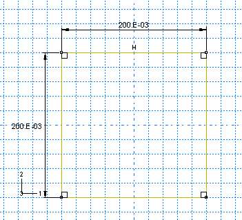

**定义材料和截面属性**

创建一个名为 `Steel` 的单一线性弹性材料，质量密度为 `7800` kg/m³，杨氏模量为 `207E9` Pa，泊松比为 `0.3`。

创建一个名为 `BarSection` 的实体、均匀截面定义，材料为 **Steel**。

将截面定义 `BarSection` 分配给整个零件。

**创建装配**

创建杆的实例。模型默认方向使全局3轴沿杆的长度方向。

**创建几何集合和曲面**

创建如图9-4所示的几何集合 `TOP`、`BOT`、`FRONT`、`BACK`、`FIX` 和 `OUT`。创建图9-5所示的名为 `LOAD` 的曲面。

**图9-4** 集合。

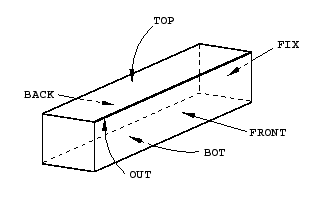

**图9-5** 曲面。

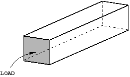

**定义步骤**

创建一个名为 `BlastLoad` 的动态、显式步骤。输入步骤描述为 `Apply pressure load pulse`，并将 **Time period** 设置为 `2.0E-4` s。在 **Edit Step** 对话框中，点击 **Other** 选项卡。为了使应力波尽可能尖锐，将 **Quadratic bulk viscosity parameter** 设置为零。

**指定输出请求**

编辑默认场输出请求，以便在 `BlastLoad` 步骤的四个等间隔间隔将预选场数据写入输出数据库。

删除现有的默认历史输出请求，并创建一组新的历史输出请求。创建历史输出请求，选择集合 `OUT`，并切换 **S33** 变量（杆轴向方向的应力分量）。指定每增量保存输出。

**规定边界条件**

创建名为 `Fix right end` 的边界条件，并将杆的右端（几何集合 `FIX`）在所有三个方向上约束。创建额外的边界条件，以在垂直于这些面的方向上约束顶面、底面，前后侧面。

**定义载荷历史**

爆炸载荷以最大值瞬间施加，并在3.88 × 10⁻⁵ s内保持恒定。然后载荷突然移除并保持在零。创建一个名为 `Blast` 的振幅定义，使用图9-6中所示的数据。

**图9-6** 爆炸载荷振幅定义的表格数据。

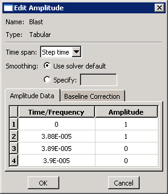

创建一个名为 `Blast load` 的压力载荷，选择 `BlastLoad` 作为将施加载荷的步骤。将载荷应用到曲面 `LOAD`。选择 **Uniform** 分布，指定载荷大小为 `1.0E5` Pa，并为振幅选择 `Blast`。

**创建网格**

使用材料特性（忽略泊松比），我们可以使用前面介绍的方程计算材料的波速：


在此速度下，波在1.94 × 10⁻⁴ s内传到杆的固定端。由于我们感兴趣的是应力沿杆长度方向随时间的传播，我们需要足够细的网格来准确捕获应力波。我们将假设爆炸载荷将跨越10个单元进行。为确定这10个单元的长度，将爆炸持续时间乘以波速：

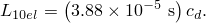

10个单元的长度为0.2 m。由于杆的总长度为1.0 m，沿长度方向将有50个单元。为保持网格均匀，我们还将在两个横向方向上各设置10个单元，使网格为50 × 10 × 10。此网格如图9-7所示。

**图9-7** 50 × 10 × 10网格。


使用 `0.02` 的目标全局单元尺寸从 **Explicit** 库中选择C3D8R作为单元类型，并对零件进行网格划分。

**状态（.sta）文件**

```
    Most critical elements:
        Element number   Rank    Time increment   Increment ratio
    (Instance name)
       ----------------------------------------------------------
              1          1       2.237266E-06      1.000000E+00
       BAR-1
```

### 9.4.2 后处理

**沿路径绘制应力**

我们感兴趣的是查看沿杆长度方向的应力分布如何随时间变化。为此，我们将查看分析过程中三个不同时间的应力分布。

沿杆中心创建点列表路径。然后为输出数据库文件的前三帧创建沿该路径的3方向应力（S33）变化曲线。

**图9-9** 三个不同时间沿杆的应力（S33）。


我们可以看到，三个曲线中受应力波影响的长度约为0.2 m。该距离应与爆炸波在施加期间传播的距离相对应，可以通过简单计算进行检查。如果波前长度为0.2 m，波速为5.15 × 10³ m/s，波传播0.2 m所需时间为3.88 × 10⁻⁵ s。正如我们所料，这与爆炸载荷的持续时间相同。应力波在沿杆传播时并不完全是方的。特别是，在应力突变后面有"振荡"或振荡。线性体积粘性（本章后面讨论）阻尼振荡，使其不会对结果产生不利影响。

**创建历史绘图**

另一种研究结果的方法是查看杆内三个不同点处应力的时间历史；例如，在距载荷端0.25 m、0.50 m和0.75 m处。

**图9-11** 沿杆长度三个点处（0.25 m、0.5 m和0.75 m）应力（S33）的时间历史。


在历史绘图中，我们可以看到，当应力波通过给定点时，该点的应力增加。一旦应力波完全通过该点，该点的应力在零附近振荡。

### 9.4.3 网格如何影响稳定时间增量和CPU时间

表9-1显示了此问题网格细化如何改变CPU时间（相对于粗网格模型结果归一化）。

**表9-1** 网格细化和求解时间。

| 网格 | 简化理论 | 实际 |
|------|---------|------|
| | Δt (s) | 元素数量 | CPU时间 (s) | 最大Δt (s) | 元素数量 | 归一化CPU时间 |
| 25 × 5 × 5 | A | B | C | 5.754E-06 | 625 | 1 |
| 50 × 5 × 5 | A/2 | 2B | 4C | 2.954E-06 | 1250 | 4 |
| 50 × 10 × 5 | A/2 | 4B | 8C | 2.933E-06 | 2500 | 8.33 |
| 50 × 10 × 10 | A/2 | 8B | 16C | 2.907E-06 | 5000 | 16.67 |

对于理论结果，我们选择最粗的网格25 × 5 × 5作为基态，并将稳定时间增量、单元数量和CPU时间定义为变量A、B和C。随着网格细化，两件事发生：最小单元尺寸减小，网格中单元数量增加。每个这些效应都会增加CPU时间。

这个简化计算很好地预测了网格细化如何影响稳定时间增量和CPU时间的趋势。

### 9.4.4 材料如何影响稳定时间增量和CPU时间

在不同材料上执行的相同波传播分析将需要不同的CPU时间，具体取决于材料的波速。例如，如果我们将材料从钢改为铝，波速将从5.15 × 10³ m/s变为：


从铝到钢的变化对稳定时间增量的影响很小，因为刚度和密度差异几乎相同。对于铅，差异更显著，波速降低到：

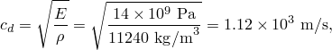

约为钢波速的五分之一。铅杆的稳定时间增量将是我们钢杆稳定时间增量的五倍。

---

## 9.5 动态振荡的阻尼

向模型添加阻尼有两个原因：限制数值振荡或向系统添加物理阻尼。Abaqus/Explicit提供了几种向分析引入阻尼的方法。

### 9.5.1 体积粘性

体积粘性引入与体积应变相关的阻尼。其目的是改善高速动态事件的建模。Abaqus/Explicit包含线性和二次形式的体积粘性。

**线性体积粘性**

默认情况下，线性体积粘性始终包含以阻尼最高单元频率的"振荡"。它根据以下方程线性于体积应变率生成体积粘性压力：

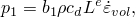

其中 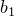 是阻尼系数，默认值为0.06， 是当前材料密度， 是当前膨胀波速， 是单元特征长度，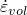 是体积应变率。

**二次体积粘性**

仅在连续体单元中（除平面应力单元CPS4R外）包含二次体积粘性，并且仅当体积应变率为压缩时才应用。体积粘性压力对应变率是二次的：

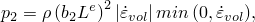

其中 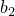 是阻尼系数，默认值为1.2。

二次体积粘性将冲击前缘抹到多个单元上，以防止单元在极高的速度梯度下塌陷。

### 9.5.2 粘性压力

粘性压力载荷通常用于结构问题和准静态问题，以阻尼低频动态效应，从而允许以最少的增量达到静态平衡。这些载荷作为分布载荷应用，公式如下：

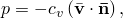

其中  是施加到物体的压力；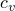 是粘度；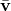 是施加粘性压力的表面点的速度向量；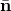 是同一点表面的单位外向法向量。

### 9.5.3 材料阻尼

材料模型本身可能以塑性耗散或粘弹性形式提供阻尼。另一个选项是使用Rayleigh阻尼。有两个与Rayleigh阻尼相关的阻尼因子： 用于质量比例阻尼， 用于刚度比例阻尼。

**质量比例阻尼**

 因子定义与单元质量矩阵成正比的阻尼贡献。引入的阻尼力是由模型中节点绝对速度引起的。产生的效果可以比作模型在粘性流体中运动，这样模型中任何点的任何运动都会触发阻尼力。合理的质量比例阻尼不会显著降低稳定性限制。

**刚度比例阻尼**

 因子定义与弹性材料刚度成正比的阻尼。引入与总应变率成正比的"阻尼应力" 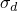：

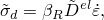

刚度比例阻尼必须谨慎使用，因为它可能显著降低稳定性限制。为避免稳定时间增量急剧下降， 应小于或等于初始稳定时间增量的数量级。

### 9.5.4 离散阻尼器

另一个选项是定义单独的阻尼器单元。每个阻尼器单元提供与其两个节点相对速度成正比的阻尼力。这种方法的优点是它使您能够仅在您认为必要的地方施加阻尼。阻尼器应始终与其他单元（如弹簧或桁架）并联使用，以避免显著降低稳定性限制。

---

## 9.6 能量平衡

能量输出通常是Abaqus/Explicit分析的重要组成部分。各种能量分量之间的比较可用于帮助评估分析是否产生适当的响应。

### 9.6.1 能量平衡声明

整个模型的能量平衡可以写为：


其中  是内能， 是粘性能量耗散， 是摩擦能量耗散， 是动能， 是内部热能， 是外部施加载荷所做的功，、 和  分别是接触惩罚、约束惩罚和推进添加质量所做的功。 是外部热通量的外部热能。这些能量分量之和为 ，应恒定。在数值模型中  仅近似恒定，通常误差小于1%。

**内能**

内能是可恢复弹性应变能 ；通过塑性等非弹性过程耗散的能量 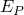；通过粘弹性或蠕变耗散的能量 ；人工应变能 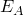；通过损伤耗散的能量 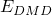；通过畸变控制耗散的能量 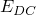；和流体腔能量  的总和：


人工应变能包括储存在壳和梁单元中沙漏阻力和横向剪切中的能量。人工应变能的大值表明需要网格细化或对网格进行其他更改。

**粘性能量**

粘性能量是由阻尼机制（如体积粘性阻尼和材料阻尼）耗散的能量。

**外部施加载荷的功**

外部功从前向连续积分，完全由节点力（力矩）和位移（旋转）定义。规定的边界条件也对外部功有贡献。

### 9.6.2 能量平衡的输出

每个能量分量都可以请求输出，并且可以绘制为整个模型、特定单元集、单个元素或每个单元内能量密度的时间历史。表9-2列出了与整个模型或单元集求和的能量分量相关的变量名称。

**表9-2** 整个模型能量输出变量。

| 变量名称 | 能量分量 |
|---------|---------|
| ALLIE | 内能：ALLIE = ALLSE + ALLPD + ALLCD + ALLAE + ALLDMD + ALLDC + ALLFC |
| ALLKE | 动能 |
| ALLVD | 粘性耗散能量 |
| ALLFD | 摩擦耗散能量 |
| ALLCD | 通过粘弹性耗散的能量 |
| ALLWK | 外力的功 |
| ALLPW | 接触惩罚所做的功 |
| ALLCW | 约束惩罚所做的功 |
| ALLMW | 推进添加质量所做的功 |
| ALLSE | 弹性应变能 |
| ALLPD | 非弹性耗散能量 |
| ALLAE | 人工应变能 |
| ALLIHE | 内部热能 |
| ALLHF | 外部热通量的外部热能 |
| ALLDMD | 通过损伤耗散的能量 |
| ALLDC | 通过畸变控制耗散的能量 |
| ALLFC | 流体腔能量 |
| ETOTAL | 能量平衡 |

此外，Abaqus/Explicit可以生成单元级能量输出和能量密度输出，如表9-3所列。

**表9-3** 单元能量输出变量。

| 变量名称 | 整个单元能量分量 |
|---------|---------------|
| ELSE | 弹性应变能 |
| ELPD | 塑性耗散能量 |
| ELCD | 蠕变耗散能量 |
| ELVD | 粘性耗散能量 |
| ELASE | 人工能量 = 钻孔能量 + 沙漏能量 |
| EKEDEN | 单元中的动能密度 |
| ESEDEN | 单元中的弹性应变能密度 |
| EPDDEN | 单元中耗散的塑性能量密度 |
| EASEDEN | 单元中的人工应变能密度 |
| ECDDEN | 单元中蠕变能量密度耗散 |
| EVDDEN | 单元中耗散的粘性能量密度 |
| ELDMD | 单元中通过损伤耗散的能量 |

---

## 9.7 小结

- Abaqus/Explicit使用中心差分规则通过时间显式地积分运动学。
- 显式方法需要许多小时间增量。由于没有联立方程要解，每个增量都很便宜。
- 随着模型规模的增加，显式方法比隐式方法节省大量成本。
- **稳定性限制**是可用于推进运动状态并保持准确的最大时间增量。
- Abaqus/Explicit在整个分析中自动控制时间增量大小以保持稳定。
- 随着材料刚度增加，稳定性限制减小；随着材料密度增加，稳定性限制增加。
- 对于具有单一材料的网格，稳定性限制大致与最短单元尺寸成正比。
- 通常，在Abaqus/Explicit中使用质量比例阻尼来阻尼低频振荡，并使用刚度比例阻尼来阻尼高频振荡。
