# 第10章 材料

## 目录

- [10.1 在Abaqus中定义材料](#101-在abaqus中定义材料)
- [10.2 延性金属中的塑性](#102-延性金属中的塑性)
- [10.3 弹塑性问题单元选择](#103-弹塑性问题单元选择)
- [10.4 示例：带塑性的连接吊环](#104-示例带塑性的连接吊环)
- [10.5 示例：加筋板上的爆炸载荷](#105-示例加筋板上的爆炸载荷)
- [10.6 超弹性](#106-超弹性)
- [10.7 示例：轴对称支架](#107-示例轴对称支架)
- [10.8 大变形网格设计](#108-大变形网格设计)
- [10.9 减少体积锁定的技术](#109-减少体积锁定的技术)
- [10.10 相关Abaqus示例](#1010-相关abaqus示例)
- [10.11 推荐阅读](#1011-推荐阅读)
- [10.12 小结](#1012-小结)

---

## 10.1 在Abaqus中定义材料

在仿真中可以使用任意数量的不同材料。每个材料定义都有一个名称。模型中的不同区域通过引用材料名称的截面属性与不同的材料定义相关联。

---

## 10.2 延性金属中的塑性

许多金属在低应变幅值下具有近似线弹性行为（见图10-1），材料的刚度（即杨氏模量或弹性模量）是恒定的。

在更高的应力（和应变）幅值下，金属开始呈现非线性、非弹性行为（见图10-2），这称为塑性。

### 10.2.1 延性金属塑性的特性

材料的塑性行为由其屈服点和后屈服硬化描述。从弹性到塑性行为的转变发生在材料应力-应变曲线上称为弹性极限或屈服点的某个位置（见图10-2）。屈服点的应力称为屈服应力。大多数金属的初始屈服应力是材料弹性模量的0.05%到0.1%。

在达到屈服点之前，金属的变形只会产生弹性应变，如果移除施加的载荷，这些应变会完全恢复。然而，一旦金属中的应力超过屈服应力，就会开始发生永久（非弹性）变形。与这种永久变形相关的应变称为塑性应变。弹性应变和塑性应变都会随着金属在后屈服区域的变形而累积。

金属屈服后，其刚度通常会显著降低（见图10-2）。已屈服的延性金属在移除施加的载荷时会恢复其初始弹性刚度（见图10-2）。通常，材料的塑性变形会增加后续加载的屈服应力：这种行为称为加工硬化。

金属塑性的另一个重要特征是，非弹性变形与近乎不可压缩的材料行为相关联。对这种效应进行建模会对弹塑性仿真中可使用的单元类型施加一些严格限制。

在拉伸载荷下进行塑性变形的金属可能会经历高度局部化的延伸和变薄，称为**颈缩**，这是材料失效的表现（见图10-2）。金属中的工程应力（基于未变形面积的单位面积力）称为**标称应力**，其共轭量是**标称应变**（长度变化除以未变形长度）。金属在颈缩时的标称应力远低于材料的极限强度。这种材料行为是由试件的几何形状、试验本身的性质以及所使用的应力和应变度量引起的。例如，在压缩中测试相同材料产生的应力-应变图没有颈缩区域，因为试件在压缩载荷下变形时不会变薄。描述金属塑性行为的数学模型应该能够独立于结构几何形状或施加载荷的性质，来考虑压缩和拉伸行为的差异。如果用真实应力对真实应变的曲线来代替标称应力和标称应变的熟悉定义，这个目标就可以实现。

### 10.2.2 有限变形的应力和应变度量

压缩和拉伸中的应变只有在$\Delta l / l_0 \to 0$的极限情况下才相同；即

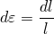

其中$l$是当前长度，$l_0$是原始长度，$\varepsilon$是**真应变**或**对数应变**。

与真应变共轭的应力度量称为**真应力**，定义为

其中$F$是材料中的力，$A$是当前面积。在有限变形下，延性金属在拉伸和压缩中具有相同的应力-应变行为（如果用真应力对真应变绘图）。

### 10.2.3 在Abaqus中定义塑性

在Abaqus中定义塑性数据时，必须使用**真应力**和**真应变**。Abaqus需要这些值来正确解释数据。

通常，材料试验数据以标称应力和应变值的形式提供。在这种情况下，必须使用下面给出的表达式将塑性材料数据从标称应力-应变值转换为真应力-应变值。

真应变与标称应变之间的关系可以表示为

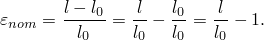

在这个表达式两边加1并取自然对数，得到真应变与标称应变之间的关系：

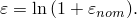

真应力与标称应力之间的关系是通过考虑塑性变形的不可压缩性和假设弹性也是不可压缩的而形成的，所以

当前面积与原始面积的关系为

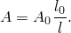

将$A$的定义代入真应力定义，得到

其中

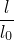

也可以写成

进行最终代换得到真应力与标称应力和应变之间的关系：

这些关系仅在颈缩之前有效。

Abaqus中的经典金属塑性模型定义了大多数金属的后屈服行为。Abaqus用一系列连接给定数据点的直线来近似材料的平滑应力-应变行为。可以使用任意数量的点来近似实际材料行为；因此，可以使用非常接近实际材料行为的近似。塑性数据定义了真塑性应变函数的真屈服应力。给出的第一个数据点定义了材料的初始屈服应力，因此应具有零塑性应变值。

用于定义塑性行为的材料试验数据中提供的应变不是材料中的塑性应变。相反，它们可能是材料中的总应变。必须将这些总应变值分解为弹性和塑性应变分量。塑性应变通过从总应变值中减去弹性应变得到，弹性应变定义为真应力除以杨氏模量（见图10-3）。

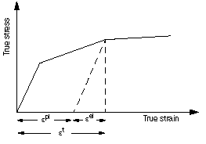

这个关系写为

其中
- $\varepsilon^{pl}$是真塑性应变
- $\varepsilon^{tot}$是真总应变
- $\varepsilon^{el}$是真弹性应变
- $\sigma$是真应力
- $E$是杨氏模量

**材料试验数据转换为Abaqus输入的示例**

图10-4中的标称应力-应变曲线将作为示例，说明如何将定义材料塑性行为的试验数据转换为Abaqus的适当输入格式。标称应力-应变曲线上的六个点将用于确定塑性数据。

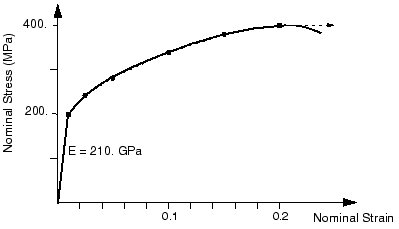

第一步是使用之前所示的真应力与标称应力和应变以及真应变与标称应变之间的关系方程，将标称应力和标称应变转换为真应力和真应变。一旦这些值已知，就可以使用之前所示的塑性应变与总应变和弹性应变之间的关系，来确定与每个屈服应力值相关的塑性应变。转换后的数据见表10-1。

**表10-1 应力和应变转换**

| 标称应力（Pa） | 标称应变 | 真应力（Pa） | 真应变 | 塑性应变 |
|---------------|----------|--------------|--------|----------|
| 200E6 | 0.00095 | 200.2E6 | 0.00095 | 0.0 |
| 240E6 | 0.025 | 246E6 | 0.0247 | 0.0235 |
| 280E6 | 0.050 | 294E6 | 0.0488 | 0.0474 |
| 340E6 | 0.100 | 374E6 | 0.0953 | 0.0935 |
| 380E6 | 0.150 | 437E6 | 0.1398 | 0.1377 |
| 400E6 | 0.200 | 480E6 | 0.1823 | 0.1800 |

在小应变下，标称值和真值之间差异很小，但在较大应变值下差异非常显著；因此，如果仿真中的应变较大，向Abaqus提供正确的应力-应变数据是非常重要的。

**Abaqus/Explicit中的数据规则化**

执行分析时，Abaqus/Explicit可能不会完全按照用户定义的那样使用材料数据；为了效率，所有以表格形式定义的材料数据都会自动**规则化**。材料数据可以是温度、外部场和内状态变量（如塑性应变）的函数。对于每个材料点计算，必须通过插值确定材料的状态，为了效率，Abaqus/Explicit用由等间距点组成的曲线来拟合用户定义的曲线。这些规则化的材料曲线是分析期间使用的材料数据。理解分析中使用的规则化材料曲线与指定的曲线之间可能存在的差异是很重要的。

为了说明使用规则化材料数据的含义，考虑以下两种情况。图10-5显示了一个用户定义了不规则数据的情况。

在这个例子中，Abaqus/Explicit生成了六个规则数据点，用户的数据被精确再现。图10-6显示了一个用户定义了难以精确规则化的数据的情况。在这个例子中，假设Abaqus/Explicit通过将范围划分为10个区间来规则化数据，这些区间不能精确再现用户的数据点。

Abaqus/Explicit尝试使用足够多的区间，使得规则化数据与用户定义数据之间的最大误差小于3%；但是，可以更改此误差容限。如果需要超过200个区间才能获得可接受的规则化曲线，分析会在数据检查期间停止并显示错误消息。通常，如果用户定义的最小区间相对于自变量范围较小，则规则化会更困难。在图10-6中，应变1.0的数据点使得应变值范围很大，而低应变水平下定义的区间很小。移除最后这个数据点可以使数据更容易被规则化。

**数据点之间的插值**

Abaqus在给定数据点之间进行线性插值以获得材料的响应，并假设响应在输入数据定义的范围之外是恒定的（见图10-7）。因此，这种材料的应力永远不会超过480 MPa；当材料中的应力达到480 MPa时，材料会持续变形，直到应力降到这个值以下。

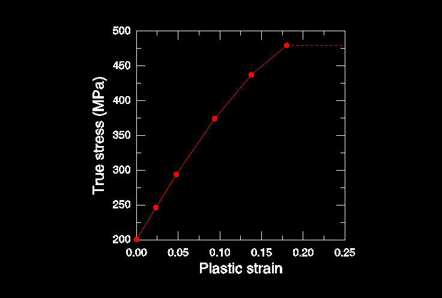

**Abaqus/CAE中的材料校准**

Abaqus/CAE允许从试验数据校准材料模型。利用此功能，可以将材料试验数据导入Abaqus/CAE，处理数据，并从数据中推导弹性和塑性各向同性材料行为。

---

## 10.3 弹塑性问题单元选择

金属塑性变形的不可压缩性对弹塑性仿真可使用的单元类型施加了限制。限制的产生是因为对不可压缩材料行为进行建模会向单元增加运动约束；在这种情况下，约束单元积分点处的体积保持恒定。在某些类型的单元中，添加这些不可压缩性约束会使单元过度约束。当这些单元无法解析所有这些约束时，它们会遭受**体积锁定**，导致响应过于刚硬。体积锁定表现为静水压力应力在单元之间或积分点之间的快速变化。

Abaqus/Standard中可用的完全积分的二次实体单元在模拟不可压缩材料行为时非常容易受到体积锁定的影响，因此不应在弹塑性仿真中使用。Abaqus/Standard中完全积分的一阶实体单元不会遭受体积锁定，因为Abaqus在这些单元中实际使用恒体积应变。因此，它们可以安全地用于塑性问题。

减缩积分实体单元在需要满足不可压缩性约束的积分点较少。因此，它们不会被过度约束，可用于大多数弹塑性问题。如果应变超过20-40%，应在谨慎使用Abaqus/Standard中的二次减缩积分单元，因为在这种幅值下它们可能会遭受体积锁定。可以通过网格细化来减少这种效应。

如果必须在Abaqus/Standard中使用完全积分的二次单元，请使用混合版本，它们专为模拟不可压缩行为而设计；但是，这些单元中的附加自由度会使分析计算更昂贵。

一族改进的二次三角形和四面体单元可用，它们在性能上优于一阶三角形和四面体单元，并避免了常规二次三角形和四面体单元存在的一些问题。特别是，这些单元表现出最小的剪切和体积锁定。这些单元在Abaqus/Standard中作为完全积分和混合单元的补充可用；它们是Abaqus/Explicit中可用的唯一二次连续体（实体）单元。

---

## 10.4 示例：带塑性的连接吊环

您被要求研究钢制连接吊环在极端载荷（60 kN，事故情况）下会发生什么。线性分析的结果表明吊环会屈服。您需要确定吊环中塑性变形的程度和塑性应变的大小，以便评估吊环是否会发生失效。在此分析中不需要考虑惯性效应；因此，将使用Abaqus/Standard检查吊环的静态响应。

钢可用的唯一非弹性材料数据是其屈服应力（380 MPa）和失效时的应变（0.15）。您决定假设钢是理想塑性的：材料不会硬化，应力永远不会超过380 MPa（见图10-8）。实际上，可能会发生一些硬化，但这个假设是保守的；如果材料硬化，塑性应变将小于仿真预测的值。

### 10.4.1 模型的修改

打开模型数据库文件`Lug.cae`，并将模型`Elastic`复制到名为`Plastic`的模型。

**材料定义**

对于`Plastic`模型，您将使用Abaqus中的经典金属塑性模型来指定材料的后屈服行为。零塑性应变时的初始屈服应力是380 MPa。由于您将钢建模为理想塑性，不需要其他屈服应力。将执行一般非线性仿真，因为模型中存在非线性材料行为。

**步骤定义和输出请求**

编辑步骤定义和输出请求。接受总时间周期为1.0，并假设几何非线性的影响在此仿真中不重要。在"增量"选项卡页面上，指定初始增量大小为总步长时间的20%（0.2）。此仿真是极端载荷下吊环的静态分析；您预先不知道此仿真可能需要多少个增量。然而，默认的最大值100是相当大的，应该足够了。

**载荷**

此仿真中施加的载荷是线性弹性吊环仿真中施加的载荷的两倍（60 kN vs. 30 kN）。因此，将施加到吊环的压力幅值加倍（即更改为10.0E7）。

**作业定义**

创建名为`PlasticLugNoHard`的作业，并输入以下作业描述：`Elastic-Plastic Steel Connecting Lug`。记得保存模型数据库文件。

提交作业进行分析，并监控解决方案进度。纠正任何建模错误，并调查任何警告消息的来源。此分析应该会提前终止；原因在以下部分讨论。

### 10.4.2 作业监控和诊断

**作业监控器**

当Abaqus/Standard完成仿真时，作业监控器将包含类似于图10-9所示的信息。

Abaqus/Standard只能将规定载荷的94%应用到模型上。作业监控器显示Abaqus/Standard在仿真期间多次减小时间增量的大小（显示在最后一列），并在第14个增量时停止分析。错误选项卡页面上的信息（见图10-9）表明分析终止。点击"消息文件"选项卡查看消息文件中的错误详细信息（见图10-10）。错误表明分析终止，因为时间增量的大小小于此分析允许的值。这是收敛困难的经典症状，是时间增量大小持续减小的直接结果。

### 10.4.3 后处理结果

查看可视化模块中的结果，以了解导致过度塑性的原因。

**绘制变形模型形状**

创建模型变形形状的图，并检查此形状是否真实。

默认视图是等轴测的。Abaqus/CAE总是缩放几何线性仿真中的位移，使模型的变形形状适合视口。绘制实际位移，将变形比例因子设置为1.0。

60 kN的施加载荷超过了吊环的极限载荷，当材料在通过其厚度的所有积分点屈服时，吊环会坍塌。由于钢的理想塑性后屈服行为，吊环没有刚度来抵抗进一步变形。这与之前观察到的关于大应变增量位置和最大位移校正的位置的模式一致。

### 10.4.4 向材料模型添加硬化

理想塑性材料行为的连接吊环仿真预测吊环将遭受由结构坍塌引起的灾难性失效。我们已经提到钢在屈服后可能会表现出一些硬化。您怀疑包含硬化行为将允许吊环承受这个60 kN载荷，因为它会提供额外的刚度。因此，决定向钢的材料属性定义中添加一些硬化。假设屈服应力在塑性应变0.35时增加到580 MPa，这代表这类钢的典型硬化。修改后材料模型的应力-应变曲线如图10-17所示。

修改塑性材料数据以包含硬化数据。编辑材料定义，向塑性数据表单添加第二行数据。输入屈服应力580.E6和相应的塑性应变0.35。

### 10.4.5 使用塑性硬化运行分析

创建名为`PlasticLugHard`的作业。提交作业进行分析，并监控解决方案进度。

### 10.4.6 后处理结果

**变形模型形状和峰值位移**

绘制这些新结果的变形模型形状，并将变形比例因子更改为2。显示的变形是实际变形的两倍。

**Mises应力等值线**

在模型中对Mises应力进行等值线绘制。创建使用十个等值线间隔的实际变形形状上的填充等值线图。

等值线图例中列出的最大应力是否令您惊讶？最大应力大于580 MPa，这不应该发生，因为材料被假定为在此应力幅值下理想塑性。这个误导性结果是由于Abaqus/CAE用于为元素变量（如应力）创建等值线图的算法造成的。

**等效塑性应变等值线**

材料中的等效塑性应变（PEEQ）是一个标量变量，用于表示材料的非弹性变形。如果此变量大于零，则材料已屈服。吊环中已屈服的部分可以通过选择PEEQ的等值线图来识别。

**创建变量-变量（应力-应变）图**

在Abaqus/CAE中，X-Y绘图功能允许创建显示一个变量作为另一个变量的函数变化的图。将使用写入输出数据库（.odb）文件的应力和应变数据（在字段输出而非历史输出的形式）来为连接吊环约束端附近元素中的一个积分点创建应力-应变图。

仿真结果表明，如果钢在屈服后硬化，吊环将承受这个60 kN载荷。两个仿真的结果共同表明，确定钢的实际后屈服硬化行为非常重要。如果钢硬化很少，吊环可能在60 kN载荷下坍塌。而如果它具有中等硬化，吊环可能会承受载荷，尽管会有广泛的塑性屈服。然而，即使具有塑性硬化，此载荷的安全系数可能非常小。

---

## 10.5 示例：加筋板上的爆炸载荷

前面的示例说明了使用隐式方法求解涉及非线性材料响应的问题时可能遇到的收敛困难。我们现在将关注使用显式动力学求解涉及塑性问题。如即将展示的，收敛困难不是这种情况，因为隐式方法需要迭代。

在此示例中，您将在Abaqus/Explicit中评估加筋方形板在爆炸载荷下的响应。板在所有四边上被牢固夹紧，并有三个等间距的加筋件焊接在其上。板由25 mm厚的钢制成，尺寸为2 m见方。加筋件由12.5 mm厚的板制成，深度为100 mm。图10-26显示了板的几何形状和材料属性更多细节。由于板厚度明显小于任何其他整体尺寸，壳单元可用于对板进行建模。

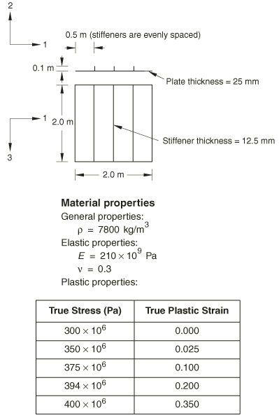

此示例的目的是确定板的响应，并了解材料模型复杂性增加时响应如何变化。最初，我们使用标准弹塑性材料模型分析行为。随后，我们研究包含材料阻尼和率相关材料属性的效果。

### 10.5.1 预处理——使用Abaqus/CAE创建模型

使用Abaqus/CAE创建加筋板的三维模型。

**定义模型几何**

创建三维、可变形、具有拉伸壳基特征的部分来表示板。

**定义材料属性**

创建名为`Steel`的材料，质量密度为7800 kg/m³，杨氏模量为210.0E9 Pa，泊松比为0.3。此时我们不知道是否会有塑性变形，但我们知道该钢的屈服应力值和后屈服行为的细节。将包含这些信息在材料定义中。初始屈服应力是300 MPa，屈服应力在塑性应变35%时增加到400 MPa。

在分析期间，Abaqus计算当前塑性应变值的屈服应力。如前所述，当应力-应变数据处于等间距的塑性应变值时，查找和插值过程最有效。为了避免让用户输入规则数据，Abaqus/Explicit自动规则化数据。

**创建和分配截面属性**

创建两个均匀壳截面属性，每个都引用钢材料定义但指定不同的壳厚度。命名第一个壳截面属性`PlateSection`，选择`Steel`作为材料，并指定0.025 m作为壳厚度值。命名第二个壳截面属性`StiffSection`，选择`Steel`作为材料，并指定0.0125 m作为壳厚度值。

**创建装配**

创建板的一个独立实例。

**定义步骤和输出请求**

创建一个动态显式步骤。命名步骤为`Blast`，并指定步骤描述：`Apply blast loading`。输入步骤时间周期为50E-3 s。

通常，应该限制分析期间写入的帧数，以保持输出数据库文件的合理大小。在此分析中，每2 ms保存一次信息应该足以研究结构的响应。

**施加边界条件和其他载荷**

定义此分析中使用的边界条件。在步骤`Blast`中，创建一个名为`Fix edges`的机械边界条件。将边界条件应用到板的边缘。

板将承受随时间变化的载荷：压力在分析开始时从零迅速增加到其最大值的7.0 × 10⁵ Pa，持续9 ms，然后在另外10 ms内降回零。之后在分析剩余时间内保持在零。见压力随时间变化的图表。

定义名为`Blast`的表格振幅曲线。

接下来，定义压力载荷。由于载荷的大小将由振幅定义，您只需要向板施加单位压力。

**创建网格和定义作业**

使用全局元素大小0.1对零件实例进行网格布置。此外，选择边缘并指定每个加筋件高度方向上创建两个元素。使用来自显式单元库的四边形壳单元（S4R）对板和加筋件进行网格划分。

创建名为`BlastLoad`的作业。指定以下作业描述：`Blast load on a flat plate with stiffeners: S4R elements (20x20 mesh) Normal stiffeners (20x2)`。

保存模型数据库文件，并提交作业进行分析。

### 10.5.2 后处理

作业完成后，进入可视化模块，并打开此作业创建的.odb文件（`BlastLoad.odb`）。

**更改视图**

默认视图是等轴测的，这对板没有提供特别清晰的视图。使用"视图"菜单中的选项或"视图操作"工具栏中的工具旋转视图以改善视点。

**验证壳截面分配**

在后处理结果时，还可以可视化截面分配和壳厚度。

**动画结果**

动画化结果将提供爆炸载荷下板动态响应的一般理解。首先，绘制变形模型形状。然后，创建变形形状的时间历史动画。

从动画中您将看到，随着爆炸载荷的施加，板开始偏转。在载荷持续期间，板开始振动，在爆炸载荷降为零后继续振动。最大位移发生在约8 ms时，该状态的变形图如图10-36所示。

**历史输出**

由于从变形图中不容易看到板的变形，期望以图形形式查看中心节点的位移响应。板中心节点的位移特别令人关注，因为最大偏转发生在这个节点上。

写入输出数据库的历史输出的其他量是模型的总能量。能量历史可以帮助识别模型的潜在缺点以及突出重要的物理效应。

显示五个不同能量输出变量的历史——ALLAE、ALLIE、ALLKE、ALLPD和ALLSE。

一旦载荷被移除且板自由振动，应变能减小时动能增加。当板处于最大偏转，因此具有最大应变能时，它几乎完全静止，导致动能处于最小值。

塑性应变能上升到平台期，然后再次上升。从动能图中我们可以看到，塑性应变能的第二次上升发生在板从最大位移回弹并向相反方向移动时。因此，我们在爆炸脉冲后回弹时看到了塑性变形。

即使没有迹象表明在此分析中存在过度弹性问题，也要研究人工应变能以确保没有问题。

使用粗糙网格时，加筋件几乎处于纯面内弯曲状态。使用穿过加筋件深度的两个一阶减缩积分单元不足以模拟面内弯曲行为。

### 10.5.3 审查分析

**阻尼**

无阻尼结构继续以恒定振幅振动。在50 ms的仿真中，振荡频率约为100 Hz。恒幅振动不是实践中预期的响应，因为这种结构中的振动会随时间衰减，在5-10次振荡后实际上会消失。能量损失通常通过各种机制发生，包括支撑处的摩擦效应和空气阻尼。

因此，需要在分析中考虑阻尼的存在。粘性效应消耗的能量（ALLVD）在分析中为非零，表明已经存在一些阻尼。默认情况下，始终存在体积粘性阻尼。

只有线性阻尼存在于此壳模型中。使用默认值，振荡最终会消失，但需要很长时间，因为体积粘性阻尼非常小。材料阻尼应用于引入更真实的结构响应。

**率相关性**

一些材料（如软钢）表现出屈服应力随应变率增加而增加。在此示例中，载荷率很高，因此应变率相关性可能很重要。

---

## 10.6 超弹性

我们现在转向另一类材料非线性，即橡胶材料表现出的非线性弹性响应。

### 10.6.1 简介

典型橡胶材料的应力-应变行为如图10-46所示，是弹性但高度非线性的。

这种类型的材料行为称为**超弹性**。超弹性材料（如橡胶）的变形在达到大应变值（通常远超100%）之前保持弹性。

Abaqus在模拟超弹性材料时做以下假设：
- 材料行为是弹性的
- 材料行为是各向同性的
- 仿真将包括非线性几何效应

此外，Abaqus/Standard默认假设超弹性材料是不可压缩的。Abaqus/Explicit假设材料几乎是不可压缩的（默认泊松比为0.475）。

弹性体泡沫是另一类高度非线性、弹性材料。它们与橡胶材料的区别在于，在承受压缩载荷时具有非常大的可压缩性。它们在Abaqus中用单独的材料模型模拟，在此指南中不作详细讨论。

### 10.6.2 可压缩性

大多数固体橡胶材料与其剪切柔性相比几乎没有可压缩性。这种行为对于平面应力、壳或膜单元不是问题。但是，在使用其他单元（如平面应变、轴对称和三维实体单元）时可能会出现问题。例如，在材料没有高度约束的应用中，假设材料是完全不可压缩的是非常令人满意的。在材料高度约束的情况下（如用作密封件的O形圈），必须正确模拟可压缩性以获得准确结果。

Abaqus/Standard有一系列特殊的"混合"单元，必须用于模拟超弹性材料中的完全不可压缩行为。这些"混合"单元通过名称中的字母"H"识别；例如，8节点砖块的混合形式称为C3D8H。

除了平面应力和单轴情况外，在Abaqus/Explicit中假设材料完全不可压缩是不可能的，因为程序在每个材料计算点没有施加这种约束的机制。不可压缩材料也有无限波速，导致时间增量为零。因此，必须提供一些可压缩性。困难在于，在许多情况下，实际材料行为提供的可压缩性太少，算法无法高效工作。因此，除了平面应力和单轴情况外，用户必须提供足够的可压缩性供代码使用，知道这使得模型的体积行为比实际材料更软。因此，需要一些判断来决定解决方案是否足够准确，或者由于这个数值限制，问题是否可以完全用Abaqus/Explicit建模。

我们可以通过初始体积模量$K_0$与初始剪切模量$\mu$的比值来评估材料的相对可压缩性。泊松比$\nu$也提供了可压缩性的度量。

**表10-4 可压缩性与泊松比的关系**

| $K_0 / \mu$ | 泊松比 |
|-------------|--------|
| 10 | 0.452 |
| 20 | 0.475 |
| 50 | 0.490 |
| 100 | 0.495 |
| 1,000 | 0.4995 |
| 10,000 | 0.49995 |

如果没有为材料可压缩性提供值，Abaqus/Explicit默认假设$K_0 / \mu = 20$，对应泊松比0.475。由于典型未填充弹性体的$K_0 / \mu$比值在1,000到10,000范围内，填充弹性体在50到200范围内，此默认值比大多数弹性体中可用的可压缩性要大得多。然而，如果弹性体相对不受约束，这种材料体积行为的更软建模通常会提供相当准确的结果。不幸的是，在材料高度约束的情况下——例如当它与刚性金属零件接触且具有非常少量的自由表面时，特别是在加载高度压缩的情况下——用Abaqus/Explicit获得准确结果可能是不可行的。

如果您正在定义可压缩性而不是接受Abaqus/Explicit中的默认值，建议$K_0 / \mu$比值上限为100。更大的比值会向动态解决方案引入高频噪声，并需要使用过小的时间增量。

### 10.6.3 应变能势

Abaqus使用**应变能势**（$U$），而不是杨氏模量和泊松比，来关联超弹性材料中的应力与应变。有几种不同的应变能势可用：多项式模型、Ogden模型、Arruda-Boyce模型、Marlow模型和van der Waals模型。多项式模型的更简单形式也可用，包括Mooney-Rivlin、neo-Hookean、减缩多项式和Yeoh模型。

应变能势的多项式形式是常用的一种。其形式为

其中$U$是应变能势；$\bar{U}$是弹性体积比；$\bar{\varepsilon}_1$和$\bar{\varepsilon}_2$是材料中变形的度量；$N$、$D_1$和$C_{10}$是材料参数，可能是温度的函数。$C_{10}$参数描述材料的剪切行为，$D_1$参数引入可压缩性。如果材料完全不可压缩（在Abaqus/Explicit中不允许的条件），则所有$D_1$值都设置为零，上式中的第二部分可以忽略。如果项数$N$为1，则初始剪切模量$\mu_0$和体积模量$K_0$由下式给出

和

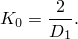

如果材料也是不可压缩的，应变能密度方程为

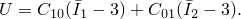

这个表达式通常称为**Mooney-Rivlin**材料模型。如果$C_{01}$也为零，则材料称为**neo-Hookean**。

其他超弹性模型在概念上相似，并在Abaqus分析用户指南中描述。

### 10.6.4 使用测试数据定义超弹性行为

定义超弹性材料的便捷方法是向Abaqus提供实验测试数据。然后Abaqus使用最小二乘法计算常数。Abaus可以拟合以下实验测试的数据：
- 单轴拉伸和压缩
- 等双轴拉伸和压缩
- 平面拉伸和压缩（纯剪切）
- 体积拉伸和压缩

与塑性数据不同，超弹性材料的测试数据必须以标称应力和标称应变值的形式提供给Abaqus。

**从数据获取最佳材料模型**

使用超弹性材料的仿真结果质量很大程度上取决于您提供给Abaqus的材料测试数据。您可以做一些事情来帮助Abaqus计算最佳可能的材料参数：

- 尽可能获取多于一种变形状态的实验测试数据——这允许Abaqus形成更准确和稳定的材料模型
- 获取可能发生在仿真中的变形模式的测试数据。例如，如果您的组件在压缩中加载，请确保您的测试数据包括压缩而非拉伸加载
- 尝试包括平面测试的测试数据。此测试测量剪切行为，可能非常重要
- 在您期望材料在仿真期间承受的应变幅值处提供更多数据

**材料模型的稳定性**

从测试数据确定超弹性材料模型在某些应变幅值下可能不稳定。Abaqus执行稳定性检查以确定将发生不稳定行为的应变幅值，并在数据（.dat）文件中打印警告消息。

---

## 10.7 示例：轴对称支架

您被要求找到如图所示的橡胶支架的轴向刚度，并识别可能限制支架疲劳寿命的高最大主应力区域。支架两端粘合在钢板上。它将承受高达5.5 kN的轴向载荷，均匀分布在钢板上。横截面几何形状和尺寸如图10-48所示。

您可以对此仿真使用轴对称单元，因为结构和载荷都是轴对称的。因此，您只需要对组件的一个平面进行建模：每个单元代表完整的360°环。您将检查支架的静态响应；因此，将使用Abaqus/Standard进行分析。

### 10.7.1 对称性

您不需要对轴对称组件的整个部分进行建模，因为问题关于支架中心的水平线是对称的。通过仅对部分进行建模，可以使用一半的元素，因此大约一半的自由度。这显著减少了分析的运行时间和存储要求。

许多问题包含某种程度的对称性。例如，镜像对称、循环对称、轴对称或重复对称是常见的。在要建模的结构或组件中可能存在多种类型的对称性。

当仅对对称组件的一部分进行建模时，必须添加边界条件以使模型表现得好像正在对整个组件进行建模。您可能还需要调整施加的载荷以反映实际建模的部分。

在轴对称分析中使用轴对称单元（如本橡胶支架示例），我们只需要对组件的横截面进行建模。单元公式自动包含轴对称的影响。

### 10.7.2 预处理——使用Abaqus/CAE创建模型

**部分定义**

创建轴对称、可变形、壳部分。命名部分为`Mount`，并指定近似部分大小为0.3。由于对称性考虑，只对支架的下半部分进行建模。

**材料属性：橡胶的超弹性模型**

您获得了支架中使用的橡胶材料的实验测试数据。有三组不同的测试数据可用——单轴测试、双轴测试和平面（剪切）测试。数据以标称应力和相应的标称应变形式给出。

当使用实验数据定义超弹性材料时，还指定要应用于数据的应变能势。Abaqus使用实验数据来计算指定应变能势所需的系数。然而，验证材料定义预测的行为与实验数据之间存在可接受的相关性是很重要的。

可以使用Abaqus/CAE中可用的材料评估选项来使用实验数据模拟一个或多个标准测试。

创建名为`Rubber`的超弹性材料。在此示例中，使用一阶多项式应变能函数来模拟橡胶材料；因此，从材料编辑器中的应变能势列表中选择多项式。输入上述测试数据。

计算和实验结果对于各种测试的比较如图10-54、10-55和10-56所示。Abaqus/Standard和双轴拉伸测试的实验结果非常吻合。单轴拉伸和平面测试的计算和实验结果在应变小于100%时吻合良好。从这些材料测试数据和此应变能函数创建的Abaqus超弹性材料模型在这些应变幅值下可能是稳定的。

**材料参数**

在此仿真中，材料假定为不可压缩（$D_1 = 0$）。为了实现这一点，没有提供体积测试数据。

**完成材料和截面定义**

钢仅用线性弹性属性建模，因为载荷不应该大到引起非弹性变形。创建名为`Steel`的材料，以及两个均匀固体截面定义：一个名为`RubberSection`引用橡胶材料，一个名为`SteelSection`引用钢材料。

在分配截面属性之前，使用分割工具将零件分割成两个区域。

**创建装配和步骤定义**

创建零件的依赖实例。然后，定义一个名为`Compress mount`的静态、通用步骤。当在模型中使用超弹性材料时，Abaqus假定模型可能经历大变形；但默认情况下不包括大变形和其他非线性几何效应。因此，必须在此仿真中包含它们。

**施加载荷和边界条件**

指定对称平面区域上的边界条件（U2 = 0）。支架必须承受5.5 kN的最大轴向载荷，均匀分布在钢板上。因此，向钢板底部施加分布载荷。

**创建网格和作业**

对橡胶支架使用一阶轴对称混合实体单元（CAX4H）。必须使用混合单元，因为材料是完全不可压缩的。使用单层不兼容模式单元（CAX4I）对钢板进行建模，因为钢板可能会随着下方橡胶的变形而弯曲。

创建名为`Mount`的作业。

### 10.7.3 后处理

**计算支架的刚度**

通过创建位移作为施加载荷的函数的X-Y图来确定支架的刚度。

支架的刚度随着支架变形而增加近100%。这是橡胶非线性和支架变形时形状变化的结果。

**模型形状图**

您将绘制支架的未变形模型形状。

板已被向上推动，导致橡胶向侧面膨胀。放大网格左下角的视图。

一些元素在此区域变得严重畸变，因为网格设计不足以承受该处发生的变形类型。虽然元素在分析开始时形状良好，但随着橡胶向外膨胀，它们会变得严重畸变。

**最大主应力等值线**

在模型中绘制最大面内主应力。

模型中的最大主应力为136 kPa。虽然此模型中的网格相当细化，因此外推误差应该很小，但您可能希望使用查询工具来确定最大主应力的更准确积分点值。

当查看积分点值时，您会发现最大主应力峰值发生在模型右下部分的一个畸变元素中。由于元素畸变和体积锁定的程度，此值可能不可靠。如果忽略此值，则在对称平面附近有一个区域的最大主应力约为88.2 kPa。

---

## 10.8 大变形网格设计

我们知道橡胶支架角落中的元素畸变是不可取的。这些区域的结果不可靠；如果增加载荷，分析可能会失败。这些问题可以通过使用更好的网格设计来纠正。如图10-67所示的替代网格设计可用于减少橡胶模型左下角区域中的元素畸变。

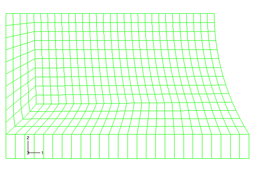

对面中相反角落的网格畸变问题的讨论在第10.9节"减少体积锁定的技术"中。左下角区域的元素在初始未变形配置中现在变形更严重。然而，随着分析进展和元素变形，它们的形状实际上得到改善。变形形状图显示该区域中的元素畸变程度减少了；但橡胶模型右下角区域的网格畸变程度仍然显著。

最大主应力的等值线显示，该角落中非常局部的应力仅略微减少。

大变形问题的网格设计比小位移问题更困难。必须生成一个在整个分析过程中元素形状都合理的网格，而不仅仅是在开始时。必须使用经验、手工计算或粗有限元模型的结果来估计模型将如何变形。

---

## 10.9 减少体积锁定的技术

为了缓解体积锁定，在橡胶材料模型中引入少量可压缩性。只要可压缩性很小，近不可压缩材料获得的结果将与完全不可压缩材料获得的结果非常相似。

通过将材料常数$D_1$设置为非零值来引入可压缩性。选择该值使得初始泊松比$\nu_0$接近0.5。

带有额外网格细化的可压缩性模型（以减少网格畸变）如图10-70所示。

此模型的变形形状如图10-71所示。

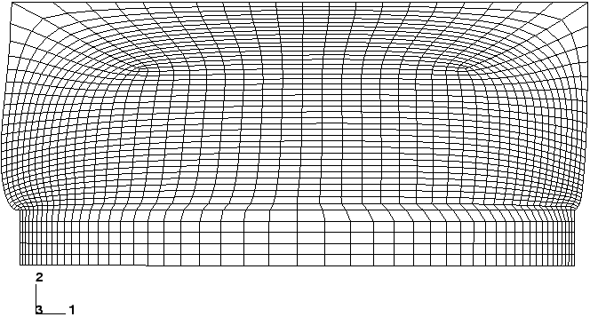

从此图可以明显看出，橡胶模型关键区域的网格畸变已显著减少。检查压力应力的等值线图（不跨元素平均）显示压力应力在元素之间平滑变化。因此，体积锁定已被消除。

---

## 10.10 相关Abaqus示例

- "Pressurized rubber disc," Abaqus Benchmarks Guide第1.1.7节
- "Necking of a round tensile bar," Abaqus Benchmarks Guide第1.1.9节
- "Fitting of rubber test data," Abaqus Benchmarks Guide第3.1.4节
- "Uniformly loaded, elastic-plastic plate," Abaqus Benchmarks Guide第3.2.1节

---

## 10.11 推荐阅读

以下为感兴趣的用户提供材料建模方面的额外参考资料。

**材料通用文本**
- Ashby, M. F., and D. R. H. Jones, *Engineering Materials*, Pergamon Press, 1980.
- Callister, W. D., *Materials Science & Engineering—An Introduction*, John Wiley, 1994.
- Pascoe, K. J., *An Introduction to the Properties of Engineering Materials*, Van Nostrand, 1978.

**塑性**
- SIMULIA, *Metal Inelasticity in Abaqus*.
- Lubliner, J., *Plasticity Theory*, Macmillan Publishing Co., 1990.
- Calladine, C. R., *Engineering Plasticity*, Pergamon Press, 1969.

**橡胶弹性**
- SIMULIA, *Modeling Rubber and Viscoelasticity with Abaqus*.
- Gent, A., *Engineering with Rubber (How to Design Rubber Components)*, Hanser Publishers, 1992.

---

## 10.12 小结

- Abaqus包含丰富的材料行为建模库。它包括金属塑性和橡胶弹性模型。
- 金属塑性模型的应力-应变数据必须以真应力和真塑性应变的形式定义。标称应力-应变数据可以很容易地转换为真应力-应变数据。
- Abaqus中的金属塑性模型假定不可压缩的塑性行为。
- 为效率，Abaqus/Explicit通过用等间距点组成的曲线拟合来**规则化**用户定义的材料曲线。
- Abaqus/Standard中的超弹性材料模型允许完全不可压缩。Abaqus/Explicit中的超弹性材料模型不允许：默认泊松比为0.475。一些分析可能需要增加泊松比以更准确地模拟不可压缩性。
- 多项式、Ogden、Arruda-Boyce、Marlow、van der Waals、Mooney-Rivlin、neo-Hookean、减缩多项式和Yeoh应变能函数可用于橡胶弹性（超弹性）。所有模型都允许直接从实验测试数据确定材料系数。测试数据必须指定为标称应力和标称应变值。
- Abaqus/CAE中的材料评估功能可用于验证超弹性材料模型预测的行为与实验测试数据之间的相关性。
- 稳定性警告可能表明超弹性材料模型不适合您希望分析应变范围。
- 对称的存在可用于减少仿真的规模，因为只需要对组件的一部分进行建模。组件的其余部分的影响通过施加适当的边界条件来表示。
- 大变形问题的网格设计比小位移问题更困难。网格中的元素在分析的任何阶段都不应变得过度畸变。
- 体积锁定可以通过允许少量可压缩性来缓解。必须注意确保引入问题的可压缩性程度不会严重影响整体结果。
- Abaqus/CAE中的X-Y绘图功能允许操作曲线中的数据以创建新曲线。可以添加、减去、乘或除两个曲线或一个曲线和一个常数。曲线也可以被微分、积分和组合。

---

*上一页：[第9章 非线性显式动力学](./09-Nonlinear-Explicit-Dynamics.md) | 下一页：[第11章 多步骤分析](./11-Multiple-Step-Analysis.md)*
