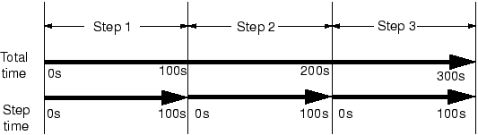

# 第11章 多步骤分析

## 目录

- [11.1 一般分析步骤](#111-一般分析步骤)
- [11.2 线性扰动分析](#112-线性扰动分析)
- [11.3 示例：管道系统振动](#113-示例管道系统振动)
- [11.4 重启动分析](#114-重启动分析)
- [11.5 示例：重启动管道振动分析](#115-示例重启动管道振动分析)
- [11.6 相关Abaqus示例](#116-相关abaqus示例)
- [11.7 小结](#117-小结)

---

## 11.1 一般分析步骤

每个一般步骤的起点是上一个一般步骤结束时的变形状态。因此，模型的状态在一系列一般步骤中随着其响应每个步骤中定义的载荷而演变。任何初始条件都定义了仿真中第一个一般步骤的起点。

所有一般分析过程共享相同的施加载荷和定义"时间"的概念。

### 11.1.1 一般分析步骤中的时间

Abaqus在仿真中有两个时间度量。**总时间**在所有一般步骤中增加，是每个一般步骤的总步长时间的累积。每个步骤也有自己的时间标度（称为**步时间**），每个步骤从零开始。可以以任一时间标度指定随时间变化的载荷和边界条件。对于分为三个步骤的分析（每个100秒长），时间标度如图11-1所示。

### 11.1.2 在一般步骤中指定载荷

在一般步骤中，载荷必须指定为总值，而非增量值。例如，如果第一个步骤中的集中载荷值为1000 N，在第二个一般步骤中增加到3000 N，则两个步骤中载荷的值应指定为1000 N和3000 N，而非1000 N和2000 N。

默认情况下，所有先前定义的载荷都被传播到当前步骤。在当前步骤中，您可以定义其他载荷，也可以修改任何先前定义的载荷（例如，更改其幅值或将其取消激活）。任何未在当前步骤中特别修改的先前定义的载荷继续遵循其相关的振幅定义，前提是振幅曲线以总时间定义；否则，载荷保持在最后一个一般步骤结束时的幅值。

---

## 11.2 线性扰动分析

线性扰动分析步骤仅在Abaqus/Standard中可用。

线性扰动步骤的起点称为模型的基状态。如果仿真中的第一个步骤是线性扰动步骤，则基状态是使用初始条件指定的模型状态。否则，基状态是线性扰动步骤之前最后一个一般步骤结束时仿真的状态。尽管扰动步骤中结构的响应本质上是线性的，但模型可能在先前的一般步骤中具有非线性响应。对于在先前一般步骤中具有非线性响应的模型，Abaqus/Standard使用当前弹性模量作为扰动过程的线性刚度。对于弹塑性材料，该模量是初始弹性模量；对于超弹性材料，是切线模量（见图11-2）；其他材料模型的模量在Abaqus分析用户指南中有描述。

扰动步骤中的载荷应足够小，使得模型的响应不会与用切线模量预测的响应偏差太大。如果仿真包括接触，则两个表面之间的接触状态在扰动步骤期间不会改变：在基状态中闭合的点保持闭合，打开的点保持打开。

### 11.2.1 线性扰动步骤中的时间

如果另一个一般步骤跟随扰动步骤，Abaqus/Standard使用最后一个一般步骤结束时的模型状态作为其起点，而非扰动步骤结束时的模型状态。因此，线性扰动步骤的响应对仿真没有永久影响。因此，Abaqus/Standard不将线性扰动步骤的步时间包含在分析的总时间中。实际上，Abaqus/Standard所做的是将扰动步骤的步时间定义为非常小（10⁻³⁶），以便在添加到累积总时间时没有影响。此规则的例外是模态动力学过程。

### 11.2.2 在线性扰动步骤中指定载荷

在线性扰动步骤中给定的载荷和规定的边界条件始终是该步骤所特有的。在线性扰动步骤中给定的载荷幅值（包括规定的边界条件的幅值）始终是载荷的扰动（增量），而非总幅值。同样，任何解变量的值仅输出为扰动值——基状态中变量的值不包含在内。

作为包含一般和扰动步骤混合的简单载荷历史的示例，考虑如图11-3所示的弓和箭。步骤1可能是给弓上弦——预张紧弓弦。步骤2然后接着向后拉弦并装上箭，从而在系统中存储更多的应变能。步骤3然后是线性扰动分析步骤：特征值频率分析，以研究加载系统的固有频率。这样的步骤也可以在步骤1和2之间包括，以找到仅上弦后但未拉弓射击前的弓和弦的固有频率。步骤4然后是非线性动态分析，其中弓弦被释放，使得通过在步骤2中向后拉弓弦储存在系统中的应变能赋予箭动能并使其离开弓。此步骤因此继续开发系统的非线性响应，但现在包括动态效应。

在这种情况下，每个非线性一般分析步骤必须使用前一个非线性一般分析步骤结束时的状态作为其初始条件是显而易见的。例如，动态部分没有载荷——动态响应是由静态步骤中存储的一些应变能释放引起的。这种效应在模型中引入了自然的顺序依赖性：非线性一般分析步骤按照定义它们的事件发生的顺序相互跟随，线性扰动分析步骤插入到此序列中的适当时间以研究系统此时的线性行为。

更复杂的载荷历史如图11-4所示，它显示了一个不锈钢水槽制造和使用步骤的示意图。

水槽由使用冲头、模具和压料板的薄钢板成型。此成型仿真将包括多个一般步骤。通常，第一步可能涉及压料板压力的施加，冲压操作将在第二步中模拟。第三步将涉及模具的移除，允许水槽回弹到其最终形状。每个步骤都是一个一般步骤，因为它们共同模拟了一个顺序载荷历史，其中每个步骤的起始条件是前一步骤的结束条件。这些步骤显然包含许多非线性效应（塑性、接触、大变形）。在第三步结束时，水槽将包含由成型过程引起的残余应力和非弹性应变。厚度也将作为制造工艺的直接结果而变化。

然后安装水槽：边界条件将施加在水槽边缘周围连接到台面的位置。可能有多种载荷条件下水槽的响应令人关注，需要模拟。例如，需要进行仿真以确保如果有人站在上面，水槽不会破裂。因此，步骤4将是一个线性扰动步骤，分析水槽对局部压力载荷的静态响应。请记住，步骤4的结果将是成型过程后水槽状态的扰动；例如，如果步骤3结束时水槽的位移为2 mm，但您知道从成型仿真开始以来变形要大得多，请不要感到惊讶。这个假设的2 mm偏转只是由人的重量导致的水槽最终配置的附加变形。总偏转是从未变形片材配置测量的，是这2 mm和步骤3结束时的偏转之和。

水槽还可能装有垃圾处理器，因此必须模拟其在某些频率下谐载荷的稳态动态响应。步骤5将是使用直接稳态动力学过程的第二个线性扰动步骤，在处置装置连接点处施加载荷。此步骤的基状态是前一个一般步骤结束时的状态——即成型过程结束时的状态（步骤3）。前一个扰动步骤（步骤4）中的响应被忽略。因此，两个扰动步骤是独立的仿真，模拟水槽对施加到模型基状态的载荷的响应。

如果包括另一个一般步骤，则步骤开始时结构的条件是前一个一般步骤（步骤3）结束时的条件。因此，步骤6可以是一般步骤，其载荷模拟水槽装满水。些步骤中的响应可能是线性或非线性的。继这个一般步骤之后，步骤7可以重复在步骤4中执行的分析。然而，在这种情况下，基状态（前一个一般步骤结束时的结构状态）是步骤6结束时的模型状态。因此，响应将是装满水的水槽的响应，而非空的。执行另一次稳态动力学仿真将产生不准确的结果，因为水的质量（将显著改变响应）将不会被考虑在分析中。

Abaqus/Standard中的以下过程始终是线性扰动步骤：
- 线性特征值屈曲
- 频率提取
- 瞬态模态动力学
- 随机响应
- 响应谱
- 稳态动力学

静态过程可以是一般步骤或线性扰动过程。

---

## 11.3 示例：管道系统振动

在此示例中，您将研究5米长管道系统的振动频率。管道由钢制成，外径为18 cm，壁厚为2 cm（见图11-5）。它一端牢固夹紧，只能在另一端沿轴向移动。这段管道系统可能承受高达50 Hz的谐载荷。未加载结构的最低振动模式为40.1 Hz，但此值未考虑施加到管道结构的载荷如何影响其响应。为确保该部分不会发生共振，您被要求确定使其最低振动模式高于50 Hz所需的服务载荷幅值。已知管道部分在服务时将承受轴向拉伸。首先考虑4 MN的载荷幅值。

管道的最低振动模式将是垂直于管道轴线的任何方向中的正弦波变形，这是由于结构横截面对称。您将使用三维梁单元来对管道部分进行建模。

分析需要固有频率提取。因此，将使用Abaqus/Standard作为分析产品。

### 11.3.1 预处理——使用Abaqus/CAE创建模型

使用Abaqus/CAE创建此示例的模型。

**零件几何**

创建三维、可变形、平面线零件。命名零件为`Pipe`，并使用"创建线：已连接"工具绘制一条水平线，长度为5.0 m。

**材料和截面属性**

管道由钢制成，杨氏模量为200 × 10⁹ Pa，泊松比为0.3。创建名为`Steel`的线性弹性材料，具有这些属性。还必须定义钢材料的密度（7800 kg/m³），因为在此仿真中将提取特征模态和特征频率，并且此类型过程需要质量矩阵。

接下来，创建名为`PipeProfile`的管道轮廓。选择薄壁作为公式，并指定管道的外半径为0.09 m，壁厚为0.02 m。

创建名为`PipeSection`的梁截面。在"编辑梁截面"对话框中，指定将在分析期间执行截面积分，并分配材料`Steel`和轮廓`PipeProfile`到截面定义。

最后，将截面`PipeSection`分配给管道。此外，使用近似n₁方向作为向量(0.0, 0.0, -1.0)定义梁截面方向。

**装配和集合**

创建名为`Pipe`的零件的依赖实例。为了方便，创建包含管道左右两端顶点的几何集合，分别命名为`Left`和`Right`。这些区域稍后将用于向模型分配载荷和边界条件。

**步骤**

在此仿真中需要研究钢管道部分在施加4 MN拉伸载荷时的特征模态和特征频率。因此，分析将分为两个步骤：

| 步骤1. 一般步骤： | 施加4 MN拉伸力 |
|-------------------|----------------|
| 步骤2. 线性扰动步骤： | 计算模态和频率 |

创建名为`Pull I`的一般静态步骤，具有以下步骤描述：`Apply axial tensile load of 4.0 MN`。此步骤中实际的时间量将不影响结果；除非模型包括阻尼或率相关材料属性，否则"时间"在静态分析过程中没有物理意义。因此，使用1.0的时间周期。包含几何非线性的影响，并指定初始增量大小为总步时间的1/10。接受默认允许增量数。

需要计算管道在其加载状态下的特征模态和特征频率。因此，创建使用线性扰动频率提取过程的第二个分析步骤。命名步骤为`Frequency I`，并给出以下描述：`Extract modes and frequencies`。虽然只对第一个（最低）特征模态感兴趣，但提取模型的前八个特征模态。

**输出请求**

默认输出数据库输出请求即可；无需创建任何其他输出数据库输出请求。

要请求输出到重启动文件，请在"步骤"模块中从主菜单栏选择"输出"→"重启动请求"。对于标记为`Pull I`的步骤，每10个增量向重启动文件写入数据；对于标记为`Frequency I`的步骤，每增量向重启动文件写入数据。

**载荷和边界条件**

在第一个步骤中创建名为`Force`的载荷，施加4 × 10⁶ N的拉伸力到管道部分的右端，使其沿正轴向（全局1）方向变形。

管道部分在其左端被夹紧。它也在另一端被夹紧；但是，必须在此端施加轴向力，因此仅约束自由度2至6（U2、U3、UR1、UR2和UR3）。在第一个步骤中向集合`Left`和`Right`施加适当的边界条件。

在第二个步骤中，需要扩展管道部分的固有频率。这不涉及任何扰动载荷的施加，固定边界条件从前一个一般步骤延续。因此，不需要在此步骤中指定任何其他载荷或边界条件。

**网格和作业定义**

用30个均匀分布的二阶管道单元（PIPE32）对管道部分进行网格布置。

在继续之前，将模型重命名为`Original`。此模型将成为"示例：重启动管道振动分析"（第11.5节）中讨论的示例所用模型的基础。

创建名为`Pipe`的作业，具有以下描述：`Analysis of a 5 meter long pipe under tensile load`。

保存模型数据库文件，并提交作业进行分析。

### 11.3.2 监控作业

检查作业运行时和完成时的作业监控器。两个步骤都显示，与线性扰动步骤（步骤2）相关的时间非常小：频率提取过程，或任何线性扰动过程，不贡献模型的一般载荷历史。

### 11.3.3 后处理

**来自线性扰动步骤的变形形状**

可视化模块自动使用输出数据库文件上的最后一个可用帧。第二步仿真的结果是管道的固有模态形状和相应的固有频率。绘制第一模态形状。

默认视图是等轴测的。尝试旋转模型以找到第一特征模态的更好视图，类似于图11-7所示。

由于这是线性扰动步骤，未变形形状是基状态的形状。这使得相对于基状态查看运动变得容易。使用框架选择器绘制其他模态形状。您会发现此模型有许多重复的特征模态。这是管道横截面对称性的结果，每个固有频率产生两个特征模态，对应于1-2和1-3平面中的模态。第二特征模态形状如图11-7所示。一些较高的振动模态形状如图11-8所示。

与每个特征模态相关的固有频率在绘图标题中报告。当施加4 MN拉伸载荷时，管道部分的最低固有频率为47.1 Hz。拉伸载荷增加了管道的刚度，从而增加了管道部分的振动频率。此最低固有频率在谐载荷的频率范围内；因此，在与此载荷一起使用时，管道共振可能是一个问题。

因此，需要继续仿真并向管道部分施加额外的拉伸载荷，直到找到使管道部分的固有频率升高到可接受水平的载荷幅值。而不是重复分析和增加施加的轴向载荷，您可以使用Abaqus中的重启动功能来继续先前仿真的载荷历史的新分析。

---

## 11.4 重启动分析

多步骤仿真不需要在单个作业中定义。事实上，通常希望分阶段运行复杂仿真。这允许您检查结果并确认分析是否按预期执行，然后再继续下一阶段。Abaqus的重启动分析功能允许仿真重启动，并计算模型对额外载荷历史的响应。

### 11.4.1 重启动和状态文件

Abaqus/Standard重启动（.res）文件和Abaqus/Explicit状态（.abq）文件包含继续先前分析所需的信息。在Abaqus/Explicit中，包（.pac）文件和选定结果（.sel）文件也用于重启动分析，必须在第一个作业完成时保存。此外，两个产品都需要输出数据库（.odb）文件。重启动文件对于大模型可能非常大；当请求重启动数据时，默认情况下为每个增量或间隔写入数据。因此，控制写入重启动数据的频率很重要。有时允许在步骤期间覆盖重启动文件上的数据是有用的。这意味着在分析结束时，每个步骤只有一组重启动数据，对应于每个步骤结束时的模型状态。但是，如果分析因某些原因中断（如计算机故障），分析可以从上次写入重启动数据的点继续。

### 11.4.2 重启动分析

当使用先前分析的结果重启动仿真时，您指定从仿真载荷历史的哪个特定点重启动分析。但是，重启动分析中使用的模型必须与原始分析中使用的模型相同，直到重启动位置。具体来说：
- 重启动分析模型不得修改或添加任何在原始分析模型中已定义的几何、网格、材料、截面、梁截面轮廓、材料方向、梁截面方向、相互作用属性或约束
- 类似地，不得修改在重启动位置或之前的任何步骤、载荷、边界条件、预定义场或相互作用

但是，您可以在重启动分析模型中定义新的集合和振幅曲线。

**继续中断的运行**

重启动分析从前一个分析的指定步骤和增量继续。如果给定的步骤和增量不对应于先前分析结束（例如，如果分析被计算机故障中断），Abaqus将尝试完成原始步骤，然后再尝试模拟任何新步骤。

在Abaqus/Explicit中，当重启动仅用于继续一个长步骤时（可能因作业时间限制而终止），您可以使用恢复作业类型重启动运行。

**继续附加步骤**

如果先前的分析成功完成，并且查看了结果后您想向载荷历史添加附加步骤，则指定的步骤和增量应是先前分析的最后步骤和最后增量。

**更改分析**

有时，在查看了先前分析的结果后，您可能想从中间点重启动分析并以某种方式改变剩余载荷历史——例如，添加更多输出请求、更改载荷或调整分析控件。例如，当步骤超出其最大增量数时，这可能是必要的。

在这种情况下，应指示当前步骤应在指定的步骤和增量处终止。仿真然后可以继续新步骤。

---

## 11.5 示例：重启动管道振动分析

为了演示如何重启动分析，取第11.3节中的管道部分示例，并重启动仿真，添加两个额外的载荷历史步骤。第一个仿真预测管道部分在轴向拉伸时容易发生共振；现在必须确定需要多少额外的轴向载荷才能将管道的最低振动频率提高到可接受的水平。

步骤3将是一个一般步骤，将轴向载荷增加到8 MN，步骤4将再次计算特征模态和特征频率。

### 11.5.1 创建重启动分析模型

打开模型数据库文件`Pipe.cae`（如果尚未打开）。将名为`Original`的模型复制到名为`Restart`的模型。

**模型属性**

要执行重启动分析，必须更改模型属性以指示模型应重用先前分析的数据。在模型树中，双击`模型`容器下的`Restart`模型。在出现的"编辑模型属性"对话框中，指定将从作业`Pipe`读取重启动数据，重启动位置将是步骤`Frequency I`的结束。

**步骤定义**

现在创建两个新的分析步骤。第一个新步骤是一般静态步骤；命名步骤为`Pull II`，并将其插入到步骤`Frequency I`之后。给出步骤描述：`Apply axial tensile load of 8.0 MN`；并将步骤的时间周期设置为1.0，初始时间增量设置为0.1。

第二个新步骤是频率提取步骤；命名步骤为`Frequency II`，并将其插入到步骤`Pull II`之后。给出步骤描述：`Extract modes and frequencies`；并使用Lanczos特征求解器提取前8个自然模态和频率。

**输出请求**

对于步骤`Pull II`，每10个增量向重启动文件写入数据。

接受所有其他默认输出数据请求。

**载荷定义**

修改载荷定义，使在第二个一般静态步骤（`Pull II`）中施加到管道的拉伸载荷加倍。

**作业定义**

创建名为`PipeRestart`的作业，具有以下描述：`Restart analysis of a 5 meter long pipe under tensile load`。将作业类型设置为重启动（如果尚未设置）。

保存模型数据库文件，并提交作业进行分析。

### 11.5.2 监控作业

再次检查作业运行时和完成时的作业监控器。此分析从步骤3开始，因为步骤1和2在前面的分析中已完成。现在有两个输出数据库（.odb）文件与此仿真关联。步骤1和2的数据在文件`Pipe.odb`中；步骤3和4的数据在文件`PipeRestart.odb`中。绘制结果时，需要记住每个文件存储了哪些结果，并且需要确保Abaqus/CAE使用正确的输出数据库文件。

### 11.5.3 后处理重启动分析结果

切换到可视化模块，并打开重启动分析的输出数据库文件`PipeRestart.odb`。

**绘制管道的特征模态**

绘制此仿真中与原始分析绘制的相同的六个管道部分特征模态形状。这些特征模态及其固有频率如图11-11所示。

在8 MN轴向载荷下，最低价现在是53.1 Hz，大于要求的最低50 Hz。

**从字段数据绘制所选步骤的X-Y图**

使用存储在输出数据库文件`Pipe.odb`和`PipeRestart.odb`中的字段数据，绘制整个仿真中管道轴向应力的历史。

步骤3中相同元素在分析期间的轴向应力历史可以单独绘制（见图11-13）。

---

## 11.6 相关Abaqus示例

- "Deep drawing of a cylindrical cup," Abaqus Example Problems Guide第1.3.4节
- "Linear analysis of the Indian Point reactor feedwater line," Abaqus Example Problems Guide第2.2.2节
- "Vibration of a cable under tension," Abaqus Benchmarks Guide第1.4.3节
- "Random response to jet noise excitation," Abaqus Benchmarks Guide第1.4.10节

---

## 11.7 小结

- Abaqus仿真可以包括任意数量的步骤。
- 隐式和显式步骤不允许在同一个分析作业中。
- 分析步骤是"时间"的一段期间，在此期间计算模型对一组指定的载荷和边界条件的响应。此响应的特征由步骤期间使用的特定分析过程决定。
- 一般分析步骤中结构的响应可以是线性或非线性的。
- 每个一般步骤的起始条件是前一个一般步骤的结束条件。因此，模型的响应在仿真的一般步骤序列中演变。
- 线性扰动步骤（仅在Abaqus/Standard中可用）计算结构对扰动载荷的线性响应。响应相对于基状态报告，基状态由模型在最后一个一般步骤结束时的条件定义。
- 只要保存了重启动文件，就可以重启动分析。重启动文件可用于继续中断的分析或向仿真添加额外的载荷历史。

---

*上一页：[第10章 材料](./10-Materials.md) | 下一页：[第12章 接触](./12-Contact.md)*
