# 附录 B：在 Abaqus/CAE 中创建和分析简单模型

以下章节是面向有经验的 Abaqus 用户的基础教程。它将带领您遍历 Abaqus/CAE 建模流程的每个模块，并展示创建和分析简单模型的基本步骤。为了说明每个步骤，您将首先创建一个钢制悬臂梁模型，并对其顶面施加荷载（参见图 B-1）。

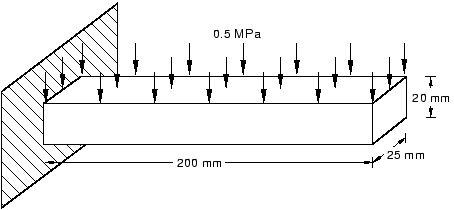

然后您将对梁进行分析并绘制应力和位移结果。整个教程大约需要 90 分钟完成。

涵盖的主题如下：

- [B.1 了解 Abaqus/CAE 模块](#b1-了解-abaquscae-模块)
- [B.2 了解模型树](#b2-了解模型树)
- [B.3 创建部件](#b3-创建部件)
- [B.4 创建材料](#b4-创建材料)
- [B.5 定义和分配截面属性](#b5-定义和分配截面属性)
- [B.6 装配模型](#b6-装配模型)
- [B.7 定义分析步骤](#b7-定义分析步骤)
- [B.8 对模型施加边界条件和一个荷载](#b8-对模型施加边界条件和一个荷载)
- [B.9 对模型进行网格划分](#b9-对模型进行网格划分)
- [B.10 创建并提交分析作业](#b10-创建并提交分析作业)
- [B.11 查看分析结果](#b11-查看分析结果)
- [B.12 小结](#b12-小结)

---

## B.1 了解 Abaqus/CAE 模块

Abaqus/CAE 分为多个模块，每个模块定义建模过程的一个方面；例如，定义几何、定义材料属性和生成网格。当您从一个模块移动到另一个模块时，您构建的模型将用于 Abaqus/CAE 生成输入文件，然后您将该文件提交给 Abaqus/Standard 或 Abaqus/Explicit 进行分析。例如，您使用 **属性（Property）** 模块定义材料和截面属性，使用 **步骤（Step）** 模块选择分析过程。Abaqus/CAE 的后处理器称为 **可视化（Visualization）** 模块，也可作为独立产品 Abaqus/Viewer 获得许可。

您可以通过从上下文栏的 **模块（Module）** 列表中选择来进入模块，如图 B-2 所示。

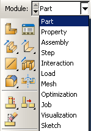

对于悬臂梁教程，您将进入以下 Abaqus/CAE 模块并执行以下任务：

**部件（Part）**
绘制二维轮廓并创建表示悬臂梁的部件。

**属性（Property）**
定义梁的材料属性和其他截面属性。

**装配（Assembly）**
装配模型并创建集合。

**步骤（Step）**
配置分析过程和输出请求。

**荷载（Load）**
对梁施加荷载和边界条件。

**网格（Mesh）**
对梁进行网格划分。

**优化（Optimization）**
创建优化任务（此处不讨论）。

**作业（Job）**
创建作业并提交以进行分析。

**可视化（Visualization）**
查看分析结果。

尽管上下文栏中的 **模块（Module）** 列表按逻辑顺序列出了各个模块，但您可以随意在各模块之间前后移动。不过，某些明显的限制仍然适用；例如，您不能对尚未创建的几何分配截面属性。

完成的模型包含 Abaqus/CAE 生成输入文件和启动分析所需的所有内容。Abaqus/CAE 使用模型数据库来存储您的模型。当您启动 Abaqus/CAE 时，**启动会话（Start Session）** 对话框允许您在内存中创建一个新的空模型数据库。启动 Abaqus/CAE 后，您可以通过从主菜单栏选择 **文件（File）→ 保存（Save）** 将模型数据库保存到磁盘；要从磁盘检索模型，请选择 **文件（File）→ 打开（Open）**。

有关哪个模块生成特定关键字的完整列表，请参阅《Abaqus/CAE 用户手册》附录 A.1 中的"Abaqus 关键字浏览器表"。

---

## B.2 了解模型树

模型树提供了模型中项目层次结构的可视化描述。图 B-3 显示了一个典型的模型树。

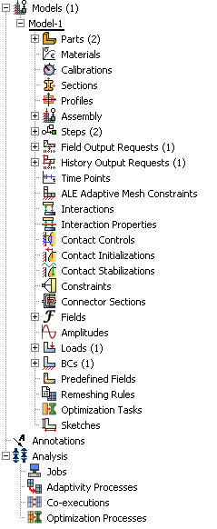

模型树中的项目由小图标表示；例如，**步骤（Steps）** 图标。此外，项目旁边的括号表示该项目是一个容器，括号中的数字表示容器中的项目数。您可以单击模型树中的"+"和"-"符号来展开和折叠容器。右箭头键和左箭头键执行相同的操作。

模型树中容器和项目的排列反映了您创建模型的预期顺序。如前所述，模块菜单中模块的顺序也遵循类似的逻辑——您先创建部件再创建装配，先创建步骤再创建荷载。此排列是固定的——您不能移动模型树中的项目。

模型树提供了主菜单栏和模块管理器的大部分功能。例如，如果您双击 **部件（Parts）** 容器，则可以创建新部件（相当于从主菜单栏选择 **部件（Part）→ 创建（Create）**）。

后续示例的说明将侧重于使用模型树来访问 Abaqus/CAE 的功能。只有在必要时才会考虑菜单栏操作（例如，在创建有限元网格或后处理结果时）。

---

## B.3 创建部件

您可以创建 Abaqus/CAE 原生的部件，也可以从其他应用程序导入部件，导入形式可以是几何表示或有限元网格。

您将从创建悬臂梁教程开始，创建一个三维可变形实体。您可以通过绘制梁的二维轮廓（一个矩形）并拉伸它来实现此目的。创建部件时，Abaqus/CAE 会自动进入草图器。

Abaqus/CAE 经常在提示区域显示一条简短消息，指示下一步期望您做什么，如图 B-4 所示。

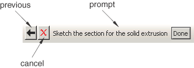

单击 **取消（Cancel）** 按钮取消当前任务。单击 **上一步（Previous）** 按钮取消任务中的当前步骤并返回上一步。

### 创建悬臂梁的步骤：

1. 如果您尚未启动 Abaqus/CAE，请输入 `abaqus cae`。调整窗口大小，以便您可以按照教程操作并看到 Abaqus/CAE 主窗口。

2. 从出现的 **启动会话（Start Session）** 对话框中的 **创建模型数据库（Create Model Database）** 选项中，选择 **带 Standard/Explicit 模型（With Standard/Explicit Model）**。如果您已经在 Abaqus/CAE 会话中，请从主菜单栏选择 **文件（File）→ 新建（New）**。

   Abaqus/CAE 进入 **部件（Part）** 模块。模型树出现在主窗口的左侧。模型树和画布之间是 **部件（Part）** 模块工具箱。

3. 在模型树中，双击 **部件（Parts）** 容器以创建新部件。

   将出现 **创建部件（Create Part）** 对话框。Abaqus/CAE 也在窗口底部的提示区域显示文本，以指导您完成该过程。

4. 将部件命名为 `Beam`。接受三维可变形体和实体拉伸基础特征的默认设置。在 **近似尺寸（Approximate size）** 文本框中输入 `300`。

5. 单击 **继续（Continue）** 退出 **创建部件（Create Part）** 对话框。

   Abaqus/CAE 自动进入草图器。草图器工具箱出现在主窗口左侧，草图器网格出现在视口中。

   **提示：** 与 Abaqus/CAE 中的所有工具一样，如果您只是将光标在草图器工具箱中的某个工具上停留片刻，就会出现一个小窗口，提供该工具的简要说明。

6. 要绘制悬臂梁的轮廓，请选择矩形绘图工具。

7. 在视口中，按以下步骤绘制矩形：

   a. 您将首先绘制梁的大致轮廓，然后使用约束和尺寸来细化草图。选择任意两点作为矩形的对角顶点。

   b. 在视口中任意位置单击鼠标按钮 2 以退出矩形工具。

   **注意：** 如果您是使用双按钮鼠标的 Windows 用户，当被要求按下鼠标按钮 2 时，请同时按下两个鼠标按钮。

   c. 草图器自动向草图添加约束（本例中为矩形的四个角分配了垂直约束，一条边被指定为水平）。

   d. 使用尺寸工具为矩形的顶边和左边标注尺寸。顶边应有水平尺寸 `200 mm`，左边应有垂直尺寸 `20 mm`。

   e. 最终草图如图 B-5 所示。

   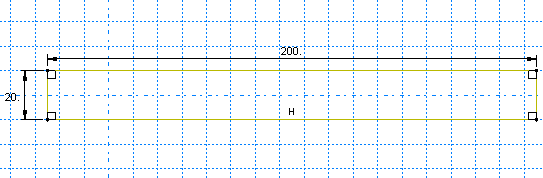

8. 如果在使用草图器时犯错，您可以删除草图中的线条：

   a. 从草图器工具箱中，单击 **删除（Delete）** 工具。

   b. 从草图中，单击一条线将其选中。Abaqus/CAE 将选中的线以红色高亮显示。

   c. 在视口中单击鼠标按钮 2 以删除选中的线。

   d. 根据需要重复步骤 b 和 c。

   **注意：** 您也可以使用 **撤销（Undo）** 工具和 **重做（Redo）** 工具来撤销和重做之前的操作。

9. 从提示区域单击 **完成（Done）** 退出草图器。

10. 因为您正在创建拉伸部件，Abaqus/CAE 显示 **编辑基础拉伸（Edit Base Extrusion）** 对话框。在 **深度（Depth）** 字段中输入值 `25.0`。单击 **确定（OK）**。

    Abaqus/CAE 显示新部件的等轴测视图，如图 B-6 所示。

    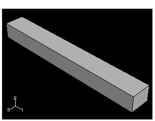

11. 在继续本教程之前，将您的模型保存在模型数据库文件中。

    a. 从主菜单栏中，选择 **文件（File）→ 保存（Save）**。

    b. 在 **文件名（File Name）** 字段中为新模型数据库输入名称，然后单击 **确定（OK）**。

---

## B.4 创建材料

对于悬臂梁教程，您将创建一种具有杨氏模量 209 x 10³ MPa 和泊松比 0.3 的单一线弹性材料。

### 定义材料的步骤：

1. 在模型树中，双击 **材料（Materials）** 容器以创建新材料。

   Abaqus/CAE 切换到 **属性（Property）** 模块，并出现 **编辑材料（Edit Material）** 对话框。

2. 将材料命名为 `Steel`。从材料编辑器的菜单栏中，选择 **力学（Mechanical）→ 弹性（Elasticity）→ 弹性（Elastic）**。

   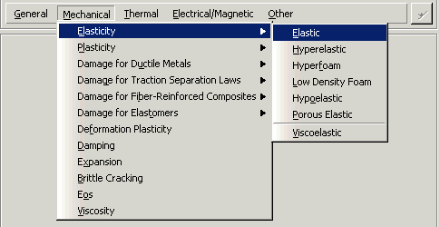

3. 输入杨氏模量值 `209.E3` MPa，泊松比值 `0.3`，如图 B-8 所示。使用 [Tab] 在各单元格之间移动。

   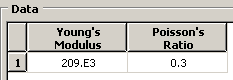

4. 单击 **确定（OK）** 退出材料编辑器。

---

## B.5 定义和分配截面属性

您通过截面来定义部件的属性。创建截面后，您可以将截面分配给当前视口中的部件。对于悬臂梁教程，您将创建一个单一的均质实体截面，并通过从视口中选择梁来将其分配给梁。

### B.5.1 定义均质实体截面

均质实体截面是您可以定义的最简单的截面类型；它只包含一个材料参考和一个可选的平面应力/平面应变厚度定义。

### 定义均质实体截面的步骤：

1. 在模型树中，双击 **截面（Sections）** 容器以创建截面。

   将出现 **创建截面（Create Section）** 对话框。

2. 在 **创建截面（Create Section）** 对话框中：

   a. 将截面命名为 `BeamSection`。

   b. 在 **类别（Category）** 列表中，接受 **实体（Solid）** 作为默认类别选择。

   c. 在 **类型（Type）** 列表中，接受 **均质（Homogeneous）** 作为默认类型选择。

   d. 单击 **继续（Continue）**。

   将出现 **编辑截面（Edit Section）** 对话框。

3. 在对话框中：

   a. 接受与该截面关联的 **材料（Material）** 的默认选择 `Steel`。

   b. 单击 **确定（OK）**。

### B.5.2 将截面分配给悬臂梁

必须将截面 `BeamSection` 分配给部件。

### 将截面分配给悬臂梁的步骤：

1. 在模型树中，展开名为 **Beam** 的部件分支。

2. 双击出现的部件属性列表中的 **截面分配（Section Assignments）**。

3. 在梁上任意位置单击以选择要应用截面的区域。Abaqus/CAE 高亮显示整个梁。

4. 在视口中单击鼠标按钮 2 或单击 **完成（Done）** 以接受选定的几何。

5. 接受 `BeamSection` 作为截面的默认选择，然后单击 **确定（OK）**。

   Abaqus/CAE 将实体截面分配给梁，并将整个梁着色为蓝绿色以指示该区域已具有截面分配。

**注意：** 当您将截面分配给部件的区域时，该区域将获得与截面关联的材料属性。

---

## B.6 装配模型

您创建的每个部件都有自己独立于模型中其他部件的坐标系。尽管一个模型可能包含许多部件，但它只包含一个装配。您通过创建部件实例然后在全局坐标系中相对于彼此定位这些实例来定义装配的几何。

对于悬臂梁教程，您将创建悬臂梁的单一实例。Abaqus/CAE 定位该实例，使定义梁矩形轮廓的草图原点与装配默认坐标系的原点重合。

### 装配模型的步骤：

1. 在模型树中，展开 **装配（Assembly）** 容器。然后双击 **实例（Instances）**。

   Abaqus/CAE 切换到 **装配（Assembly）** 模块，并出现 **创建实例（Create Instance）** 对话框。

2. 在对话框中，选择 `Beam` 并单击 **确定（OK）**。

   Abaqus/CAE 创建悬臂梁的实例，并以等轴测方向显示它。

3. 在 **视图操作（View Manipulation）** 工具栏中，单击旋转视图操作工具。

   当您将鼠标移回视口时，会出现一个圆圈。

4. 在视口中拖动鼠标以旋转模型并从各个角度进行检查。

   单击鼠标按钮 2 退出旋转模式。

5. **视图操作（View Manipulation）** 工具栏中还提供了其他几个工具（平移、放大、缩小和自动适应）来帮助您检查模型。

---

## B.7 定义分析步骤

既然您已经创建了部件，就可以定义分析步骤了。对于悬臂梁教程，分析将包括两个步骤：

- 初始步骤，您将在其中应用边界条件来约束悬臂梁的一端。
- 一个通用的静态分析步骤，您将在其中向梁的顶面施加压力荷载。

Abaqus/CAE 自动生成初始步骤，但您必须自己创建分析步骤。

### B.7.1 创建分析步骤

创建一个在分析初始步骤之后的一般静态步骤。

### 创建通用静态分析步骤的步骤：

1. 在模型树中，双击 **步骤（Steps）** 容器以创建步骤。

   Abaqus/CAE 切换到 **步骤（Step）** 模块。**创建步骤（Create Step）** 对话框出现，其中列出了所有一般过程。

2. 将步骤命名为 `BeamLoad`。

3. 从可用一般过程列表中，选择 **静力，通用（Static, General）** 并单击 **继续（Continue）**。

4. 在 **描述（Description）** 字段中，输入 `Load the top of the beam`。

5. 单击 **增量（Incrementation）** 选项卡，接受默认的时间增量设置。

6. 单击 **其他（Other）** 选项卡查看其内容；您可以接受默认值。

7. 单击 **确定（OK）** 创建步骤。

### B.7.2 请求数据输出

当您提交作业进行分析时，Abaqus/Standard 或 Abaqus/Explicit 将分析结果写入输出数据库。

当您创建步骤时，Abaqus/CAE 会为该步骤生成默认的输出请求。

### 检查输出请求的步骤：

1. 在模型树中，在 **场输出请求（Field Output Requests）** 容器上单击鼠标按钮 3 并选择 **管理器（Manager）**。

   **场输出请求管理器（Field Output Requests Manager）** 在左侧显示现有输出请求的字母顺序列表，在顶部显示所有步骤的名称。

2. 查看 Abaqus/CAE 为您创建的 **静力，通用（Static, General）** 步骤生成的默认输出请求。

3. 单击 **编辑（Edit）** 查看有关输出请求的更详细信息。

4. 单击 **取消（Cancel）** 关闭场输出编辑器，因为您不想进行任何更改。

5. 单击 **关闭（Dismiss）** 关闭 **场输出请求管理器（Field Output Requests Manager）**。

6. 以类似方式查看历史输出请求。

---

## B.8 对模型施加边界条件和一个荷载

规定条件（如荷载和边界条件）是步骤相关的，这意味着您必须指定它们生效的步骤。

### B.8.1 对悬臂梁的一端施加边界条件

创建一个约束悬臂梁一端为固定端的边界条件。

### 对悬臂梁一端施加边界条件的步骤：

1. 在模型树中，双击 **边界条件（BCs）** 容器。

   Abaqus/CAE 切换到 **荷载（Load）** 模块，并出现 **创建边界条件（Create Boundary Condition）** 对话框。

2. 在 **创建边界条件（Create Boundary Condition）** 对话框中：

   a. 将边界条件命名为 `Fixed`。

   b. 从步骤列表中，选择 `Initial` 作为边界条件将被激活的步骤。

   c. 在 **类别（Category）** 列表中，接受 **力学（Mechanical）**。

   d. 在 **所选步骤的类型（Types for Selected Step）** 列表中，接受 **对称/反对称/固定（Symmetry/Antisymmetry/Encastre）** 并单击 **继续（Continue）**。

3. 您将固定悬臂梁左端的面，如图 B-9 所示。

   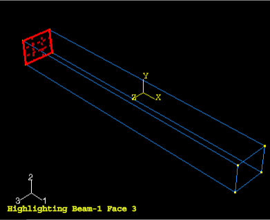

4. 在视口中单击鼠标按钮 2 或单击 **完成（Done）** 以表示您已完成选择。

5. 在 **编辑边界条件（Edit Boundary Condition）** 对话框中：

   a. 切换选中 **固定端（ENCASTRE）**。

   b. 单击 **确定（OK）**。

   Abaqus/CAE 在所选面的每个角和中点显示箭头，以指示被约束的自由度。

6. 在模型树中，在 **边界条件（BCs）** 容器上单击鼠标按钮 3 并选择 **管理器（Manager）** 以查看 **边界条件管理器（Boundary Condition Manager）**。

7. 单击 **关闭（Dismiss）** 关闭 **边界条件管理器（Boundary Condition Manager）**。

### B.8.2 对悬臂梁顶部施加荷载

既然您已经固定了悬臂梁的一端，就可以对梁的顶面施加分布荷载了。

### 对悬臂梁顶部施加荷载的步骤：

1. 在模型树中，双击 **荷载（Loads）** 容器。

   将出现 **创建荷载（Create Load）** 对话框。

2. 在 **创建荷载（Create Load）** 对话框中：

   a. 将荷载命名为 `Pressure`。

   b. 从步骤列表中，选择 `BeamLoad` 作为将施加荷载的步骤。

   c. 在 **类别（Category）** 列表中，接受 **力学（Mechanical）**。

   d. 在 **所选步骤的类型（Types for Selected Step）** 列表中，选择 **压力（Pressure）** 并单击 **继续（Continue）**。

3. 在视口中，选择梁的顶面作为将施加荷载的面，如图 B-10 所示。

   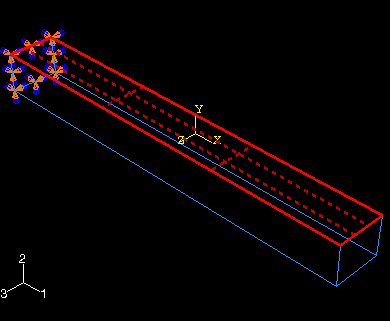

4. 在视口中单击鼠标按钮 2 或单击 **完成（Done）**。

5. 在 **编辑荷载（Edit Load）** 对话框中：

   a. 输入荷载大小 `0.5` MPa。

   b. 接受默认的 **分布（Distribution）** 选择。

   c. 接受默认的 **幅值（Amplitude）** 选择。

   d. 单击 **确定（OK）**。

   Abaqus/CAE 在梁的顶面沿显示向下的箭头。

---

## B.9 对模型进行网格划分

现在您将生成有限元网格。您可以选择 Abaqus/CAE 用于创建网格的网格技术、单元形状和单元类型。

### B.9.1 分配网格控制

### 分配网格控制的步骤：

1. 在模型树中，展开 **部件（Parts）** 容器下的 **Beam** 项，然后双击 **网格（Mesh）**。

   Abaqus/CAE 切换到 **网格（Mesh）** 模块。

2. 从主菜单栏中，选择 **网格（Mesh）→ 控件（Controls）**。

   将出现 **网格控件（Mesh Controls）** 对话框。Abaqus/CAE 将使用结构化网格为悬臂梁划分网格，并以绿色显示梁。

3. 在对话框中，接受 **六面体（Hex）** 作为默认的 **单元形状（Element Shape）** 选择。

4. 接受 **结构化（Structured）** 作为默认的 **技术（Technique）** 选择。

5. 单击 **确定（OK）**。

### B.9.2 分配 Abaqus 单元类型

### 分配 Abaqus 单元类型的步骤：

1. 从主菜单栏中，选择 **网格（Mesh）→ 单元类型（Element Type）**。

   将出现 **单元类型（Element Type）** 对话框。

2. 在对话框中，接受以下默认选择：

   - **标准（Standard）** 是默认的 **单元库（Element Library）** 选择。
   - **线性（Linear）** 是默认的 **几何阶次（Geometric Order）**。
   - **3D 应力（3D Stress）** 是单元的默认 **族（Family）**。

3. 单击 **六面体（Hex）** 选项卡，从配方选项列表中选择 **不兼容模式（Incompatible modes）**。

   出现单元类型 C3D8I 的描述。

4. 单击 **确定（OK）**。

### B.9.3 创建网格

基本网格划分是一个两步操作：首先对部件实例的边界进行布种，然后对部件实例进行网格划分。

### 对模型进行网格划分的步骤：

1. 从主菜单栏中，选择 **布种（Seed）→ 部件（Part）** 为部件实例布种。

   将出现 **全局布种（Global Seeds）** 对话框。

2. 输入近似全局大小 `10.0` 并单击 **确定（OK）**。

3. 在提示区域中单击 **完成（Done）**。

   Abaqus/CAE 将种子应用到部件实例，如图 B-11 所示。

   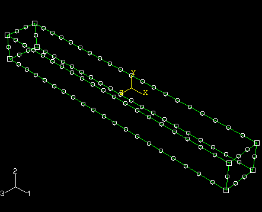

4. 从主菜单栏中，选择 **网格（Mesh）→ 部件（Part）** 为部件实例划分网格。

5. 在提示区域中，单击 **是（Yes）** 确认您要对部件实例进行网格划分。

   Abaqus/CAE 对部件实例进行网格划分并显示结果网格，如图 B-12 所示。

   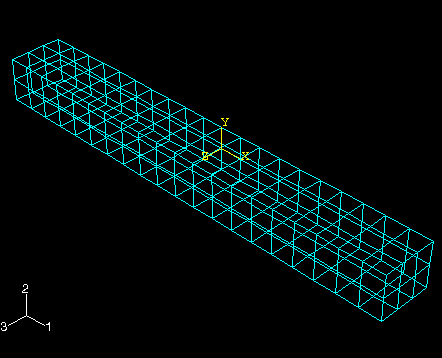

---

## B.10 创建并提交分析作业

现在您已经配置了分析，您将创建与模型关联的作业并提交该作业进行分析。

### 创建并提交分析作业的步骤：

1. 在模型树中，双击 **作业（Jobs）** 容器以创建作业。

   Abaqus/CAE 切换到 **作业（Job）** 模块，并出现 **创建作业（Create Job）** 对话框。

2. 将作业命名为 `Deform`。

3. 单击 **继续（Continue）** 创建作业。

4. 在 **描述（Description）** 字段中，输入 `Cantilever beam tutorial`。

5. 单击 **确定（OK）** 接受所有默认作业设置。

6. 在模型树中，展开 **作业（Jobs）** 容器；在名为 **Deform** 的作业上单击鼠标按钮 3，并选择 **提交（Submit）** 以提交您的作业进行分析。

   悬臂梁教程的状态显示以下之一：

   - **已提交（Submitted）** 表示正在生成分析输入文件。
   - **运行中（Running）** 表示 Abaqus 正在分析模型。
   - **完成（Completed）** 表示分析完成。
   - **中止（Aborted）** 表示 Abaqus/CAE 发现输入文件或分析存在问题。

7. 当作业成功完成时，在模型树中在名为 **Deform** 的作业上单击鼠标按钮 3 并选择 **结果（Results）** 以进入 **可视化（Visualization）** 模块。

---

## B.11 查看分析结果

您使用 **可视化（Visualization）** 模块读取 Abaqus/CAE 在分析期间生成的输出数据库并查看结果。因为您将作业命名为 `Deform`，所以 Abaqus/CAE 将输出数据库命名为 `Deform.odb`。

在本教程中，您将查看悬臂梁模型的未变形和变形形状，并创建轮廓图。

### 查看分析结果的步骤：

1. 在模型树中选择 **结果（Results）** 后，Abaqus/CAE 进入 **可视化（Visualization）** 模块，打开 `Deform.odb`，并显示模型的未变形形状，如图 B-13 所示。

   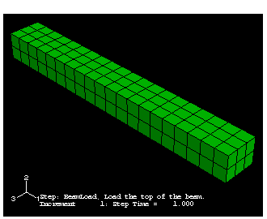

2. 从主菜单栏中，选择 **绘图（Plot）→ 变形形状（Deformed Shape）** 查看变形形状图。

3. 单击自动适应工具，使整个图形重新缩放以适应视口，如图 B-14 所示。

   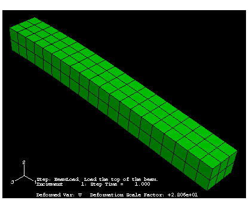

4. 从主菜单栏中，选择 **绘图（Plot）→ 轮廓（Contours）→ 在变形形状上（On Deformed Shape）** 查看 von Mises 应力的轮廓图，如图 B-15 所示。

   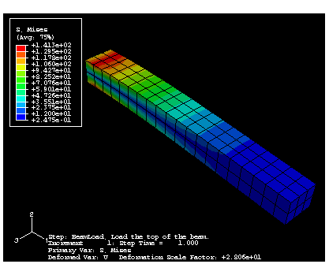

5. 从主菜单栏中，选择 **结果（Result）→ 场输出（Field Output）** 检查可用于显示的变量。

   默认情况下，选择了 **积分点处的应力分量（Stress components at integration points）** 变量的 **Mises** 不变量。

6. 单击 **取消（Cancel）** 关闭 **场输出（Field Output）** 对话框。

您已完成本教程。

---

## B.12 小结

- 创建部件时，您为其命名并选择其类型、建模空间、基础特征和近似尺寸。
- 创建或编辑部件时，Abaqus/CAE 自动进入草图器。您使用草图器绘制部件的二维轮廓。
- 在视口中单击鼠标按钮 2 以表示您已完成选择项目或使用工具。
- 您可以创建材料并定义其属性，创建截面并定义其类别和类型。由于截面引用材料，因此必须首先定义材料。
- 模型只包含一个装配。装配由在全局坐标系中定位的部件实例组成。
- Abaqus/CAE 自动生成初始步骤，但您必须创建分析步骤。您使用步骤编辑器定义每个分析步骤。
- 当您创建步骤时，Abaqus/CAE 会为该步骤生成默认的输出请求。
- 规定条件（如荷载和边界条件）是步骤相关对象，这意味着您必须指定它们生效的步骤。
- 管理器对于检查和修改每个步骤中规定条件的状态非常有用。
- 您在 **荷载（Load）** 模块中创建荷载并定义荷载施加到装配上的位置。
- 尽管您可以在创建装配后的任何时候创建网格，但通常是在配置模型其余部分之后进行。
- 您可以在创建网格之前或之后分配单元类型。
- 您使用布种来定义最终网格中节点的近似位置。
- 您可以使用模型树提交作业并监控作业的状态。
- 在 **可视化（Visualization）** 模块中，您可以读取分析生成的输出数据库并查看结果。
- 您可以以多种模式显示结果——未变形、变形和轮廓。您可以控制每种模式下显示的外观。
