# 附录 C：使用附加技术在 Abaqus/CAE 中创建和分析模型

附录 B"在 Abaqus/CAE 中创建和分析简单模型"介绍了如何创建和分析一个仅由一个零件组成的非常简单模型。在本高级教程中，您将创建和分析一个更复杂的模型。该模型的复杂性体现在两个方面：

- 它由三个不同的零件组成，而不是仅仅一个。本教程说明了如何定位这些零件的实例以创建装配体，以及如何定义装配体表面之间的接触。
- 它包含使用高级绘图技术绘制的零件。您将学习草图、基准几何体和分割如何组合来定义构成各个零件的特征。您还将学习如何通过编辑特征来修改零件，以及修改后的零件如何重新生成。

与附录 B"在 Abaqus/CAE 中创建和分析简单模型"一样，您将向模型施加截面属性、载荷和边界条件；您还将对模型进行网格划分、配置分析并运行分析作业。在教程的最后，您将查看分析结果。整个教程大约需要三个小时完成。

本教程假定您熟悉附录 B"在 Abaqus/CAE 中创建和分析简单模型"中描述的技术，包括：

- 使用视图操作工具在视口中旋转和缩放对象。
- 遵循提示区域的提示。
- 使用鼠标选择菜单项、工具箱项和视口中的项。

---

## C.1 概述

在本教程中，您将创建一个由销钉固定的铰链装配体。装配后的零件实例和最终的网格划分如图 C-1 所示。

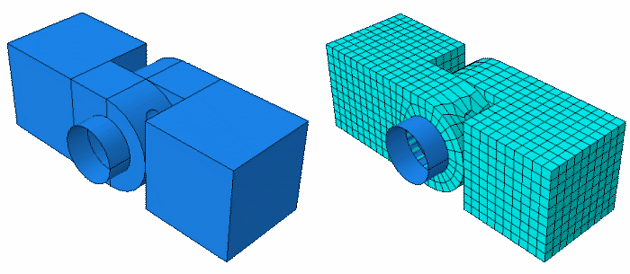

本教程包含以下章节：

- "创建第一个铰链零件，"第 C.2 节
- "为铰链零件指定截面属性，"第 C.3 节
- "创建和修改第二个铰链零件，"第 C.4 节
- "创建销钉，"第 C.5 节
- "装配模型，"第 C.6 节
- "定义分析步骤，"第 C.7 节
- "创建用于接触相互作用的表面，"第 C.8 节
- "定义模型区域之间的接触，"第 C.9 节
- "向装配体施加边界条件和载荷，"第 C.10 节
- "对装配体进行网格划分，"第 C.11 节
- "创建和提交作业，"第 C.12 节
- "查看分析结果，"第 C.13 节

---

## C.2 创建第一个铰链零件

首先创建第一个零件——铰链的一半。Abaqus/CAE 模型由特征组成；您通过组合特征来创建零件。铰链的这部分由以下特征组成：

- 一个立方体——基础特征，因为它是零件的第一个特征。
- 一个从立方体延伸的法兰。法兰还包括一个用于插入销钉的大直径孔。
- 法兰一角的一个小润滑孔。

### C.2.1 创建立方体

要创建立方体（基础特征），您需要创建一个实心、三维、拉伸的零件并命名。然后绘制其轮廓（0.04 m × 0.04 m）并将轮廓拉伸指定距离（0.04 m）以产生铰链第一半的基础特征。所需的立方体如图 C-2 所示。

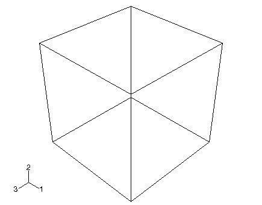

**注意：** Abaqus/CAE 使用的默认渲染样式是**着色**。为清晰起见，本教程中的许多图使用了线框或隐藏线渲染样式。有关更多信息，请参阅 Abaqus/CAE 用户指南的第 76.2 节"选择渲染样式"。

**创建立方体的步骤：**

1. 启动 Abaqus/CAE，并创建一个新的模型数据库。调整窗口大小，以便能够跟随教程并看到 Abaqus/CAE 主窗口。

   Abaqus/CAE 进入零件模块，并在主窗口左侧显示模型树。

2. 在模型树中，双击**零件**容器以创建新零件。

   **创建零件**对话框出现。

   提示区域中的文本提示您填写**创建零件**对话框。Abaqus/CAE 始终在提示区域显示提示以指导您完成操作。

3. 将零件命名为 `Hinge-hole`。接受以下默认设置：
   - 三维、可变形体
   - 实心拉伸基础特征

4. 在**近似尺寸**文本框中输入 `0.2`。您将使用米作为长度单位来建模铰链，其总长度为 0.14 米；因此，0.2 米对于该零件来说是一个足够大的近似尺寸。单击**继续**以创建零件。

   草图器启动，并在画布和模型树之间显示工具箱。Abaqus/CAE 使用零件的近似尺寸来计算默认的图纸尺寸——本例中为 0.2 米。此外，在本例中草图器在图纸上绘制 40 条网格线，每条网格线之间的距离为 0.005 米。（您可能看到的网格线少于 40 条，因为图纸延伸到了视口之外。）

5. 从草图器工具箱中选择矩形工具。

6. 绘制一个任意矩形，然后在视口中单击鼠标按钮 2 以退出矩形工具。

7. 为顶部和左侧边缘标注尺寸，使每个边缘的长度为 `0.04` m。

   **重要：** 为成功完成本教程，使用所述的尺寸并不要偏离示例非常重要；否则您会发现很难装配模型。

8. 单击鼠标按钮 2 以退出草图器。

   **提示：** 在视口中单击鼠标按钮 2 与单击提示区域中的默认按钮具有相同的效果——本例中为**完成**。

   Abaqus/CAE 显示**编辑基体拉伸**对话框。

9. 在对话框中，输入**深度** `0.04` 并按 **[Enter]**。

   Abaqus/CAE 退出草图器并显示基础特征（一个立方体），如图 C-2 所示。视口左下角的三轴指示 X、Y 和 Z 轴的方向。您可以通过从主菜单栏选择**视口** -> **视口注释选项**并关闭**显示三轴**选项来关闭此三轴。（在本教程的图中，三轴有时会被关闭以保持清晰。）

   **注意：** 默认情况下，Abaqus/CAE 使用字母选项 x-y-z 来标记视图方向三轴。通常，本指南采用数字选项 1-2-3，以允许与自由度输出标签直接对应。有关轴标签的更多信息，请参阅 Abaqus/CAE 用户指南的第 5.4 节"自定义视图三轴"。

### C.2.2 向基础特征添加法兰

现在您将向基础特征添加实心特征——法兰。您选择立方体的一个面来定义草图平面，并将草图的轮廓拉伸过立方体深度的一半。立方体和法兰如图 C-3 所示。

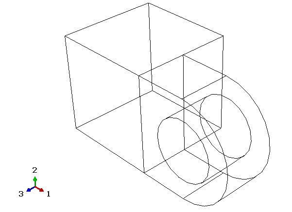

**向基础特征添加法兰的步骤：**

1. 从主菜单栏，选择**形状** -> **实体** -> **拉伸**。

2. 选择立方体前面的面来定义草图平面，如图 C-4 所示。

   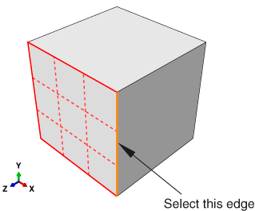

   当您在选择过程中停止移动光标时，Abaqus/CAE 会高亮显示它在当前光标位置将选择的对象的边缘。这种高亮行为称为"预选"。

   **注意：** Abaqus/CAE 中有两种形式的预选：一种用于从视口选择对象，另一种用于从草图器中选择。有关更多信息，请分别参阅 Abaqus/CAE 用户指南的第 6.3.4 节"在选择前高亮显示对象"和第 20.9.3 节"打开或关闭预选"。

3. 选择一条将显示为垂直且在草图右侧的边缘，如图 C-4 所示。

   同样，Abaqus/CAE 使用预选来帮助您选择所需的边缘。

   草图器启动，并将基础特征的轮廓显示为参考几何体。Abaqus/CAE 放大视图以适应草图平面；图纸尺寸和网格间距也会根据草图平面的大小重新计算。要将图纸尺寸和网格间距更改回其原始设置，并为当前会话禁用其自动重新计算，请使用工具箱中的选项工具。在**常规**标签页上，关闭**自动**旁边的图纸尺寸文本框并设置值为 `0.2`；关闭**自动**旁边的网格间距文本框并设置值为 `0.005`。

   **提示：** 要为零件中的所有草图保留原始图纸尺寸和网格间距，您可以在绘制基础特征（立方体）时选择选项工具，并关闭两个**自动**设置。

   您将创建的法兰草图如图 C-5 所示。要复制图中的视图，请再次使用选项工具将网格间距加倍。

   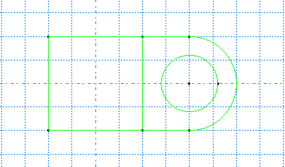

4. 缩放以查看绘制法兰的区域：
   - 从**视图操作**工具栏中，选择放大工具。
   - 将光标定位在视口中心附近。
   - 单击鼠标按钮 1 并向左拖动，直到立方体占据可见草图空间的大约一半。

   缩小视图是必要的，因为法兰是在所选草图平面的边缘之外创建的。

5. 与之前一样，首先绘制新特征的大致形状。从草图器工具箱中选择连续线工具。

6. 通过绘制三条线来绘制法兰的矩形部分：
   - 从立方体右上角的任意点开始，连接到立方体的右上角。
   - 继续下一条线到立方体的右下角。这条线自动被分配垂直约束。
   - 最后一条线从立方体的右下角延伸到立方体右侧的任意点。

   **提示：** 如果在绘制过程中出错，请使用草图器的撤销或删除工具来纠正错误。

7. 在视口中单击鼠标按钮 2 以退出连续线工具。

8. 通过定义以下约束和尺寸来细化草图：
   - 使用约束工具约束草图的顶部和底部线条，使每条线水平。
   - 为这两条线分配相等长度约束（使用 **[Shift]+单击**选择两条线）。
   - 标注任一条线的尺寸，使其长度为 `0.02` m。

   草图如图 C-6 所示。

   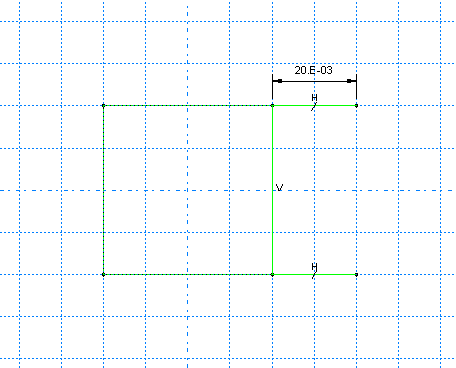

9. 使用三点圆工具添加半圆弧来封闭轮廓。
   - 选择矩形开口端的两条线作为弧的端点，从顶部的一个开始。选择草图右侧的任意点作为弧上的点。
   - 定义弧端点和水平线之间的切线约束以细化草图。

10. 在视口中单击鼠标按钮 2 以退出三点圆工具。

    生成的圆弧如图 C-7 所示。

    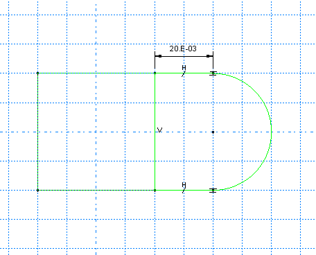

11. 从草图器工具箱中选择同心圆工具来绘制法兰孔。
    - 将圆心放置在大致与先前创建的弧心重合的位置。圆周点应放置在圆心点的右侧。在两个圆形区域之间应用同心约束。
    - 使用尺寸工具将半径值更改为 `0.01` m。
    - 标注每个圆的圆心与其圆周点之间的垂直距离。将此距离编辑为 `0`。（如果距离已经是 `0`，则无法添加垂直尺寸。）这将调整圆周点的位置，使其与圆心点在同一水平面上。

    **注意：** 当您对零件进行网格划分时，Abaqus/CAE 会在边缘出现的任何顶点处放置节点；因此，圆周上顶点的位置会影响最终的网格。将其放置在与圆心点相同的水平面上会产生高质量的网格。

12. 最终草图如图 C-8 所示。

    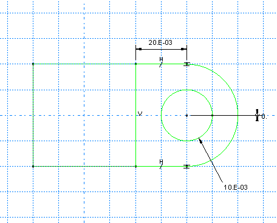

13. 单击鼠标按钮 2 以退出草图器。

    Abaqus/CAE 以等轴测视图显示零件，视图显示基体拉伸、您的草图轮廓和一个指示拉伸方向的箭头。实体的默认拉伸方向始终是离开实体的方向。Abaqus/CAE 还显示**编辑拉伸**对话框。

    **提示：** 使用自动拟合视图操作工具来使绘制的法兰轮廓和基体拉伸适合在视口中显示。

14. 在**编辑拉伸**对话框中：
    - 接受默认的**类型**选择为**盲孔**，以指示您将提供拉伸深度。
    - 在**深度**字段中，输入拉伸深度 `0.02`。
    - 单击翻转箭头按钮以反转拉伸方向，如图 C-9 所示。

      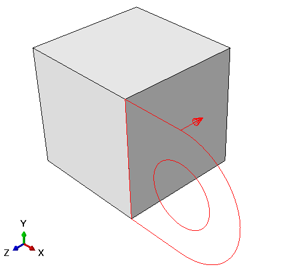

    - 打开**保留内部边界**。当您打开此选项时，Abaqus/CAE 保留在拉伸实体特征和现有零件之间生成的面。因此，拉伸的法兰被保留为第二个单元，而不是与立方体合并。（当您在教程结束时对模型进行网格划分时，内部边界允许您对法兰进行网格划分，而不必先将单元和法兰分割成单独的单元。）
    - 单击**确定**以创建实体拉伸。

    Abaqus/CAE 显示由立方体和法兰组成的零件。再次使用自动拟合视图操作工具来调整零件大小以适应视口。

### C.2.3 修改特征

每个零件由一组特征定义，每个特征又由一组参数定义。例如，基础特征（立方体）和第二个特征（法兰）都由一个草图和一个拉伸深度定义。您通过修改定义其特征的参数来修改零件。对于铰链示例，您将把法兰草图中孔的半径从 0.01 m 更改为 0.012 m。

**修改特征的步骤：**

1. 在模型树中，展开**零件**容器下的 **Hinge-hole** 项。然后展开出现的**特征**容器。

   显示每个特征的**名称**列表。在本例中您创建了两个实体拉伸特征：基础特征（立方体）**Solid extrude-1** 和法兰 **Solid extrude-2**。

2. 在此列表中，单击鼠标按钮 3 单击**Solid extrude-2**（法兰）。

   Abaqus/CAE 在视口中高亮显示所选特征。

3. 从出现的菜单中，选择**编辑**。

   Abaqus/CAE 显示特征编辑器。对于拉伸实体，您可以更改拉伸深度、扭曲或拔模角度（如果在创建特征时指定了的话）以及轮廓草图。

4. 从特征编辑器中，单击编辑草图按钮。

   Abaqus/CAE 显示第二个特征的草图，特征编辑器消失。

5. 从草图器工具箱的编辑工具中，选择编辑尺寸值工具。

6. 选择圆的半径尺寸（`0.010`）。

7. 在**编辑尺寸**对话框中，输入新半径 `0.012` 并单击**确定**。

   Abaqus/CAE 关闭对话框，仅更改草图中圆的半径。

8. 单击鼠标按钮 2 以退出编辑尺寸值工具。再次单击鼠标按钮 2 以退出草图器。

   Abaqus/CAE 再次显示特征编辑器。

9. 单击**确定**以使用修改后的半径重新生成法兰并退出特征编辑器。

   法兰孔已放大到新的半径尺寸。

   **注意：** 在某些情况下，重新生成特征会导致依赖特征失败。在这种情况下，Abaqus/CAE 会询问您是否要保存更改并抑制未能重新生成的特征，或者是否要恢复到未修改的特征并丢失您的更改。

### C.2.4 创建草图平面

法兰包含一个用于润滑的小孔，如图 C-10 所示。

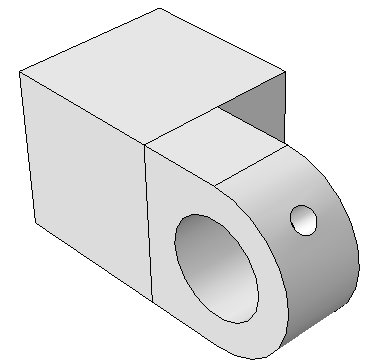

在所需位置创建孔需要一个合适的基准平面来绘制拉伸切除的轮廓草图，如图 C-11 所示。

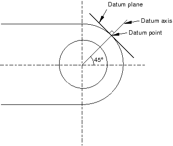

您可以在基准平面上绘制一个圆，该圆与法兰相切，Abaqus/CAE 会将圆沿垂直于基准平面并垂直于法兰的方向拉伸以创建润滑孔。

创建基准平面涉及三个操作：

- 在法兰圆周上创建一个基准点。
- 创建连接两个基准点的基准轴。
- 通过圆周上的基准点并垂直于基准轴创建基准平面。

**创建草图平面的步骤：**

1. 从主菜单栏，选择**工具** -> **基准**。

   Abaqus/CAE 显示**创建基准**对话框。

2. 沿着法兰的曲线边缘创建基准点，基准平面将通过该边缘。从**创建基准**对话框中，选择**点**基准类型。

3. 从方法列表中，单击**输入参数**。

4. 选择曲线边缘，如图 C-12 所示。注意箭头方向，指示从 0.0 到 1.0 的递增边缘参数。您无法更改此箭头的方向。

   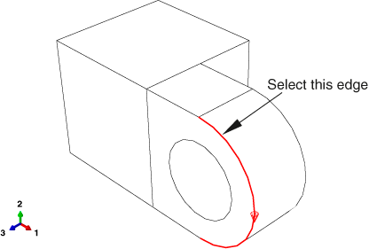

5. 在提示区域的文本框中，输入归一化边缘参数并按 **[Enter]**。如果箭头方向与图 C-12 相同，请输入 `0.25` 作为归一化边缘参数；如果箭头指向相反方向，请输入 `0.75` 作为归一化边缘参数。

   Abaqus/CAE 在所选边缘上创建一个基准点。

6. 创建一个将定义基准平面法线的基准轴。从**创建基准**对话框中，选择**轴**基准类型。单击**2 点**方法。

   Abaqus/CAE 高亮显示可用来创建基准轴的点。

7. 选择孔中心的点（创建孔的草图时生成）和曲线边缘上的基准点。

   Abaqus/CAE 显示穿过两点的基准轴，如图 C-13 所示。

   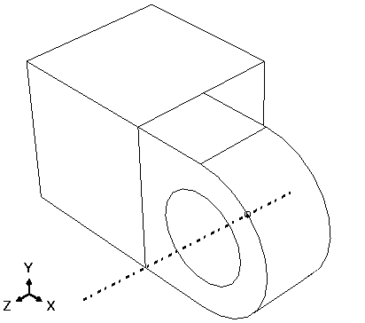

8. 最后一步是创建垂直于基准轴的基准平面。从**创建基准**对话框中，选择**平面**基准类型。单击**点和法线**方法。

9. 选择曲线边缘上的基准点作为基准平面将通过的点。

10. 选择基准轴作为将垂直于基准平面的边缘。

    Abaqus/CAE 创建基准平面，如图 C-14 所示。

    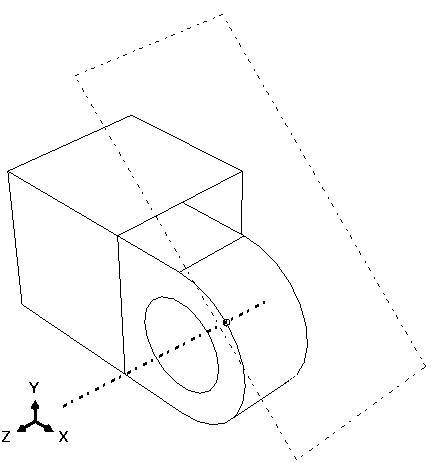

### C.2.5 绘制润滑孔

下一个操作通过从刚创建的基准平面拉伸一个圆来在法兰上创建润滑孔。首先，您需要在法兰上创建一个表示孔中心的基准点，如图 C-15 所示。

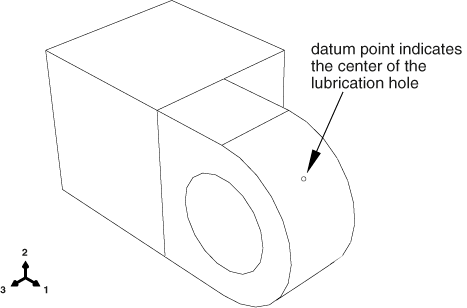

**在润滑孔中心创建基准点的步骤：**

1. 沿着法兰的第二条曲线边缘创建基准点。从**创建基准**对话框中，选择**点**基准类型。

2. 从方法列表中，单击**输入参数**。

3. 选择法兰的第二条曲线边缘，如图 C-16。

   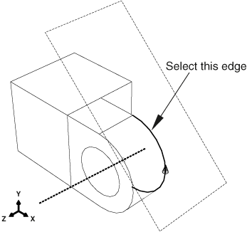

4. 注意箭头方向，指示从 0.0 到 1.0 的递增边缘参数。输入归一化边缘参数 `0.75`（如果箭头方向与图 C-16 相反，则输入 `0.25`），然后按 **[Enter]**。

   Abaqus/CAE 在所选边缘上创建一个基准点。

5. 从**创建基准**对话框的方法列表中，选择**两点之间的中点**。

6. 选择第一条曲线边缘上的基准点。

7. 选择第二条曲线边缘上的基准点。

   Abaqus/CAE 在法兰上创建一条穿过两点的基准点。

8. 关闭**创建基准**对话框。

   本练习说明了如何使用基于特征的建模来捕捉您的设计意图。基准点是 Abaqus/CAE 定义为位于法兰边缘上基准点之间的中点处的特征。因此，如果您更改法兰的厚度，润滑孔将保持在中心位置。

**绘制润滑孔的步骤：**

1. 从主菜单栏，选择**形状** -> **切除** -> **拉伸**。

2. 单击基准平面的边界以将其选为绘制草图的平面。

3. 选择立方体顶部后边缘作为将显示为垂直且在草图右侧的边缘，如图 C-17。

   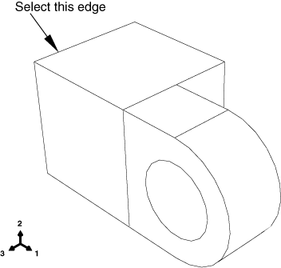

   草图器启动，零件的顶点、基准和边缘被投影到草图平面上作为参考几何体。

   **提示：** 如果您不确定草图平面和零件的相对方向，请使用视图操作工具来旋转和平移它们。使用重置视图工具来恢复原始视图。

4. 从草图器工具箱中，选择圆工具。

5. 选择法兰中心的基准点来表示圆的圆心。

6. 选择任意其他点，然后单击鼠标按钮 1。

7. 标注孔的半径。圆的半径应更改为 0.003 m。

8. 标注圆的圆心和圆周点之间的垂直距离。将此距离设置为零。如前所述，这将提高网格的质量。

9. 退出草图器。

   Abaqus/CAE 以等轴测视图显示铰链，视图显示基础零件和法兰、您绘制的孔轮廓以及指示拉伸切除方向的箭头。Abaqus/CAE 还显示**编辑切除拉伸**对话框。

10. 从**编辑切除拉伸**对话框中的**类型**菜单中，选择**至面**并单击**确定**。

11. 选择零件中孔的圆柱形内表面作为拉伸至的面，如图 C-18。

    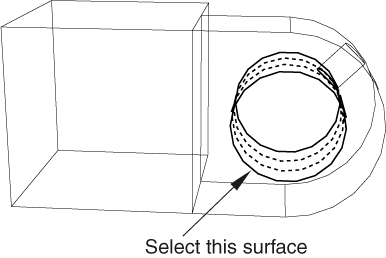

    Abaqus/CAE 将草图从基准平面拉伸至法兰中的孔。

12. 如有必要，从**渲染样式**工具栏中选择着色显示工具，并使用旋转工具查看零件及其特征的朝向，如图 C-19。（为清晰起见，通过选择**视图** -> **零件显示选项** -> **基准**，已从图 C-19 中移除基准几何体。）

    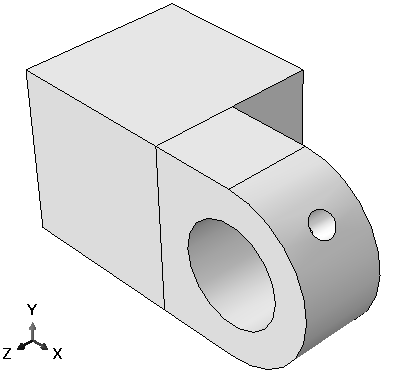

    **提示：** 旋转零件后，使用循环视图工具逐步查看以前的视图（最多八个）并恢复原始视图。

13. 现在您已经创建了模型的第一个零件，最好将模型保存到模型数据库中：
    - 从主菜单栏，选择**文件** -> **保存**。出现**另存模型数据库为**对话框。
    - 在**文件名**字段中为新模型数据库输入名称，然后单击**确定**。您不需要包含文件扩展名；Abaqus/CAE 会自动将 `.cae` 追加到文件名。

    Abaqus/CAE 将模型数据库存储在新文件中，并返回零件模块。模型数据库的名称出现在主窗口标题栏中。

    如果您需要中断本教程，您可以随时保存模型数据库并退出 Abaqus/CAE。然后您可以启动新的 Abaqus/CAE 会话，并通过从**开始会话**对话框中选择**打开数据库**来打开保存的模型数据库。模型数据库将包含您创建的任何零件、材料、载荷等，您将能够继续本教程。

---

## C.3 为铰链零件指定截面属性

为零件指定截面属性的过程分为三个任务：

- 创建材料。
- 创建包含材料引用的截面。
- 将截面指定给零件或零件的某个区域。

### C.3.1 创建材料

您将创建一种名为 `Steel` 的材料，其杨氏模量为 209 GPa，泊松比为 0.3。

**定义材料的步骤：**

1. 在模型树中，双击**材料**容器以创建新材料。

   **编辑材料**对话框出现。

2. 将材料命名为 `Steel`。

3. 从编辑器的菜单栏中，选择**机械** -> **弹性** -> **弹性**。

   Abaqus/CAE 显示**弹性**数据表单。

4. 在**弹性**数据表单的相应字段中，输入杨氏模量值 `209.E9` 和泊松比值 `0.3`。

5. 单击**确定**退出材料编辑器。

### C.3.2 定义截面

接下来，您将创建一个包含 `Steel` 材料引用的截面。

**定义截面的步骤：**

1. 在模型树中，双击**截面**容器以创建截面。

   **创建截面**对话框出现。

2. 在**创建截面**对话框中：
   - 将截面命名为 `SolidSection`。
   - 在**类别**列表中，接受 **Solid** 作为默认选择。
   - 在**类型**列表中，接受 **Homogeneous** 作为默认选择，然后单击**继续**。

   截面编辑器出现。

3. 在编辑器中，接受 `Steel` 作为材料选择，然后单击**确定**。

   如果您定义了其他材料，您可以单击**材料**文本框旁边的箭头来查看可用材料列表并选择您选择的材料。

### C.3.3 指定截面

现在您将把 `SolidSection` 截面指定给铰链零件。

**向铰链零件指定截面的步骤：**

1. 在模型树中，展开**零件**容器下的 **Hinge-hole** 项，然后双击出现的列表中的**截面指定**。

2. 拖动一个矩形框住铰链零件以选择整个零件。

   Abaqus/CAE 高亮显示零件的所有区域。

3. 单击鼠标按钮 2 以指示您已完成选择要指定截面的区域。

   **编辑截面指定**对话框出现，其中包含现有截面列表。默认选择 `SolidSection`，因为目前没有定义其他截面。

4. 在**编辑截面指定**对话框中，接受默认的 `SolidSection` 选择，然后单击**确定**。

   Abaqus/CAE 将截面指定给零件，并将整个零件着色为蓝绿色以指示该区域已具有截面指定。

---

## C.4 创建和修改第二个铰链零件

模型包含第二个铰链零件，类似于第一个，只是没有润滑孔。您将创建第一个铰链零件的副本并删除形成润滑孔的特征。

### C.4.1 复制铰链

首先您将创建铰链零件的精确副本。

**复制铰链的步骤：**

1. 在模型树中，单击鼠标按钮 3 单击**零件**容器下的 **Hinge-hole**，然后从出现的菜单中选择**复制**。

   **零件复制**对话框出现。

2. 在**零件复制**对话框的文本框中，输入 `Hinge-solid`，然后单击**确定**。

   Abaqus/CAE 创建铰链零件的副本，并将副本命名为 **Hinge-solid**。铰链零件的副本包括原始铰链零件的截面。

### C.4.2 修改铰链副本

现在您将通过删除形成润滑孔的特征来创建实心铰链零件。

**修改铰链副本的步骤：**

1. 在模型树中，双击**零件**容器下的 **Hinge-solid** 使其成为当前零件。

   Abaqus/CAE 在当前视口中显示零件。查看视口标题栏以查看正在显示哪个零件。

2. 展开 **Hinge-solid** 下的**特征**容器。

3. 单击鼠标按钮 3 单击特征列表中的 **Datum pt-1**。

   Abaqus/CAE 高亮显示该点，如图 C-20。

   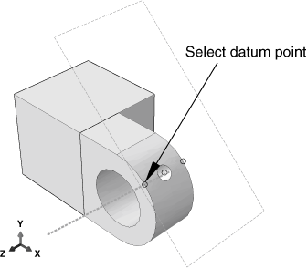

4. 从出现的菜单中，选择**删除**。当您删除选定的特征时，Abaqus/CAE 会询问您是否也要删除依赖于被删除特征的任何特征。被删除的特征称为"父"特征，其依赖特征称为"子"特征。Abaqus/CAE 高亮显示如果删除父特征将删除的所有特征。从提示区域的按钮中，单击**是**以删除基准点及其所有子项。

   Abaqus/CAE 删除基准点。因为基准轴、基准平面和润滑孔依赖于基准点，所以 Abaqus/CAE 也删除了它们。

   **重要：** 您无法恢复已删除的特征；但是，您可以通过抑制特征来临时移除特征。

---

## C.5 创建销钉

最终装配由两个可绕销钉自由旋转的铰链零件实例组成。您将把销钉建模为三维旋转解析刚体表面。首先创建销钉并分配刚体参考点；然后通过向该刚体参考点施加约束来约束销钉。

### C.5.1 创建销钉

现在您将创建销钉——一个三维、旋转解析刚体表面。

**创建销钉的步骤：**

1. 在模型树中，双击**零件**容器以创建新零件。

   **创建零件**对话框出现。

2. 将零件命名为 `Pin`。像之前一样选择三维体，但将类型更改为**解析刚体**，基础特征形状更改为**旋转壳**。

3. 接受近似尺寸 `0.2`，然后单击**继续**。

   草图器启动，并将旋转轴显示为带有固定位置约束的绿色虚线；您的草图不能跨越此轴。

4. 从草图器工具箱中选择连续线工具。在轴右侧绘制一条垂直线。

5. 标注从线到轴的水平距离，并将距离更改为 `0.012`。

6. 标注线的垂直长度，并将长度更改为 `0.06`。

7. 单击鼠标按钮 2 以退出草图器。

   草图和生成的着色零件如图 C-21。

   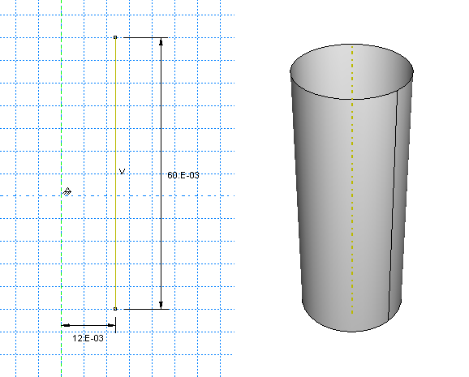

### C.5.2 分配刚体参考点

您需要向销钉分配刚体参考点。因为您不会向销钉分配质量或转动惯量，所以刚体参考点可以放置在视口中的任何位置。您使用载荷模块向参考点施加约束或定义其运动。您向刚体参考点施加的运动或约束会被施加到整个刚体表面。

您可以从视口中的零件选择参考点，也可以输入其坐标。对于本教程，您将从视口选择参考点，如图 C-22。

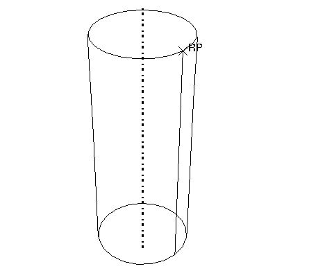

**分配参考点的步骤：**

1. 从主菜单栏，选择**工具** -> **参考点**。

2. 选择销钉圆周上的一个顶点。

   Abaqus/CAE 将该顶点标记为 **RP** 以指示参考点已被分配给它。

---

## C.6 装配模型

您的下一个任务是创建零件实例。零件实例可以被认为是原始零件的表示；实例不是零件的副本。然后您可以在全局坐标系中定位这些零件实例以创建装配体。

实例保持与原始零件的关联。如果零件的几何形状发生变化，Abaqus/CAE 会自动更新零件的所有实例以反映这些变化。您不能直接编辑零件实例的几何形状。装配体可以包含单个零件的多个实例；例如，在钣金装配中重复使用的铆钉。

实例可分为独立或依赖。独立零件实例单独进行网格划分，而依赖零件实例的网格与原始零件的网格相关联。零件网格划分将在"对装配体进行网格划分，"第 C.11 节中进一步讨论。默认情况下，零件实例是依赖的。

当您创建零件实例时，Abaqus/CAE 会定位它，使定义基础特征的草图原点与装配体的全局坐标系原点重叠。此外，草图平面与全局坐标系的 X-Y 平面对齐。

当您创建第一个零件实例时，装配模块会显示一个图形，指示原点和对齐方式。您可以使用此图形来帮助您决定如何相对于全局坐标系定位选定的实例。对于本教程，您将保持带润滑孔的铰链固定，并相对于它移动第二个铰链和销钉。

### C.6.1 创建零件实例

首先，您需要创建以下实例：

- 带润滑孔的铰链零件实例——`Hinge-hole`。
- 移除润滑孔的铰链零件实例——`Hinge-solid`。
- 销钉实例——`Pin`。

**创建带润滑孔的铰链零件实例的步骤：**

1. 在模型树中，展开**装配体**容器。然后双击出现的列表中的**实例**以创建新的零件实例。

   **创建实例**对话框出现，其中包含当前模型中所有零件的列表——本例中为两个铰链零件和销钉。

2. 在对话框中，选择 `Hinge-hole`。

   Abaqus/CAE 显示所选零件的临时图像。

3. 在对话框中，单击**应用**。

   **注意：** **确定**和**应用**按钮之间有什么区别？当您单击**确定**时，**创建实例**对话框会在零件被实例化后关闭。当您单击**应用**时，**创建实例**对话框保持打开状态，同时您创建实例，并可供您创建下一个实例。如果您只想创建一个零件实例，请单击**确定**；如果您想创建多个零件实例后再进行新操作，请单击**应用**。

   Abaqus/CAE 创建铰链零件的依赖实例，并显示一个图形指示全局坐标系的原点和方向。Abaqus/CAE 将实例命名为 `Hinge-hole-1`，以表明它是名为 `Hinge-hole` 的零件的第一个实例。

   **注意：** 零件实例的默认位置是使基础特征草图的原点和 X 轴、Y 轴与全局坐标系的原点和 X 轴、Y 轴对齐。例如，铰链零件的基础特征是您创建的原始立方体。Abaqus/CAE 定位铰链零件的实例，使立方体草图的原点位于全局坐标系的原点，并且 X 轴和 Y 轴对齐。

### C.6.2 创建实心铰链零件实例

现在您将创建实心铰链零件的实例。为了将实心铰链零件与带润滑孔的铰链零件实例分开，您要求 Abaqus/CAE 沿 X 轴偏移新实例。

**创建实心铰链零件实例的步骤：**

1. 在**创建实例**对话框中，打开**自动从其他实例偏移**。

   自动偏移功能可防止新的零件实例与现有实例重叠。

2. 从**创建实例**对话框中，选择 **Hinge-solid** 并单击**确定**。

   Abaqus/CAE 关闭对话框，创建新的依赖实例，并沿 X 轴施加偏移以分隔两个铰链，如图 C-23。（为清晰起见，通过选择**视图** -> **装配显示选项** -> **基准**，已从图 C-23 及后续图的着色视图中移除基准几何体。）

   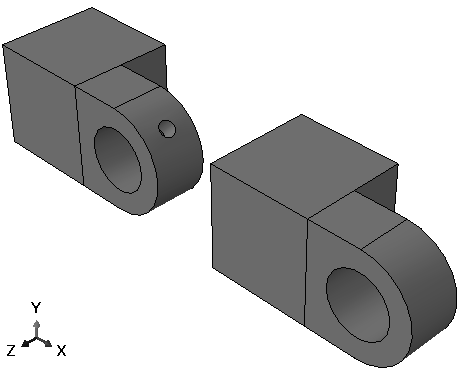

### C.6.3 定位实心铰链零件

除了简单的平移和旋转过程外，装配模块还提供了一组工具，允许您通过定义所选面或边缘之间的关系来定位选定的零件实例。您可以选择要移动的实例的面（或边缘）（称为可动零件实例）和保持固定的实例的面（或边缘）（称为固定零件实例），然后选择以下位置约束之一：

**平行面：** 可动实例移动，直到两个所选面平行。

**面对齐：** 可动实例移动，直到两个所选面平行且彼此之间保持指定的间隙。

**平行边缘：** 可动实例移动，直到两个所选边缘平行。

**边缘对齐：** 可动实例移动，直到两个所选边缘共线或彼此之间保持指定距离。

**同轴：** 可动实例移动，直到两个所选面同轴。

**重合点：** 可动实例移动，直到两个所选点重合。

**平行坐标系：** 可动实例移动，直到两个所选基准坐标系平行。

Abaqus/CAE 将位置约束存储为装配体的特征，它们可以被编辑、删除和抑制。相比之下，平移和旋转不被存储，也不出现在特征列表中。尽管位置约束被存储为特征，但它们彼此之间不了解；因此，新的位置约束可能会覆盖先前的位置约束。

在本例中，您将移动实心铰链零件，而带润滑孔的铰链零件将保持固定。您将应用三种类型的位置约束来正确定位两个铰链零件。

**定位实心铰链零件的步骤：**

1. 首先，约束实心铰链零件，使两个法兰彼此面对。从主菜单栏，选择**约束** -> **面对齐**。

2. 从可动零件实例中，选择如图 C-24 所示的面。

   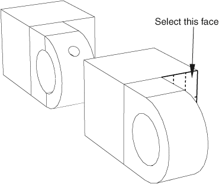

3. 从固定零件实例中，选择如图 C-25 所示的带润滑孔铰链零件的面。Abaqus/CAE 将可动零件实例的面显示为红色，固定零件实例的面显示为紫红色。

   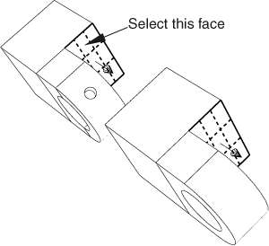

   Abaqus/CAE 在每个所选面上显示红色箭头；可动实例将被定位，使箭头指向相同的方向。如有必要，您可以更改可动实例上箭头的方向。

4. 从提示区域，单击**翻转**以更改箭头方向。当箭头彼此指向时单击**确定**。

5. 在提示区域出现的文本框中，输入将保持在两个零件之间的间隙（0.04），这是沿固定零件所选面的法线方向测量的，然后按 **[Enter]**。

   Abaqus/CAE 旋转实心铰链零件，使两个所选面彼此平行且相距 0.04 米，如图 C-26。

   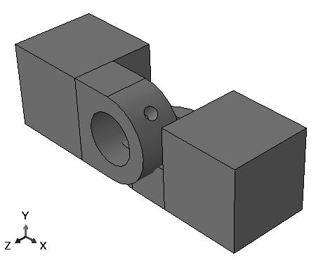

   两个零件重叠，因为您应用的位置约束不足以完全确定实心铰链零件的位置。您需要再应用两个位置约束才能获得所需的位置。

6. 接下来，对齐两个法兰孔。从主菜单栏，选择**约束** -> **同轴**。

7. 选择实心铰链零件上的法兰孔，如图 C-27。（您可能会发现显示两个零件的线框视图很有帮助。）

   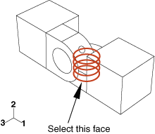

8. 选择带润滑孔铰链零件上的法兰孔，如图 C-28。

   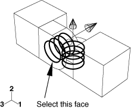

   Abaqus/CAE 在每个所选面上显示红色箭头。

9. 从提示区域，单击**翻转**以更改可动零件实例上箭头的方向。当箭头指向上时单击**确定**。

   Abaqus/CAE 定位两个铰链零件，使两个法兰孔同轴。

10. 使用旋转工具查看两个零件的俯视图。注意两个法兰现在重叠了，如图 C-29。

    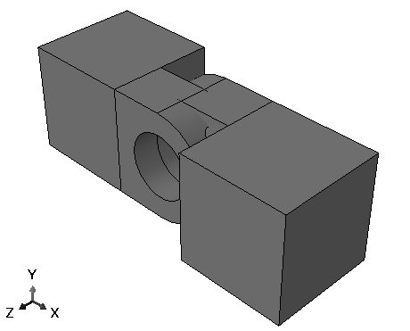

11. 最后，添加约束以消除两个法兰之间的重叠。从主菜单栏，选择**约束** -> **边缘对齐**。

12. 选择如图 C-30 所示的实心铰链零件上的直边缘。

    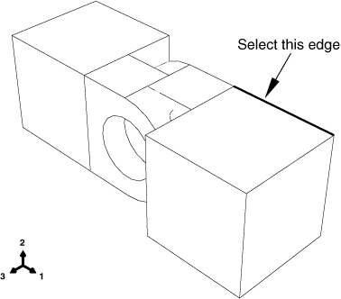

13. 选择带润滑孔铰链零件的对应边缘，如图 C-31。

    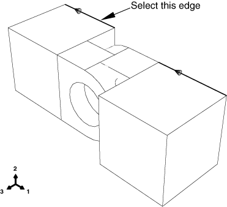

    Abaqus/CAE 在每个所选面上显示红色箭头。

14. 如有必要，翻转箭头使其指向相同的方向；然后单击**确定**以应用约束。

    Abaqus/CAE 定位两个铰链零件，使两条所选边缘共线，如图 C-32。

    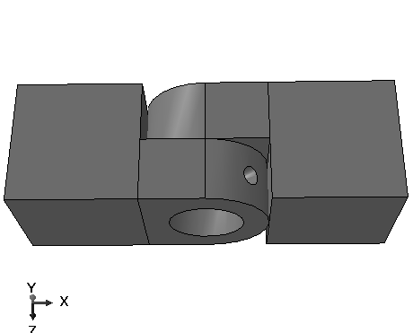

### C.6.4 创建和定位销钉实例

现在您将创建销钉实例，并使用约束和平移向量将其对称地定位在法兰孔中。要定义平移向量，您可以从装配体中选择顶点，也可以输入坐标。您可以使用**查询**工具确定平移向量。

**定位销钉的步骤：**

1. 在模型树中，双击**装配体**容器下的**实例**。

2. 在**创建实例**对话框中，关闭**自动从其他实例偏移**并创建销钉实例。

3. 约束销钉使其沿与两个法兰孔相同的轴线。使用**约束** -> **同轴**菜单，就像之前对齐两个法兰孔时一样。（您可以选择任一法兰孔作为固定实例的圆柱面，箭头的方向不重要。）

   Abaqus/CAE 将定位销钉，如图 C-33。

   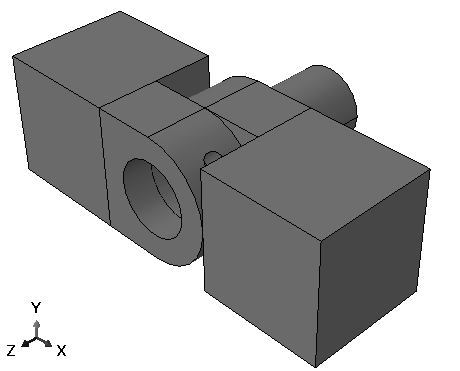

4. 从主菜单栏，选择**工具** -> **查询**。

   **查询**对话框出现。

5. 从**常规查询**列表中选择**距离**。

6. **距离**查询允许您测量连接两个所选点的向量的 X、Y 和 Z 分量。您需要确定销钉端部和带润滑孔铰链之间的距离；要选择的两个点如图 C-34 所示。

   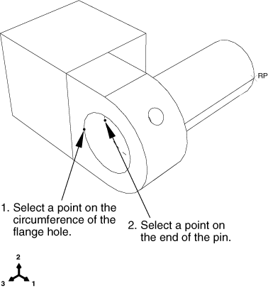

   - 要定义向量的一个端点，请选择带润滑孔法兰中孔圆周上的一个点。
   - 要定义向量的另一个端点，请选择位于带润滑孔铰链内部的销钉上的顶点。

   Abaqus/CAE 在消息区域显示两个所选点之间的向量距离以及向量的 X、Y 和 Z 分量。您将沿 Z 轴平移销钉；距离的 Z 分量为 0.01 米。您希望将销钉对称地定位在铰链之间，因此您要平移 0.02 米。

7. 从主菜单栏，选择**实例** -> **平移**。

8. 选择要移动的销钉作为零件实例，然后单击**完成**以指示您已完成选择要移动的实例。

9. 在提示区域的文本框中，输入平移向量的起点 `0,0,0` 和终点 `0,0,0.02`。

   Abaqus/CAE 沿 Z 轴将销钉平移 0.02 的距离，并显示销钉新位置的临时图像。

   **注意：** 如果临时图像（红色）的位置不正确，您可以使用提示区域的按钮来纠正问题。单击**取消**按钮取消该过程，或单击**上一步**按钮逐步返回。

10. 从提示区域单击**确定**。

    完成的装配体如图 C-35。

    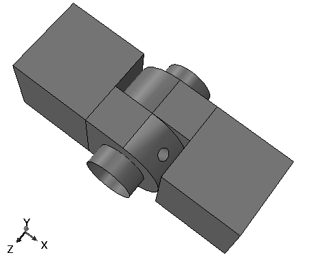

11. 在继续之前，将所有位置约束转换为绝对位置。从主菜单栏，选择**实例** -> **转换约束**。选择所有零件实例，然后在提示区域单击**完成**。

---

## C.7 定义分析步骤

在向模型施加载荷或边界条件或定义模型内的接触之前，您必须定义分析中的不同步骤。创建步骤后，您可以指定在哪些步骤中施加载荷、边界条件和相互作用。

当您创建步骤时，Abaqus/CAE 会选择与分析过程相对应的默认输出变量集，并选择将变量写入输出数据库的默认速率。在本教程中，您将编辑第一个步骤的默认输出频率，并编辑第二个步骤的默认输出变量列表。

### C.7.1 创建分析步骤

您对铰链模型执行的分析将包括一个初始步骤和两个通用分析步骤：

- 在初始步骤中，您向模型区域施加边界条件并定义模型区域之间的接触。
- 在第一个通用分析步骤中，您允许接触建立。
- 在第二个通用分析步骤中，您修改施加到模型的边界条件，并向其中一个铰链零件施加压力载荷。

Abaqus/CAE 默认创建初始步骤，但您必须创建两个分析步骤。

**创建分析步骤的步骤：**

1. 在模型树中，双击**步骤**容器以创建新步骤。

   **创建步骤**对话框出现。

2. 在**创建步骤**对话框中：
   - 将步骤命名为 `Contact`。
   - 接受默认过程类型（**Static, General**），然后单击**继续**。

   步骤编辑器出现。

3. 在**描述**字段中，输入 `Establish contact`。

4. 单击**增量**标签，删除**初始**文本框中出现的值 `1`。输入初始增量大小 `0.1`。

5. 单击**确定**创建步骤并退出编辑器。

   `Contact` 步骤出现在模型树的**步骤**容器下。

6. 使用相同的技术创建第二个名为 `Load` 的通用静态步骤。在描述字段中输入 `Apply load`，初始增量大小为 `0.1`。

   `Load` 步骤出现在模型树的**步骤**容器下。

### C.7.2 请求输出

您使用场输出请求来请求以相对较低的频率将变量写入整个模型或大部分模型的输出数据库。场输出用于从分析结果生成变形形状图、云图和动画。Abaqus/CAE 将变量的每个分量以选定的频率写入输出数据库。

您使用历程输出请求来请求以高频从模型的一小部分写入输出数据库的变量；例如，单个节点的位移。历程输出用于从分析结果生成 X-Y 图和数据报告。当您创建历程输出请求时，必须选择将写入输出数据库的变量的各个分量。

`Contact` 和 `Load` 步骤的默认场输出变量包括：

- **S**（应力分量）
- **PE**（塑性应变分量）
- **PEEQ**（等效塑性应变）
- **PEMAG**（塑性应变幅值）
- **LE**（对数应变分量）
- **U**（平移和旋转）
- **RF**（反作用力和力矩）
- **CF**（集中力和力矩）
- **CSTRESS**（接触应力）
- **CDISP**（接触位移）

默认情况下，Abaqus/CAE 在步骤的每个增量后将静态通用过程的默认场输出变量写入输出数据库。在以下过程中，您将更改 `Contact` 步骤期间的输出频率，以便数据只在步骤的最后一个增量时写入输出数据库。此外，您将在 `Load` 步骤期间删除对 `CDISP` 的请求，因为后处理不需要它。

**编辑输出请求并指定 Load 步骤期间输出频率的步骤：**

1. 在模型树中，单击鼠标按钮 3 单击**场输出请求**容器，然后从出现的菜单中选择**管理器**。

   **场输出请求管理器**出现。**场输出请求管理器**是步骤相关的管理器。步骤相关管理器中出现的对象类型是您可以在特定分析步骤中创建、修改和停用的那些对象。步骤相关管理器显示管理器中列出的每个对象的历史信息。在本例中，Abaqus/CAE 将您在 `Contact` 步骤中创建的默认场输出请求命名为 **F-Output-1**。此外，Abaqus/CAE 将输出请求传播到 `Load` 步骤。有关更多信息，请参阅 Abaqus/CAE 用户指南的第 3.4 节"管理对象"。

2. 从**场输出请求管理器**中，选择 `Contact` 步骤中的 **F-Output-1** 输出请求。从管理器右侧的按钮中，单击**编辑**。

   `Contact` 步骤的**编辑场输出请求**编辑器出现。

3. 选择**最后增量**作为输出频率，以仅在步骤的最后增量期间生成输出。

4. 选择**仅外部**以将场输出限制为属于模型外部的节点和单元。

5. 单击**确定**修改输出请求。

6. 从**场输出请求管理器**中，选择 `Load` 步骤中的 **F-Output-1** 输出请求，然后单击**编辑**。

   `Load` 步骤的**编辑场输出请求**编辑器出现。

7. 将输出频率设置为 `1`，以在步骤的每个增量期间生成输出。

8. 从输出类别列表中，单击**接触**左侧的箭头。

   会出现可用接触输出变量列表及其各自的描述。

9. 单击 **CDISP** 旁边的复选框以取消选择此变量的输出。

   **接触**旁边的复选框保持浅灰色并带有深灰色勾选标记，表示并非此类别中的所有变量都将输出。**编辑场输出请求**编辑器还指示以下内容：

   - 将为整个模型生成输出。
   - 输出将在默认截面点生成。
   - 输出将包括局部坐标变换（当可用时）。

10. 单击**确定**修改输出请求。

    在**场输出请求管理器**中，输出请求的状态对于 `Load` 步骤变为**已修改**。

11. 在**场输出请求管理器**底部，单击**关闭**关闭对话框。

### C.7.3 选择要监控的自由度

您可以定义仅包含模型所选部分的集合。创建集合后，您可以将其用于执行以下任务：

- 在属性模块中分配截面属性。
- 在相互作用模块中使用接触节点集合和表面创建接触对。
- 在载荷模块中定义载荷和边界条件。
- 在步骤模块中请求从模型特定区域向输出数据库或状态文件的输出。向状态文件的输出也会以持续更新的 X-Y 图形式反馈到作业模块。
- 在可视化模块中显示模型特定区域的结果。

在本例中，您将定义一个由单个点组成的集合。然后，您将能够在本教程后面提交分析作业时监控该点一个自由度的结果。

**创建集合并监控特定自由度的步骤：**

1. 在模型树中，展开**装配体**容器，然后双击**集合**项。

   **创建集合**对话框出现。

2. 将集合命名为 `Monitor`，然后单击**继续**。

3. 选择实心铰链零件的顶点，如图 C-36。

   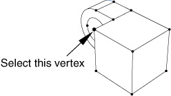

4. 单击**完成**以指示您已完成选择集合的几何体。

   Abaqus/CAE 创建一个名为 `Monitor` 的节点集，其中包含您选择的节点。

5. 从步骤模块的主菜单栏中，选择**输出** -> **自由度监控**。

   **自由度监控**对话框出现。

6. 打开**在整个分析过程中监控一个自由度**。

7. 单击选择按钮，然后在提示区域单击**点**，并从**区域选择**对话框中选择集合 **Monitor**。

8. 在**自由度**文本框中输入 `1`，然后单击**确定**。

---

## C.8 创建用于接触相互作用的表面

现在您将定义模型区域之间的接触。有两种方法可以采用来定义接触相互作用。第一种是手动方法，需要您识别哪些表面将参与接触相互作用，并定义各个接触对。另一种方法是让 Abaqus/CAE 自动识别和定义所有潜在接触对。后一种方法适用于包含许多接触相互作用的复杂模型。自动接触定义选项仅适用于三维 Abaqus/Standard 模型。

在"定义模型区域之间的接触，"第 C.9 节中，您将可以选择手动（您将使用以下说明中定义的表面）或自动（Abaqus/CAE 将自动选择表面）定义接触相互作用。但是，为了教学目的，无论您选择哪种方法定义接触相互作用，都鼓励您完成下面的表面定义说明。

手动定义接触相互作用时，第一步是创建您稍后将在相互作用中包含的表面。并不总是需要预先创建表面；如果模型很简单或表面易于选择，您可以在创建相互作用时直接在视口中指示主表面和从表面。但是，在本教程中，分别定义表面然后在创建相互作用时引用这些表面的名称会更容易。您将定义以下表面：

- 一个名为 `Pin` 的表面，包含销钉的外表面。
- 两个名为 `Flange-h` 和 `Flange-s` 的表面，包含彼此接触的两个法兰面。
- 两个名为 `Inside-h` 和 `Inside-s` 的表面，包含接触销钉的法兰内侧表面。

### C.8.1 定义销钉上的表面

在本节中，您将定义销钉的外表面。在选择要定义的表面时，您会发现一次只显示一个零件实例会很有帮助。

**隐藏装配体中的零件实例的步骤：**

1. 在模型树中，展开**装配体**下的**实例**容器。

2. 选择铰链零件，然后单击鼠标按钮 3。

3. 从出现的菜单中选择**隐藏**。

   铰链零件从视图中消失。

**定义销钉上的表面的步骤：**

1. 在模型树中，展开**装配体**容器，然后双击**表面**项。

   **创建表面**对话框出现。

2. 在对话框中，将表面命名为 `Pin`，然后单击**继续**。

3. 在视口中，选择销钉。

4. 在视口中单击鼠标按钮 2 以指示您已完成选择表面的区域。

   代表销钉的空心圆柱体的每一侧都有不同的颜色关联。在图 C-37 中，销钉的外侧为棕色，内侧为紫色。根据您创建销钉原始草图的方式，颜色可能在您的模型上相反。

   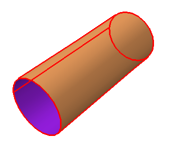

5. 您必须选择表面是由圆柱体的内侧还是外侧组成。外表面接触两个铰链，这是所需的选择。从提示区域的按钮中，单击与外表面关联的颜色（**棕色**或**紫色**）。

   Abaqus/CAE 创建名为 `Pin` 的所需表面，并将其显示在模型树的**表面**容器下。

### C.8.2 定义铰链零件上的表面

在本节中，您将定义在两个铰链零件之间以及铰链零件和销钉之间定义接触所需的铰链零件表面。

**定义铰链零件上的表面的步骤：**

1. 恢复零件实例 `Hinge-hole-1` 的可见性，并抑制 `Pin-1` 的可见性（在**实例**容器中，单击实例名称上的鼠标按钮 3，然后根据需要选择**显示**或**隐藏**）。

   Abaqus/CAE 仅在视口中显示带润滑孔的铰链零件。

2. 在模型树中，双击**装配体**容器下的**表面**。

   **创建表面**对话框出现。

3. 在对话框中，将表面命名为 `Flange-h`，然后单击**继续**。

4. 在带润滑孔的实例上，选择与另一法兰接触的法兰面，如图 C-38 中的网格面所示。（您可能需要旋转视图才能清楚地看到此面。）

   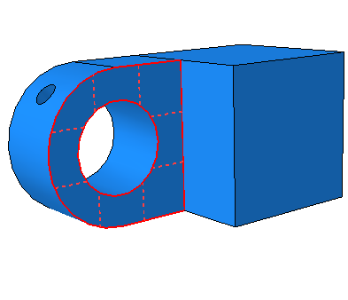

5. 当您选择了所需的面后，单击鼠标按钮 2 确认您的选择。

   Abaqus/CAE 创建名为 `Flange-h` 的所需表面，并将其显示在模型树的**表面**容器下。

6. 创建一个名为 `Inside-h` 的表面，包含带润滑孔铰链零件的圆柱形内表面，如图 C-39。（您可能需要放大视图以选择此面。）

   

7. 更改可见性设置，使只有 `Hinge-solid-1` 可见。

8. 使用类似的技术创建一个名为 `Flange-s` 的表面，包含实心铰链零件法兰的对应面。

9. 最后，创建一个名为 `Inside-s` 的表面，包含实心铰链零件的圆柱形内表面。

10. 返回默认可见性设置（在**实例**容器中选择三个零件实例名称，然后单击鼠标按钮 3；从出现的菜单中，选择**显示**）。

---

## C.9 定义模型区域之间的接触

相互作用是您创建的对象，用于对接触或紧密间隔的表面之间的力学关系进行建模。装配体上两个表面的简单物理接近不足以指示表面之间的任何类型的相互作用。

您将定义以下相互作用：

- 一个名为 `HingePin-hole` 的相互作用，定义零件实例 `Hinge-hole-1` 和销钉之间的接触。
- 一个名为 `HingePin-solid` 的相互作用，定义零件实例 `Hinge-solid-1` 和销钉之间的接触。
- 一个名为 `Flanges` 的相互作用，定义两个法兰之间的接触。

每个相互作用都需要引用相互作用属性。相互作用属性是帮助您定义某些类型相互作用的信息集合。您将创建一个描述所有表面之间切向和法向行为为无摩擦的机械相互作用属性。您将此属性命名为 `NoFric`，并将其用于所有三个相互作用中。

### C.9.1 创建相互作用属性

在本过程中，您将创建一个机械接触相互作用属性。

**创建相互作用属性的步骤：**

1. 在模型树中，双击**相互作用属性**容器以创建接触属性。

   **创建相互作用属性**对话框出现。

2. 在**创建相互作用属性**对话框中：
   - 将属性命名为 `NoFric`。
   - 在**类型**列表中，接受 **Contact** 作为默认选择。
   - 单击**继续**。

   **编辑接触属性**对话框出现。

3. 从对话框的菜单栏中，选择**机械** -> **切向行为**，并接受**无摩擦**作为摩擦公式。

4. 单击**确定**保存您的设置并关闭**编辑接触属性**对话框。

### C.9.2 创建相互作用

在本节中，您将创建三个机械表面对表面接触相互作用。每个相互作用将引用您刚创建的相互作用属性。您可以选择自动或手动定义相互作用。请遵循一种方法的说明或另一种方法的说明。如果您选择尝试两者，请确保删除或抑制由此产生的重复接触相互作用。

**自动创建相互作用的步骤：**

1. 从主菜单栏，选择**相互作用** -> **查找接触对**。

2. 在**查找接触对**对话框中，单击**查找接触对**。

   识别出五个潜在接触对。

3. 在对话框的**接触对**区域中：
   - 单击每个接触对的名称以在视口中高亮显示它。这将使您熟悉所选的接触相互作用。
   - 接触对是在每个铰链法兰的圆头和其相对扁平面之间定义的。这些接触对不是必需的。因此，删除它们（要删除接触对，请选择它，然后单击鼠标按钮 3；从出现的菜单中，选择**删除**）。
   - 识别带孔铰链和销钉之间的接触对。将相互作用重命名为 `HingePin-hole`。
   - 识别实心铰链和销钉之间的接触对。将相互作用重命名为 `HingePin-solid`。
   - 将剩余的相互作用重命名为 `Flanges`。如有必要，切换主表面和从表面指定，使与带孔铰链关联的表面为主表面，与实心铰链零件关联的表面为从表面（单击表面名称上的鼠标按钮 3；从出现的菜单中，选择**切换表面**）。

   **提示：** 您可以查看主实例名称和从实例名称来帮助指定表面。单击表格任意位置上的鼠标按钮 3，然后选择**编辑可见列**。从出现的对话框中，打开**主实例名称**和**从实例名称**。

   - 接受所有默认设置，除了接触离散化。选择标有**离散化**的列标题，然后单击鼠标按钮 3。从出现的菜单中，选择**编辑单元格**。在出现的对话框中，选择**结点-表面**，然后单击**确定**。
   - 单击**确定**保存相互作用并关闭对话框。

**手动创建相互作用的步骤：**

1. 在模型树中，单击鼠标按钮 3 单击**相互作用**容器，然后从出现的菜单中选择**管理器**。

   **相互作用管理器**出现。

2. 从**相互作用管理器**的左下角，单击**创建**。

   **创建相互作用**对话框出现。

3. 在对话框中：
   - 将相互作用命名为 `HingePin-hole`。
   - 从步骤列表中选择 `Initial`。
   - 在**所选步骤的类型**列表中，接受默认选择**表面对表面接触（Standard）**。
   - 单击**继续**。

   **区域选择**对话框出现，其中包含您之前定义的表面列表。

   **注意：** 如果**区域选择**对话框没有自动出现，请单击提示区域最右侧的**表面**按钮。

4. 在**区域选择**对话框中，选择 `Pin` 作为主表面，然后单击**继续**。

5. 从提示区域的按钮中，选择**表面**作为从类型。

6. 在**区域选择**对话框中，选择 `Inside-h` 作为从表面，然后单击**继续**。

   **编辑相互作用**对话框出现。

7. 在对话框中：
   - 接受默认**滑动公式**选择为**有限滑动**。
   - 将离散化方法更改为**结点到表面**。
   - 接受默认**从调整**选择为**无调整**。
   - 接受 `NoFric` 作为接触相互作用属性。（如果定义了其他属性，您可以单击**接触相互作用属性**字段旁边的箭头查看可用属性列表，并选择您选择的属性。）
   - 单击**确定**保存相互作用并关闭对话框。

   您创建的相互作用出现在**相互作用管理器**中。

8. 使用与前面步骤中解释的相同技术创建类似的相互作用 `HingePin-solid`。使用 `Pin` 作为主表面，`Inside-s` 作为从表面，`NoFric` 作为相互作用属性。

9. 创建类似的相互作用 `Flanges`。使用 `Flange-h` 作为主表面，`Flange-s` 作为从表面，`NoFric` 作为相互作用属性。

10. 从**相互作用管理器**，单击**关闭**关闭管理器。

---

## C.10 向装配体施加边界条件和载荷

您将向铰链模型施加以下边界条件和载荷：

- 一个名为 `Fixed` 的边界条件，约束带润滑孔铰链零件端部的所有自由度，如图 C-40 所示。

  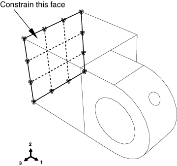

- 一个名为 `NoSlip` 的边界条件，在第一个分析步骤中建立接触期间约束销钉的所有自由度。您将在第二个分析步骤（施加载荷的步骤）中修改此边界条件，使自由度 1 和 5 不受约束。图 C-41 说明了施加在参考点处的此边界条件。

  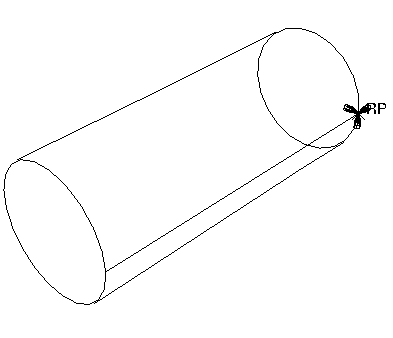

- 一个名为 `Constrain` 的边界条件，在第一个分析步骤中约束实心铰链零件上一点的所有自由度。您将在第二个分析步骤中修改此边界条件，使在施加载荷时自由度 1 不受约束。

- 一个名为 `Pressure` 的载荷，您在第二个分析步骤中向实心铰链零件的端部施加载荷。图 C-42 说明了施加到实心铰链的约束和压力载荷。

  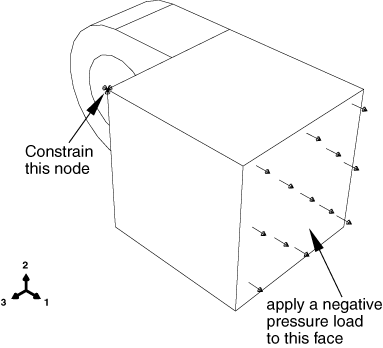

### C.10.1 约束带润滑孔的铰链零件

您将向带润滑孔铰链零件端部的面施加边界条件，以在分析期间固定铰链零件。

**约束带润滑孔的铰链零件的步骤：**

1. 在模型树中，单击鼠标按钮 3 单击**边界条件**容器，然后从出现的菜单中选择**管理器**。

   **边界条件管理器**对话框出现。

2. 在**边界条件管理器**中，单击**创建**。

   **创建边界条件**对话框出现。

3. 在**创建边界条件**对话框中：
   - 将边界条件命名为 `Fixed`。
   - 从步骤列表中选择 `Initial`。
   - 接受**机械**作为默认**类别**选择。
   - 选择**位移/旋转**作为所选步骤的边界条件类型。
   - 单击**继续**。

   **区域选择**对话框出现。

4. 从提示区域的右侧，单击**在视口中选择**以直接从视口选择对象。

   **区域选择**对话框关闭。

5. 选择如图 C-43 所示的将要施加边界条件的面。您可能需要旋转视图才能选择此面。

   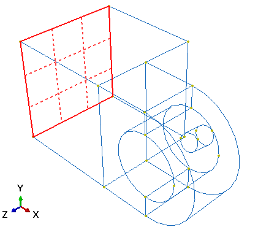

6. 单击鼠标按钮 2 以指示您已完成选择区域。

   **编辑边界条件**对话框出现。

7. 在对话框中：
   - 打开标有 **U1**、**U2** 和 **U3** 的按钮，以约束铰链在 1、2 和 3 方向上的端部。您不需要约束铰链的旋转自由度，因为将使用实心单元（仅有平移自由度）对铰链进行网格划分。
   - 单击**确定**关闭对话框。

   您刚创建的边界条件出现在**边界条件管理器**中，并且在该面节点上出现箭头，指示受约束的自由度。**边界条件管理器**显示边界条件在分析的所有步骤中保持活动状态。

   **提示：** 要抑制边界条件箭头的显示，请单击**装配显示选项**对话框中的**属性**标签，以访问边界条件显示选项。

### C.10.2 约束销钉

在分析的第一个通用步骤中，您将在两个铰链零件之间以及铰链零件和销钉之间建立接触。要在此步骤中固定销钉，您必须施加约束销钉所有自由度的边界条件。

**向销钉施加边界条件的步骤：**

1. 在**边界条件管理器**中，单击**创建**。

   **创建边界条件**对话框出现。

2. 在**创建边界条件**对话框中：
   - 将边界条件命名为 `NoSlip`。
   - 在**步骤**文本框中接受 `Initial`。
   - 接受**机械**作为默认**类别**选择。
   - 选择**位移/旋转**作为所选步骤的边界条件类型。
   - 单击**继续**。

3. 在视口中，选择销钉上的刚体参考点作为将施加边界条件的区域。

4. 单击鼠标按钮 2 以指示您已完成选择区域。

   **编辑边界条件**对话框出现。

5. 在对话框中：
   - 打开所有按钮以约束销钉的所有自由度。
   - 单击**确定**。

   新边界条件出现在**边界条件管理器**中。

### C.10.3 修改施加到销钉的边界条件

您可以创建和修改某些步骤中的对象（如边界条件、载荷和相互作用）的特殊管理器允许您修改对象并更改它们在不同分析步骤中的状态。

在本节中，您将使用边界条件管理器修改 `NoSlip` 边界条件，使在加载步骤期间 1 方向的平移和 2 轴周围的旋转不受约束。

当前**边界条件管理器**显示您创建的两个边界条件的名称以及它们在每个步骤中的状态：两个边界条件在初始步骤中为**已创建**，并在后续分析步骤中**已传播**。

**修改边界条件的步骤：**

1. 在**边界条件管理器**中，单击标有 `NoSlip` 的行和标有 `Load` 的列交叉处的单元格。那个单元格被高亮显示。

   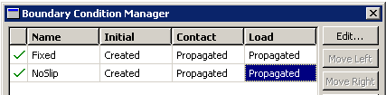

2. 在管理器右侧，单击**编辑**以指示您要在 `Load` 步骤中编辑 `NoSlip` 边界条件。

   **编辑边界条件**对话框出现，Abaqus/CAE 在模型上显示一组箭头，指示边界条件施加的位置以及哪些自由度受到约束。

3. 在编辑器中，关闭标有 **U1** 和 **UR2** 的按钮，使销钉可以沿 1 方向平移并绕 2 轴旋转。单击**确定**关闭对话框。

   在**边界条件管理器**中，`Load` 步骤中 `NoSlip` 边界条件的状态变为**已修改**。

### C.10.4 约束实心铰链零件

在第一个分析步骤（建立接触的步骤）中，您将约束实心铰链零件的单个节点在所有方向上。这些约束，连同与销钉的接触，足以防止实心零件的刚体运动。在第二个分析步骤（向模型施加载荷的步骤）中，您将移除 1 方向的约束。

**约束实心铰链零件的步骤：**

1. 在 `Initial` 步骤中创建位移边界条件，并将其命名为 `Constrain`。

2. 将边界条件施加到从实心铰链零件选择的顶点上，如图 C-45。

   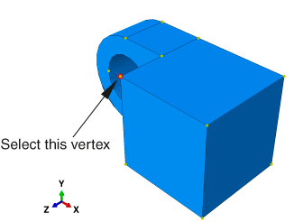

3. 在 1、2 和 3 方向上约束顶点。

4. 在 `Load` 步骤中，修改边界条件，使铰链在 1 方向上不受约束。

5. 创建边界条件完成后，单击**关闭**以关闭**边界条件管理器**。

### C.10.5 向实心铰链施加载荷

接下来，您向实心铰链端部的面施加压力载荷。您在第二个分析步骤中沿 1 方向施加载荷。

**向实心铰链施加载荷的步骤：**

1. 在模型树中，双击**载荷**容器以创建新载荷。

   **创建载荷**对话框出现。

2. 在**创建载荷**对话框中：
   - 将载荷命名为 `Pressure`。
   - 在**步骤**文本框中接受 `Load` 作为默认选择。
   - 从**类别**列表中，接受**机械**作为默认选择。
   - 从**所选步骤的类型**列表中，选择**压力**。
   - 单击**继续**。

3. 在视口中，选择实心铰链零件端部的面作为将施加载荷的表面，如图 C-46 中的网格表面所示。

   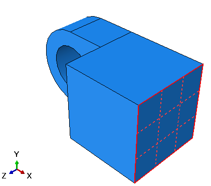

4. 单击鼠标按钮 2 以指示您已完成选择区域。

   **编辑载荷**对话框出现。

5. 在对话框中，输入载荷大小 `-1.E6`，然后单击**确定**。

   面上出现箭头，指示施加的载荷。箭头指向面外，因为您施加了负压力。

---

## C.11 对装配体进行网格划分

对装配体进行网格划分分为以下操作：

- 确保零件实例可以网格划分，并在必要时创建额外的分割。
- 向零件实例分配网格属性。
- 向零件实例布置种子。
- 对零件实例进行网格划分。

### C.11.1 确定需要分割的内容

当您进入网格模块时，Abaqus/CAE 根据将用于生成网格的方法对模型区域进行颜色编码：

- 绿色表示可以使用结构化方法进行网格划分的区域。
- 黄色表示可以使用扫描方法进行网格划分的区域。
- 橙色表示无法使用默认单元形状分配（六面体）进行网格划分、需要进一步分割的区域。（或者，您可以通过向模型分配四面体单元并使用自由网格技术对任何模型进行网格划分。）

对于本教程，Abaqus/CAE 指示带润滑孔的铰链需要被分割才能使用六面体形状单元进行网格划分。具体来说，必须分割法兰中孔周围的区域。分割后的铰链如图 C-47 所示。

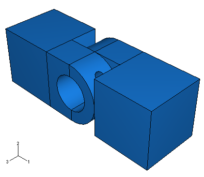

使用以下技术来帮助您在分割过程中选择面和顶点：

- 根据需要结合使用视图操作工具、**视图选项**工具栏中的显示选项工具和**视图**工具栏中的工具来调整模型大小和重新定位模型。（要显示**视图**工具栏，请从主菜单栏中选择**视图** -> **工具栏** -> **视图**。）
- 关闭**选择**工具栏中的最近对象工具，以使用提示区域中的**下一个**和**上一个**按钮循环遍历可能的选项。
- 您可能会发现 3D 指南针和/或放大工具和旋转工具特别有用。
- 必要时，在**视图**工具箱中单击**等轴测**工具，以将模型返回到其在视口中的原始大小和位置。
- 请记住，零件实例默认被分类为依赖的。零件的所有依赖实例必须具有相同的几何形状（包括分割）和网格。为满足此要求，必须在原始零件中创建所有分割，并且必须向原始零件分配所有网格属性。您需要单独检查零件以确定需要采取什么操作（如有）来使用六面体单元创建网格。

  **注意：** 依赖零件实例的优点是，如果创建同一零件的多个实例，您只需操作和网格划分原始零件；这些特征会自动被依赖实例继承。由于在本教程中您只创建了每个零件的一个实例，因此您同样可以轻松地创建独立零件实例。这将允许您在装配体级别而不是零件级别创建分割和分配网格属性。您可以通过在模型树中**实例**容器下单击其实例名称上的鼠标按钮 3 并选择**设为独立**，使依赖零件实例成为独立实例。在下文中，我们假设零件实例保持依赖。

**确定需要分割的内容的步骤：**

1. 在模型树中，展开**零件**容器下的 **Hinge-hole**，然后双击出现的列表中的**网格**。

   **注意：** 如果零件实例是独立的，您将改为在**实例**容器下展开实例名称，然后单击出现的列表中的**网格**。

   Abaqus/CAE 显示带润滑孔的铰链零件。铰链零件的立方体部分被着色为绿色，表示它可以使用结构化网格技术进行网格划分；带润滑孔的法兰被着色为橙色，表示需要对其进行分割才能使用六面体单元进行网格划分，如图 C-48。分割过程在"分割带润滑孔的法兰，"第 C.11.2 节中描述。

   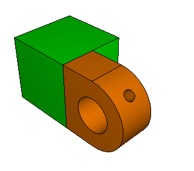

2. 使用上下文栏中出现的**对象**字段在视口中显示实心铰链。Abaqus/CAE 显示实心铰链。像之前一样，实心铰链零件的立方体部分被着色为绿色，表示它可以使用结构化网格技术进行网格划分。没有润滑孔的法兰被着色为黄色，表示它可以使用扫描网格进行网格划分。

3. 从上下文栏中的**对象**字段中选择销钉。Abaqus/CAE 以橙色显示销钉，因为它是一个解析刚体表面，无法进行网格划分。

   因此，带润滑孔的铰链零件需要被分割才能使用六面体单元进行网格划分；实心铰链和销钉不需要进一步操作。

### C.11.2 分割带润滑孔的法兰

为了让 Abaqus/CAE 对带润滑孔的法兰进行网格划分，必须将其分割成如图 C-49 所示的区域。

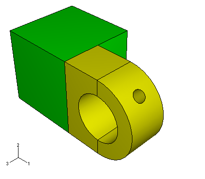

**分割带润滑孔的法兰的步骤：**

1. 在视口中使带润滑孔的铰链零件成为当前零件。

2. 从主菜单中，选择**工具** -> **分割**。

   **创建分割**对话框出现。

3. 您想要分割构成法兰的整个单元。从**创建分割**对话框中，选择**单元**作为分割**类型**，然后单击**定义切割平面**作为分割**方法**。

4. 选择带润滑孔的铰链的法兰。单击**完成**以指示您已完成选择单元。

   Abaqus/CAE 提供三种指定切割平面的方法：
   - 选择一个点和一条法线。切割平面通过所选点，垂直于所选边缘。
   - 选择三个不共线的点。切割平面通过每个点。
   - 选择一条边缘和沿边缘的一个点。切割平面通过所选点，垂直于所选边缘。

   切割平面不需要在被分割的单元中定义。平面无限延伸，并在任何有交点的地方分割所选单元。

5. 从提示区域的按钮中，选择**3 点**。

   Abaqus/CAE 高亮显示您可以选择的点。

6. 选择三个点来将法兰切成两半，形成垂直分割，如图 C-50。

   **提示：** 如果您放大、旋转和平移模型以获得更方便的视图，可能会更容易选择所需的点。

   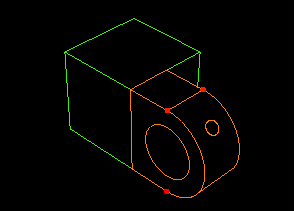

7. 从提示区域，单击**创建分割**。

   Abaqus/CAE 创建所需的分割。

   法兰区域被着色为黄色，表示不需要额外的分割来创建六面体网格。因此，分割操作完成。

8. 在上下文栏的**对象**字段中选择**装配体**以在视口中显示模型装配体。具有所有分割的模型装配体如图 C-51。

   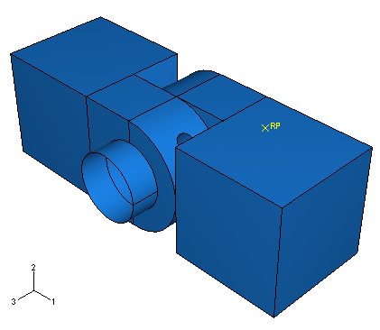

   **提示：** 如果您之前没有将位置约束转换为绝对位置，此分割可能会使之前创建的可轴向约束无效。如有必要，返回装配模块，使用之前描述的技术在铰链零件之间以及铰链和销钉之间定义新的同轴约束。分割也可能会使用于接触相互作用的表面无效。检查这些并在必要时进行更正。

### C.11.3 分配网格控制

在本节中，您将使用**网格控制**对话框来检查 Abaqus/CAE 将用于对零件进行网格划分的方法以及 Abaqus/CAE 将生成的单元形状。

您无法对解析刚体表面进行网格划分。因此，您无法向解析刚体表面施加网格控制；同样，您也无法对其进行布置种子或分配单元类型。因此，您只需要关注铰链零件。由于实例依赖于原始零件定义，您必须单独向每个铰链零件分配网格属性（控制、类型和种子大小）。为方便起见，您将从带润滑孔的铰链零件开始。

**分配网格控制的步骤：**

1. 在视口中使带孔的铰链零件成为当前零件。从主菜单栏中，选择**网格** -> **控制**。

2. 拖动一个方形框住零件以选择零件的所有区域，然后单击**完成**以指示您的选择已完成。

   铰链零件在视口中显示为红色，表示您已选择它，Abaqus/CAE 显示**网格控制**对话框。

3. 在对话框中，接受 **Hex** 作为默认**单元形状**选择。

4. 选择 **Sweep** 作为 Abaqus/CAE 将应用的网格划分技术。

5. 选择 **Medial axis** 作为网格划分算法。

6. 单击**确定**分配网格控制并关闭对话框。

   整个铰链将显示为黄色，表示它将使用扫描网格技术进行网格划分。

7. 对实心铰链零件重复上述步骤。

### C.11.4 分配 Abaqus 单元类型

在本节中，您将使用**单元类型**对话框来检查分配给每个零件的单元类型。为方便起见，您将从带润滑孔的铰链零件开始。

**分配 Abaqus 单元类型的步骤：**

1. 在视口中使带孔的铰链零件成为当前零件。从主菜单栏中，选择**网格** -> **单元类型**。

2. 使用与网格控制过程描述相同的技术选择铰链零件，然后单击**完成**以指示您的选择已完成。

   Abaqus/CAE 显示**单元类型**对话框。

3. 在对话框中，接受 **Standard** 作为**单元库**选择。

4. 接受 **Linear** 作为**几何阶次**选择。

5. 接受 **3D Stress** 作为默认单元**族**。

6. 单击 **Hex** 标签，然后选择**减缩积分**作为公式（如果尚未选择）。

   底部出现默认单元类型 C3D8R 的描述。Abaqus/CAE 现在将 C3D8R 单元与网格中的单元相关联。

7. 单击**确定**分配单元类型并关闭对话框。

8. 在提示区域单击**完成**。

9. 对实心铰链零件重复上述步骤。

### C.11.5 向零件实例布置种子

网格划分过程的下一步是向每个零件实例布置种子。种子表示节点的近似位置，并指示您希望生成的网格的目标密度。您可以基于沿边缘生成的单元数量或基于平均单元大小来选择种子，或者您可以使种子分布偏向边缘的一端。对于本教程，您将向零件布置种子，使铰链零件的平均单元大小为 0.004。为方便起见，您将从带润滑孔的铰链零件开始。

**向零件布置种子的步骤：**

1. 在视口中使带孔的铰链零件成为当前零件。从主菜单栏中，选择**种子** -> **零件**。

2. 在出现的**全局种子**对话框中，输入近似全局单元大小 `0.004`，然后单击**确定**。

   种子出现在所有边缘上。

   **注意：** 如果您使用的是 Abaqus 学生版，使用 0.004 的全局种子大小会产生超出产品模型大小限制的网格。请改用 0.008 的全局种子大小。

3. 对实心铰链零件重复上述步骤。

现在您已准备好对零件进行网格划分。

### C.11.6 对装配体进行网格划分

在本节中，您将对零件进行网格划分。为方便起见，您将从带润滑孔的铰链零件开始。

**对装配体进行网格划分的步骤：**

1. 在视口中使带孔的铰链零件成为当前零件。从主菜单栏中，选择**网格** -> **零件**。

2. 在提示区域单击**是**以创建网格。

   Abaqus/CAE 对零件进行网格划分。

3. 对实心铰链零件重复上述步骤。

网格划分操作现已完成。在视口中显示模型装配体以查看最终网格，如图 C-52 所示。


---

## C.12 创建和提交作业

现在您已配置了分析，您将创建与模型关联的作业并提交作业进行分析。

**创建和提交分析作业的步骤：**

1. 在模型树中，双击**作业**容器以创建作业。

   **创建作业**对话框出现。

2. 将作业命名为 `PullHinge`，然后单击**继续**。

   作业编辑器出现。

3. 在**描述**字段中，输入 `Hinge tutorial`。

   单击标签以查看作业编辑器的内容，并检查默认设置。单击**确定**接受所有默认作业设置。

4. 在模型树中，单击鼠标按钮 3 单击名为 **PullHinge** 的作业，然后从出现的菜单中选择**提交**以提交您的作业进行分析。

5. 在模型树中，单击鼠标按钮 3 单击作业名称，然后从出现的菜单中选择**监控**以监控分析运行。

   可能会出现一条警告，指示与带孔铰链零件关联的表面不再可用。这是由于之前创建的分割。如果出现这种情况，请在提交作业之前执行以下操作之一：

   - 如果接触对是手动定义的，重新定义与法兰面和法兰孔关联的表面。
   - 如果接触对是自动定义的，只需删除接触对并重新定义相互作用。

   出现一个对话框，其标题栏中显示您的作业名称，以及分析的状态图。消息会出现在对话框的下部面板中，随着作业的进展而显示。单击**错误**和**警告**标签以检查分析中的问题。

   分析开始后，您之前在本教程中选择监控的自由度的 X-Y 图会出现在视口中的单独窗口中。（您可能需要调整视口窗口的大小才能看到它。）您可以在分析运行时跟随节点在 1 方向上位移的进展。

6. 当作业成功完成时，模型树中出现的作业状态变为 `已完成`。您现在已准备好使用可视化模块查看分析结果。在模型树中，单击鼠标按钮 3 单击作业名称，然后从出现的菜单中选择**结果**。

   Abaqus/CAE 进入可视化模块，打开由作业创建的输出数据库，并显示模型的未变形形状。

   **注意：** 您也可以通过单击上下文栏中**模块**列表中的**可视化**进入可视化模块。但是，在这种情况下，Abaqus/CAE 会要求您使用**文件**菜单显式打开输出数据库。

---

## C.13 查看分析结果

您将通过绘制变形模型的等值线图来查看分析结果。然后，您将使用显示组来显示其中一个铰链零件；通过仅显示模型的某一部分，您可以查看显示整个模型时看不到的结果。

### C.13.1 显示和自定义等值线图

在本节中，您将显示模型的等值线图并调整变形比例因子。

**显示模型等值线图的步骤：**

1. 从主菜单栏中，选择**绘图** -> **等值线** -> **在变形形状上**。

   Abaqus/CAE 显示在变形形状上叠加的 von Mises 应力等值线图，在加载步骤的最后增量的结束时，如状态块中的以下文本所示：

   ```
   Step: Load, Apply load
   Increment     6: Step Time =   1.000
   ```

   默认情况下，所有没有结果的面（在本例中为销钉）以白色显示。

   变形被夸大，因为 Abaqus/CAE 选择的默认变形比例因子。

2. 要从显示中移除白色表面，请执行以下操作：
   - 在结果树中，展开名为 `PullHinge.odb` 的输出数据库文件下的**表面集合**容器。
   - 选择列表中出现的所有表面。
   - 单击鼠标按钮 3，然后从出现的菜单中选择**移除**。

   白色表面从视图中消失。

3. 要减小变形比例因子，请执行以下操作：
   - 从主菜单栏中，选择**选项** -> **常规**。

     **常规绘图选项**对话框出现。
   - 从**变形比例因子**选项中，选择**统一**。
   - 在**值**文本框中输入值 `100`；然后单击**确定**。

   Abaqus/CAE 显示变形比例因子为 100 的等值线图，如图 C-53。

   

4. 使用视图操作工具检查变形模型。注意销钉似乎对法兰内部施加最大压力的位置。还要注意两个法兰如何彼此扭转。

5. 默认情况下，等值线图显示模型中的 von Mises 应力；您可以通过从**场输出**工具栏中选择它们来查看其他变量。从**场输出**工具栏右侧的组件和不变量列表中选择 **S11**。

   Abaqus/CAE 将默认的 von Mises 图替换为 1 方向应力的等值线图。

6. 从组件和不变量列表中选择**最大主量**以查看模型上的最大主应力。

7. 从**场输出**工具栏中选择任何其他感兴趣的变量。

8. 单击工具栏中的场输出按钮工具以显示**场输出**对话框。在**主变量**标签上，选择 **S** 作为输出变量，选择 **Mises** 作为不变量，然后单击**确定**再次显示 von Mises 应力并关闭对话框。

   **场输出**对话框提供了一些控件和对其他对话框（如**截面点**对话框）的访问，这些对话框无法从**场输出**工具栏访问。

### C.13.2 使用显示组

现在您将创建一个显示组，其中仅包含构成带润滑孔的铰链零件的单元集合。通过从显示中移除所有其他单元集合，您将能够查看与另一个铰链接触的法兰表面的结果。

**创建显示组的步骤：**

1. 在结果树中，展开名为 `PullHinge.odb` 的输出数据库下的**实例**容器。

2. 从可用零件实例列表中，选择 **HINGE-HOLE-1**。单击鼠标按钮 3，然后从出现的菜单中选择**替换**以将当前显示组替换为所选单元。如有必要，单击自动拟合工具以使模型适合视口。

   整个模型的等值线图被仅显示所选铰链零件的图替换，如图 C-54。

   

3. 使用视图操作工具从不同角度查看铰链。您现在可以看到实心铰链遮挡的铰链表面的结果。

4. 从主菜单栏中，选择**结果** -> **场输出**。

5. 从**主变量**标签页的顶部，打开**仅列出有结果的变量：**并从菜单中选择**在表面节点处**。

6. 从出现的变量列表中，选择 **CPRESS**，然后单击**应用**。

   Abaqus/CAE 显示法兰孔中接触压力的等值线图。

有关使用可视化模块的更多信息，请参阅以下章节：

- "查看分析结果，"第 B.11 节
- 附录 D，"查看分析输出"

您已完成本教程，并学习了如何：

- 创建和修改特征；
- 使用基准几何体向模型添加特征；
- 使用位置约束来装配由多个零件组成的模型；
- 定义模型区域之间的接触相互作用；
- 监控分析作业的进展；以及
- 使用显示组查看模型各个部分的结果。

---

## C.14 总结

- 创建零件时，您可以创建可变形零件、离散刚体表面或解析刚体表面。您随后可以更改零件的类型。
- 您可以通过向基础特征添加特征来创建零件。添加特征时，您必须选择一个面来绘制特征的轮廓草图。当您从零件中删除特征时，Abaqus/CAE 也会删除依赖于被删除特征的任何特征。这些依赖特征称为子特征。
- 您可以通过修改特征的草图或与特征关联的参数（如拉伸深度）来编辑特征。编辑特征可能导致依赖特征在重新生成过程中失败。
- **基准**工具集允许您创建基准点、基准轴和基准平面。在零件上创建的基准几何体也可以被草图器使用。例如，如果不存在合适的草图平面，您可以使用**基准**工具集创建一个。
- 单击对话框中的**确定**以执行所选操作并关闭对话框；单击**应用**以在执行所选操作的同时保持对话框打开。单击**取消**以关闭对话框而不执行操作。
- 您可以使用**视图操作**工具栏中的工具将模型视图更改为您更方便的视图。使用鼠标按钮 2 停止任何视图操作。如果您旋转或平移草图，请使用循环视图操作工具恢复原始视图。
- 您应该定期保存模型数据库。
- 创建零件实例时，默认位置基于基础特征的草图。您可以要求 Abaqus/CAE 沿 X 轴偏移新实例，使其不与任何现有实例重叠。一个图形指示装配模块中全局坐标系的原点和方向。
- 您在装配模块中使用一系列约束操作来相对于彼此定位零件实例。
- 零件实例可分为依赖或独立。
- 您使用步骤编辑器来控制步骤期间的增量。
- 您可以使用管理器来显示您定义的实体列表——例如步骤——并帮助您执行重复操作。
- 默认情况下，Abaqus/CAE 将从一个步骤传播到所有后续步骤中定义的相互作用或规定条件。
- Abaqus/CAE 对模型进行颜色编码以指示区域将如何网格划分。绿色表示可以使用结构化方法进行网格划分的区域，黄色表示可以使用扫描方法进行网格划分的区域，橙色表示无法进行网格划分的区域。
- 您使用**分割**工具集将模型划分为 Abaqus/CAE 可以进行网格划分的区域。
- 当您创建和命名作业时，Abaqus/CAE 使用它为生成的输入文件命名。因此，与分析关联的所有文件（例如输出数据库、消息文件和状态文件）使用相同的名称。
- 您可以查看在提交作业之前选择监控的分析过程中自由度的进展。
- 首次打开输出数据库时，Abaqus/CAE 显示模型的未变形图。
- 您使用显示组来显示模型的所选区域。显示组可以由所选零件实例、几何体（单元、面或边缘）、单元、节点或表面的任意组合组成。

---

*本文档从 ABAQUS Getting Started with Abaqus: Interactive Edition (6.14) 自动生成*
