# 附录E: 弯管流动分析

本协同仿真教程面向有经验的Abaqus用户，演示如何使用Abaqus/CFD对弯管内的流体流动进行建模，以及如何使用Abaqus/Standard对管道的结构变形进行建模。更多信息，请参阅《Abaqus Analysis User's Guide》第6.6.2节"不可压缩流体动力学分析"和第17.3.2节"流体与结构及共轭热传递协同仿真"。

---

## E.1 概述

本仿真演示如何对U形管内的流体流动进行建模。问题涉及一根两端夹紧、中间有U形弯头的管道，如图E-1所示。

**图E-1** 弯管。

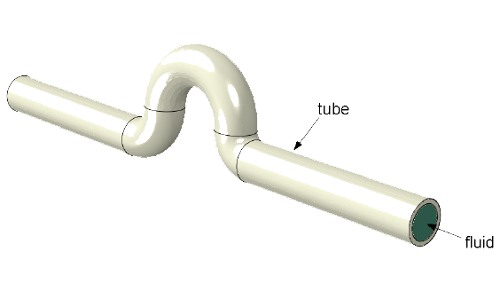

我们考虑刚性管和可变形管两种情况。在纯流动分析（对应刚性管的情况）中，您可以注意到有趣的流动特征，如流动分离和再附着。也可以测量流动对管道产生的净力。在流固耦合分析中，可以分析结构的变形模式及其对流体流动的影响。

流体流动在Abaqus/CFD中建模，而结构变形在Abaqus/Standard中建模。两者之间的相互作用使用协同仿真方法进行建模。

本教程包括以下章节：

- ["创建流体流动分析模型，" 第E.2节](#e2-创建流体流动分析模型)
- ["创建流体流动分析的CFD分析作业，" 第E.3节](#e3-创建流体流动分析的-cfd-分析作业)
- ["运行和监控CFD分析，" 第E.4节](#e4-运行和监控-cfd-分析)
- ["查看CFD分析结果，" 第E.5节](#e5-查看-cfd-分析结果)
- ["创建流固耦合分析的流体模型，" 第E.6节](#e6-创建流固耦合分析的流体模型)
- ["创建流固耦合分析的结构模型，" 第E.7节](#e7-创建流固耦合分析的结构模型)
- ["创建流固耦合分析的协同仿真作业，" 第E.8节](#e8-创建流固耦合分析的协同仿真作业)
- ["运行和监控流固耦合协同仿真分析，" 第E.9节](#e9-运行和监控流固耦合协同仿真分析)
- ["查看流固耦合协同仿真分析结果，" 第E.10节](#e10-查看流固耦合协同仿真分析结果)

---

## E.2 创建流体流动分析模型

您将首先创建流体流动分析模型。在这种情况下，假设管道是刚性的。由于流体边界不变形，这种情况只能使用计算流体动力学（CFD）分析进行建模。

### E.2.1 创建CFD模型

启动Abaqus/CAE（如果您尚未运行它）。您将首先进行管道假设为刚性的纯流动分析。之后，您将进行管道被视为可变形的流固耦合分析。

在模型树中，双击**Models**。在**Edit Model Attributes**对话框中，输入`fluid-cfd`作为名称，选择**CFD**作为类型。点击**OK**。

本教程讨论如何使用Abaqus/CAE为该仿真创建完整模型。Abaqus提供了复制该问题完整分析模型的脚本。如果您按照下列说明操作遇到困难，或希望检验您的工作，您可以运行该示例的插件脚本，该脚本可在Abaqus/CAE插件工具集中获得。要从Abaqus/CAE运行脚本，请选择**Plug-ins** → **Abaqus** → **Getting Started**；高亮显示**Flow through a bent tube**；然后点击**Run**。有关Getting Started插件的更多信息，请参阅《Abaqus/CAE User's Guide》第82.1节"运行Getting Started with Abaqus示例"。

### E.2.2 定义部件

创建模型的第一步是定义其几何形状。您将使用扫掠实体基特征创建三维部件。

**创建部件：**

1. 在模型树中，在模型`fluid-cfd`下，双击**Parts**创建新部件。在**Create Part**对话框中，将部件命名为`fluid`，选择**Swept solid**作为基特征，**0.5**作为近似尺寸。点击**Continue**。

2. 绘制部件的扫掠路径。使用图E-2所示的尺寸绘制扫掠路径。

**图E-2** 流体部件的扫掠路径。

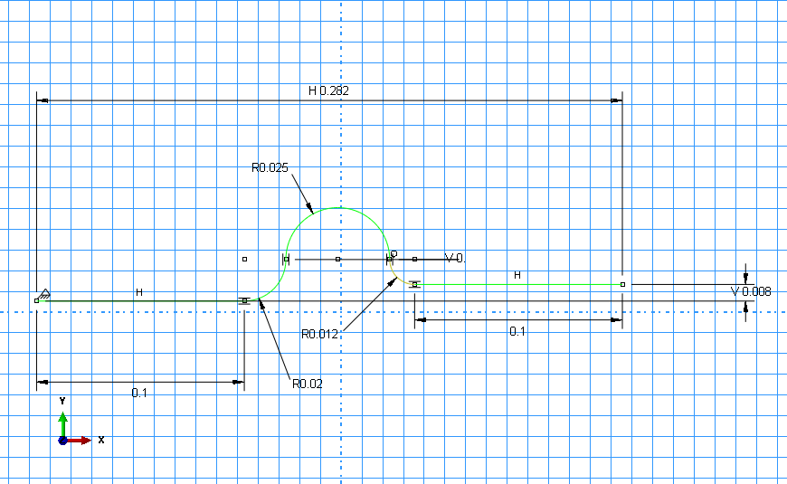

3. 在提示区域点击**Done**。

4. 创建一个截面草图，该草图将沿着绘制的路径扫掠以创建部件。输入**0.1**作为截面草图的最大比例。

5. 创建圆形截面的轮廓，如图E-3所示。将圆心放在原点，将边界点沿着*Y*轴或*Z*轴。

**图E-3** 流体部件的截面。

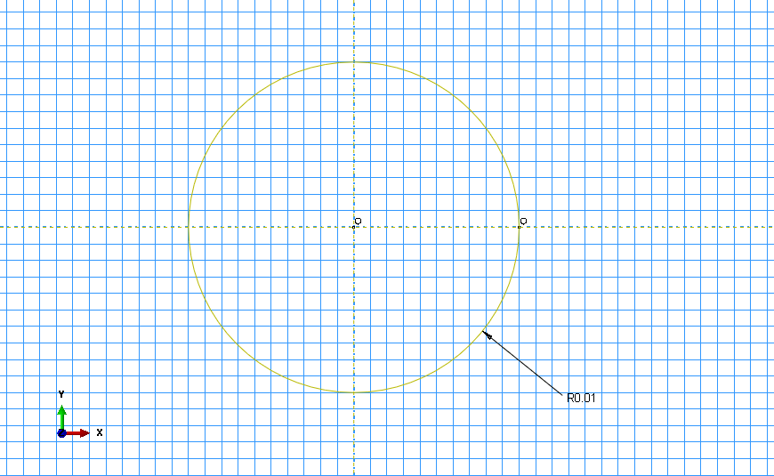

6. 在提示区域点击**Done**。

   Abaqus/CAE创建表示流体域的部件，如图E-4所示。入口和出口面在图中标出。

**图E-4** 流体部件。

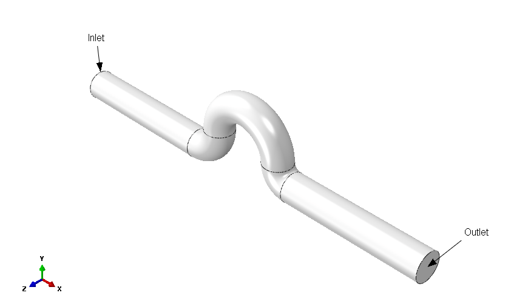

### E.2.3 分区部件

为确保部件能够使用六面体单元进行网格划分，我们将对其进行适当分区，以允许结构化和扫掠网格划分的组合。

**分区部件：**

1. 在模型树中，展开**Parts**容器下的**fluid**项，双击出现的菜单中的**Mesh**以切换到Mesh模块。

   部件最初显示为橙色，这意味着它不能使用默认的六面体单元形状进行网格划分。

2. 使用**Partition Face: Sketch**工具创建一个圆形截面草图来分区入口面。将圆心放在原点，将边界点沿着*Y*轴或*Z*轴。草图尺寸如图E-5所示。

**图E-5** 面分区草图。

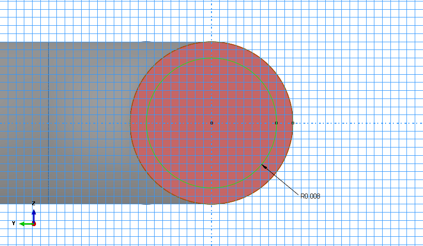

3. 创建一个切割平面，在*X-Y*平面中间切割整个部件，如图E-6所示。

**图E-6**沿*X-Y*平面分区。


   a. 点击**Partition Cell: Define Cutting Plane**工具，在提示区域选择**Normal To Edge**来指定切割平面。

   b. 当提示选择边缘时，选择入口处的外圆形边缘。

   c. 当提示选择边缘上的点时，选择垂直*Y*轴上边缘上的一个点。

   d. 在提示区域点击**Create Partition**完成第一次分区。

4. 使用入口面上的圆形分区，沿着管道的整个长度进行扫掠切割，如图E-7所示。

**图E-7** 圆柱芯的分区。

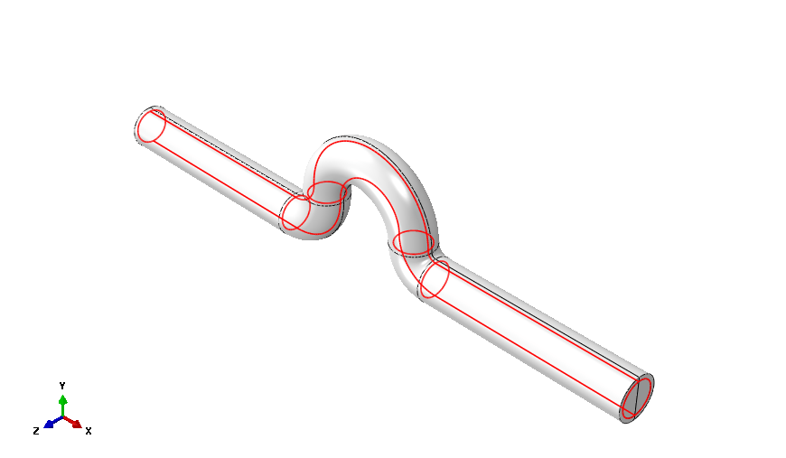

   a. 点击并按住**Partition Cell**工具以显示更多工具，选择**Partition Cell: Extrude/Sweep Edges**工具。

   b. 选择整个部件，在提示区域点击**Done**。

   c. 在提示区域，选择**by edge angle**选择技术。接受默认角度`20.0`。

   d. 选择入口面分区创建的圆形边缘，点击**Done**。

   e. 点击**Sweep Along Edge**作为扫掠方法。选择包含入口的直段顶部的边缘。该边缘是上一步分区创建的。

   f. 点击**Create Partition**。

   Abaqus/CAE在管道的直段中添加一个圆柱芯。重复此过程四次，将圆柱芯延伸到管道的整个长度。

5. 沿管道长度创建额外分区。

   a. 点击**Partition Cell: Define Cutting Plane**工具。

   b. 选择整个部件，在提示区域点击**Done**。

   c. 在提示区域点击**Point & Normal**来指定切割平面。

   d. 当提示选择一个点时，选择包含出口的直段与其相邻弯曲段之间的外圆周边缘上的点，如图E-8所示。

   e. 在提示区域点击**Create Partition**。

   f. 当提示选择一个边缘时，选择图E-8中指示的直边缘。

**图E-8** 使用直边缘定义法向的分区。

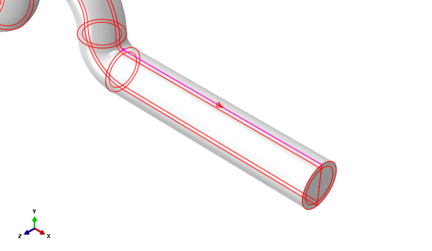

   g. 对连接入口的直段重复此过程。

   h. 对于部件中心的弯曲段，使用**3 Points**方法定义切割平面，如图E-9所示。

**图E-9** 使用3点方法的分区。

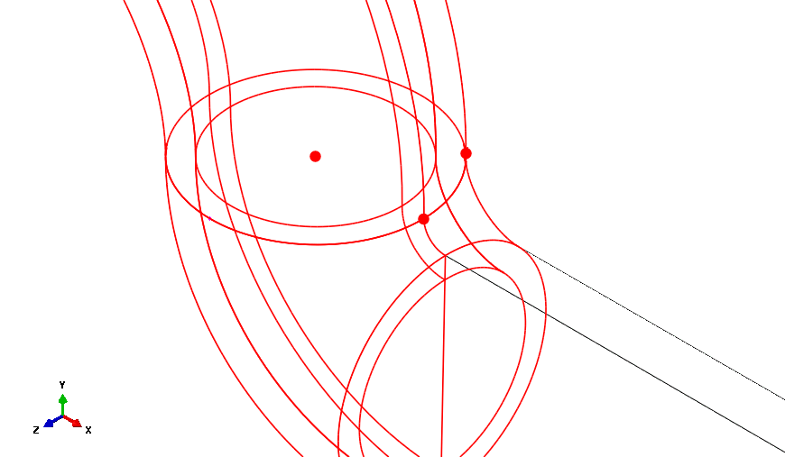

6. 使用**Normal to Edge**方法对部件中心的弯曲段进行分区。选择外圆形边缘和沿边缘中间的点来定义平面。分区如图E-10所示。

### E.2.4 创建集合和曲面

您现在将创建集合和曲面，它们将用于定义截面属性和边界条件。集合和曲面标识应用分析属性的区域。

**定义集合：**

1. 在模型树中，展开名为**fluid**的部件的容器，双击**Sets**。

2. 在**Create Set**对话框中，将集合命名为`all`，点击**Continue**。

3. 在视口中选择整个几何体，在提示区域点击**Done**。

   Abaqus/CAE创建一个包含整个部件的集合。

4. 重复此过程创建名为`fixed`的集合，该集合包含流体域入口和出口截面处的面，如图E-10所示。

**图E-10** 集合`fixed`。

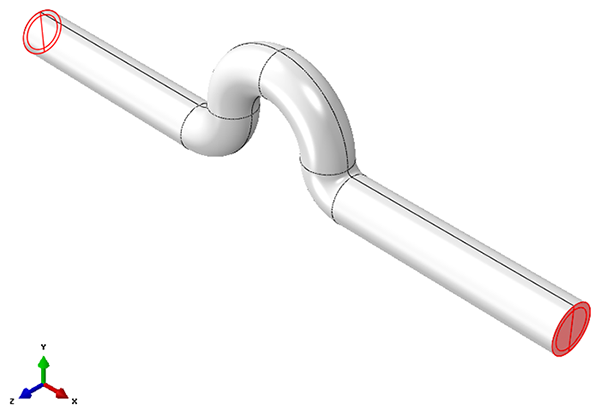

5. 创建一个名为`seed-1`的集合，其中包含穿过管道中心芯和外表面的径向直边缘，如图E-11和图E-12所示。该集合将用于分配网格种子。

   **提示：** 切换到线框视图以便于选择。

**图E-11** 集合`seed-1`。

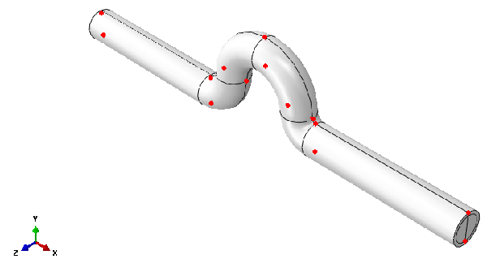

**图E-12** 集合`seed-1`的特写视图。

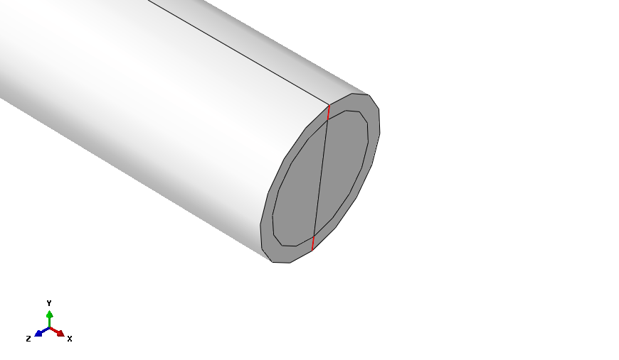

6. 创建一个名为`seed-2`的集合，其中包含沿管道轴向的直边缘，如图E-13所示。该集合也将用于分配网格种子。

**图E-13** 集合`seed-2`。

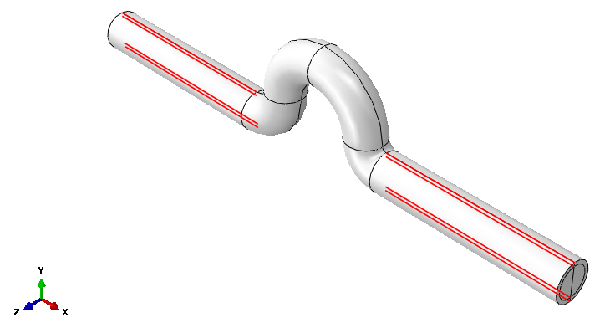

**定义曲面：**

1. 在模型树中，展开名为**fluid**的部件的容器，双击**Surfaces**。

2. 在**Create Surface**对话框中，将曲面命名为`inlet`，点击**Continue**。

3. 在提示区域，选择**by angle**作为选择技术。选择管道入口处的面（图E-14描述了曲面的位置）。

4. 在提示区域点击**Done**。

5. 重复前面的步骤，在管道出口处创建名为`outlet`的曲面。

6. 重复前面的步骤，创建名为`wall`的曲面，表示管道的外表面（不包括入口和出口）。

**图E-14** 管道的曲面定义。

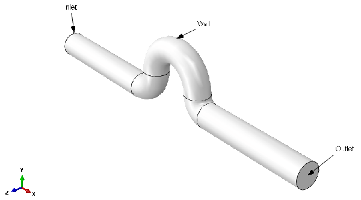

### E.2.5 材料和截面属性

创建模型的下一步是定义材料属性并将其分配给流体部件。模型的每个区域必须引用截面属性。在本模型中，我们假设流体是密度为1000 kg/m³、粘度为0.001 Pa·s的牛顿流体（即水）。

**定义材料属性：**

1. 在模型树中，双击**Materials**创建名为`fluid`的新材料。

2. 从材料编辑器中，选择**General** → **Density**，指定密度值为`1000` kg/m³。

3. 从材料编辑器中，选择**Mechanical** → **Viscosity**，指定粘度值为`0.001` Pa·s。

4. 点击**OK**。

   Abaqus/CAE创建材料定义。

**定义CFD截面：**

1. 在模型树中，双击**Sections**创建名为`fluid`的新截面。接受默认的均匀流体截面选择，点击**Continue**。

2. 在**Edit Section**对话框中，选择**fluid**作为材料，点击**OK**。

   Abaqus/CAE创建流体截面定义。

**分配CFD截面：**

1. 在模型树中，展开**Parts**容器及其下的**fluid**容器，然后双击**Section Assignments**。

2. 在提示区域，点击**Sets**。在**Region Selection**对话框中，选择**all**并点击**Continue**。

3. 在截面分配编辑器中点击**OK**。

### E.2.6 流体域网格划分

您现在将为流体域划分网格。

**为流体域划分网格：**

1. 在模型树中，展开名为**fluid**的部件的容器，双击**Mesh**。请注意，管道的核心分区显示为黄色，而外部单元显示为绿色；这些颜色提示意味着核心可以使用扫掠网格划分技术进行网格划分，而外部单元可以使用结构化网格划分技术进行网格划分。

2. 在为部件划分网格之前，分配网格种子。这种种子方法创建的网格在管道壁附近较细，在径向向内处变得较粗。

   首先为外部单元创建种子。

   a. 点击**Seed Edges**工具，然后在提示区域点击**Sets/Surfaces**（如有必要）。

   b. 在**Region Selection**对话框中，选择**seed-1**作为集合，点击**Continue**。

   c. 在**Local Seeds**对话框中，选择**By size**作为方法，**Single**作为偏置类型，输入`0.0004`作为最小尺寸，`0.001`作为最大尺寸。

   d. 放大以确保种子集中在壁附近。您可以通过确认指示偏置方向的箭头指向所选集合中每个边缘的径向外侧来验证种子放置。

   e. 如果任何箭头指向径向内侧，您可以点击**Flip bias**旁边的**Select**并选择需要翻转偏置方向的边缘来翻转它。

3. 沿管道长度创建种子。

   a. 按照上述步骤创建偏置种子，以确保在入口和出口处种子较粗，在直管段过渡到弯曲段的截面处种子较细。

   b. 在**Region Selection**对话框中，选择**seed-2**作为集合，点击**Continue**。

   c. 在**Local Seeds**对话框中，选择**By size**作为方法，**Single**作为偏置类型，输入`0.0035`作为最小尺寸，`0.01`作为最大尺寸。

   d. 确保每个箭头在入口和出口两侧都指向轴向内侧。翻转违反此条件的任何箭头的方向。

4. 设置全局种子尺寸。

   a. 点击**Seed Part**工具。在**Global Seeds**对话框中，输入`0.0025`作为近似全局尺寸。

   b. 接受所有其他默认值，点击**OK**。

   Abaqus/CAE为整个部件设置全局种子尺寸。

5. 对部件的扫掠网格区域使用中心轴算法。

   a. 使用**Display Group**工具栏仅显示管道的内部核心（黄色）。

      **提示：** 选择**Cells**作为选择方法，并移除部件的外部区域。

   b. 点击**Mesh Controls**工具，分配**Medial axis**网格算法。

   c. 恢复所有部件区域的可见性。

6. 点击**Mesh Part**工具，在提示区域点击**Yes**创建部件网格。

   Abaqus/CAE显示网格，创建约9000个单元。

### E.2.7 装配部件

装配包含模型中包含的所有几何体。每个Abaqus/CAE模型包含一个装配。装配最初是空的，即使您已创建部件。您将在装配中创建部件的实例以将其包含在模型中。

**实例化部件：**

1. 在模型树中，展开**Assembly**容器，双击列表中出现的**Instances**以创建部件的实例。

2. 在**Create Instance**对话框中，从**Parts**列表中选择**fluid**，点击**OK**。

### E.2.8 定义步骤和输出请求

您现在将定义分析步骤。边界条件和输出请求等属性可能依赖于步骤，因此必须在指定这些项之前定义分析步骤。

**定义不可压缩湍流分析步骤：**

1. 在模型树中，双击**Steps**。

2. 在**Create Step**对话框中，接受**Flow**作为默认过程类型和默认步骤名称（`Step-1`）。点击**Continue**。

3. 在步骤编辑器的**Basic**标签页上，执行以下操作：

   a. 输入`Flow in a rigid hose`作为描述。

   b. 输入`0.8`秒作为时间周期。

4. 在步骤编辑器的**Incrementation**标签页上，执行以下操作：

   a. 接受**Automatic**（**Fixed CFL**）作为默认时间增量类型。

   b. 输入`0.001`作为初始时间增量。

   c. 输入`2.0`作为**Maximum CFL number**。

5. 在步骤编辑器的**Solvers**标签页上，接受**Momentum Equation**、**Pressure Equation**和**Transport Equation**标签页上的默认设置。

6. 在步骤编辑器的**Turbulence**标签页上，选择**Spalart-Allmaras**作为湍流模型。Abaqus/CAE将使用Spalart-Allmaras湍流模型进行湍流计算。

7. 点击**OK**关闭**Create Step**对话框。

**定义输出请求：**

1. 在模型树中，展开**Field Output Requests**容器。请注意，在创建步骤时自动创建了名为**F-Output-1**的默认字段输出请求。

2. 双击**F-Output-1**。请注意，输出请求在20个均匀分布的时间间隔进行。

3. 删除预选的输出，选择以下输出变量：**V**、**PRESSURE**、**DIV**、**TURBNU**和**VORTICITY**。

4. 点击**OK**关闭输出请求编辑器。

### E.2.9 定义边界条件和初始条件

您现在将定义边界条件和湍流的预定义场。我们正在求解瞬态湍流问题，因此需要在时间=0时指定初始湍流。

**定义边界条件：**

1. 在入口表面定义入口边界条件。

   a. 在模型树中，双击**BCs**。

   b. 将边界条件命名为`inlet`，选择**Step-1**作为步骤。

   c. 选择**Fluid**作为类别，**Fluid inlet/outlet**作为类型。

   d. 选择`fluid-1.inlet`作为将应用边界条件的曲面（必要时在提示区域点击**Surfaces**）。

   e. 在边界条件编辑器的**Momentum**标签页上，切换**Specify**并选择**Velocity**。

   f. 将*X*速度分量**V1**设置为`1`。将*Y*和*Z*速度分量**V2**和**V3**设置为`0`。

   g. 在**Turbulence**标签页上，切换**Kinematic eddy viscosity**并输入值`5e-6`。Abaqus/CAE设置入口湍流。

   h. 点击**OK**创建边界条件并关闭边界条件编辑器。

2. 在出口表面定义出口边界条件。

   a. 在模型树中，双击**BCs**。

   b. 将边界条件命名为`outlet`，选择**Step-1**作为步骤。

   c. 选择**Fluid**作为类别，**Fluid inlet/outlet**作为类型。

   d. 选择`fluid-1.outlet`作为将应用边界条件的曲面。

   e. 在边界条件编辑器的**Momentum**标签页上，切换**Specify**并选择**Pressure**。

   f. 将压力设置为`0`。

   g. 点击**OK**创建边界条件并关闭边界条件编辑器。

3. 在圆柱表面定义无滑移/无穿透边界条件。

   a. 在模型树中，双击**BCs**。

   b. 将边界条件命名为`noSlip`，选择**Step-1**作为步骤。

   c. 选择**Fluid**作为类别，**Fluid wall condition**作为类型。

   d. 选择`fluid-1.wall`作为将应用边界条件的曲面。

   e. 选择**No slip**作为条件。

   f. 点击**OK**关闭边界条件编辑器。

   Abaqus/CAE创建无滑移/无穿透边界条件。

**指定湍流粘度的预定义场：**

1. 在模型树中，双击**Predefined Fields**。

2. 将初始条件命名为`initial turbulence`，选择**Initial**作为步骤。

3. 选择**Fluid**作为类别，**Fluid turbulence**作为类型。

4. 将**Kinematic eddy viscosity**设置为`5e-6`。

5. 点击**OK**关闭预定义场编辑器。

   Abaqus/CAE创建湍流粘度的预定义场。

### E.2.10 指定曲面输出请求

流体流动分析中的曲面输出量是必需的，因为它们为了解CFD仿真的充分性和正确性提供了重要洞察。例如，测量入口和出口的质量流量可以很好地了解质量平衡。应确保适当的质量平衡以获得准确的CFD结果。此外，无量纲壁面距离（Y⁺）的度量可以指示壁面处的网格是否适合解析基本的湍流流动特征。有关壁面处流体 dynamics的更多信息，请参阅《Abaqus Analysis User's Guide》第6.6.2节"不可压缩流体动力学分析"。

您现在将请求曲面输出量。由于Abaqus/CAE界面不支持这些，它们将使用关键词编辑器包含。

**请求曲面输出量：**

1. 在模型树中，在**fluid-cfd**模型上点击鼠标按钮3，从出现的菜单中选择**Edit Keywords**。

   关键词编辑器出现。

2. 向下滚动，点击`/Output, field`选项块。

3. 点击**Add After**，输入以下内容：

   ```
   *Surface output, surface=fluid-1.wall
    yplus
   ```

4. 导航到`/Output, history`选项块，将输出频率更改为`1`。

5. 点击**Add after**，输入以下内容：

   ```
   *Surface output, surface=fluid-1.inlet
    massflow,
   *Surface output, surface=fluid-1.outlet
    massflow,
   ```

6. 点击**OK**关闭关键词编辑器。

   Abaqus/CAE修改所选的输出请求。

---

## E.3 创建流体流动分析的CFD分析作业

在本节中，您将为流体流动分析定义作业。

**创建CFD分析作业：**

1. 在模型树中，展开**Analysis**容器。

2. 双击**Jobs**。

3. 在**Create Job**对话框中，选择**fluid-cfd**模型并将作业命名为`fluid-cfd`。

   Abaqus/CAE创建新的分析作业。

---

## E.4 运行和监控CFD分析

现在模型设置已完成，您将运行CFD分析作业。

**运行作业：**

1. 在模型树中，展开**Jobs**容器。

2. 在名为**fluid-cfd**的作业上点击鼠标按钮3，从出现的菜单中选择**Submit**。

Abaqus/CAE运行分析作业。作业运行时，您可以监控其进度；在模型树的作业上点击鼠标按钮3，从出现的菜单中选择**Monitor**。请注意，Abaqus/CAE在每个时间增量时更新散度（RMS）和动能。

---

## E.5 查看CFD分析结果

一旦**fluid-cfd**作业完成，执行本节中的步骤显示输出数据的等值线图和*X-Y*图。

**查看CFD分析结果：**

1. 在名为**fluid-cfd**的作业上点击鼠标按钮3，从出现的菜单中选择**Results**。

   输出数据库文件`fluid-cfd.odb`在可视化模块中打开。

2. 创建压力和速度等值线图。

   a. 在工具箱中，点击**View Cut**工具以激活视图切割。

   b. 点击**View Cut Manager**图标。

   c. 在**View Cut Manager**中，选择**Z-Plane**。

      Abaqus/CAE创建显示内部流体的视图切割。

   d. 从**Views**工具栏中，选择前视图。

   e. 在工具箱中，点击**Contour Plot**工具创建等值线图。

   f. 从主菜单栏中，选择**Result** → **Field Output**。在**Field Output**对话框中，选择**PRESSURE**作为输出变量，点击**OK**。

   g. 在工具箱中，点击**Common Plot Options**工具。为可见边缘切换**Feature edges**，点击**OK**。

      Abaqus/CAE隐藏模型中的网格特征线。

   h. 在工具箱中，点击**Contour Plot Options**工具。切换**Continuous under Contour Intervals**，点击**Apply**。

      Abaqus/CAE创建平滑的压力等值线图，如图E-15所示。

**图E-15** 压力等值线图。

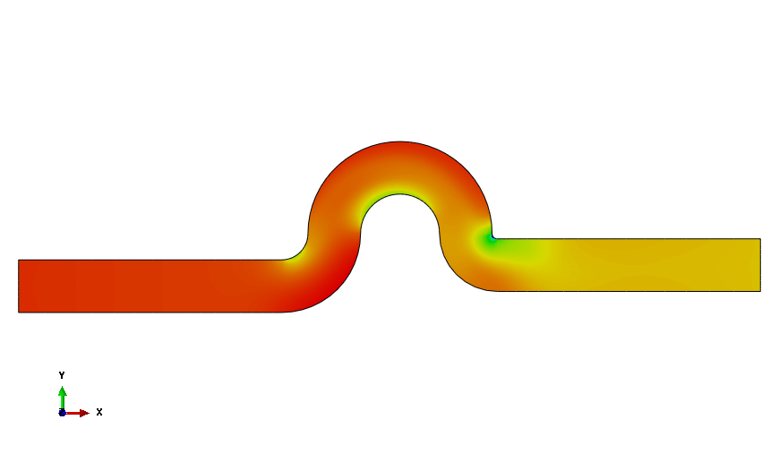

   i. 使用**Field Output**工具栏，选择**V**作为要绘制的输出变量。

      速度大小等值线图出现，如图E-16所示。

**图E-16** 速度大小等值线图。

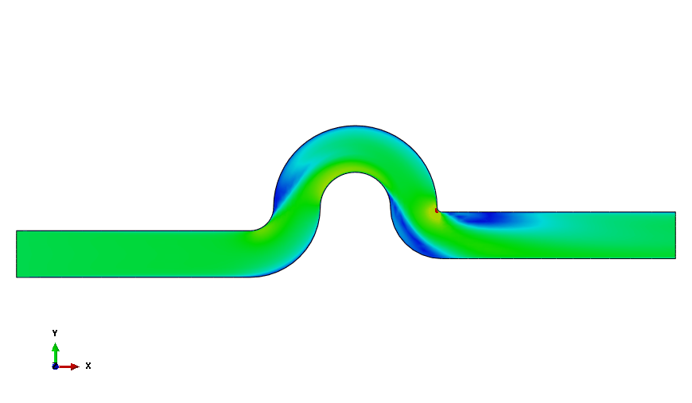

   j. 在工具箱中，点击**Animation**工具创建时间历史动画。选择输出变量（速度、压力等）以对结果进行动画处理。

3. 绘制湍流变量。

   a. 使用**Field Output**工具栏，选择**TURBNU**作为输出变量。

      Abaqus/CAE显示平滑的湍流粘度等值线图，如图E-17所示。

**图E-17** 湍流粘度等值线图。

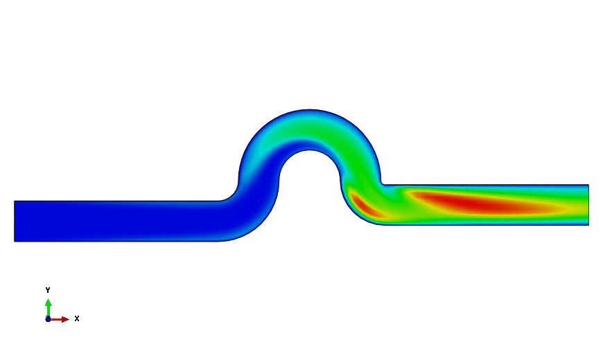

   b. 通过点击**View cut**工具关闭视图切割。

   c. 从**Views**工具栏中，选择等轴测视图。

   d. 使用**Field Output**工具栏，选择**YPLUS**作为输出变量。

      Abaqus/CAE在壁面表面创建无量纲壁面距离的平滑等值线图，如图E-18所示。

**图E-18** YPLUS等值线图。

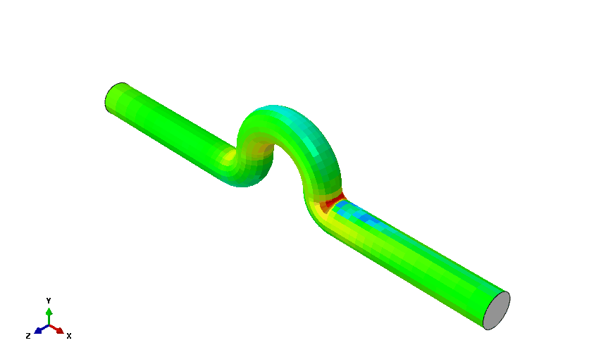

4. 验证质量平衡。

   a. 选择**Tools** → **XY Data** → **Create**。

   b. 在出现的**Create XY Data**对话框中，选择**ODB history output**作为源，点击**Continue**。

   c. 在**History Output**对话框中，选择入口和出口处的**MASSFLOW**输出，点击**Plot**，如图E-19所示。

**图E-19** 入口和出口处的质量流量。

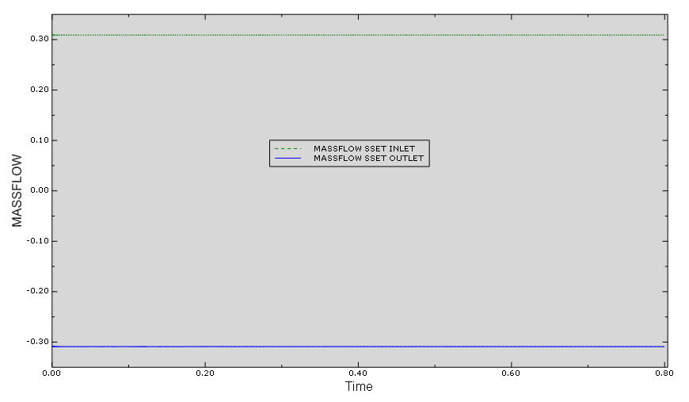

   d. 在**History Output**对话框中，点击**Save As**。

   e. 在**Save XY Data As**对话框中，选择**sum**作为**Save Operation**，将新的*X-Y*数据对象命名为`mass-balance`，点击**OK**。

      Abaqus/CAE创建表示入口和出口表面质量流量总和的图，如图E-20所示。该图验证了入口和出口质量流量是平衡的。

**图E-20** 质量流量之和。

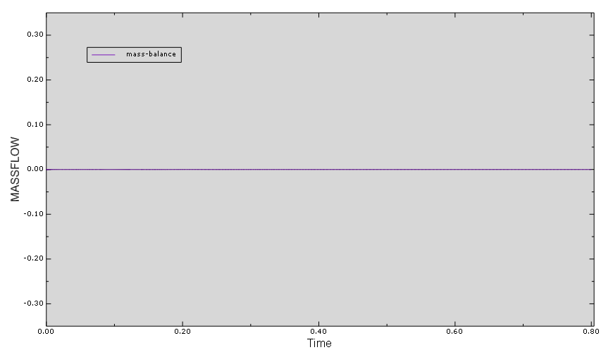

---

## E.6 创建流固耦合分析的流体模型

您现在将创建模型来执行可变形的管内流体流动的流固耦合分析。需要创建两个模型：一个用于流体流动，另一个用于管道的结构响应。您将首先创建流固耦合分析中使用的流体模型。

### E.6.1 定义流体模型

在本节中，您将把先前创建的流体模型复制到一个将用于流固耦合分析的新模型中。

**创建流体模型：**

1. 在模型树中，在名为**fluid-cfd**的模型上点击鼠标按钮3。

2. 从出现的菜单中选择**Copy Model**。

3. 将新模型命名为`fluid`，点击**OK**。

Abaqus/CAE创建流体模型。对该模型进行所有后续更改。

### E.6.2 修改分析步骤和输出请求

您现在将修改流固耦合分析的总分析时间。

**修改分析步骤及其输出请求：**

1. 修改名为`fluid`的模型中的CFD分析步骤。

   a. 在模型树中，展开**Steps**容器，双击**Step-1**。

      步骤编辑器出现。

   b. 在**Basic**标签页上，执行以下操作：

      i. 将描述修改为`Flow in a deformable hose`。

      ii. 将步骤的时间周期设置为`0.2`秒。

2. 修改输出请求。

   a. 在模型树中，展开**Field Output Requests**容器。

   b. 双击**F-Output-1**。

   c. 选择**Every x units of time**作为频率，输入`0.02`作为时间间隔。

   d. 点击**OK**。

   Abaqus/CAE对分析进行指定的更改。

### E.6.3 修改边界条件

您现在将修改边界条件。管道壁表面的无滑移/无穿透壁边界条件被抑制，因为流体速度和网格位移由耦合解决方案决定。因此，不需要指定此边界条件。

此外，由于激活了任意拉格朗日-欧拉（ALE）方法来适应管道的位移，网格变形解决方案需要适当的边界条件。

**修改边界条件：**

1. 抑制管道壁表面的无滑移/无穿透壁边界条件。

   a. 在模型树中，展开**fluid**模型的容器，展开其**BCs**容器。

   b. 在名为**noSlip**的边界条件上点击鼠标按钮3，从出现的菜单中选择**Suppress**。

   Abaqus/CAE抑制流体表面上的壁边界条件。

2. 通过在入口和出口边界处定义固定网格条件来创建网格位移边界条件。

   a. 在模型树中，双击**BCs**创建名为`fix-mesh`的新边界条件。

   b. 选择**Mechanical**作为类别，**Displacement/Rotation**作为类型，点击**Continue**。

   c. 选择`fluid-1.fixed`作为将应用边界条件的集合。

   d. 将**U1、U2**和**U3**设置为`0`。

   e. 点击**OK**关闭边界条件编辑器。

### E.6.4 定义流固相互作用

CFD模型包含一个曲面定义，表示与管道表面相互作用的流体区域。该曲面用于定义与结构模型的协同仿真相互作用。

**定义流固相互作用：**

1. 在模型树中，双击**Interactions**。

2. 将相互作用命名为`fsi`。

3. 选择**Step-1**作为定义它的步骤，接受**Fluid-Structure Co-simulation boundary**作为类型。

4. 选择`fluid-1.wall`作为将应用相互作用的曲面。

5. 点击**OK**关闭相互作用编辑器。

### E.6.5 指定协同仿真的CFD分析控制

改善收敛行为的推荐做法是指定固体与流体密度的比值。当该比值接近1时，这一点尤其重要，就像本分析中的情况（如下所示，管道密度为1100 kg/m³，意味着比值为1.1）。

您可以使用关键词编辑器在Abaqus/CAE中指定固体与流体密度的比值。

**指定CFD分析控制：**

1. 在模型树中，在**fluid**模型上点击鼠标按钮3，从出现的菜单中选择**Edit Keywords**。

   关键词编辑器出现。

2. 向下滚动，点击`/Co-simulation`选项块之前的选项块，点击**Add After**。

3. 输入以下内容：

   ```
   *Controls, type=FSI
    , , , 1.1
   ```

4. 点击**OK**。

   Abaqus/CAE保存您对CFD分析控制的更改。

---

## E.7 创建流固耦合分析的结构模型

您现在将为管道创建结构模型。

### E.7.1 定义模型

在模型树中，双击**Models**。在**Edit Model Attributes**对话框中，输入`solid`作为名称，选择**Standard & Explicit**作为模型类型。点击**OK**。

### E.7.2 定义部件

结构部件将基于用于定义流体的现有部件。您将修改结构部件以通过删除部件的现有特征并从实体创建壳来表示U形管道。

**定义部件：**

1. 从主菜单栏中，选择**Model** → **Copy Objects**。在**Copy Objects**对话框中，选择**fluid**作为**From model**，**solid**作为**To model**。

2. 展开**Parts**容器，选择**fluid**部件。

3. 点击**OK**。

   Abaqus/CAE将**fluid**部件从**fluid**模型复制到**solid**模型。

4. 重命名部件。在模型树中，展开**solid**模型下的**Parts**容器。在**fluid**部件上点击鼠标按钮3，从出现的菜单中选择**Rename**。

5. 在**Rename Part**对话框中，输入`solid`作为新名称，点击**OK**。

**删除固体部件的现有特征：**

1. 在模型树中，展开**solid**部件下的**Section Assignments**容器。

2. 在名为**fluid**的截面（已不再相关）上点击鼠标按钮3，从出现的菜单中选择**Delete**。点击**Yes**确认操作。

3. 展开**solid**部件下的**Sets**容器。

4. 选择所有集合，在选择上点击鼠标按钮3，从出现的菜单中选择**Delete**。点击**Yes**确认操作。

5. 重复此过程删除所有曲面和所有面及单元分区。

**从实体创建壳：**

1. 在Part模块中，从主菜单栏中选择**Tools** → **Geometry Edit**。在**Geometry Edit**对话框中，选择**Face**作为类别，**Remove**作为方法。

2. 选择表示入口和出口的面。

3. 在提示区域点击**Done**。

4. 当提示删除面时点击**OK**。

5. 关闭**Geometry Edit**对话框。

6. 在**solid**部件上点击鼠标按钮3，从出现的菜单中选择**Update Validity**。Abaqus/CAE更新部件的特征。

### E.7.3 定义分区

为部件分配偏置网格划分，我们首先对其进行分区。

**分区部件：**

1. 在模型树中，展开Parts容器下的**solid**项，双击出现的菜单中的**Mesh**。

2. 通过点击**Create Datum Plane: Offset From Principal Plane**工具创建基准平面。

3. 在提示区域点击**XY Plane**。接受默认偏移量`0.0`，按**[Enter]**。

4. 点击**Partition Face: Use Datum Plane**工具，沿管道长度创建分区。

5. 在视口中选择管道的所有面，在提示区域点击**Done**。

6. 选择上一步创建的基准平面，在提示区域点击**Create Partition**。

### E.7.4 创建集合和曲面

您现在将创建集合和曲面，它们将用于定义截面属性和边界条件。

**定义集合：**

1. 在模型树中，展开**solid**部件的容器。

2. 双击**Sets**。在**Create Set**对话框中，将集合命名为`all`，点击**Continue**。

3. 在视口中选择整个几何体，在提示区域点击**Done**。

   Abaqus/CAE创建包含整个部件的集合。

4. 重复此过程创建名为`ends`的集合，其中包含管道入口和出口区域的边缘。

**定义曲面：**

1. 在模型树中，展开**solid**部件的容器。

2. 双击**Surfaces**。在**Create Surface**对话框中，将曲面命名为`inner`，点击**Continue**。

3. 在提示区域，选择**by angle**作为选择技术。选择管道的表面。

4. 在提示区域，选择与管道内表面关联的颜色（紫色）。

5. 重复前面的步骤，通过选择壳的外表面（棕色）创建名为`outer`的曲面。

### E.7.5 指定材料和截面属性

创建模型的下一步是定义材料属性并将其分配给结构部件。模型的每个区域必须引用截面属性。在本模型中，我们使用线性弹性材料模型对柔性橡胶材料进行建模。材料属性包括密度为1100 kg/m³、弹性模量为1 MPa、泊松比为0.45。管道厚度假定为2 mm。

**定义材料属性：**

1. 在模型树中，双击**Materials**创建名为`elastic`的新材料。

2. 从材料编辑器的**General**菜单中，选择**Density**并输入值`1100` kg/m³。

3. 从材料编辑器的**Mechanical**菜单中，选择**Elasticity** → **Elastic**。

4. 输入`1.e6` Pa作为**Young's Modulus**，`0.45`作为**Poisson's Ratio**。

5. 点击**OK**。

**定义壳截面：**

1. 在模型树中，双击**Sections**创建名为`shell`的新截面。

2. 选择**Shell**作为类别，**Homogeneous**作为类型。点击**Continue**。

3. 在**Edit Section**对话框中，输入`0.002`作为常数壳厚度。

4. 选择**elastic**作为材料。

5. 点击**OK**。

**分配壳截面：**

1. 在模型树中，展开**Parts**容器。展开名为**solid**的部件的容器。

2. 双击**Section Assignments**。

3. 在提示区域，点击**Sets**。在**Region Selection**对话框中，选择**all**并点击**Continue**。

4. 在提示区域点击**Done**。

5. 在截面分配编辑器中，选择先前创建的**shell**截面，点击**OK**。

### E.7.6 创建网格

您现在将为管道结构创建网格。

**创建网格：**

1. 在模型树中，展开**Parts**容器下的**solid**项，双击出现的菜单中的**Mesh**。

   请注意，整个管道显示为粉红色，这意味着部件可以使用默认的自由网格划分技术进行网格划分。

2. 将网格划分技术更改为扫掠。

   a. 从主菜单栏中，选择**Mesh** → **Controls**。

   b. 在视口中选择整个部件以分配新控件，在提示区域点击**Done**。

   c. 在**Mesh Controls**对话框中，选择**Sweep**作为技术，点击**OK**。

   Abaqus/CAE在当前视口中将部件的颜色更改为黄色。

3. 分配网格种子。您为管道的入口和出口区域创建偏置种子。这种种子方法创建的网格在入口和出口处轴向较粗，在管道中间截面处较细。

   a. 点击**Seed Edges**工具，在提示区域点击**Select in Viewport**（如有必要）。

   b. 在视口中，选择入口和出口区域沿中平面运行的直边缘，点击**Done**。

   c. 在**Local Seeds**对话框中，选择**By size**作为方法，**Single**作为偏置类型，输入`0.0045`作为最小尺寸，`0.01`作为最大尺寸。

   d. 确保种子偏置使得种子集中在管道入口和出口区域之外（即每个箭头应指向轴向内侧）。翻转违反此条件的任何箭头的方向。

4. 设置全局种子尺寸。

   a. 点击**Seed Part**工具。

   b. 在**Global Seeds**对话框中，输入`0.004`作为近似全局尺寸。

   c. 接受所有其他默认值，点击**OK**。

   Abaqus/CAE为部件设置全局种子尺寸。

5. 为部件划分网格。

   a. 点击**Mesh Part**工具。

   b. 在提示区域点击**Yes**。

   Abaqus/CAE为部件创建网格，约有950个壳单元。

### E.7.7 创建装配

您现在将在装配中创建部件的实例以将其包含在模型中。

**实例化部件：**

1. 在模型树中，展开**Assembly**容器，双击列表中出现的**Instances**以创建部件的实例。

2. 在**Create Instance**对话框中，从**Parts**列表中选择**solid**，点击**OK**。

### E.7.8 指定步骤和输出请求

您现在将定义分析步骤。使用隐式动态过程来模拟管道的结构响应。

**定义隐式动态分析步骤：**

1. 在模型树中，双击**Steps**。

2. 在**Create Step**对话框中，接受默认过程类型（**General**）和默认名称（`Step-1`）。从可用过程列表中，选择**Dynamic, Implicit**并点击**Continue**。

3. 在步骤编辑器的**Basic**标签页上，执行以下操作：

   a. 输入`deformation of the tube`作为描述。

   b. 输入`0.2`秒作为时间周期。

   c. 切换**Nlgeom**。

   d. 选择**Transient fidelity**作为应用类型。

4. 在步骤编辑器的**Incrementation**标签页上，执行以下操作：

   a. 输入`1000`作为最大增量数。

   b. 输入`0.001`作为初始增量大小。

   c. 输入`2.e-6`作为最小增量大小。

   d. 为**Half-increment Residual**切换**Suppress calculation**。

5. 点击**OK**创建步骤。

**定义输出请求：**

1. 在模型树中，展开**Field Output Requests**容器。

2. 双击**F-Output-1**。

3. 选择**Every x units of time**作为输出频率，输入`0.02`作为时间间隔。

4. 接受默认输出变量，点击**OK**。

### E.7.9 定义边界条件

管道在每端固定，因此您需要为包含管道末端的集合定义完全固定边界条件。

**定义边界条件：**

1. 在模型树中，双击**solid**模型下的**BCs**。

2. 在**Create Boundary Condition**对话框中，将边界条件命名为`fixed-ends`，选择**Initial**作为步骤。

3. 接受**Mechanical**作为类别，选择**Symmetry/Antisymmetry/Encastre**作为类型。

4. 在提示区域点击**Sets**。

5. 在**Region Selection**对话框中，选择名为**solid-1.ends**的集合，点击**Continue**。

6. 在**Edit Boundary Condition**对话框中，选择**Encastre**并点击**OK**。

   Abaqus/CAE创建边界条件。

### E.7.10 创建流固相互作用

结构模型包含一个曲面定义，表示与流体相互作用的管道区域。该曲面用于定义与Abaqus/CFD模型的协同仿真相互作用。

**创建流固相互作用：**

1. 在模型树中，双击**Interactions**。

2. 将相互作用命名为`fsi`。

3. 在**Create Interaction**对话框中，选择**Step-1**作为步骤，**Fluid-Structure Co-simulation boundary**作为类型。点击**Continue**。

4. 在**Region Selection**对话框中，选择**solid-1.inner**作为将应用相互作用的曲面，点击**Continue**。

5. 在相互作用编辑器中，点击**OK**。

   Abaqus/CAE创建流固相互作用。

---

## E.8 创建流固耦合分析的协同仿真作业

为了执行流固耦合分析，Abaqus/Standard和Abaqus/CFD作业需要同时执行。进行协同仿真，两个求解器在每个协同仿真目标时间交换信息。协同仿真目标时间自动选择为结构或CFD求解器所需的最小时间增量。为了促进两个分析的协同仿真，使用协同执行作业过程。协同执行作业创建两个分析作业并同时运行它。它还自动提供两个分析作业之间通信所需的命令行选项。您现在将创建一个协同仿真作业。

**创建协同仿真作业：**

1. 在模型树中，展开**Analysis**容器。

2. 双击**Co-executions**，创建名为`uhose`的协同执行。

3. 在**Edit Co-execution**对话框中：

   a. 选择**fluid**作为第一个模型。接受默认作业名称。

   b. 选择**solid**作为第二个模型。接受默认作业名称。

4. 点击**OK**。

在模型树中，展开**Co-executions**容器，然后展开**uhose**容器。展开**uhose**下的**Jobs**容器。创建了两个分析作业：一个代表Abaqus/Standard模型，另一个代表Abaqus/CFD模型。

---

## E.9 运行和监控流固耦合协同仿真分析

您现在将从Abaqus/CAE内部运行协同执行作业。

**运行协同执行作业：**

1. 在名为**uhose**的协同执行作业上点击鼠标按钮3。

2. 从出现的菜单中选择**Submit**。

   Abaqus/CAE启动协同执行作业。Abaqus/Standard和Abaqus/CFD作业都已启动。

   协同执行运行时，您可以通过在名为**uhose-fluid**的CFD分析作业上点击鼠标按钮3并从出现的菜单中选择**Monitor**来监控其进度。请注意，Abaqus/CAE在每个时间增量时更新散度（RMS）和动能。

   您也可以监控名为**uhose-solid**的Abaqus/Standard作业的进度。

---

## E.10 查看流固耦合协同仿真分析结果

您可以显示流固耦合协同仿真分析的结果。

**查看流固耦合协同仿真分析结果：**

1. 在名为**uhose**的协同执行上点击鼠标按钮3。

2. 从出现的菜单中选择**Results**。

   输出数据库文件`uhose-solid.odb`和`uhose-fluid.odb`同时在可视化模块中打开，并覆盖在视口中。

3. 选择**View** → **Overlay Plot**。在**Overlay Plot Layer Manager**中，选择包含固体材料的层，点击**Plot Single**。

4. 显示位移大小的等值线，如图E-21所示。

**图E-21** 管道的变形。

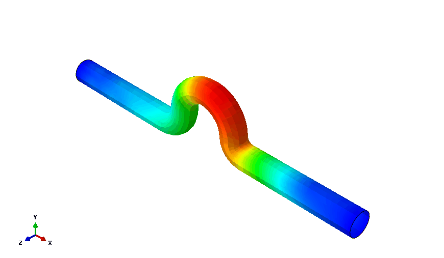

---

*本文档由ABAQUS Getting Started with Abaqus: Interactive Edition (6.14) 自动生成*
